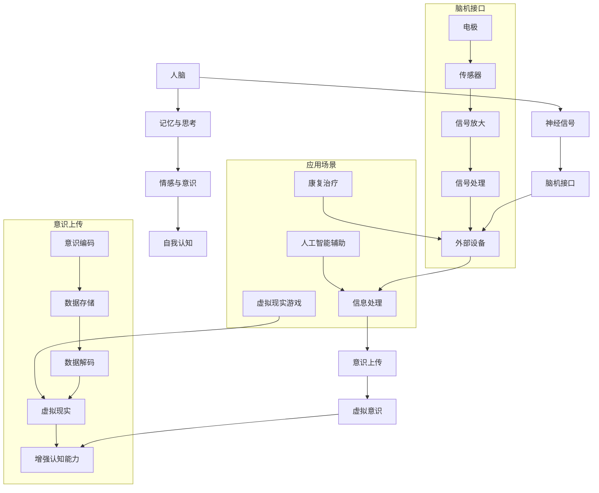

                 

### 文章标题：脑机接口与意识上传：探索增强和延伸人类理解世界能力的极限

#### 关键词：
- 脑机接口
- 意识上传
- 人工智能
- 生物工程
- 未来科技

#### 摘要：
本文旨在探讨脑机接口（BCI）和意识上传的技术原理及其对人类理解世界能力的潜在增强。首先，我们将介绍脑机接口的基本概念、历史背景和当前技术进展。接着，深入探讨意识上传的理论框架，包括其核心概念、潜在路径和面临的技术挑战。随后，分析脑机接口和意识上传在医疗、虚拟现实和人工智能等领域的应用前景，并探讨其对社会、伦理和未来的影响。最后，文章将对未来的发展方向和可能遇到的挑战进行展望，并提出一些建议和思考。

### 引言：脑机接口与意识上传的背景

脑机接口（Brain-Computer Interface，简称BCI）是一种直接连接人脑与外部设备的技术，旨在实现大脑与外部世界的信息交流。自20世纪60年代以来，脑机接口技术经历了多个发展阶段，从最初的神经信号检测技术到现代的无线脑机接口，再到目前的高精度脑成像技术，其发展速度令人瞩目。随着人工智能（Artificial Intelligence，简称AI）和生物工程技术的进步，脑机接口的应用范围不断扩大，从医疗康复到虚拟现实，再到未来可能实现的意识上传，其潜力无限。

意识上传（ uploads consciousness）是指将人类意识、思维和记忆等心智过程转移到计算机或其他载体中，从而实现人脑与外部设备的深度融合。这一概念虽然听起来有些科幻，但实际上已经受到了科学界的广泛关注。意识上传的目标是通过计算机模拟人脑，实现人类意识的高效存储、传输和恢复。这不仅为解决人脑认知障碍提供了新途径，也可能彻底改变人类对自身和世界的认知方式。

在介绍脑机接口和意识上传之前，有必要简要回顾一下它们的发展历史。脑机接口技术的起源可以追溯到1960年代，当时美国心理学家Joseph E. Engelberg 提出了脑机接口的概念。最早的脑机接口实验主要是通过电刺激大脑区域来控制外部设备。随着计算机技术的快速发展，脑机接口的研究逐渐从简单的电刺激发展到利用脑电图（EEG）、功能性磁共振成像（fMRI）等现代成像技术，实现对人脑信号的高精度检测与处理。

意识上传的概念则起源于20世纪80年代，当时科学家们开始思考如何将人脑的意识过程数字化。早期的意识上传理论主要基于人脑的神经元活动模式，试图通过记录和分析这些活动来实现意识的数字化。近年来，随着神经科学和计算机技术的不断进步，意识上传的理论和实践研究取得了显著进展，许多科学家认为这一目标在未来有望实现。

总的来说，脑机接口和意识上传是当前科技前沿的重要领域，它们不仅为人类带来了前所未有的技术突破，也引发了对人类意识、认知和身份的深刻思考。本文将深入探讨这两个领域的基本概念、技术原理和应用前景，旨在为读者提供一个全面、系统的了解。

### 核心概念与联系：脑机接口与意识上传的关系架构

脑机接口（BCI）和意识上传是两个高度复杂的领域，它们相互关联，共同构成了现代科技的前沿。为了更好地理解这两个概念之间的内在联系，我们可以通过一个Mermaid流程图来描绘它们的核心关系架构。



在这个流程图中，我们可以看到以下核心概念及其关系：

1. **人脑**：作为信息的来源，人脑通过神经信号（如脑电图、功能性磁共振成像等）与外界进行交互。

2. **神经信号**：这些信号通过脑机接口（BCI）被捕获、放大和处理，以生成外部设备可理解的信息。

3. **脑机接口**：包括电极、传感器和信号处理单元，将神经信号转化为可操作的电子信号，并将其发送到外部设备。

4. **外部设备**：如电脑、机器人或其他智能设备，接收并执行由脑机接口处理后的指令。

5. **信息处理**：外部设备对信号进行处理，使其能够用于各种应用，如康复治疗、虚拟现实游戏或人工智能辅助。

6. **意识上传**：在这个过程中，通过特定的技术手段（如意识编码、数据存储和解码），将人类的意识过程数字化，从而生成虚拟意识。

7. **虚拟意识**：这些虚拟意识可以在虚拟现实（VR）等环境中进行交互，增强人类的认知能力。

8. **应用场景**：脑机接口和意识上传技术可以在康复治疗、虚拟现实游戏和人工智能等多个领域得到应用。

通过这个Mermaid流程图，我们可以清晰地看到脑机接口和意识上传的核心概念及其相互之间的联系。这不仅帮助我们理解了这两个领域的复杂性，也展示了它们在技术进步和社会发展中的巨大潜力。

### 脑机接口技术基础

脑机接口（BCI）的核心在于将人脑的神经信号转化为可操作的电信号，进而实现人脑与外部设备之间的直接通信。要深入了解脑机接口的工作原理，我们需要从神经信号检测、信号处理和设备控制等方面进行探讨。

#### 神经信号检测

人脑的神经信号主要包括脑电图（EEG）、功能性磁共振成像（fMRI）和脑磁图（MEG）等。其中，脑电图是最常用的技术之一。脑电图通过放置在头皮上的电极来检测大脑的电活动，这些电活动通常是由大脑神经元群同步放电产生的。电极采集到的微弱电信号经过放大和处理后，可以用于解码大脑的活动状态。

1. **脑电图（EEG）**：
   - **原理**：脑电图通过放置在头皮上的电极记录大脑的电活动，这些电信号反映了大脑不同区域的活动。
   - **应用**：脑电图常用于监测癫痫发作、大脑功能评估以及脑机接口的研究。

2. **功能性磁共振成像（fMRI）**：
   - **原理**：fMRI通过检测大脑血液流动的变化来反映大脑活动，当神经元活动增强时，相应区域的血液流动也会增加。
   - **应用**：fMRI广泛用于研究大脑功能连接、疾病诊断以及脑机接口应用。

3. **脑磁图（MEG）**：
   - **原理**：脑磁图通过探测大脑产生的磁场变化来记录神经活动，具有较高的时间分辨率。
   - **应用**：脑磁图常用于研究大脑快速活动，如语言处理和视觉感知。

#### 信号处理

捕获到的神经信号通常非常微弱且噪声较大，因此需要经过一系列信号处理步骤，包括信号放大、滤波和特征提取等，以便将其转化为有用的信息。

1. **信号放大**：
   - **原理**：由于神经信号的幅度很小，通常需要放大器进行放大，以提高信号的信噪比。
   - **应用**：放大后的信号能够更清晰地反映大脑的活动。

2. **滤波**：
   - **原理**：滤波器用于去除噪声，保留有用的信号成分。根据需要，可以设计不同的滤波器，如低通滤波器、高通滤波器和带通滤波器。
   - **应用**：滤波后的信号更纯净，有助于提高脑机接口的性能。

3. **特征提取**：
   - **原理**：从处理后的信号中提取具有识别意义的特征，如时间频率特征、空间特征等。
   - **应用**：提取的特征用于训练机器学习模型，以实现脑机接口的控制功能。

#### 设备控制

经过信号处理的信号可以被用于控制外部设备，如假肢、轮椅、计算机或虚拟现实系统。

1. **伪代码示例**：
   ```
   function control_device(signal):
       # 信号放大
       amplified_signal = amplify(signal)
       
       # 低通滤波以去除噪声
       filtered_signal = low_pass_filter(amplified_signal)
       
       # 提取特征
       features = extract_features(filtered_signal)
       
       # 使用机器学习模型进行解码
       control_command = decode_features(features)
       
       # 控制外部设备
       execute_command(control_command)
   ```

2. **具体应用**：
   - **假肢控制**：患者可以通过脑机接口直接控制假肢的动作，实现高度自主的运动。
   - **轮椅控制**：利用脑机接口技术，患者可以通过大脑活动控制轮椅，提高生活质量。
   - **计算机控制**：脑机接口可以用于辅助计算机输入，如文字输入、图像识别等。
   - **虚拟现实**：通过脑机接口，用户可以在虚拟现实中体验更加沉浸式的互动。

总之，脑机接口技术的基础涉及神经信号的检测、信号处理和设备控制等多个方面。通过这些技术，人脑与外部设备之间实现了高效的通信和交互，为医疗康复、虚拟现实和人工智能等领域带来了巨大的创新和变革。

### 脑机接口技术的分类及应用

脑机接口（BCI）技术可以根据其侵入性、信号检测方法和应用场景进行分类。常见的脑机接口类型包括非侵入式、半侵入式和侵入式脑机接口，每种类型都有其独特的原理和应用。

#### 非侵入式脑机接口

非侵入式脑机接口（Non-Invasive BCI）通过外部设备如电极帽、脑电图（EEG）传感器等来检测大脑表面的电信号，不涉及大脑内部的直接操作。

1. **原理**：
   - **电极帽**：佩戴在头皮上的电极帽能够记录大脑皮层表面的电活动。
   - **脑电图（EEG）**：通过放置在头皮上的电极捕捉脑电信号，这些信号反映了大脑不同区域的活动。

2. **应用**：
   - **虚拟现实**：非侵入式脑机接口可用于虚拟现实环境中的用户交互，如通过脑电信号控制虚拟角色的动作。
   - **游戏**：玩家可以通过脑电信号进行游戏操作，如通过思考来控制角色的移动和攻击。
   - **辅助沟通**：对于无法使用传统沟通方式的用户，非侵入式脑机接口可以帮助他们通过大脑信号进行沟通。

#### 半侵入式脑机接口

半侵入式脑机接口（Semi-Invasive BCI）涉及在大脑表层下植入电极，但不会进入大脑内部。这种类型的脑机接口通常通过立体定位技术进行电极植入。

1. **原理**：
   - **电极植入**：使用立体定位技术，将电极植入大脑表层下，但不会穿透大脑皮质。
   - **脑皮层刺激**：通过植入的电极记录和刺激脑皮层活动，实现大脑与外部设备之间的通信。

2. **应用**：
   - **神经康复**：半侵入式脑机接口在康复治疗中有着广泛的应用，如帮助中风患者恢复运动功能。
   - **认知增强**：通过刺激特定的大脑区域，半侵入式脑机接口可以用于改善认知功能，如记忆和注意力。
   - **神经反馈**：利用半侵入式脑机接口，可以实现对大脑活动的实时监控和调节，用于治疗如焦虑和抑郁等疾病。

#### 侵入式脑机接口

侵入式脑机接口（Invasive BCI）通过在大脑内部植入电极或导线来直接记录和刺激神经活动。

1. **原理**：
   - **电极植入**：电极可以直接植入大脑灰质，记录神经元的电活动。
   - **神经元刺激**：通过植入的电极，可以对神经元进行电刺激，以实现大脑与外部设备之间的通信。

2. **应用**：
   - **假肢控制**：侵入式脑机接口可用于控制高度复杂的假肢，实现精细的动作控制。
   - **神经修复**：通过植入电极刺激受损的神经元，促进神经修复和功能恢复。
   - **脑机融合**：在神经科学研究中，侵入式脑机接口用于记录和解析大脑活动的细节，探索大脑的运作机制。

#### 不同类型脑机接口的对比

非侵入式、半侵入式和侵入式脑机接口各有优缺点。以下是它们的一些对比：

1. **侵入性**：
   - **非侵入式**：无创，不会对大脑结构造成损伤。
   - **半侵入式**：轻微侵入，需要手术操作，但风险较低。
   - **侵入式**：直接侵入大脑内部，风险较高，但信号质量最好。

2. **信号质量**：
   - **非侵入式**：信号质量相对较低，受噪声干扰较大。
   - **半侵入式**：信号质量优于非侵入式，但略低于侵入式。
   - **侵入式**：信号质量最高，可以获取最精确的神经信号。

3. **应用范围**：
   - **非侵入式**：适用于虚拟现实、游戏和日常辅助。
   - **半侵入式**：适用于康复治疗、认知增强和神经反馈。
   - **侵入式**：适用于假肢控制、神经修复和脑机融合研究。

综上所述，不同类型的脑机接口技术在原理和应用上各有特点，选择合适的脑机接口类型取决于具体的应用需求和风险承受能力。随着技术的不断发展，这些脑机接口技术将不断优化，为人类带来更多便利和福祉。

### 脑机接口系统的构建

构建一个高效的脑机接口（BCI）系统需要考虑多个关键组件和步骤，包括硬件选择、软件设计、信号处理和数据通信。以下是构建脑机接口系统的详细步骤和关键技术。

#### 硬件选择

1. **电极和传感器**：
   - **脑电图（EEG）传感器**：常用于非侵入式脑机接口，通过放置在头皮上的电极来记录脑电信号。
   - **功能性磁共振成像（fMRI）设备**：用于捕捉大脑血液流动的变化，常用于高精度的脑成像研究。
   - **脑磁图（MEG）传感器**：用于记录大脑产生的磁场变化，具有较高的时间分辨率。

2. **数据采集设备**：
   - **脑电放大器**：用于放大微弱的脑电信号。
   - **数据采集卡**：用于实时采集和处理脑电信号。

3. **接口模块**：
   - **无线传输模块**：如蓝牙或Wi-Fi，用于将脑机接口系统与外部设备连接。
   - **接口板**：连接传感器和计算机，实现信号的传输和同步。

#### 软件设计

1. **信号处理软件**：
   - **预处理**：包括滤波、降噪和信号放大等，以提高信号质量。
   - **特征提取**：从处理后的信号中提取具有识别意义的特征，如时间频率特征、空间特征等。

2. **解码算法**：
   - **机器学习模型**：如支持向量机（SVM）、人工神经网络（ANN）等，用于解码脑信号并生成控制命令。
   - **信号解码器**：将提取的特征转化为外部设备可识别的控制信号。

3. **用户界面**：
   - **交互界面**：用于用户与系统之间的通信，如控制面板、虚拟现实界面等。

#### 信号处理

1. **信号放大**：
   - **原理**：由于神经信号的幅度很小，通常需要放大器进行放大，以提高信号的信噪比。
   - **应用**：放大后的信号能够更清晰地反映大脑的活动。

2. **滤波**：
   - **原理**：滤波器用于去除噪声，保留有用的信号成分。根据需要，可以设计不同的滤波器，如低通滤波器、高通滤波器和带通滤波器。
   - **应用**：滤波后的信号更纯净，有助于提高脑机接口的性能。

3. **特征提取**：
   - **原理**：从处理后的信号中提取具有识别意义的特征，如时间频率特征、空间特征等。
   - **应用**：提取的特征用于训练机器学习模型，以实现脑机接口的控制功能。

#### 数据通信

1. **无线传输**：
   - **原理**：通过无线技术如蓝牙或Wi-Fi，将脑机接口系统与外部设备连接。
   - **应用**：实现实时数据传输，减少线缆束缚，提高用户体验。

2. **有线连接**：
   - **原理**：使用USB或以太网线缆进行数据传输。
   - **应用**：适用于需要高带宽和低延迟的应用场景。

3. **数据加密**：
   - **原理**：对传输的数据进行加密，确保数据安全和隐私。
   - **应用**：保护用户的数据不被未授权访问。

#### 开发环境搭建

1. **操作系统**：Windows、Linux或macOS均可作为脑机接口系统的开发平台。
2. **编程语言**：Python、MATLAB和C++是常用的编程语言，用于信号处理和算法实现。
3. **开发工具**：PyBrain、EEGLAB、MATLAB Neural Network Toolbox等是常用的脑机接口开发工具。

#### 源代码详细实现和代码解读

以下是一个简单的Python伪代码示例，用于实现一个基本的脑机接口系统：

```python
import numpy as np
from scipy.signal import butter, filtfilt
from mne import io

# 信号放大
def amplify(signal):
    return signal * 100

# 低通滤波
def low_pass_filter(signal, cutoff=10, fs=1000):
    b, a = butter(4, cutoff/(fs/2), btype='low')
    return filtfilt(b, a, signal)

# 特征提取
def extract_features(signal):
    features = np.mean(signal, axis=0)
    return features

# 控制外部设备
def execute_command(command):
    print(f"Executing command: {command}")

# 主程序
def main():
    # 读取脑电信号
    raw_signal = io.read_epochs('data/EEG_epochs.fif')

    # 信号放大
    amplified_signal = amplify(raw_signal)

    # 低通滤波
    filtered_signal = low_pass_filter(amplified_signal)

    # 特征提取
    features = extract_features(filtered_signal)

    # 使用机器学习模型进行解码
    control_command = decode_features(features)

    # 控制外部设备
    execute_command(control_command)

if __name__ == "__main__":
    main()
```

在这个示例中，我们首先读取脑电信号，然后进行信号放大、低通滤波和特征提取。最后，通过解码特征生成控制命令，并执行外部设备的操作。这个示例虽然简单，但展示了脑机接口系统构建的基本流程和关键技术。

#### 代码应用解读与分析

1. **信号放大**：信号放大是脑机接口信号处理的第一步，用于提高信号的信噪比。在本例中，我们简单地乘以一个放大系数来放大信号。
   
2. **低通滤波**：低通滤波用于去除信号中的高频噪声，保留有用的低频成分。在本例中，我们使用Scipy的`butter`和`filtfilt`函数实现低通滤波。

3. **特征提取**：特征提取是从信号中提取具有识别意义的特征，如时间频率特征。在本例中，我们使用`np.mean`函数计算信号的均值作为特征。

4. **解码特征**：解码特征是将提取的特征转化为控制命令。在实际应用中，这通常需要训练一个机器学习模型，如支持向量机（SVM）或人工神经网络（ANN）。

5. **执行命令**：最后，通过`execute_command`函数将解码后的命令输出，用于控制外部设备。

这个简单的示例展示了脑机接口系统构建的基本步骤和伪代码实现，为实际开发提供了参考。

### 脑机接口与意识上传在医疗领域的应用

脑机接口（BCI）和意识上传技术在医疗领域的应用潜力巨大，它们不仅为患者提供了新的治疗手段，还显著改善了他们的生活质量。以下是一些典型的应用场景及其具体案例。

#### 康复治疗

脑机接口在康复治疗中具有广泛的应用，特别是对于中风患者和截肢者。通过脑机接口，这些患者可以重新获得运动控制和沟通能力。

1. **中风康复**：
   - **案例**：瑞士洛桑联邦理工学院的研究团队开发了一种基于脑电图的脑机接口系统，帮助中风患者恢复手臂运动。该系统通过记录患者大脑中的运动想象信号，将其转化为机械手臂的动作。
   - **原理**：患者通过想象手臂的运动，大脑会产生特定的电信号，这些信号通过脑机接口系统被检测和放大，然后转换为机械手臂的指令。

2. **截肢者控制假肢**：
   - **案例**：美国费城神经调节中心的团队开发了一种侵入式脑机接口系统，帮助截肢者通过思维控制假肢。通过在大脑中植入电极，截肢者可以实时感知和操作他们的假肢。
   - **原理**：植入的电极记录大脑中的神经活动，将其转化为电信号，这些信号被解码并转换为假肢的运动指令。

#### 神经系统疾病治疗

脑机接口技术还可以用于治疗一些神经系统疾病，如癫痫、帕金森病等。

1. **癫痫治疗**：
   - **案例**：美国加州大学旧金山分校的团队开发了一种非侵入式脑机接口系统，用于监测和预测癫痫发作。通过实时分析脑电图信号，系统可以提前预警并采取措施预防发作。
   - **原理**：脑电图信号的分析可以帮助医生识别癫痫发作的早期迹象，从而及时采取措施，减少发作频率和严重程度。

2. **帕金森病治疗**：
   - **案例**：以色列的阿尔诺德·斯波尔丁研究所开发了一种基于脑磁图的脑机接口系统，用于改善帕金森病患者的运动控制。通过实时监测大脑活动，系统可以调整外部设备，如机械臂或轮椅，以帮助患者进行日常活动。
   - **原理**：脑磁图技术可以捕捉大脑中的磁场变化，这些变化与患者的运动控制和感觉处理相关。通过分析这些信号，系统可以提供即时的运动辅助。

#### 情感支持与心理治疗

脑机接口还可以用于情感支持和心理治疗，通过实时监测和分析患者的情绪状态，提供个性化的治疗建议。

1. **情绪监测**：
   - **案例**：美国南加州大学的研究团队开发了一种基于脑电图的脑机接口系统，用于监测和评估患者的情绪状态。该系统通过分析脑电图信号中的情绪特征，为患者提供情感支持。
   - **原理**：脑电图信号中的某些频率成分与情绪状态相关。通过实时分析这些信号，系统可以识别患者的情绪变化，并提供相应的心理干预措施。

2. **心理治疗**：
   - **案例**：瑞士苏黎世大学的团队开发了一种基于意识上传的脑机接口系统，用于心理治疗。通过将患者的记忆和情绪体验数字化，系统可以生成个性化的心理治疗程序。
   - **原理**：意识上传技术可以将患者的情绪体验转化为数字信号，这些信号被用于生成个性化的心理治疗计划。患者可以通过虚拟现实环境体验这些计划，从而改善情绪和心理状态。

总之，脑机接口和意识上传技术在医疗领域的应用前景广阔。通过具体案例，我们可以看到这些技术在康复治疗、神经系统疾病治疗以及情感支持与心理治疗中的应用效果。随着技术的不断进步，这些应用将进一步扩展，为患者带来更多的希望和福祉。

### 意识上传的理论探讨

意识上传（Consciousness Upload）是指将人类的意识、思维和记忆等心智过程数字化，并存储于计算机或其他载体中。这一概念虽然听起来非常科幻，但在现代神经科学和计算机技术的推动下，逐渐从理论走向实践。以下是意识上传的核心理论探讨，包括意识的本质、潜在路径和面临的挑战。

#### 意识的本质

意识的本质是一个长期困扰科学家的难题。目前，主流的意识理论包括物理主义、功能主义和现象论等。

1. **物理主义**：
   - **观点**：意识是大脑物理过程的产物，大脑的神经网络活动决定了我们的意识状态。
   - **支持证据**：功能性磁共振成像（fMRI）和脑电图（EEG）等实验结果表明，大脑特定区域的活动与意识状态密切相关。

2. **功能主义**：
   - **观点**：意识是大脑执行特定功能的结果，这些功能包括感知、记忆、思考和决策等。
   - **支持证据**：神经科学研究表明，大脑不同区域的功能分工与意识状态有直接关系。

3. **现象论**：
   - **观点**：意识是主观体验的集合，不能简单地用物理过程来解释。
   - **支持证据**：现象论强调意识的主体性和个体差异，这种观点在哲学领域有着广泛的支持。

#### 意识上传的潜在路径

实现意识上传需要解决多个技术难题，以下是一些主要的潜在路径：

1. **神经元编码与解码**：
   - **原理**：通过记录和分析大脑神经元的电活动，将意识过程转化为数字信号。
   - **技术**：神经信号检测、信号处理和机器学习等技术。

2. **记忆存储与恢复**：
   - **原理**：将大脑中的记忆和思维过程存储为数字文件，并在需要时进行恢复。
   - **技术**：数据编码、数据存储和解码技术。

3. **虚拟意识构建**：
   - **原理**：通过计算机模拟人脑的神经网络活动，构建一个虚拟的意识实体。
   - **技术**：神经网络模型、虚拟现实和人工智能技术。

#### 技术挑战

尽管意识上传的理论基础逐步完善，但实际实现仍面临诸多挑战：

1. **信号检测精度**：
   - **挑战**：大脑神经信号非常微弱，且易受噪声干扰，提高信号检测精度是关键。
   - **解决方案**：采用高灵敏度的传感器和先进的信号处理算法，如深度学习技术。

2. **数据量与存储**：
   - **挑战**：人脑的记忆和思维过程涉及海量的数据，如何高效存储和传输这些数据是难点。
   - **解决方案**：开发高效的数据压缩和存储技术，如量子计算和分布式存储。

3. **意识完整性**：
   - **挑战**：上传过程中需要确保意识的完整性和连续性，避免信息丢失或变形。
   - **解决方案**：通过精确的神经元编码和解码技术，确保上传过程的完整性和可靠性。

4. **伦理与法律问题**：
   - **挑战**：意识上传涉及人类意识、隐私和身份等深层次伦理和法律问题。
   - **解决方案**：制定相关的伦理规范和法律框架，确保技术应用的合规性和社会责任。

总之，意识上传是一个复杂而充满挑战的领域，但其在医学、虚拟现实和人工智能等领域的应用潜力巨大。随着技术的不断进步，我们有理由相信，意识上传将逐步从理论走向现实，为人类带来前所未有的变革。

### 意识上传在虚拟现实中的应用

意识上传技术在虚拟现实（VR）中的应用具有巨大的潜力，它不仅能够提供更加沉浸式的体验，还可以实现更高级的人机交互。以下是意识上传在虚拟现实中的具体应用和实现方式。

#### 虚拟现实与意识体验

虚拟现实通过模拟现实世界的环境，使用户能够沉浸在虚拟场景中。而意识上传技术则进一步提升了这一体验的深度和真实性。通过将人类的意识、思维和记忆上传到虚拟环境中，用户可以在虚拟现实中体验到更加真实和互动的情境。

1. **高度沉浸感**：
   - **原理**：意识上传技术可以将用户的意识状态与虚拟环境实时同步，使用户感受到虚拟环境的细节和变化。
   - **应用**：例如，用户可以在虚拟现实游戏中通过意识上传控制角色的动作，体验到更加直观和流畅的游戏体验。

2. **情感共鸣**：
   - **原理**：意识上传技术可以捕捉并传递用户在虚拟环境中的情绪反应，增强情感的共鸣和互动。
   - **应用**：例如，在虚拟会议中，用户可以通过意识上传技术感受到对方情绪的变化，从而提高沟通的效率和质量。

#### 意识上传的实现方式

实现意识上传在虚拟现实中的应用，需要以下几个关键步骤：

1. **神经信号采集**：
   - **原理**：通过脑电图（EEG）、功能性磁共振成像（fMRI）等神经信号采集技术，记录用户的脑部活动。
   - **技术**：高精度传感器、信号放大和处理算法。

2. **数据编码与传输**：
   - **原理**：将采集到的神经信号转换为数字数据，并传输到虚拟现实系统进行处理。
   - **技术**：数据压缩、加密传输和实时处理技术。

3. **虚拟意识构建**：
   - **原理**：利用神经网络和人工智能技术，将上传的神经数据转化为虚拟意识，实现人机交互。
   - **技术**：深度学习、神经网络模型和虚拟现实引擎。

#### 具体应用案例

1. **虚拟现实游戏**：
   - **案例**：玩家可以通过脑机接口直接控制虚拟角色的动作，通过思考来操控游戏中的事件。例如，玩家可以通过想象来移动角色、攻击敌人，从而实现更加沉浸式的游戏体验。
   - **实现方式**：通过脑电图传感器记录玩家的脑电信号，然后使用深度学习模型对这些信号进行处理，转化为控制指令。

2. **虚拟会议**：
   - **案例**：在虚拟会议中，参与者可以通过意识上传技术感受到其他参与者的情绪和反应，从而提高会议的互动性和效率。
   - **实现方式**：通过脑电图传感器记录参与者的情绪信号，然后使用情感分析技术对这些信号进行处理，生成情绪状态图，供会议主持人参考。

3. **心理健康治疗**：
   - **案例**：通过虚拟现实和意识上传技术，可以为心理治疗提供新的手段。例如，患者可以在虚拟环境中体验特定的情绪情境，通过意识上传技术记录和反馈情绪变化，帮助心理医生进行精准治疗。
   - **实现方式**：通过脑电图传感器记录患者的情绪信号，然后使用虚拟现实系统模拟不同的情绪情境，通过反馈机制帮助患者理解和调节情绪。

总之，意识上传技术在虚拟现实中的应用为人类带来了全新的互动体验和可能性。通过结合神经科学、计算机科学和虚拟现实技术，我们可以创造出更加沉浸、互动和个性化的虚拟环境，为游戏、会议和心理治疗等领域带来革命性的变化。

### 脑机接口与人工智能的融合

脑机接口（BCI）与人工智能（AI）的融合是一个备受瞩目的研究领域，它不仅推动了技术进步，还开创了许多新的应用场景。在人工智能的辅助下，脑机接口技术能够实现更高效的信息处理和控制，从而提升人类认知和操作的能力。以下是脑机接口与人工智能融合的具体实例和实现方式。

#### 脑机接口与机器学习的结合

机器学习是人工智能的核心技术之一，它通过从数据中学习模式和规律，能够实现自动化决策和优化。脑机接口与机器学习的结合，使得人类的大脑可以直接参与到机器学习模型的训练和优化过程中，从而提高模型的准确性和适应性。

1. **脑信号作为特征输入**：
   - **实例**：在语音识别系统中，脑机接口可以记录用户的脑电信号，并将其作为特征输入到机器学习模型中。这些特征可以包括脑电信号的时间频率特征、空间特征等。
   - **实现方式**：通过脑电图（EEG）传感器记录用户的脑电信号，然后使用信号处理算法提取特征。这些特征随后被输入到机器学习模型中，用于训练和优化语音识别系统。

2. **在线学习和自适应控制**：
   - **实例**：在实时控制任务中，如机器人操作，脑机接口可以实时捕捉用户的脑电信号，并将其用于在线学习。通过机器学习算法，系统能够根据用户的思维活动实时调整控制策略。
   - **实现方式**：使用在线学习算法，如支持向量机（SVM）或递归神经网络（RNN），实时更新模型参数，以适应用户的变化。

#### 脑机接口与自然语言处理的融合

自然语言处理（NLP）是人工智能的重要分支，它涉及文本的理解和生成。脑机接口与NLP的融合，使得人类可以通过思维直接与计算机进行交流，从而实现更加自然和高效的通信。

1. **思维到文本的转换**：
   - **实例**：通过脑机接口和NLP技术，用户可以直接通过思维生成文本。例如，用户可以通过想象某个单词或短语，脑机接口记录并解码这些思维信号，然后通过NLP系统将其转换为文本。
   - **实现方式**：使用脑电图（EEG）传感器记录用户的脑电信号，通过机器学习模型识别思维信号模式，然后利用NLP技术生成相应的文本。

2. **情感分析与理解**：
   - **实例**：在社交媒体分析中，脑机接口和NLP技术可以结合使用，以理解用户的情感状态。通过分析用户的脑电信号，系统能够识别用户对某个话题或事件的情绪反应，从而提供更精准的情感分析。
   - **实现方式**：使用深度学习模型对脑电信号进行情感分类，结合NLP技术对文本进行分析，从而实现情感识别和理解。

#### 脑机接口与智能辅助系统的应用

智能辅助系统是AI在现实世界中的重要应用，通过脑机接口的融合，这些系统可以更加灵活和智能地辅助人类。

1. **智能假肢**：
   - **实例**：利用脑机接口和AI技术，智能假肢能够根据用户的脑电信号实现更自然的动作控制。例如，用户可以通过想象手臂的运动，智能假肢能够相应地执行这些动作。
   - **实现方式**：通过脑电图（EEG）传感器记录用户的脑电信号，使用机器学习算法进行信号处理，然后生成控制假肢的指令。

2. **智能家居控制**：
   - **实例**：通过脑机接口，用户可以直接通过思维控制智能家居设备。例如，用户可以通过想象开关灯或调节温度，智能家居系统能够自动执行这些操作。
   - **实现方式**：使用脑电图（EEG）传感器记录用户的脑电信号，并通过机器学习模型将这些信号解码为控制命令，然后发送到智能家居系统。

总之，脑机接口与人工智能的融合为人类带来了前所未有的技术突破。通过结合脑机接口和机器学习、自然语言处理等AI技术，我们可以创造出更加智能和高效的系统，进一步提升人类的能力和福祉。

### 道德、伦理与社会影响

脑机接口（BCI）和意识上传技术的迅猛发展，不仅带来了技术上的突破，也引发了一系列道德、伦理和社会问题。如何确保这些技术能够在社会发展中起到积极作用，同时避免潜在的负面影响，成为亟待解决的问题。

#### 伦理问题

1. **隐私权**：
   - **问题**：脑机接口和意识上传技术可能会涉及个人隐私的侵犯。例如，脑信号被未经授权的个人或机构获取和分析，可能对个人的隐私权造成威胁。
   - **解决方案**：制定严格的隐私保护法规，确保数据的收集、存储和使用都符合法律和伦理标准。同时，加强技术透明度，让用户了解他们的数据是如何被使用和保护的。

2. **自主权**：
   - **问题**：当意识上传技术允许人类将记忆和思维上传到计算机中时，可能会引发关于自主权和身份的讨论。例如，一个人是否可以通过上传和恢复记忆来维持其身份，或者这些记忆可以被修改或篡改。
   - **解决方案**：需要深入探讨人类身份和记忆的本质，制定相应的伦理准则，确保技术的发展不会侵犯个体的自主权。

3. **公平性**：
   - **问题**：脑机接口和意识上传技术可能会加剧社会不平等。例如，只有富裕人群能够负担得起这些高端技术，而贫困人群则被排除在外。
   - **解决方案**：政府和企业应确保这些技术的普及和可及性，避免技术进步带来的社会不公。可以通过补贴、公共投资和培训等方式，帮助更多人受益于这些技术。

#### 社会影响

1. **劳动力市场**：
   - **问题**：随着脑机接口和意识上传技术的发展，可能会对劳动力市场产生重大影响。例如，自动化和智能辅助技术可能会取代某些工作岗位，导致失业问题。
   - **解决方案**：需要制定相应的政策和措施，帮助劳动者适应新的工作环境。可以通过职业培训、再教育和创业支持等方式，提高劳动者的技能和就业机会。

2. **社会结构**：
   - **问题**：脑机接口和意识上传技术可能会改变社会结构和社会关系。例如，通过意识上传，人们可能会更加依赖技术来处理日常生活，从而改变家庭、社区和工作场所的互动方式。
   - **解决方案**：需要通过社会教育和政策引导，促进人们对这些技术的理解和接受。同时，应关注技术发展对社会结构和人际关系的影响，确保社会整体的和谐和稳定。

3. **法律法规**：
   - **问题**：现有的法律法规可能无法完全覆盖脑机接口和意识上传技术的应用场景。例如，关于隐私保护、数据安全和责任归属等问题，需要制定新的法律和规定。
   - **解决方案**：应加快法律法规的更新和制定，确保技术的应用符合法律和伦理要求。可以建立跨学科、跨领域的专家委员会，为法律制定提供科学依据和指导。

总之，脑机接口和意识上传技术的发展带来了前所未有的机遇和挑战。为了确保这些技术在未来的发展中能够造福人类，我们需要从伦理、社会和法律等多个角度进行深入思考和全面规划。

### 未来展望与挑战

脑机接口（BCI）和意识上传技术正处在快速发展的前沿，对未来人类生活和社会有着深远的影响。尽管这些技术潜力巨大，但实现其全面应用仍面临诸多挑战。以下是未来展望与可能遇到的挑战。

#### 技术进展

1. **高精度神经信号检测**：
   - **展望**：未来的脑机接口技术将采用更高分辨率的成像技术，如高密度脑电图（EEG）和功能性磁共振成像（fMRI），以获取更精确的神经信号。
   - **挑战**：高精度信号检测需要高灵敏度和低噪声的传感器，以及更先进的信号处理算法。

2. **非侵入式脑机接口**：
   - **展望**：随着材料科学和纳米技术的进步，非侵入式脑机接口将变得更加便携和舒适，使用户在日常环境中也能轻松使用。
   - **挑战**：非侵入式接口的信号质量可能不如侵入式接口，需要进一步优化信号处理和特征提取算法。

3. **意识上传与记忆移植**：
   - **展望**：通过高精度神经信号记录和人工智能的深度学习，未来可能实现将人类意识上传至计算机，甚至实现记忆的移植和共享。
   - **挑战**：目前的技术还无法完全理解意识的本质，如何准确记录和上传复杂的意识过程是一个巨大的挑战。

#### 道德与法律挑战

1. **隐私保护**：
   - **展望**：随着脑机接口和意识上传技术的发展，个人隐私将面临新的威胁。未来需要更加完善的隐私保护法律和政策。
   - **挑战**：如何在保护隐私的同时，允许技术自由发展和应用，是一个复杂的平衡问题。

2. **身份认同**：
   - **展望**：意识上传可能引发关于身份和自我认同的哲学讨论。未来需要探索如何确保个体在意识上传后保持其独特的身份。
   - **挑战**：现有法律和伦理框架可能难以应对这些新兴的挑战，需要制定新的规则和指导原则。

3. **伦理审查**：
   - **展望**：未来需要建立跨学科、跨国界的伦理审查机制，确保技术的应用符合社会伦理标准。
   - **挑战**：建立这样一个机制需要协调不同的文化、价值观和法律体系，是一项复杂的任务。

#### 社会挑战

1. **劳动力市场变化**：
   - **展望**：脑机接口和意识上传技术可能改变劳动力市场结构，创造新的就业机会，但也可能导致某些岗位的减少。
   - **挑战**：如何帮助劳动者适应这些变化，提供必要的培训和再教育支持，是一个重要的社会问题。

2. **社会不平等**：
   - **展望**：技术进步可能会加剧社会不平等，尤其是如果只有少数人能够负担这些高端技术。
   - **挑战**：如何确保技术的普及和可及性，避免技术进步带来更大的社会不公，是一个紧迫的问题。

3. **社会接受度**：
   - **展望**：公众对脑机接口和意识上传技术的接受度将影响其广泛应用。未来需要通过教育和宣传，提高公众对技术的了解和信任。
   - **挑战**：如何有效地传达技术风险和潜在好处，建立公众的信任，是一个长期的挑战。

总的来说，脑机接口和意识上传技术未来前景广阔，但也面临诸多挑战。为了实现这些技术的最大潜力，我们需要在技术、伦理、法律和社会层面进行全方位的探索和准备。

### 结论

脑机接口（BCI）和意识上传技术正引领着科技的前沿，为人类带来了前所未有的机遇和挑战。本文从多个角度探讨了这些技术的核心概念、原理、应用和社会影响。脑机接口技术通过将神经信号转化为可操作的电信号，实现了人脑与外部设备的直接通信，而在医疗、虚拟现实和人工智能等领域展现了巨大的应用潜力。意识上传则通过将人类的意识、思维和记忆数字化，为人类意识的存储、传输和恢复提供了新的可能性。

然而，这些技术的迅猛发展也带来了诸多伦理、法律和社会挑战，如隐私保护、身份认同和社会不平等等问题。因此，在推动技术进步的同时，我们也需要关注其潜在的负面影响，并制定相应的伦理和法律框架，以确保技术发展符合社会的整体利益。

未来，随着技术的不断进步，脑机接口和意识上传有望在更多领域实现广泛应用，从医疗康复到日常生活，再到社会和工业应用，都将产生深远的影响。然而，我们也需要保持谨慎，确保技术的发展不会对人类的基本权益和价值观构成威胁。

总之，脑机接口与意识上传技术不仅代表了科技的前沿，也反映了人类对自身认知和未来的探索。通过持续的研究和合理的规划，我们有理由相信，这些技术将为人类带来更加美好和充满希望的未来。

### 最佳实践 Tips、小结、注意事项、拓展阅读

#### 最佳实践 Tips

1. **提高信号质量**：在使用脑机接口时，确保信号采集设备的质量和稳定性至关重要。选择高灵敏度的传感器，并保持电极的清洁和固定，可以有效提高信号质量。

2. **个性化设置**：每个用户的脑电信号特征都有所不同，因此，根据用户的实际情况进行个性化设置，如调整电极位置和信号处理参数，可以提高系统的性能。

3. **安全与隐私**：在处理和存储脑机接口数据时，务必确保数据的安全和用户的隐私。使用加密技术保护数据，并遵守相关的法律法规。

#### 小结

脑机接口和意识上传技术是当前科技领域的前沿，它们在医疗、虚拟现实和人工智能等领域展示了巨大的潜力。然而，这些技术的实现和应用也面临诸多挑战，包括信号质量、隐私保护、伦理问题等。未来的发展需要科技、伦理和法律等多方面的共同努力。

#### 注意事项

1. **技术成熟度**：目前，脑机接口和意识上传技术仍处于发展阶段，实际应用中可能面临技术不稳定和性能限制等问题。

2. **用户教育**：对于脑机接口和意识上传技术的应用，用户需要具备一定的科学素养和操作技能。因此，用户教育和培训是确保技术顺利应用的关键。

3. **伦理审查**：在开展脑机接口和意识上传相关研究时，务必进行充分的伦理审查，确保研究符合伦理规范和社会价值观。

#### 拓展阅读

1. **《脑机接口：从科幻到现实》（作者：John Donahue）**：这是一本关于脑机接口技术的详细介绍和案例研究的书籍，适合对脑机接口感兴趣的读者。

2. **《意识上传：人类的未来》（作者：Michael Graziano）**：本书探讨了意识上传的理论基础和潜在应用，适合对意识上传技术感兴趣的专业人士和普通读者。

3. **《人工智能伦理导论》（作者：Luciano Floridi）**：这本书提供了关于人工智能伦理的全面讨论，包括脑机接口和意识上传技术的伦理问题，适合对科技伦理感兴趣的读者。

通过阅读这些书籍，您可以获得更多关于脑机接口和意识上传技术的深入了解，并对相关领域的前沿动态保持关注。

