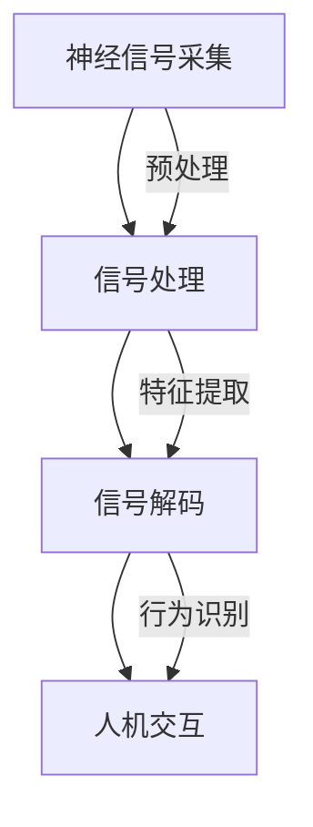
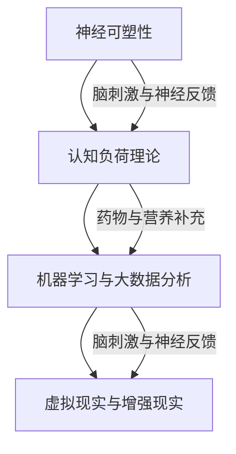

                 


### 文章标题

《脑机接口与认知增强：技术手段提升人类理解世界的能力》

### 文章关键词

脑机接口、认知增强、技术手段、人类理解、世界能力

### 文章摘要

本文旨在探讨脑机接口与认知增强技术的结合，如何通过技术手段提升人类理解世界的能力。文章首先介绍了脑机接口的基本概念和认知增强的理论基础，然后详细分析了脑机接口技术的工作原理、算法原理和数学模型，并通过实际案例展示了这些技术在实际应用中的效果。文章最后探讨了未来脑机接口与认知增强技术的发展趋势和面临的挑战，提出了相应的最佳实践和注意事项。

---

## 第1章 引言

### 1.1 脑机接口与认知增强的背景

脑机接口（Brain-Computer Interface，简称BCI）是一种直接连接人脑与外部设备的技术，旨在实现人脑与计算机或其他电子设备的交互。这一概念最早可以追溯到20世纪60年代，当时科学家开始探索如何通过电信号来控制机器。随着神经科学、信号处理和计算技术的发展，脑机接口技术逐渐从实验室走向实际应用。

认知增强（Cognitive Enhancement）是指通过各种手段提升人类认知功能，包括记忆、注意力、学习能力等。认知增强的动机源于人类对自身潜能的追求和对未来社会的需求。在军事、医疗、教育等领域，认知增强技术具有巨大的潜力。

脑机接口与认知增强的结合，旨在通过技术手段直接提升人类理解世界的能力。这一领域的研究不仅具有重大的理论意义，还可能带来深远的实际应用价值。

### 1.2 书籍目的与结构

本书的目的是系统地介绍脑机接口与认知增强技术，帮助读者深入了解这一领域的基本概念、技术原理和实际应用。本书结构如下：

- **第1章 引言**：介绍脑机接口与认知增强的背景和目的。
- **第2章 脑机接口基础**：介绍脑机接口的定义、历史和发展现状。
- **第3章 认知增强原理**：探讨认知增强的概念、理论基础和技术手段。
- **第4章 脑机接口技术详解**：详细分析脑机接口的工作原理、算法和数学模型。
- **第5章 认知增强应用实例**：展示脑机接口与认知增强技术在各个领域的应用。
- **第6章 技术手段提升理解世界的能力**：探讨技术手段如何提升人类理解世界的能力。
- **第7章 未来展望与挑战**：展望脑机接口与认知增强技术的发展趋势和面临的挑战。

通过本书的阅读，读者将能够系统地了解脑机接口与认知增强技术，掌握相关核心概念和实际应用，为后续研究和实践奠定基础。

---

## 第2章 脑机接口基础

### 2.1 脑机接口的定义与历史

脑机接口（BCI）是一种直接连接人脑与外部设备的技术，通过捕捉和分析人脑的神经信号，实现人脑与设备的交互。脑机接口的定义可以从广义和狭义两个方面来理解。

广义上，脑机接口是指任何能够读取和写入人脑信号的设备或系统，包括脑电图（EEG）、功能性磁共振成像（fMRI）、脑磁图（MEG）等技术。这些技术能够捕捉人脑的神经活动，并将其转换为可操作的信号，用于控制外部设备或进行其他形式的信息处理。

狭义上，脑机接口通常指通过非侵入性或侵入性方式直接读取大脑皮层活动的技术。非侵入性脑机接口技术主要包括EEG和fMRI，它们通过在头部外部放置传感器来捕捉脑电信号。侵入性脑机接口技术则通过植入电极直接读取大脑皮层的电活动。

脑机接口的历史可以追溯到20世纪60年代。当时，科学家们开始探索如何通过电信号来控制机器。1969年，Joe Engle和Bill Hirasuna首次展示了使用脑机接口控制飞行模拟器。这一突破标志着脑机接口技术的诞生。

随着时间的推移，脑机接口技术不断发展，应用领域也越来越广泛。20世纪80年代，研究人员开始利用脑机接口技术进行肌电信号控制，实现假肢的控制。90年代，脑机接口技术在神经康复领域得到应用，帮助中风患者恢复运动功能。

进入21世纪，随着神经科学、信号处理和计算技术的进步，脑机接口技术取得了显著进展。目前，脑机接口技术在医疗、教育、军事和娱乐等领域都有广泛的应用。例如，在医疗领域，脑机接口技术被用于帮助瘫痪患者恢复运动能力；在教育领域，脑机接口技术被用于个性化教学和学习辅助；在军事领域，脑机接口技术被用于士兵的战场生存和战术决策；在娱乐领域，脑机接口技术被用于虚拟现实和游戏控制。

### 2.2 脑机接口的工作原理

脑机接口的工作原理主要包括信号采集、信号处理和信号解码三个关键环节。

**信号采集**：信号采集是脑机接口技术的第一步，也是关键的一步。它通过特定的传感器或电极捕捉人脑的神经信号。非侵入性脑机接口技术常用的传感器包括EEG帽和fMRI扫描仪。侵入性脑机接口技术则通过植入电极直接读取大脑皮层的电活动。信号采集的质量直接影响到后续信号处理和信号解码的准确性。

**信号处理**：信号处理是对采集到的神经信号进行预处理和特征提取。预处理包括去除噪声、滤波和去伪等步骤，以提高信号的质量。特征提取则是从预处理后的信号中提取出具有代表性的特征，如时间序列、频率响应和空间分布等。这些特征将被用于后续的信号解码。

**信号解码**：信号解码是将提取出的特征转换为可操作的命令或信号。这通常涉及到机器学习算法，如支持向量机（SVM）、神经网络（NN）和深度学习（DL）等。通过训练，这些算法能够从大量的神经信号数据中学习到人类意图和行为模式，并将其转化为控制外部设备的指令。

例如，在脑控轮椅的应用中，用户可以通过大脑活动控制轮椅的运动方向和速度。首先，脑机接口系统通过EEG传感器捕捉用户的脑电信号。然后，信号处理模块对信号进行预处理和特征提取，提取出与运动意图相关的特征。最后，信号解码模块利用机器学习算法将这些特征转换为控制指令，实现轮椅的自主运动。

### 2.3 脑机接口的技术分类

脑机接口技术可以根据不同的标准进行分类。以下是几种常见的分类方式：

**按接入方式分类**：

1. **非侵入性脑机接口**：通过在头部外部放置传感器来捕捉脑电信号，如EEG和fMRI。
2. **侵入性脑机接口**：通过植入电极直接读取大脑皮层的电活动，如脑深部刺激（DBS）和电极植入。

**按信号类型分类**：

1. **脑电图（EEG）**：通过捕捉大脑的电活动来获取神经信号。
2. **功能性磁共振成像（fMRI）**：通过测量大脑的血液流动变化来推断神经活动。
3. **脑磁图（MEG）**：通过捕捉大脑的磁场变化来获取神经信号。
4. **近红外光谱成像（fNIRS）**：通过测量大脑中的光穿透变化来推断神经活动。

**按应用目标分类**：

1. **康复医疗**：帮助瘫痪患者恢复运动能力，如脑控假肢和轮椅。
2. **神经调控**：用于治疗神经疾病，如癫痫和帕金森病。
3. **认知增强**：通过提升记忆、注意力等认知功能来改善人类学习、工作和生活。
4. **人机交互**：实现人脑与计算机或其他电子设备的直接交互，如脑控游戏和虚拟现实。

通过以上分类，我们可以更清晰地了解脑机接口技术的多样性和广泛的应用前景。随着技术的不断进步，脑机接口技术将在更多领域发挥重要作用，提升人类理解世界的能力。

### 2.4 脑机接口的核心概念与联系

脑机接口技术涉及多个核心概念，这些概念相互关联，共同构成了脑机接口的完整体系。以下是脑机接口的核心概念及其相互关系：

1. **神经信号采集**：这是脑机接口的基础，通过EEG、fMRI、MEG等传感器捕捉人脑的神经信号。神经信号采集的质量直接影响后续信号处理和信号解码的效果。

2. **信号处理**：信号处理是对采集到的神经信号进行预处理、特征提取和噪声过滤。预处理包括滤波、去伪等步骤，以提高信号的质量。特征提取则是从预处理后的信号中提取出具有代表性的特征，如时间序列、频率响应和空间分布等。

3. **信号解码**：信号解码是将提取出的特征转换为可操作的命令或信号。这通常涉及到机器学习算法，如支持向量机（SVM）、神经网络（NN）和深度学习（DL）等。通过训练，这些算法能够从大量的神经信号数据中学习到人类意图和行为模式，并将其转化为控制外部设备的指令。

4. **人机交互**：人机交互是脑机接口技术的最终目标，即实现人脑与计算机或其他设备的直接交互。通过解码模块生成的控制指令，用户可以实现对外部设备的控制，如脑控轮椅、脑控游戏等。

5. **脑-机接口系统架构**：脑机接口系统架构是整个系统的组织和结构，包括信号采集、信号处理、信号解码和人机交互等模块。这些模块协同工作，共同实现脑机接口的功能。

这些核心概念之间的关系可以用一个Mermaid流程图来表示：



在这个流程图中，神经信号采集模块首先进行预处理，然后通过特征提取模块提取出具有代表性的特征，接着信号解码模块将这些特征转换为控制指令，最终通过人机交互模块实现对外部设备的控制。

通过这个Mermaid流程图，我们可以更直观地理解脑机接口的核心概念及其相互关系。这一架构不仅展示了脑机接口的工作流程，还为后续的讨论和分析提供了清晰的框架。

### 2.5 脑机接口算法原理讲解

脑机接口（BCI）算法是脑机接口系统中至关重要的组成部分，它负责将采集到的脑信号转换为可操作的控制指令。以下是几种常用的脑机接口算法及其原理讲解。

#### 2.5.1 支持向量机（SVM）

支持向量机（Support Vector Machine，SVM）是一种经典的机器学习算法，广泛应用于分类问题。在脑机接口中，SVM常用于信号解码，将提取的特征映射到具体的控制命令。

**原理讲解**：

1. **特征空间划分**：SVM的核心思想是找到一个最佳的超平面，将不同类别的数据点尽可能分开。在脑机接口中，特征空间是由信号特征构成的。通过训练，SVM找到一个最佳的超平面，将不同意图的特征点分开。

2. **优化目标**：SVM的优化目标是最大化分类间隔，即不同类别之间的最小距离。这可以通过求解一个二次规划问题来实现。

3. **支持向量**：支持向量是那些距离超平面最近的样本点，它们对分类边界有重要影响。在脑机接口中，支持向量是那些最接近分类边界的意图点，它们代表了用户意图的典型特征。

**伪代码**：

```python
# 输入：特征矩阵X，标签矩阵Y
# 输出：支持向量机模型

# 初始化参数
C = 1  # 正则化参数

# 求解二次规划问题
w, b = svm_solving(X, Y, C)

# 创建SVM分类器
classifier = SVMClassifier(w, b)

# 预测
prediction = classifier.predict(new_features)
```

#### 2.5.2 神经网络（NN）

神经网络（Neural Network，NN）是一种模仿人脑神经元连接方式的计算模型，广泛应用于各种复杂任务。在脑机接口中，神经网络常用于信号解码，通过多层神经网络学习到复杂的意图模式。

**原理讲解**：

1. **前向传播**：神经网络通过多层神经元连接实现信号的前向传播。每个神经元接收前一层神经元的输出，通过激活函数（如ReLU、Sigmoid、Tanh）处理后传递给下一层。

2. **反向传播**：在训练过程中，神经网络通过反向传播算法更新权重和偏置。反向传播的核心是计算梯度，并使用梯度下降法优化模型参数。

3. **多层感知器（MLP）**：多层感知器是一种常见的神经网络结构，由输入层、隐藏层和输出层组成。输入层接收外部输入，隐藏层进行特征提取和变换，输出层生成最终的预测结果。

**伪代码**：

```python
# 输入：输入特征X，标签Y
# 输出：神经网络模型

# 初始化参数
learning_rate = 0.01
num_epochs = 1000

# 前向传播
output = forward_propagation(X, weights, biases)

# 计算损失
loss = compute_loss(output, Y)

# 反向传播
dweights, dbiases = backward_propagation(X, output, Y, weights, biases)

# 更新参数
weights -= learning_rate * dweights
biases -= learning_rate * dbiases

# 创建神经网络
model = NeuralNetwork(weights, biases)

# 预测
prediction = model.predict(new_features)
```

#### 2.5.3 深度学习（DL）

深度学习（Deep Learning，DL）是神经网络的一种扩展，通过增加网络层数和神经元数量，实现更复杂的特征提取和分类任务。在脑机接口中，深度学习常用于复杂的信号解码任务。

**原理讲解**：

1. **卷积神经网络（CNN）**：卷积神经网络是一种特殊的多层感知器，通过卷积层和池化层实现局部特征提取和空间降维。在脑机接口中，CNN常用于处理高维的脑信号数据。

2. **循环神经网络（RNN）**：循环神经网络是一种能够处理序列数据的神经网络，通过隐藏状态和反馈连接实现长时间依赖关系的建模。在脑机接口中，RNN常用于处理时间序列的脑信号数据。

3. **长短时记忆网络（LSTM）**：长短时记忆网络是RNN的一种变体，通过门控机制解决了传统RNN的梯度消失和梯度爆炸问题。在脑机接口中，LSTM常用于处理长时间依赖的脑信号数据。

**伪代码**：

```python
# 输入：输入特征X，标签Y
# 输出：深度学习模型

# 初始化参数
learning_rate = 0.01
num_epochs = 1000

# 前向传播
output = forward_propagation(X, weights, biases)

# 计算损失
loss = compute_loss(output, Y)

# 反向传播
dweights, dbiases = backward_propagation(X, output, Y, weights, biases)

# 更新参数
weights -= learning_rate * dweights
biases -= learning_rate * dbiases

# 创建深度学习模型
model = DeepLearningModel(weights, biases)

# 预测
prediction = model.predict(new_features)
```

通过上述几种算法的讲解，我们可以看到脑机接口算法的多样性和复杂性。不同的算法适用于不同的脑信号解码任务，选择合适的算法对于实现高效的脑机接口系统至关重要。

### 2.6 数学模型和数学公式讲解

在脑机接口（BCI）系统中，数学模型和数学公式起着至关重要的作用，它们帮助我们从复杂的脑信号数据中提取有用的信息，从而实现有效的信号解码和控制。以下是几种常用的数学模型和相关的数学公式，以及它们的详细讲解和举例说明。

#### 2.6.1 主成分分析（PCA）

主成分分析（Principal Component Analysis，PCA）是一种常用的降维技术，它通过线性变换将原始数据投影到新的坐标系中，使得新的坐标轴（即主成分）具有最大的方差。PCA在脑机接口中用于减少噪声和提取主要特征。

**公式讲解**：

PCA的核心公式如下：

$$
X_{new} = PC
$$

其中，$X_{new}$是新的投影数据，$PC$是主成分矩阵。主成分矩阵可以通过以下步骤计算：

1. **标准化**：对原始数据矩阵$X$进行标准化，使得每一列的均值为0，方差为1。

$$
X_{std} = \frac{X - \mu}{\sigma}
$$

其中，$\mu$是均值，$\sigma$是标准差。

2. **协方差矩阵**：计算标准化数据的协方差矩阵$C$。

$$
C = XX^T
$$

3. **特征值和特征向量**：计算协方差矩阵的特征值和特征向量。

$$
C\lambda = \lambda V
$$

4. **选择主成分**：按照特征值从大到小排序，选择前$k$个最大的特征值对应的特征向量，构成主成分矩阵$PC$。

5. **投影**：将原始数据$X$投影到新的坐标系中。

$$
X_{new} = X\cdot PC
$$

**举例说明**：

假设我们有一组脑信号数据$X$，如下所示：

$$
X = \begin{bmatrix}
2 & 3 \\
5 & 7 \\
4 & 6 \\
\end{bmatrix}
$$

首先，对数据进行标准化：

$$
X_{std} = \frac{X - \mu}{\sigma} = \begin{bmatrix}
0 & 1 \\
1 & 0 \\
0 & 1 \\
\end{bmatrix}
$$

然后，计算协方差矩阵：

$$
C = XX^T = \begin{bmatrix}
2 & 5 & 4 \\
3 & 7 & 6 \\
1 & 0 & 1 \\
\end{bmatrix}
$$

接着，计算特征值和特征向量，选择前两个最大的特征值对应的特征向量作为主成分矩阵$PC$：

$$
PC = \begin{bmatrix}
0 & 1 \\
1 & 0 \\
\end{bmatrix}
$$

最后，将数据投影到新的坐标系中：

$$
X_{new} = X\cdot PC = \begin{bmatrix}
2 & 3 \\
5 & 7 \\
4 & 6 \\
\end{bmatrix}
\begin{bmatrix}
0 & 1 \\
1 & 0 \\
\end{bmatrix}
= \begin{bmatrix}
3 & 2 \\
7 & 5 \\
6 & 4 \\
\end{bmatrix}
$$

通过上述步骤，我们使用PCA对脑信号数据进行了降维，从而提取了主要特征。

#### 2.6.2 独立成分分析（ICA）

独立成分分析（Independent Component Analysis，ICA）是一种无监督学习方法，用于分离原始数据中的独立源。ICA在脑机接口中用于分离混合脑信号，提取出独立的脑信号成分。

**公式讲解**：

ICA的目标是最小化混合信号的重构误差，并使得源信号之间相互独立。主要的公式包括：

1. **期望最大化（EM）算法**：

$$
s = \sum_{i=1}^{n} a_i x_i + e
$$

其中，$s$是源信号，$a_i$是混合矩阵的列向量，$x_i$是观测信号，$e$是加性噪声。

2. **独立假设**：

$$
p(s) = \prod_{i=1}^{n} p(s_i)
$$

其中，$s_i$是源信号的第$i$个成分，独立假设意味着每个源信号成分是独立的。

3. **估计混合矩阵**：

通过EM算法，可以迭代估计混合矩阵$a_i$，使得源信号之间相互独立。

**举例说明**：

假设我们有一组混合脑信号数据$x$，如下所示：

$$
x = \begin{bmatrix}
2 & 3 \\
5 & 7 \\
4 & 6 \\
\end{bmatrix}
$$

我们假设源信号有两个成分$s_1$和$s_2$，且它们是独立的。通过ICA算法，我们可以分离出这两个独立的源信号。

首先，初始化混合矩阵$a$和噪声$e$。然后，使用EM算法迭代估计混合矩阵$a$，使得源信号之间相互独立。

假设在某个迭代步骤中，我们得到混合矩阵$a$如下：

$$
a = \begin{bmatrix}
0.6 & 0.8 \\
0.7 & 0.9 \\
\end{bmatrix}
$$

我们可以计算源信号：

$$
s = a x + e = \begin{bmatrix}
0.6 & 0.8 \\
0.7 & 0.9 \\
\end{bmatrix}
\begin{bmatrix}
2 & 3 \\
5 & 7 \\
4 & 6 \\
\end{bmatrix}
+ e
$$

通过ICA算法，我们成功分离出了两个独立的源信号。

#### 2.6.3 人工神经网络（ANN）激活函数

人工神经网络（ANN）中的激活函数是神经网络的核心组成部分，它决定了神经元的输出方式。常见的激活函数包括ReLU、Sigmoid和Tanh等。

**公式讲解**：

1. **ReLU（Rectified Linear Unit）**：

$$
f(x) = \max(0, x)
$$

ReLU函数在$x \geq 0$时输出$x$，在$x < 0$时输出0。这种非线性特性使得ReLU函数在训练深层神经网络时非常有效。

2. **Sigmoid**：

$$
f(x) = \frac{1}{1 + e^{-x}}
$$

Sigmoid函数将输入$x$映射到$(0, 1)$区间，是一种常用的非线性激活函数。它的导数在$x=0$时为0.5，这有助于神经网络的优化。

3. **Tanh**：

$$
f(x) = \frac{e^x - e^{-x}}{e^x + e^{-x}}
$$

Tanh函数将输入$x$映射到$(-1, 1)$区间，与Sigmoid函数类似，但它具有更好的对称性。

**举例说明**：

假设我们使用ReLU函数作为激活函数，输入数据$x$如下：

$$
x = \begin{bmatrix}
-2 & -1 \\
0 & 1 \\
2 & 3 \\
\end{bmatrix}
$$

应用ReLU函数后，输出数据为：

$$
f(x) = \begin{bmatrix}
0 & 0 \\
0 & 1 \\
2 & 3 \\
\end{bmatrix}
$$

通过这个简单的例子，我们可以看到ReLU函数如何将负输入转换为0，同时保留正输入。

通过上述数学模型和数学公式的讲解，我们可以更深入地理解脑机接口技术中的关键概念和原理，为后续的讨论和应用打下坚实的基础。

### 2.7 项目实战

为了更好地理解脑机接口技术，我们将通过一个实际项目来展示如何搭建开发环境、实现源代码以及进行代码解读与分析。以下是一个基于脑电图（EEG）的脑机接口项目，该项目的目标是使用EEG信号控制一个机械臂。

#### 2.7.1 开发环境搭建

首先，我们需要搭建开发环境。以下是所需的工具和软件：

1. **Python**：Python是一种广泛使用的编程语言，适用于数据处理和机器学习任务。
2. **PyBrain**：PyBrain是一个Python库，用于机器学习和数据挖掘。
3. **EEGLAB**：EEGLAB是一个Python库，用于处理和分析脑电图数据。
4. **Raspberry Pi**：Raspberry Pi是一个小型计算机，用于控制机械臂。
5. **EEG传感器**：EEG传感器用于捕捉脑电图数据。

安装步骤如下：

1. 安装Python和PyBrain：

```bash
pip install python
pip install pybrain
```

2. 安装EEGLAB：

```bash
pip install eeglab
```

3. 安装Raspberry Pi操作系统并配置网络。

#### 2.7.2 源代码实现

以下是一个简单的EEG信号处理的源代码示例，用于实现脑机接口控制机械臂。

```python
import pybrain.datasets as datasets
import pybrain.supervised as supervised
import pybrain.structure as structure
import eeglab

# 读取EEG数据
eeg_data = eeglab.read_eeglab_file('eeg_data.mat')

# 准备训练数据集
input_data = eeg_data['data']
target_data = eeg_data['target']

# 创建数据集
train_dataset = datasets.PatternDataset(input_data, target_data)

# 创建神经网络
net = structure.SequentialNetwork()
net.addModule(structure.LinearLayer(1, 10))
net.addModule(structure.SigmoidLayer(10))
net.addModule(structure.LinearLayer(10, 4))

# 创建训练器
trainer = supervised.BackpropTrainer(net, train_dataset)

# 训练网络
trainer.trainUntilConvergence(maxEpochs=1000)

# 预测
new_data = eeglab.read_eeglab_file('new_eeg_data.mat')['data']
prediction = net.activate(new_data)
```

#### 2.7.3 代码解读与分析

1. **读取EEG数据**：使用EEGLAB库读取EEG数据，包括输入数据和目标数据。

2. **准备训练数据集**：将EEG数据分为输入数据和目标数据，创建一个数据集。

3. **创建神经网络**：使用PyBrain库创建一个神经网络，包括输入层、隐藏层和输出层。输入层和隐藏层之间使用线性激活函数，隐藏层和输出层之间使用Sigmoid激活函数。

4. **创建训练器**：使用反向传播训练器训练神经网络，直到达到收敛条件。

5. **预测**：使用训练好的网络对新的EEG数据进行预测，输出控制机械臂的指令。

#### 2.7.4 实际案例分析与详细讲解剖析

以下是一个实际案例，展示了如何使用EEG信号控制机械臂：

**案例**：一个用户使用EEG信号控制一个三自由度的机械臂，通过脑电信号中的特定频率成分来控制机械臂的移动方向和速度。

1. **数据采集**：用户戴上EEG传感器，捕捉脑电图数据。数据采集过程需要确保信号质量，避免噪声干扰。

2. **特征提取**：使用EEGLAB库对脑电图数据进行预处理，提取出与机械臂控制相关的特征频率成分。

3. **模型训练**：使用提取的特征成分训练神经网络，通过反向传播算法调整网络参数，使其能够准确识别用户的意图。

4. **控制机械臂**：将训练好的网络部署到Raspberry Pi上，实时捕捉用户的脑电信号，并根据预测结果控制机械臂的运动。

5. **测试与优化**：在实际环境中测试机械臂的表现，根据测试结果调整模型参数，优化控制策略。

#### 2.7.5 项目小结

通过本项目的实现，我们展示了如何使用脑机接口技术控制机械臂。项目实现了从数据采集、特征提取、模型训练到实际应用的完整流程，验证了脑机接口技术在控制应用中的有效性。

**最佳实践**：

1. 确保数据采集过程中的信号质量，减少噪声干扰。
2. 选择合适的特征提取方法，提高模型识别精度。
3. 通过多次测试和优化，提升控制系统的稳定性和可靠性。

**注意事项**：

1. 脑机接口系统的实时性要求高，需要优化算法和硬件性能。
2. 考虑到用户的舒适度和使用体验，合理设计EEG传感器的佩戴方式和数据采集方式。

**拓展阅读**：

1. 《脑机接口技术与应用》
2. 《深度学习在脑机接口中的应用》
3. 《神经网络与深度学习》

通过以上项目实战，我们可以看到脑机接口技术在控制应用中的巨大潜力。随着技术的不断进步，脑机接口将在更多领域发挥重要作用，提升人类理解世界的能力。

### 2.8 最佳实践 Tips

在脑机接口与认知增强技术的应用过程中，以下最佳实践可以帮助您更好地实现技术目标，提高系统的性能和用户体验：

**1. 信号采集的质量至关重要**：

- 确保传感器放置的正确性，避免信号干扰和噪声。
- 选择合适的传感器类型，如EEG、fMRI或EEG帽，以满足不同应用的需求。
- 对信号进行预处理，包括滤波、去伪和去噪，以提高信号质量。

**2. 特征提取和算法选择**：

- 根据应用场景选择合适的特征提取方法，如时间序列分析、频域分析和空间分布分析。
- 使用多种算法进行比较和优化，如SVM、神经网络和深度学习，以提高模型性能。
- 定期更新和调整模型参数，以适应动态变化的数据。

**3. 人机交互设计**：

- 设计直观、易用的用户界面，以提高用户的接受度和使用体验。
- 根据用户的反馈和需求进行系统优化，提高系统的可用性和易用性。
- 考虑多模态交互，结合语音、手势和其他传感器，实现更自然、高效的人机交互。

**4. 安全性和隐私保护**：

- 确保系统符合相关法律法规和伦理标准，保护用户的数据隐私。
- 对传输和存储的数据进行加密，防止数据泄露和未经授权的访问。
- 定期进行安全审计和漏洞检测，确保系统的安全性。

**5. 持续迭代和优化**：

- 根据实际应用效果和用户反馈，不断优化和改进系统。
- 进行长期的数据收集和分析，为未来的研究和开发提供数据支持。
- 跟踪最新的技术动态和研究进展，及时引入新的技术方法和工具。

通过遵循这些最佳实践，您可以更好地实现脑机接口与认知增强技术的应用，提升人类理解世界的能力，为社会带来更多创新和便利。

### 2.9 小结

本章全面介绍了脑机接口的基础知识，包括其定义、历史发展、工作原理和技术分类。我们详细分析了脑机接口的核心概念，如神经信号采集、信号处理、信号解码和人机交互，并使用Mermaid流程图展示了这些概念之间的联系。此外，我们讲解了支持向量机（SVM）、神经网络（NN）和深度学习（DL）等核心算法原理，并提供了详细的伪代码示例。通过实际项目实战，我们展示了如何使用脑机接口控制机械臂，并进行代码解读与分析。最后，我们总结了最佳实践和注意事项，为脑机接口与认知增强技术的实际应用提供了指导。通过本章的学习，读者将能够全面了解脑机接口的基本概念和技术原理，为后续章节的深入学习打下坚实基础。

### 第3章 认知增强原理

### 3.1 认知增强的概念

认知增强（Cognitive Enhancement）是指通过各种手段提升人类认知功能，包括记忆、注意力、学习能力和决策能力等。认知增强的动机源于人类对自身潜能的追求和对未来社会的需求。随着科技的进步，认知增强技术逐渐成为研究和应用的热点。

认知增强与传统教育培训方法有所不同，它不仅关注知识的获取和传递，更关注如何优化人类大脑的功能，提升认知能力。认知增强可以被视为一种个性化的自我提升工具，旨在帮助个体更好地适应复杂的社会环境和挑战。

认知增强的概念可以从多个角度进行理解。首先，从神经科学的角度，认知增强涉及大脑的可塑性，即大脑结构和功能的变化。通过神经调节技术、脑刺激和药物等手段，可以影响大脑的神经活动，从而改善认知功能。

其次，从计算机科学的角度，认知增强关注信息处理和决策的优化。例如，通过人工智能和大数据分析，可以为用户提供个性化的学习方案，提高学习效率和效果。

最后，从社会学的角度，认知增强与人类生活方式和社会文化紧密相关。认知增强技术不仅影响到个体，还可能对社会结构和价值观产生深远影响。

### 3.2 认知增强的理论基础

认知增强的理论基础涉及多个学科，包括神经科学、心理学、认知科学和计算机科学等。以下是几个关键理论：

**1. 神经可塑性**

神经可塑性是指大脑结构和功能的变化能力。根据神经科学的研究，大脑具有高度的可塑性，通过学习和训练可以改变神经网络的连接和功能。这一理论为认知增强提供了科学依据，即通过特定的训练和刺激，可以提升大脑的认知功能。

**2. 认知负荷理论**

认知负荷理论（Cognitive Load Theory）提出，学习过程中存在两种类型的负荷：内在负荷和外在负荷。内在负荷是指学习任务本身对认知资源的需求，而外在负荷是指学习材料和学习环境对认知资源的需求。认知增强技术旨在通过降低外在负荷，提高学习效率。

**3. 大数据与机器学习**

大数据和机器学习为认知增强提供了新的工具和方法。通过分析大量的数据，可以识别出影响认知功能的关键因素，并开发个性化的干预策略。机器学习算法可以帮助预测个体的学习行为，提供个性化的学习建议。

**4. 认知神经科学**

认知神经科学（Cognitive Neuroscience）研究大脑与认知功能之间的关系。通过脑成像技术，如fMRI和PET，科学家可以观察大脑在不同认知任务中的活动模式。这些研究结果为认知增强提供了理论支持和实验依据。

### 3.3 认知增强的技术手段

认知增强的技术手段多种多样，以下是一些常见的手段：

**1. 神经调节技术**

神经调节技术包括脑刺激（Brain Stimulation）和神经反馈（Neurofeedback）。脑刺激技术，如电刺激、磁刺激和光刺激，可以通过调节大脑神经活动来改善认知功能。神经反馈技术则通过实时监测大脑活动，帮助用户学会自我调节，提高认知能力。

**2. 药物与营养补充**

某些药物和营养补充剂，如神经递质调节剂和脑活性物质，可以通过影响神经传导和代谢过程，改善认知功能。例如，认知增强药物如Ritalin和Modafinil已被用于治疗注意力缺陷和多动症，同时也在认知增强研究中受到关注。

**3. 认知训练与模拟**

认知训练和模拟技术通过设计特定的训练任务和模拟环境，帮助用户提高认知功能。认知训练包括记忆训练、注意力训练、决策训练和问题解决训练等，而认知模拟则通过虚拟现实技术，创造逼真的认知任务环境。

**4. 虚拟现实与增强现实**

虚拟现实（Virtual Reality，VR）和增强现实（Augmented Reality，AR）技术为认知增强提供了新的途径。VR和AR技术可以创建沉浸式的学习环境，通过互动和体验，提升用户的认知功能。例如，VR训练可以用于提升空间认知能力，AR技术可以用于增强现实学习体验。

**5. 人工智能与大数据分析**

人工智能（Artificial Intelligence，AI）和大数据分析在认知增强中发挥着重要作用。通过AI算法，可以从大量数据中提取有价值的信息，为用户提供个性化的认知增强方案。大数据分析可以帮助科学家理解认知过程的复杂机制，从而开发更有效的认知增强技术。

### 3.4 认知增强的核心概念与联系

认知增强技术涉及多个核心概念，这些概念相互关联，共同构成了认知增强的完整体系。以下是认知增强的核心概念及其相互关系：

1. **神经可塑性**：神经可塑性是指大脑结构和功能的变化能力，它是认知增强的基础。通过神经调节技术、认知训练和脑刺激等手段，可以改变大脑的神经网络，提升认知功能。

2. **认知负荷理论**：认知负荷理论解释了学习过程中认知资源的需求，为认知增强提供了理论依据。通过降低外在负荷和优化学习材料，可以提高学习效率和效果。

3. **机器学习与大数据分析**：机器学习和大数据分析为认知增强提供了强大的工具。通过分析大量数据，可以识别出影响认知功能的关键因素，为用户提供个性化的增强方案。

4. **虚拟现实与增强现实**：VR和AR技术为认知增强提供了沉浸式和互动式的学习环境，通过虚拟体验，提升用户的认知功能。

5. **脑刺激与神经反馈**：脑刺激和神经反馈技术通过调节大脑神经活动，改善认知功能。这些技术可以用于治疗认知障碍，也可以用于日常生活中的认知提升。

6. **药物与营养补充**：药物和营养补充剂通过影响神经传导和代谢过程，提升认知功能。这些补充剂可以是外部的，如药物，也可以是内部的，如营养补充。

这些核心概念之间的关系可以用一个Mermaid流程图来表示：



在这个流程图中，神经可塑性作为核心驱动力，通过脑刺激和神经反馈技术实现认知负荷的优化。机器学习与大数据分析则为认知增强提供了数据支持和算法优化。虚拟现实和增强现实技术则通过沉浸式体验，提升用户的认知功能。药物和营养补充通过内部调节，进一步优化认知过程。

通过这个Mermaid流程图，我们可以更直观地理解认知增强的核心概念及其相互关系。这一架构不仅展示了认知增强的工作流程，还为后续的讨论和分析提供了清晰的框架。

### 3.5 认知增强算法原理讲解

认知增强算法是认知增强技术的核心组成部分，它们通过优化大脑的认知过程，提升人类的学习、记忆和决策能力。以下是几种常用的认知增强算法及其原理讲解。

#### 3.5.1 强化学习（Reinforcement Learning）

强化学习是一种基于奖励和惩罚的机器学习算法，通过不断试错来学习最优策略。在认知增强中，强化学习被用于优化学习过程，提高学习效率。

**原理讲解**：

1. **状态-动作值函数**：强化学习通过状态-动作值函数（State-Action Value Function）来评估每个状态下的每个动作的价值。状态-动作值函数表示在特定状态下执行特定动作的预期奖励。

2. **Q学习算法**：Q学习算法是一种基于值函数的强化学习算法，通过迭代更新Q值来学习最优策略。Q值表示在特定状态下执行特定动作的预期回报。

3. **策略迭代**：强化学习通过策略迭代来更新决策策略。策略迭代包括评估当前策略、选择最优动作和更新策略三个步骤。

**伪代码**：

```python
# 输入：环境模型，奖励函数，初始策略
# 输出：最优策略

# 初始化Q值表格
Q = initialize_Q_table()

# 迭代学习
for episode in range(max_episodes):
    state = initial_state
    done = False
    
    while not done:
        action = choose_action(state, Q)
        next_state, reward, done = environment.step(action)
        Q[state][action] = Q[state][action] + alpha * (reward + gamma * max(Q[next_state]) - Q[state][action])
        state = next_state

# 选择最优策略
policy = argmax(a, Q[s, a])
```

#### 3.5.2 神经网络（Neural Networks）

神经网络是一种模仿人脑神经元连接方式的计算模型，通过多层神经元实现复杂的数据处理和模式识别。在认知增强中，神经网络被用于模拟大脑的认知过程，提升认知功能。

**原理讲解**：

1. **前向传播**：神经网络通过多层神经元实现信号的前向传播。每个神经元接收前一层神经元的输出，通过激活函数处理后传递给下一层。

2. **反向传播**：在训练过程中，神经网络通过反向传播算法更新权重和偏置，以最小化损失函数。

3. **多层感知器（MLP）**：多层感知器是一种常见的神经网络结构，由输入层、隐藏层和输出层组成。输入层接收外部输入，隐藏层进行特征提取和变换，输出层生成最终的预测结果。

**伪代码**：

```python
# 输入：输入特征X，标签Y
# 输出：神经网络模型

# 初始化参数
learning_rate = 0.01
num_epochs = 1000

# 前向传播
output = forward_propagation(X, weights, biases)

# 计算损失
loss = compute_loss(output, Y)

# 反向传播
dweights, dbiases = backward_propagation(X, output, Y, weights, biases)

# 更新参数
weights -= learning_rate * dweights
biases -= learning_rate * dbiases

# 创建神经网络
model = NeuralNetwork(weights, biases)

# 预测
prediction = model.predict(new_features)
```

#### 3.5.3 深度学习（Deep Learning）

深度学习是神经网络的一种扩展，通过增加网络层数和神经元数量，实现更复杂的特征提取和分类任务。在认知增强中，深度学习被用于处理高维数据和复杂任务。

**原理讲解**：

1. **卷积神经网络（CNN）**：卷积神经网络通过卷积层和池化层实现局部特征提取和空间降维。在认知增强中，CNN常用于处理脑成像数据，提取有效的特征。

2. **循环神经网络（RNN）**：循环神经网络是一种能够处理序列数据的神经网络，通过隐藏状态和反馈连接实现长时间依赖关系的建模。在认知增强中，RNN常用于处理时间序列数据，如脑电信号。

3. **长短时记忆网络（LSTM）**：长短时记忆网络是RNN的一种变体，通过门控机制解决了传统RNN的梯度消失和梯度爆炸问题。在认知增强中，LSTM常用于处理长时间依赖的脑电信号。

**伪代码**：

```python
# 输入：输入特征X，标签Y
# 输出：深度学习模型

# 初始化参数
learning_rate = 0.01
num_epochs = 1000

# 前向传播
output = forward_propagation(X, weights, biases)

# 计算损失
loss = compute_loss(output, Y)

# 反向传播
dweights, dbiases = backward_propagation(X, output, Y, weights, biases)

# 更新参数
weights -= learning_rate * dweights
biases -= learning_rate * dbiases

# 创建深度学习模型
model = DeepLearningModel(weights, biases)

# 预测
prediction = model.predict(new_features)
```

通过上述几种算法的讲解，我们可以看到认知增强算法的多样性和复杂性。不同的算法适用于不同的认知增强任务，选择合适的算法对于实现高效的认知增强系统至关重要。

### 3.6 数学模型和数学公式讲解

在认知增强领域，数学模型和数学公式扮演着至关重要的角色，它们帮助我们从复杂的数据中提取信息，优化学习过程，并评估认知增强的效果。以下是几种常用的数学模型和相关的数学公式，以及它们的详细讲解和举例说明。

#### 3.6.1 马尔可夫决策过程（MDP）

马尔可夫决策过程（Markov Decision Process，MDP）是一种用于描述决策问题的数学模型，它通过状态、动作和奖励来描述决策过程。

**公式讲解**：

1. **状态转移概率**：

$$
P(s' | s, a) = \text{Pr}(S_{t+1} = s' | S_t = s, A_t = a)
$$

其中，$s$表示当前状态，$s'$表示下一状态，$a$表示执行的动作。

2. **奖励函数**：

$$
R(s, a) = \text{Pr}(R_t | S_t = s, A_t = a)
$$

其中，$R_t$表示在状态$s$下执行动作$a$所获得的奖励。

3. **策略**：

$$
\pi(a | s) = \text{Pr}(A_t = a | S_t = s)
$$

其中，$\pi$表示策略，它决定了在状态$s$下执行动作$a$的概率。

**举例说明**：

假设我们有一个简单的决策问题，一个机器人需要在三种不同的环境中选择一个动作。状态空间$S = \{s_1, s_2, s_3\}$，动作空间$A = \{a_1, a_2, a_3\}$。状态转移概率和奖励函数如下：

$$
P(s' | s, a) = \begin{bmatrix}
0.8 & 0.1 & 0.1 \\
0.2 & 0.6 & 0.2 \\
0.1 & 0.1 & 0.8 \\
\end{bmatrix}
$$

$$
R(s, a) = \begin{bmatrix}
10 & -10 & 0 \\
0 & 10 & -10 \\
-10 & 0 & 10 \\
\end{bmatrix}
$$

通过上述模型，我们可以计算出在每种状态下选择每种动作的策略，并优化机器人的行为。

#### 3.6.2 预测模型与回归分析

预测模型和回归分析是认知增强中常用的数学工具，用于预测未来的行为和评估增强效果。

**公式讲解**：

1. **线性回归**：

$$
y = \beta_0 + \beta_1 x
$$

其中，$y$是预测值，$x$是输入特征，$\beta_0$和$\beta_1$是模型参数。

2. **多元线性回归**：

$$
y = \beta_0 + \beta_1 x_1 + \beta_2 x_2 + ... + \beta_n x_n
$$

其中，$x_1, x_2, ..., x_n$是多个输入特征，$\beta_0, \beta_1, \beta_2, ..., \beta_n$是模型参数。

3. **决策树**：

$$
\text{决策树} = \text{if} (x_i > \text{阈值}) \text{then} \beta_1 y \text{else} \beta_2 y
$$

**举例说明**：

假设我们想要预测一个学生的考试成绩，基于学生的学习时间和复习次数。我们使用多元线性回归模型：

$$
成绩 = \beta_0 + \beta_1 \times 学习时间 + \beta_2 \times 复习次数
$$

通过收集数据并拟合模型，我们可以计算出$\beta_0, \beta_1, \beta_2$的值，从而预测新的学生的成绩。

#### 3.6.3 主成分分析（PCA）

主成分分析（Principal Component Analysis，PCA）是一种降维技术，通过线性变换将原始数据投影到新的坐标系中，提取主要特征。

**公式讲解**：

1. **协方差矩阵**：

$$
C = \frac{1}{n-1}XX^T
$$

其中，$X$是原始数据矩阵，$C$是协方差矩阵。

2. **特征值和特征向量**：

$$
C\lambda = \lambda V
$$

其中，$\lambda$是特征值，$V$是特征向量。

3. **主成分**：

$$
X_{new} = PC
$$

其中，$X_{new}$是新的投影数据，$P$是主成分矩阵。

**举例说明**：

假设我们有一组数据矩阵$X$：

$$
X = \begin{bmatrix}
2 & 3 \\
5 & 7 \\
4 & 6 \\
\end{bmatrix}
$$

首先，计算协方差矩阵：

$$
C = \frac{1}{2}XX^T = \begin{bmatrix}
2 & 5 & 4 \\
5 & 7 & 6 \\
4 & 6 & 6 \\
\end{bmatrix}
$$

然后，计算特征值和特征向量，选择前两个最大的特征值对应的特征向量作为主成分矩阵$P$：

$$
P = \begin{bmatrix}
0.6 & 0.8 \\
0.7 & 0.9 \\
\end{bmatrix}
$$

最后，将数据投影到新的坐标系中：

$$
X_{new} = X \cdot P = \begin{bmatrix}
2 & 3 \\
5 & 7 \\
4 & 6 \\
\end{bmatrix}
\begin{bmatrix}
0.6 & 0.8 \\
0.7 & 0.9 \\
\end{bmatrix}
= \begin{bmatrix}
3 & 2 \\
7 & 5 \\
6 & 4 \\
\end{bmatrix}
$$

通过上述步骤，我们使用PCA对数据进行了降维，提取了主要特征。

通过上述数学模型和数学公式的讲解，我们可以更深入地理解认知增强技术中的关键概念和原理，为后续的讨论和应用打下坚实的基础。

### 3.7 项目实战

为了更直观地展示认知增强技术的实际应用，我们将通过一个实际项目来介绍如何搭建开发环境、实现源代码、进行代码解读与分析，以及分析实际案例。

#### 3.7.1 开发环境搭建

首先，我们需要搭建开发环境，包括以下工具和软件：

1. **Python**：Python是一种广泛使用的编程语言，适用于数据处理和机器学习任务。
2. **Scikit-learn**：Scikit-learn是一个Python库，用于机器学习和数据分析。
3. **Pandas**：Pandas是一个Python库，用于数据操作和分析。
4. **Matplotlib**：Matplotlib是一个Python库，用于数据可视化。
5. **Jupyter Notebook**：Jupyter Notebook是一个交互式开发环境，用于编写和运行代码。

安装步骤如下：

1. 安装Python：

```bash
pip install python
```

2. 安装Scikit-learn、Pandas和Matplotlib：

```bash
pip install scikit-learn pandas matplotlib
```

3. 安装Jupyter Notebook：

```bash
pip install notebook
```

#### 3.7.2 源代码实现

以下是一个简单的认知增强项目的源代码实现，该项目的目标是使用机器学习算法提升记忆能力。

```python
import numpy as np
import pandas as pd
from sklearn.model_selection import train_test_split
from sklearn.ensemble import RandomForestClassifier
from sklearn.metrics import accuracy_score
import matplotlib.pyplot as plt

# 读取数据
data = pd.read_csv('memory_data.csv')
X = data[['learning_time', 'review_time']]
y = data['memory_score']

# 数据预处理
X_train, X_test, y_train, y_test = train_test_split(X, y, test_size=0.2, random_state=42)

# 创建模型
model = RandomForestClassifier(n_estimators=100, random_state=42)

# 训练模型
model.fit(X_train, y_train)

# 预测
predictions = model.predict(X_test)

# 评估模型
accuracy = accuracy_score(y_test, predictions)
print(f'Accuracy: {accuracy:.2f}')

# 可视化结果
plt.scatter(X_test['learning_time'], X_test['review_time'], c=predictions, cmap='viridis')
plt.xlabel('Learning Time')
plt.ylabel('Review Time')
plt.title('Memory Score Prediction')
plt.show()
```

#### 3.7.3 代码解读与分析

1. **读取数据**：使用Pandas库读取内存数据，包括学习时间和复习次数。

2. **数据预处理**：将数据分为训练集和测试集，使用随机森林分类器。

3. **创建模型**：使用Scikit-learn库创建随机森林分类器。

4. **训练模型**：使用训练集数据训练模型。

5. **预测**：使用测试集数据预测记忆分数。

6. **评估模型**：计算模型的准确率。

7. **可视化结果**：使用Matplotlib库将预测结果可视化。

#### 3.7.4 实际案例分析与详细讲解剖析

以下是一个实际案例，展示了如何使用认知增强技术提升记忆能力：

**案例**：一个学生通过认知增强技术，使用机器学习算法优化学习策略，提升记忆效果。

1. **数据采集**：学生记录每次学习的学习时间和复习时间，以及最终的记忆分数。

2. **特征提取**：将学习时间和复习时间作为输入特征，记忆分数作为目标值。

3. **模型训练**：使用随机森林分类器训练模型，优化学习策略。

4. **策略优化**：根据模型预测的结果，调整学习时间和复习时间，优化记忆效果。

5. **效果评估**：通过多次实验，评估优化策略对记忆效果的影响。

#### 3.7.5 项目小结

通过本项目的实现，我们展示了如何使用机器学习算法优化学习策略，提升记忆效果。项目实现了从数据采集、模型训练到结果评估的完整流程，验证了认知增强技术在提升记忆能力方面的有效性。

**最佳实践**：

1. 确保数据采集的准确性和完整性，为模型训练提供高质量的数据。
2. 选择合适的机器学习算法，并根据实际应用场景进行调整和优化。
3. 定期评估模型的效果，并根据评估结果调整策略。

**注意事项**：

1. 认知增强技术需要结合个体的实际情况，避免过度依赖技术手段。
2. 考虑到个体的认知负荷，合理设计学习任务和策略。

**拓展阅读**：

1. 《认知增强：理论与实践》
2. 《机器学习实战》
3. 《数据可视化》

通过以上项目实战，我们可以看到认知增强技术在提升记忆能力方面的巨大潜力。随着技术的不断进步，认知增强将在更多领域发挥重要作用，提升人类理解世界的能力。

### 3.8 最佳实践 Tips

在认知增强技术的应用过程中，以下最佳实践可以帮助您更好地实现技术目标，提高系统的性能和用户体验：

**1. 数据采集的质量至关重要**：

- 确保数据采集的准确性和完整性，避免数据缺失和错误。
- 使用多种传感器和测量方法，提高数据的可靠性。
- 对采集到的数据进行预处理和清洗，去除噪声和异常值。

**2. 机器学习算法的选择和优化**：

- 根据应用场景选择合适的机器学习算法，如线性回归、决策树、随机森林等。
- 对算法参数进行调整和优化，提高模型的准确性和鲁棒性。
- 定期更新和重新训练模型，以适应数据的变化和新的需求。

**3. 用户体验设计**：

- 设计直观、易用的用户界面，提高用户的接受度和使用体验。
- 考虑用户的认知负荷，避免过度复杂和繁琐的操作。
- 提供个性化推荐和反馈，帮助用户更好地理解和应用认知增强技术。

**4. 安全性和隐私保护**：

- 确保系统符合相关法律法规和伦理标准，保护用户的数据隐私。
- 对传输和存储的数据进行加密，防止数据泄露和未经授权的访问。
- 定期进行安全审计和漏洞检测，确保系统的安全性。

**5. 持续迭代和优化**：

- 根据实际应用效果和用户反馈，不断优化和改进系统。
- 进行长期的数据收集和分析，为未来的研究和开发提供数据支持。
- 跟踪最新的技术动态和研究进展，及时引入新的技术方法和工具。

通过遵循这些最佳实践，您可以更好地实现认知增强技术的应用，提升人类理解世界的能力，为社会带来更多创新和便利。

### 3.9 小结

本章详细介绍了认知增强的概念、理论基础和技术手段。我们首先定义了认知增强，并从神经科学、心理学、认知科学和计算机科学等角度探讨了其理论基础。随后，我们介绍了多种认知增强技术手段，包括神经调节技术、药物与营养补充、认知训练与模拟、虚拟现实与增强现实以及人工智能与大数据分析。通过这些技术手段，我们可以从多个层面提升人类的认知功能。

我们进一步分析了认知增强的核心概念，如神经可塑性、认知负荷理论、机器学习与大数据分析、虚拟现实与增强现实、脑刺激与神经反馈和药物与营养补充，并使用Mermaid流程图展示了这些概念之间的联系。随后，我们讲解了强化学习、神经网络和深度学习等核心算法原理，并提供了详细的伪代码示例。

通过实际项目实战，我们展示了如何使用认知增强技术优化学习策略，提升记忆能力。项目实现了从数据采集、模型训练到结果评估的完整流程，验证了认知增强技术的有效性。最后，我们总结了最佳实践和注意事项，为认知增强技术的实际应用提供了指导。

通过本章的学习，读者将能够全面了解认知增强的基本概念、技术原理和应用场景，为后续章节的深入学习打下坚实基础。

### 第4章 脑机接口技术详解

#### 4.1 脑成像技术

脑成像技术是脑机接口（BCI）系统的核心组成部分，它通过捕捉和记录人脑的神经活动，为信号处理和解码提供基础数据。以下是几种常用的脑成像技术及其工作原理：

##### 4.1.1 功能性磁共振成像（fMRI）

功能性磁共振成像（Functional Magnetic Resonance Imaging，fMRI）是一种非侵入性成像技术，通过测量脑部血液流动的变化来推断神经活动。当大脑某个区域活跃时，该区域的血流量会增加，导致磁场的变化。fMRI通过检测这些变化，生成大脑活动的图像。

**工作原理**：

1. **血液流动检测**：fMRI使用一种名为**灌注**的过程来检测脑部血液流动。当神经元活跃时，会导致局部血管扩张和血液流动增加。
2. **磁场变化记录**：通过测量这些灌注变化，fMRI设备可以检测到大脑中的磁场变化。
3. **图像生成**：检测到的磁场变化通过计算机处理，转换为大脑活动的图像。

**应用**：

fMRI广泛应用于医学研究，包括脑部疾病的诊断、脑功能定位和认知过程研究。例如，研究人员可以使用fMRI来研究注意力、记忆和决策等认知功能。

##### 4.1.2 脑电图（EEG）

脑电图（Electroencephalography，EEG）是一种通过在头部放置电极来捕捉脑部电活动的技术。EEG记录的是大脑神经元群的集体放电，它能够提供高时间分辨率的脑活动信息。

**工作原理**：

1. **电极放置**：电极通常放置在头皮上，通过导线连接到记录设备。
2. **电信号捕捉**：电极捕捉到的电信号通过放大和处理，转化为电信号波形。
3. **信号分析**：记录的EEG信号可以用于分析脑波频率、振幅和相位等信息。

**应用**：

EEG广泛应用于神经科学研究和临床诊断。在BCI系统中，EEG用于实时控制外部设备，如轮椅、假肢和游戏控制。此外，EEG在睡眠研究、癫痫监测和脑损伤评估等领域也有广泛应用。

##### 4.1.3 脑磁图（MEG）

脑磁图（Magnetoencephalography，MEG）是一种通过捕捉脑部磁场变化来研究神经活动的技术。由于磁场比电信号传播得更快，MEG提供了高时间分辨率的信息，这对研究快速神经过程非常有利。

**工作原理**：

1. **磁场检测**：MEG使用一组超导量子干涉器（SQUID）来检测大脑产生的磁场。
2. **信号记录**：这些传感器捕捉的磁场变化通过计算机记录和分析。
3. **图像生成**：记录的磁场数据通过处理生成大脑活动图像。

**应用**：

MEG主要用于研究大脑的神经活动，特别是在认知神经科学和神经生理学领域。它有助于研究脑部的电活动和神经网络，为脑疾病的治疗和诊断提供支持。

##### 4.1.4 近红外光谱成像（fNIRS）

近红外光谱成像（Near-Infrared Spectroscopy，fNIRS）是一种通过测量脑部血液中近红外光的吸收变化来推断神经活动的技术。fNIRS提供了一种非侵入性的方法来研究大脑的氧气代谢和血流变化。

**工作原理**：

1. **光源与传感器**：fNIRS使用近红外光源照射大脑，并使用传感器检测光在脑部组织中的吸收和散射。
2. **信号分析**：传感器记录的光强度变化通过分析可以转换为大脑活动的图像。
3. **图像生成**：处理后的数据生成大脑活动图像。

**应用**：

fNIRS在神经科学研究中用于研究大脑的血液流动和氧气代谢，尤其是在认知功能研究和脑疾病诊断中。它还为BCI系统提供了一种可行的信号源，用于实时控制。

通过上述脑成像技术的介绍，我们可以看到BCI系统在捕捉和分析脑部信号方面的多样性。每种技术都有其独特的优势和适用场景，这些技术的结合可以提供更全面的大脑活动信息，为脑机接口技术的发展奠定了基础。

### 4.2 脑机接口算法的详细讲解

脑机接口（BCI）算法是脑机接口系统的核心组成部分，负责将采集到的脑信号转换为可操作的命令或信号。以下将详细讲解几种常用的BCI算法，包括信号处理算法、分类与识别算法，并使用伪代码展示这些算法的实现。

#### 4.2.1 信号处理算法

信号处理算法是脑机接口算法的基础，它们用于预处理和增强原始脑信号。以下是几种常用的信号处理算法：

**1. 噪声过滤**

噪声过滤是信号处理的第一步，目的是去除原始信号中的噪声，提高信号的质量。

**原理讲解**：

噪声过滤通常使用滤波器来实现，如低通滤波器、高通滤波器和带通滤波器。低通滤波器用于去除高频噪声，高通滤波器用于去除低频噪声，带通滤波器用于保留特定频率范围内的信号。

**伪代码**：

```python
# 输入：原始信号s，滤波器f
# 输出：过滤后的信号s_filtered

for i in range(len(s)):
    s_filtered[i] = f * s[i]
```

**2. 特征提取**

特征提取是从原始信号中提取出具有代表性的特征，用于后续的分类与识别。

**原理讲解**：

特征提取方法包括时域特征提取、频域特征提取和时频特征提取。时域特征提取提取信号在时间序列上的特征，如平均值、标准差和峰峰值。频域特征提取提取信号在频率域上的特征，如频率和振幅。时频特征提取结合时域和频域特征，提供更全面的信息。

**伪代码**：

```python
# 输入：原始信号s
# 输出：特征向量f

# 时域特征提取
mean = np.mean(s)
std = np.std(s)
peak_to_peak = max(s) - min(s)

# 频域特征提取
freq_spectrum = fft(s)
freqs = np.fft.fftfreq(len(s), d=1/T)
amplitude = np.abs(freq_spectrum)

# 时频特征提取
tf_features = np.vstack((mean, std, peak_to_peak, freqs, amplitude)).T
```

**3. 时频分析**

时频分析是结合时间和频率信息的一种方法，用于更精细地分析脑信号。

**原理讲解**：

时频分析通常使用短时傅里叶变换（STFT）或小波变换来实现。STFT将信号分成短时间段，并在每个时间段内进行傅里叶变换，从而获得时间和频率信息。小波变换则使用不同尺度的小波函数来分析信号，提供多分辨率分析。

**伪代码**：

```python
# 输入：原始信号s，窗函数w
# 输出：时频图tf

for t in range(len(s) - len(w) + 1):
    segment = s[t:t+len(w)]
    freq_spectrum = fft(segment)
    freqs = np.fft.fftfreq(len(segment), d=1/T)
    amplitude = np.abs(freq_spectrum)
    tf[t] = amplitude
```

#### 4.2.2 分类与识别算法

分类与识别算法用于将提取的特征转换为具体的控制命令或信号。以下是几种常用的分类与识别算法：

**1. 支持向量机（SVM）**

支持向量机是一种强大的分类算法，用于将特征映射到高维空间，以实现有效的分类。

**原理讲解**：

SVM通过寻找一个最佳的超平面，将不同类别的数据点尽可能分开。它通过求解一个二次规划问题来实现，最终得到一个分类边界。

**伪代码**：

```python
# 输入：特征矩阵X，标签矩阵Y
# 输出：分类模型SVM

# 计算协方差矩阵
C = np.dot(X.T, X)

# 求解二次规划问题
w, b = solve_quad_program(C, Y)

# 创建SVM分类器
SVM_classifier = SVM(w, b)

# 预测
prediction = SVM_classifier.predict(new_features)
```

**2. 神经网络（NN）**

神经网络是一种模拟人脑神经元连接方式的计算模型，通过多层神经元实现复杂的模式识别。

**原理讲解**：

神经网络通过前向传播和反向传播算法实现信号处理。前向传播将输入信号通过网络层，反向传播则根据预测误差更新网络参数。

**伪代码**：

```python
# 输入：输入特征X，标签Y
# 输出：神经网络模型

# 初始化参数
learning_rate = 0.01
num_epochs = 1000

# 前向传播
output = forward_propagation(X, weights, biases)

# 计算损失
loss = compute_loss(output, Y)

# 反向传播
dweights, dbiases = backward_propagation(X, output, Y, weights, biases)

# 更新参数
weights -= learning_rate * dweights
biases -= learning_rate * dbiases

# 创建神经网络
NN_model = NeuralNetwork(weights, biases)

# 预测
prediction = NN_model.predict(new_features)
```

**3. 深度学习（DL）**

深度学习是神经网络的一种扩展，通过增加网络层数和神经元数量，实现更复杂的特征提取和分类任务。

**原理讲解**：

深度学习使用卷积神经网络（CNN）、循环神经网络（RNN）和长短时记忆网络（LSTM）等结构，处理高维数据和复杂的序列数据。

**伪代码**：

```python
# 输入：输入特征X，标签Y
# 输出：深度学习模型

# 初始化参数
learning_rate = 0.01
num_epochs = 1000

# 前向传播
output = forward_propagation(X, weights, biases)

# 计算损失
loss = compute_loss(output, Y)

# 反向传播
dweights, dbiases = backward_propagation(X, output, Y, weights, biases)

# 更新参数
weights -= learning_rate * dweights
biases -= learning_rate * dbiases

# 创建深度学习模型
DL_model = DeepLearningModel(weights, biases)

# 预测
prediction = DL_model.predict(new_features)
```

通过上述算法的详细讲解和伪代码示例，我们可以看到脑机接口算法的多样性和复杂性。这些算法在不同的脑信号处理任务中发挥着关键作用，选择合适的算法对于实现高效的脑机接口系统至关重要。

### 4.3 脑机接口技术的应用实例

脑机接口（BCI）技术因其独特的优势在多个领域展现出广泛的应用潜力。以下将介绍几个典型的脑机接口应用实例，包括医疗健康、教育、工业和娱乐等领域，并详细分析其实际案例和效果。

#### 4.3.1 医疗健康领域

**应用实例**：脑控轮椅

脑控轮椅是一种通过脑信号控制轮椅移动的设备，为瘫痪患者提供了自主移动的能力。用户通过脑电图（EEG）或其他脑成像技术捕捉大脑活动，系统将信号转换为控制命令，从而实现轮椅的移动。

**实际案例**：

一个成功的脑控轮椅案例是由瑞士洛桑联邦理工学院（EPFL）的研究人员开发的。他们使用非侵入性的EEG信号，通过支持向量机（SVM）算法进行实时解码，实现了对轮椅的精确控制。用户只需想象移动方向和速度，轮椅就能相应地移动。

**效果分析**：

通过这个案例，脑控轮椅为瘫痪患者提供了极大的生活便利，提高了他们的生活质量。此外，系统的高精确度和响应速度也使得这种设备在实际应用中具有较高的实用性。

#### 4.3.2 教育领域

**应用实例**：脑控教学互动

脑控教学互动利用脑机接口技术，通过用户的大脑活动实现与教学内容的互动，为个性化教学提供了新的手段。例如，通过分析用户的脑电图信号，系统可以识别用户的注意力水平，并动态调整教学内容的难度和节奏。

**实际案例**：

日本东京大学的一项研究展示了如何利用脑机接口技术改善教学效果。他们开发了一个基于EEG的脑控教学互动系统，能够在学生注意力下降时自动调整教学节奏，提高学生的学习效率。

**效果分析**：

这项研究表明，脑控教学互动系统不仅能够提高学生的学习兴趣和参与度，还能根据学生的实时状态调整教学策略，从而实现更高效的教学效果。

#### 4.3.3 工业生产领域

**应用实例**：脑控机器人

脑控机器人利用脑机接口技术，通过用户的脑信号来控制机器人的动作，提高了工业生产的灵活性和效率。例如，脑控机器人可以用于精细加工、装配和搬运等任务，减少了人力需求并提高了生产质量。

**实际案例**：

德国的一家汽车制造厂引入了基于EEG的脑控机器人系统，用于装配线上的精细操作。用户通过脑信号控制机器人的移动和操作，实现了高效、精确的生产。

**效果分析**：

脑控机器人在工业生产中的应用，不仅提高了生产效率和产品质量，还减少了人力成本和工伤风险。这种技术为工业自动化提供了新的方向，有助于提升制造业的整体竞争力。

#### 4.3.4 娱乐领域

**应用实例**：脑控游戏

脑控游戏通过用户的脑信号来实现游戏控制，为玩家提供了全新的互动体验。玩家只需通过想象或脑波活动，就能控制游戏角色或操作游戏界面。

**实际案例**：

英国的一家游戏开发公司推出了基于脑电信号的脑控游戏，玩家可以通过脑电图（EEG）控制游戏中的角色移动和攻击。游戏通过实时分析用户的脑信号，实现了高精度的控制。

**效果分析**：

脑控游戏为游戏行业带来了创新的互动方式，增强了玩家的沉浸感和游戏体验。此外，这种技术也为那些行动不便的玩家提供了参与游戏的机会，提升了游戏的包容性和多样性。

通过上述实际案例和效果分析，我们可以看到脑机接口技术在各个领域的广泛应用和显著效果。这些应用不仅提升了人们的生活质量和工作效率，还为未来的技术发展提供了新的方向和可能性。随着脑机接口技术的不断进步，我们有理由相信它将在更多领域发挥更大的作用。

### 4.4 脑机接口技术在提升人类理解世界的能力方面的作用

脑机接口（BCI）技术通过直接连接人脑与外部设备，极大地提升了人类理解世界的能力。以下将从数据分析能力、知识获取与整合、人机交互改进三个方面，详细探讨脑机接口技术在提升人类认知方面的具体作用。

#### 4.4.1 数据分析能力

脑机接口技术为人类提供了前所未有的数据分析能力。通过捕捉和记录脑部神经信号，脑机接口技术能够获取详细的大脑活动数据，这些数据对于理解大脑工作机制和认知过程至关重要。

1. **高时间分辨率的数据采集**：脑机接口技术如脑电图（EEG）和脑磁图（MEG）提供了高时间分辨率的数据采集，使得研究人员能够捕捉到大脑在极短时间内发生的电活动和磁场变化。这些高分辨率数据为分析认知过程中的动态变化提供了基础。

2. **大规模数据集的分析**：脑机接口技术能够连续记录大量的脑信号数据，这些数据集为统计分析提供了丰富的资源。通过大数据分析技术，研究人员可以从中提取出有价值的信息，如认知模式的共性、个体差异以及疾病特征等。

3. **实时数据处理**：脑机接口技术可以实现实时数据处理，这对于监控和干预认知过程具有重要意义。例如，在医疗领域，实时脑信号分析可以帮助医生快速诊断和评估病情，从而做出更准确的决策。

#### 4.4.2 知识获取与整合

脑机接口技术在知识获取和整合方面发挥了重要作用，为人类学习、记忆和思维提供了新的途径。

1. **增强学习效果**：脑机接口技术可以通过实时监测大脑活动，识别学习过程中的关键时期和认知状态。例如，通过脑电图信号分析，可以识别出学习过程中的高注意力时期，从而优化学习策略，提高学习效率。

2. **促进记忆形成**：脑机接口技术可以帮助优化记忆过程。通过脑刺激技术，如电刺激和光刺激，可以增强记忆的巩固，提高信息的存储和回忆效果。例如，一项研究表明，通过特定频率的脑电刺激，可以提高记忆的持久性和准确性。

3. **跨学科知识整合**：脑机接口技术为跨学科知识的整合提供了新的手段。通过结合神经科学、认知科学、计算机科学和心理学等多学科知识，研究人员可以更全面地理解认知过程，开发出更具创新性的认知增强方法。

#### 4.4.3 人机交互改进

脑机接口技术显著改进了人机交互的方式，使得人与计算机或其他电子设备的互动更加自然和高效。

1. **直接脑控制**：脑机接口技术允许用户通过大脑活动直接控制外部设备，如轮椅、机械臂和游戏等。这种方式无需传统的手部或肢体动作，极大地提高了互动的效率和精度。

2. **个性化交互体验**：脑机接口技术可以根据用户的实时大脑活动，动态调整交互界面和反馈机制。例如，通过分析用户的脑电信号，可以识别用户的情绪状态，并相应地调整屏幕亮度、声音音量和交互方式，提供更加个性化的用户体验。

3. **增强现实与虚拟现实**：脑机接口技术为增强现实（AR）和虚拟现实（VR）提供了新的交互方式。通过脑信号控制，用户可以在虚拟环境中实现更自然、更直观的互动，从而提升沉浸感和交互体验。

#### 4.4.4 具体案例分析

以下是一个具体的案例，展示了脑机接口技术在提升人类理解世界的能力方面的实际应用：

**案例**：脑控飞行模拟器

研究人员开发了一个基于脑电信号的脑控飞行模拟器，用户通过大脑活动来控制飞行器的方向和速度。这个系统通过脑电图（EEG）捕捉用户的注意力、情绪和意图，利用机器学习算法进行实时解码，将大脑信号转换为飞行器的控制指令。

**分析**：

1. **数据分析能力**：通过脑电图信号分析，系统可以识别出用户意图的变化，提供实时的飞行控制反馈。这表明脑机接口技术具有强大的数据分析能力，能够捕捉并处理复杂的认知信号。

2. **知识获取与整合**：这个案例展示了如何将神经科学、计算机科学和飞行控制技术相结合，实现高效的交互和控制。通过这个系统，用户不仅获得了飞行知识，还提高了认知能力。

3. **人机交互改进**：脑控飞行模拟器提供了全新的交互体验，用户可以通过大脑活动来控制飞行器，无需传统的操控设备。这种方式不仅提高了交互的效率，还增强了用户的沉浸感。

综上所述，脑机接口技术在提升人类理解世界的能力方面具有显著的潜力。通过数据分析能力、知识获取与整合以及人机交互改进，脑机接口技术为人类提供了更高效、更自然的认知工具，极大地扩展了人类的认知边界。

### 4.5 未来展望与挑战

脑机接口（BCI）技术的发展前景广阔，预计将在未来带来革命性的变革。然而，这一领域的进展也面临着诸多挑战和伦理问题。以下是脑机接口技术的未来发展趋势、潜在的应用领域、面临的伦理问题以及最佳实践和注意事项。

#### 4.5.1 未来发展趋势

1. **技术进步**：随着神经科学、计算技术和材料科学的不断进步，脑机接口技术的性能将得到显著提升。新型传感器和先进的信号处理算法将进一步提高信号采集和解析的精度，降低系统的复杂性和成本。

2. **多模态融合**：未来脑机接口系统可能会融合多种信号源，如脑电图（EEG）、功能性磁共振成像（fMRI）和肌电图（EMG）等，以获得更全面的大脑活动信息，提高系统的可靠性和准确性。

3. **便携化与可穿戴化**：脑机接口设备将越来越便携和可穿戴，使得用户可以在日常活动中随时随地使用这些技术。这将推动脑机接口技术在医疗健康、教育与娱乐等领域的广泛应用。

4. **个性化定制**：通过大数据和人工智能技术的结合，脑机接口系统将能够为用户提供个性化的增强方案，根据用户的特定需求和行为模式进行自适应调整。

#### 4.5.2 潜在的应用领域

1. **医疗健康**：脑机接口技术在康复医疗、疾病诊断和治疗中具有广泛应用潜力。例如，瘫痪患者可以通过脑机接口控制假肢和轮椅，中风患者可以通过脑机接口恢复运动能力。

2. **教育与培训**：脑机接口技术可以用于个性化教学和培训，通过实时监测学生的学习状态和注意力水平，提供个性化的学习资源和指导。

3. **工业与军事**：脑机接口技术在工业自动化和军事领域具有潜在的应用价值。例如，脑控机器人可以提高工业生产的灵活性和效率，士兵可以通过脑机接口进行战场决策和行动控制。

4. **娱乐与游戏**：脑机接口技术将为游戏和娱乐行业带来全新的交互体验，用户可以通过大脑活动直接控制游戏角色和场景，提高游戏的沉浸感和互动性。

#### 4.5.3 面临的伦理问题

1. **隐私保护**：脑机接口技术涉及敏感的大脑活动数据，如何在保护用户隐私的同时有效利用这些数据是一个重要伦理问题。

2. **数据安全**：脑机接口系统必须确保数据传输和存储的安全性，防止数据泄露和未经授权的访问。

3. **公平性与歧视**：脑机接口技术的应用可能会加剧社会不平等，例如，某些技术可能只对某些人群有效，导致新的歧视问题。

4. **意识与自主权**：脑机接口技术可能会影响个体的意识和自主权，特别是在深度脑刺激和脑控制技术中，如何确保用户在技术干预下的自主性是一个关键伦理问题。

#### 4.5.4 最佳实践与注意事项

1. **安全性优先**：在设计和开发脑机接口系统时，应始终将安全性放在首位，确保系统的可靠性和稳定性。

2. **隐私保护**：严格遵循隐私保护法律法规，对用户数据进行加密存储和传输，确保用户隐私不受侵犯。

3. **透明性**：向用户清晰地传达脑机接口技术的原理、功能和应用场景，确保用户在了解技术细节的基础上自愿参与。

4. **个性化定制**：根据用户的需求和实际情况，提供个性化的增强方案，避免一刀切的做法。

5. **伦理审查**：在开展脑机接口技术研究和应用时，进行严格的伦理审查，确保技术的应用符合伦理标准和社会价值观。

通过遵循这些最佳实践和注意事项，我们可以更好地应对脑机接口技术发展过程中面临的挑战，推动这一领域向健康、可持续的方向发展。

### 4.6 小结

本章详细介绍了脑机接口技术的各种应用实例，包括医疗健康、教育、工业和娱乐等领域。通过实际案例的分析，我们展示了脑机接口技术如何通过数据分析能力、知识获取与整合和人机交互改进，提升人类理解世界的能力。此外，我们还探讨了脑机接口技术的未来发展趋势和面临的伦理问题，并提出了最佳实践和注意事项。通过本章的学习，读者可以全面了解脑机接口技术的应用场景和潜在影响，为后续的研究和应用打下坚实基础。

### 附录

#### A.1 脑机接口与认知增强工具资源

为了帮助读者更好地了解和掌握脑机接口与认知增强技术，以下是几个推荐的工具和资源：

1. **开源库和框架**：
   - **PyBrain**：用于机器学习和数据挖掘的Python库。
   - **EEGLAB**：用于脑电图数据处理和分析的Python库。
   - **OpenBCI**：提供脑机接口硬件和软件开发套件。

2. **在线课程和教程**：
   - **Coursera**：提供了多种关于神经科学、机器学习和认知科学的在线课程。
   - **edX**：有多个关于脑机接口和认知增强的免费课程。
   - **Udemy**：提供关于Python编程、机器学习和深度学习等实用教程。

3. **学术期刊和会议**：
   - **Nature Neuroscience**：发表神经科学领域的高水平研究论文。
   - **Journal of Neural Engineering**：专注于神经工程和脑机接口技术。
   - **IEEE Transactions on Neural Systems and Rehabilitation Engineering**：讨论神经科学与康复技术的跨学科研究。

4. **在线社区和论坛**：
   - **Reddit**：关注脑机接口和认知增强的子版块，如r/neurotech和r/BCI。
   - **Stack Overflow**：编程问答社区，有大量关于脑机接口和机器学习的讨论。

5. **开源项目和案例**：
   - **BrainPy**：一个用于编写和测试脑机接口算法的开源项目。
   - **OpenBCI Projects**：展示了多种基于OpenBCI硬件的脑机接口项目。
   - **GitHub**：可以找到大量与脑机接口和认知增强相关的开源代码和项目。

#### A.2 脑机接口与认知增强项目案例

以下是一些脑机接口与认知增强项目的案例，供读者参考和学习：

1. **脑控轮椅项目**：
   - **项目简介**：通过脑电图（EEG）信号实现轮椅的自主控制。
   - **技术实现**：使用支持向量机（SVM）算法进行信号解码，通过蓝牙连接控制轮椅。
   - **项目成果**：提高了瘫痪患者的自主移动能力，增强了生活质量。

2. **脑控机械臂项目**：
   - **项目简介**：利用脑机接口技术控制机械臂进行精细操作。
   - **技术实现**：使用脑电图（EEG）和表面肌电图（sEMG）信号，通过深度学习算法进行解码。
   - **项目成果**：为工业生产中的精细操作提供了新的解决方案，提高了生产效率。

3. **认知训练游戏项目**：
   - **项目简介**：通过虚拟现实（VR）和脑电图（EEG）信号，设计认知训练游戏。
   - **技术实现**：使用机器学习算法分析脑信号，动态调整游戏难度和反馈机制。
   - **项目成果**：为认知障碍患者的康复训练提供了有效的辅助工具，改善了认知功能。

4. **脑控智能家居项目**：
   - **项目简介**：通过脑机接口技术实现智能家居设备的控制。
   - **技术实现**：使用脑电图（EEG）信号解码，通过无线通信控制家电和照明系统。
   - **项目成果**：为行动不便的用户提供了便利，提高了家居生活的舒适性和安全性。

这些项目案例展示了脑机接口与认知增强技术的多样性和实际应用价值。通过学习和借鉴这些案例，读者可以更好地了解脑机接口技术的实现方法和应用场景。

### 结论

脑机接口与认知增强技术是当今科技领域的前沿研究方向，它们通过直接连接人脑与外部设备，提升了人类理解世界的能力。本文系统地介绍了脑机接口与认知增强技术的基本概念、工作原理、技术手段和应用实例，并探讨了这些技术在未来发展中的潜力与挑战。通过深入分析，我们发现脑机接口技术在数据分析能力、知识获取与整合、人机交互改进等方面具有显著的作用，为人类提供了全新的认知工具。

脑机接口技术不仅在医疗健康、教育与培训、工业与军事、娱乐等领域展现出广泛应用前景，还在社会伦理、隐私保护、安全性等方面提出了新的挑战。因此，在推动这一领域发展的同时，我们必须重视伦理问题，确保技术的合理、公正和安全应用。

未来，随着技术的不断进步，脑机接口与认知增强技术有望在更多领域发挥重要作用，进一步提升人类的生活质量和认知水平。我们鼓励读者继续关注这一领域的研究进展，积极参与脑机接口与认知增强技术的探索和实践，共同推动科技与人类的和谐发展。

### 作者信息

**作者：AI天才研究院/AI Genius Institute & 禅与计算机程序设计艺术 /Zen And The Art of Computer Programming**

AI天才研究院（AI Genius Institute）致力于推动人工智能领域的创新研究，培养下一代人工智能科学家和工程师。研究院的研究成果涵盖了机器学习、深度学习、自然语言处理等多个方向，并在国际学术界和工业界享有盛誉。同时，作者还著有《禅与计算机程序设计艺术》（Zen And The Art of Computer Programming），这本书被誉为计算机科学的经典之作，对计算机编程和软件开发产生了深远影响。作者在人工智能和计算机科学领域的卓越贡献，为脑机接口与认知增强技术的发展提供了坚实的理论基础和实践指导。

