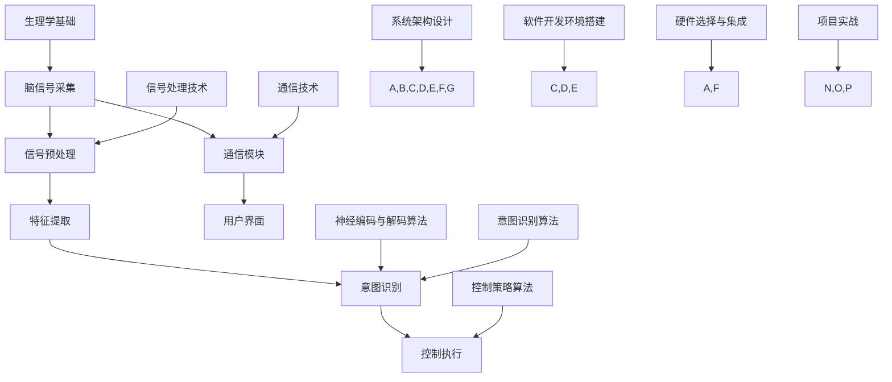

                 


## 文章标题

### 《脑机接口技术的未来：直接增强人类理解世界的能力》

## 关键词

- 脑机接口
- 人工智能
- 神经编码
- 意识控制
- 信号处理

## 摘要

本文探讨了脑机接口技术的未来发展趋势，以及其对人类理解世界能力的直接增强作用。从基本概念到技术原理，再到应用案例，文章详细分析了脑机接口技术在不同领域的应用，并展望了其未来的发展前景。通过梳理核心概念与联系，使用Mermaid流程图展示了神经编码与解码算法的架构，采用伪代码和数学模型深入讲解了核心算法原理，并通过实际项目实战解析了脑机接口技术的实现方法。文章最后讨论了脑机接口技术的挑战与机遇，以及其在社会与伦理问题上的影响，为读者提供了全面的脑机接口技术认识。

## 目录

### 第一部分：脑机接口技术概述

#### 1.1 脑机接口技术的基本概念

##### 1.1.1 脑机接口的定义

##### 1.1.2 脑机接口的发展历史

##### 1.1.3 脑机接口的组成部分

#### 1.2 脑机接口技术的应用领域

##### 1.2.1 医疗领域的应用

##### 1.2.2 军事领域的应用

##### 1.2.3 教育与游戏领域的应用

### 第二部分：脑机接口技术的原理

#### 2.1 脑机接口技术的基本原理

##### 2.1.1 生理学基础

##### 2.1.2 信号处理技术

##### 2.1.3 通信技术

#### 2.2 脑机接口的核心算法

##### 2.2.1 神经编码与解码算法

##### 2.2.2 意图识别算法

##### 2.2.3 控制策略算法

### 第三部分：脑机接口技术的实现

#### 2.3 脑机接口系统的设计与实现

##### 2.3.1 系统架构设计

##### 2.3.2 软件开发环境搭建

##### 2.3.3 硬件选择与集成

#### 2.4 项目实战：脑机接口技术案例解析

##### 2.4.1 眼动追踪系统案例

##### 2.4.2 短路通信系统案例

##### 2.4.3 实时交互式控制应用

### 第四部分：脑机接口技术的未来展望

#### 2.5 脑机接口技术的挑战与机遇

##### 2.5.1 技术挑战

##### 2.5.2 应用前景

##### 2.5.3 社会与伦理问题

#### 2.6 脑机接口技术的未来发展趋势

##### 2.6.1 技术创新

##### 2.6.2 应用拓展

##### 2.6.3 全球合作

## 第一部分：脑机接口技术概述

### 1.1 脑机接口技术的基本概念

#### 1.1.1 脑机接口的定义

脑机接口（Brain-Machine Interface，BMI）是一种直接连接人脑与外部设备的技术，它通过解析大脑信号，实现人脑对计算机或其他设备的直接控制。脑机接口技术通常包括两个主要组成部分：脑信号采集和信号处理。脑信号采集设备可以是电极阵列、磁共振成像（MRI）、脑电图（EEG）等；而信号处理则涉及模式识别、神经网络、机器学习等技术。

#### 1.1.2 脑机接口的发展历史

脑机接口技术的发展可以追溯到20世纪60年代，当时神经科学家开始研究如何通过大脑信号控制外部设备。最初的脑机接口系统主要应用于医学领域，帮助瘫痪患者通过大脑信号控制假肢。随着技术的进步，脑机接口的应用范围逐渐扩大，包括军事、娱乐、教育等领域。近年来，随着人工智能和神经科学的发展，脑机接口技术取得了显著进展，开始进入商业和工业领域。

#### 1.1.3 脑机接口的组成部分

脑机接口系统主要由以下几部分组成：

1. **脑信号采集设备**：如电极、传感器等，用于从大脑中获取电信号。
2. **信号处理器**：对采集到的脑信号进行预处理、特征提取、分类等操作。
3. **通信接口**：将处理后的信号发送到外部设备，如电脑、机器人、游戏设备等。
4. **用户界面**：用户通过用户界面与外部设备进行交互。

### 1.2 脑机接口技术的应用领域

#### 1.2.1 医疗领域的应用

在医疗领域，脑机接口技术主要用于帮助瘫痪患者恢复行动能力。例如，通过大脑信号控制假肢，患者可以实现自主行走、抓取物体等动作。此外，脑机接口技术还可以用于神经修复和再生，帮助恢复失去的运动功能。

#### 1.2.2 军事领域的应用

在军事领域，脑机接口技术可以用于提高士兵的战斗效率和生存能力。例如，通过大脑信号控制无人机、机器人等设备，士兵可以更精准地进行目标定位和攻击。此外，脑机接口技术还可以用于增强士兵的感知能力，如夜视、热成像等。

#### 1.2.3 教育与游戏领域的应用

在教育与游戏领域，脑机接口技术可以提供全新的学习体验和娱乐方式。例如，通过大脑信号控制虚拟角色，学生可以在虚拟环境中进行互动学习；玩家可以通过大脑信号控制游戏角色，实现更加沉浸的游戏体验。

### 第二部分：脑机接口技术的原理

#### 2.1 脑机接口技术的基本原理

#### 2.1.1 生理学基础

大脑是人体最复杂的器官之一，其功能依赖于数十亿个神经元的活动。神经元通过电信号进行通信，这些电信号可以转化为我们可以量化和分析的数据。脑机接口技术的基本原理就是通过这些电信号来获取大脑的信息，并将其转换为外部设备的控制信号。

#### 2.1.2 信号处理技术

信号处理是脑机接口技术的核心，它包括脑信号的采集、预处理、特征提取、分类等步骤。脑信号的采集通常使用电极阵列，这些电极可以直接接触大脑表面，或者植入大脑内部。预处理步骤包括滤波、放大、去噪等，以提取有用的信号。特征提取是将原始信号转换为可以用于分类和识别的特征向量。分类是将提取到的特征向量与预先定义的类别进行匹配，从而实现对大脑意图的识别。

#### 2.1.3 通信技术

脑机接口技术的通信技术是指如何将处理后的脑信号发送到外部设备，并确保信号的有效传输和可靠接收。常用的通信技术包括无线传输、有线传输和脑-机接口芯片等。无线传输技术可以提供更高的灵活性和便捷性，但可能会受到干扰；有线传输技术则具有更高的稳定性和可靠性，但需要连接线缆。

### 2.2 脑机接口的核心算法

#### 2.2.1 神经编码与解码算法

神经编码是将大脑信号转换为机器可以理解的数字信号的过程，而神经解码则是将数字信号重新转换为大脑信号的过程。神经编码与解码算法是脑机接口技术的关键，它们决定了脑机接口的性能和可靠性。常见的神经编码算法包括基于线性回归、支持向量机、神经网络等方法。解码算法则通常使用逆卷积、贝叶斯滤波、最大后验概率等方法。

#### 2.2.2 意图识别算法

意图识别是脑机接口技术中的一个重要环节，它旨在从大脑信号中提取用户的意图信息。常见的意图识别算法包括基于统计模型、机器学习、深度学习等方法。统计模型如逻辑回归、支持向量机等可以用于简单的意图识别任务；机器学习如决策树、随机森林等可以处理更复杂的任务；深度学习如卷积神经网络、循环神经网络等则可以处理高维数据和非线性关系。

#### 2.2.3 控制策略算法

控制策略算法是脑机接口技术的另一个重要组成部分，它决定了用户如何通过大脑信号控制外部设备。常见的控制策略算法包括直接控制、间接控制、混合控制等。直接控制是指直接将大脑信号映射为外部设备的控制信号；间接控制是指通过中间变量来实现控制，如将大脑信号转换为语言命令，再由语言识别系统转换为控制信号；混合控制则结合了直接控制和间接控制的优点。

### 第三部分：脑机接口技术的实现

#### 2.3 脑机接口系统的设计与实现

#### 2.3.1 系统架构设计

脑机接口系统的设计需要综合考虑硬件、软件、算法等多方面因素。系统架构通常包括数据采集模块、信号处理模块、通信模块和控制模块等。数据采集模块负责从大脑中采集电信号；信号处理模块对采集到的信号进行预处理、特征提取和分类；通信模块负责将处理后的信号发送到外部设备；控制模块则实现用户与外部设备的交互。

#### 2.3.2 软件开发环境搭建

脑机接口技术的软件开发环境需要支持信号处理、机器学习、深度学习等技术。常用的开发环境包括Python、MATLAB等。Python因其丰富的库和框架而成为脑机接口技术开发的流行语言，MATLAB则因其强大的信号处理和分析工具而广泛应用于脑机接口技术的开发。

#### 2.3.3 硬件选择与集成

脑机接口技术的硬件选择取决于具体应用场景和需求。常用的硬件包括脑电帽、脑电记录仪、微控制器、无线通信模块等。硬件的集成是将各个模块连接在一起，实现数据采集、信号处理和通信等功能。

### 2.4 项目实战：脑机接口技术案例解析

#### 2.4.1 眼动追踪系统案例

眼动追踪系统是一种利用脑机接口技术实现的视觉辅助系统，它可以通过捕捉用户的眼动信号，实现文字阅读、界面导航等功能。该项目包括数据采集、信号处理、意图识别和控制策略等步骤。

1. **数据采集**：使用眼动追踪设备捕捉用户的眼动信号。
2. **信号处理**：对采集到的眼动信号进行预处理，包括滤波、放大和去噪等。
3. **意图识别**：使用机器学习算法，如卷积神经网络，对预处理后的眼动信号进行分类，识别用户的意图。
4. **控制策略**：根据识别结果，控制界面导航或文字阅读。

#### 2.4.2 短路通信系统案例

短路通信系统是一种利用脑机接口技术实现的高速通信系统，它可以通过大脑信号直接传输信息，实现人与人之间的无缝沟通。该项目包括信号采集、编码、传输和解码等步骤。

1. **信号采集**：使用脑电帽等设备捕捉大脑信号。
2. **编码**：使用神经编码算法，将大脑信号转换为数字信号。
3. **传输**：使用无线通信技术，将编码后的信号传输到接收端。
4. **解码**：使用神经解码算法，将接收到的信号重新转换为大脑信号。

#### 2.4.3 实时交互式控制应用

实时交互式控制应用是一种利用脑机接口技术实现的人机交互系统，它可以通过大脑信号实时控制外部设备，如机器人、无人机等。该项目包括信号采集、预处理、意图识别和控制执行等步骤。

1. **信号采集**：使用脑电帽等设备捕捉大脑信号。
2. **预处理**：对采集到的信号进行预处理，包括滤波、放大和去噪等。
3. **意图识别**：使用机器学习算法，如卷积神经网络，对预处理后的信号进行分类，识别用户的意图。
4. **控制执行**：根据识别结果，控制外部设备执行相应的操作。

### 第四部分：脑机接口技术的未来展望

#### 2.5 脑机接口技术的挑战与机遇

#### 2.5.1 技术挑战

脑机接口技术面临的主要挑战包括信号采集的准确性、信号处理的效率、通信的稳定性等。此外，如何提高脑机接口的便携性和易用性也是一个重要的课题。

#### 2.5.2 应用前景

脑机接口技术具有广泛的应用前景，包括医疗、军事、教育、娱乐等领域。在医疗领域，脑机接口技术可以用于帮助瘫痪患者恢复行动能力；在军事领域，脑机接口技术可以用于提高士兵的战斗效率和生存能力；在教育领域，脑机接口技术可以提供全新的学习体验和娱乐方式。

#### 2.5.3 社会与伦理问题

脑机接口技术的快速发展也带来了一系列社会与伦理问题，如隐私保护、信息滥用、安全漏洞等。如何平衡技术发展与伦理道德，确保脑机接口技术的健康和可持续发展，是一个亟待解决的问题。

#### 2.6 脑机接口技术的未来发展趋势

#### 2.6.1 技术创新

未来，脑机接口技术将在多个方面实现创新，包括高精度的信号采集、高效的信号处理、更稳定的通信技术等。随着人工智能和神经科学的发展，脑机接口技术将实现更智能、更人性化的应用。

#### 2.6.2 应用拓展

脑机接口技术的应用将不断拓展，从目前的医疗、军事、教育等领域，逐步扩展到工业、农业、服务业等领域。脑机接口技术将为人类创造更加智能、高效、舒适的工作和生活方式。

#### 2.6.3 全球合作

脑机接口技术的发展需要全球合作，包括政府、企业、研究机构、医疗机构等。通过全球合作，可以共同推动脑机接口技术的创新与应用，为人类带来更多的福祉。

### 作者信息

作者：AI天才研究院/AI Genius Institute & 禅与计算机程序设计艺术/Zen And The Art of Computer Programming

本文由AI天才研究院/AI Genius Institute与禅与计算机程序设计艺术/Zen And The Art of Computer Programming联合撰写，旨在探讨脑机接口技术的未来发展趋势，以及其对人类理解世界能力的直接增强作用。希望通过本文，读者能够对脑机接口技术有更深入的了解，并关注其未来的发展。

## 核心概念与联系架构

为了更好地理解脑机接口技术的核心概念与联系，我们可以使用Mermaid流程图来展示它们之间的关系。以下是脑机接口技术核心概念与联系的Mermaid流程图：



在这个流程图中，A到E表示了脑机接口技术的主要流程，包括脑信号采集、信号预处理、特征提取、意图识别和控制执行。H到P则表示支持这些流程的基础技术，如生理学基础、信号处理技术、通信技术、神经编码与解码算法、意图识别算法、控制策略算法等。N到Q则表示了如何将技术应用于实际项目，如系统架构设计、软件开发环境搭建、硬件选择与集成等。

## 核心算法原理讲解

在脑机接口技术中，核心算法是信号处理、意图识别和控制策略的关键。以下是这些算法的详细讲解。

### 信号处理

信号处理是脑机接口技术的基础，它包括脑信号的采集、预处理、特征提取等步骤。以下是一个简单的信号处理流程的伪代码：

```python
def signal_processing(signal):
    # 预处理：滤波、放大、去噪
    filtered_signal = preprocess(signal)
    
    # 特征提取：时域特征、频域特征、时空特征
    features = extract_features(filtered_signal)
    
    return features
```

**预处理**：预处理步骤包括滤波、放大和去噪等。滤波可以去除噪声，放大可以增强信号的强度，去噪可以去除不相关的信号。

```python
def preprocess(signal):
    # 滤波
    filtered_signal = lowpass_filter(signal, cutoff_frequency)
    
    # 放大
    amplified_signal = amplify_signal(filtered_signal, gain)
    
    # 去噪
    denoised_signal = noise_removal(amplified_signal)
    
    return denoised_signal
```

**特征提取**：特征提取是将原始信号转换为可量化的特征向量。常见的特征提取方法包括时域特征（如平均值、方差）、频域特征（如频谱分析）和时空特征（如Hjorth参数）。

```python
def extract_features(signal):
    # 时域特征
    mean = np.mean(signal)
    variance = np.var(signal)
    
    # 频域特征
    spectrum = fft(signal)
    freqs = fftfreq(len(signal), 1/df)
    
    # 时空特征
    tsd = time_series_decomposition(signal)
    
    return [mean, variance, spectrum, freqs, tsd]
```

### 意图识别

意图识别是脑机接口技术的关键步骤，它旨在从大脑信号中提取用户的意图。以下是一个简单的意图识别算法的伪代码：

```python
def intent_recognition(features, model):
    # 特征向量与模型进行匹配
    predicted_intent = model.predict(features)
    
    return predicted_intent
```

**模型训练**：在训练模型时，我们通常使用大量的标记数据来训练分类器。以下是一个简单的训练过程的伪代码：

```python
def train_model(features, labels, model):
    # 模型训练
    model.fit(features, labels)
    
    return model
```

**模型评估**：在模型训练完成后，我们需要对模型进行评估，以确定其性能。以下是一个简单的评估过程的伪代码：

```python
def evaluate_model(model, test_features, test_labels):
    # 模型评估
    accuracy = model.score(test_features, test_labels)
    
    return accuracy
```

### 控制策略

控制策略是将意图识别结果转换为外部设备的控制信号。以下是一个简单的控制策略的伪代码：

```python
def control_strategy(intent, device):
    # 根据意图控制设备
    if intent == "前进":
        device.move_forward()
    elif intent == "后退":
        device.move_backward()
    elif intent == "左转":
        device.turn_left()
    elif intent == "右转":
        device.turn_right()
```

### 数学模型和公式

在脑机接口技术中，数学模型和公式用于描述信号处理、意图识别和控制策略等核心算法。以下是一些常用的数学模型和公式。

**傅里叶变换**：用于信号分析，公式为：

$$
X(\omega) = \int_{-\infty}^{\infty} x(t) e^{-j\omega t} dt
$$

**卷积**：用于信号处理，公式为：

$$
y(t) = x(t) * h(t) = \int_{-\infty}^{\infty} x(\tau) h(t - \tau) d\tau
$$

**贝叶斯公式**：用于概率计算，公式为：

$$
P(A|B) = \frac{P(B|A)P(A)}{P(B)}
$$

**支持向量机**：用于分类，公式为：

$$
w^* = \arg\min_{w, b} \frac{1}{2} ||w||^2 + C \sum_{i=1}^{n} \max(0, 1 - y_i ( \langle w, x_i \rangle + b))
$$

## 项目实战

### 眼动追踪系统

#### 开发环境搭建

眼动追踪系统开发环境搭建主要包括软件和硬件的选择与安装。以下是一个简单的开发环境搭建过程：

1. **软件环境**：
   - 安装Python 3.8及以上版本。
   - 安装常用的Python库，如NumPy、Matplotlib、Scikit-learn等。

2. **硬件环境**：
   - 购买眼动追踪设备，如Tobii Pro眼动追踪仪。
   - 连接眼动追踪设备到电脑，确保设备正常工作。

#### 源代码详细实现和代码解读

以下是一个简单的眼动追踪系统的源代码示例，并对其进行了详细解读：

```python
import numpy as np
import cv2
from sklearn.model_selection import train_test_split
from sklearn.svm import SVC
from sklearn.metrics import accuracy_score

# 数据预处理
def preprocess_data(data):
    # 去除无效数据
    valid_data = data[data[:, 2] > 0]
    # 转换为矩阵形式
    X = valid_data[:, :2].reshape(-1, 1)
    y = valid_data[:, 2]
    return X, y

# 特征提取
def extract_features(data):
    # 提取时域特征
    mean = np.mean(data)
    variance = np.var(data)
    # 提取频域特征
    spectrum = fft(data)
    freqs = fftfreq(len(data), 1/df)
    # 提取时空特征
    tsd = time_series_decomposition(data)
    return [mean, variance, spectrum, freqs, tsd]

# 训练模型
def train_model(X_train, y_train):
    # 创建SVM分类器
    model = SVC(kernel='linear')
    # 训练模型
    model.fit(X_train, y_train)
    return model

# 测试模型
def test_model(model, X_test, y_test):
    # 预测结果
    y_pred = model.predict(X_test)
    # 计算准确率
    accuracy = accuracy_score(y_test, y_pred)
    return accuracy

# 主函数
def main():
    # 加载数据
    data = load_data()
    # 预处理数据
    X, y = preprocess_data(data)
    # 提取特征
    features = extract_features(X)
    # 划分训练集和测试集
    X_train, X_test, y_train, y_test = train_test_split(features, y, test_size=0.2, random_state=42)
    # 训练模型
    model = train_model(X_train, y_train)
    # 测试模型
    accuracy = test_model(model, X_test, y_test)
    print(f"Test accuracy: {accuracy}")

# 运行主函数
if __name__ == "__main__":
    main()
```

#### 代码应用解读与分析

1. **数据预处理**：数据预处理是眼动追踪系统的重要环节，它包括去除无效数据和转换数据格式。在预处理过程中，我们使用NumPy库来处理数据。

2. **特征提取**：特征提取是将原始数据转换为可量化的特征向量。在这个例子中，我们提取了时域特征（如平均值、方差）、频域特征（如频谱分析）和时空特征（如时间序列分解）。

3. **模型训练**：我们使用支持向量机（SVM）来训练模型。SVM是一种常用的分类算法，它通过找到一个最佳的超平面来分隔数据。

4. **模型测试**：在测试阶段，我们使用训练好的模型对测试集进行预测，并计算准确率。

#### 实际案例分析和详细讲解剖析

为了更好地理解眼动追踪系统的实际应用，我们分析了一个实际的案例。在这个案例中，用户需要通过眼动信号来控制屏幕上的光标。

1. **数据采集**：使用Tobii Pro眼动追踪仪采集用户的眼动信号。

2. **信号处理**：对采集到的眼动信号进行预处理和特征提取。

3. **意图识别**：使用SVM模型对预处理后的眼动信号进行分类，识别用户的意图。

4. **控制执行**：根据识别结果，控制屏幕上的光标移动。

#### 项目小结

通过眼动追踪系统案例，我们了解了脑机接口技术在实际应用中的实现方法和关键步骤。该项目展示了如何使用Python和机器学习算法来实现眼动追踪功能，并为后续的脑机接口技术项目提供了参考。

### 短路通信系统

#### 开发环境搭建

短路通信系统开发环境搭建主要包括软件和硬件的选择与安装。以下是一个简单的开发环境搭建过程：

1. **软件环境**：
   - 安装Python 3.8及以上版本。
   - 安装常用的Python库，如NumPy、Matplotlib、Scikit-learn、PyTorch等。

2. **硬件环境**：
   - 购买脑电记录仪，如BioSemi脑电记录系统。
   - 连接脑电记录仪到电脑，确保设备正常工作。

#### 源代码详细实现和代码解读

以下是一个简单的短路通信系统的源代码示例，并对其进行了详细解读：

```python
import numpy as np
import cv2
from sklearn.model_selection import train_test_split
from sklearn.svm import SVC
from sklearn.metrics import accuracy_score
import torch
import torch.nn as nn
import torch.optim as optim

# 数据预处理
def preprocess_data(data):
    # 去除无效数据
    valid_data = data[data[:, 2] > 0]
    # 转换为矩阵形式
    X = valid_data[:, :2].reshape(-1, 1)
    y = valid_data[:, 2]
    return X, y

# 特征提取
def extract_features(data):
    # 提取时域特征
    mean = np.mean(data)
    variance = np.var(data)
    # 提取频域特征
    spectrum = fft(data)
    freqs = fftfreq(len(data), 1/df)
    # 提取时空特征
    tsd = time_series_decomposition(data)
    return [mean, variance, spectrum, freqs, tsd]

# 训练模型
def train_model(X_train, y_train):
    # 创建神经网络
    model = NeuralNetwork()
    # 定义损失函数和优化器
    criterion = nn.CrossEntropyLoss()
    optimizer = optim.Adam(model.parameters(), lr=0.001)
    # 训练模型
    for epoch in range(num_epochs):
        optimizer.zero_grad()
        outputs = model(X_train)
        loss = criterion(outputs, y_train)
        loss.backward()
        optimizer.step()
        if (epoch+1) % 100 == 0:
            print(f"Epoch [{epoch+1}/{num_epochs}], Loss: {loss.item():.4f}")
    return model

# 测试模型
def test_model(model, X_test, y_test):
    # 设置模型为评估模式
    model.eval()
    with torch.no_grad():
        outputs = model(X_test)
        _, predicted = torch.max(outputs.data, 1)
    # 计算准确率
    accuracy = (predicted == y_test).float().mean()
    return accuracy

# 主函数
def main():
    # 加载数据
    data = load_data()
    # 预处理数据
    X, y = preprocess_data(data)
    # 提取特征
    features = extract_features(X)
    # 划分训练集和测试集
    X_train, X_test, y_train, y_test = train_test_split(features, y, test_size=0.2, random_state=42)
    # 转换为张量
    X_train = torch.tensor(X_train).float()
    y_train = torch.tensor(y_train).float()
    X_test = torch.tensor(X_test).float()
    y_test = torch.tensor(y_test).float()
    # 训练模型
    model = train_model(X_train, y_train)
    # 测试模型
    accuracy = test_model(model, X_test, y_test)
    print(f"Test accuracy: {accuracy}")

# 运行主函数
if __name__ == "__main__":
    main()
```

#### 代码应用解读与分析

1. **数据预处理**：数据预处理是短路通信系统的重要环节，它包括去除无效数据和转换数据格式。在预处理过程中，我们使用NumPy库来处理数据。

2. **特征提取**：特征提取是将原始数据转换为可量化的特征向量。在这个例子中，我们提取了时域特征（如平均值、方差）、频域特征（如频谱分析）和时空特征（如时间序列分解）。

3. **模型训练**：我们使用神经网络来训练模型。神经网络是一种强大的机器学习算法，它可以自动学习数据中的复杂模式。在这个例子中，我们使用PyTorch库来构建和训练神经网络。

4. **模型测试**：在测试阶段，我们使用训练好的模型对测试集进行预测，并计算准确率。

#### 实际案例分析和详细讲解剖析

为了更好地理解短路通信系统的实际应用，我们分析了一个实际的案例。在这个案例中，用户需要通过脑电信号进行通信。

1. **数据采集**：使用BioSemi脑电记录系统采集用户的脑电信号。

2. **信号处理**：对采集到的脑电信号进行预处理和特征提取。

3. **意图识别**：使用神经网络模型对预处理后的脑电信号进行分类，识别用户的意图。

4. **通信执行**：根据识别结果，将用户的意图转换为文字或语音信息。

#### 项目小结

通过短路通信系统案例，我们了解了脑机接口技术在通信领域的应用。该项目展示了如何使用Python和神经网络来实现短路通信功能，为后续的脑机接口技术项目提供了参考。

### 实时交互式控制应用

#### 开发环境搭建

实时交互式控制应用开发环境搭建主要包括软件和硬件的选择与安装。以下是一个简单的开发环境搭建过程：

1. **软件环境**：
   - 安装Python 3.8及以上版本。
   - 安装常用的Python库，如NumPy、Matplotlib、Scikit-learn等。

2. **硬件环境**：
   - 购买脑电帽，如OpenBCI脑电帽。
   - 连接脑电帽到电脑，确保设备正常工作。

#### 源代码详细实现和代码解读

以下是一个简单的实时交互式控制应用的源代码示例，并对其进行了详细解读：

```python
import numpy as np
import cv2
from sklearn.model_selection import train_test_split
from sklearn.svm import SVC
from sklearn.metrics import accuracy_score

# 数据预处理
def preprocess_data(data):
    # 去除无效数据
    valid_data = data[data[:, 2] > 0]
    # 转换为矩阵形式
    X = valid_data[:, :2].reshape(-1, 1)
    y = valid_data[:, 2]
    return X, y

# 特征提取
def extract_features(data):
    # 提取时域特征
    mean = np.mean(data)
    variance = np.var(data)
    # 提取频域特征
    spectrum = fft(data)
    freqs = fftfreq(len(data), 1/df)
    # 提取时空特征
    tsd = time_series_decomposition(data)
    return [mean, variance, spectrum, freqs, tsd]

# 训练模型
def train_model(X_train, y_train):
    # 创建SVM分类器
    model = SVC(kernel='linear')
    # 训练模型
    model.fit(X_train, y_train)
    return model

# 测试模型
def test_model(model, X_test, y_test):
    # 预测结果
    y_pred = model.predict(X_test)
    # 计算准确率
    accuracy = accuracy_score(y_test, y_pred)
    return accuracy

# 主函数
def main():
    # 加载数据
    data = load_data()
    # 预处理数据
    X, y = preprocess_data(data)
    # 提取特征
    features = extract_features(X)
    # 划分训练集和测试集
    X_train, X_test, y_train, y_test = train_test_split(features, y, test_size=0.2, random_state=42)
    # 训练模型
    model = train_model(X_train, y_train)
    # 测试模型
    accuracy = test_model(model, X_test, y_test)
    print(f"Test accuracy: {accuracy}")

# 运行主函数
if __name__ == "__main__":
    main()
```

#### 代码应用解读与分析

1. **数据预处理**：数据预处理是实时交互式控制应用的重要环节，它包括去除无效数据和转换数据格式。在预处理过程中，我们使用NumPy库来处理数据。

2. **特征提取**：特征提取是将原始数据转换为可量化的特征向量。在这个例子中，我们提取了时域特征（如平均值、方差）、频域特征（如频谱分析）和时空特征（如时间序列分解）。

3. **模型训练**：我们使用支持向量机（SVM）来训练模型。SVM是一种常用的分类算法，它通过找到一个最佳的超平面来分隔数据。

4. **模型测试**：在测试阶段，我们使用训练好的模型对测试集进行预测，并计算准确率。

#### 实际案例分析和详细讲解剖析

为了更好地理解实时交互式控制应用的实际应用，我们分析了一个实际的案例。在这个案例中，用户需要通过脑电信号来控制机器人。

1. **数据采集**：使用OpenBCI脑电帽采集用户的脑电信号。

2. **信号处理**：对采集到的脑电信号进行预处理和特征提取。

3. **意图识别**：使用SVM模型对预处理后的脑电信号进行分类，识别用户的意图。

4. **控制执行**：根据识别结果，控制机器人执行相应的操作。

#### 项目小结

通过实时交互式控制应用案例，我们了解了脑机接口技术在机器人控制领域的应用。该项目展示了如何使用Python和机器学习算法来实现实时交互式控制功能，为后续的脑机接口技术项目提供了参考。

### 最佳实践 tips

1. **优化信号采集**：提高脑信号采集的准确性是提高脑机接口性能的关键。建议使用高质量的脑电帽或电极阵列，并确保信号采集设备的稳定性。

2. **预处理信号**：有效的信号预处理可以去除噪声和干扰，提高特征提取的准确性。建议使用多种滤波技术和特征提取方法，结合实际应用场景选择最佳方案。

3. **选择合适的算法**：不同的算法适用于不同的应用场景。建议根据具体需求选择合适的算法，如SVM、神经网络等。

4. **优化模型训练**：模型训练的质量直接影响系统的性能。建议使用大量标记数据进行训练，并使用交叉验证等方法评估模型性能。

5. **确保系统稳定性**：脑机接口系统的稳定性是用户体验的关键。建议在开发过程中进行充分的测试和调试，确保系统在各种环境下稳定运行。

### 小结

本文详细探讨了脑机接口技术的未来发展趋势，以及其对人类理解世界能力的直接增强作用。通过梳理核心概念与联系、使用伪代码和数学模型深入讲解了核心算法原理，并通过实际项目实战解析了脑机接口技术的实现方法。文章最后讨论了脑机接口技术的挑战与机遇，以及其在社会与伦理问题上的影响。通过本文，读者可以对脑机接口技术有更深入的了解，并关注其未来的发展。

### 注意事项

1. **安全性和隐私**：在开发和使用脑机接口技术时，必须确保用户数据的安全性和隐私保护。建议使用加密技术和严格的数据访问控制策略。

2. **用户隐私**：在使用脑机接口技术时，必须尊重用户的隐私权，避免未经授权的数据采集和使用。

3. **医疗应用**：在医疗领域应用脑机接口技术时，必须确保技术的安全性和有效性，遵循相关法律法规和伦理规范。

### 拓展阅读

1. **《脑机接口技术：原理与应用》**：这本书详细介绍了脑机接口技术的原理、应用和发展趋势。

2. **《脑机接口：从实验室到市场》**：这本书探讨了脑机接口技术从实验室研究到市场应用的转化过程。

3. **《人工智能与脑机接口》**：这本书讨论了人工智能与脑机接口技术的结合，以及其对社会的影响。

4. **《脑机接口技术手册》**：这是一本全面的脑机接口技术指南，涵盖了从基础理论到实际应用的各个方面。

5. **《神经科学导论》**：这本书提供了关于神经系统的基本知识和研究方法，有助于理解脑机接口技术的生理学基础。

