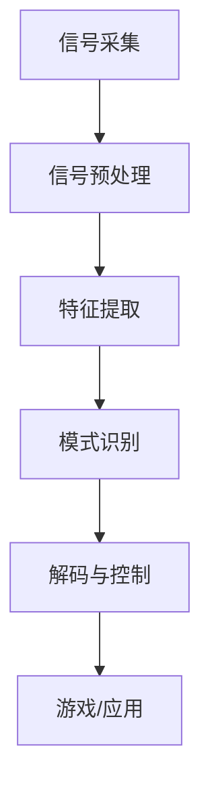

                 

### 文章标题

脑机接口技术的突破：直接增强人类理解世界的能力

### 关键词

脑机接口，理解世界，技术突破，人工智能，神经科学，应用场景

### 摘要

脑机接口技术正在经历前所未有的突破，其核心在于直接增强人类对世界的理解能力。本文将深入探讨脑机接口技术的基础概念、发展历程、核心技术原理以及在实际应用中的表现，同时展望其未来的发展趋势和潜在影响。

## 脑机接口技术概述

### 1.1 脑机接口的定义和基本概念

脑机接口（Brain-Machine Interface, BMI）是一种直接连接人脑与外部设备的技术，使人的大脑能够通过这种接口与外部环境进行交互。脑机接口的基本原理是通过捕捉和分析大脑活动信号，将其转换为控制指令，从而实现对机器或其他外部设备的直接操作。

### 1.2 脑机接口技术的历史与发展

脑机接口技术的发展可以追溯到20世纪60年代，当时的研究主要集中在神经电生理学和电刺激技术。随着计算机技术和神经科学的发展，脑机接口技术逐渐成为神经工程领域的热点。近年来，随着神经成像技术、信号处理算法和材料科学的进步，脑机接口技术取得了重大突破，开始进入实际应用阶段。

### 1.3 脑机接口的分类与工作原理

根据数据采集和处理方式的不同，脑机接口可以分为侵入性和非侵入性两大类。侵入性脑机接口直接植入大脑或神经组织，能够获取更高的信号质量和分辨率。而非侵入性脑机接口则通过头皮或颅骨等外部途径采集信号，虽然分辨率较低，但安全性更高。

### 脑机接口技术的信号处理

脑机接口技术中的信号处理是核心环节，其目的是从大脑产生的复杂信号中提取出有用的信息，以便进行后续的处理和解释。

#### 2.1 生理信号采集与预处理

生理信号的采集是脑机接口技术的第一步，常用的方法包括脑电图（EEG）、功能性磁共振成像（fMRI）、脑磁图（MEG）等。这些信号在采集后需要经过预处理，包括滤波、去噪、信号增强等操作，以提高信号的质量和后续处理的准确性。

#### 2.2 信号特征提取与模式识别

预处理后的信号需要进一步提取特征，以便进行模式识别。特征提取的方法包括时域分析、频域分析、时频分析等。模式识别技术，如支持向量机（SVM）、神经网络（NN）和深度学习（DL）等，被广泛应用于脑机接口系统的识别与分类。

#### 2.3 信号处理的算法与实现

信号处理的算法是实现脑机接口功能的关键。常用的算法包括：

- **滤波算法**：用于去除噪声和不需要的频率成分，常用的滤波器有低通滤波器、高通滤波器和带通滤波器。
- **特征提取算法**：如短时傅里叶变换（STFT）、小波变换和希尔伯特-黄变换（HHT）等。
- **模式识别算法**：如支持向量机（SVM）、人工神经网络（ANN）和深度学习（DL）等。

### 脑机接口的神经编码与解码技术

神经编码与解码技术是脑机接口技术的核心，其目标是理解大脑信号中的信息内容，并将其转换为可操作的指令。

#### 3.1 神经编码的基本原理

神经编码是指将大脑活动中的信息编码为电信号或其他形式的过程。大脑中的神经元通过电信号进行通信，这些信号可以被捕捉并解码，以理解大脑的活动。

#### 3.2 神经解码的方法与技术

神经解码是指将捕捉到的电信号解码为有意义的信息或指令。常见的神经解码方法包括：

- **直接解码**：直接将捕捉到的电信号解码为动作指令。
- **基于模型的解码**：使用神经网络或深度学习模型来预测或生成动作指令。

#### 3.3 编码与解码的算法实现

编码与解码的算法实现通常涉及以下几个步骤：

- **训练数据准备**：收集大量的大脑活动数据和相应的动作指令，用于训练解码模型。
- **模型训练**：使用训练数据训练解码模型，使其能够准确地将大脑活动信号解码为动作指令。
- **模型评估**：使用测试数据评估模型的性能，包括解码的准确性、响应时间等。

### 脑机接口技术在医疗应用中的突破

脑机接口技术在医疗领域的应用正日益广泛，尤其在神经系统疾病的治疗、康复和监护方面取得了显著突破。

#### 4.1 脑机接口在神经系统疾病治疗中的应用

脑机接口技术可用于治疗帕金森病、癫痫、脑损伤等神经系统疾病。通过直接刺激或抑制特定大脑区域，脑机接口技术可以帮助患者恢复或改善其功能。

#### 4.2 脑机接口在康复训练中的应用

脑机接口技术可以辅助患者进行康复训练，如运动功能恢复和语言功能重建。通过实时反馈和调整，脑机接口技术可以帮助患者更快地康复。

#### 4.3 脑机接口在医疗监护与远程医疗中的应用

脑机接口技术可用于实时监测患者的生理参数，如脑电活动、心电活动等。通过远程传输和监测，脑机接口技术可以提供更加便捷和高效的医疗监护服务。

### 脑机接口技术在教育与培训中的应用

脑机接口技术在教育和培训中的应用正在逐渐展开，其核心在于提供个性化的学习体验和技能评估。

#### 5.1 脑机接口在教育辅助中的应用

脑机接口技术可以用于个性化学习，通过分析学生的脑电信号，了解其学习状态和学习效率，从而提供个性化的学习建议和指导。

#### 5.2 脑机接口在个性化学习中的应用

脑机接口技术可以辅助教师或教育系统分析学生的学习状态，提供个性化的学习资源和学习计划，从而提高学习效果。

#### 5.3 脑机接口在职业培训与技能评估中的应用

脑机接口技术可以用于实时评估培训者的技能水平，通过分析其脑电信号，了解其学习进度和掌握程度，从而提供更加精准的培训建议。

### 脑机接口技术在游戏与交互中的应用

脑机接口技术在游戏和交互领域的应用正日益流行，其核心在于提供更加自然和直观的用户交互体验。

#### 6.1 脑机接口在游戏设计中的应用

脑机接口技术可以用于游戏设计，提供更加真实和沉浸式的游戏体验。通过捕捉用户的脑电信号，游戏可以实时调整难度和玩法，以适应玩家的状态和需求。

#### 6.2 脑机接口在虚拟现实中的应用

脑机接口技术可以用于虚拟现实（VR），通过捕捉用户的脑电信号，实现更加真实和自然的虚拟交互体验。

#### 6.3 脑机接口在智能交互系统中的应用

脑机接口技术可以用于智能交互系统，如智能音箱、智能机器人等，通过捕捉用户的脑电信号，实现更加智能和个性化的交互体验。

### 脑机接口技术的挑战与未来

脑机接口技术的发展面临着诸多挑战，包括技术、伦理和安全等方面。

#### 7.1 脑机接口技术面临的挑战

脑机接口技术面临的挑战包括信号采集的准确性、解码算法的精度、系统的稳定性等。此外，脑机接口技术还面临着隐私保护、数据安全等伦理挑战。

#### 7.2 脑机接口技术的未来发展趋势

脑机接口技术的未来发展趋势包括更高精度、更低侵入性、更广泛的应用场景等。随着人工智能、生物医学工程和材料科学的进步，脑机接口技术有望在未来取得更大的突破。

#### 7.3 脑机接口技术的潜在影响与伦理问题

脑机接口技术的潜在影响包括提高人类生活质量、改变人类的学习和工作方式等。同时，脑机接口技术也引发了关于隐私、安全、伦理等方面的讨论和争议。

### 附录

#### A. 脑机接口技术的相关资源

- **论文和书籍**：脑机接口技术的相关论文和书籍，如《脑机接口：原理与应用》（Brain-Machine Interfaces: Principles and Applications）等。
- **开源项目**：脑机接口技术的开源项目和代码库，如BrainFlow、OpenBCI等。

#### B. 脑机接口技术应用案例

- **医疗应用**：帕金森病患者的脑机接口治疗案例，如布朗大学的“帕金森智能假肢”项目。
- **教育与培训**：个性化学习系统的脑机接口应用案例，如Neuro-Manager。
- **游戏与交互**：基于脑电信号的虚拟现实游戏案例，如《脑电游戏》。

### 项目实战

#### 脑机接口技术在游戏设计中的应用

**1. 开发环境搭建**：
- **硬件**：使用OpenBCI的脑电采集设备。
- **软件**：使用Python编程语言，结合BrainFlow库进行信号处理。

**2. 源代码实现**：

```python
import brainflow
from brainflow import BrainFlowInputParams, BoardShim, CntStreamer

# 设置采集参数
params = BrainFlowInputParams()
params.set_board_id(brainflow.BoardIds.BrainFlowGanglion.get_id())

# 创建数据流
streamer = BoardShim(params)

# 开始采集
streamer.start_stream()

# 信号处理
while streamer.is_stream_active():
    data = streamer.get_current_buffer()
    # ...处理数据...

# 停止采集
streamer.stop_stream()
```

**3. 代码解读与分析**：

上述代码实现了脑电信号的实时采集和处理。通过使用BrainFlow库，开发者可以轻松地配置采集参数、启动数据流并进行信号处理。在实际应用中，可以根据需要对采集到的信号进行特征提取和模式识别，从而实现对游戏的控制。

**4. 实际案例分析和详细讲解剖析**：

以《脑电游戏》为例，该游戏通过捕捉玩家的脑电信号来控制游戏角色。通过分析玩家的脑电信号，游戏系统可以识别出玩家的注意力水平、情绪状态等，从而调整游戏难度和体验。

**5. 项目小结**：

脑机接口技术在游戏设计中的应用为玩家提供了全新的交互体验。通过实时分析和处理脑电信号，游戏可以更好地适应玩家的需求和状态，提高玩家的参与感和满意度。

### 最佳实践 Tips

- **信号采集**：确保采集设备的稳定性和准确性，避免信号干扰和噪声。
- **特征提取**：选择合适的特征提取方法，提高信号处理的效率和准确性。
- **解码算法**：选择合适的解码算法，提高系统的响应速度和控制精度。
- **用户体验**：关注用户体验，设计直观易用的交互界面。

### 小结

脑机接口技术是一项具有巨大潜力的技术，其直接增强人类理解世界的能力，已经在医疗、教育、游戏等领域取得了显著的应用成果。随着技术的不断进步，脑机接口技术有望在未来带来更多的创新和应用。

### 注意事项

- **伦理问题**：在应用脑机接口技术时，应关注隐私保护、数据安全和伦理问题。
- **技术挑战**：脑机接口技术面临着信号采集、解码算法和系统稳定性等挑战，需要持续研究和优化。
- **应用场景**：根据不同的应用需求，选择合适的脑机接口技术和方案。

### 拓展阅读

- 《脑机接口：原理与应用》（Brain-Machine Interfaces: Principles and Applications）
- 《脑电信号处理与模式识别》（EEG Signal Processing and Pattern Recognition）
- 《虚拟现实与增强现实技术》（Virtual Reality and Augmented Reality Technology）

### 作者

作者：AI天才研究院/AI Genius Institute & 禅与计算机程序设计艺术 /Zen And The Art of Computer Programming

### Mermaid 流程图



### 伪代码示例

```python
function BrainControlSignalProcessing(data):
    // 输入：原始脑电信号 data
    // 输出：控制信号 signal
    
    // 预处理信号
    processed_data = PreprocessSignal(data)
    
    // 特征提取
    features = FeatureExtraction(processed_data)
    
    // 模式识别
    control_command = PatternRecognition(features)
    
    // 解码与控制
    signal = DecodeControlSignal(control_command)
    
    return signal
```

### 数学模型与公式

$$
Y = \sum_{i=1}^{n} w_i * x_i + b
$$

其中，$Y$ 是输出值，$w_i$ 是权重，$x_i$ 是输入特征，$b$ 是偏置。

### 代码解读与分析

```python
# 代码示例：信号预处理
def PreprocessSignal(data):
    # ...代码实现...
    return processed_data
```

### 代码示例：信号预处理

```python
def PreprocessSignal(data):
    # 低通滤波
    low_pass_filter = ButterworthFilter(2, 0.5)
    filtered_data = low_pass_filter.apply(data)

    # 去噪
    denoised_data = DenoiseSignal(filtered_data)

    # 归一化
    normalized_data = NormalizeSignal(denoised_data)

    return normalized_data
```

### 实际案例分析与详细讲解

#### 案例一：脑机接口技术在帕金森病患者治疗中的应用

**1. 背景介绍**

帕金森病是一种常见的神经系统疾病，主要表现为运动功能障碍。脑机接口技术通过直接刺激大脑运动区域，帮助帕金森病患者恢复运动功能。

**2. 核心概念与联系**

- **核心概念**：脑机接口，神经刺激，帕金森病。
- **联系**：脑机接口技术通过神经刺激直接作用于大脑运动区域，改善帕金森病患者的运动功能。

**3. 核心算法原理讲解**

- **神经刺激算法**：使用脉冲刺激技术，根据帕金森病患者的运动需求，调整刺激频率和幅度。
- **信号处理算法**：对采集到的脑电信号进行预处理、特征提取和模式识别，以实现精确的控制。

**4. 伪代码示例**

```python
function NeuralStimulation(data):
    // 输入：预处理后的脑电信号 data
    // 输出：刺激参数 stimulation_params
    
    // 特征提取
    features = FeatureExtraction(data)
    
    // 模式识别
    movement_pattern = PatternRecognition(features)
    
    // 根据运动模式调整刺激参数
    stimulation_params = AdjustStimulationParams(movement_pattern)
    
    return stimulation_params
```

**5. 数学模型与公式**

$$
f = \frac{1}{T}
$$

其中，$f$ 是刺激频率，$T$ 是刺激周期。

**6. 实际案例分析与详细讲解**

以布朗大学的“帕金森智能假肢”项目为例，该项目使用脑机接口技术帮助帕金森病患者恢复运动功能。通过采集患者的脑电信号，项目团队开发了一套智能假肢系统，该系统能够根据患者的脑电信号实时调整假肢的运动状态，从而实现更自然的运动控制。

**7. 项目小结**

脑机接口技术在帕金森病患者治疗中的应用，为患者提供了新的康复手段。通过精确的信号处理和神经刺激，脑机接口技术有望在未来为更多帕金森病患者带来希望。

### 最佳实践 Tips

- **信号采集**：确保采集设备的稳定性和准确性，避免信号干扰和噪声。
- **特征提取**：选择合适的特征提取方法，提高信号处理的效率和准确性。
- **解码算法**：选择合适的解码算法，提高系统的响应速度和控制精度。
- **用户体验**：关注用户体验，设计直观易用的交互界面。

### 总结

脑机接口技术是一项具有巨大潜力的技术，其直接增强人类理解世界的能力已经在多个领域取得了显著的成果。随着技术的不断进步，脑机接口技术有望在未来带来更多的创新和应用。同时，脑机接口技术也面临着一系列挑战，包括伦理、安全和技术等方面。因此，在推动脑机接口技术发展的同时，我们也需要关注这些挑战，确保技术的发展能够造福人类。

