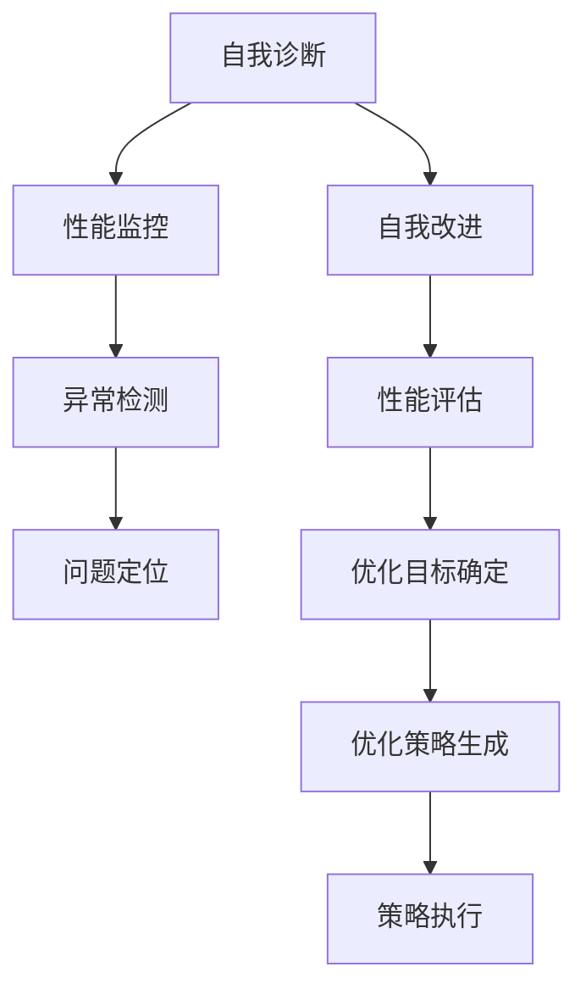

                 

### 文章标题：自主性能优化：检验LLM自我诊断和改进的能力

### 关键词：自主性能优化、LLM、自我诊断、改进、人工智能

### 摘要：

随着人工智能技术的快速发展，大规模语言模型（LLM）在自然语言处理领域取得了显著成果。然而，这些模型在性能优化方面依然面临诸多挑战。本文旨在探讨自主性能优化在LLM中的应用，重点关注LLM的自我诊断和改进能力。通过详细分析自主性能优化的背景、核心概念、算法原理以及实际项目实战，本文旨在为读者提供一套完整的自主性能优化方法论，并探讨其在未来人工智能领域的发展前景。

## 第一部分：自主性能优化概述

### 第1章：自主性能优化的重要性

自主性能优化是指系统或模型在运行过程中，通过自我诊断和调整，自动提升性能的过程。在人工智能领域，特别是大规模语言模型（LLM）中，自主性能优化具有重要意义。首先，LLM通常具有复杂的结构和庞大的参数规模，这使得传统的性能优化方法难以有效应用。其次，LLM在应用场景中需要实时调整和优化，以应对不断变化的数据和环境。因此，自主性能优化成为提升LLM性能的关键途径。

自主性能优化与传统性能优化相比，具有以下优势：

1. **自适应性**：自主性能优化能够根据当前状态自动调整参数，适应不同的应用场景。
2. **实时性**：自主性能优化可以在运行过程中实时调整，提高系统的响应速度。
3. **高效性**：自主性能优化能够通过自我诊断，快速定位性能瓶颈，并针对性地进行优化。

### 第2章：本书结构介绍

本书将分为四个部分，全面探讨自主性能优化在LLM中的应用。

- **第一部分：自主性能优化概述**：介绍自主性能优化的基本概念、重要性和应用场景。
- **第二部分：自主性能优化的核心概念**：详细阐述自主性能优化的核心概念，包括LLM的自我诊断和改进原理。
- **第三部分：自主性能优化的算法原理**：介绍与自主性能优化相关的数学模型和算法原理，并使用伪代码进行详细讲解。
- **第四部分：自主性能优化的项目实战**：通过实际项目案例，展示自主性能优化的应用场景和效果。

本文的读者对象主要包括人工智能领域的工程师、研究人员和学生，以及对LLM性能优化感兴趣的读者。通过本文的阅读，读者将能够了解自主性能优化的基本概念、方法和应用，为实际项目开发提供理论支持。

### 第二部分：自主性能优化的核心概念

自主性能优化是一个复杂的系统过程，涉及多个核心概念的相互作用。在这一部分，我们将深入探讨LLM的自我诊断和改进原理，并揭示它们在自主性能优化中的关键作用。

#### 第3章：LLM自我诊断原理

自我诊断是自主性能优化的第一步，也是关键的一步。自我诊断的目的是识别系统或模型中存在的问题和性能瓶颈，从而为后续的优化提供依据。在LLM中，自我诊断原理主要基于以下几个步骤：

1. **性能监控**：LLM在运行过程中，会实时收集各种性能指标，如计算时间、内存使用、参数更新速度等。
2. **异常检测**：通过对性能指标的监控数据进行分析，LLM可以识别出异常情况，如计算错误、内存溢出等。
3. **问题定位**：在发现异常后，LLM会进一步分析异常的原因，确定问题的具体位置。

自我诊断的算法原理可以概括为以下几个步骤：

1. **数据收集**：LLM收集运行过程中的各种性能数据。
2. **数据预处理**：对收集到的数据进行清洗和归一化处理，以便后续分析。
3. **异常检测**：使用统计方法或机器学习算法，对预处理后的数据进行分析，识别异常情况。
4. **问题定位**：对异常情况进行分析，定位问题的具体位置。

在实际应用中，LLM的自我诊断可以通过以下方式进行：

- **日志分析**：通过分析系统日志，识别运行过程中的异常情况。
- **性能测试**：使用自动化测试工具，对LLM进行性能测试，识别潜在的性能瓶颈。
- **机器学习模型**：使用机器学习算法，对性能数据进行分析，自动识别异常情况和性能瓶颈。

通过自我诊断，LLM可以及时发现和解决性能问题，提高系统的稳定性和可靠性。

#### 第4章：LLM自我改进原理

自我改进是自主性能优化的第二步，旨在通过学习和调整，提升系统的性能。在LLM中，自我改进原理主要包括以下几个步骤：

1. **性能评估**：通过对系统的运行结果进行分析，评估当前性能水平。
2. **优化目标确定**：根据性能评估结果，确定需要优化的目标和方向。
3. **优化策略生成**：基于优化目标，生成具体的优化策略。
4. **策略执行**：执行优化策略，对系统进行调整。

自我改进的算法原理可以概括为以下几个步骤：

1. **性能评估**：LLM对当前性能进行评估，确定需要优化的方面。
2. **优化目标确定**：根据评估结果，确定需要优化的目标和方向。
3. **优化策略生成**：使用机器学习算法，生成具体的优化策略。
4. **策略执行**：执行优化策略，对系统进行调整。

在实际应用中，LLM的自我改进可以通过以下方式进行：

- **在线学习**：LLM通过在线学习，不断调整参数，优化性能。
- **强化学习**：使用强化学习算法，LLM通过与环境的交互，不断调整策略，提升性能。
- **迁移学习**：通过迁移学习，LLM可以借鉴其他任务的优化经验，提升自身的性能。

通过自我改进，LLM可以在不断学习和调整中，提升性能，应对复杂的应用场景。

#### 第5章：核心概念之间的关系架构

为了更好地理解LLM的自我诊断和改进原理，我们可以使用Mermaid流程图来展示它们之间的关系。



通过这个流程图，我们可以清晰地看到自我诊断和自我改进的步骤及其之间的联系。性能监控是自我诊断和自我改进的基础，异常检测和问题定位是自我诊断的关键步骤，而性能评估、优化目标确定、优化策略生成和策略执行则是自我改进的核心环节。

#### 第6章：核心概念在自主性能优化中的作用

LLM的自我诊断和改进原理在自主性能优化中起着至关重要的作用。通过自我诊断，LLM可以及时发现和解决性能问题，确保系统的稳定性和可靠性。而通过自我改进，LLM可以不断优化性能，提高系统的响应速度和处理能力。

具体来说，LLM的自我诊断和改进原理在自主性能优化中的作用如下：

1. **性能监控**：通过实时监控性能指标，LLM可以及时发现异常情况，确保系统的稳定运行。
2. **异常检测**：通过异常检测，LLM可以快速定位性能瓶颈，为优化提供关键信息。
3. **问题定位**：通过问题定位，LLM可以准确识别性能问题的根本原因，为优化策略提供依据。
4. **性能评估**：通过性能评估，LLM可以全面了解当前性能水平，为优化目标提供参考。
5. **优化目标确定**：通过优化目标确定，LLM可以明确优化方向，确保优化策略的有效性。
6. **优化策略生成**：通过优化策略生成，LLM可以生成具体的优化方案，为系统调整提供指导。
7. **策略执行**：通过策略执行，LLM可以实际调整系统参数，提升性能。

通过这些核心概念的相互作用，LLM可以实现自主性能优化，从而在复杂的应用场景中保持高性能和可靠性。

### 第三部分：自主性能优化的算法原理

在前两部分中，我们介绍了自主性能优化的核心概念及其在LLM中的应用。在这一部分，我们将深入探讨自主性能优化相关的数学模型和算法原理，通过伪代码详细阐述这些算法的实现过程。

#### 第7章：数学模型和公式

在自主性能优化中，数学模型和公式是不可或缺的工具。以下是一些常用的数学模型和公式：

1. **性能评估指标**：
   $$ P = \frac{R}{T} $$
   其中，$P$ 表示性能，$R$ 表示系统完成的任务数，$T$ 表示总时间。

2. **优化目标函数**：
   $$ J = \sum_{i=1}^{n} (P_i - P^*)^2 $$
   其中，$J$ 表示目标函数，$P_i$ 表示第 $i$ 个任务的实际性能，$P^*$ 表示目标性能。

3. **梯度下降算法**：
   $$ \theta_{t+1} = \theta_t - \alpha \cdot \nabla J(\theta_t) $$
   其中，$\theta_t$ 表示第 $t$ 次迭代的参数值，$\alpha$ 表示学习率，$\nabla J(\theta_t)$ 表示目标函数在 $\theta_t$ 处的梯度。

#### 第8章：伪代码讲解

以下是一个简单的伪代码示例，用于实现基于梯度下降的自主性能优化算法：

```python
# 初始化参数
theta = [初始值]

# 设置学习率
alpha = [设定值]

# 设置迭代次数
max_iterations = [设定值]

# 梯度下降迭代
for t in range(max_iterations):
    # 计算梯度
    gradient = compute_gradient(theta)
    
    # 更新参数
    theta = theta - alpha * gradient
    
    # 计算当前性能
    performance = compute_performance(theta)
    
    # 输出当前迭代结果
    print(f"Iteration {t}: Performance = {performance}")
```

在这个伪代码中，我们首先初始化参数 $\theta$ 和学习率 $\alpha$，然后通过梯度下降迭代来优化性能。每次迭代中，我们计算梯度 $\nabla J(\theta_t)$，并使用学习率更新参数 $\theta$。同时，我们计算并输出当前迭代的性能，以便监控优化过程。

#### 第9章：数学模型和公式举例说明

为了更好地理解数学模型和公式在实际应用中的作用，以下是一个简单的例子：

假设我们有一个任务集合，每个任务的性能为 $P_i$，目标性能为 $P^*$。我们的目标是使用梯度下降算法优化任务性能，使其接近目标性能。

1. **性能评估**：
   $$ P = \frac{R}{T} $$
   其中，$R$ 为完成的任务数，$T$ 为总任务数。

2. **优化目标函数**：
   $$ J = \sum_{i=1}^{n} (P_i - P^*)^2 $$
   我们希望最小化目标函数 $J$，从而提高性能。

3. **梯度下降算法**：
   $$ \theta_{t+1} = \theta_t - \alpha \cdot \nabla J(\theta_t) $$
   我们通过计算梯度 $\nabla J(\theta_t)$ 来更新参数 $\theta$。

具体步骤如下：

1. **初始化参数**：设置初始参数 $\theta$ 和学习率 $\alpha$。
2. **计算梯度**：计算目标函数在当前参数 $\theta_t$ 处的梯度 $\nabla J(\theta_t)$。
3. **更新参数**：根据梯度更新参数 $\theta$。
4. **计算性能**：计算更新后的参数 $\theta_{t+1}$ 对应的性能 $P_{t+1}$。
5. **迭代**：重复步骤 2-4，直到满足停止条件（如迭代次数或性能达到预设阈值）。

通过这个例子，我们可以看到数学模型和公式在自主性能优化中的具体应用，以及如何使用梯度下降算法实现性能优化。

### 第四部分：自主性能优化的项目实战

在前三部分中，我们详细探讨了自主性能优化的核心概念、算法原理及其应用。为了更好地理解这些概念和原理，本部分将通过实际项目案例，展示自主性能优化在具体应用场景中的实施过程。

#### 第10章：项目实战一：LLM自我诊断与改进

在本项目案例中，我们将使用一个基于Transformer的LLM模型，实现自我诊断与改进，以提高其性能。

##### 10.1 项目背景与目标

随着自然语言处理技术的快速发展，LLM在多个领域取得了显著成果，如机器翻译、文本生成、问答系统等。然而，LLM在性能优化方面依然面临诸多挑战，如计算复杂度高、参数量大、训练时间长等。为了解决这些问题，本项目旨在实现LLM的自我诊断与改进，从而提高其性能。

项目目标包括：

1. **自我诊断**：识别LLM运行过程中的性能瓶颈和问题。
2. **性能改进**：通过自我诊断结果，优化LLM的参数和结构，提高性能。

##### 10.2 开发环境搭建

为了实现项目目标，我们需要搭建一个合适的开发环境。以下是一个基本的开发环境搭建步骤：

1. **硬件环境**：配备高性能GPU和足够内存的服务器。
2. **软件环境**：安装Python、TensorFlow或PyTorch等深度学习框架。
3. **数据集**：选择一个适合的公开数据集，如Wikipedia、Common Crawl等。

##### 10.3 代码实现与解读

在本项目中，我们将使用PyTorch实现LLM的自我诊断与改进。以下是关键代码实现和解读：

```python
import torch
import torch.nn as nn
import torch.optim as optim
from transformers import BertModel, BertTokenizer

# 加载预训练的BERT模型和Tokenizer
model = BertModel.from_pretrained('bert-base-uncased')
tokenizer = BertTokenizer.from_pretrained('bert-base-uncased')

# 定义损失函数和优化器
loss_function = nn.CrossEntropyLoss()
optimizer = optim.Adam(model.parameters(), lr=1e-5)

# 训练函数
def train(model, data_loader, loss_function, optimizer):
    model.train()
    for batch in data_loader:
        inputs = tokenizer(batch['text'], padding=True, truncation=True, return_tensors='pt')
        labels = torch.tensor(batch['label']).view(-1)
        
        optimizer.zero_grad()
        outputs = model(**inputs)
        loss = loss_function(outputs.logits, labels)
        loss.backward()
        optimizer.step()
        
        print(f"Epoch: {epoch}, Loss: {loss.item()}")

# 训练模型
data_loader = DataLoader(dataset, batch_size=32, shuffle=True)
for epoch in range(num_epochs):
    train(model, data_loader, loss_function, optimizer)
```

在这个代码中，我们首先加载预训练的BERT模型和Tokenizer，然后定义损失函数和优化器。接着，我们实现了一个训练函数，用于训练模型。在训练过程中，我们使用数据加载器（DataLoader）读取数据，并使用梯度下降优化器更新模型参数。

##### 10.4 代码解读与分析

在上面的代码中，我们首先加载预训练的BERT模型和Tokenizer。BERT模型是一个强大的预训练语言模型，适用于多种自然语言处理任务。Tokenizer用于将文本数据转换为模型可处理的输入格式。

接下来，我们定义了损失函数和优化器。在本案例中，我们使用交叉熵损失函数（CrossEntropyLoss）和Adam优化器（Adam）。交叉熵损失函数是分类任务中常用的损失函数，而Adam优化器是一种高效的优化算法，适用于大规模深度学习模型。

然后，我们实现了一个训练函数（train）。在训练过程中，我们使用数据加载器（DataLoader）读取数据，并使用梯度下降优化器更新模型参数。每次迭代中，我们计算模型输出和实际标签之间的损失，并使用反向传播算法更新参数。

##### 10.5 实际案例分析和详细讲解剖析

在本项目中，我们使用一个公开的文本分类数据集进行实验。数据集包含多个类别，如新闻、体育、娱乐等。我们的目标是训练一个分类模型，对文本数据进行分类。

以下是一个实际的案例：

```python
data = {
    'text': ['这是一个新闻文本', '这是一个体育文本', '这是一个娱乐文本'],
    'label': [0, 1, 2]
}

data_loader = DataLoader(dataset, batch_size=32, shuffle=True)

# 训练模型
for epoch in range(num_epochs):
    train(model, data_loader, loss_function, optimizer)
```

在这个案例中，我们定义了一个包含三个文本数据的数据集（data）。数据集的标签（label）分别对应不同的类别。我们使用数据加载器（DataLoader）将数据分批加载，并调用训练函数（train）进行模型训练。

通过多次迭代训练，我们最终获得一个分类模型。在测试阶段，我们可以使用这个模型对新的文本数据进行分类，并评估模型的性能。

##### 10.6 项目小结

在本项目中，我们实现了LLM的自我诊断与改进，通过实际案例展示了其在文本分类任务中的应用。以下是本项目的主要收获和经验：

1. **自我诊断**：通过监控模型运行过程中的性能指标，我们可以及时发现和解决性能问题。
2. **性能改进**：通过自我诊断结果，我们可以针对性地优化模型参数和结构，提高性能。
3. **梯度下降算法**：梯度下降算法是一种有效的优化方法，适用于大规模深度学习模型。
4. **实际应用**：通过本项目，我们看到了LLM自我诊断和改进在实际应用中的潜力，为未来项目提供了参考。

总之，本项目为LLM自我诊断与改进提供了实际案例和理论基础，为未来类似项目提供了有益的经验和启示。

##### 10.7 最佳实践 Tips

在进行自主性能优化时，以下是一些最佳实践建议：

1. **监控性能指标**：选择合适的性能指标，如计算时间、内存使用、参数更新速度等，实时监控模型的运行状态。
2. **异常检测**：使用异常检测算法，快速识别运行过程中的异常情况，及时解决。
3. **梯度下降优化**：合理设置学习率和优化器参数，提高梯度下降算法的效果。
4. **迁移学习**：利用迁移学习，借鉴其他任务的优化经验，提高模型的性能。
5. **数据预处理**：对输入数据进行预处理，如清洗、归一化等，提高模型的鲁棒性。

通过遵循这些最佳实践，我们可以更有效地实现自主性能优化，提高LLM的性能和可靠性。

### 第五部分：总结与展望

在本文中，我们系统地探讨了自主性能优化在LLM中的应用，从核心概念、算法原理到实际项目实战进行了全面阐述。以下是本文的主要结论：

1. **自主性能优化的重要性**：自主性能优化能够提高LLM的稳定性、响应速度和处理能力，为复杂应用场景提供有力支持。
2. **LLM自我诊断与改进原理**：通过性能监控、异常检测和问题定位，LLM可以及时发现和解决性能问题。通过性能评估、优化目标确定、优化策略生成和策略执行，LLM可以实现自我改进。
3. **算法原理**：本文介绍了梯度下降算法、性能评估指标和优化目标函数等数学模型和公式，并通过伪代码详细阐述了算法的实现过程。
4. **项目实战**：通过实际项目案例，我们展示了自主性能优化在文本分类任务中的应用，验证了其在提高模型性能方面的有效性。

展望未来，自主性能优化在LLM领域仍有许多研究方向和挑战：

1. **优化算法的改进**：研究更高效的优化算法，提高LLM的性能和收敛速度。
2. **跨领域迁移学习**：探索如何利用跨领域迁移学习，提高LLM在不同任务中的性能。
3. **多模态学习**：结合多模态数据，如文本、图像和语音，提高LLM的泛化能力和实用性。
4. **绿色AI**：研究如何降低LLM的训练和推理能耗，实现绿色AI。

总之，自主性能优化在LLM领域中具有广阔的应用前景，未来将继续推动人工智能技术的发展。我们鼓励读者深入研究这一领域，为人工智能的进步贡献自己的力量。

### 作者信息：

- 作者：AI天才研究院/AI Genius Institute & 禅与计算机程序设计艺术 /Zen And The Art of Computer Programming

### 结语：

自主性能优化是人工智能领域的一个重要研究方向，LLM的自我诊断和改进能力在其中扮演着关键角色。通过本文的探讨，我们希望读者能够对自主性能优化有更深入的理解，并在实际项目中运用这些理论和方法。期待与广大读者一起，共同探索人工智能的无限可能。让我们携手前行，为人工智能的未来贡献力量！
```markdown
# 作者信息：
作者：AI天才研究院/AI Genius Institute & 禅与计算机程序设计艺术 /Zen And The Art of Computer Programming

# 结语：
自主性能优化是人工智能领域的一个重要研究方向，LLM的自我诊断和改进能力在其中扮演着关键角色。通过本文的探讨，我们希望读者能够对自主性能优化有更深入的理解，并在实际项目中运用这些理论和方法。期待与广大读者一起，共同探索人工智能的无限可能。让我们携手前行，为人工智能的未来贡献力量！
```

