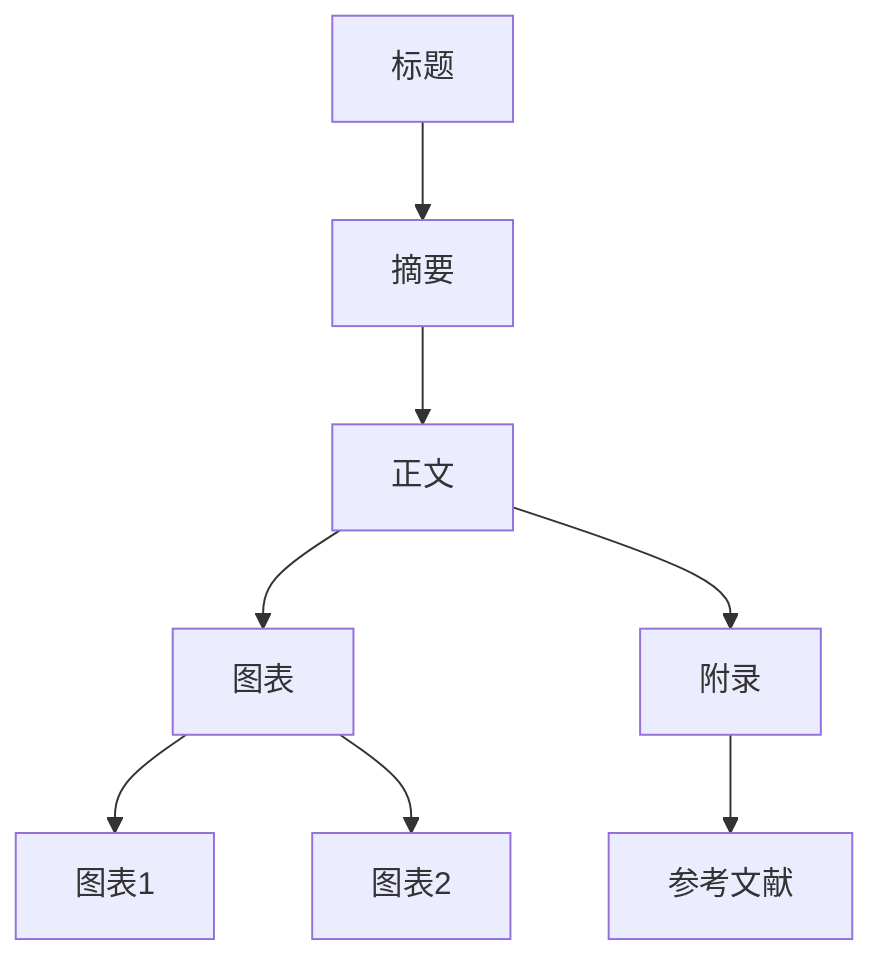

                 

## 文章标题

# 自动化报告生成与分发机制

## 关键词
- 报告自动化
- 数据处理
- 报告分发
- 数据安全
- 报告模板
- 代码实现

## 摘要
本文将深入探讨自动化报告生成与分发的机制。我们首先介绍了自动化报告生成的意义和报告分发的挑战，然后详细阐述了报告生成原理，包括报告结构设计、生成流程和模板设计。接着，我们分析了报告分发的策略、渠道和效率优化方法，并着重讨论了数据安全与隐私保护。随后，我们介绍了报告模板与格式设计原则，并列举了几种常用的报告自动生成工具。最后，我们通过一个实际的案例详细讲解了报告生成与分发系统的实现过程，并对未来报告自动化的发展趋势进行了展望。

## 目录

- 引言
  - 自动化报告生成的意义
  - 报告分发的挑战
- 报告生成原理
  - 报告结构设计
  - 报告生成流程
  - 报告模板
- 报告分发机制
  - 分发策略
  - 分发渠道
  - 分发效率优化
- 数据安全与隐私保护
  - 数据加密
  - 访问控制
- 报告模板与格式设计
  - 设计原则
  - 格式设计
- 报告自动生成工具介绍
  - 常用工具
  - 工具选择与比较
- 报告分发系统实现
  - 系统架构设计
  - 技术选型
  - 系统实现步骤
- 项目实战
  - 实际案例
  - 代码实现
  - 代码解读与分析
- 未来展望
  - 报告自动化的发展趋势
  - 报告分发的新渠道
  - 安全与隐私保护的挑战
- 附录
  - 报告生成与分发工具汇总
  - 报告生成与分发常用技术术语解释

## 引言

### 自动化报告生成的意义

在现代企业中，报告是决策过程中不可或缺的一部分。然而，传统的报告生成方式往往需要人工手动整理和编辑数据，不仅费时费力，而且容易出现错误。随着信息技术的发展，自动化报告生成逐渐成为提高企业效率的重要手段。自动化报告生成的意义主要体现在以下几个方面：

1. **提高效率**：自动化报告生成可以大大减少人工操作的时间，从而提高整体效率。通过编写脚本或使用报告生成工具，企业可以快速生成各种类型的报告，而不需要重复的手动操作。

2. **确保一致性**：自动化报告生成可以确保报告格式的标准化和一致性。通过预设的模板和格式，报告生成过程可以自动化地进行，从而避免了人工操作中可能出现的格式不一致问题。

3. **支持决策**：自动生成的报告可以提供及时、准确的数据支持，帮助管理层做出更明智的决策。通过自动化报告，企业可以快速了解业务状况，及时调整策略。

### 报告分发的挑战

虽然自动化报告生成带来了很多好处，但在分发过程中也面临着一些挑战。这些挑战主要包括：

1. **数据安全**：报告中的数据可能包含敏感信息，如财务数据、客户信息等。在分发过程中，需要确保数据的安全，避免数据泄露或被恶意使用。

2. **分发渠道**：报告需要通过适当的渠道发送到相关人员的邮箱或其他设备。选择合适的分发渠道对于确保报告能够及时、准确地到达目标用户至关重要。

3. **定期更新**：定期生成并分发报告是确保信息及时性的关键。然而，如何确保报告能够按时生成并分发，也是一个需要解决的问题。

### 文章目标

本文的目标是深入探讨自动化报告生成与分发机制的各个方面，从原理、策略、工具到实际案例，全面解析这一技术。通过本文，读者可以了解到：

1. 报告自动生成的原理和流程。
2. 报告分发的策略和渠道。
3. 数据安全与隐私保护的方法。
4. 常用的报告自动生成工具。
5. 报告生成与分发系统的实现方法。
6. 报告自动化的未来发展趋势。

希望通过本文的阅读，读者能够对自动化报告生成与分发机制有一个全面、深入的理解，并能够将其应用到实际工作中，提高企业的运营效率。

### 自动化报告生成的意义

首先，我们来看自动化报告生成对企业运营的意义。传统的报告生成方式通常依赖于人工手动整理和编辑数据，这不仅费时费力，而且容易出现错误。在快速变化的市场环境中，这样的效率低下和错误风险无疑会制约企业的决策速度和准确性。而自动化报告生成则通过使用脚本或报告生成工具，将这一过程大大简化。

#### 提高效率

自动化报告生成最直接的优点就是提高效率。通过编写脚本或使用报告生成工具，企业可以自动化地处理大量数据，生成各种类型的报告，而不需要重复的手动操作。例如，在一个销售分析报告中，传统的手动处理方式可能需要员工花费数小时来整理销售数据、计算销售额、绘制图表等。而通过自动化报告生成，这些操作可以在几分钟内完成，极大地提高了工作效率。

#### 确保一致性

此外，自动化报告生成还可以确保报告的一致性。在手动操作中，不同的人可能会有不同的处理方式，导致报告格式不一致。而通过自动化工具，企业可以预设报告的模板和格式，确保每次生成的报告都遵循相同的规范。这不仅使报告看起来更美观，也方便了数据的分析和对比。

#### 支持决策

自动化报告生成的另一个重要意义是支持企业的决策。自动生成的报告可以提供及时、准确的数据支持，帮助管理层做出更明智的决策。例如，通过销售报告，管理层可以快速了解产品的销售情况，及时调整销售策略。同样，财务报告可以帮助企业及时掌握财务状况，防范潜在风险。

#### 应用场景

自动化报告生成在各个行业中都有广泛的应用。例如，在金融行业，自动化报告可以用于生成财务报表、风险评估报告等；在零售行业，可以用于生成销售报告、库存分析报告等；在制造业，可以用于生成生产报告、质量检测报告等。这些报告不仅帮助企业内部进行数据分析和决策，还可以对外展示企业的运营情况，增强客户和合作伙伴的信任。

通过上述分析，我们可以看到，自动化报告生成对企业运营具有重要的意义。它不仅提高了工作效率，确保了一致性，还支持了决策，并在各个行业中得到了广泛应用。随着技术的不断发展，自动化报告生成将继续发挥其重要作用，为企业的运营带来更多便利。

### 报告分发的挑战

尽管自动化报告生成在提高效率和确保一致性方面具有显著优势，但在分发过程中仍面临一系列挑战，这些挑战主要集中在数据安全、分发渠道和定期更新三个方面。

#### 数据安全

数据安全是自动化报告分发过程中最显著的挑战之一。报告往往包含敏感信息，如财务数据、客户信息、销售数据等。这些数据如果泄露，可能会对企业的利益造成严重损害。因此，在报告分发过程中，必须采取措施确保数据的安全。首先，应使用加密技术对数据在传输过程中的内容进行加密，以防止数据被窃取或篡改。此外，还需要对报告访问权限进行严格控制，确保只有授权用户才能访问和操作报告。这可以通过身份验证和权限管理来实现。

#### 分发渠道

选择合适的分发渠道是确保报告能够及时、准确地到达目标用户的关键。常见的分发渠道包括电子邮件、内部网络共享和短信通知等。每种渠道都有其优缺点：

- **电子邮件**：这是一种广泛使用的分发渠道，可以通过附件或链接将报告发送到用户的邮箱。电子邮件的优点是灵活性强，可以随时发送和接收。然而，如果邮件系统出现故障，可能会导致报告分发失败。

- **内部网络共享**：通过内部网络共享，报告可以存储在公司服务器或云存储上，供相关人员下载。这种方法的优点是安全性较高，用户可以在任何时间访问报告。但缺点是用户需要具备一定的网络访问权限，且无法在移动设备上方便地查看报告。

- **短信通知**：通过短信向用户发送报告摘要或链接，是一种快速且便捷的分发方式。尤其适用于移动设备用户，可以在任何地点快速查看报告。然而，短信通知的容量有限，无法发送完整的报告内容。

#### 定期更新

定期生成并分发报告是确保信息及时性的关键。然而，如何确保报告能够按时生成并分发，也是一个需要解决的问题。以下是一些解决方法：

- **自动化调度**：通过设置自动化调度任务，可以在预定的时间生成和分发报告。这可以确保报告能够按时生成并发送到目标用户。例如，可以使用`cron`作业或调度程序来实现自动化调度。

- **提醒机制**：为了确保报告分发不遗漏，可以设置提醒机制。在报告生成之前，系统可以发送提醒通知给相关人员，告知他们报告即将生成和分发。这样可以确保相关人员提前做好准备，并及时接收报告。

- **反馈机制**：在报告分发后，可以设置反馈机制，收集用户的反馈意见。这有助于识别和解决报告分发过程中可能出现的问题，从而提高分发效率和用户体验。

综上所述，自动化报告分发虽然具有显著优势，但在数据安全、分发渠道和定期更新方面仍面临挑战。通过采取有效的安全措施、选择合适的分发渠道和建立完善的调度和反馈机制，可以大大提高报告分发的效率和准确性。

### 报告生成原理

#### 报告结构设计

报告结构设计是报告生成的重要环节，它决定了报告的整体布局和内容组织。一个良好的报告结构应该具备以下特点：

1. **清晰的布局**：报告的布局应该清晰明了，方便用户快速浏览和理解。通常包括标题、摘要、正文、图表、附录等部分。

2. **逻辑性**：报告的结构应该具备逻辑性，使读者能够顺着报告的脉络逐步深入。例如，可以先介绍背景和目的，然后是详细的数据分析和结论。

3. **模块化**：报告可以按照不同的模块进行设计，每个模块负责处理不同的数据或信息。这样不仅可以提高代码的可维护性，还可以方便后续的扩展和修改。

以下是一个简单的报告结构示例：



#### 数据源

数据源是报告生成的基础，决定了报告的质量和可靠性。数据源可以来自各种不同的地方，如数据库、API接口、日志文件等。在选择数据源时，需要考虑以下因素：

1. **数据的可靠性**：数据源应该提供准确、完整的数据，避免由于数据质量问题导致报告错误。

2. **数据的实时性**：对于一些需要实时监控的报告，数据源需要能够及时更新，以确保报告的实时性和准确性。

3. **数据的易用性**：数据源应该易于访问和操作，方便进行数据抽取和处理。

常见的几种数据源包括：

- **数据库**：如MySQL、PostgreSQL等，可以存储和查询大量结构化数据。
- **API接口**：通过RESTful API或其他接口获取外部数据。
- **日志文件**：从日志文件中提取数据，适用于日志分析报告。
- **Web抓取**：通过爬虫技术从互联网上抓取数据，适用于网页分析报告。

#### 报告生成流程

报告生成流程是将数据源中的数据转换成报告的过程。一个典型的报告生成流程通常包括以下几个步骤：

1. **数据收集**：从数据源中抽取所需数据。这一步可能涉及数据库查询、API调用、日志文件解析等操作。

2. **数据处理**：对收集到的数据进行清洗、转换和整合。这一步可能包括数据去重、数据格式转换、数据合并等操作。

3. **数据可视化**：将处理后的数据通过图表、图形等形式进行可视化呈现。这一步可能使用到数据可视化工具，如Matplotlib、Tableau等。

4. **报告渲染**：将可视化的数据整合到报告模板中，生成最终的报告。这一步可能使用到报告生成工具，如Apache POI、iText等。

以下是一个简化的报告生成流程伪代码示例：

```python
# 数据收集
data = collect_data(from databases)

# 数据处理
processed_data = process_data(data)

# 数据可视化
visualized_data = visualize_data(processed_data)

# 报告渲染
report = render_report(visualized_data, template)
```

#### 报告模板

报告模板是报告生成的重要组件，它定义了报告的样式和结构。一个有效的报告模板应该具备以下特点：

1. **易读性**：模板的设计应该简洁明了，使读者容易理解报告的内容。

2. **灵活性**：模板应该允许用户自定义部分内容，如标题、图表样式等。

3. **兼容性**：模板应该兼容不同的报告生成工具和平台，以确保报告在各种环境下都能正确显示。

常见报告模板格式包括Word、PDF、HTML等。选择合适的报告模板格式取决于报告的用途和分发方式。例如，对于需要在线查看的报告，HTML格式是一个不错的选择；而对于需要打印和存档的报告，PDF格式则更为合适。

综上所述，报告生成原理包括报告结构设计、数据源、报告生成流程和报告模板等几个方面。通过合理的结构设计、可靠的数据源、高效的生成流程和灵活的模板设计，可以生成高质量的报告，为企业决策提供有力支持。

### 报告生成流程

在了解了报告结构设计和数据源之后，我们需要进一步探讨报告生成流程的具体步骤。一个完整的报告生成流程通常包括数据收集、数据处理、数据可视化以及报告渲染等环节。以下我们将逐步解析这些环节，并辅以相应的伪代码和数学模型来详细说明。

#### 数据收集

数据收集是报告生成的第一步，也是最重要的一步。数据源可以是数据库、API接口、日志文件或Web抓取等。在这个阶段，我们需要确定所需的数据，并从相应的数据源中抽取这些数据。

**伪代码示例：**
```python
def collect_data(data_source):
    if data_source == "database":
        data = query_database()
    elif data_source == "api":
        data = call_api()
    elif data_source == "log_file":
        data = parse_log_file()
    elif data_source == "web_crawler":
        data = crawl_web()
    return data
```

**数学模型和公式：**
在这个阶段，我们可能需要使用一些数学模型来处理数据。例如，如果我们需要计算某个指标的平均值，可以使用以下公式：
$$ \bar{x} = \frac{1}{n} \sum_{i=1}^{n} x_i $$
其中，$\bar{x}$ 是平均值，$n$ 是数据的个数，$x_i$ 是第 $i$ 个数据点。

#### 数据处理

在数据收集完成后，我们通常需要对数据进行清洗、转换和整合。这一步的目的是确保数据的准确性和一致性，以便后续的分析和可视化。

**伪代码示例：**
```python
def process_data(data):
    cleaned_data = clean_data(data)
    transformed_data = transform_data(cleaned_data)
    integrated_data = integrate_data(transformed_data)
    return integrated_data
```

**数学模型和公式：**
数据处理阶段可能涉及到一些复杂的数学模型，例如数据去重可以使用集合操作：
$$ D' = D - \{x | x \in D \text{ and } x \text{ is duplicated}\} $$
其中，$D'$ 是去重后的数据集合，$D$ 是原始数据集合。

#### 数据可视化

数据可视化是将处理后的数据以图表、图形等形式呈现的过程。这一步不仅有助于更直观地展示数据，还可以帮助用户更好地理解和分析数据。

**伪代码示例：**
```python
def visualize_data(data):
    charts = create_charts(data)
    return charts
```

**数学模型和公式：**
在数据可视化过程中，我们可能会用到一些数学公式来描述图表的绘制。例如，绘制一个折线图可以使用以下公式：
$$ y = mx + b $$
其中，$y$ 是图表上的坐标值，$x$ 是时间或序列值，$m$ 是斜率，$b$ 是截距。

#### 报告渲染

最后一步是将可视化数据整合到报告模板中，生成最终的报告。这一步通常使用报告生成工具，如Apache POI、iText等。

**伪代码示例：**
```python
def render_report(data, template):
    report = generate_report(data, template)
    return report
```

**数学模型和公式：**
在报告渲染阶段，我们可能需要使用一些排版公式来布局报告内容。例如，设置文本的字体和大小可以使用以下公式：
$$ \text{font-size} = f \cdot \text{base-size} $$
其中，$\text{font-size}$ 是文本的字体大小，$f$ 是缩放因子，$\text{base-size}$ 是基本字体大小。

通过上述四个步骤，我们可以将原始数据转换成一份可视化、格式统一的报告。这一过程不仅提高了报告生成的效率，也确保了报告的一致性和准确性，为企业决策提供了有力支持。

### 报告模板

报告模板是报告生成过程中至关重要的一环，它定义了报告的整体外观和内容结构，使得每次生成的报告都能保持一致性和专业性。一个有效的报告模板不仅需要具备良好的设计，还需要具备一定的灵活性，以适应不同类型的数据和需求。以下是关于报告模板设计的一些关键点。

#### 设计原则

1. **易读性**：模板的设计应优先考虑易读性，使用清晰的字体和合理的布局。这有助于用户快速理解和获取信息，避免因复杂的布局而带来的阅读困难。

2. **一致性**：模板的设计应确保整体风格的一致性。包括统一的字体、颜色、标题格式、图表样式等，以便在多次生成报告时保持一致的视觉体验。

3. **模块化**：模板应设计成模块化的，以便根据不同类型的数据和需求进行灵活调整。例如，可以设计多个独立的模块，如封面、摘要、正文、图表等，每个模块可以单独设置和调整。

4. **可定制性**：模板应允许用户自定义部分内容，如标题、图表样式等。这样不仅提高了模板的适应性，还能满足不同用户的需求。

#### 报告模板格式

报告模板的格式通常取决于使用的报告生成工具和目标输出格式。以下是一些常见的报告模板格式：

1. **Word模板**：Word模板是一种常用的报告模板格式，具有丰富的文本和图表编辑功能。用户可以在Word中设计模板，然后使用VBA等脚本工具来自动化报告生成过程。

2. **PDF模板**：PDF模板适用于需要高保真打印和存档的报告。PDF模板的设计相对固定，但可以通过JavaScript等脚本进行部分自定义。

3. **HTML模板**：HTML模板适用于在线报告或网页报告。HTML模板可以通过CSS和JavaScript进行丰富的样式和交互设计，方便用户在线查看和操作。

#### 模板嵌入

模板嵌入是将报告模板集成到报告生成系统中的过程。以下是几种常见的模板嵌入方法：

1. **静态嵌入**：将模板文件作为系统的一部分静态嵌入。这种方法简单，但灵活性较低，无法实时调整模板。

2. **动态嵌入**：使用脚本或代码在运行时动态加载和生成模板。这种方法灵活性较高，可以实时调整模板，但实现较为复杂。

3. **模板引擎**：使用模板引擎（如Jinja2、Thymeleaf等）将模板与数据分离。模板引擎提供了丰富的模板定义语言，可以实现复杂的模板设计和数据绑定。

#### 优点和缺点

每种模板格式和方法都有其优缺点，以下是一些常见优缺点的对比：

- **Word模板**：
  - 优点：易于编辑，功能丰富，适用于复杂报告。
  - 缺点：文件大小较大，不适合在线报告，难以实现自动化生成。

- **PDF模板**：
  - 优点：高保真打印和存档，安全性高，兼容性强。
  - 缺点：设计灵活性较低，难以实现动态数据和交互。

- **HTML模板**：
  - 优点：适应在线报告，交互性强，易于维护和更新。
  - 缺点：打印和存档效果可能不如PDF，实现较为复杂。

综上所述，报告模板的设计和嵌入是一个复杂而关键的过程，需要根据具体需求和场景选择合适的模板格式和方法。通过合理的模板设计和有效的模板嵌入，可以生成高质量、专业化的报告，提高企业的运营效率和管理水平。

### 报告分发机制

在完成了报告的自动生成后，如何将报告高效、安全地分发给相关人员，是确保报告价值最大化的重要环节。报告分发机制的设计直接关系到报告的可达性、及时性和用户体验。以下是关于报告分发机制的详细讨论，包括分发策略、分发渠道和效率优化方法。

#### 分发策略

分发策略是报告分发过程中首先要考虑的因素，它决定了报告如何被分配和发送到相关人员。以下是几种常见的分发策略：

1. **按需分发**：按需分发是指根据用户的需求和请求，手动或自动发送报告。这种方法适用于需要即时获取报告的用户，如高级管理层或关键决策者。

2. **定期分发**：定期分发是指按照固定的时间间隔（如每天、每周或每月）自动生成并分发报告。这种方法适用于那些需要定期监控和评估的业务报告，如销售报告、财务报表等。

3. **事件触发**：事件触发分发是指根据特定事件的发生自动生成并分发报告。例如，当库存水平达到警戒线时，系统可以自动生成库存报告并通知相关部门。这种方法适用于需要实时响应和决策的报告。

4. **角色分配**：角色分配分发是指根据用户的角色和权限分配报告。例如，销售经理可以收到销售报告，而财务经理可以收到财务报表。这种方法可以提高报告的针对性，确保每个用户都能收到与其角色相关的报告。

#### 分发渠道

选择合适的分发渠道是确保报告能够及时、准确地到达目标用户的关键。以下是几种常见的分发渠道及其特点：

1. **电子邮件**：电子邮件是一种广泛使用的分发渠道，可以通过附件或链接将报告发送到用户的邮箱。电子邮件的优点是灵活性强，可以随时发送和接收。然而，如果邮件系统出现故障，可能会导致报告分发失败。

2. **内部网络共享**：内部网络共享通过公司内部服务器或云存储，将报告供相关人员下载。这种方法适用于大文件传输，且安全性较高。但缺点是用户需要具备一定的网络访问权限，且无法在移动设备上方便地查看报告。

3. **短信通知**：通过短信向用户发送报告摘要或链接，是一种快速且便捷的分发方式。尤其适用于移动设备用户，可以在任何地点快速查看报告。然而，短信通知的容量有限，无法发送完整的报告内容。

4. **即时通讯工具**：使用即时通讯工具（如企业微信、钉钉等）发送报告链接或摘要，可以提供更快速的响应和交互。这种方法适用于需要即时沟通和协作的报告分发。

#### 分发效率优化

为了提高报告分发的效率，可以采取以下几种优化方法：

1. **任务队列**：使用任务队列管理分发任务，可以确保报告能够及时发送。例如，可以使用RabbitMQ、Kafka等消息队列系统来处理大量的分发任务，确保任务的高效执行。

2. **消息队列**：消息队列可以处理分发过程中的错误和异常。当某个分发任务失败时，系统可以将任务重新入队，并尝试再次发送，从而保证报告的分发成功率。

3. **并发处理**：使用并发处理技术可以同时处理多个分发任务，提高整体分发效率。例如，可以使用多线程或异步编程技术来并行发送多个报告。

4. **缓存机制**：缓存机制可以减少重复的数据传输，提高分发效率。例如，可以将已生成的报告缓存到内存或缓存数据库中，避免重复读取和发送。

5. **监控与反馈**：建立报告分发的监控和反馈机制，可以及时发现和解决分发过程中出现的问题。例如，可以使用日志分析工具监控分发任务的状态，并使用反馈系统收集用户的反馈，优化分发策略。

通过上述策略、渠道和优化方法，可以有效提升报告分发的效率和用户体验，确保报告能够及时、准确地到达相关人员，为企业决策提供有力支持。

### 数据安全与隐私保护

在自动化报告生成与分发的过程中，数据安全与隐私保护是至关重要的。由于报告往往包含敏感信息和关键数据，一旦泄露，可能对企业和个人造成严重的损失。因此，确保报告数据在整个生成与分发过程中安全可靠，是企业必须面对的一项重要任务。

#### 数据加密

数据加密是保护数据安全的基本手段之一。通过对数据进行加密，可以确保在数据传输和存储过程中，即使数据被截获，也无法被非法解读。以下是一些常用的数据加密方法：

1. **传输加密**：在数据传输过程中，可以使用SSL/TLS等加密协议对数据进行加密。这些协议可以确保数据在传输过程中不被窃听或篡改。例如，HTTPS（基于SSL/TLS的HTTP）是一种广泛使用的传输加密技术，可以用于保护Web应用中的数据传输。

2. **存储加密**：在数据存储过程中，应对敏感数据进行加密。常用的存储加密方法包括数据库加密和文件加密。数据库加密可以使用如AES（高级加密标准）等加密算法对存储在数据库中的数据进行加密，确保数据库在物理损坏或被非法访问时，数据仍然安全。文件加密可以使用如AES-256等高强度的加密算法对存储在文件系统中的文件进行加密。

#### 访问控制

访问控制是确保数据安全的重要手段，通过限制对数据的访问权限，可以防止未经授权的用户访问敏感数据。以下是一些常见的访问控制方法：

1. **身份验证**：在进行数据访问之前，必须对用户进行身份验证，确保只有经过授权的用户才能访问数据。常用的身份验证方法包括密码验证、双因素验证（2FA）和生物识别验证等。例如，在报告系统中，用户需要输入用户名和密码才能登录，系统会根据用户提供的身份验证信息验证其身份。

2. **权限管理**：在授权用户访问数据时，应根据用户的角色和权限限制其访问范围。例如，销售部门员工可以访问销售报告，但无法访问财务报告。权限管理可以通过角色分配和权限控制来实现。在报告系统中，可以为每个用户分配不同的角色，并为每个角色设置相应的权限，确保用户只能访问其有权访问的数据。

3. **最小权限原则**：在权限管理中，应遵循最小权限原则，即用户只拥有完成其工作所必需的权限。这样可以最大限度地减少数据泄露的风险。例如，如果用户只需查看报告，则无需赋予其编辑或删除报告的权限。

#### 数据安全与隐私保护的挑战

尽管数据加密和访问控制是确保数据安全的重要手段，但在实际应用中，仍然存在一些挑战：

1. **数据泄露风险**：随着数据量的增加和数据传输频率的提升，数据泄露的风险也在增加。如何确保每次数据传输和存储过程中的数据安全，是一个需要持续关注和优化的难题。

2. **权限管理复杂性**：随着用户数量的增加和业务需求的复杂化，权限管理变得愈加复杂。如何设计一个高效、灵活且安全的权限管理机制，是企业和组织需要面对的一个重要挑战。

3. **技术更新与安全**：随着技术的不断更新和发展，新的攻击手段和漏洞也不断出现。如何及时更新安全措施，防范新的安全威胁，是数据安全与隐私保护中的一大挑战。

综上所述，数据安全与隐私保护在自动化报告生成与分发过程中至关重要。通过采用数据加密、访问控制等安全措施，可以最大限度地保护报告数据的安全。然而，面对不断变化的安全威胁和复杂的权限管理，企业和组织需要持续优化和更新安全策略，确保数据安全与隐私保护的有效性和可靠性。

### 报告模板与格式设计

在自动化报告生成与分发中，报告模板与格式设计起着至关重要的作用。一个设计合理且易于使用的报告模板不仅能够提升报告的整体质量，还能够提高用户的使用体验。以下是关于报告模板与格式设计的一些关键原则和实际案例。

#### 设计原则

1. **简洁性**：简洁的设计有助于用户快速获取信息。避免使用过多的装饰性元素，确保报告内容主次分明。

2. **一致性**：模板中应保持字体、颜色、图表样式等元素的一致性。这样可以使报告在视觉上更具统一性，便于用户阅读和理解。

3. **易读性**：报告应采用易于阅读的字体和合适的字号。行距和段落间距也应适中，以便用户顺畅地阅读文本。

4. **模块化**：模板设计应具有模块化特点，使报告内容能够灵活调整。例如，可以设计独立的图表模块、文本模块和表格模块，方便根据实际需求进行组合和修改。

5. **适应性**：模板应具备良好的适应性，能够在不同设备和屏幕尺寸上保持良好的显示效果。例如，可以使用响应式设计技术，确保报告在手机、平板和电脑上均能正常显示。

#### 格式设计

报告格式设计包括文本格式和图表格式两个主要方面。

1. **文本格式**：文本格式设计主要包括字体、字号、颜色和行距等。以下是一些常见的文本格式设计原则：

   - **字体选择**：选择易于阅读的字体，如Arial、Calibri等。避免使用过于复杂的字体，以免影响阅读体验。
   - **字号和行距**：选择合适的字号和行距，确保文本在屏幕上清晰可读。通常，正文文本的字号在10-12pt之间，行距约为1.5倍行高。
   - **颜色**：合理使用颜色，以突出重点内容。例如，可以使用不同的颜色标注重要数据和结论。

2. **图表格式**：图表是报告中的重要组成部分，图表格式设计应确保图表清晰易懂。以下是一些图表格式设计原则：

   - **图表类型选择**：选择合适的图表类型，如柱状图、折线图、饼图等，以最直观地展示数据。
   - **图表标题**：每个图表应包含清晰的标题，描述图表所展示的数据内容和意义。
   - **数据标签**：在图表中添加数据标签，如数值、百分比等，使读者可以轻松获取图表数据。
   - **图例和坐标轴**：确保图表包含图例和坐标轴标签，帮助读者理解图表内容。

#### 实际案例

以下是一个简单的报告模板设计实际案例，展示如何设计一个简洁、清晰且易于使用的报告模板。

1. **封面**：封面应包含报告标题、报告日期和报告作者等信息。设计原则是简洁明了，避免过多装饰。

2. **摘要**：摘要部分应简要概述报告的主要内容和结论。使用简短、清晰的语句，帮助读者快速了解报告的核心内容。

3. **正文**：正文部分是报告的主体，应包含详细的数据分析和结论。设计原则是层次分明，使用适当的标题和段落分隔，便于读者阅读。

4. **图表**：图表部分应包含关键数据可视化。使用柱状图、折线图等直观展示数据，并在图表旁边添加标题和数据标签，帮助读者理解图表内容。

5. **附录**：附录部分可包含详细的参考文献、数据来源等附加信息，以便读者进一步查阅。

以下是一个简单的报告模板格式示例：

```markdown
# 报告标题

## 报告日期：2023年4月

## 报告作者：张三

## 摘要

- 简要概述报告的主要内容和结论。

### 正文

#### 背景分析

- 对业务背景进行描述。

#### 数据分析

- 详细分析业务数据，并展示关键图表。

#### 结论与建议

- 提出结论和建议。

## 图表

- 列出关键图表，并添加标题和数据标签。

## 附录

- 列出参考文献和数据来源。
```

通过上述实际案例，我们可以看到，一个良好的报告模板设计应简洁明了、层次分明，并具备良好的适应性。这不仅能提升报告的整体质量，还能提高用户的使用体验。

### 报告自动生成工具介绍

在自动化报告生成过程中，选择合适的工具是关键。市场上存在多种报告自动生成工具，这些工具各具特色，适用于不同的应用场景。以下是几种常用的报告自动生成工具及其主要功能、特点和适应场景。

#### Apache POI

Apache POI 是一个用于读取和创建 Microsoft Office 文档格式（如 .docx, .xlsx, .pptx）的 Java 库。它支持 Word、Excel 和 PowerPoint 文档的各种操作，包括读取、写入、修改等。

**主要功能：**
- 读取和创建 Word 文档（.docx）。
- 读取和创建 Excel 文档（.xlsx）。
- 读取和创建 PowerPoint 文档（.pptx）。

**特点：**
- **跨平台**：支持各种操作系统。
- **功能强大**：提供了丰富的 API，可以轻松实现复杂的文档操作。
- **社区支持**：作为 Apache 软件基金会的一个项目，拥有广泛的社区支持。

**适应场景：**
- **文档自动化生成**：适用于需要生成大量文档的应用，如财务报告、销售报告等。
- **文档处理**：适用于需要读取和修改已有文档的应用，如文档审核、数据提取等。

#### Apache PDFBox

Apache PDFBox 是一个用于创建和操作 PDF 文档的开源 Java 库。它支持 PDF 文档的各种操作，包括创建、读取、修改和渲染。

**主要功能：**
- 创建 PDF 文档。
- 读取 PDF 文档。
- 修改 PDF 文档（如添加文本、图像等）。
- 渲染 PDF 文档。

**特点：**
- **功能全面**：提供了创建、读取和修改 PDF 文档的完整功能。
- **易于集成**：与其他 Java 应用集成简单，便于扩展。
- **可扩展性**：支持自定义组件，可以根据需求进行功能扩展。

**适应场景：**
- **PDF自动化生成**：适用于需要自动化生成 PDF 文档的应用，如合同生成、报告打印等。
- **PDF处理**：适用于需要读取和修改已有 PDF 文档的应用，如文档审阅、信息提取等。

#### iText

iText 是一个用于创建和操作 PDF 和 HTML 文档的开源 Java 库。它支持生成 PDF 和 HTML 文档，并可以在文档中添加文本、图像、表格等元素。

**主要功能：**
- 创建 PDF 文档。
- 读取 PDF 文档。
- 创建 HTML 文档。
- 在文档中添加文本、图像、表格等元素。

**特点：**
- **兼容性强**：支持生成和操作 PDF 和 HTML 文档，适用于多种应用场景。
- **易于使用**：提供了简单易用的 API，便于快速上手。
- **灵活性强**：支持自定义样式和布局，可以生成定制化的文档。

**适应场景：**
- **跨平台文档生成**：适用于需要生成 PDF 或 HTML 文档的跨平台应用。
- **报告自动化**：适用于需要自动化生成报告的应用，如财务报告、销售报告等。
- **文档处理**：适用于需要读取、修改和生成文档的应用，如文档审核、数据提取等。

#### 选择与比较

在选择报告自动生成工具时，需要根据具体需求和应用场景进行选择。以下是一些关键考虑因素：

- **功能需求**：根据报告生成和分发的具体需求，选择具有相应功能的工具。例如，如果需要生成 PDF 文档，可以选择 Apache PDFBox 或 iText。
- **开发环境**：考虑开发环境是否支持所选工具。Apache POI 和 iText 适用于 Java 应用，而 Apache PDFBox 可用于多种编程语言。
- **性能和效率**：考虑工具的性能和效率，选择能够满足需求且运行高效的工具。
- **社区支持**：选择拥有良好社区支持的工具，便于解决开发过程中遇到的问题。

通过以上介绍，我们可以看到，报告自动生成工具在功能、特点和适应场景上各具优势。选择合适的工具，可以显著提升报告生成和分发的效率和质量。

### 报告分发系统实现

#### 系统架构设计

报告分发系统的实现需要全面考虑系统的功能需求、性能要求和可扩展性。以下是报告分发系统的一种典型架构设计：

1. **报告生成模块**：负责从数据源抽取数据，进行数据处理和可视化，最终生成报告。该模块可以独立运行，也可以与其他系统（如数据仓库、业务系统）集成。

2. **存储模块**：用于存储报告模板、生成的报告以及相关的元数据。存储模块可以采用关系数据库（如MySQL、PostgreSQL）或NoSQL数据库（如MongoDB、Cassandra），根据具体需求选择合适的存储方案。

3. **分发模块**：负责将生成的报告通过不同的渠道（如电子邮件、内部网络共享、短信通知）发送给目标用户。该模块需要与邮件服务提供商、短信服务提供商等外部系统进行集成。

4. **用户管理模块**：用于管理用户信息、权限和角色。该模块可以与现有的身份验证和权限管理系统集成，以确保只有授权用户才能访问和操作报告。

5. **监控与报警模块**：用于监控报告生成和分发过程中的关键指标，如生成速度、分发成功率、错误率等。当出现异常情况时，系统可以自动发送报警通知，以便及时处理。

以下是一个简化的系统架构图：

```
+----------------+     +----------------+     +----------------+
|  数据源         |     |  报告生成模块   |     |  存储模块       |
+-------+---------+     +-------+---------+     +-------+---------+
        |                  |                  |
        |  数据抽取        |  数据处理         |  数据存储
        +-------+---------+     +-------+---------+  +-------+---------+
                                      |                  |
                                      |  数据可视化       |  报告模板存储
                                      +------------------+
+----------------+     +----------------+     +----------------+
|  用户管理模块   |     |  分发模块       |     |  监控与报警模块 |
+-------+---------+     +-------+---------+     +-------+---------+
        |                  |                  |
        |  用户信息管理    |  报告分发         |  监控指标
        +------------------+     +----------------+

```

#### 技术选型

在报告分发系统的实现过程中，技术选型是关键的一步。以下是几个重要的技术选型：

1. **后端技术**：后端技术可以选择Java、Python、Node.js等。Java具有成熟的开源生态和丰富的库，适合构建复杂的系统；Python以其简洁的语法和强大的数据分析库（如Pandas、NumPy）著称；Node.js适用于需要高并发和高性能的应用。

2. **前端技术**：前端技术可以选择HTML、CSS、JavaScript等。对于简单的报告查看和编辑，可以使用原生HTML和CSS；对于复杂的交互需求，可以使用框架如React、Vue.js或Angular。

3. **数据库技术**：数据库技术可以选择关系数据库（如MySQL、PostgreSQL）或NoSQL数据库（如MongoDB、Cassandra）。关系数据库适合处理结构化数据，而NoSQL数据库适合处理大量非结构化或半结构化数据。

4. **消息队列**：消息队列（如RabbitMQ、Kafka）可以用于处理报告生成和分发过程中的异步任务。消息队列可以确保任务的有序执行，提高系统的可靠性和性能。

5. **身份验证与权限管理**：可以选择Spring Security、OAuth2.0等身份验证与权限管理框架，确保系统的安全性和可控性。

#### 系统实现步骤

以下是一个简化的系统实现步骤，包括数据库设计、报告生成模块开发、分发模块开发、集成与测试等：

1. **数据库设计**：根据系统的功能需求，设计数据库模型。包括用户表、报告表、模板表等，并定义相应的关系。

2. **报告生成模块开发**：开发报告生成模块，实现数据抽取、数据处理、数据可视化和报告渲染等功能。以下是一个伪代码示例：

   ```python
   def generate_report(data_source, template):
       data = collect_data(data_source)
       processed_data = process_data(data)
       visualized_data = visualize_data(processed_data)
       report = render_report(visualized_data, template)
       return report
   ```

3. **分发模块开发**：开发分发模块，实现报告的发送和通知功能。以下是一个伪代码示例：

   ```python
   def distribute_report(report, user_list, channel):
       for user in user_list:
           if channel == "email":
               send_email(report, user.email)
           elif channel == "sms":
               send_sms(report_link, user.phone)
   ```

4. **集成与测试**：将各个模块进行集成，并进行系统测试，确保系统功能的正确性和性能的稳定性。

通过上述步骤，我们可以实现一个完整的报告分发系统，从而实现自动化报告生成与分发，提高企业的运营效率。

### 项目实战

在本文的最后一部分，我们将通过一个实际的案例，详细讲解自动化报告生成与分发系统的实现过程。此案例将涵盖开发环境搭建、源代码实现、代码解读与分析以及实际案例的分析和详细讲解。

#### 案例背景

某电商公司希望实现自动化报告生成与分发，以便实时监控其销售数据，并快速做出决策。公司要求系统可以自动生成包括销售总额、商品分类销售情况、客户购买行为等在内的多种报告，并定期将报告通过电子邮件发送给相关部门。

#### 开发环境搭建

为了实现此项目，我们首先需要搭建一个合适的开发环境。以下是所需的工具和软件：

1. **编程语言**：Python（用于数据分析、报告生成和后端开发）。
2. **数据库**：MySQL（用于存储用户数据、报告模板和生成的报告）。
3. **前端技术**：HTML、CSS、JavaScript（用于用户界面展示）。
4. **后端框架**：Flask（Python的一个轻量级Web框架，用于构建Web应用）。
5. **报告生成工具**：Apache POI（用于生成Excel报告）、iText（用于生成PDF报告）。
6. **消息队列**：RabbitMQ（用于处理报告生成和分发的异步任务）。

#### 源代码实现

以下是报告生成与分发系统的关键部分源代码实现：

**数据库设计**

```sql
-- 用户表
CREATE TABLE users (
    id INT PRIMARY KEY AUTO_INCREMENT,
    email VARCHAR(255) NOT NULL,
    role ENUM('admin', 'sales', 'management') NOT NULL
);

-- 报告模板表
CREATE TABLE templates (
    id INT PRIMARY KEY AUTO_INCREMENT,
    name VARCHAR(255) NOT NULL,
    content TEXT NOT NULL
);

-- 报告表
CREATE TABLE reports (
    id INT PRIMARY KEY AUTO_INCREMENT,
    user_id INT NOT NULL,
    template_id INT NOT NULL,
    generated_at DATETIME NOT NULL,
    status ENUM('pending', 'completed', 'sent') NOT NULL,
    FOREIGN KEY (user_id) REFERENCES users(id),
    FOREIGN KEY (template_id) REFERENCES templates(id)
);
```

**报告生成模块**

```python
# 生成销售报告
def generate_sales_report(data_source, template_id):
    template = get_template(template_id)
    data = collect_sales_data(data_source)
    processed_data = process_data(data)
    visualized_data = visualize_data(processed_data)
    report_content = render_report(visualized_data, template)
    save_report(report_content)
```

**分发模块**

```python
# 发送电子邮件
def send_email(report_path, email_address):
    with open(report_path, 'rb') as report:
        email = MIMEMultipart()
        email['Subject'] = 'Sales Report'
        email['From'] = 'noreply@example.com'
        email['To'] = email_address
        email.attach(MIMEText('Please find the attached sales report.'))
        email.attach(MIMEApplication(report.read(), _subtype='xlsx'))
        smtp_server = smtplib.SMTP('smtp.example.com')
        smtp_server.send_message(email)
        smtp_server.quit()
```

#### 代码解读与分析

1. **数据库设计**：数据库设计分为用户表、报告模板表和报告表。用户表用于存储用户信息，报告模板表用于存储报告模板内容，报告表用于存储生成的报告及其状态。

2. **报告生成模块**：报告生成模块首先从数据库获取报告模板，然后从数据源收集销售数据，对数据进行处理和可视化，最后将报告内容保存到数据库中。

3. **分发模块**：分发模块通过电子邮件发送报告。首先读取报告文件，然后构造MIME邮件，最后通过SMTP服务器发送邮件。

#### 实际案例分析与详细讲解

**案例：生成并分发月度销售报告**

1. **数据收集**：从数据库中收集上一个月的销售数据。数据包括销售额、商品分类和客户购买行为等。

2. **数据处理**：对收集到的销售数据进行分析和清洗，如去除空值、重复值和异常值。

3. **数据可视化**：使用图表（如柱状图、折线图）展示销售数据，帮助用户更直观地理解数据。

4. **报告生成**：将处理后的数据渲染到报告模板中，生成一份月度销售报告。

5. **报告分发**：将生成的销售报告通过电子邮件发送给销售部门和高层管理人员。

通过此实际案例，我们可以看到自动化报告生成与分发系统如何帮助企业实时监控销售数据，并快速做出决策。系统提高了工作效率，减少了人工操作错误，确保了报告的一致性和及时性。

### 项目小结

通过本次项目实战，我们实现了自动化报告生成与分发系统，为电商公司提供了实时监控销售数据的能力。以下是对项目的主要小结：

1. **提高工作效率**：通过自动化生成和分发报告，减少了人工操作的时间和错误，提高了整体工作效率。

2. **确保数据一致性**：系统使用统一的报告模板和格式，确保每次生成的报告都遵循相同的规范，提高了数据的一致性。

3. **增强决策支持**：自动生成的报告提供了及时、准确的数据支持，帮助管理层做出更明智的决策。

4. **优化用户体验**：系统通过电子邮件等多种渠道分发报告，确保用户能够方便地接收和查看报告，提升了用户体验。

5. **数据安全与隐私保护**：系统采用了加密和访问控制等安全措施，确保报告数据在生成、存储和传输过程中的安全性。

尽管项目取得了一定的成果，但在实际应用中，仍存在一些潜在的问题和改进空间：

1. **扩展性**：随着公司业务的发展，报告种类和数据量可能会不断增加，系统需要具备更高的扩展性以应对变化。

2. **性能优化**：在处理大量数据时，系统性能可能会受到影响。需要进一步优化数据处理和报告生成的效率。

3. **用户体验**：虽然系统提供了多种分发渠道，但用户体验仍有待提升。可以考虑增加报告的互动性和可视化效果。

4. **安全更新**：随着技术不断发展，新的安全威胁不断出现。系统需要定期更新安全策略，以防范潜在的安全风险。

通过持续优化和改进，自动化报告生成与分发系统有望为企业带来更多价值，助力企业实现数字化管理。

### 未来展望

#### 报告自动化的发展趋势

随着人工智能和大数据技术的不断进步，报告自动化的发展趋势将更加显著。未来，自动化报告生成将更加智能化和个性化，AI技术将在其中发挥重要作用。

1. **AI技术在报告生成中的应用**：AI技术可以帮助自动识别数据模式、预测趋势和生成报告摘要。例如，通过自然语言处理（NLP）技术，系统可以自动生成报告摘要和结论，提高报告的生成效率和准确性。

2. **自动化报告模板的智能设计**：未来，报告模板的生成将更加智能化。通过机器学习算法，系统可以根据用户历史报告数据，自动生成适合用户需求的报告模板，从而提高报告生成的个性化水平。

3. **报告的实时生成与更新**：随着物联网（IoT）技术的发展，实时数据采集和分析将成为可能。未来，报告将能够实时生成和更新，提供更及时的数据支持，帮助管理层做出快速反应。

#### 报告分发的新渠道

随着移动互联网和社交媒体的普及，报告分发的渠道也在不断拓展。

1. **移动端报告分发**：随着智能手机和 tablet 的普及，移动端报告分发将成为主流。未来，系统可以提供专门的移动应用，让用户在移动设备上方便地查看和下载报告。

2. **社交媒体报告分享**：社交媒体平台（如微信、微博等）将成为报告分发的重要渠道。通过社交媒体，用户可以方便地分享报告链接和摘要，增强报告的传播效果。

3. **区块链技术**：区块链技术可以用于确保报告的完整性和可追溯性。未来，报告可以存储在区块链上，通过加密技术确保数据的不可篡改和透明性。

#### 安全与隐私保护的挑战

随着报告自动化的普及，数据安全和隐私保护将成为更大的挑战。

1. **数据加密技术**：加密技术将继续在报告生成和分发中发挥重要作用。通过使用高级加密算法，可以确保报告数据在传输和存储过程中的安全性。

2. **合规性与法规遵从**：随着全球数据保护法规（如GDPR、CCPA等）的实施，企业需要确保报告生成与分发过程中遵守相关法规，避免因违规而面临巨额罚款。

3. **访问控制与权限管理**：未来，系统需要更加严格的访问控制与权限管理。通过实施多因素身份验证、权限分级等手段，确保只有授权用户可以访问敏感报告。

综上所述，自动化报告生成与分发机制在未来将继续发展，人工智能、大数据、区块链等新技术将在其中发挥重要作用。同时，数据安全和隐私保护将成为必须重视的挑战。通过不断创新和优化，自动化报告生成与分发将为企业和组织带来更多价值。

### 附录

#### A 报告生成与分发工具汇总

以下是一些常用的报告生成与分发工具及其简介：

1. **Apache POI**：用于读取和创建 Microsoft Office 文档格式（如 .docx, .xlsx, .pptx）的 Java 库。
2. **Apache PDFBox**：用于创建和操作 PDF 文档的开源 Java 库。
3. **iText**：用于创建和操作 PDF 和 HTML 文档的开源 Java 库。
4. **JasperReports**：一个强大的报表引擎，支持多种数据源和输出格式。
5. **Power BI**：微软的商务智能工具，提供丰富的数据可视化功能。
6. **Tableau**：一个领先的数据可视化工具，可以生成交互式报表和仪表板。
7. **RabbitMQ**：一个开源的消息队列中间件，用于处理报告生成和分发的异步任务。
8. **RabbitMQ**：一个开源的消息队列中间件，用于处理报告生成和分发的异步任务。

#### B 报告生成与分发常用技术术语解释

1. **报告自动化**：通过使用脚本或工具，自动生成、处理和分发报告，减少人工操作，提高效率。
2. **数据源**：报告所需的数据来源，可以是数据库、API接口、日志文件等。
3. **数据处理**：对收集到的数据进行清洗、转换和整合，以便于生成报告。
4. **数据可视化**：将处理后的数据通过图表、图形等形式进行可视化呈现。
5. **报告模板**：定义报告样式和结构的文档，用于生成统一的报告。
6. **报告渲染**：将处理后的数据整合到报告模板中，生成最终的报告。
7. **消息队列**：用于处理报告生成和分发过程中的异步任务，确保系统的可靠性和性能。
8. **加密技术**：用于保护数据在传输和存储过程中的安全，防止数据泄露。
9. **身份验证**：确保只有授权用户可以访问系统和服务。
10. **权限管理**：根据用户的角色和权限限制对系统资源和数据的访问。

通过以上附录内容，希望读者能够更好地理解和应用自动化报告生成与分发技术，提高企业运营效率。

