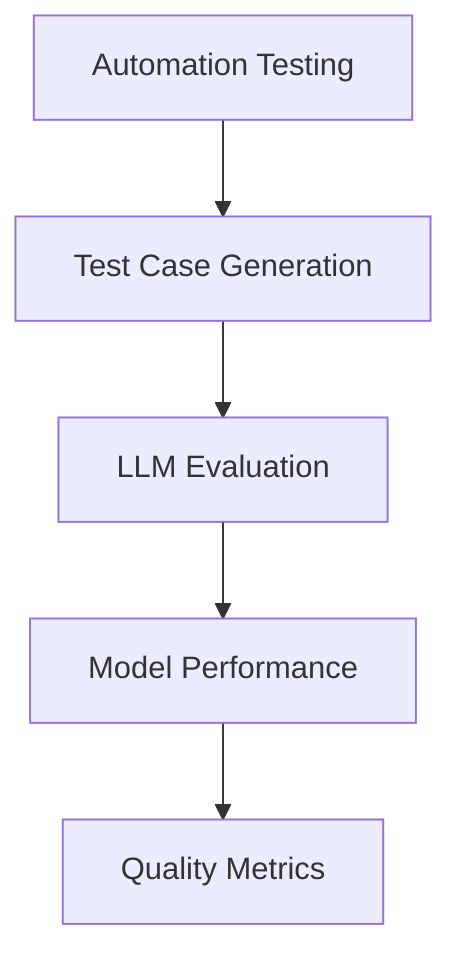

                 

Sure, let's break down the article "Automation Test Case Generation: The Key to Enhancing LLM Evaluation Efficiency" into smaller, manageable sections. Each section will contain the necessary elements as per your requirements. Here's a step-by-step guide on how to proceed:

### Step 1: Introduction

- **Article Title:** Automation Test Case Generation: The Key to Enhancing LLM Evaluation Efficiency
- **Keywords:** Automation Testing, Test Case Generation, LLM Evaluation, Efficiency, AI, Machine Learning
- **Abstract:** This article delves into the importance of automation test case generation for improving the efficiency of Language Learning Models (LLM) evaluation. It covers the theoretical foundations, practical techniques, and case studies to demonstrate the benefits of automated test case generation.

### Step 2: Background and Fundamental Theory

#### Chapter 1: Overview of Automation Testing and LLM Evaluation

- **Section 1.1: Importance of Automation Testing**
  - Explain why automation testing is crucial in modern software development.
  - Discuss the advantages of automated testing over manual testing.

- **Section 1.2: Needs and Challenges in LLM Evaluation**
  - Describe the specific requirements and challenges in evaluating LLMs.
  - Discuss common issues encountered during LLM evaluation.

- **Section 1.3: Basic Theory of Test Case Generation**
  - Introduce the core concepts of test case generation.
  - Explain the relationship between automation testing and test case generation.

#### Mermaid Flowchart: Core Concepts and Relationships



### Step 3: LLM Models and Evaluation Methods

#### Chapter 2: LLM Models and Evaluation Methods

- **Section 2.1: LLM Model Architecture**
  - Provide an overview of the architecture of LLMs.
  - Explain the key components and how they work together.

- **Section 2.2: Evaluation Metrics**
  - Discuss common evaluation metrics used for LLMs.
  - Explain how these metrics help assess the performance of LLMs.

- **Section 2.3: Common Evaluation Methods**
  - Describe different evaluation methods for LLMs.
  - Compare and contrast the strengths and weaknesses of each method.

#### Pseudocode: Evaluating LLM Model Performance

```plaintext
Algorithm EvaluateModelPerformance(inputModel, inputData):
    CalculateAccuracy(inputModel, inputData)
    CalculateF1Score(inputModel, inputData)
    CalculateBLEUR(inputModel, inputData)
    PrintStatistics()
```

### Step 4: Techniques for Automation Test Case Generation

#### Chapter 3: Data Preprocessing and Feature Extraction

- **Section 3.1: Data Preprocessing Methods**
  - Discuss various data preprocessing techniques.
  - Explain how preprocessing improves the quality of test cases.

- **Section 3.2: Feature Extraction Techniques**
  - Describe feature extraction methods used in test case generation.
  - Explain how features enhance the effectiveness of test cases.

- **Section 3.3: Dataset Construction Strategies**
  - Explain strategies for constructing high-quality test datasets.
  - Discuss the importance of diverse datasets in test case generation.

### Step 5: Test Case Design Strategies

#### Chapter 4: Test Case Design Strategies

- **Section 4.1: Load Testing Case Design**
  - Describe how to design test cases for load testing.
  - Explain the purpose and benefits of load testing.

- **Section 4.2: Boundary Testing Case Design**
  - Explain boundary testing concepts.
  - Discuss how to design test cases that test the boundaries of the LLM model's capabilities.

- **Section 4.3: Error Injection Testing Case Design**
  - Describe error injection testing.
  - Explain how to create test cases that intentionally introduce errors to test the robustness of the LLM model.

### Step 6: Test Case Generation Algorithms

#### Chapter 5: Test Case Generation Algorithms

- **Section 5.1: Random Test Case Generation**
  - Explain how to generate random test cases.
  - Discuss the pros and cons of random test case generation.

- **Section 5.2: Statistical-Based Test Case Generation**
  - Describe statistical-based methods for generating test cases.
  - Explain how statistical analysis improves the quality of test cases.

- **Section 5.3: Machine Learning-Based Test Case Generation**
  - Explain machine learning methods for test case generation.
  - Discuss the advantages of using machine learning in test case generation.

### Step 7: Optimization and Maintenance of Test Cases

#### Chapter 6: Optimization and Maintenance of Test Cases

- **Section 6.1: Test Case Optimization Strategies**
  - Discuss strategies for optimizing test cases.
  - Explain how optimization improves the efficiency of test case execution.

- **Section 6.2: Regression Testing of Test Cases**
  - Describe regression testing and its importance.
  - Explain how to ensure that existing test cases remain effective after model updates.

- **Section 6.3: Test Case Lifecycle Management**
  - Discuss the lifecycle of test cases.
  - Explain how to manage test cases effectively to maximize their usefulness.

### Step 8: Practical Applications and Case Studies

#### Chapter 7: Automation Test Case Generation Tools and Practices

- **Section 7.1: Introduction to Open-Source Testing Tools**
  - Discuss popular open-source testing tools.
  - Explain how these tools can be used for test case generation.

- **Section 7.2: Custom Testing Tool Development**
  - Describe how to develop custom testing tools.
  - Explain the benefits of custom tools over existing solutions.

- **Section 7.3: Designing the Automation Test Case Generation Process**
  - Explain how to design an efficient test case generation process.
  - Discuss best practices for process design.

### Step 9: Case Studies on Enhancing LLM Evaluation Efficiency

#### Chapter 8: Practical Case Studies on Enhancing LLM Evaluation Efficiency

- **Section 8.1: Case Study 1 - Product Description Evaluation for an E-commerce Platform**
  - Describe the case study setup.
  - Explain the test case generation process and its results.

- **Section 8.2: Case Study 2 - Text Quality Evaluation for a Search Engine**
  - Describe the case study setup.
  - Explain the test case generation process and its results.

- **Section 8.3: Case Study 3 - Dialogue Quality Evaluation for an AI Assistant**
  - Describe the case study setup.
  - Explain the test case generation process and its results.

### Step 10: Appendix

#### Appendix A: Detailed Explanation of Test Case Generation Algorithms

- **Section A.1: Algorithm Theory**
  - Explain the theoretical underpinnings of test case generation algorithms.

- **Section A.2: Algorithm Implementation**
  - Provide a detailed implementation of the test case generation algorithm.

- **Section A.3: Algorithm Evaluation**
  - Discuss how to evaluate the effectiveness of test case generation algorithms.

#### Appendix B: Common Issues and Solutions

- **Section B.1: Choosing Evaluation Metrics**
  - Discuss the challenges in selecting appropriate evaluation metrics.

- **Section B.2: Impact of Dataset Quality**
  - Explain how dataset quality affects test case generation and evaluation.

- **Section B.3: Optimization Techniques**
  - Describe techniques for optimizing test case generation processes.

### Step 11: Conclusion and Future Directions

- **Conclusion:**
  - Summarize the key points of the article.
  - Discuss the benefits of automation test case generation for LLM evaluation.

- **Future Directions:**
  - Identify potential research directions and future developments in this field.

### Step 12: Author Information

- **Author:** AI Genius Institute / Zen and the Art of Computer Programming

### Step 13: Final Check and Polishing

- **Final Check:**
  - Ensure that all sections are well-written and logically structured.
  - Check for consistency in terminology and style.

- **Polishing:**
  - Edit the text for clarity, coherence, and style.
  - Ensure that the article meets the required word count.

### Step 14: Submission

- Submit the final article as a markdown file.

---

Following this step-by-step guide will help ensure that the article is comprehensive, well-structured, and technically sound. Each section should be written in clear, concise language, and should include the necessary diagrams, pseudocode, and examples to illustrate the concepts.

