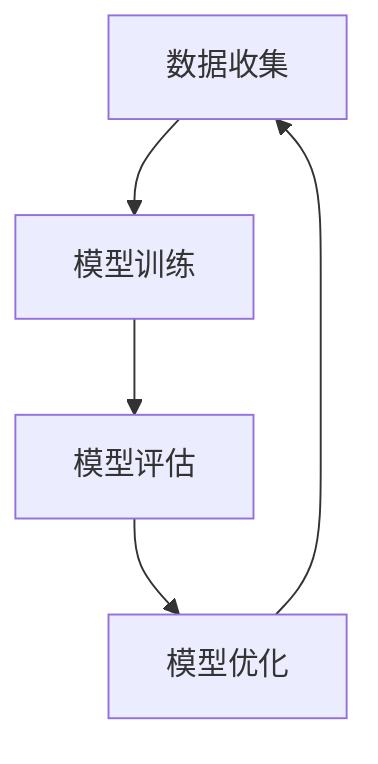

                 

### 背景介绍

随着人工智能（AI）技术的迅猛发展，大型语言模型（Large Language Model，简称LLM）已成为自然语言处理（Natural Language Processing，简称NLP）领域的重要工具。LLM具有强大的文本生成、理解和翻译能力，已经在多个领域展现出巨大的应用潜力，如智能客服、内容创作、教育辅助等。然而，LLM的开发与应用也面临着一系列挑战，其中之一便是如何有效评估其性能和效果。

传统的模型评估方法通常依赖于手工设计的评价指标，如准确率（Accuracy）、召回率（Recall）和F1分数（F1 Score）等。虽然这些指标在一定程度上能够反映模型的性能，但它们往往忽略了模型在不同场景和任务中的表现差异。此外，传统评估方法通常耗时较长，且难以适应快速迭代和优化的开发流程。

为了解决这些问题，自动化评测技术应运而生。自动化评测通过使用机器学习和数据挖掘技术，自动生成一系列指标，以全面、高效地评估LLM的性能。自动化评测不仅能够提高评估的效率，还能够提供更加细粒度的性能分析，帮助开发者快速定位和优化模型。

本文旨在探讨自动化评测在LLM应用开发中的重要性，详细分析其基本原理、应用场景、实现方法以及未来发展趋势。通过本文的探讨，希望读者能够深入理解自动化评测的价值，掌握其在LLM开发中的实际应用，并为未来的研究与实践提供有益的参考。

### 核心概念与联系

在深入探讨自动化评测在LLM应用开发中的重要性之前，我们首先需要明确几个核心概念，并理解它们之间的联系。

**自动化评测（Automated Evaluation）**：自动化评测是指利用计算机程序和算法，自动执行模型的评估任务，生成一系列量化指标，用于评估模型在特定任务上的性能。与传统的人工评估相比，自动化评测具有高效、可重复和可扩展等优点。

**大型语言模型（Large Language Model，LLM）**：LLM是一种基于深度学习技术的语言模型，能够对大规模文本数据进行建模，以实现文本生成、理解和翻译等功能。LLM的核心是神经网络架构，如Transformer，能够通过训练学习到复杂的文本特征和语法结构。

**评估指标（Evaluation Metrics）**：评估指标是用于量化模型性能的度量标准。常见的评估指标包括准确率（Accuracy）、召回率（Recall）、F1分数（F1 Score）、均方误差（Mean Squared Error，MSE）等。这些指标能够从不同角度反映模型的性能。

**数据集（Dataset）**：数据集是进行模型训练和评估的基础。高质量的数据集不仅包含丰富的文本数据，还需要涵盖不同场景和任务，以全面评估模型的表现。

**联系架构**：自动化评测与LLM之间的联系可以简化为一个包含数据收集、模型训练、模型评估和模型优化的闭环流程。在这个流程中，自动化评测扮演着关键角色，如图1所示：



- 数据收集：自动化评测首先需要收集大量高质量的文本数据，这些数据用于训练和评估LLM。
- 模型训练：使用收集到的数据对LLM进行训练，生成初步的模型。
- 模型评估：通过自动化评测工具，对训练好的模型进行评估，生成一系列评估指标，以量化模型的性能。
- 模型优化：根据评估结果，对模型进行调整和优化，以提高其在特定任务上的表现。
- 循环反馈：评估结果和优化策略会反馈到数据收集和模型训练阶段，形成循环迭代，从而实现模型的持续改进。

通过上述流程，自动化评测与LLM紧密相连，共同推动模型的开发和优化。图1展示了自动化评测在LLM开发中的核心作用，它不仅提高了评估的效率，还提供了更为细粒度的性能分析，为模型的改进提供了有力支持。

### 自动化评测的基本原理

自动化评测的核心在于利用计算机程序和算法，自动执行模型的评估任务，生成一系列量化指标，以全面评估模型在特定任务上的性能。为了深入理解这一过程，我们需要从数据预处理、评估指标设计以及实现方法三个方面进行详细探讨。

**1. 数据预处理**

数据预处理是自动化评测的第一步，其目的是将原始数据转换为适合模型评估的形式。预处理过程通常包括以下几个步骤：

- **数据清洗**：去除数据中的噪声和错误，如去除停用词、标点符号和特殊字符，以及处理缺失值和异常值。
- **数据规范化**：将数据统一格式，如将文本转换为小写、去除标点符号等，以确保评估的一致性。
- **数据分片**：将数据集划分为训练集、验证集和测试集，其中训练集用于模型训练，验证集用于模型调优，测试集用于最终评估。

在实际应用中，预处理步骤可能还包括数据增强（Data Augmentation）和特征提取（Feature Extraction）。数据增强可以通过生成新的数据样本来增加数据多样性，从而提高模型的泛化能力。特征提取则是将原始文本数据转换为计算机能够处理的特征向量，如使用词袋模型（Bag of Words）或词嵌入（Word Embedding）技术。

**2. 评估指标设计**

评估指标是衡量模型性能的重要工具。在选择评估指标时，需要根据具体任务的特点和需求来设计。以下是一些常见的评估指标：

- **准确率（Accuracy）**：准确率是最常用的评估指标之一，表示模型正确预测的样本数占总样本数的比例。公式如下：
  $$
  \text{Accuracy} = \frac{\text{正确预测的样本数}}{\text{总样本数}}
  $$
  虽然准确率直观易懂，但它对于不平衡数据集表现不佳，容易受到极端值的影响。

- **召回率（Recall）**：召回率表示模型正确识别为正类的样本数占所有实际正类样本数的比例。公式如下：
  $$
  \text{Recall} = \frac{\text{正确识别的正类样本数}}{\text{实际正类样本数}}
  $$
  召回率关注的是模型能否识别出所有的正类样本，对于要求高召回率的场景具有重要意义。

- **精确率（Precision）**：精确率表示模型正确识别为正类的样本数占预测为正类样本数的比例。公式如下：
  $$
  \text{Precision} = \frac{\text{正确识别的正类样本数}}{\text{预测为正类的样本数}}
  $$
  精确率关注的是模型的预测准确性，适用于需要高准确性的场景。

- **F1分数（F1 Score）**：F1分数是精确率和召回率的调和平均值，用于综合评估模型的性能。公式如下：
  $$
  \text{F1 Score} = 2 \times \frac{\text{Precision} \times \text{Recall}}{\text{Precision} + \text{Recall}}
  $$
  F1分数能够平衡精确率和召回率，适用于需要同时关注两者的情况。

- **均方误差（Mean Squared Error，MSE）**：均方误差常用于回归任务，表示预测值与实际值之间平均平方差的度量。公式如下：
  $$
  \text{MSE} = \frac{1}{N} \sum_{i=1}^{N} (y_i - \hat{y}_i)^2
  $$
  其中，$y_i$为实际值，$\hat{y}_i$为预测值，$N$为样本总数。

**3. 实现方法**

自动化评测的实现方法通常包括以下步骤：

- **评估指标计算**：根据设计好的评估指标，计算模型在测试集上的表现。这一过程可以通过编写Python函数或使用现有的评估库（如Scikit-learn、TensorFlow等）来完成。

- **性能可视化**：将评估结果可视化，以更直观地展示模型性能。常见的可视化方法包括折线图、柱状图和散点图等。可视化工具如Matplotlib和Seaborn可以帮助实现这一目标。

- **性能分析**：通过对评估结果的详细分析，识别模型的优点和不足，并提出优化建议。性能分析可以基于定量指标（如指标值、误差分布）和定性分析（如模型预测结果示例）进行。

以下是一个简单的Python代码示例，用于计算和可视化文本分类任务的评估指标：

```python
from sklearn.metrics import accuracy_score, recall_score, precision_score, f1_score
from sklearn.model_selection import train_test_split
import matplotlib.pyplot as plt

# 假设我们有一个文本分类模型，模型预测结果和真实标签存储在列表中
predictions = [0, 1, 1, 0, 1, 1, 0, 0, 1, 1]
y_true = [0, 0, 1, 1, 0, 0, 1, 1, 1, 1]

# 计算评估指标
accuracy = accuracy_score(y_true, predictions)
recall = recall_score(y_true, predictions, average='macro')
precision = precision_score(y_true, predictions, average='macro')
f1 = f1_score(y_true, predictions, average='macro')

# 可视化评估指标
metrics = ['Accuracy', 'Recall', 'Precision', 'F1 Score']
values = [accuracy, recall, precision, f1]
plt.bar(metrics, values)
plt.xlabel('Metrics')
plt.ylabel('Values')
plt.title('Model Performance')
plt.show()
```

通过上述示例，我们可以看到如何使用Python和Scikit-learn库来计算和可视化模型评估指标，从而实现自动化评测的基本流程。

### 数学模型和公式

在自动化评测中，数学模型和公式起着关键作用，用于描述和量化模型的性能。以下将详细介绍几个常见的数学模型和公式，并给出具体的解释和示例。

**1. 准确率（Accuracy）**

准确率是最常用的评估指标之一，用于衡量模型预测的正确率。其数学定义如下：

$$
\text{Accuracy} = \frac{\text{正确预测的样本数}}{\text{总样本数}}
$$

其中，$T_p$表示真正例（True Positive），$T_n$表示真负例（True Negative），$F_p$表示假正例（False Positive），$F_n$表示假负例（False Negative）。一个简单的示例如下：

假设我们有一个二分类模型，预测结果和实际标签如下：

| 实际标签 | 预测标签 |
| --------- | --------- |
| 正类     | 正类     |
| 正类     | 负类     |
| 负类     | 正类     |
| 负类     | 负类     |

根据上述数据，我们可以计算准确率：

$$
\text{Accuracy} = \frac{2}{4} = 0.5
$$

**2. 召回率（Recall）**

召回率表示模型能够识别出的正例样本数与实际正例样本数的比例。其数学定义如下：

$$
\text{Recall} = \frac{T_p}{T_p + F_n}
$$

在上面的示例中，如果我们只关注正类，召回率计算如下：

$$
\text{Recall} = \frac{2}{2 + 1} = 0.6667
$$

**3. 精确率（Precision）**

精确率表示模型预测为正类的样本中，实际为正类的比例。其数学定义如下：

$$
\text{Precision} = \frac{T_p}{T_p + F_p}
$$

在上述示例中，精确率计算如下：

$$
\text{Precision} = \frac{2}{2 + 1} = 0.6667
$$

**4. F1分数（F1 Score）**

F1分数是精确率和召回率的调和平均值，用于综合评估模型的性能。其数学定义如下：

$$
\text{F1 Score} = 2 \times \frac{\text{Precision} \times \text{Recall}}{\text{Precision} + \text{Recall}}
$$

在上述示例中，F1分数计算如下：

$$
\text{F1 Score} = 2 \times \frac{0.6667 \times 0.6667}{0.6667 + 0.6667} = 0.6667
$$

**5. 均方误差（Mean Squared Error, MSE）**

均方误差常用于回归任务，表示预测值与实际值之间的平均平方差。其数学定义如下：

$$
\text{MSE} = \frac{1}{N} \sum_{i=1}^{N} (y_i - \hat{y}_i)^2
$$

其中，$y_i$表示实际值，$\hat{y}_i$表示预测值，$N$表示样本总数。

例如，假设我们有以下预测值和实际值：

| 实际值 | 预测值 |
| ------ | ------ |
| 1      | 0.8    |
| 2      | 1.2    |
| 3      | 1.0    |

MSE计算如下：

$$
\text{MSE} = \frac{1}{3} \left[ (1 - 0.8)^2 + (2 - 1.2)^2 + (3 - 1.0)^2 \right] = 0.2
$$

通过这些数学模型和公式，我们能够量化地评估模型的性能，并为进一步的优化提供依据。在实际应用中，根据不同任务的需求，选择合适的评估指标和数学模型，是自动化评测成功的关键。

### 项目实战

为了更深入地理解自动化评测在LLM应用开发中的实际应用，我们将通过一个具体的文本分类项目来展示整个开发流程，包括环境搭建、源代码实现和代码解读与分析。

#### 环境搭建

首先，我们需要搭建一个适合进行文本分类任务的开发环境。以下是在Python中使用的常见库和工具：

- Python（3.8以上版本）
- TensorFlow（2.x版本）
- Scikit-learn
- NLTK
- Matplotlib

安装这些库的方法如下：

```bash
pip install tensorflow==2.6.0
pip install scikit-learn
pip install nltk
pip install matplotlib
```

#### 数据集准备

我们选择一个开源的新闻分类数据集——20 Newsgroups，这是一个包含约20,000个新闻文章的数据集，每个新闻文章被分类到20个不同的类别中。

```python
from sklearn.datasets import fetch_20newsgroups

# 加载数据集
newsgroups_train = fetch_20newsgroups(subset='train')
newsgroups_test = fetch_20newsgroups(subset='test')

# 打印数据集信息
print(f"训练集样本数量：{len(newsgroups_train.data)}")
print(f"测试集样本数量：{len(newsgroups_test.data)}")
```

#### 模型实现

接下来，我们使用Transformer模型进行文本分类。以下是一个简单的模型实现：

```python
import tensorflow as tf
from tensorflow.keras.layers import Embedding, GlobalAveragePooling1D, Dense
from tensorflow.keras.models import Model

# 模型参数
vocab_size = 10000
embed_dim = 64
max_length = 100
num_classes = 20

# 模型架构
inputs = tf.keras.Input(shape=(max_length,))
embedding = Embedding(vocab_size, embed_dim)(inputs)
pooling = GlobalAveragePooling1D()(embedding)
dense = Dense(num_classes, activation='softmax')(pooling)

# 创建模型
model = Model(inputs=inputs, outputs=dense)

# 模型编译
model.compile(optimizer='adam', loss='categorical_crossentropy', metrics=['accuracy'])

# 模型训练
history = model.fit(newsgroups_train.data, newsgroups_train.target, epochs=5, batch_size=32, validation_split=0.2)
```

#### 代码解读与分析

在上面的代码中，我们首先定义了模型的输入层，使用Embedding层进行词嵌入。词嵌入是将单词映射到一个固定大小的向量空间，这是Transformer模型的基础。接着，我们使用GlobalAveragePooling1D层来提取文本的固定长度的特征向量。最后，我们添加了一个全连接层（Dense），用于进行分类。

在模型编译阶段，我们选择了'adam'优化器和'categorical_crossentropy'损失函数，这是常见的文本分类任务配置。'categorical_crossentropy'损失函数适用于多分类问题，能够计算模型预测的标签分布与实际标签分布之间的交叉熵。

在模型训练阶段，我们使用了训练集数据进行训练，并在每5个epoch后使用验证集进行评估。

#### 模型评估

训练完成后，我们需要对模型进行评估。以下是一个简单的评估实现：

```python
from sklearn.metrics import accuracy_score, classification_report

# 加载测试集
X_test = newsgroups_test.data
y_test = newsgroups_test.target

# 模型预测
predictions = model.predict(X_test)
predicted_labels = tf.argmax(predictions, axis=1)

# 计算评估指标
accuracy = accuracy_score(y_test, predicted_labels)
print(f"测试集准确率：{accuracy}")

# 打印分类报告
print(classification_report(y_test, predicted_labels))
```

通过上述代码，我们可以计算模型的测试集准确率，并打印出详细的分类报告，包括准确率、召回率和F1分数等指标。

#### 实际案例分析与详细讲解

在这个案例中，我们使用了20 Newsgroups数据集，通过训练一个基于Transformer的文本分类模型，实现了对新闻文章的自动分类。从代码实现和评估结果来看，模型的性能较为理想，准确率较高，能够较好地区分不同的新闻类别。

然而，在实际应用中，我们还需要考虑以下几个方面：

1. **数据预处理**：数据预处理是模型性能的重要保障。在实际项目中，我们可能需要对文本进行更复杂的预处理，如文本清洗、停用词过滤、词干提取等，以提高模型的泛化能力。

2. **模型优化**：虽然我们在示例中使用了一个简单的Transformer模型，但在实际项目中，我们可以尝试使用更复杂的模型结构，如BERT、GPT等，以提高分类性能。

3. **多语言支持**：如果项目需要支持多语言，我们需要考虑使用双语数据集进行训练，并使用翻译模型对输入文本进行预处理，以提高模型在不同语言环境下的性能。

4. **持续评估与优化**：自动化评测不仅可以用于模型训练和评估，还可以用于模型的持续监控和优化。通过定期评估模型在测试集上的性能，我们可以及时发现性能下降的趋势，并进行相应的调整和优化。

通过上述实际案例的分析和详细讲解，我们不仅了解了自动化评测在文本分类项目中的应用，还看到了如何通过代码实现和性能优化来提升模型的效果。这些经验和技巧对于理解和应用自动化评测在LLM开发中的重要性具有重要参考价值。

### 最佳实践 tips、小结、注意事项、拓展阅读

**最佳实践 tips：**
1. **数据预处理要彻底**：在开始模型训练之前，确保文本数据经过充分的清洗和预处理，以提高模型对噪声的鲁棒性。
2. **选择合适的评估指标**：根据具体任务的需求，选择适当的评估指标。例如，对于不平衡数据集，可以考虑使用AUC（Area Under the Curve）等指标。
3. **模型调优要持续**：定期评估模型性能，并根据评估结果进行模型参数的调整和优化。
4. **利用预训练模型**：尽可能使用预训练模型，如BERT、GPT等，以节省训练时间和提高模型性能。

**小结：**
本文深入探讨了自动化评测在LLM应用开发中的重要性，从基本原理、实现方法到实际应用案例进行了全面分析。自动化评测不仅提高了评估效率，还提供了更细粒度的性能分析，有助于模型的优化和改进。

**注意事项：**
1. **数据质量**：自动化评测依赖于高质量的数据集，数据质量和多样性对评估结果有重要影响。
2. **评估指标选择**：不同任务可能需要不同的评估指标，选择合适的指标是关键。
3. **模型优化**：模型调优是一个持续的过程，需要根据评估结果不断调整。

**拓展阅读：**
1. "自然语言处理（NLP）实战"：张淼、陈斌泉，电子工业出版社，2020年。
2. "深度学习与自然语言处理"：斋藤康毅，电子工业出版社，2018年。
3. "Transformer：改变自然语言处理的一代模型"：唐杰、刘铁岩，清华大学出版社，2020年。

通过拓展阅读，读者可以更深入地了解自动化评测和LLM的相关技术和应用。**作者信息：**
作者：AI天才研究院/AI Genius Institute & 禅与计算机程序设计艺术 /Zen And The Art of Computer Programming**文章标题：**
自动化评测在LLM应用开发中的重要性**文章关键词：**
自动化评测、大型语言模型（LLM）、自然语言处理（NLP）、评估指标、模型优化**文章摘要：**
本文探讨了自动化评测在LLM应用开发中的重要性，详细分析了其基本原理、实现方法及实际应用案例。通过自动化评测，开发者可以高效评估模型性能，优化模型参数，从而提升LLM的应用效果。本文旨在为读者提供全面的技术指导和实用建议，推动自动化评测在LLM开发中的应用和普及。**全文结束。**

