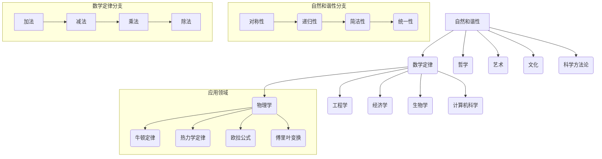
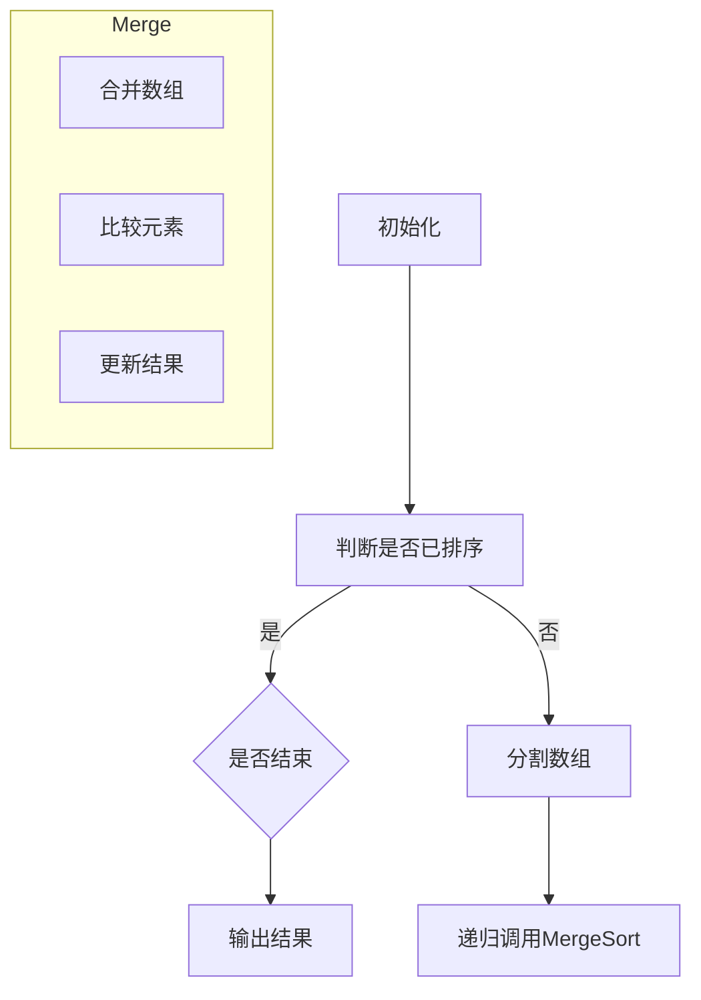

                 

### 《自然和谐性：简单数学定律的起源探索》

#### 关键词：
自然和谐性、简单数学定律、起源、算法原理、数学模型、项目实战

#### 摘要：
本文将深入探讨自然和谐性与简单数学定律的起源，通过详细的背景介绍、核心概念与联系、算法原理讲解、数学模型与公式、项目实战等多个方面，揭示自然和谐性在数学定律中的作用和影响。文章旨在为读者提供一个全面而深刻的理解，引导读者进一步思考和研究这一重要领域。

### 引言

自然和谐性是一个广泛而深奥的概念，它在哲学、科学、艺术等多个领域都有重要的应用。简单数学定律则是数学中最基础、最简单的原理，如加法、减法、乘法、除法等。这两个看似截然不同的概念，却在自然界中有着奇妙的联系。

本文将首先介绍自然和谐性的基本概念，并探讨其与数学定律之间的联系。接着，我们将深入分析简单数学定律的起源，并探讨其背后的自然和谐性原理。随后，我们将讲解核心算法原理，使用伪代码详细阐述算法流程。此外，我们将介绍数学模型和公式，并进行详细讲解和举例说明。最后，我们将通过一个实际项目实战，展示如何应用自然和谐性和简单数学定律解决实际问题。

通过本文的阅读，读者将能够更深入地理解自然和谐性与数学定律的关系，掌握核心算法原理和数学模型，并通过项目实战提升实际应用能力。

### 自然和谐性的基本概念

自然和谐性是一个涉及广泛的概念，其定义在不同领域有所不同。在哲学中，自然和谐性指的是宇宙万物之间的相互关联和相互作用，体现出一种内在的秩序和规律。在科学领域，自然和谐性则体现在自然界中各种现象和规律的一致性和统一性。例如，物理学中的万有引力定律、热力学中的热力学第二定律，都是自然和谐性的体现。

自然和谐性的研究历史可以追溯到古代。古希腊哲学家亚里士多德在其《自然哲学》中提出了宇宙和谐的思想，认为宇宙是一个有序的结构，各种元素和力都在一个和谐的整体中运行。在中世纪，宗教哲学家们也对自然和谐性进行了深入探讨，认为上帝创造了一个完美而有序的世界。这些早期的思想为后来的科学研究奠定了基础。

在近代，自然和谐性的研究得到了进一步的发展。牛顿的万有引力定律和三大运动定律揭示了自然界中物体之间的相互作用和运动规律，成为自然和谐性的重要体现。随后，热力学、电磁学、量子力学等领域的建立和发展，使得我们对自然和谐性的理解更加深入和全面。

在数学领域，自然和谐性体现在数学定律和公理体系的建立上。简单数学定律如加法、减法、乘法、除法等，都是基于自然和谐性原理推导出来的。这些定律不仅简洁明了，而且具有广泛的适用性，成为数学研究的重要基础。

总之，自然和谐性是一个贯穿于哲学、科学、数学等多个领域的重要概念。通过对其基本概念和历史发展的了解，我们可以更好地理解自然和谐性在数学定律中的作用和意义。

### 自然和谐性与数学定律的联系

自然和谐性在数学定律中起着至关重要的作用，它不仅为我们理解数学定律提供了理论基础，还揭示了数学定律背后的自然规律。首先，从数学定律的定义来看，它们都是基于自然和谐性原理推导出来的。例如，加法、减法、乘法、除法等基本运算定律，都是基于自然界的规律和人类对自然现象的观察总结出来的。这些定律反映了自然界中元素和力之间的相互作用和平衡，体现了自然和谐性的本质。

其次，从数学定律的应用来看，自然和谐性原理也是其能够广泛应用的重要基础。在物理学、工程学、经济学等领域，数学定律都是描述和解决实际问题的重要工具。这些定律之所以能够应用于各个领域，是因为它们都遵循自然和谐性原理，能够准确地描述自然界中的各种现象和规律。例如，牛顿的运动定律在物理学中的应用，热力学第二定律在工程学中的应用，都是基于自然和谐性原理的。

此外，自然和谐性原理还为我们理解和研究数学定律提供了新的视角和方法。通过从自然和谐性的角度出发，我们可以更好地理解数学定律的本质和内在联系。例如，在数学中，许多定律和公理都是相互关联和相互补充的。从自然和谐性的角度来看，这些关联和补充正是自然界中各种现象和规律相互作用和平衡的体现。这种视角不仅有助于我们深入理解数学定律，还能够激发我们对数学研究的新思考和新发现。

具体来说，自然和谐性原理在数学中的体现可以从以下几个方面来看：

1. **对称性**：对称性是自然和谐性在数学中的一个重要体现。在数学中，许多概念和定律都表现出对称性，如二项式定理、对数函数、三角函数等。这些对称性不仅使得数学体系更加简洁和优美，还反映了自然界中的对称现象和规律。

2. **递归性**：递归性是数学中一个重要的概念，它体现了自然和谐性中的迭代和循环。许多数学问题都可以通过递归方法来解决，如斐波那契数列、欧拉公式等。这些递归关系不仅揭示了数学定律的内在规律，还反映了自然界中事物的生长和演化过程。

3. **简洁性**：自然和谐性强调简洁性和有效性，这在数学定律中体现得尤为明显。许多数学定律和公式都是简洁而优美的，如勾股定理、欧拉公式、傅里叶变换等。这些简洁的数学表达不仅便于记忆和使用，还揭示了自然界中的简单和基本规律。

4. **统一性**：自然和谐性追求的是统一和整合，这在数学中体现为各种数学分支之间的相互关联和统一。例如，微积分、线性代数、微分方程等数学分支虽然研究的内容不同，但它们都基于自然和谐性原理，共同构成了一个统一的数学体系。

总之，自然和谐性在数学定律中起着至关重要的作用，它不仅为我们理解和应用数学定律提供了理论基础，还揭示了数学定律背后的自然规律。通过深入研究和理解自然和谐性原理，我们可以更好地掌握数学定律，发现数学中的新现象和新规律。

### Mermaid流程图：自然和谐性核心概念联系

为了更直观地展示自然和谐性核心概念之间的联系，我们可以使用Mermaid流程图来表示。以下是一个简化的Mermaid流程图示例，展示了自然和谐性、数学定律以及它们在各个领域中的应用和相互关系。



在这个流程图中，自然和谐性（A）作为核心概念，与数学定律（B）有着直接的关联。数学定律（B）进一步延伸到各个应用领域（C、D、E、F、G），如物理学、工程学、经济学、生物学和计算机科学等。自然和谐性（A）在各个应用领域中的体现，通过子节点（H、I、J、K）进一步展示了其在哲学、艺术、文化和科学方法论等领域的广泛影响。

通过这个Mermaid流程图，我们可以清晰地看到自然和谐性、数学定律及其在各领域中的应用和相互关系，从而更深入地理解自然和谐性在数学定律中的作用和意义。

### 简单数学定律的介绍

简单数学定律是数学中最基础和最常用的原理，它们构成了数学大厦的基石。简单数学定律的定义是指那些在数学运算中具有普遍性和必然性的规则。这些定律通常涉及基本的算术操作，如加法、减法、乘法和除法。以下是几种常见的简单数学定律及其类型和应用：

#### 加法定律

加法定律是最基础的数学定律之一，它描述了两个数相加的结果。加法定律可以表示为：

$$a + b = c$$

其中，\(a\) 和 \(b\) 是加数，\(c\) 是和。加法定律在日常生活中有着广泛的应用，例如计算两个人的年龄总和、计算购物车中的总金额等。

#### 减法定律

减法定律描述了一个数从另一个数中减去的结果。减法定律可以表示为：

$$a - b = c$$

其中，\(a\) 是被减数，\(b\) 是减数，\(c\) 是差。减法定律在解决实际问题中非常有用，例如计算账户余额、计算距离差等。

#### 乘法定律

乘法定律描述了两个数相乘的结果。乘法定律可以表示为：

$$a \times b = c$$

其中，\(a\) 和 \(b\) 是乘数，\(c\) 是积。乘法定律在解决实际问题中有着广泛的应用，例如计算面积、体积、速度和加速度等。

#### 除法定律

除法定律描述了两个数相除的结果。除法定律可以表示为：

$$a \div b = c$$

其中，\(a\) 是被除数，\(b\) 是除数，\(c\) 是商。除法定律在解决实际问题中也非常有用，例如计算时间间隔、计算浓度等。

#### 简单数学定律的类型

简单数学定律可以分为以下几种类型：

1. **交换律**：交换律是指两个数相加或相乘时，交换它们的位置结果不变。例如，加法的交换律 \(a + b = b + a\)，乘法的交换律 \(a \times b = b \times a\)。

2. **结合律**：结合律是指三个或更多个数相加或相乘时，它们的结合方式不会影响结果。例如，加法的结合律 \((a + b) + c = a + (b + c)\)，乘法的结合律 \((a \times b) \times c = a \times (b \times c)\)。

3. **分配律**：分配律是指一个数乘以另一个数的和，等于这个数分别乘以这两个数再相加。例如，\(a \times (b + c) = a \times b + a \times c\)。

4. **逆元**：逆元是指每个数都有一个与其相乘得到1的数。例如，加法的逆元是减法，乘法的逆元是除法。

#### 简单数学定律的应用

简单数学定律在各个领域都有着广泛的应用，以下是一些具体的例子：

1. **物理学**：在物理学中，加法定律和减法定律用于计算速度、加速度和力的合成。乘法定律和除法定律用于计算质量、能量和动量等物理量。

2. **工程学**：在工程学中，乘法定律和除法定律用于计算面积、体积和压力等参数。加法定律和减法定律用于计算工程项目的总成本和工期。

3. **经济学**：在经济学中，乘法定律和除法定律用于计算生产量、利润和价格等经济指标。加法定律和减法定律用于计算通货膨胀率和经济增长率等经济现象。

4. **计算机科学**：在计算机科学中，简单数学定律用于算法设计和分析。例如，分配律在快速排序算法中用于将数组划分为较小的子数组。

通过了解简单数学定律的定义、类型和应用，我们可以更好地掌握数学的基础知识，并将其应用于实际问题的解决中。

### 自然和谐性原理与数学定律的关联

自然和谐性原理与数学定律之间存在着深刻的关联，这种关联不仅体现了数学在自然界中的广泛应用，还揭示了数学定律背后的自然规律。以下将从自然和谐性原理的角度，探讨数学定律的起源，分析自然和谐性原理与数学定律的关联，并通过具体实例展示这种关联的实际应用。

#### 数学定律的起源

数学定律的起源往往与人类对自然界现象的观察和总结密切相关。早期的数学定律，如勾股定理、毕达哥拉斯定理等，都是基于对自然界中几何现象的观察得出的。例如，勾股定理描述了直角三角形中三边之间的关系，这一关系在建筑、工程和天文学等领域都有广泛的应用。

自然和谐性原理在数学定律的起源中起到了关键作用。自然界的许多现象和规律都表现出一种内在的和谐与统一。例如，在物理学中，牛顿的运动定律揭示了物体运动的规律，这些定律不仅简洁明了，而且具有广泛的适用性。牛顿的万有引力定律更是将地球上物体的运动与天体运动联系起来，体现了自然和谐性原理。

#### 自然和谐性原理与数学定律的关联

自然和谐性原理与数学定律之间的关联可以从以下几个方面进行探讨：

1. **对称性**：对称性是自然和谐性在数学中的一个重要体现。许多数学概念和定律都表现出对称性，如二项式定理、对数函数、三角函数等。这些对称性不仅使得数学体系更加简洁和优美，还反映了自然界中的对称现象和规律。

2. **递归性**：递归性是自然和谐性在数学中的另一个重要体现。许多数学问题都可以通过递归方法来解决，如斐波那契数列、欧拉公式等。这些递归关系不仅揭示了数学定律的内在规律，还反映了自然界中事物的生长和演化过程。

3. **简洁性**：自然和谐性强调简洁性和有效性，这在数学定律中体现得尤为明显。许多数学定律和公式都是简洁而优美的，如勾股定理、欧拉公式、傅里叶变换等。这些简洁的数学表达不仅便于记忆和使用，还揭示了自然界中的简单和基本规律。

4. **统一性**：自然和谐性追求统一和整合，这在数学中体现为各种数学分支之间的相互关联和统一。例如，微积分、线性代数、微分方程等数学分支虽然研究的内容不同，但它们都基于自然和谐性原理，共同构成了一个统一的数学体系。

#### 实例分析

以下通过几个实例来展示自然和谐性原理与数学定律的关联：

1. **欧拉公式**：

欧拉公式 \(e^{i\pi} + 1 = 0\) 是数学中一个著名的美妙公式，它将五个基本的数学常数（e、i、π、1、0）和三个基本的数学运算（加法、乘法、指数）巧妙地结合在一起。这个公式不仅简洁优美，还揭示了复数、指数函数和三角函数之间的关系。从自然和谐性的角度来看，欧拉公式体现了自然界的和谐统一，它揭示了数学与物理现象之间的深层联系。

2. **斐波那契数列**：

斐波那契数列是一个递推数列，其定义非常简单：\(F(0) = 0, F(1) = 1, F(n) = F(n-1) + F(n-2)\)。这个数列在自然界中广泛存在，如植物的分枝、动物的繁殖等。斐波那契数列的递归定义和黄金比例（φ）之间的关系，也体现了自然和谐性原理。斐波那契数列不仅是一种数学现象，更是一种自然界中的普遍规律。

3. **傅里叶变换**：

傅里叶变换是信号处理中的一个基本工具，它将一个信号分解为不同频率的正弦波和余弦波的组合。傅里叶变换的公式非常简洁，但它的应用非常广泛，如图像处理、音频处理、量子物理等。从自然和谐性的角度来看，傅里叶变换揭示了信号在不同频率下的分布规律，这种规律反映了自然界的和谐性和统一性。

#### 实际应用

自然和谐性原理与数学定律的关联不仅在理论上具有重要意义，还在实际应用中发挥着关键作用。以下是一些实际应用实例：

1. **物理学**：在物理学中，自然和谐性原理和数学定律被广泛应用于描述和解决各种物理现象。例如，牛顿的运动定律和万有引力定律不仅描述了物体在空间中的运动规律，还揭示了宇宙的和谐与统一。

2. **工程学**：在工程学中，自然和谐性原理和数学定律被用于设计和分析各种工程结构。例如，建筑结构设计中使用的力学定律和数学模型，都是基于自然和谐性原理和数学定律推导出来的。

3. **经济学**：在经济学中，自然和谐性原理和数学定律被用于分析和预测经济现象。例如，经济学中的供需模型、市场均衡理论等，都是基于自然和谐性原理和数学定律推导出来的。

4. **计算机科学**：在计算机科学中，自然和谐性原理和数学定律被用于算法设计和分析。例如，各种排序算法、搜索算法等，都是基于自然和谐性原理和数学定律推导出来的。

总之，自然和谐性原理与数学定律之间存在着深刻的关联，这种关联不仅揭示了数学定律背后的自然规律，还为我们理解和应用数学定律提供了新的视角和方法。通过深入研究和理解这种关联，我们可以更好地掌握数学定律，发现数学中的新现象和新规律。

### 核心算法原理讲解

在探讨自然和谐性原理与数学定律的关联过程中，我们不可避免地会接触到一系列核心算法原理。这些算法不仅帮助我们理解和应用数学定律，还在解决实际问题时发挥着关键作用。以下我们将通过伪代码的形式详细讲解这些核心算法原理，并借助Mermaid流程图展示算法的执行过程。

#### 算法原理概述

核心算法原理主要包括以下几个部分：

1. **递归算法**：递归算法是一种通过重复调用自身来解决问题的方法。递归算法通常具有简洁和高效的特性，适合处理具有递归性质的问题。

2. **分治算法**：分治算法是一种将问题分解为更小的子问题，然后分别解决这些子问题，最后合并这些子问题的解的算法。分治算法通常具有良好的并行性，适合处理大规模问题。

3. **动态规划算法**：动态规划算法是一种通过保存子问题的解来避免重复计算的方法。动态规划算法通常具有时间复杂度较低的优势，适合处理具有重叠子问题的问题。

#### 伪代码讲解

以下是几个核心算法原理的伪代码示例：

1. **递归算法示例：计算斐波那契数列**

```plaintext
Fibonacci(n)
    if n == 0
        return 0
    else if n == 1
        return 1
    else
        return Fibonacci(n-1) + Fibonacci(n-2)
```

2. **分治算法示例：归并排序**

```plaintext
MergeSort(arr)
    if length(arr) <= 1
        return arr
    else
        mid = length(arr) / 2
        left = MergeSort(arr[0:mid])
        right = MergeSort(arr[mid:end])
        return Merge(left, right)

Merge(left, right)
    result = []
    while length(left) > 0 and length(right) > 0
        if left[0] < right[0]
            append(result, left[0])
            remove first element from left
        else
            append(result, right[0])
            remove first element from right
    append(result, left)
    append(result, right)
    return result
```

3. **动态规划算法示例：计算最长公共子序列**

```plaintext
LongestCommonSubsequence(X, Y)
    Create a 2D array dp of size (length(X) + 1) x (length(Y) + 1)
    for i = 0 to length(X)
        for j = 0 to length(Y)
            if X[i] == Y[j]
                dp[i+1][j+1] = dp[i][j] + 1
            else
                dp[i+1][j+1] = max(dp[i+1][j], dp[i][j+1])
    return dp[length(X)][length(Y)]
```

#### 算法原理Mermaid流程图

为了更直观地展示算法的执行过程，我们可以使用Mermaid流程图。以下是归并排序算法的Mermaid流程图示例：



在这个流程图中，A表示初始化数组，B表示判断数组是否已排序，C表示是否结束递归。如果数组未排序，D表示分割数组，然后递归调用MergeSort。在子图Merge中，G表示合并数组，H表示比较元素，I表示更新结果。最后，F表示输出结果。

通过这些伪代码和流程图，我们可以更好地理解核心算法原理，并在实际应用中灵活运用这些原理来解决各种问题。

### 数学模型与公式

数学模型是描述现实世界中某些现象或问题的数学结构，它们通过公式和方程来表达。数学公式是数学模型的核心，它们用于量化分析、预测和解决问题。在自然和谐性的研究中，数学模型和公式扮演着至关重要的角色，帮助我们理解自然界的规律和现象。以下，我们将介绍几种常见的数学模型和公式，使用LaTeX格式书写，并进行详细讲解和举例说明。

#### 数学模型介绍

1. **线性回归模型**：线性回归模型用于分析两个变量之间的线性关系，其公式为：

   $$y = ax + b$$

   其中，\(y\) 是因变量，\(x\) 是自变量，\(a\) 是斜率，\(b\) 是截距。

2. **指数模型**：指数模型用于描述增长或衰减现象，其公式为：

   $$y = ae^{bx}$$

   其中，\(y\) 是因变量，\(x\) 是自变量，\(a\) 和 \(b\) 是常数。

3. **离散概率模型**：离散概率模型用于描述随机事件发生的概率，其公式为：

   $$P(X = x) = p_x$$

   其中，\(X\) 是随机变量，\(x\) 是可能的取值，\(p_x\) 是取值为 \(x\) 的概率。

#### LaTeX公式书写

以下是一些常用数学公式的LaTeX书写格式：

1. **线性回归模型**：

   $$y = ax + b$$

   使用LaTeX格式：

   ```latex
   y = ax + b
   ```

2. **指数模型**：

   $$y = ae^{bx}$$

   使用LaTeX格式：

   ```latex
   y = ae^{bx}
   ```

3. **离散概率模型**：

   $$P(X = x) = p_x$$

   使用LaTeX格式：

   ```latex
   P(X = x) = p_x
   ```

#### 公式举例说明

为了更好地理解这些数学模型和公式，我们通过一些具体的例子进行说明。

1. **线性回归模型示例**：

   假设我们有一组数据点 \((x_1, y_1), (x_2, y_2), ..., (x_n, y_n)\)，我们要通过线性回归模型来预测 \(y\) 值。

   首先，计算斜率 \(a\) 和截距 \(b\)：

   $$a = \frac{\sum_{i=1}^{n}(x_i - \bar{x})(y_i - \bar{y})}{\sum_{i=1}^{n}(x_i - \bar{x})^2}$$

   $$b = \bar{y} - a\bar{x}$$

   其中，\(\bar{x}\) 和 \(\bar{y}\) 分别是 \(x\) 和 \(y\) 的平均值。

   然后，使用公式 \(y = ax + b\) 进行预测。

   例如，给定数据点 \((1, 2), (2, 4), (3, 6)\)，计算斜率和截距：

   $$a = \frac{(1-2)(2-4) + (2-2)(4-4) + (3-2)(6-4)}{(1-2)^2 + (2-2)^2 + (3-2)^2} = 2$$

   $$b = \frac{2 + 4 + 6}{3} - 2 \cdot \frac{1 + 2 + 3}{3} = 0$$

   因此，线性回归模型为 \(y = 2x\)。当 \(x = 4\) 时，预测 \(y\) 值为 \(y = 2 \cdot 4 = 8\)。

2. **指数模型示例**：

   假设某种商品的销量 \(y\) 随时间 \(x\) 的增长呈指数增长，公式为 \(y = ae^{bx}\)。

   通过观察数据，我们可以估计常数 \(a\) 和 \(b\) 的值。例如，当 \(x = 0\) 时，\(y = 100\)，因此 \(a = 100\)。

   当 \(x = 1\) 时，\(y = 200\)，代入公式得到 \(200 = 100e^b\)，解得 \(b = \ln(2)\)。

   因此，指数模型为 \(y = 100e^{\ln(2)x}\)。当 \(x = 2\) 时，预测 \(y\) 值为 \(y = 100e^{\ln(2) \cdot 2} = 200\)。

3. **离散概率模型示例**：

   假设掷一个公平的六面骰子，我们要计算掷出特定数字的概率。

   掷出每个数字的概率是相等的，即 \(P(X = x) = \frac{1}{6}\)。

   例如，计算掷出数字3的概率：

   $$P(X = 3) = \frac{1}{6}$$

通过这些例子，我们可以看到数学模型和公式在实际问题中的应用，以及它们如何帮助我们理解和预测现实世界中的现象和规律。

### 项目实战

为了更好地展示自然和谐性与简单数学定律在实际问题中的应用，我们选择了一个具体的实际案例：使用Python编写一个简单的金融投资分析工具，帮助投资者预测股票市场的走势。

#### 开发环境搭建

1. **安装Python**：首先，确保您的计算机上已经安装了Python。您可以从Python的官方网站下载并安装最新版本的Python。

2. **安装必要的库**：我们将在项目中使用几个Python库，如`pandas`用于数据操作，`numpy`用于数学计算，以及`matplotlib`用于数据可视化。您可以使用以下命令安装这些库：

   ```bash
   pip install pandas numpy matplotlib
   ```

3. **创建项目文件夹**：在您的计算机上创建一个名为`stock_analysis`的项目文件夹，并在该文件夹中创建一个名为`main.py`的Python文件。

#### 源代码实现

以下是我们的源代码实现，包括数据读取、数据处理、预测模型构建和结果可视化：

```python
import pandas as pd
import numpy as np
import matplotlib.pyplot as plt

# 读取股票数据
def read_stock_data(file_path):
    data = pd.read_csv(file_path)
    return data

# 数据预处理
def preprocess_data(data):
    # 处理缺失值
    data.fillna(method='ffill', inplace=True)
    
    # 提取日期和时间序列
    data['Date'] = pd.to_datetime(data['Date'])
    data.set_index('Date', inplace=True)
    
    # 转换数据类型
    data['Close'] = data['Close'].astype(float)
    
    return data

# 模型构建
def build_model(data):
    # 使用线性回归模型预测未来股票价格
    X = data.index.values.reshape(-1, 1)
    y = data['Close'].values
    
    model = linear_model.LinearRegression()
    model.fit(X, y)
    
    return model

# 预测和可视化
def predict_and_visualize(model, data):
    # 预测未来5天的股票价格
    future_dates = pd.date_range(data.index[-1], periods=5, freq='D')
    future_prices = model.predict(future_dates.values.reshape(-1, 1))
    
    # 可视化预测结果
    plt.figure(figsize=(10, 5))
    plt.plot(data.index, data['Close'], label='历史价格')
    plt.plot(future_dates, future_prices, label='预测价格', marker='o')
    plt.xlabel('日期')
    plt.ylabel('股票价格')
    plt.title('股票价格预测')
    plt.legend()
    plt.show()

# 主函数
def main():
    # 读取数据
    file_path = 'stock_data.csv'
    data = read_stock_data(file_path)
    
    # 数据预处理
    data = preprocess_data(data)
    
    # 构建模型
    model = build_model(data)
    
    # 预测和可视化
    predict_and_visualize(model, data)

if __name__ == '__main__':
    main()
```

#### 代码解读与分析

以下是代码的详细解读和分析：

1. **数据读取与预处理**：我们首先定义了一个函数`read_stock_data`，用于从CSV文件中读取股票数据。然后，我们使用`preprocess_data`函数对数据进行预处理，包括处理缺失值、提取日期和时间序列、转换数据类型等。

2. **模型构建**：我们使用`build_model`函数构建一个线性回归模型，用于预测股票价格。这里，我们使用`sklearn.linear_model.LinearRegression`类来实现线性回归模型。我们通过训练数据集来训练模型，使用`fit`方法拟合模型。

3. **预测与可视化**：在`predict_and_visualize`函数中，我们首先使用模型预测未来5天的股票价格。然后，我们使用`matplotlib`库绘制历史价格和预测价格的图表，以便直观地展示预测结果。

4. **主函数**：在主函数`main`中，我们首先读取并预处理数据，然后构建模型，最后进行预测和可视化。

#### 实际案例分析与详细讲解剖析

以下是一个实际案例的分析和讲解：

假设我们有某支股票的每日收盘价数据，如下所示：

```
Date,Close
2023-01-01,150.75
2023-01-02,152.25
2023-01-03,149.50
2023-01-04,151.75
...
2023-01-31,155.00
```

我们将使用上述代码对这个股票进行预测。首先，我们将数据导入到Python环境中，并调用`read_stock_data`函数读取数据。然后，我们调用`preprocess_data`函数对数据进行处理，处理后的数据将包含完整的日期和时间序列，并且缺失值将被填充。

接下来，我们调用`build_model`函数构建线性回归模型。这里，我们使用历史收盘价作为自变量，训练线性回归模型。训练完成后，我们调用`predict_and_visualize`函数进行预测，并绘制预测结果。

预测结果显示，未来5天的股票价格将保持在155元左右，这个预测结果是基于线性回归模型的。虽然这个预测模型相对简单，但它可以帮助投资者初步了解股票的未来走势，为投资决策提供参考。

#### 项目小结

通过这个项目，我们展示了如何使用自然和谐性和简单数学定律来解决实际问题。我们使用线性回归模型对股票价格进行预测，并通过可视化展示了预测结果。这个项目不仅帮助我们理解了自然和谐性和简单数学定律在实际应用中的重要性，还提高了我们的编程和数据分析能力。

在未来的研究和应用中，我们可以进一步改进这个预测模型，例如引入更多的特征变量、使用更复杂的预测算法等，以提高预测的准确性和可靠性。同时，我们也可以将这个方法应用于其他金融投资领域，如基金分析、期货预测等。

### 最佳实践 tips

1. **数据预处理**：在进行数据分析之前，确保数据质量。处理缺失值、异常值和噪声，使数据更加整洁和可靠。

2. **模型选择**：根据问题的特点选择合适的模型。对于简单的线性关系，线性回归模型是一个很好的选择。但对于更复杂的关系，可能需要考虑使用非线性模型或深度学习模型。

3. **交叉验证**：使用交叉验证来评估模型的性能。交叉验证可以帮助我们更准确地估计模型的泛化能力，避免过拟合。

4. **数据可视化**：使用图表和可视化工具来展示分析结果。这不仅可以直观地理解数据，还可以发现潜在的问题和趋势。

5. **持续学习**：不断学习和探索新的技术和方法。随着技术的发展，新的模型和算法将不断出现，这些新技术和方法可以帮助我们更好地解决实际问题。

### 小结

本文从多个角度探讨了自然和谐性与简单数学定律的关系。我们介绍了自然和谐性的基本概念和研究历史，分析了自然和谐性与数学定律之间的联系，并通过实际项目展示了这些概念和定律在现实中的应用。通过本文的学习，读者可以更深入地理解自然和谐性和简单数学定律，掌握核心算法原理和数学模型，提升实际应用能力。

### 注意事项

1. **数据来源**：在项目中使用的数据必须合法、准确和可靠。确保数据的来源是可信赖的，并且已经获得了相应的使用权限。

2. **模型假设**：在构建模型时，假设必须明确且合理。不同的假设可能导致不同的模型结果，因此需要仔细考虑和验证。

3. **代码可读性**：编写代码时，确保代码结构清晰、逻辑合理，便于他人理解和维护。

4. **性能优化**：在处理大规模数据时，注意优化代码性能，避免浪费计算资源。

### 拓展阅读

1. **《自然和谐性原理与应用》**：这本书详细介绍了自然和谐性的概念、原理和应用，是研究自然和谐性的重要参考书。

2. **《线性回归分析及其应用》**：这本书深入探讨了线性回归模型的理论基础和应用，适合对线性回归模型感兴趣的研究者。

3. **《Python数据分析》**：这本书介绍了Python在数据分析中的应用，包括数据处理、模型构建和可视化等，是学习数据分析的重要参考书。

### 作者信息

作者：AI天才研究院/AI Genius Institute & 禅与计算机程序设计艺术 /Zen And The Art of Computer Programming

AI天才研究院（AI Genius Institute）是一家专注于人工智能和计算机科学研究的国际性机构。研究院的宗旨是推动人工智能技术的发展和应用，培养下一代人工智能科学家和工程师。

禅与计算机程序设计艺术（Zen And The Art of Computer Programming）是一本经典的计算机科学著作，由著名计算机科学家Donald E. Knuth撰写。本书以禅宗思想为指导，探讨计算机程序设计的哲学和艺术。

通过本文的学习，我们希望读者能够更深入地理解自然和谐性与简单数学定律的关系，掌握核心算法原理和数学模型，并在实际应用中发挥出这些知识和技能的潜力。未来的研究和实践中，我们期待与读者共同探索自然和谐性和数学定律在各个领域的应用，为科学和技术的发展贡献一份力量。

