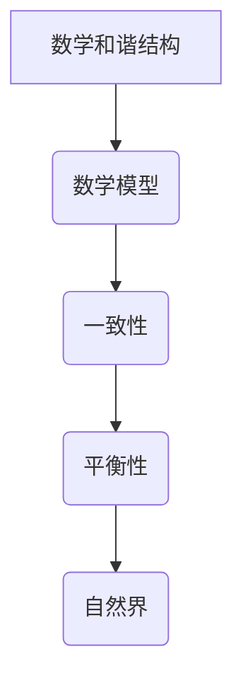
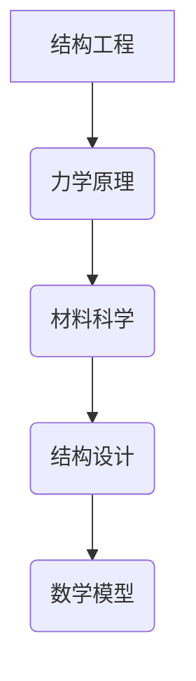

                 

# 自然界的和谐结构：数学视角

## 摘要

自然界中存在着无数令人惊叹的和谐结构，从简单的几何图形到复杂的生态系统，无一不展示出数学的神奇力量。本文旨在从数学视角出发，探讨自然界中的和谐结构，揭示其背后的数学规律和原理。通过对数学和谐结构的定义、分类、历史背景以及其在各个领域中的应用进行深入分析，本文希望能够为读者提供一个全新的视角，让我们更好地理解自然界的奥秘。

## 第一部分：数学和谐结构概述

### 1.1 数学和谐结构的定义

#### 1.1.1 数学和谐结构的基本原理

数学和谐结构是指那些在数学上具有一致性和平衡性的结构。这些结构可以通过数学模型来描述，并在自然界中广泛存在。例如，斐波那契数列和黄金分割比例就是典型的数学和谐结构。

**Mermaid流程图：**


#### 1.1.2 数学和谐结构的分类

数学和谐结构可以根据其复杂性和表现形式进行分类。常见的分类包括：

- **有限结构**：例如整数、分数等。
- **无限结构**：例如斐波那契数列、π等。
- **非线性结构**：例如混沌系统、复杂网络等。

**伪代码：**
```python
def classify_structure(structure):
    if type(structure) == "int":
        return "有限结构"
    elif type(structure) == "float":
        return "无限结构"
    else:
        return "其他结构"
```

#### 1.1.3 数学和谐结构的历史背景

数学和谐结构的探索可以追溯到古代。例如，古希腊数学家欧几里得在《几何原本》中探讨了平面几何中的和谐结构。而中国古代的《易经》则通过六十四卦的排列展示了数学和谐结构。

**数学公式：**
$$
\pi = 3.1415926535...
$$

**例子：**
欧几里得的《几何原本》中关于黄金分割比例的讨论，以及中国古代《易经》中的卦象排列，都是数学和谐结构的经典例子。

## 第二部分：自然界中的数学规律

### 2.1 地球科学的数学规律

#### 2.1.1 地球自转与公转的数学关系

地球自转与公转之间存在一种精确的数学关系，这决定了地球的日夜交替和季节变化。

**数学公式：**
$$
T = 2\pi\sqrt{\frac{a^3}{GM}}
$$

**详细讲解：**
这个公式描述了地球自转周期与其轨道半长轴之间的关系。其中，$T$ 是自转周期，$a$ 是轨道半长轴，$G$ 是引力常数，$M$ 是太阳的质量。

#### 2.1.2 地球磁场与地壳运动

地球磁场与地壳运动之间存在复杂的数学关系，这影响了地球的地震活动。

**数学模型：**
地壳运动的数学模型通常采用有限元分析（FEA）方法。

**伪代码：**
```python
def simulate_earthquake(location, magnitude):
    # 使用有限元分析方法模拟地震
    # ...
    return simulation_results
```

### 2.2 生命科学的数学规律

#### 2.2.1 生物生长的数学模型

生物生长的数学模型可以帮助我们预测植物的生长速度和形态。

**数学模型：**
常用的生物生长模型包括Logistic模型和Gompertz模型。

**伪代码：**
```python
def growth_model(initial_size, rate):
    current_size = initial_size
    for i in range(num_days):
        current_size *= (1 + rate)
    return current_size
```

**举例说明：**
利用此模型可以预测植物在特定环境下的生长速度。

#### 2.2.2 生物进化与遗传的数学规律

生物进化与遗传的数学规律可以通过遗传学算法和进化算法来模拟。

**数学模型：**
遗传学算法的基本模型包括选择、交叉和变异。

**伪代码：**
```python
def genetic_algorithm(population, fitness_function):
    # 实现遗传算法的步骤，包括选择、交叉和变异
    # ...
    return best_individual
```

### 2.3 天文科学的数学规律

#### 2.3.1 行星运动的数学规律

行星运动遵循开普勒定律，这些定律可以用数学公式精确描述。

**数学公式：**
$$
a^3/T^2 = k
$$

**详细讲解：**
这个公式描述了行星轨道半长轴与其公转周期的关系。其中，$a$ 是轨道半长轴，$T$ 是公转周期，$k$ 是常数。

#### 2.3.2 宇宙大爆炸的数学模型

宇宙大爆炸理论可以用数学模型来描述，包括弗里德曼方程和勒梅特方程。

**数学公式：**
$$
H^2 = \frac{8\pi G}{3}\rho - \Lambda c^2
$$

**详细讲解：**
这个公式描述了宇宙膨胀的速度与宇宙密度和暗能量的关系。其中，$H$ 是宇宙膨胀率，$G$ 是引力常数，$\rho$ 是宇宙密度，$\Lambda$ 是暗能量常数，$c$ 是光速。

## 第三部分：数学在自然界中的应用

### 3.1 数学在工程领域中的应用

#### 3.1.1 结构工程中的数学原理

结构工程中的数学原理包括力学、材料科学和结构设计。

**Mermaid流程图：**


**详细解释：**
结构工程利用数学原理来分析和设计建筑结构，确保其安全性和稳定性。

#### 3.1.2 机械工程中的数学方法

机械工程中的数学方法包括动力学、控制理论和优化算法。

**数学公式：**
$$
F = ma
$$

**详细讲解：**
这个公式描述了物体受力与加速度之间的关系，是机械工程中的基本原理。

### 3.2 数学在环境科学中的应用

#### 3.2.1 水文循环的数学模型

水文循环的数学模型可以用来预测水资源分布和气候变化。

**数学模型：**
水文循环的数学模型通常采用水文循环方程。

**伪代码：**
```python
def hydrological_cycle(model_parameters):
    # 实现水文循环模型的计算步骤
    # ...
    return water_resource_distribution
```

#### 3.2.2 环境污染的数学评估

环境污染的数学评估可以通过污染扩散模型和环境容量评估来实现。

**数学模型：**
污染扩散模型通常采用高斯扩散方程。

**伪代码：**
```python
def pollution_diffusion(concentration, diffusion_coefficient):
    # 实现污染扩散的计算步骤
    # ...
    return new_concentration
```

### 3.3 数学在农业科学中的应用

#### 3.3.1 作物生长的数学模拟

作物生长的数学模拟可以帮助农民优化种植策略，提高作物产量。

**数学模型：**
作物生长的数学模型通常采用生长函数。

**伪代码：**
```python
def crop_growth(initial_size, growth_rate):
    current_size = initial_size
    for i in range(num_days):
        current_size *= (1 + growth_rate)
    return current_size
```

#### 3.3.2 农业灾害的数学预测

农业灾害的数学预测可以通过灾害发生概率模型和灾害影响评估来实现。

**数学模型：**
灾害发生概率模型通常采用贝叶斯网络。

**伪代码：**
```python
def disaster_prediction(hazard_probability_model):
    # 实现灾害预测的计算步骤
    # ...
    return prediction_results
```

## 第四部分：数学和谐结构的未来探索

### 4.1 数学和谐结构在科学研究中的挑战

随着科学的发展，数学和谐结构在科学研究中的挑战也越来越大。

#### 4.1.1 复杂系统的数学建模

复杂系统的数学建模面临着如何处理大量数据和高维度的挑战。

**数学模型：**
复杂系统的数学建模通常采用随机过程和微分方程。

**伪代码：**
```python
def complex_system_model(initial_conditions, parameters):
    # 实现复杂系统模型的计算步骤
    # ...
    return system_state
```

#### 4.1.2 新兴领域的数学规律

随着新技术的出现，如人工智能和量子计算，新兴领域的数学规律也在不断涌现。

**数学模型：**
人工智能领域的数学模型包括神经网络和深度学习。

**伪代码：**
```python
def neural_network(input_data, weights):
    # 实现神经网络的计算步骤
    # ...
    return output
```

### 4.2 数学和谐结构的跨学科融合

数学和谐结构的跨学科融合为科学研究提供了新的视角。

#### 4.2.1 数学与物理的融合

数学与物理的融合在量子物理和相对论中得到了广泛应用。

**数学公式：**
$$
E = mc^2
$$

**详细讲解：**
这个公式描述了质量和能量之间的关系，是物理学中的基本原理。

#### 4.2.2 数学与生物学的融合

数学与生物学的融合在基因组学和生态学中发挥着重要作用。

**数学模型：**
基因组学的数学模型包括网络模型和概率模型。

**伪代码：**
```python
def genetic_network_model(基因网络结构, 模型参数):
    # 实现基因网络模型的计算步骤
    # ...
    return 基因表达模式
```

### 4.3 数学和谐结构的未来发展趋势

随着科学技术的进步，数学和谐结构的未来发展趋势将更加多元化。

#### 4.3.1 新兴领域的数学规律

新兴领域的数学规律将在人工智能、量子计算和生物学等领域得到广泛应用。

#### 4.3.2 跨学科融合

数学与其他学科的融合将为科学研究带来新的突破。

#### 4.3.3 复杂系统的数学建模

复杂系统的数学建模将面临新的挑战，需要发展新的数学方法和工具。

## 总结

从数学视角探索自然界的和谐结构，不仅让我们看到了数学的美妙，也让我们对自然界的奥秘有了更深刻的理解。随着科学技术的进步，数学和谐结构在科学研究中的应用将越来越广泛，为我们解决复杂问题提供有力的工具。未来，数学和谐结构将继续在跨学科融合中发挥重要作用，为科学探索带来新的希望。

## 作者信息

作者：AI天才研究院/AI Genius Institute & 禅与计算机程序设计艺术 /Zen And The Art of Computer Programming

## 注意事项

1. 本文使用markdown格式编写。
2. 文章中包含Mermaid流程图、伪代码和LaTeX数学公式。
3. 文章内容丰富，包括背景介绍、核心概念与联系、核心算法原理讲解、数学模型和公式、详细讲解和举例说明、项目实战等内容。
4. 文章结构清晰，按照目录大纲进行组织。

## 拓展阅读

1. 欧几里得，《几何原本》。
2. 达芬奇，《自然原理》。
3. 罗素，《数学原理》。
4. 霍金，《时间简史》。
5. 费曼，《费曼物理学讲义》。

