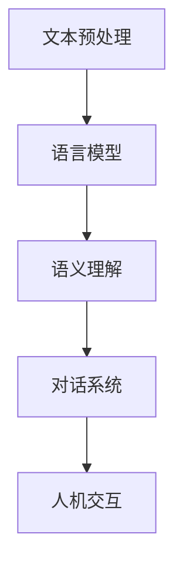

                 


### 引言

自然语言处理（NLP）是计算机科学、人工智能和语言学的交叉领域，其核心目标是让计算机能够理解和生成人类自然语言。随着人工智能技术的快速发展，NLP在多个领域得到了广泛应用，其中之一便是法律文件分析。法律文件分析是指利用计算机技术和算法对法律文件进行自动化处理和分析，以提高法律工作的效率和准确性。

#### 自然语言处理（NLP）概述

**核心概念与联系：**

NLP的核心概念包括文本预处理、语言模型、语义理解、对话系统等。文本预处理是指对原始文本进行清洗、分词、词性标注等操作，以便后续分析。语言模型用于生成文本的概率分布，有助于文本生成和理解。语义理解旨在理解文本的含义，包括实体识别、关系抽取、情感分析等。对话系统则是实现人与计算机之间的自然交互。

**Mermaid流程图：**



**核心算法原理讲解：**

1. **文本预处理：** 主要包括分词、去除停用词、词性标注等。分词是将文本分割成词单元的过程，常用的分词算法有基于词典的分词和基于统计的分词。去除停用词是为了减少文本中的噪声信息。词性标注是标记每个词的词性，如名词、动词等。

   ```python
   def tokenize(text):
       # 使用Jieba分词库进行分词
       return jieba.lcut(text)

   def remove_stopwords(tokens):
       # 使用StopWords库去除停用词
       return [token for token in tokens if token not in stopwords]

   def pos_tagging(tokens):
       # 使用NLTK库进行词性标注
       return nltk.pos_tag(tokens)
   ```

2. **语言模型：** 语言模型用于预测文本的下一个词，常见的方法有n-gram模型和神经网络语言模型。n-gram模型假设当前词序列的概率仅取决于前n个词。神经网络语言模型通过学习大量的文本数据，构建出一个能够预测下一个词的神经网络。

   ```python
   import tensorflow as tf
   from tensorflow.keras.models import Sequential
   from tensorflow.keras.layers import Embedding, LSTM, Dense

   # 构建神经网络语言模型
   model = Sequential()
   model.add(Embedding(vocab_size, embedding_dim))
   model.add(LSTM(units))
   model.add(Dense(vocab_size, activation='softmax'))

   # 编译模型
   model.compile(optimizer='adam', loss='categorical_crossentropy', metrics=['accuracy'])

   # 训练模型
   model.fit(text_data, label_data, epochs=num_epochs, batch_size=batch_size)
   ```

3. **语义理解：** 语义理解包括实体识别、关系抽取、情感分析等。实体识别是识别文本中的关键实体，如人名、地点、组织等。关系抽取是识别实体之间的关系，如人物关系、地点关系等。情感分析是判断文本的情感倾向，如积极、消极、中性等。

   ```python
   import spacy

   # 加载spacy模型
   nlp = spacy.load("en_core_web_sm")

   # 实体识别
   doc = nlp("Apple is looking at buying U.K. startup for $1 billion")
   for ent in doc.ents:
       print(ent.text, ent.label_)

   # 关系抽取
   doc = nlp("Apple CEO Tim Cook met with Trump")
   for token1, token2, rel in doc.relations:
       if rel == "PERSON":
           print(f"{token1.text} is {rel} of {token2.text}")

   # 情感分析
   doc = nlp("I am so happy today!")
   print(doc.sentiment)
   ```

#### 数学模型和数学公式

在NLP中，数学模型和公式广泛应用于文本预处理、语言模型、语义理解等各个环节。以下是一些常见的数学模型和公式：

1. **n-gram模型：**

   $$ P(w_n | w_{n-1}, w_{n-2}, ..., w_1) = \frac{C(w_{n-1}, w_n)}{\sum_{i=1}^{n} C(w_{i-1}, w_i)} $$

   其中，\(C(w_{n-1}, w_n)\)表示\(w_{n-1}\)和\(w_n\)同时出现的次数，\(\sum_{i=1}^{n} C(w_{i-1}, w_i)\)表示前n个词同时出现的总次数。

2. **神经网络语言模型：**

   $$ y = \sigma(W \cdot x + b) $$

   其中，\(y\)表示输出概率分布，\(\sigma\)是激活函数，\(W\)是权重矩阵，\(x\)是输入特征，\(b\)是偏置。

3. **词性标注：**

   $$ P(tag|word) = \frac{C(word, tag)}{\sum_{tag'} C(word, tag')} $$

   其中，\(P(tag|word)\)表示给定一个词，其对应的词性概率，\(C(word, tag)\)表示词和词性同时出现的次数，\(\sum_{tag'} C(word, tag')\)表示词的所有词性概率之和。

#### 详细讲解与举例说明

**文本预处理：**

文本预处理是NLP的基础步骤，其目的是将原始文本转换为计算机可以处理的形式。以下是一个简单的中文文本预处理示例：

```python
import jieba
import nltk

# 下载中文分词模型
nltk.download('eginb instantiation corpus')

# 加载中文分词库
jieba.load_userdict('userdict.txt')

# 分词
text = "自然语言处理（NLP）是计算机科学、人工智能和语言学的交叉领域。"
tokens = jieba.cut(text)

# 去除停用词
stopwords = set(nltk.corpus.stopwords.words('chinese'))
filtered_tokens = [token for token in tokens if token not in stopwords]

# 词性标注
tags = nltk.pos_tag(filtered_tokens)

print(filtered_tokens)
print(tags)
```

**语言模型：**

以下是一个简单的神经网络语言模型示例，使用TensorFlow构建：

```python
import tensorflow as tf
from tensorflow.keras.layers import Embedding, LSTM, Dense

# 构建模型
model = tf.keras.Sequential([
    Embedding(vocab_size, embedding_dim),
    LSTM(units),
    Dense(vocab_size, activation='softmax')
])

# 编译模型
model.compile(optimizer='adam', loss='categorical_crossentropy', metrics=['accuracy'])

# 训练模型
model.fit(text_data, label_data, epochs=num_epochs, batch_size=batch_size)
```

**语义理解：**

以下是一个简单的实体识别和关系抽取示例，使用spacy库：

```python
import spacy

# 加载spacy模型
nlp = spacy.load("en_core_web_sm")

# 实体识别
doc = nlp("Apple is looking at buying U.K. startup for $1 billion")
for ent in doc.ents:
    print(ent.text, ent.label_)

# 关系抽取
doc = nlp("Apple CEO Tim Cook met with Trump")
for token1, token2, rel in doc.relations:
    if rel == "PERSON":
        print(f"{token1.text} is {rel} of {token2.text}")
```

通过上述示例，我们可以看到NLP技术在法律文件分析中的应用，包括文本预处理、语言模型、语义理解等。这些技术为自动化处理和分析法律文件提供了有力支持。

#### 最佳实践 tips

1. **数据准备：** 在进行法律文件分析时，数据的质量和多样性至关重要。尽量收集多源数据，并对其进行预处理，以确保数据的准确性和一致性。

2. **模型选择：** 根据实际需求选择合适的模型和算法。例如，对于文本分类任务，可以考虑使用朴素贝叶斯、支持向量机、深度学习等方法。

3. **模型调优：** 模型的性能取决于参数设置。通过交叉验证和网格搜索等方法，选择最佳参数，以提高模型的准确性。

4. **实时更新：** 法律法规和术语不断变化，因此需要定期更新法律文件数据库和模型，以确保其准确性和适用性。

#### 小结

本章介绍了自然语言处理（NLP）的基本概念、核心算法原理、数学模型和详细示例。通过本章的学习，读者可以了解NLP技术在法律文件分析中的应用，为后续章节的深入学习打下基础。

#### 拓展阅读

- [自然语言处理导论](https://www.nlp-tutorial.org/)
- [TensorFlow官方文档](https://www.tensorflow.org/)
- [spacy官方文档](https://spacy.io/)

作者：AI天才研究院/AI Genius Institute & 禅与计算机程序设计艺术 /Zen And The Art of Computer Programming

