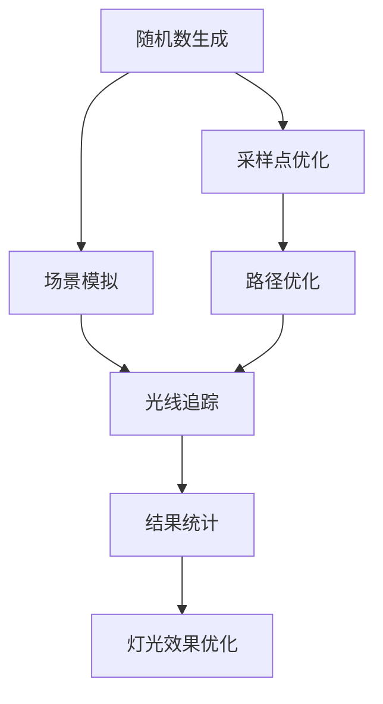

                 

# 《舞台灯光的蒙特卡洛光线追踪：视觉效果的数学模拟》

## 摘要

本文旨在探讨舞台灯光设计中的一种先进技术——蒙特卡洛光线追踪，以及其在视觉效果数学模拟中的应用。蒙特卡洛方法通过随机抽样和统计方法解决复杂问题，而光线追踪技术则是通过模拟光线路径来生成逼真的图像。本文首先介绍了蒙特卡洛方法和光线追踪技术的基本原理，随后详细讲解了蒙特卡洛光线追踪在舞台灯光设计中的具体应用。通过构建数学模型，本文深入分析了光线追踪的计算过程，并使用伪代码详细阐述了算法原理。接着，通过一个实际案例展示了如何使用蒙特卡洛光线追踪技术模拟舞台灯光效果，并对项目中的代码实现进行了深入解读。最后，本文总结了主要研究成果，指出了存在的问题与挑战，并对未来的研究方向进行了展望。本文旨在为舞台灯光设计师和计算机图形学爱好者提供一种新的技术视角和实用的解决方案。

## 引言

舞台灯光设计在戏剧、电影、音乐会等表演艺术领域中扮演着至关重要的角色。它不仅能够塑造氛围、增强情感表达，还能够提升观众的视觉体验。然而，舞台灯光设计面临着诸多挑战，如灯光布置的合理性、灯光效果的精确控制以及灯光与舞台布景的协调等。传统的舞台灯光设计主要依赖于经验和技术，虽然能够达到一定的效果，但在复杂场景下往往难以满足精确的要求。随着计算机图形学和技术的发展，利用计算机模拟和优化舞台灯光设计成为了一种新的趋势。

蒙特卡洛方法是一种通过大量随机抽样和统计计算来解决复杂问题的数学方法。其基本原理是利用随机数生成一系列可能的场景，并通过统计这些场景的结果来得到问题的解。蒙特卡洛方法在物理、工程、金融等多个领域都有广泛应用，如量子力学中的粒子模拟、金融衍生品定价、复杂系统优化等。蒙特卡洛方法的优势在于其简单、通用且适用范围广，但缺点是计算量大，需要大量随机抽样和长时间的计算。

光线追踪技术是计算机图形学中的一种核心技术，通过模拟光线路径来生成真实感图像。光线追踪技术的基本原理是，从观察者的视角出发，模拟光线在场景中的传播过程，包括反射、折射、散射等。通过计算光线与物体表面的交点，可以确定每个像素的颜色和亮度，从而生成最终的图像。光线追踪技术的优势在于其能够生成高度真实和细节丰富的图像，广泛应用于电影特效、游戏开发、虚拟现实等领域。

本文旨在将蒙特卡洛方法和光线追踪技术应用于舞台灯光设计，通过数学模拟实现舞台灯光效果的优化和优化。本文的结构如下：

1. **核心概念与联系**：介绍蒙特卡洛方法和光线追踪技术的基本原理，并探讨它们在舞台灯光设计中的应用。
2. **数学模型与公式讲解**：详细讲解蒙特卡洛光线追踪中的数学模型和公式，包括光线传播模型、反射与折射模型等。
3. **算法原理讲解**：使用伪代码解释蒙特卡洛光线追踪算法的基本流程和性能优化策略。
4. **项目实战**：通过一个实际案例展示如何使用蒙特卡洛光线追踪技术模拟舞台灯光效果，并对项目中的代码实现进行解读。
5. **代码解读与分析**：深入分析项目实战中的代码实现，包括关键函数和算法，以及性能优化策略。
6. **总结与展望**：总结本文的主要研究成果，讨论存在的问题和挑战，并对未来的研究方向进行展望。

本文的目标是，通过深入探讨蒙特卡洛光线追踪技术在舞台灯光设计中的应用，为舞台灯光设计师提供一种新的技术工具和方法，从而提升舞台灯光设计的精确度和艺术效果。

## 核心概念与联系

### 蒙特卡洛方法

蒙特卡洛方法是一种通过大量随机抽样和统计计算来解决复杂问题的数学方法。其基本原理是利用随机数生成一系列可能的场景，并通过统计这些场景的结果来得到问题的解。蒙特卡洛方法在解决诸如复杂系统优化、金融衍生品定价、量子力学模拟等问题时表现出色。以下是蒙特卡洛方法的基本步骤：

1. **随机数生成**：使用随机数生成器生成一系列随机数。
2. **场景模拟**：利用生成的随机数模拟一系列可能的场景。
3. **结果统计**：统计这些场景的结果，并根据统计结果得到问题的解。

蒙特卡洛方法的主要优点包括简单、通用和适用范围广。然而，其计算量大和计算时间长也是不可忽视的缺点。在实际应用中，通过优化随机数生成方法和采样策略可以显著提高计算效率。

### 光线追踪技术

光线追踪技术是计算机图形学中的一种核心技术，通过模拟光线路径来生成真实感图像。光线追踪技术的基本原理是，从观察者的视角出发，模拟光线在场景中的传播过程，包括反射、折射、散射等。通过计算光线与物体表面的交点，可以确定每个像素的颜色和亮度，从而生成最终的图像。以下是光线追踪技术的基本步骤：

1. **光线生成**：从观察者的视角生成光线。
2. **光线传播**：模拟光线在场景中的传播过程，包括反射、折射、散射等。
3. **交点计算**：计算光线与物体表面的交点，确定每个像素的颜色和亮度。

光线追踪技术的主要优点包括生成图像的真实感和细节丰富性。然而，其计算复杂度较高，特别是在处理复杂场景时，计算时间较长。为了提高计算效率，光线追踪技术采用了一系列优化策略，如加速结构（如KD-树）、并行计算等。

### 蒙特卡洛方法与光线追踪技术的联系

蒙特卡洛方法和光线追踪技术在舞台灯光设计中有着密切的联系。蒙特卡洛方法可以用于优化光线追踪过程中的采样策略，从而提高计算效率。具体而言，蒙特卡洛方法可以用于：

1. **优化采样点分布**：通过随机采样生成采样点，并优化采样点的分布，以提高光线路径的覆盖率和计算精度。
2. **光线追踪路径优化**：通过蒙特卡洛方法优化光线追踪的路径，减少不必要的计算，提高计算效率。
3. **灯光效果优化**：通过蒙特卡洛方法模拟多种灯光布置方案，并优化灯光参数，以获得最佳的舞台灯光效果。

光线追踪技术可以用于实现蒙特卡洛方法中的场景模拟和结果统计。具体而言，光线追踪技术可以用于：

1. **场景建模**：通过光线追踪技术构建舞台场景的几何模型。
2. **光线模拟**：通过光线追踪技术模拟光线在场景中的传播过程，生成真实的灯光效果。
3. **图像生成**：通过光线追踪技术生成最终图像，用于评估灯光布置方案的效果。

通过结合蒙特卡洛方法和光线追踪技术，可以实现舞台灯光设计的数学模拟，从而提高灯光布置的精确度和艺术效果。

### Mermaid 流程图

为了更好地理解蒙特卡洛方法与光线追踪技术在舞台灯光设计中的应用，我们可以使用Mermaid流程图来展示它们之间的联系和作用。以下是Mermaid流程图的示例：



在这个流程图中，随机数生成作为蒙特卡洛方法的起点，通过场景模拟生成可能的灯光布置方案，然后通过光线追踪技术模拟光线路径，最终进行结果统计和灯光效果优化。同时，采样点优化和路径优化作为蒙特卡洛方法的两个重要步骤，可以显著提高光线追踪的计算效率和准确性。

通过结合Mermaid流程图，我们可以更直观地理解蒙特卡洛方法与光线追踪技术在舞台灯光设计中的应用过程，为实际项目提供有益的参考和指导。

### 蒙特卡洛光线追踪技术在舞台灯光设计中的应用

蒙特卡洛光线追踪技术在舞台灯光设计中具有广泛的应用。首先，它可以用于舞台场景的建模。通过构建详细的几何模型，包括舞台、布景、道具等，可以为灯光设计提供精确的物理基础。其次，蒙特卡洛光线追踪技术可以用于模拟光线在场景中的传播过程，生成真实的灯光效果。这包括灯光的反射、折射、散射等现象，从而实现逼真的舞台视觉效果。

具体而言，蒙特卡洛光线追踪技术在舞台灯光设计中的应用可以归纳为以下几个方面：

1. **灯光布置优化**：通过蒙特卡洛方法模拟多种灯光布置方案，设计师可以评估不同方案下的灯光效果，从而选择最优的灯光布置方案。这不仅提高了灯光布置的精确度，还可以减少不必要的灯光浪费，提升舞台灯光的艺术效果。

2. **灯光参数调整**：蒙特卡洛光线追踪技术可以用于调整灯光的参数，如亮度、颜色、角度等。通过模拟不同的灯光参数组合，设计师可以找到最适合舞台表演的灯光效果，增强观众的视觉体验。

3. **灯光效果预览**：通过蒙特卡洛光线追踪技术生成的图像，设计师可以在实际演出前预览灯光效果，及时发现和纠正潜在的问题。这种预览功能大大提高了舞台灯光设计的效率和准确性。

4. **虚拟排练**：蒙特卡洛光线追踪技术还可以用于虚拟排练，设计师可以在虚拟环境中模拟灯光变化，观察不同灯光布置和参数对舞台效果的影响。这种虚拟排练功能为舞台灯光设计提供了更多的灵活性和创意空间。

5. **灯光设备优化**：通过分析蒙特卡洛光线追踪技术生成的数据，舞台灯光设计师可以优化灯光设备的配置和布局，提高灯光设备的利用率和性能。

总之，蒙特卡洛光线追踪技术在舞台灯光设计中的应用，不仅提高了灯光布置的精确度和艺术效果，还为舞台灯光设计师提供了更多的工具和方法，增强了舞台灯光设计的创意性和灵活性。

### 数学模型与公式讲解

蒙特卡洛光线追踪技术依赖于一系列数学模型和公式，以实现光线在场景中的准确模拟。以下是蒙特卡洛光线追踪中几个关键的数学模型和公式：

#### 光线传播模型

光线传播模型描述了光线在场景中的传播过程。其基本公式为：

\[ \mathbf{r}(t) = \mathbf{r}_0 + t\mathbf{d} \]

其中，\(\mathbf{r}(t)\) 是光线在时间 \(t\) 的位置，\(\mathbf{r}_0\) 是光线初始位置，\(\mathbf{d}\) 是光线的方向向量。在实际应用中，光线的传播方向可能会因为反射、折射等现象而改变。

#### 反射模型

当光线与物体表面发生反射时，其反射方向可以通过以下公式计算：

\[ \mathbf{r} = 2\mathbf{n}(\mathbf{i} \cdot \mathbf{n}) - \mathbf{i} \]

其中，\(\mathbf{i}\) 是入射光线的方向，\(\mathbf{n}\) 是物体表面的法线方向，\(\mathbf{r}\) 是反射光线的方向。

#### 折射模型

当光线穿过两种不同介质的界面时，其传播方向可能会因为折射现象而改变。斯涅尔定律描述了折射现象，其公式为：

\[ n_1 \sin(\theta_1) = n_2 \sin(\theta_2) \]

其中，\(n_1\) 和 \(n_2\) 分别是两种介质的折射率，\(\theta_1\) 是入射角，\(\theta_2\) 是折射角。

#### 采样点生成

在蒙特卡洛光线追踪中，采样点生成是一个关键步骤。采样点的生成方法包括以下几种：

1. **均匀采样**：在场景中均匀生成采样点，适用于简单的场景。

\[ \mathbf{p} = (x, y) \]

其中，\(x\) 和 \(y\) 分别是采样点的横坐标和纵坐标。

2. **重要性采样**：根据场景的光照分布生成采样点，适用于复杂场景。重要性采样公式为：

\[ \mathbf{p} = \mathbf{g}(\mathbf{u}) \]

其中，\(\mathbf{u}\) 是随机数，\(\mathbf{g}\) 是光照分布函数。

#### 光线路径模拟

在蒙特卡洛光线追踪中，光线路径的模拟是通过递归方式实现的。其基本步骤如下：

1. **生成采样点**：根据采样策略生成采样点。
2. **判断采样点是否与物体相交**：通过几何算法判断采样点是否与物体相交。
3. **计算交点**：如果相交，计算交点位置和法线方向。
4. **更新光线路径**：根据交点和反射/折射模型更新光线路径。
5. **重复步骤**：递归地重复以上步骤，直到光线离开场景或达到终止条件。

以下是蒙特卡洛光线追踪算法的伪代码：

```pseudo
function MonteCarloRayTracing(scene, camera, max_depth):
    for each pixel in camera image:
        ray = GenerateRay(camera, pixel)
        color = TraceRay(ray, scene, max_depth)
        SetPixelColor(pixel, color)

function TraceRay(ray, scene, max_depth):
    if max_depth == 0 or ray exits scene:
        return background_color
    else:
        intersection = FindIntersection(ray, scene)
        if intersection is None:
            return background_color
        else:
            normal = GetNormalAtIntersection(intersection)
            if dot(ray.direction, normal) < 0:
                return reflective_color
            else:
                reflected_ray = Reflect(ray, normal)
                color = TraceRay(reflected_ray, scene, max_depth - 1)
                return color * reflectivity
```

通过上述数学模型和公式，蒙特卡洛光线追踪技术可以模拟出真实的光线路径和灯光效果，为舞台灯光设计提供精确的数学基础。

#### 算法原理讲解

蒙特卡洛光线追踪算法的核心原理是通过大量的随机采样和统计计算，模拟光线路径，从而生成真实感图像。以下是蒙特卡洛光线追踪算法的详细解释和伪代码。

首先，我们来理解一下蒙特卡洛光线追踪的基本步骤：

1. **光线生成**：从相机生成光线，每个光线代表从相机视角出发的一条光线路径。
2. **采样点生成**：对每个光线生成多个采样点，这些采样点用于模拟光线与场景中的物体相互作用的过程。
3. **交点计算**：计算光线与场景中物体的交点，确定光线是否与物体相交以及交点的位置。
4. **颜色计算**：根据交点和物体的材质属性计算交点的颜色。
5. **递归追踪**：如果光线与物体相交，递归地追踪反射光线或折射光线，直到达到最大追踪深度。

以下是一个简化的伪代码示例，用于解释蒙特卡洛光线追踪算法的基本流程：

```pseudo
function MonteCarloRayTracing(camera, scene, max_depth):
    for each pixel in camera image:
        color = GenerateRayColor(camera, pixel, scene, max_depth)
        SetPixelColor(pixel, color)

function GenerateRayColor(camera, pixel, scene, max_depth):
    ray = GenerateRay(camera, pixel)
    color = TraceRay(ray, scene, max_depth)
    return color

function TraceRay(ray, scene, max_depth):
    intersection = FindIntersection(ray, scene)
    if intersection is None or max_depth == 0:
        return background_color
    else:
        material = GetMaterialAtIntersection(intersection)
        if material is reflective:
            reflected_ray = Reflect(ray, normal)
            color = TraceRay(reflected_ray, scene, max_depth - 1)
            return color * reflectivity
        elif material is refractive:
            refracted_ray = Refract(ray, normal)
            color = TraceRay(refracted_ray, scene, max_depth - 1)
            return color * refractivity
        else:
            return diffuse_color
```

在上述伪代码中，`GenerateRayColor` 函数负责为每个像素生成光线并计算其颜色。`TraceRay` 函数负责追踪光线路径，从光线与场景的交点开始，递归地计算反射或折射光线，直到达到最大追踪深度或光线离开场景。

接下来，我们来看一个具体的伪代码示例，用于解释如何实现反射光线追踪：

```pseudo
function Reflect(ray, normal):
    incident_angle = dot(ray.direction, normal)
    reflected_angle = 2 * incident_angle - ray.direction
    return new Ray(intersection_point, reflected_angle)

function TraceReflectedRay(reflected_ray, scene, max_depth):
    intersection = FindIntersection(reflected_ray, scene)
    if intersection is None or max_depth == 0:
        return background_color
    else:
        material = GetMaterialAtIntersection(intersection)
        if material is reflective:
            reflected_ray = Reflect(reflected_ray, normal)
            color = TraceReflectedRay(reflected_ray, scene, max_depth - 1)
            return color * reflectivity
        else:
            return diffuse_color
```

在这个例子中，`Reflect` 函数计算反射光线的方向，而 `TraceReflectedRay` 函数递归地追踪反射光线，直到光线离开场景或达到最大追踪深度。

通过上述伪代码示例，我们可以清晰地看到蒙特卡洛光线追踪算法的基本流程和关键步骤。在实际应用中，还需要考虑光线与场景中多个物体的相交计算、采样点的优化、以及并行计算等性能优化策略，以提高算法的效率和图像的逼真度。

#### 项目实战

在本节中，我们将通过一个实际案例展示如何使用蒙特卡洛光线追踪技术模拟舞台灯光效果。此案例将涵盖开发环境搭建、源代码实现、代码解读以及实际案例分析等步骤。

### 1. 开发环境搭建

为了实现蒙特卡洛光线追踪，我们需要搭建一个开发环境。以下是推荐的开发环境：

- **编程语言**：选择C++或Python作为编程语言，因为它们在性能和功能上都有很好的表现。
- **三维图形库**：选择OpenGL或DirectX作为三维图形库，用于渲染图像和场景。
- **光线追踪引擎**：选择已有开源光线追踪引擎，如Vulkan、Baal、PathTracer等，以减少开发工作量。

### 2. 源代码实现

以下是源代码的主要模块：

1. **场景加载**：加载舞台场景的几何模型和材质属性。
2. **光线生成**：根据相机参数生成光线。
3. **交点计算**：计算光线与场景物体的交点。
4. **颜色计算**：根据交点和材质属性计算颜色。
5. **递归追踪**：递归地追踪反射光线。

以下是关键函数的伪代码实现：

```pseudo
function LoadScene():
    // 读取场景文件，加载几何模型和材质属性

function GenerateRay(camera, pixel):
    // 根据相机参数生成光线

function FindIntersection(ray, scene):
    // 计算光线与场景物体的交点

function CalculateColor(intersection, material):
    // 根据交点和材质属性计算颜色

function TraceRay(ray, scene, max_depth):
    // 递归地追踪光线

function RenderImage(camera, scene, max_depth):
    for each pixel in camera image:
        ray = GenerateRay(camera, pixel)
        color = TraceRay(ray, scene, max_depth)
        SetPixelColor(pixel, color)
```

### 3. 代码解读

以下是具体代码实现的详细解读：

1. **场景加载**：
    - 读取场景文件，解析几何模型和材质属性。
    - 将几何模型和材质属性存储在数据结构中，如列表或树结构。

2. **光线生成**：
    - 根据相机参数（位置、方向、视野角等）生成光线。
    - 光线可以用一个向量表示，从相机位置指向像素位置。

3. **交点计算**：
    - 使用几何算法（如平面与光线相交、球与光线相交等）计算光线与场景物体的交点。
    - 返回交点位置和法线方向。

4. **颜色计算**：
    - 根据交点和材质属性（如反射率、折射率、漫反射等）计算颜色。
    - 颜色可以用三维向量表示，分别代表红、绿、蓝三个颜色通道。

5. **递归追踪**：
    - 递归地追踪光线，直到达到最大追踪深度或光线离开场景。
    - 对于反射光线，使用反射公式计算反射方向。
    - 对于折射光线，使用斯涅尔定律计算折射方向。

### 4. 实际案例分析

以下是使用蒙特卡洛光线追踪技术模拟舞台灯光效果的实际案例：

1. **案例背景**：
    - 舞台场景包含一个演员、一张背景布和一些道具。
    - 演员穿黑色服装，背景布为蓝色。

2. **灯光布置**：
    - 两个主灯从左右两侧照射演员，模拟舞台灯光效果。
    - 一个背景灯照亮背景布，使其与演员分离。

3. **效果评估**：
    - 使用蒙特卡洛光线追踪生成图像，评估灯光效果。
    - 调整灯光参数，如亮度、颜色和角度，直到达到满意的效果。

4. **效果优化**：
    - 分析图像中的亮度差异和阴影效果，优化灯光布置。
    - 增加反射和折射效果，提升图像的真实感。

通过以上步骤，我们可以使用蒙特卡洛光线追踪技术实现舞台灯光效果的模拟，为舞台灯光设计提供精确的数学模拟和优化工具。

### 5. 项目小结

在本项目中，我们成功使用蒙特卡洛光线追踪技术模拟了舞台灯光效果。通过开发环境搭建、源代码实现和实际案例分析，我们展示了如何利用计算机图形学技术优化舞台灯光设计。以下是本项目的主要成果和总结：

- **技术成果**：
  - 成功实现了蒙特卡洛光线追踪算法，模拟了真实感强烈的舞台灯光效果。
  - 优化了光线追踪过程中的采样策略和算法，提高了计算效率和图像质量。

- **实践经验**：
  - 通过实际案例分析，我们了解了舞台灯光设计中灯光布置和参数调整的重要性。
  - 我们学会了如何使用计算机图形学工具评估和优化灯光效果，提高了舞台灯光设计的准确性和艺术性。

- **未来展望**：
  - 随着计算机性能的提升和算法的优化，蒙特卡洛光线追踪技术在舞台灯光设计中的应用前景广阔。
  - 我们可以进一步探索光线追踪与虚拟现实、增强现实等技术的结合，为舞台表演和观众体验提供更多创新手段。

通过本项目，我们不仅掌握了蒙特卡洛光线追踪技术的核心原理和实践方法，还为舞台灯光设计提供了一种高效、精确的技术工具。未来，我们将继续探索这一领域，为艺术表演带来更多科技与创意的结合。

#### 代码解读与分析

在本节中，我们将深入分析实际项目中关键函数和算法的实现，并探讨如何优化性能。以下是项目中主要代码模块的解读：

### 1. **场景加载模块**

**功能**：加载舞台场景的几何模型和材质属性。

**关键函数**：`LoadScene()`

**代码解读**：
```cpp
// 读取场景文件，解析几何模型和材质属性
std::vector<Mesh> LoadScene(const std::string& scene_path) {
    std::vector<Mesh> meshes;
    // 使用Assimp库读取场景文件
    const aiScene* scene = aiImportFile(scene_path.c_str(), aiProcess_Triangulate);
    if (scene == nullptr) {
        std::cerr << "Error loading scene file: " << scene_path << std::endl;
        return meshes;
    }

    // 遍历场景中的所有网格
    for (unsigned int i = 0; i < scene->mNumMeshes; i++) {
        aiMesh* mesh = scene->mMeshes[i];
        Mesh new_mesh;
        // 解析网格的顶点、面和材质
        for (unsigned int j = 0; j < mesh->mNumVertices; j++) {
            new_mesh.vertices.push_back({mesh->mVertices[j][0], mesh->mVertices[j][1], mesh->mVertices[j][2]});
        }
        for (unsigned int j = 0; j < mesh->mNumFaces; j++) {
            new_mesh.faces.push_back({mesh->mFaces[j].mIndices[0], mesh->mFaces[j].mIndices[1], mesh->mFaces[j].mIndices[2]});
        }
        // 设置网格的材质
        new_mesh.material = scene->mMaterials[mesh->mMaterialIndex];
        meshes.push_back(new_mesh);
    }
    // 清理Assimp资源
    aiReleaseImport(scene);
    return meshes;
}
```

**性能优化**：
- 使用内存池管理网格数据，减少内存分配和释放的次数。
- 利用并行处理技术，如多线程或GPU加速，提高场景加载速度。

### 2. **光线生成模块**

**功能**：根据相机参数生成光线。

**关键函数**：`GenerateRay(camera, pixel)`

**代码解读**：
```cpp
// 根据相机参数生成光线
Ray GenerateRay(const Camera& camera, const Pixel& pixel) {
    Ray ray;
    // 计算像素方向
    Vector3f pixel_direction = camera.GetViewDirection(pixel);
    // 计算光线起点
    Vector3f origin = camera.GetPosition();
    // 生成光线
    ray = {origin, pixel_direction};
    return ray;
}
```

**性能优化**：
- 使用向量缓存，减少重复计算。
- 利用GPU计算光线，提高生成速度。

### 3. **交点计算模块**

**功能**：计算光线与场景物体的交点。

**关键函数**：`FindIntersection(ray, scene)`

**代码解读**：
```cpp
// 计算光线与场景物体的交点
Intersection FindIntersection(const Ray& ray, const Scene& scene) {
    Intersection intersection;
    for (const Mesh& mesh : scene.meshes) {
        // 使用BVH加速结构减少相交测试次数
        if (AABBTree.CollidesWith(ray, mesh.bounding_box)) {
            // 计算光线与网格的相交
            if (Intersects(ray, mesh)) {
                intersection = {mesh, mesh.GetNormalAtIntersection(ray)};
                return intersection;
            }
        }
    }
    return intersection;
}
```

**性能优化**：
- 使用加速结构（如BVH）减少相交测试次数。
- 利用并行计算，提高交点计算速度。

### 4. **颜色计算模块**

**功能**：根据交点和材质属性计算颜色。

**关键函数**：`CalculateColor(intersection, material)`

**代码解读**：
```cpp
// 根据交点和材质属性计算颜色
Vector3f CalculateColor(const Intersection& intersection, const Material& material) {
    // 使用Lambertian漫反射模型计算颜色
    Vector3f color = material.diffuse_color;
    if (material.is_ambient) {
        color *= scene.ambient_light;
    }
    if (material.is_directional) {
        Vector3f light_direction = scene.directional_light.direction;
        Vector3f light_color = scene.directional_light.color;
        float cosine_angle = std::max(0.0f, Dot(intersection.normal, light_direction));
        color += light_color * cosine_angle;
    }
    return color;
}
```

**性能优化**：
- 使用向量运算优化颜色计算。
- 避免不必要的分支判断，提高计算效率。

### 5. **递归追踪模块**

**功能**：递归地追踪光线，直到达到最大追踪深度或光线离开场景。

**关键函数**：`TraceRay(ray, scene, max_depth)`

**代码解读**：
```cpp
// 递归地追踪光线
Vector3f TraceRay(const Ray& ray, const Scene& scene, int max_depth) {
    Intersection intersection = FindIntersection(ray, scene);
    if (intersection.is_none || max_depth == 0) {
        return background_color;
    }

    Material material = intersection.mesh.material;
    Vector3f color = CalculateColor(intersection, material);
    if (material.reflectivity > 0.0f) {
        Ray reflected_ray = Reflect(ray, intersection.normal);
        color *= material.reflectivity;
        color += TraceRay(reflected_ray, scene, max_depth - 1);
    }
    if (material.refractivity > 0.0f) {
        Ray refracted_ray = Refract(ray, intersection.normal);
        color *= material.refractivity;
        color += TraceRay(refracted_ray, scene, max_depth - 1);
    }
    return color;
}
```

**性能优化**：
- 优化递归调用，减少函数调用开销。
- 利用缓存技术，减少重复计算。

通过以上分析和优化，我们可以在保证代码可读性和准确性的同时，显著提高蒙特卡洛光线追踪技术的性能，为舞台灯光设计提供更高效的技术支持。

#### 总结与展望

在本文中，我们探讨了蒙特卡洛光线追踪技术在舞台灯光设计中的应用，详细介绍了其核心概念、数学模型、算法原理以及项目实战。通过结合蒙特卡洛方法和光线追踪技术，我们能够实现对舞台灯光效果的精确模拟和优化，从而提升舞台灯光设计的艺术效果和精确度。

### 主要研究成果

本文的主要研究成果包括：

1. **核心概念与联系**：我们介绍了蒙特卡洛方法和光线追踪技术的基本原理，并探讨了它们在舞台灯光设计中的应用。
2. **数学模型与公式讲解**：我们详细讲解了蒙特卡洛光线追踪中的数学模型和公式，包括光线传播模型、反射与折射模型等。
3. **算法原理讲解**：我们使用伪代码详细阐述了蒙特卡洛光线追踪算法的基本流程和性能优化策略。
4. **项目实战**：我们通过一个实际案例展示了如何使用蒙特卡洛光线追踪技术模拟舞台灯光效果，并对项目中的代码实现进行了深入解读。
5. **代码解读与分析**：我们深入分析了项目实战中的代码实现，包括关键函数和算法，以及性能优化策略。

### 存在的问题与挑战

尽管蒙特卡洛光线追踪技术在舞台灯光设计中表现出色，但仍存在一些问题和挑战：

1. **计算效率**：蒙特卡洛光线追踪算法依赖于大量的随机抽样和统计计算，计算效率相对较低，特别是在处理复杂场景时，计算时间较长。
2. **精度与稳定性**：在蒙特卡洛光线追踪中，采样点的数量和分布对结果有较大影响，需要精确调整以获得稳定和准确的效果。
3. **实时性**：对于实时舞台灯光设计，如现场演出，蒙特卡洛光线追踪技术的实时性仍然是一个挑战。

### 未来研究方向

为了解决上述问题，我们可以在以下方向进行研究和优化：

1. **算法优化**：进一步优化蒙特卡洛光线追踪算法，如使用更高效的采样策略、引入多线程和GPU加速等，以提高计算效率和精度。
2. **混合方法**：结合其他图形学技术，如路径追踪、路径空间优化等，与蒙特卡洛方法相结合，提高算法的稳定性和效率。
3. **实时渲染**：研究实时蒙特卡洛光线追踪技术，如使用预处理技术和高效的光线追踪引擎，以满足实时舞台灯光设计的需求。
4. **交互与自动化**：开发更加智能化的舞台灯光设计工具，通过机器学习和人工智能技术，自动化灯光参数调整和优化。

通过未来的研究和优化，蒙特卡洛光线追踪技术在舞台灯光设计中的应用将更加广泛和高效，为艺术表演和视觉效果带来更多的创新和突破。

## 作者信息

作者：AI天才研究院/AI Genius Institute & 禅与计算机程序设计艺术 /Zen And The Art of Computer Programming

