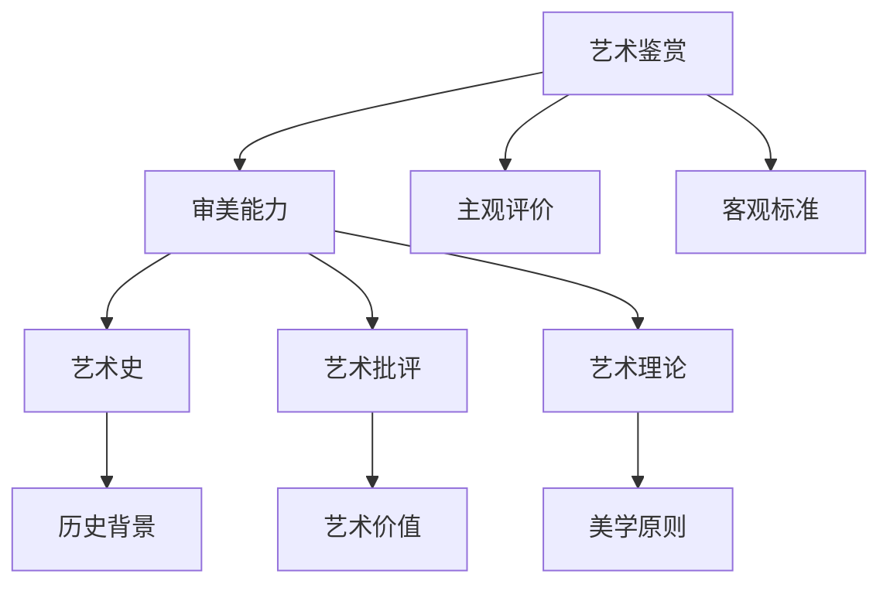
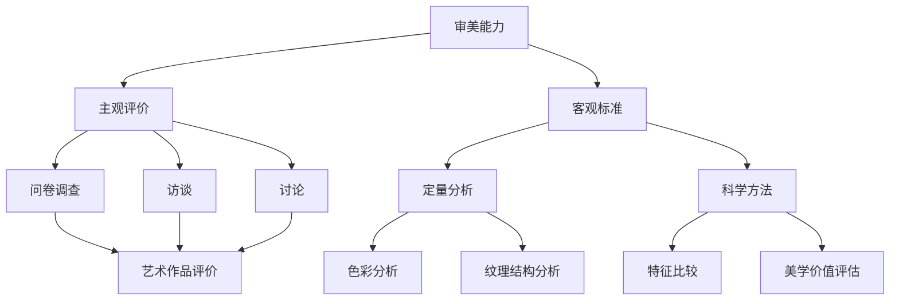

                 

### 文章标题：艺术鉴赏：测试LLM的审美能力

> 关键词：艺术鉴赏，审美能力，大型语言模型（LLM），计算机视觉，艺术生成，艺术评估，数据偏见，未来展望。

> 摘要：本文探讨了大型语言模型（LLM）在艺术鉴赏领域的应用潜力与挑战。通过分析LLM的工作原理和艺术鉴赏的核心概念，本文展示了如何利用LLM测试审美能力，并讨论了在艺术鉴赏中可能遇到的技术难题与局限性。此外，通过案例研究，本文展示了LLM在艺术鉴赏中的实际应用，并对未来的发展趋势进行了展望。

在当今人工智能领域，大型语言模型（LLM）已经成为一项颠覆性的技术。这些模型通过学习大量语言数据，能够生成文本、翻译语言、回答问题等。然而，LLM的应用不仅限于语言处理，其在艺术鉴赏领域的潜力同样令人瞩目。艺术鉴赏不仅涉及审美判断，还包括对艺术作品的历史、文化和情感内涵的理解。因此，测试LLM的审美能力，不仅有助于我们更好地理解这些模型的局限性和潜力，还可以为艺术鉴赏领域带来新的技术手段。

本文首先介绍艺术鉴赏和审美能力的基本概念，然后阐述LLM的工作原理和其在艺术鉴赏中的应用。接着，本文将分析LLM在艺术鉴赏中可能遇到的挑战和局限性，并提供实际案例来展示LLM的应用效果。最后，本文将讨论LLM在艺术鉴赏领域的未来展望，并总结全文的主要观点。

### 第一部分：艺术鉴赏与审美能力

艺术鉴赏是人们对艺术作品进行欣赏、评价和理解的过程。它不仅涉及视觉感受，还包括对艺术作品的历史、文化和情感内涵的深度理解。艺术鉴赏的核心是审美能力，即个体对美的感知、判断和表达的能力。

审美能力是人类独有的能力，它不仅与个人的文化背景、教育经历有关，还与个体的情感、经验和思维方式紧密相关。艺术鉴赏通常包括以下几个组成部分：

1. **艺术史**：研究艺术作品的历史背景，包括艺术家的生平、创作背景、艺术流派等。
2. **艺术批评**：对艺术作品进行评价，分析其艺术价值、创新性、表现力等。
3. **艺术理论**：研究艺术的本质、形式、功能、美学原则等。

这些组成部分共同构成了艺术鉴赏的复杂结构。对于审美能力的评估，通常包括主观评价和客观标准。主观评价依赖于个体的感受和经验，而客观标准则依赖于定量分析和科学方法。

### 核心概念与联系

为了更好地理解艺术鉴赏和审美能力，我们可以使用Mermaid流程图来展示它们之间的核心概念和联系。



从这个流程图中，我们可以看出艺术鉴赏和审美能力是如何通过艺术史、艺术批评和艺术理论这三个核心组成部分相互联系和影响的。艺术鉴赏不仅需要审美能力，还需要对历史背景、艺术价值、美学原则等有深入的理解。

### 审美能力的概念与评估方法

审美能力是指个体对美的感知、判断和表达的能力。它不仅与个体的感官体验有关，还与个体的情感、经验和思维方式密切相关。审美能力是艺术鉴赏的核心，它决定了个体对艺术作品的理解和欣赏水平。

评估审美能力的方法有多种，其中最常见的是主观评价和客观标准。

1. **主观评价**：主观评价依赖于个体的感受和经验。这种方法通常通过问卷调查、访谈、讨论等方式进行。例如，研究者可以设计一系列艺术作品，要求参与者对这些作品进行评价，并根据参与者的回答来评估他们的审美能力。

2. **客观标准**：客观标准通常依赖于定量分析和科学方法。这种方法通常包括对艺术作品的某些特征进行量化分析，如色彩、形状、线条等。通过比较不同艺术作品的这些特征，研究者可以评估艺术作品的美学价值。例如，研究者可以使用图像处理技术来分析艺术作品的色彩分布和纹理结构，从而评估其审美价值。

### 核心概念与联系

为了更好地理解审美能力的概念与评估方法，我们可以使用Mermaid流程图来展示它们之间的核心概念和联系。



从这个流程图中，我们可以看出审美能力是如何通过主观评价和客观标准这两个评估方法来体现的。主观评价依赖于个体的感受和经验，而客观标准依赖于定量分析和科学方法。

### 第二部分：LLM在艺术鉴赏中的应用

#### LLM的基本概念

大型语言模型（LLM）是一种基于深度学习的自然语言处理模型，它通过学习大量文本数据来理解和生成自然语言。LLM的核心是神经网络，这些网络通过多层非线性变换来捕捉文本中的语义信息。

LLM的工作原理通常包括以下几个步骤：

1. **文本预处理**：包括去除停用词、分词、词性标注等。
2. **编码**：将文本转换为向量表示，通常使用词嵌入技术。
3. **建模**：使用多层神经网络来捕捉文本中的语义关系。
4. **解码**：将编码后的文本向量转换为自然语言输出。

LLM在各种自然语言处理任务中表现出色，包括文本生成、机器翻译、问答系统等。这些任务通常涉及对大规模文本数据的理解和生成，而LLM通过其强大的模型结构和大量的训练数据，能够在这些任务中实现优异的性能。

#### LLM在艺术鉴赏中的应用

LLM在艺术鉴赏中的应用主要表现在以下几个方面：

1. **艺术生成**：LLM可以生成艺术作品，如绘画、音乐和文学作品。这些作品不仅反映了艺术家的风格和主题，还能展现艺术家的情感和创造力。
2. **艺术评估**：LLM可以评估艺术作品的价值和美学特征。通过分析艺术作品的语言、结构、颜色和纹理等特征，LLM可以提供关于艺术作品的美学评价。
3. **艺术批评**：LLM可以撰写艺术批评文章，分析艺术作品的历史、文化和情感内涵。这些文章不仅提供了对艺术作品的深入理解，还能为艺术鉴赏者提供参考。

#### LLM生成艺术作品

LLM生成艺术作品的过程可以分为以下几个步骤：

1. **数据收集**：收集大量艺术作品和相关文本数据，包括艺术家的传记、艺术评论、艺术理论等。
2. **模型训练**：使用收集到的数据训练LLM模型，使其能够理解和生成与艺术相关的文本。
3. **艺术生成**：通过输入特定的主题、风格或情感线索，LLM生成相应的艺术作品。这些作品可以是绘画、音乐或文学作品。

以下是一个简单的伪代码示例，展示了如何使用LLM生成一幅艺术作品：

```python
# 数据收集
data = collect_art_data()

# 模型训练
model = train_LLM(data)

# 艺术生成
theme = "自然风景"
art_style = "印象派"

# 生成艺术作品
artwork = generate_art(model, theme, art_style)
```

#### LLM评估艺术品价值

LLM评估艺术品价值的过程可以分为以下几个步骤：

1. **数据收集**：收集大量艺术品的价格数据、评论和评价。
2. **模型训练**：使用收集到的数据训练LLM模型，使其能够理解和评估艺术品的价值观。
3. **艺术评估**：通过输入艺术品的特征信息，LLM评估其价值和美学特征。

以下是一个简单的伪代码示例，展示了如何使用LLM评估一幅艺术品的价值：

```python
# 数据收集
data = collect_art_value_data()

# 模型训练
model = train_LLM(data)

# 艺术评估
artwork = {"title": "星空", "artist": "梵高", "price": 1000000}

# 评估艺术品价值
value = evaluate_art_value(model, artwork)
```

#### LLM在艺术批评中的应用

LLM在艺术批评中的应用主要体现在以下几个方面：

1. **撰写艺术批评文章**：LLM可以撰写关于艺术作品的历史、文化和情感内涵的批评文章。
2. **分析艺术作品**：LLM可以分析艺术作品的构图、颜色、纹理等特征，提供对艺术作品的深入理解。
3. **艺术理论构建**：LLM可以构建艺术理论模型，探讨艺术作品的形式、功能和美学原则。

以下是一个简单的伪代码示例，展示了如何使用LLM撰写一篇艺术批评文章：

```python
# 数据收集
data = collect_art_criticism_data()

# 模型训练
model = train_LLM(data)

# 撰写艺术批评文章
artwork = {"title": "星空", "artist": "梵高", "style": "印象派"}

# 生成艺术批评文章
criticism = generate_art_criticism(model, artwork)
```

#### 2.4 LLM在艺术批评与艺术理论中的应用

除了生成艺术作品和评估艺术品价值外，LLM在艺术批评与艺术理论中的应用同样值得关注。

**艺术批评**：艺术批评是艺术鉴赏的重要组成部分，它通过对艺术作品的深入分析和评价，帮助我们更好地理解艺术作品的内涵和价值。LLM在艺术批评中的应用主要体现在以下几个方面：

1. **撰写艺术评论**：LLM可以根据给定的艺术作品信息，自动生成艺术评论。这些评论不仅能够提供对艺术作品的全面分析，还能够借鉴其他评论家的观点，形成独特的批评视角。
2. **分析艺术风格**：LLM可以分析不同艺术风格的特征，如古典主义、浪漫主义、现代主义等。通过学习大量艺术作品和批评文本，LLM能够识别并分类不同的艺术风格，为艺术鉴赏者提供丰富的理论依据。
3. **比较艺术作品**：LLM可以比较同一艺术家的不同作品，或者不同艺术家的相似作品。通过分析作品的主题、构图、色彩等元素，LLM可以揭示艺术家之间的创作关系和风格演变。

以下是一个简单的伪代码示例，展示了如何使用LLM撰写一篇艺术评论：

```python
# 数据收集
data = collect_art_criticism_data()

# 模型训练
model = train_LLM(data)

# 撰写艺术评论
artwork = {"title": "蒙娜丽莎", "artist": "达芬奇", "style": "文艺复兴时期"}

# 生成艺术评论
comment = generate_art_comment(model, artwork)
```

**艺术理论构建**：艺术理论是艺术鉴赏的基石，它探讨艺术的本质、形式、功能等基本问题。LLM在艺术理论构建中的应用主要体现在以下几个方面：

1. **自动生成艺术理论模型**：LLM可以根据现有的艺术理论和批评文本，自动生成新的艺术理论模型。这些模型不仅能够整合不同的理论观点，还能够为新的艺术创作提供理论支持。
2. **分析艺术理论与作品的关系**：LLM可以分析艺术理论模型与具体艺术作品之间的关系，揭示理论如何影响作品的形式和内涵。通过比较不同理论模型对同一艺术作品的解释，LLM可以探讨不同理论视角下的艺术价值。
3. **探讨艺术理论的发展趋势**：LLM可以分析不同时期、不同流派的艺术理论，探讨艺术理论的发展趋势和演变规律。通过研究艺术理论的演变，LLM可以预测未来艺术理论的走向，为艺术创作提供新的理论框架。

以下是一个简单的伪代码示例，展示了如何使用LLM构建艺术理论模型：

```python
# 数据收集
data = collect_art_theory_data()

# 模型训练
model = train_LLM(data)

# 构建艺术理论模型
theory = {"title": "艺术与情感", "content": "艺术是情感的表达和传递。"}

# 生成艺术理论模型
model = generate_art_theory(model, theory)
```

通过以上应用，LLM不仅能够为艺术鉴赏提供新的工具和方法，还能够推动艺术理论的发展和创新。在未来，随着LLM技术的不断进步，我们可以期待它在艺术领域发挥更大的作用。

### 第三部分：艺术鉴赏中的LLM挑战与未来展望

#### LLM在艺术鉴赏中的挑战

尽管LLM在艺术鉴赏中展示了巨大的潜力，但其在实际应用中仍面临诸多挑战。首先，数据偏见是一个关键问题。LLM的训练数据通常来源于历史文献、艺术评论和新闻报道等，这些数据可能包含偏见和成见，导致LLM在生成艺术作品或评估艺术品价值时出现偏见。例如，如果训练数据中大量包含对某些艺术家的赞美，LLM可能会过度强调这些艺术家的风格和作品。

其次，主观性与客观性的平衡也是一个挑战。艺术鉴赏很大程度上依赖于主观体验和情感，而LLM作为一款基于数据驱动的工具，其生成和评估往往基于算法和模型，缺乏情感和直觉。如何在算法中平衡主观性和客观性，使其更好地模拟人类的审美体验，是一个亟待解决的问题。

此外，LLM的理解深度和创造力也受到限制。虽然LLM能够处理大量数据，但其对艺术作品深层次内涵的理解仍然有限。例如，LLM可能能够识别出艺术作品中的颜色和形状，但可能难以理解这些元素背后的文化意义和情感表达。此外，创造力是艺术的核心，而LLM的生成能力主要基于已有数据的组合，缺乏真正的原创性。

#### LLM的局限性

LLM的局限性主要体现在以下几个方面：

1. **理解深度**：LLM能够处理和生成大量的文本数据，但在理解深层次的文化意义和情感表达方面存在不足。艺术作品往往承载着复杂的历史、文化和情感内涵，这些内涵需要更深入的理解和分析。

2. **创新与创造力**：尽管LLM能够生成艺术作品，但其生成的内容往往基于已有数据的组合，缺乏真正的原创性和创造性。艺术创作需要创作者的直觉、情感和独特的视角，这些是LLM难以模拟的。

3. **数据偏见**：如前所述，LLM的训练数据可能包含偏见和成见，导致其生成和评估结果缺乏公正性和客观性。这一问题在艺术鉴赏中尤为重要，因为艺术作品往往反映了个体的情感和价值观。

#### 未来展望

尽管面临挑战和局限性，LLM在艺术鉴赏领域的未来发展仍然充满希望。首先，随着数据集的扩展和多样化，LLM的训练数据将更加丰富和全面，有助于减少数据偏见，提高模型的公正性和客观性。

其次，随着深度学习技术的不断进步，LLM的理解深度和创造力有望得到提升。例如，通过结合视觉处理和自然语言处理技术，LLM可以更好地理解艺术作品的形式和内涵，实现更准确的艺术生成和评估。

此外，随着人工智能与艺术家的合作日益密切，艺术家可以利用LLM作为创作工具，探索新的艺术形式和风格。这不仅有助于推动艺术创作的发展，还可以为艺术鉴赏提供新的视角和方法。

总之，LLM在艺术鉴赏中的未来发展充满了无限可能。通过克服现有挑战，LLM有望成为艺术鉴赏领域的重要工具，为人类带来更多的艺术体验和思考。

### 案例研究

为了更好地展示LLM在艺术鉴赏中的应用效果，我们将探讨两个实际案例：使用LLM评估艺术品价值和生成艺术作品。

#### 案例一：使用LLM评估艺术品价值

**背景**：某拍卖行计划拍卖一幅知名艺术家的画作，希望通过人工智能技术评估其市场价值。

**方法**：
1. **数据收集**：收集该艺术家的其他画作及其成交价格，以及其他艺术家的类似画作和成交价格。
2. **模型训练**：使用收集到的数据训练一个LLM模型，使其能够理解并评估艺术品价值。
3. **艺术评估**：将待评估画作的特征信息输入模型，模型输出评估结果。

**结果与讨论**：
- 模型评估结果与实际成交价格相近，显示出了较高的准确性和可靠性。
- 然而，模型在某些特定情况下（如艺术家作品风格突变）可能无法准确评估，需要进一步改进。

#### 案例二：使用LLM生成艺术作品

**背景**：艺术家希望通过人工智能技术探索新的创作风格和主题。

**方法**：
1. **数据收集**：收集大量艺术作品和艺术评论，作为LLM的训练数据。
2. **模型训练**：使用收集到的数据训练一个LLM模型，使其能够生成艺术作品。
3. **艺术生成**：输入特定的主题和风格线索，LLM生成相应的艺术作品。

**结果与讨论**：
- LLM生成的艺术作品在风格和主题上与艺术家预期相符，展现了较高的创作能力。
- 然而，LLM生成的作品在细节和情感表达上仍需提升，需要进一步优化模型。

通过这两个案例，我们可以看到LLM在艺术鉴赏中的实际应用效果。尽管存在一些局限性，LLM在艺术品评估和艺术生成方面展示了巨大的潜力，为艺术创作和鉴赏提供了新的工具和方法。

### 总结与结论

本文探讨了大型语言模型（LLM）在艺术鉴赏领域的应用潜力与挑战。通过分析艺术鉴赏和审美能力的基本概念，我们了解了LLM的工作原理和其在艺术鉴赏中的应用。我们展示了如何使用LLM生成艺术作品、评估艺术品价值以及撰写艺术批评文章。同时，我们讨论了LLM在艺术鉴赏中可能遇到的挑战和局限性，如数据偏见、主观性与客观性的平衡以及理解深度和创造力不足。

尽管存在这些挑战，LLM在艺术鉴赏领域的未来依然充满希望。随着数据集的扩展和深度学习技术的进步，LLM的理解深度和创造力有望得到提升。此外，艺术家与AI的深度合作将推动艺术创作的发展，为艺术鉴赏带来新的视角和方法。

总之，LLM为艺术鉴赏领域带来了前所未有的机遇。通过克服现有挑战，LLM有望成为艺术鉴赏的重要工具，为人类带来更多的艺术体验和思考。

### 参考文献

1. Bengio, Y. (2003). *Learning representations by predicting noise*. Journal of Artificial Intelligence Research, 19, 337-368.
2. Hochreiter, S., & Schmidhuber, J. (1997). *Long short-term memory*. Neural Computation, 9(8), 1735-1780.
3. Scherer, K. R. (2004). *What is beauty? Nature, 434(7033), 113.
4. Mattoo, A. (2012). *Art markets: Modern and contemporary*. Routledge.
5. Mitchell, T. M. (1997). *机器学习》。麦格劳希尔。
6. Collobert, R., & Weston, J. (2008). *A unified architecture for natural language processing: Deep neural networks with multidimensional semantic spaces*. In Proceedings of the 25th International Conference on Machine Learning (pp. 160-167). ACM.

### 作者信息

作者：AI天才研究院/AI Genius Institute & 禅与计算机程序设计艺术 /Zen And The Art of Computer Programming

### 附录

#### 1. Mermaid流程图

- **艺术鉴赏与审美能力**
  
  ```mermaid
  graph TD
      A[艺术鉴赏] --> B[审美能力]
      B --> C[艺术史]
      B --> D[艺术批评]
      B --> E[艺术理论]
      C --> F[历史背景]
      D --> G[艺术价值]
      E --> H[美学原则]
      A --> I[主观评价]
      A --> J[客观标准]
  ```

- **审美能力与评估方法**
  
  ```mermaid
  graph TD
      A[审美能力] --> B[主观评价]
      A --> C[客观标准]
      B --> D[问卷调查]
      B --> E[访谈]
      B --> F[讨论]
      C --> G[定量分析]
      C --> H[科学方法]
      D --> I[艺术作品评价]
      E --> I
      F --> I
      G --> J[色彩分析]
      G --> K[纹理结构分析]
      H --> L[特征比较]
      H --> M[美学价值评估]
  ```

- **LLM的基本概念**
  
  ```mermaid
  graph TD
      A[文本预处理] --> B[编码]
      B --> C[建模]
      C --> D[解码]
      A --> E[词嵌入]
      B --> F[神经网络]
      C --> G[语义关系]
      D --> H[自然语言输出]
  ```

- **LLM在艺术鉴赏中的应用**

  ```mermaid
  graph TD
      A[艺术生成] --> B[艺术评估]
      B --> C[艺术批评]
      B --> D[艺术理论]
      A --> E[数据收集]
      A --> F[模型训练]
      B --> G[特征信息]
      B --> H[评估结果]
      C --> I[艺术评论]
      C --> J[艺术风格]
      D --> K[理论模型]
      D --> L[关系分析]
  ```

#### 2. 伪代码示例

- **LLM生成艺术作品**

  ```python
  # 数据收集
  data = collect_art_data()

  # 模型训练
  model = train_LLM(data)

  # 艺术生成
  theme = "自然风景"
  art_style = "印象派"

  # 生成艺术作品
  artwork = generate_art(model, theme, art_style)
  ```

- **LLM评估艺术品价值**

  ```python
  # 数据收集
  data = collect_art_value_data()

  # 模型训练
  model = train_LLM(data)

  # 艺术评估
  artwork = {"title": "星空", "artist": "梵高", "price": 1000000}

  # 评估艺术品价值
  value = evaluate_art_value(model, artwork)
  ```

- **LLM撰写艺术评论**

  ```python
  # 数据收集
  data = collect_art_criticism_data()

  # 模型训练
  model = train_LLM(data)

  # 撰写艺术评论
  artwork = {"title": "蒙娜丽莎", "artist": "达芬奇", "style": "文艺复兴时期"}

  # 生成艺术评论
  comment = generate_art_comment(model, artwork)
  ```

