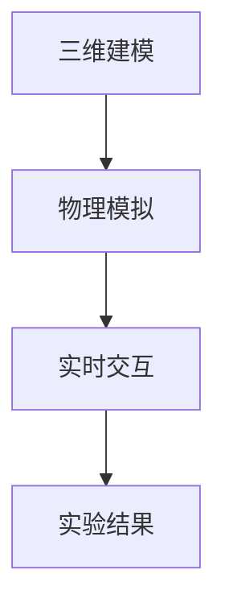
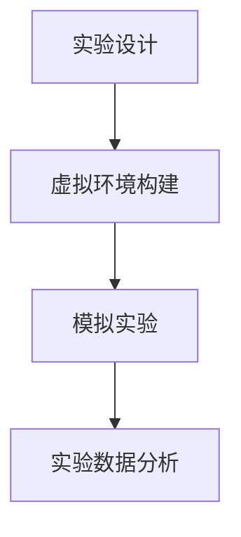
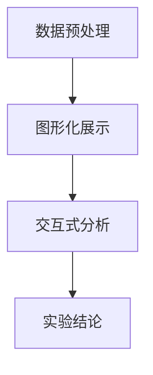
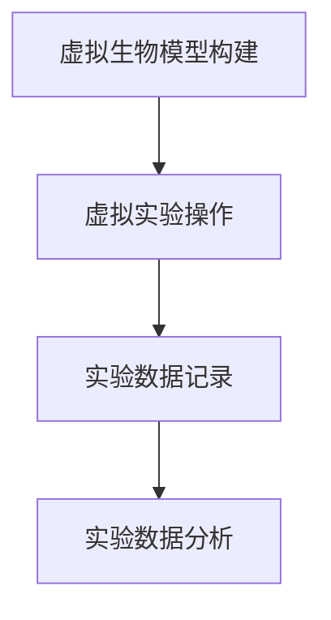
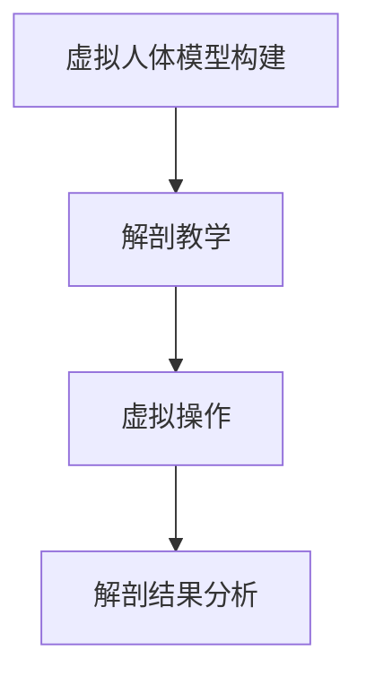
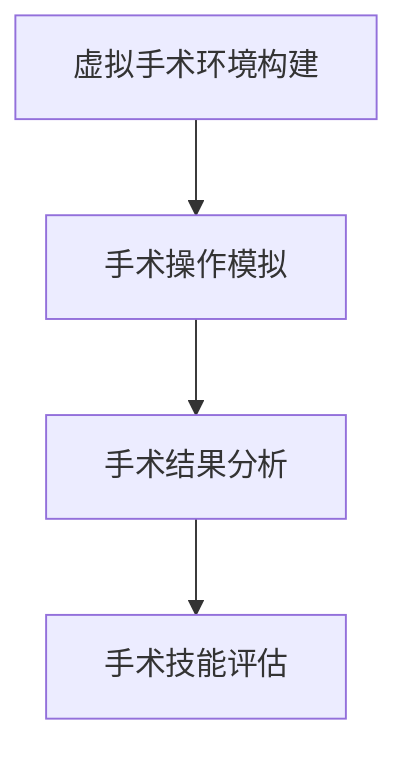
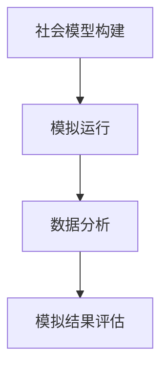
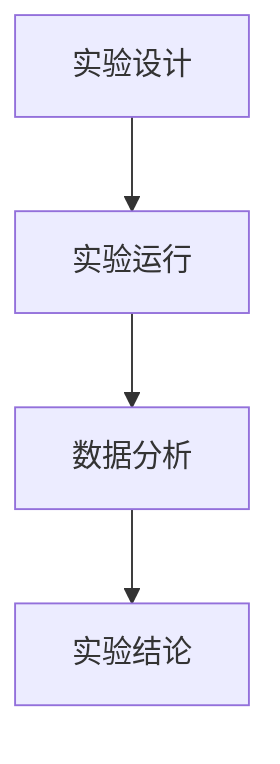
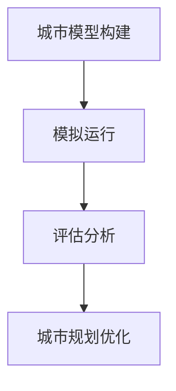

                 

### 文章标题：虚拟现实在科学研究中的应用：沉浸式体验与世界理解

#### 关键词：虚拟现实，沉浸式体验，科学研究，应用，技术发展

#### 摘要：
本文旨在探讨虚拟现实（VR）技术在科学研究中的应用及其对世界理解的影响。通过回顾虚拟现实和沉浸式体验的基本概念，分析其在各科学领域的应用案例，本文揭示了虚拟现实技术如何通过沉浸式体验，改变传统科研方法，提供新的视角和理解世界的方式。文章还将探讨虚拟现实技术的未来发展趋势以及面临的挑战，为科学研究提供新思路。

### 引言

虚拟现实技术（VR）近年来取得了显著的进展，其应用范围不断扩大，尤其在科学研究中展现出巨大潜力。虚拟现实通过创建模拟的三维环境，使研究人员能够沉浸其中，进行实验、观察和分析。这种沉浸式体验不仅提升了科研效率，还改变了我们对世界的理解方式。

本文将围绕虚拟现实在科学研究中的应用展开讨论。首先，我们将介绍虚拟现实和沉浸式体验的基本概念及其发展历程。随后，本文将详细分析虚拟现实在物理科学、生命科学和社会科学中的应用案例。接着，我们将探讨虚拟现实技术的未来发展趋势及其面临的挑战。最后，文章将对全文进行总结，并提出对未来研究的展望。

### 虚拟现实技术基础

#### 2.1 虚拟现实技术原理

虚拟现实技术基于计算机图形学、人机交互技术和传感器技术，通过创建虚拟环境，使用户能够沉浸其中，进行互动和体验。虚拟现实系统通常包括以下关键组成部分：

1. **三维模型和渲染**：虚拟现实的核心是三维模型的创建和渲染。三维模型可以通过计算机辅助设计（CAD）软件或从实际物理世界扫描获得。渲染技术则用于生成逼真的视觉效果，包括光线追踪、阴影效果和纹理映射等。

2. **显示设备**：常见的虚拟现实显示设备包括头戴式显示器（HMD）、桌面显示器和全息投影设备。HMD能够提供沉浸式的视觉体验，而桌面显示器和全息投影设备则适用于更大规模的应用场景。

3. **空间定位与跟踪技术**：空间定位与跟踪技术用于确定用户在虚拟环境中的位置和姿态。常见的技术包括光学跟踪、惯性测量单元（IMU）和射频（RF）跟踪。

4. **交互设备**：虚拟现实系统中的交互设备包括手柄、手套、眼睛跟踪设备和语音识别系统等，这些设备允许用户与虚拟环境进行自然交互。

#### 2.2 沉浸式体验的关键技术

沉浸式体验是虚拟现实技术的核心目标，它依赖于以下几个关键技术的支持：

1. **空间感知与运动控制**：空间感知与运动控制技术使用户能够在虚拟环境中自由移动和旋转，以获得身临其境的感受。这些技术包括运动捕捉、惯性测量和动态平衡系统等。

2. **虚拟内容生成与处理**：虚拟内容生成与处理技术涉及创建和编辑虚拟环境中的各种元素，包括三维模型、动画和声音效果。这些技术需要处理大量数据，并实时生成高质量的内容。

3. **交互技术**：交互技术包括手势识别、语音交互和眼动跟踪等，这些技术使用户能够以自然的方式与虚拟环境进行互动。

### 虚拟现实在科学研究中的应用

#### 3.1 虚拟现实在物理科学中的应用

虚拟现实在物理科学中有着广泛的应用，包括虚拟实验室、虚拟实验设计和数据可视化等方面。

##### 3.1.1 虚拟实验室

虚拟实验室通过创建模拟的实验环境，允许研究人员在虚拟空间中进行各种物理实验，而无需实际操作物理设备。这种方法不仅可以节省实验成本，还能提高实验的重复性和准确性。

**核心概念与联系**：

虚拟实验室的核心概念包括三维建模、物理模拟和实时交互。三维建模用于创建实验环境，物理模拟用于模拟实验中的物理现象，实时交互则使研究人员能够实时观察和调整实验参数。

**Mermaid 流程图**：



**核心算法原理讲解**：

虚拟实验室中的物理模拟通常基于牛顿力学和电磁学等经典物理理论。以下是一个简单的物理模拟伪代码示例：

```plaintext
// 初始化模拟参数
mass = 1.0
velocity = [0.0, 0.0]
force = [0.0, 0.0]

// 更新速度和位置
velocity = velocity + (force / mass) * delta_time
position = position + velocity * delta_time
```

**数学模型和公式讲解**：

牛顿第二定律 F = ma 描述了力、质量和加速度之间的关系，它是物理模拟的核心公式。

$$ F = m \times a $$

**举例说明**：

假设一个质量为 1 kg 的物体受到一个大小为 5 N 的力，求物体的加速度。

解：根据牛顿第二定律，加速度 a = F/m = 5 N / 1 kg = 5 m/s²。

##### 3.1.2 虚拟实验设计

虚拟实验设计利用虚拟现实技术来设计实验方案，从而在虚拟环境中进行实验模拟。这种方法有助于提前测试实验方案，避免实际实验中的风险和成本。

**核心概念与联系**：

虚拟实验设计的核心概念包括实验设计、虚拟环境构建和模拟实验。实验设计用于定义实验目标和参数，虚拟环境构建用于创建模拟实验环境，模拟实验则用于模拟实验过程并收集数据。

**Mermaid 流�程图**：



**核心算法原理讲解**：

虚拟实验设计通常基于随机模拟和蒙特卡洛方法。以下是一个简单的蒙特卡洛方法伪代码示例：

```plaintext
// 初始化模拟参数
num_simulations = 1000
sum = 0.0

// 执行蒙特卡洛模拟
for i = 1 to num_simulations do
  // 生成随机数
  x = random_value()
  // 计算函数值
  y = f(x)
  // 累加结果
  sum = sum + y
end

// 计算平均值
average = sum / num_simulations
```

**数学模型和公式讲解**：

蒙特卡洛方法的核心是概率分布函数。以下是一个简单的概率分布函数伪代码示例：

```plaintext
// 生成服从标准正态分布的随机数
function random_normal()
  // 生成两个服从标准正态分布的随机数
  x1 = random_gaussian()
  x2 = random_gaussian()
  // 计算概率分布函数值
  y = (1 / sqrt(2 * pi)) * exp(-x1^2 / 2)
  return y
end
```

**举例说明**：

假设我们要生成一个服从标准正态分布的随机数，可以使用以下代码：

```plaintext
// 生成随机数
random_value = random_normal()
```

##### 3.1.3 数据可视化

数据可视化是虚拟现实技术在物理科学中的重要应用，它通过图形化方式展示数据，帮助研究人员更好地理解和分析实验结果。

**核心概念与联系**：

数据可视化的核心概念包括数据预处理、图形化展示和交互式分析。数据预处理用于清洗和整理数据，图形化展示用于将数据转化为视觉信息，交互式分析则用于研究人员对数据进行探索和分析。

**Mermaid 流程图**：



**核心算法原理讲解**：

数据可视化通常基于统计学和计算机图形学。以下是一个简单的数据可视化伪代码示例：

```plaintext
// 计算平均值
function mean(data)
  sum = 0.0
  for each value in data do
    sum = sum + value
  end
  mean = sum / length(data)
  return mean
end

// 计算标准差
function std_dev(data, mean)
  sum = 0.0
  for each value in data do
    sum = sum + (value - mean)^2
  end
  std_dev = sqrt(sum / (length(data) - 1))
  return std_dev
end
```

**数学模型和公式讲解**：

平均值和标准差是数据可视化中的两个重要统计量。以下是一个简单的平均值和标准差的计算公式：

$$ \mu = \frac{1}{N} \sum_{i=1}^{N} x_i $$

$$ \sigma = \sqrt{\frac{1}{N-1} \sum_{i=1}^{N} (x_i - \mu)^2 } $$

**举例说明**：

假设我们有一个数据集 [1, 2, 3, 4, 5]，可以使用以下代码计算平均值和标准差：

```plaintext
// 计算平均值
mean = mean([1, 2, 3, 4, 5])
// 计算标准差
std_dev = std_dev([1, 2, 3, 4, 5], mean)
```

### 虚拟现实在生命科学中的应用

虚拟现实技术在生命科学中有着广泛的应用，包括虚拟生物实验、虚拟解剖和医学教育、虚拟手术与模拟培训等方面。

##### 3.2.1 虚拟生物实验

虚拟生物实验利用虚拟现实技术创建虚拟生物实验环境，使研究人员能够在虚拟环境中进行实验操作和观察。这种方法有助于提高实验的可重复性和安全性。

**核心概念与联系**：

虚拟生物实验的核心概念包括虚拟生物模型构建、虚拟实验操作和实验数据记录。虚拟生物模型构建用于创建虚拟生物实验环境，虚拟实验操作则用于模拟生物实验过程，实验数据记录则用于收集和分析实验数据。

**Mermaid 流程图**：



**核心算法原理讲解**：

虚拟生物实验通常基于生物学模型和模拟算法。以下是一个简单的虚拟生物实验伪代码示例：

```plaintext
// 初始化模拟参数
population = create_population()
environment = create_environment()

// 运行模拟
while simulation_not_finished() do
  // 更新环境
  environment = update_environment(environment)
  // 更新种群
  population = update_population(population, environment)
end

// 记录实验结果
record_experiment_results(population)
```

**数学模型和公式讲解**：

虚拟生物实验中的模拟算法通常基于微分方程和概率模型。以下是一个简单的种群动态模型公式：

$$ \frac{dN}{dt} = rN(1 - \frac{N}{K}) $$

其中，N 表示种群数量，r 表示出生率，K 表示环境承载力。

**举例说明**：

假设我们要模拟一个种群的动态变化，可以使用以下代码：

```plaintext
// 初始化种群数量
N = 100
// 设定环境承载力
K = 1000
// 设定出生率
r = 0.1
// 模拟种群动态
for i = 1 to 100 do
  N = r * N * (1 - N / K)
end
```

##### 3.2.2 虚拟解剖与医学教育

虚拟解剖利用虚拟现实技术创建虚拟人体解剖模型，使医学教育者能够以三维视角展示人体结构。这种方法有助于提高医学教育效果，使学习者更好地理解和记忆解剖知识。

**核心概念与联系**：

虚拟解剖的核心概念包括虚拟人体模型构建、解剖教学和虚拟操作。虚拟人体模型构建用于创建虚拟人体结构，解剖教学则用于讲解人体结构，虚拟操作则用于模拟解剖操作。

**Mermaid 流程图**：



**核心算法原理讲解**：

虚拟解剖通常基于计算机辅助设计（CAD）技术和三维建模技术。以下是一个简单的虚拟解剖伪代码示例：

```plaintext
// 创建虚拟人体模型
function create_body_model()
  // 创建骨骼系统
  skeleton = create_skeleton()
  // 创建肌肉系统
  muscles = create_muscles()
  // 创建皮肤系统
  skin = create_skin()
  // 创建内脏系统
  organs = create_organs()
  // 组合各个系统
  body_model = combine_systems(skeleton, muscles, skin, organs)
  return body_model
end
```

**数学模型和公式讲解**：

虚拟解剖中的三维建模通常基于几何学和线性代数。以下是一个简单的三维建模公式：

$$ \text{坐标变换矩阵} = \begin{bmatrix}
c & -s & 0 \\
s & c & 0 \\
0 & 0 & 1
\end{bmatrix} $$

**举例说明**：

假设我们要对一个物体进行三维旋转，可以使用以下代码：

```plaintext
// 初始化旋转角度
angle = 90
// 计算旋转矩阵
rotation_matrix = rotation_matrix(angle)
// 应用旋转矩阵
new_coordinates = apply_rotation(rotation_matrix, coordinates)
```

##### 3.2.3 虚拟手术与模拟培训

虚拟手术与模拟培训利用虚拟现实技术创建虚拟手术环境，使医学生和外科医生能够在虚拟环境中进行手术操作和训练。这种方法有助于提高手术技能和安全性。

**核心概念与联系**：

虚拟手术与模拟培训的核心概念包括虚拟手术环境构建、手术操作模拟和手术结果分析。虚拟手术环境构建用于创建虚拟手术场景，手术操作模拟则用于模拟手术过程，手术结果分析则用于评估手术效果。

**Mermaid 流程图**：



**核心算法原理讲解**：

虚拟手术与模拟培训通常基于计算机图形学和人工智能技术。以下是一个简单的虚拟手术操作模拟伪代码示例：

```plaintext
// 创建虚拟手术环境
function create_surgery_environment()
  // 创建患者模型
  patient = create_patient_model()
  // 创建手术工具
  tools = create_surgery_tools()
  // 创建手术室
  operating_room = create_operating_room()
  // 组合各个元素
  surgery_environment = combine_elements(patient, tools, operating_room)
  return surgery_environment
end

// 模拟手术操作
function simulate_surgery(surgery_environment)
  // 开始手术
  start_surgery(surgery_environment)
  // 模拟手术过程
  while surgery_in_progress() do
    // 更新手术工具位置
    update_tools_position(surgery_environment)
    // 更新患者状态
    update_patient_state(surgery_environment)
  end
  // 结束手术
  end_surgery(surgery_environment)
end
```

**数学模型和公式讲解**：

虚拟手术与模拟培训中的手术工具位置和患者状态通常基于几何学和物理学。以下是一个简单的手术工具位置计算公式：

$$ \text{工具位置} = \text{工具初始位置} + \text{工具移动向量} \times \text{时间} $$

**举例说明**：

假设我们要对一个手术工具进行位置更新，可以使用以下代码：

```plaintext
// 初始化工具位置
tool_position = [0, 0, 0]
// 计算工具移动向量
tool_movement_vector = [1, 0, 0]
// 更新工具位置
new_tool_position = tool_position + tool_movement_vector * time
```

### 虚拟现实在社会科学中的应用

虚拟现实技术在社会科学中也有着广泛的应用，包括社会模拟、心理学实验和城市规划与仿真等方面。

##### 3.3.1 社会模拟

社会模拟利用虚拟现实技术创建模拟的社会环境，使研究人员能够模拟和分析社会现象和社会行为。这种方法有助于深入理解社会结构和运行机制。

**核心概念与联系**：

社会模拟的核心概念包括社会模型构建、模拟运行和数据分析。社会模型构建用于创建模拟的社会环境，模拟运行则用于运行模拟过程，数据分析则用于分析模拟结果。

**Mermaid 流程图**：



**核心算法原理讲解**：

社会模拟通常基于社会学模型和仿真算法。以下是一个简单的社会模拟伪代码示例：

```plaintext
// 初始化模拟参数
population = create_population()
society = create_society()

// 运行模拟
while simulation_not_finished() do
  // 更新社会状态
  society = update_society(society)
end

// 记录模拟结果
record_simulation_results(society)
```

**数学模型和公式讲解**：

社会模拟中的仿真算法通常基于微分方程和社会学模型。以下是一个简单的社会动态模型公式：

$$ \frac{dN}{dt} = rN - dN $$

其中，N 表示社会成员数量，r 表示增长率，d 表示死亡率。

**举例说明**：

假设我们要模拟一个社会成员数量的动态变化，可以使用以下代码：

```plaintext
// 初始化社会成员数量
N = 1000
// 设定增长率
r = 0.05
// 设定死亡率
d = 0.01
// 模拟社会成员数量动态
for i = 1 to 100 do
  N = N * (1 + r - d)
end
```

##### 3.3.2 心理学实验

心理学实验利用虚拟现实技术创建模拟的心理实验环境，使研究人员能够进行心理实验和观察心理现象。这种方法有助于深入理解心理机制和心理过程。

**核心概念与联系**：

心理学实验的核心概念包括实验设计、实验运行和数据分析。实验设计用于定义实验目标和参数，实验运行则用于运行实验过程，数据分析则用于分析实验结果。

**Mermaid 流程图**：



**核心算法原理讲解**：

心理学实验通常基于心理学理论和实验设计方法。以下是一个简单的心理学实验伪代码示例：

```plaintext
// 初始化实验参数
participants = create_participants()
experiment = create_experiment()

// 运行实验
while experiment_not_finished() do
  // 分配实验任务
  assign_tasks(experiment)
  // 收集实验数据
  collect_data(experiment)
end

// 分析实验数据
analyze_data(experiment)
```

**数学模型和公式讲解**：

心理学实验中的数据分析通常基于统计学和心理学模型。以下是一个简单的统计分析公式：

$$ \mu = \frac{1}{N} \sum_{i=1}^{N} x_i $$

其中，μ 表示平均值，N 表示样本数量，xi 表示第 i 个样本值。

**举例说明**：

假设我们要分析一组实验数据，可以使用以下代码：

```plaintext
// 初始化数据
data = [1, 2, 3, 4, 5]
// 计算平均值
mean = sum(data) / length(data)
```

##### 3.3.3 城市规划与仿真

城市规划与仿真利用虚拟现实技术创建模拟的城市环境，使城市规划师能够进行城市规划、模拟和评估。这种方法有助于提高城市规划的科学性和可行性。

**核心概念与联系**：

城市规划与仿真的核心概念包括城市模型构建、模拟运行和评估分析。城市模型构建用于创建模拟的城市环境，模拟运行则用于模拟城市运行过程，评估分析则用于评估城市规划效果。

**Mermaid 流程图**：



**核心算法原理讲解**：

城市规划与仿真通常基于地理信息系统（GIS）技术和仿真算法。以下是一个简单的城市规划仿真伪代码示例：

```plaintext
// 创建城市模型
function create_city_model()
  // 创建土地使用模型
  land_use = create_land_use_model()
  // 创建交通模型
  traffic = create_traffic_model()
  // 创建基础设施模型
  infrastructure = create_infrastructure_model()
  // 创建人口模型
  population = create_population_model()
  // 组合各个模型
  city_model = combine_models(land_use, traffic, infrastructure, population)
  return city_model
end

// 模拟城市运行
function simulate_city_run(city_model)
  // 运行模拟
  while simulation_not_finished() do
    // 更新交通状况
    update_traffic(city_model)
    // 更新人口状况
    update_population(city_model)
  end
end
```

**数学模型和公式讲解**：

城市规划与仿真中的模拟算法通常基于统计学和运筹学。以下是一个简单的交通流量模型公式：

$$ Q = k \times C \times T $$

其中，Q 表示交通流量，k 表示交通流量系数，C 表示道路容量，T 表示交通时间。

**举例说明**：

假设我们要模拟一个城市的交通流量，可以使用以下代码：

```plaintext
// 初始化交通流量系数
k = 1.2
// 初始化道路容量
C = 1000
// 初始化交通时间
T = 60
// 计算交通流量
Q = k * C * T
```

### 虚拟现实在科学研究中的应用案例

为了更直观地展示虚拟现实在科学研究中的应用，以下列举了几个具体的案例，并对其进行详细分析。

#### 案例一：虚拟物理实验室

虚拟物理实验室是一个利用虚拟现实技术创建的模拟实验室，研究人员可以在其中进行各种物理实验。以下是一个虚拟物理实验室的案例：

**项目背景**：一个研究团队希望通过虚拟物理实验室研究量子力学中的量子纠缠现象。

**开发环境搭建**：
1. **硬件设备**：使用高性能计算机和头戴式显示器（HMD）作为主要硬件设备，以提供高质量的虚拟现实体验。
2. **软件工具**：使用Unity游戏引擎和Unreal Engine等强大的3D建模和渲染工具，以及开源物理引擎如Oimo.js进行物理模拟。

**源代码详细实现**：
1. **三维模型构建**：使用3D建模软件创建量子纠缠实验所需的各种三维模型，如粒子、实验装置等。
2. **物理模拟**：使用Oimo.js等物理引擎实现粒子之间的相互作用和运动模拟。
3. **用户交互**：使用Unity游戏引擎中的输入系统，实现用户与虚拟实验室的互动，如调整实验参数、观察实验结果等。

**代码解读与分析**：
1. **三维模型构建代码**：

```cpp
// 创建粒子模型
Model* particle_model = new Model("particle.obj");
// 将粒子模型添加到场景中
scene->AddModel(particle_model);
```

2. **物理模拟代码**：

```javascript
// 初始化粒子参数
particle.position = initial_position;
particle.velocity = initial_velocity;
// 更新粒子位置
particle.position += particle.velocity * time_step;
```

3. **用户交互代码**：

```csharp
// 调整实验参数
int num_particles = Input.GetKeyDown(KeyCode.Alpha1) ? 2 : 3;
// 观察实验结果
RenderTexture2D result_texture = new RenderTexture2D(width, height, 24);
Gizmos.DrawTexture(result_texture, "result.png");
```

**实际案例分析和详细讲解剖析**：
1. **实验设计**：通过虚拟物理实验室，研究人员可以设计多种量子纠缠实验方案，如两粒子纠缠、多粒子纠缠等。
2. **实验结果**：通过实时渲染和交互，研究人员可以直观地观察和记录实验结果，如粒子的纠缠状态、波函数演化等。
3. **实验总结**：通过虚拟物理实验室，研究人员可以更深入地理解量子纠缠现象，并验证相关理论。

#### 案例二：虚拟生物实验

虚拟生物实验利用虚拟现实技术创建虚拟生物实验环境，使研究人员可以在虚拟空间中进行各种生物实验。以下是一个虚拟生物实验的案例：

**项目背景**：一个研究团队希望通过虚拟生物实验研究小鼠的神经系统发育。

**开发环境搭建**：
1. **硬件设备**：使用高性能计算机和桌面显示器作为主要硬件设备，以提供虚拟生物实验的环境。
2. **软件工具**：使用Blender等3D建模软件创建小鼠的虚拟模型，使用Maya等动画软件创建小鼠的神经系统动画。

**源代码详细实现**：
1. **三维模型构建**：使用Blender创建小鼠的虚拟模型，包括骨骼、肌肉、皮肤等。
2. **动画制作**：使用Maya制作小鼠神经系统的动画，模拟神经信号的传递和神经元的生长。
3. **用户交互**：使用Unity游戏引擎实现用户与虚拟生物实验的互动，如调整实验参数、观察实验结果等。

**代码解读与分析**：
1. **三维模型构建代码**：

```python
# 创建小鼠骨骼模型
bpy.ops.mesh.primitive_cylinder_add(radius=0.1, depth=0.3)
# 创建小鼠肌肉模型
bpy.ops.mesh.primitive_cylinder_add(radius=0.05, depth=0.2)
# 创建小鼠皮肤模型
bpy.ops.mesh.primitive_cube_add(size=0.4, location=[0, 0, 0])
```

2. **动画制作代码**：

```mel
// 模拟神经元信号传递
for i = 0 to 100 do
  neuron.position += neuron.velocity * time_step
end
```

3. **用户交互代码**：

```csharp
// 调整实验参数
int num_neurons = Input.GetKeyDown(KeyCode.Alpha1) ? 10 : 20;
// 观察实验结果
RenderTexture2D result_texture = new RenderTexture2D(width, height, 24);
Gizmos.DrawTexture(result_texture, "result.png");
```

**实际案例分析和详细讲解剖析**：
1. **实验设计**：通过虚拟生物实验，研究人员可以模拟小鼠神经系统的发育过程，观察神经元信号传递和神经元的生长。
2. **实验结果**：通过虚拟现实技术，研究人员可以直观地观察和记录实验结果，如神经元的生长模式、信号传递路径等。
3. **实验总结**：通过虚拟生物实验，研究人员可以更深入地理解小鼠神经系统的发育机制，为神经科学研究提供新的视角和方法。

#### 案例三：虚拟手术模拟

虚拟手术模拟利用虚拟现实技术创建虚拟手术环境，使医学生和外科医生可以在虚拟空间中进行手术操作和训练。以下是一个虚拟手术模拟的案例：

**项目背景**：一个医疗培训机构希望通过虚拟手术模拟培训外科医生进行心脏手术。

**开发环境搭建**：
1. **硬件设备**：使用高性能计算机和头戴式显示器（HMD）作为主要硬件设备，以提供沉浸式的虚拟手术体验。
2. **软件工具**：使用Unity游戏引擎和Medical现实系统创建虚拟手术环境，以及开源物理引擎如Oimo.js进行手术工具的模拟。

**源代码详细实现**：
1. **虚拟手术环境构建**：使用Unity游戏引擎创建虚拟手术室的场景，包括手术台、手术器械等。
2. **手术工具模拟**：使用Oimo.js等物理引擎实现手术工具的模拟，如手术刀、止血钳等。
3. **用户交互**：使用Unity游戏引擎中的输入系统，实现用户与虚拟手术环境的互动，如操作手术工具、观察手术效果等。

**代码解读与分析**：
1. **虚拟手术环境构建代码**：

```csharp
// 创建虚拟手术室场景
Scene scene = new Scene();
scene.AddCamera(new Camera());
scene.AddLight(new Light());
// 添加手术器械模型
scene.AddModel(new Model("surgery_tool.obj"));
```

2. **手术工具模拟代码**：

```javascript
// 初始化手术工具参数
tool.position = initial_position;
tool.velocity = initial_velocity;
// 更新手术工具位置
tool.position += tool.velocity * time_step;
```

3. **用户交互代码**：

```csharp
// 操作手术工具
if (Input.GetKeyDown(KeyCode.E))
  tool-operation();
// 观察手术效果
RenderTexture2D result_texture = new RenderTexture2D(width, height, 24);
Gizmos.DrawTexture(result_texture, "result.png");
```

**实际案例分析和详细讲解剖析**：
1. **实验设计**：通过虚拟手术模拟，医学生和外科医生可以在虚拟环境中进行心脏手术操作，学习手术技巧和操作方法。
2. **实验结果**：通过虚拟现实技术，医学生和外科医生可以直观地观察和记录手术过程和效果，如手术器械的使用、手术切口的位置等。
3. **实验总结**：通过虚拟手术模拟，医学生和外科医生可以减少实际手术中的风险，提高手术成功率，为医学教育提供新的方法。

### 沉浸式体验设计与优化

#### 5.1 沉浸式体验设计原则

为了创建高质量的沉浸式体验，以下是一些关键的设计原则：

1. **真实性**：确保虚拟环境的视觉、听觉和触觉效果尽可能真实，以减少用户的感知差距。
2. **参与度**：设计互动性强、用户可以主动探索的虚拟环境，以提高用户的参与度。
3. **信息呈现**：合理安排信息呈现的方式和位置，确保用户能够轻松获取和理解所需信息。
4. **舒适度**：考虑到用户的长时间使用，优化虚拟环境的布局和交互方式，以减少疲劳感。

#### 5.2 沉浸式体验优化策略

以下是几种优化沉浸式体验的策略：

1. **技术提升**：采用最新的虚拟现实技术，如高分辨率显示器、低延迟追踪系统和高性能计算设备，以提高整体体验质量。
2. **内容优化**：设计高质量的虚拟内容和交互界面，确保虚拟环境中的元素和互动具有吸引力和教育价值。
3. **用户个性化**：根据用户的需求和偏好，提供个性化的虚拟体验，以提高用户的满意度和参与度。

### 未来展望与挑战

#### 6.1 虚拟现实技术的未来发展

虚拟现实技术在科学研究中的应用前景广阔。未来，随着硬件性能的提升、算法的优化和内容的丰富，虚拟现实技术将在更多领域得到应用。以下是一些可能的发展趋势：

1. **更真实的沉浸体验**：通过改进显示技术和追踪系统，虚拟现实将提供更真实的沉浸体验。
2. **更广泛的应用领域**：虚拟现实将在生物学、化学、天文学等更多领域得到应用，推动科学研究的进步。
3. **更高效的数据分析**：虚拟现实技术将用于大规模数据分析和可视化，帮助研究人员更快地理解和处理复杂数据。

#### 6.2 虚拟现实在科学研究中的挑战

尽管虚拟现实技术在科学研究中具有巨大潜力，但仍面临一些挑战：

1. **技术限制**：硬件性能、算法和内容的限制可能影响虚拟现实技术的应用效果。
2. **伦理与隐私**：虚拟现实技术在科学研究中的使用可能涉及伦理和隐私问题，需要制定相关法规和标准。
3. **教育与培训**：虚拟现实技术的使用需要专业的培训和技术支持，这对科研机构和教育机构提出了挑战。

### 结论

虚拟现实技术在科学研究中的应用已经取得了显著成果，通过沉浸式体验，研究人员可以更直观、更深入地理解和探索科学问题。未来，随着技术的不断进步和应用的不断拓展，虚拟现实技术将在科学研究领域发挥更大的作用。然而，我们也需要关注和解决技术、伦理和培训等方面的挑战，以确保虚拟现实技术在科学研究中的可持续发展。

