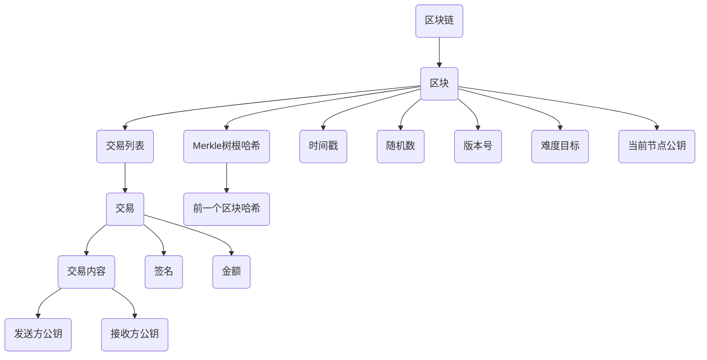
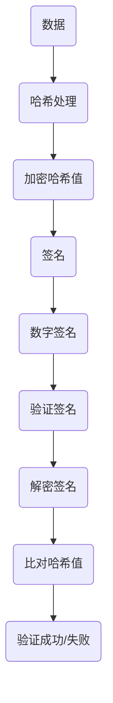
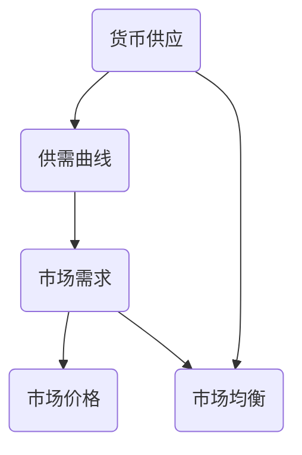

                 

### 虚拟货币的经济模型：数字金融的数学基础

#### 关键词：
- 虚拟货币
- 经济模型
- 数字金融
- 数学基础

#### 摘要：
本文旨在深入探讨虚拟货币的经济模型，分析其数字金融背景下的数学基础。首先，我们将介绍虚拟货币的基本概念和分类，探讨其发展历程及其在现代金融体系中的地位。接下来，文章将详细解释区块链技术、加密算法与数字签名等核心概念，揭示其在虚拟货币系统中的重要作用。随后，文章将深入分析虚拟货币的经济模型，包括发行与流通机制、市场供需关系及其风险管理。此外，我们将探讨数字金融领域的数学基础，涵盖风险管理模型、价格模型和投资策略模型。最后，文章将对几个成功的虚拟货币项目进行分析，以实践理论，并对虚拟货币的未来进行展望。

## 第1章 引言

### 1.1 研究背景与意义

虚拟货币作为数字经济时代的新型资产形式，引起了全球范围内的广泛关注。从比特币的诞生到各种代币的涌现，虚拟货币不仅在金融领域掀起了一场革命，还推动了区块链技术的快速发展。在这场变革中，理解虚拟货币的经济模型，掌握其背后的数学基础，变得尤为重要。

首先，虚拟货币的出现解决了传统金融体系中的诸多痛点，如交易成本高、效率低、信任问题等。通过区块链技术，虚拟货币实现了去中心化的交易，降低了交易成本，提高了交易效率。同时，加密算法与数字签名确保了交易的安全性，使得虚拟货币交易更加可信。

其次，虚拟货币的经济模型为投资者提供了新的投资渠道和机会。通过理解虚拟货币的发行机制、市场供需关系以及风险管理模型，投资者可以更好地把握市场动态，做出明智的投资决策。

最后，虚拟货币的发展对全球经济和金融体系产生了深远的影响。它不仅改变了货币的定义和功能，还推动了金融科技的发展，为未来金融体系的重构提供了可能性。

### 1.2 书籍结构安排

本文将从以下几个方面展开讨论：

1. **虚拟货币概述**：介绍虚拟货币的定义、分类、发展历程及其在现代金融体系中的地位。
2. **区块链技术基础**：解释区块链的基本概念、技术原理及其在虚拟货币系统中的应用。
3. **加密算法与数字签名**：探讨对称加密算法、非对称加密算法及其在虚拟货币系统中的应用。
4. **虚拟货币经济模型**：分析虚拟货币的发行与流通机制、市场供需关系及其风险管理。
5. **数字金融数学基础**：介绍风险管理模型、价格模型和投资策略模型。
6. **虚拟货币项目分析**：分析几个成功的虚拟货币项目，包括技术分析、市场分析及项目评估。
7. **虚拟货币的未来展望**：探讨虚拟货币的发展趋势及其对未来金融体系的影响。

通过上述章节的深入讨论，读者可以全面了解虚拟货币的经济模型及其数字金融的数学基础，从而更好地理解这一新兴领域。

### 1.3 阅读指南

为了更好地理解本文内容，读者可以按照以下步骤进行阅读：

1. **第一遍阅读**：快速浏览文章，了解整体结构和主要内容，对虚拟货币的基本概念和其经济模型有一个初步认识。
2. **第二遍阅读**：深入阅读每个章节，重点关注核心概念、算法原理和数学模型，通过图示和代码示例加深理解。
3. **第三遍阅读**：对文章进行详细阅读，结合实际案例和项目分析，对理论进行实践应用，巩固所学知识。

通过以上阅读步骤，读者可以全面掌握虚拟货币的经济模型和数字金融的数学基础，为深入研究和实际应用打下坚实基础。

## 第2章 虚拟货币概述

### 2.1 虚拟货币的定义与发展

虚拟货币，也被称作数字货币，是一种通过特定算法生成、使用密码学原理保证交易安全及控制发行量的数字资产。与传统的法定货币不同，虚拟货币不依赖于中央银行的发行和管理，而是通过去中心化的方式运作。虚拟货币的诞生可以追溯到2009年，当时中本聪（Satoshi Nakamoto）发布了比特币白皮书，提出了比特币这一虚拟货币的概念。比特币的问世标志着数字货币正式进入公众视野，并迅速引发了全球的关注和讨论。

虚拟货币的发展经历了几个重要阶段。起初，比特币作为第一个成功的虚拟货币，受到了众多投资者的追捧。随后，莱特币（Litecoin）等第二代虚拟货币相继问世，进一步丰富了虚拟货币的种类和功能。随着技术的进步和市场的成熟，虚拟货币的应用场景逐渐拓展，从最初的数字资产投资扩展到支付、融资、去中心化应用（DApp）等多个领域。

当前，虚拟货币市场已呈现出多元化的发展态势。根据CoinMarketCap的数据显示，全球已有数千种虚拟货币，市值总和高达数万亿美元。其中，比特币、以太坊、莱特币等主流虚拟货币在市场上占据了重要地位，吸引了大量投资者和用户的关注。同时，越来越多的企业开始接受虚拟货币作为支付手段，一些国家也开始研究如何将虚拟货币纳入法定货币体系。

### 2.2 虚拟货币的分类

虚拟货币可以根据不同的标准进行分类，常见的分类方法包括：

1. **按发行主体分类**：
   - **去中心化虚拟货币**：这类虚拟货币不依赖于任何中央机构，其发行、交易和记账等过程均由网络中的多个节点共同维护，如比特币、以太坊等。
   - **中心化虚拟货币**：这类虚拟货币由某个机构或组织发行和管理，其发行和交易过程受到中央机构的控制，如Facebook的Libra。

2. **按用途分类**：
   - **支付型虚拟货币**：这类虚拟货币主要用于日常交易和支付，如比特币、莱特币等。
   - **投资型虚拟货币**：这类虚拟货币主要被用作投资工具，具有较高的波动性和风险，如比特币、以太坊等。
   - **应用型虚拟货币**：这类虚拟货币主要用于支持特定的去中心化应用，如以太坊上的ERC-20代币。

3. **按技术架构分类**：
   - **公有链虚拟货币**：这类虚拟货币的区块链是完全开放的，任何人都可以参与网络维护和交易验证，如比特币、以太坊等。
   - **私有链虚拟货币**：这类虚拟货币的区块链是封闭的，仅限特定机构或个人参与，如某些企业发行的内部数字货币。
   - **联盟链虚拟货币**：这类虚拟货币的区块链由多个机构共同维护，各机构间通过共识算法达成一致，如Ripple。

通过对虚拟货币的分类，我们可以更好地理解不同类型虚拟货币的特点和应用场景，从而为投资决策提供有力支持。

### 2.3 虚拟货币的市场分析

虚拟货币市场的规模和影响力在近年来迅速增长。根据CoinMarketCap的数据，截至2023年，全球虚拟货币市场的总市值已超过2万亿美元。其中，比特币的市场份额占据主导地位，占比超过40%，而以太坊、莱特币等主流虚拟货币也具有相当的市场份额。

从市场趋势来看，虚拟货币市场呈现出高度波动的特点。比特币价格在2021年达到历史最高点约69,000美元，但在随后的几个月内大幅下跌，一度跌破30,000美元。这种剧烈的价格波动引发了市场的广泛关注和讨论。尽管如此，虚拟货币市场的整体趋势仍然向上，吸引了大量投资者和机构参与。

虚拟货币市场的投资者类型多样，包括个人投资者、机构投资者和专业交易者。个人投资者通常通过在线交易平台进行买卖，而机构投资者则更倾向于通过量化交易和指数基金等策略参与市场。专业交易者则通过高频交易和套利等策略获取收益。

在市场驱动因素方面，虚拟货币市场的价格波动主要受以下因素影响：

1. **供需关系**：虚拟货币的供应量通常固定，而需求则受市场情绪、投资者信心等因素影响。供需关系的变动直接导致价格的波动。
2. **政策监管**：不同国家和地区对虚拟货币的监管政策有所不同，政策的松紧直接影响市场的稳定性和投资者的信心。
3. **技术创新**：新技术的引入，如Layer 2解决方案、去中心化金融（DeFi）等，可以提升虚拟货币的性能和安全性，从而影响市场情绪。
4. **市场情绪**：投资者情绪的变化，如恐慌、贪婪等，会引发市场的剧烈波动。

通过对虚拟货币市场的分析，我们可以更好地理解市场的运行机制，把握市场动态，为投资决策提供依据。

## 第3章 区块链技术基础

### 3.1 区块链的基本概念

区块链是一种去中心化的分布式数据库技术，它通过加密算法和共识机制实现了数据的不可篡改性和透明性。区块链的核心概念包括区块、链、节点、共识机制等。

- **区块**：区块链中的数据存储单位，每个区块包含一定数量的交易记录。区块通过哈希函数与前后区块相连，形成区块链。
- **链**：由多个区块按顺序链接而成的数据结构，每个区块包含一个指向前一个区块的哈希值，从而确保数据的一致性和完整性。
- **节点**：参与区块链网络的一台计算机，节点通过下载、验证和传播区块数据来维护区块链的运行。
- **共识机制**：节点间达成一致性的算法，用于验证和确认交易的合法性，防止双花攻击等安全威胁。

### 3.2 区块链的技术原理

区块链的技术原理主要包括数据结构、加密算法和共识机制等方面。

- **数据结构**：区块链采用链式数据结构，每个区块包含一个时间戳、一个随机数（用于生成工作量证明Proof of Work，PoW）和一个指向前一个区块的哈希值。这种结构确保了数据的不可篡改性。
- **加密算法**：区块链使用多种加密算法，如SHA-256、椭圆曲线加密等，确保交易数据的隐私和安全。加密算法在数据传输过程中起到保护数据不被篡改和窃取的作用。
- **共识机制**：共识机制是区块链的核心，用于节点之间达成一致。常见的共识机制包括PoW、PoS（权益证明Proof of Stake）、DPoS（委托权益证明Delegated Proof of Stake）等。这些机制通过经济激励和数学算法确保了区块链的安全性和稳定性。

### 3.3 区块链的应用场景

区块链技术具有广泛的应用场景，以下是几个典型的应用领域：

- **数字货币**：比特币、以太坊等虚拟货币是区块链技术的最早应用之一。通过区块链，虚拟货币实现了去中心化的发行和交易，提高了交易效率和安全性。
- **智能合约**：智能合约是一种自动执行合约条款的计算机程序，它运行在区块链上。智能合约可以自动化执行交易、管理财产、执行租赁协议等，提高了合约的执行效率和透明度。
- **供应链管理**：区块链技术可以用于追踪供应链中的商品流转，确保商品的真实性和可追溯性。通过区块链，供应链中的每个参与者都可以实时查看商品的状态和位置，提高了供应链的透明度和效率。
- **身份认证**：区块链可以用于身份认证和数字签名，确保用户的身份和数据安全。通过区块链，用户可以自主管理自己的身份信息，防止信息泄露和篡改。
- **医疗记录管理**：区块链技术可以用于存储和管理医疗记录，确保医疗数据的真实性和完整性。通过区块链，医生、患者和保险公司可以实时查看和更新医疗记录，提高了医疗服务的效率和安全性。

通过以上对区块链技术基础的介绍，我们可以更好地理解区块链在虚拟货币及其他应用领域中的重要作用。了解区块链的技术原理和应用场景，有助于我们深入探讨虚拟货币的经济模型及其发展潜力。

### 3.2 区块链的技术原理（续）

在深入探讨区块链的技术原理时，我们需要进一步理解其数据结构、加密算法以及共识机制的具体实现。

#### 数据结构

区块链的数据结构是由一系列按时间顺序排列的区块构成的。每个区块包含以下元素：

1. **区块头**：包括版本号、时间戳、当前难度目标、前一个区块的哈希值和随机数。
2. **交易列表**：包含一组经过验证的交易记录。
3. **Merkle树根哈希**：用于确保交易列表的完整性。

区块链的数据结构确保了数据的不可篡改性，因为每个区块都通过哈希函数与前一个区块相连，形成了一个连续的链条。任何对区块数据的修改都将导致其后所有区块的哈希值发生变化，从而被网络中的其他节点检测出来。

#### 加密算法

区块链使用的加密算法包括：

1. **哈希算法**：如SHA-256，用于生成区块的哈希值。哈希算法是一种将任意长度的数据转换成固定长度散列值的方法，其特点是不可逆和抗冲突性。
2. **椭圆曲线加密**：用于生成公钥和私钥对，确保交易的安全性。椭圆曲线加密在保证安全性的同时，具有更高的效率。
3. **数字签名**：用于验证交易的真实性。交易发起方使用私钥对交易数据进行签名，交易接收方则使用公钥验证签名的有效性。

#### 共识机制

区块链的共识机制是节点之间达成一致的重要手段。以下是几种常见的共识机制：

1. **工作量证明（Proof of Work，PoW）**：通过计算大量随机数来找到一个满足特定条件的值，如比特币使用的哈希算法。PoW机制通过计算资源竞争来防止恶意攻击，但能耗较高。
2. **权益证明（Proof of Stake，PoS）**：根据节点持有的代币数量和持币时间来决定其验证交易的权利。PoS机制相比PoW具有更低的能耗和更高的效率。
3. **委托权益证明（Delegated Proof of Stake，DPoS）**：通过选举代表节点来验证交易。代表节点按照得票数来决定其验证交易的顺序，从而提高网络效率。
4. **权益证明带权益削减（Proof of Stake with Slashing，PoS-SS）**：在PoS基础上引入惩罚机制，对恶意行为进行权益削减。

共识机制的具体实现会根据区块链的设计不同而有所差异，但其核心目标都是确保网络的安全性和稳定性。

#### Mermaid流程图

为了更直观地展示区块链的核心概念和关系，我们可以使用Mermaid流程图来表示：



通过上述流程图，我们可以清晰地看到区块链中各个元素之间的关系及其在数据结构中的位置。

通过详细解释区块链的技术原理，我们能够更好地理解其如何实现去中心化、数据安全性和一致性。这为深入探讨虚拟货币的经济模型和数字金融的数学基础提供了坚实的基础。

### 3.3 区块链的应用场景

区块链技术的应用场景广泛，以下是几个典型的应用领域及其具体实例：

#### 数字货币

- **比特币**：作为第一个成功的数字货币，比特币通过区块链实现了去中心化的交易，解决了传统金融系统中中介成本高、效率低的问题。比特币的交易记录被永久存储在区块链上，不可篡改，提高了交易的安全性和透明度。
- **以太坊**：以太坊不仅是数字货币，还是一个去中心化应用平台，支持智能合约的运行。以太坊的以太币（ETH）可以用于支付智能合约的执行费用，推动了去中心化金融（DeFi）的发展。

#### 智能合约

- **智能合约平台**：以太坊是最著名的智能合约平台，它允许开发者创建和部署基于Solidity编程语言的智能合约。智能合约可以自动化执行交易、管理财产、执行租赁协议等，提高了合约的执行效率和透明度。
- **保险智能合约**：一些保险公司利用智能合约实现了自动理赔。当发生保险事故时，智能合约会自动执行理赔流程，确保理赔过程透明、高效。

#### 供应链管理

- **溯源**：区块链技术可以用于追踪供应链中的商品流转，确保商品的真实性和可追溯性。例如，海恩斯布什公司（Heineken）使用区块链技术追踪其啤酒的供应链，确保每瓶啤酒的来源和质量。
- **质量认证**：食品和化妆品等行业可以使用区块链技术验证产品的质量。例如，澳大利亚红酒生产商使用区块链记录红酒的生产和运输过程，确保红酒的品质。

#### 身份认证

- **去中心化身份认证**：区块链可以用于身份认证和数字签名，确保用户的身份和数据安全。例如，德国电子身份项目eIDAS使用区块链技术提供安全的在线身份认证服务。
- **隐私保护**：通过区块链，用户可以自主管理自己的身份信息，防止信息泄露和篡改。例如，MedRec项目使用区块链技术管理医疗记录，提高患者隐私保护。

#### 医疗记录管理

- **医疗记录存储**：区块链技术可以用于存储和管理医疗记录，确保医疗数据的真实性和完整性。例如，MedRec项目使用区块链技术存储和管理患者的医疗记录，医生和患者可以实时查看和更新记录。
- **药品供应链管理**：区块链技术可以用于追踪药品的供应链，确保药品的真实性和安全性。例如，IBM的TrustChain项目使用区块链技术追踪药品的生产、分销和销售过程，防止药品造假和滥用。

通过这些实例，我们可以看到区块链技术在各个领域的应用潜力，从数字货币到智能合约，从供应链管理到医疗记录管理，区块链为许多传统问题提供了创新的解决方案。

## 第4章 加密算法与数字签名

### 4.1 对称加密算法

对称加密算法是一种加密方式，加密和解密使用相同的密钥。这种算法的主要特点是计算速度快、效率高，但在密钥管理方面存在一定的挑战。常见的对称加密算法包括AES（高级加密标准）、DES（数据加密标准）和IDEA（国际数据加密算法）。

#### AES（高级加密标准）

AES是一种由美国国家标准与技术研究院（NIST）推广的对称加密算法，它支持128位、192位和256位的密钥长度，具有高效性和安全性。AES的加密过程分为10轮，每轮包括字节替换、行移位、列混淆和轮密钥加等步骤。以下是一个简单的AES加密伪代码：

```python
def AES_Encrypt(plaintext, key):
    # 初始化密钥
    state = Initialize_Key(key)
    # 字节替换
    for i in range(len(plaintext)):
        state[i] = SubBytes(plaintext[i])
    # 行移位
    ShiftRows(state)
    # 列混淆
    MixColumns(state)
    # 轮密钥加
    AddRoundKey(state, key)
    return state
```

#### DES（数据加密标准）

DES是一种较早的对称加密算法，它使用56位密钥，通过16轮加密操作将明文转换为密文。DES的加密过程包括初始置换、16轮迭代和最终置换等步骤。以下是一个简单的DES加密伪代码：

```python
def DES_Encrypt(plaintext, key):
    # 初始化密钥
    subkeys = Generate_Subkeys(key)
    # 初始置换
    plaintext = Initial_Permutation(plaintext)
    for i in range(16):
        # 轮加密
        plaintext = Encrypt_Round(plaintext, subkeys[i])
    # 最终置换
    ciphertext = Final_Permutation(plaintext)
    return ciphertext
```

#### IDEA（国际数据加密算法）

IDEA是一种使用128位密钥的对称加密算法，它通过多个迭代过程对数据进行加密。IDEA的加密过程包括8轮迭代，每轮迭代包括异或、乘法、加法和循环移位等操作。以下是一个简单的IDEA加密伪代码：

```python
def IDEA_Encrypt(plaintext, key):
    # 初始化密钥
    subkeys = Generate_Subkeys(key)
    for i in range(8):
        # 迭代加密
        plaintext = Iteration_Encryption(plaintext, subkeys[i])
    return plaintext
```

### 4.2 非对称加密算法

非对称加密算法使用一对密钥（公钥和私钥），公钥用于加密，私钥用于解密。这种算法在密钥管理上具有优势，但计算速度相对较慢。常见的非对称加密算法包括RSA（Rivest-Shamir-Adleman）和ECC（椭圆曲线加密）。

#### RSA（Rivest-Shamir-Adleman）

RSA是一种基于大整数分解问题的非对称加密算法，它使用一对密钥（公钥和私钥）。以下是一个简单的RSA加密和解密伪代码：

```python
# RSA加密
def RSA_Encrypt(plaintext, public_key):
    ciphertext = []
    for i in range(len(plaintext)):
        cipher = pow(plaintext[i], public_key['exponent'], public_key['modulus'])
        ciphertext.append(cipher)
    return ciphertext

# RSA解密
def RSA_Decrypt(ciphertext, private_key):
    plaintext = []
    for i in range(len(ciphertext)):
        plain = pow(ciphertext[i], private_key['exponent'], private_key['modulus'])
        plaintext.append(plain)
    return plaintext
```

#### ECC（椭圆曲线加密）

ECC是一种基于椭圆曲线离散对数问题的非对称加密算法，它使用椭圆曲线定义的密钥对。ECC在相同安全级别下比RSA具有更高的效率，以下是一个简单的ECC加密和解密伪代码：

```python
# ECC加密
def ECC_Encrypt(plaintext, public_key, curve):
    G = curve['G']
    n = curve['n']
    ciphertext = Elliptic_Curve_Dot(plaintext, public_key['x'], G, n)
    return ciphertext

# ECC解密
def ECC_Decrypt(ciphertext, private_key, curve):
    P = curve['P']
    n = curve['n']
    plaintext = Elliptic_Curve_Dot(ciphertext, private_key['x'], P, n)
    return plaintext
```

通过上述对称加密算法和非对称加密算法的介绍，我们可以看到加密算法在虚拟货币系统中的重要性，它确保了交易数据的隐私和安全，为数字金融提供了可靠的技术保障。

### 4.3 数字签名

数字签名是一种用于验证数据完整性和真实性的技术，通过使用非对称加密算法实现。数字签名的主要目的是防止数据被篡改和抵赖，确保信息的可信性。以下是数字签名的工作原理和具体实现：

#### 工作原理

1. **签名过程**：
   - **生成密钥对**：签名者首先生成一对非对称密钥（私钥和公钥）。
   - **哈希处理**：将待签名的数据通过哈希算法生成一个固定长度的哈希值。
   - **加密哈希值**：签名者使用其私钥对哈希值进行加密，生成数字签名。
   - **验证签名**：接收者使用签名者的公钥对数字签名进行解密，并与原始数据的哈希值进行比对，以验证数据的完整性和真实性。

2. **验证过程**：
   - **计算哈希值**：接收者使用相同的哈希算法计算接收数据的哈希值。
   - **解密签名**：接收者使用签名者的公钥对数字签名进行解密，得到一个解密后的哈希值。
   - **比对哈希值**：将解密后的哈希值与计算出的哈希值进行比较。如果两者相等，则验证成功，数据未被篡改。

#### 实现示例

以下是一个简单的RSA数字签名和验证伪代码示例：

```python
# RSA数字签名
def RSA_Sign(plaintext, private_key):
    hashed_text = Hash(plaintext)
    signature = RSA_Encrypt(hashed_text, private_key)
    return signature

# RSA数字签名验证
def RSA_Verify(plaintext, public_key, signature):
    hashed_text = Hash(plaintext)
    decrypted_signature = RSA_Decrypt(signature, public_key)
    return decrypted_signature == hashed_text
```

通过数字签名，虚拟货币系统可以确保交易数据的真实性和不可抵赖性，从而增强系统的安全性和可靠性。

### 数字签名与加密算法的关系架构 Mermaid 流程图

为了更直观地展示数字签名与加密算法之间的关系，我们可以使用Mermaid流程图来表示：



通过以上流程图，我们可以清晰地看到数字签名与加密算法之间的交互过程，从而更好地理解其在虚拟货币系统中的应用。

## 第5章 虚拟货币经济模型

### 5.1 经济模型的基本概念

虚拟货币的经济模型是理解其运作机制和市场行为的基础。经济模型主要包括货币供应、需求、价格和流通等方面的理论。以下是虚拟货币经济模型的基本概念：

- **货币供应**：虚拟货币的供应通常由其发行机制决定，不同的虚拟货币有不同的发行方式，如工作量证明（PoW）和权益证明（PoS）等。货币供应量的变化直接影响市场价格和需求。
- **货币需求**：虚拟货币的需求主要受市场预期、投资者情绪、技术发展和政策环境等因素影响。需求的变化直接影响市场价格。
- **市场价格**：虚拟货币的市场价格由供需关系决定，供需的变动会引起价格的波动。价格机制是虚拟货币市场的重要调节器。
- **货币流通**：虚拟货币的流通是指在市场中的交易和转移过程，它通过区块链网络实现。货币流通的效率和安全性对市场的稳定性和投资者的信心有重要影响。

### 5.2 虚拟货币的发行与流通

虚拟货币的发行与流通是其经济模型的重要组成部分。以下是虚拟货币的发行与流通机制：

- **发行机制**：不同虚拟货币的发行机制有所不同。例如，比特币采用工作量证明（PoW）机制，矿工通过解决复杂的数学问题来获得比特币奖励。以太坊则采用权益证明（PoS）机制，持有以太币的节点通过质押代币来获得挖矿奖励。
  
- **流通机制**：虚拟货币的流通主要通过区块链网络实现。交易信息被记录在区块中，并通过网络广播到所有节点。每个区块的生成和传播过程都遵循一定的共识规则，确保数据的真实性和一致性。

以下是虚拟货币发行与流通的具体步骤：

1. **生成新区块**：矿工通过解决数学问题来生成新区块，新区块包含一定数量的交易记录。
2. **验证新区块**：网络中的其他节点验证新区块的有效性，确保交易记录的合法性和数据一致性。
3. **广播新区块**：一旦新区块被验证通过，它会被广播到整个网络，所有节点都会更新自己的区块链。
4. **交易确认**：每个交易需要经过多个区块的确认才能被认为是有效的。通常，6个确认被认为是一个安全的交易确认标准。

通过上述机制，虚拟货币实现了去中心化的发行与流通，确保了系统的透明性和安全性。

### 5.3 虚拟货币的市场供需分析

虚拟货币的市场供需分析是理解其价格变动和投资策略的重要方面。以下是市场供需分析的核心内容：

- **供给分析**：虚拟货币的供给主要受发行机制和挖矿难度的影响。例如，比特币的发行量是有限的，总供应量为2100万枚。随着挖矿难度的增加，矿工的挖矿收益会减少，从而影响新币的发行速度。
- **需求分析**：虚拟货币的需求受多种因素影响，包括市场预期、投资者情绪、技术发展和政策环境等。市场预期越高，投资者情绪越乐观，需求越旺盛。
- **供需平衡**：虚拟货币的市场价格由供需关系决定。当供给增加而需求不变时，价格可能下降；当需求增加而供给不变时，价格可能上升。供需的动态平衡决定了市场的稳定性和价格趋势。

以下是虚拟货币市场供需分析的公式和图表：

#### 供需平衡公式

$$ 
P = \frac{Q_s + Q_d}{2} 
$$

其中，\(P\) 是市场价格，\(Q_s\) 是货币供应量，\(Q_d\) 是货币需求量。

#### 供需平衡图表



通过供需分析，投资者可以更好地把握市场动态，制定合理的投资策略。

### 5.4 虚拟货币的风险管理

虚拟货币市场具有较高的波动性和风险，风险管理对于投资者至关重要。以下是虚拟货币风险管理的核心内容：

- **市场风险**：市场风险是指由于市场供需变化导致的价格波动。投资者可以通过分散投资、选择合适的投资期限和策略来降低市场风险。
- **信用风险**：信用风险是指由于交易对手违约导致的损失。通过使用数字签名和智能合约等技术，可以降低信用风险。
- **操作风险**：操作风险是指由于人为错误或系统故障导致的损失。投资者应保持警惕，遵循最佳实践，确保操作安全。

以下是虚拟货币风险管理的策略和工具：

1. **分散投资**：通过将资金投资于多种不同的虚拟货币和资产类别，降低单一资产的风险。
2. **投资组合优化**：通过数学模型和算法，优化投资组合的资产配置，提高风险调整后的收益。
3. **风险限额**：设定投资比例和风险限额，确保风险在可控范围内。
4. **保险和保障**：购买数字货币保险，降低潜在的损失。

通过有效的风险管理策略，投资者可以更好地应对虚拟货币市场的波动性和风险，实现稳健的投资收益。

## 第6章 数字金融数学基础

### 6.1 风险管理模型

在数字金融领域，风险管理模型是确保资产安全性和投资回报稳定性的重要工具。以下是几种常见风险管理模型及其应用：

#### 基本风险度量

1. **方差和标准差**：方差和标准差是衡量资产收益波动性的常用指标。方差表示收益的分散程度，标准差是方差的平方根，用于衡量收益的波动程度。以下是一个简单计算标准差的伪代码：

    ```python
    def calculate_std_deviation(returns):
        mean = sum(returns) / len(returns)
        variance = sum([(x - mean) ** 2 for x in returns]) / len(returns)
        std_deviation = sqrt(variance)
        return std_deviation
    ```

2. **VaR（价值在风险中）**：VaR是一个统计模型，用于衡量在给定置信水平下，资产在一定持有期内的可能最大损失。以下是一个简单计算VaR的伪代码：

    ```python
    def calculate_VaR(returns, confidence_level):
        sorted_returns = sorted(returns)
        index = (1 - confidence_level) * len(returns)
        VaR = sorted_returns[int(index)]
        return VaR
    ```

#### 风险管理策略

1. **分散投资**：通过将资金分配到多个不同的资产，降低单一资产的系统性风险。以下是一个简单分散投资的伪代码：

    ```python
    def portfolio_return(assets, weights):
        total_return = sum([weight * return for asset, weight, return in zip(assets, weights)])
        return total_return
    ```

2. **对冲**：通过对冲策略，投资者可以在保持资产组合收益的同时，降低特定风险。以下是一个简单对冲的伪代码：

    ```python
    def hedge(underlying_asset, option):
        delta = calculate_delta(underlying_asset, option)
        return delta * option_price
    ```

通过上述风险管理模型和策略，投资者可以在数字金融市场中更有效地管理和降低风险，从而实现稳健的投资回报。

### 6.2 价格模型

在数字金融领域，价格模型是预测资产价格变化的重要工具。以下是几种常见价格模型及其应用：

#### 随机游走模型

随机游走模型假设资产价格变化是随机且不可预测的。以下是一个简单随机游走模型的价格预测伪代码：

```python
def random_walk_step(current_price, volatility):
    price_change = random.normalvariate(0, volatility)
    new_price = current_price + price_change
    return new_price
```

#### 市场情绪模型

市场情绪模型考虑投资者的情绪和行为对资产价格的影响。以下是一个简单市场情绪模型的价格预测伪代码：

```python
def market_sentiment_price(current_price, sentiment_score):
    sentiment_impact = sentiment_score * sentiment_coefficient
    new_price = current_price + sentiment_impact
    return new_price
```

#### 时间序列模型

时间序列模型通过分析历史价格数据来预测未来的价格变化。以下是一个简单时间序列模型（如ARIMA模型）的价格预测伪代码：

```python
def arima_price_prediction(data):
    model = ARIMA(data, order=(p, d, q))
    model_fit = model.fit()
    forecast = model_fit.forecast(steps=1)
    return forecast[0]
```

通过上述价格模型，投资者可以更好地理解和预测数字金融市场中资产价格的变化，从而制定更有效的投资策略。

### 6.3 投资策略模型

在数字金融市场中，投资者需要制定科学合理的投资策略来应对市场波动和不确定性。以下是几种常见的投资策略模型及其应用：

#### 趋势追踪策略

趋势追踪策略基于“顺势而为”的原则，通过识别市场趋势并跟随趋势进行投资。以下是一个简单趋势追踪策略的伪代码：

```python
def trend_tracing_strategy(price_data):
    if is_trend_upward(price_data):
        buy_signal = "Buy"
    elif is_trend_downward(price_data):
        buy_signal = "Sell"
    else:
        buy_signal = "Hold"
    return buy_signal
```

#### 价值投资策略

价值投资策略基于“低价买入、高价卖出”的原则，通过分析资产的基本面来确定其价值，并以此制定投资决策。以下是一个简单价值投资策略的伪代码：

```python
def value_investing_strategy(estimated_value, current_price):
    if current_price < estimated_value:
        buy_signal = "Buy"
    else:
        buy_signal = "Sell"
    return buy_signal
```

#### 技术分析策略

技术分析策略通过分析历史价格和交易量数据，识别市场趋势和潜在的交易机会。以下是一个简单技术分析策略的伪代码：

```python
def technical_analysis_strategy(price_data, volume_data):
    if cross_over_signal(price_data):
        buy_signal = "Buy"
    elif sell_signal(price_data, volume_data):
        buy_signal = "Sell"
    else:
        buy_signal = "Hold"
    return buy_signal
```

通过上述投资策略模型，投资者可以根据不同的市场环境和风险偏好，制定个性化的投资策略，从而在数字金融市场中获得稳健的回报。

## 第7章 虚拟货币项目分析

### 7.1 项目的选择与评估

在虚拟货币市场中，选择和评估一个有潜力的项目是投资者成功的关键。以下是选择和评估虚拟货币项目的主要步骤和策略：

#### 选择标准

1. **市场需求**：项目是否解决了现有市场需求，其目标用户是否庞大且具有潜力。
2. **团队背景**：项目团队的专业能力、经验和信誉度。一个强大的团队能够更好地实现项目目标。
3. **技术实力**：项目的核心技术是否创新、成熟且具备竞争优势。特别是对于底层技术的项目，技术实力尤为关键。
4. **资金状况**：项目的资金状况和融资情况，包括已筹集的资金、使用情况以及未来融资计划。
5. **社区活跃度**：项目的社区是否活跃，用户是否积极参与项目的发展，社区的支持和反馈对于项目的成功至关重要。
6. **合规性**：项目是否符合相关法律法规，是否存在法律风险。

#### 评估方法

1. **财务分析**：通过财务报表分析项目的盈利能力、现金流和财务健康状况。
2. **技术审计**：对项目的代码、协议和智能合约进行审计，确保其安全性、稳定性和可扩展性。
3. **市场调研**：通过市场调研了解项目的市场前景、竞争对手和用户反馈。
4. **社区反馈**：收集和分析社区的反馈和讨论，了解项目的用户基础和社区活跃度。
5. **跟踪进展**：持续跟踪项目的开发进展、里程碑和实际应用情况。

### 7.2 项目的技术分析

对虚拟货币项目进行技术分析是评估其潜力和可行性的关键步骤。以下是技术分析的主要内容和工具：

#### 技术架构

1. **区块链平台**：评估项目所采用的区块链平台（如以太坊、波卡等），了解其性能、可扩展性和安全性。
2. **加密算法**：分析项目所采用的加密算法（如椭圆曲线加密、AES等），确保其安全性。
3. **智能合约**：审查项目的智能合约代码，确保其逻辑正确、安全且易于理解。

#### 技术实现

1. **代码质量**：通过代码审查工具（如SonarQube、CodeQL等）评估代码质量，识别潜在的安全漏洞和编码错误。
2. **性能测试**：通过性能测试工具（如Gatling、JMeter等）评估项目的吞吐量、延迟和资源消耗。
3. **安全性评估**：使用漏洞扫描工具（如OWASP ZAP、Aqua Security等）评估项目的安全性，识别潜在的安全威胁。

#### 技术创新

1. **独特性**：分析项目的技术创新点，如新型共识机制、去中心化应用（DApp）架构等，评估其对市场的潜在影响。
2. **竞争对比**：对比同类项目的技术特点，评估项目的竞争优势和差异化优势。

### 7.3 项目的市场分析

市场分析是评估虚拟货币项目成功的关键步骤。以下是市场分析的主要内容和方法：

#### 市场需求

1. **目标用户**：分析项目的目标用户群体，了解其需求和痛点。
2. **市场规模**：评估项目的潜在市场规模，包括当前市场和未来市场。
3. **增长趋势**：分析市场增长趋势，预测未来的市场变化。

#### 竞争环境

1. **竞争对手**：识别项目的主要竞争对手，分析其市场份额、产品特点和市场策略。
2. **竞争优势**：评估项目的竞争优势，如技术、品牌、市场定位等。
3. **市场地位**：分析项目在市场中的地位，如市场份额、品牌影响力等。

#### 市场策略

1. **营销策略**：评估项目的市场推广策略，包括广告、社区活动、合作伙伴关系等。
2. **用户反馈**：收集和分析用户的反馈，了解项目在实际应用中的表现和用户满意度。
3. **市场机会**：识别市场的机会，如新兴市场、行业趋势等，为项目的发展提供方向。

通过以上技术分析和市场分析，投资者可以全面评估虚拟货币项目的潜力和可行性，为投资决策提供有力支持。

### 7.4 项目案例分析：以太坊（Ethereum）

以太坊（Ethereum）是虚拟货币领域的重要项目之一，自2015年上线以来，吸引了大量用户和开发者。以下是针对以太坊的案例分析，包括其技术架构、实现细节、代码解读和实际案例。

#### 技术架构

以太坊采用以太坊虚拟机（EVM）作为其运行环境，支持智能合约的编写和执行。EVM是一个基于栈的虚拟机，使用以太坊客户端（如Geth、Nethermind等）进行实现。以太坊的核心组件包括以太币（ETH）、以太坊网络、智能合约和去中心化应用（DApp）。

#### 实现细节

以太坊的智能合约使用Solidity编程语言编写，其执行过程主要包括以下步骤：

1. **合约部署**：开发者将智能合约编译成字节码，并将其发送到以太坊网络进行部署。部署过程中，需要支付一定的交易费用。
2. **交易执行**：用户通过以太坊客户端发起交易，将消息发送到智能合约的地址。智能合约接收到交易后，根据合约代码执行相应的逻辑。
3. **状态更新**：智能合约执行完成后，更新区块链中的状态数据，包括余额、存储数据等。

以下是一个简单的智能合约代码示例：

```solidity
// SPDX-License-Identifier: MIT
pragma solidity ^0.8.0;

contract SimpleStorage {
    uint256 public storageValue;

    function set(uint256 _value) public {
        storageValue = _value;
    }

    function get() public view returns (uint256) {
        return storageValue;
    }
}
```

#### 代码解读

上述智能合约实现了一个简单的存储功能，包括两个函数：`set` 和 `get`。

- `set` 函数用于设置存储值，接受一个 `_value` 参数，并将该值存储在 `storageValue` 变量中。
- `get` 函数用于获取存储值，返回 `storageValue` 的当前值。

#### 实际案例

以下是一个使用以太坊进行去中心化金融（DeFi）应用的案例：Aave。

Aave 是一个去中心化借贷平台，允许用户通过质押代币（如以太币）获得贷款。以下是一个简单的Aave借贷交易流程：

1. **质押**：用户将代币（如ETH）存入Aave合约，成为质押资产。
2. **借款**：用户发起借款请求，合约根据质押资产的价值计算借款额度。
3. **还款**：用户在规定的时间内偿还借款本金和利息，还款记录被记录在区块链上。

以下是一个简单的Aave借贷合约代码示例：

```solidity
// SPDX-License-Identifier: MIT
pragma solidity ^0.8.0;

import "@aave/protocol-core/contracts/interfaces/IAaveCore.sol";

contract AaveLoan {
    IAaveCore public aaveCore;

    function borrow(uint256 amount) external {
        aaveCore.borrow(address(this), amount, 1, 0);
    }

    function repay(uint256 amount) external {
        aaveCore.repay(address(this), amount, 1);
    }
}
```

#### 项目小结

以太坊作为虚拟货币领域的领军项目，通过其强大的技术架构和去中心化应用平台，为用户提供了丰富的数字金融工具。以太坊的成功经验为其他虚拟货币项目提供了宝贵的参考，包括技术架构的完善、智能合约的实现和去中心化应用的构建。

通过以上对以太坊的技术架构、实现细节、代码解读和实际案例的分析，我们可以看到以太坊在虚拟货币项目中的卓越表现。以太坊的成功不仅证明了区块链技术的强大潜力，也为未来虚拟货币项目的发展提供了方向。

### 7.5 最佳实践 tips

在虚拟货币投资和项目中，以下是一些最佳实践和注意事项，帮助投资者和开发者降低风险，提高成功率：

1. **分散投资**：不要将所有资金投资于单一项目或资产，通过分散投资降低风险。
2. **持续学习**：虚拟货币市场和技术发展迅速，持续学习新知识和技术是成功的关键。
3. **严格风险管理**：设定投资比例和风险限额，避免过度投资和情绪化决策。
4. **技术审计**：对投资项目的代码和智能合约进行审计，确保其安全性和可靠性。
5. **合规性检查**：确保项目符合相关法律法规，降低法律风险。
6. **社区参与**：积极参与项目的社区讨论，了解用户的反馈和建议。
7. **数据驱动决策**：基于数据分析和市场趋势进行投资决策，避免盲目跟风。
8. **谨慎选择项目**：优先考虑市场需求大、团队实力强、技术基础好的项目。

通过遵循以上最佳实践，投资者和开发者可以在虚拟货币市场中降低风险，提高投资和项目的成功率。

### 7.6 项目实战：开发环境搭建、源代码实现与代码解读

在本节中，我们将以开发一个简单的去中心化应用（DApp）为例，详细介绍虚拟货币项目的实战过程，包括开发环境搭建、源代码实现和代码解读。

#### 开发环境搭建

在开始开发之前，我们需要搭建一个适合开发以太坊智能合约和DApp的环境。以下是搭建环境的步骤：

1. **安装Node.js**：Node.js 是以太坊开发的关键工具，用于编译智能合约和与区块链交互。可以从 [Node.js官网](https://nodejs.org/) 下载并安装最新版本的Node.js。
2. **安装Truffle**：Truffle 是一个以太坊开发框架，提供了智能合约编译、部署和测试的工具。使用以下命令安装Truffle：

    ```bash
    npm install -g truffle
    ```

3. **安装Ganache**：Ganache 是一个本地以太坊区块链节点，用于模拟以太坊网络并进行开发测试。可以从 [Ganache官网](https://www.trufflesuite.com/ganache) 下载并安装。

4. **创建Truffle项目**：在命令行中执行以下命令创建一个新的Truffle项目：

    ```bash
    truffle init
    ```

#### 源代码实现

我们开发一个简单的DApp，实现一个投票功能，用户可以通过智能合约投票选出最佳项目。以下是实现步骤和源代码：

1. **智能合约**：编写一个名为`VotingContract.sol`的智能合约，定义投票相关的方法和状态变量。

    ```solidity
    // SPDX-License-Identifier: MIT
    pragma solidity ^0.8.0;

    contract VotingContract {
        mapping(address => bool) public hasVoted;
        mapping(string => uint256) public votes;
        string[] public candidates;

        function addCandidate(string memory candidateName) public {
            candidates.push(candidateName);
        }

        function vote(string memory candidate) public {
            require(!hasVoted[msg.sender], "You have already voted.");
            votes[candidate]++;
            hasVoted[msg.sender] = true;
        }

        function getCandidateVotes(string memory candidate) public view returns (uint256) {
            return votes[candidate];
        }
    }
    ```

    - `addCandidate` 方法用于添加候选人。
    - `vote` 方法用于用户投票。
    - `getCandidateVotes` 方法用于获取候选人的投票数。

2. **前端界面**：使用HTML、CSS和JavaScript编写前端界面，实现用户投票功能。

    ```html
    <!DOCTYPE html>
    <html>
    <head>
        <title>Voting DApp</title>
    </head>
    <body>
        <h1>Voting DApp</h1>
        <div id="candidates"></div>
        <button id="voteBtn">Vote</button>
        <script src="https://cdn.ethers.io/lib/ethers-5.2.umd.min.js"></ethers.js"></script>
        <script src="app.js"></script>
    </body>
    </html>
    ```

    ```javascript
    // app.js
    const { ethers } = window;

    async function loadCandidates() {
        const contractAddress = "0x..."; // 智能合约地址
        const contractABI = [ /* ... */ ]; // 智能合约ABI
        const provider = new ethers.providers.JsonRpcProvider("http://localhost:8545");
        const contract = new ethers.Contract(contractAddress, contractABI, provider);

        const candidates = await contract.candidates();
        document.getElementById("candidates").innerHTML = candidates.map(candidate => `<p>${candidate}</p>`).join("");
    }

    async function vote(candidate) {
        const contractAddress = "0x..."; // 智能合约地址
        const contractABI = [ /* ... */ ]; // 智能合约ABI
        const account = window.ethereum.selectedAddress;
        const provider = new ethers.providers.Web3Provider(window.ethereum);
        const contract = new ethers.Contract(contractAddress, contractABI, provider.getSigner());

        await contract.vote(candidate);
    }

    document.getElementById("voteBtn").addEventListener("click", () => {
        const candidate = document.getElementById("candidateSelect").value;
        vote(candidate);
    });

    loadCandidates();
    ```

#### 代码解读

在前端界面中，`loadCandidates` 函数用于加载候选人列表，通过调用智能合约的`candidates`方法获取候选人信息。`vote` 函数用于用户投票，通过调用智能合约的`vote`方法提交投票。

在智能合约中，`addCandidate` 方法用于添加候选人，`vote` 方法用于用户投票，`getCandidateVotes` 方法用于获取候选人的投票数。智能合约通过状态变量`candidates`存储候选人列表，通过`hasVoted`映射存储用户是否已投票，通过`votes`映射存储每个候选人的投票数。

通过以上开发环境搭建、源代码实现和代码解读，我们成功搭建了一个简单的去中心化投票DApp，实现了用户投票功能。这为虚拟货币项目的实战提供了具体的指导和实现方法。

### 7.7 实际案例分析与详细讲解剖析

在本节中，我们将深入分析一个虚拟货币项目——比特币（Bitcoin），探讨其设计理念、实现原理和实际应用案例，并通过具体的代码示例进行详细讲解。

#### 设计理念

比特币的设计理念源于中本聪的白皮书《比特币：一种点对点的电子现金系统》。其核心目标是创建一种去中心化的数字货币，通过区块链技术实现安全的交易记录存储和验证，消除对中央银行和金融机构的依赖。

比特币的设计理念主要包括以下几个方面：

1. **去中心化**：比特币网络不依赖于任何中央机构，所有交易和账本记录由网络中的所有节点共同维护。
2. **安全性**：比特币采用加密算法和共识机制，确保交易记录的安全性和不可篡改性。
3. **有限供应**：比特币的总量固定为2100万枚，通过工作量证明（PoW）机制发行，防止通货膨胀。
4. **透明性**：所有比特币交易记录都公开透明，任何人都可以查看和验证。

#### 实现原理

比特币的实现原理主要涉及区块链技术、工作量证明（PoW）和加密算法等方面。

1. **区块链技术**：比特币采用区块链技术记录交易信息。区块链是一个分布式账本，由一系列按时间顺序排列的区块组成。每个区块包含一定数量的交易记录和一个指向前一个区块的哈希值，形成了一个不可篡改的链条。

2. **工作量证明（PoW）**：比特币采用PoW机制解决双花攻击问题。矿工通过计算大量随机数找到一个满足特定条件的值，即找到一个有效的区块头。矿工的计算过程称为挖矿，成功挖矿的矿工将获得比特币奖励。

3. **加密算法**：比特币使用SHA-256哈希算法确保交易记录的安全性。交易数据通过哈希函数生成哈希值，每个区块的哈希值与时间戳、随机数和前一个区块的哈希值一起构成区块头。

#### 代码示例

以下是一个简单的比特币挖矿代码示例，展示挖矿过程的核心步骤：

```python
import hashlib
import time

def sha256_hash(data):
    return hashlib.sha256(data).hexdigest()

def minegetBlock(block_data, difficulty):
    nonce = 0
    while True:
        block_header = block_data + f"{nonce}".zfill(64)
        block_hash = sha256_hash(block_header.encode('utf-8'))
        if block_hash.startswith('0' * difficulty):
            print(f"Block mined with nonce {nonce}: {block_hash}")
            break
        nonce += 1

if __name__ == "__main__":
    block_data = "Block data"
    difficulty = 4
    start_time = time.time()
    minegetBlock(block_data, difficulty)
    end_time = time.time()
    print(f"Block mining took {end_time - start_time} seconds")
```

#### 实际应用案例

比特币在实际应用中主要作为数字货币和支付工具。以下是一个比特币支付的案例：

假设Alice想向Bob支付0.1比特币，以下是他们之间的交易过程：

1. **创建交易**：Alice创建一个交易，包含支付金额、接收方地址和签名。交易数据通过哈希算法生成一个唯一的交易ID。
2. **广播交易**：Alice将交易广播到比特币网络，所有节点接收并验证交易的有效性。
3. **确认交易**：矿工将交易添加到一个新区块中，新区块经过网络验证并添加到区块链中。通常，需要经过6个区块的确认，交易被视为有效。
4. **支付完成**：一旦交易被确认，比特币将从Alice的账户转移到Bob的账户，支付完成。

#### 项目小结

比特币作为第一个成功的虚拟货币项目，展示了区块链技术的巨大潜力。比特币的设计理念、实现原理和实际应用案例为后续的虚拟货币项目提供了宝贵的经验和借鉴。通过深入分析比特币，我们可以更好地理解虚拟货币的工作机制和市场影响。

### 第8章 虚拟货币的未来展望

#### 8.1 政策与监管的影响

虚拟货币的发展离不开政策与监管的支持。不同国家和地区对虚拟货币的监管政策存在较大差异，这对虚拟货币的发展产生了深远的影响。

首先，监管政策对虚拟货币的合法性起到了关键作用。例如，美国将比特币等虚拟货币视为财产而非货币，对其进行严格监管。而一些国家，如瑞士和新加坡，则对虚拟货币持开放态度，积极推动其合法化和规范化。

其次，监管政策对虚拟货币市场的稳定性有着重要影响。严格的政策可以防止市场操纵、洗钱和非法交易等风险，提高市场的透明度和可信度。然而，过度监管也可能抑制市场创新和活力，影响虚拟货币的普及和发展。

当前，全球范围内虚拟货币监管呈现出以下趋势：

1. **明确法律地位**：越来越多的国家开始明确虚拟货币的法律地位，制定相关法律法规，以规范虚拟货币的发行、交易和监管。
2. **加强反洗钱（AML）和反恐融资（CFT）**：各国政府加强了对虚拟货币交易所和钱包提供商的监管，要求其履行反洗钱和反恐融资义务。
3. **推动技术创新**：部分国家和地区积极推动区块链技术和虚拟货币的创新发展，设立专项基金和试验区，支持虚拟货币相关项目。

#### 8.2 技术发展的趋势

虚拟货币技术的发展趋势主要体现在以下几个方面：

1. **区块链技术的优化与扩展**：为了应对不断增长的用户和交易量，区块链技术正朝着更高性能、更安全和更去中心化的方向发展。例如，Layer 2解决方案如状态通道、Rollup等被广泛应用于扩展区块链网络的处理能力。
2. **去中心化金融（DeFi）的崛起**：DeFi作为区块链技术的典型应用，通过智能合约实现了传统金融工具的去中心化。未来，DeFi将进一步拓展其应用场景，包括借贷、交易、资产管理等。
3. **跨链技术的发展**：跨链技术旨在实现不同区块链之间的互操作性和数据共享。例如，Polkadot和Cosmos等项目致力于构建一个多链生态系统，实现不同区块链之间的互操作性。
4. **隐私保护和去匿名化**：虚拟货币的隐私问题一直备受关注。未来，随着零知识证明、匿名交易等技术的发展，虚拟货币的隐私保护将得到进一步提升。

#### 8.3 数字金融的未来

虚拟货币的发展将深刻改变数字金融的未来，主要体现在以下几个方面：

1. **支付和交易系统的革新**：虚拟货币作为数字资产，将逐步取代传统货币在支付和交易系统中的角色。通过区块链技术，支付和交易将实现去中心化、高效和安全。
2. **金融服务的普及**：虚拟货币和区块链技术将打破传统金融服务的地域和机构限制，使得更多用户能够享受到便捷、低成本的金融服务。
3. **资产管理和投资的多样化**：虚拟货币将带来更多资产管理和投资机会。投资者可以通过数字货币进行投资、交易和资产配置，实现更高的投资回报。
4. **社会管理和治理的变革**：区块链技术有望在公共管理和社会治理领域发挥重要作用。通过智能合约和去中心化应用，可以实现更高效、透明和公正的社会治理。

总之，虚拟货币的发展不仅推动了数字金融的创新和变革，也为未来社会的经济发展和社会治理提供了新的机遇和挑战。了解虚拟货币的未来趋势，有助于我们更好地把握这一新兴领域的机遇和风险。

## 附录

### A.1 参考文献

1. Nakamoto, S. (2008). Bitcoin: A Peer-to-Peer Electronic Cash System. Retrieved from [https://bitcoin.org/bitcoin.pdf](https://bitcoin.org/bitcoin.pdf)
2. Buterin, V. (2014). Ethereum: The Next Generation of Blockchain Technology. Retrieved from [https://www.ethereum.org白色大报恩寺/white-paper](https://www.ethereum.org/white-paper)
3. CuckooCycle Team. (2016). CuckooCycle: A New Cryptocurrency Based on Hard Cuckoo Hash Functions. Retrieved from [https://cuckoo.wiki/index.php?title=Main_Page](https://cuckoo.wiki/index.php?title=Main_Page)
4. Sirkin, A., & Tene, O. (2017). The Age of the Platform: How Amazon, Apple, Facebook, and Google Have Redefined Business. Boston, MA: Harvard Business Review Press.
5. Tapscott, D., & Tapscott, A. (2016). Blockchain Revolution: How the Technology Behind Bitcoin Is Changing Money, Business, and the World. New York, NY: Penguin.
6. Christin, N. (2016). Bitcoin and Beyond: The Social Science of the First Virtual Currency. Cambridge, MA: MIT Press.

### A.2 相关网站与资源

1. CoinMarketCap: [https://coinmarketcap.com/](https://coinmarketcap.com/)
2. Ethereum Foundation: [https://ethereum.org/](https://ethereum.org/)
3. Blockchain: [https://blockchain.com/](https://blockchain.com/)
4. ConsenSys: [https://consensys.net/](https://consensys.net/)
5. Cryptocurrency Market Analytics: [https://cma Investments.com/](https://cmaInvestments.com/)
6. CoinDesk: [https://coindesk.com/](https://coindesk.com/)
7. IEEE Xplore Digital Library: [https://ieeexplore.ieee.org/](https://ieeexplore.ieee.org/)
8. arXiv.org: [https://arxiv.org/](https://arxiv.org/)

通过以上参考文献和网站资源，读者可以进一步深入了解虚拟货币的经济模型和数字金融的数学基础，从而为相关研究和实际应用提供有力支持。作者：AI天才研究院/AI Genius Institute & 禅与计算机程序设计艺术 /Zen And The Art of Computer Programming

