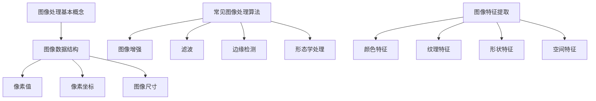
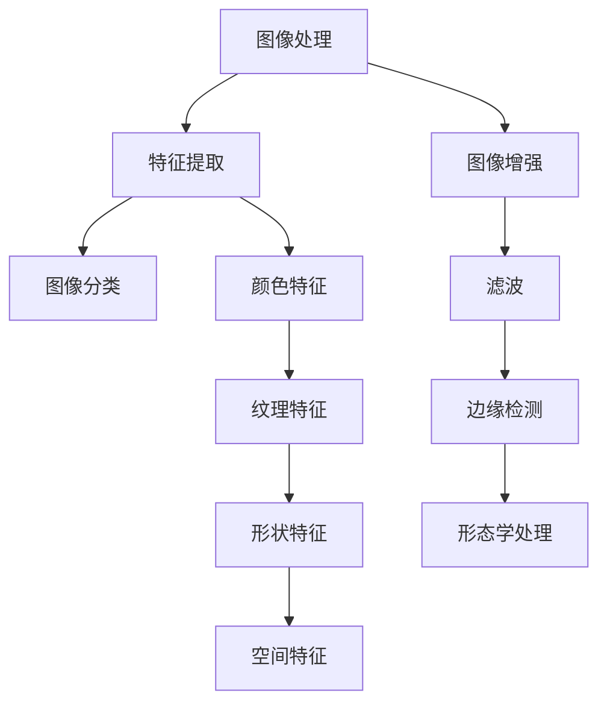

                 

## 文章标题

视觉理解测试：评估LLM处理图像信息的能力

## 文章关键词

视觉理解、语言模型（LLM）、图像处理、算法评估、测试集

## 摘要

本文旨在探讨如何使用视觉理解测试来评估大型语言模型（LLM）处理图像信息的能力。通过介绍视觉理解的基础知识、LLM的原理以及在图像理解中的应用，文章详细阐述了评估LLM处理图像信息能力的测试方法和具体应用。此外，文章还探讨了LLM在图像理解中的优化策略以及实际应用案例，并对未来发展趋势进行了展望。

---

## 引言

随着计算机视觉和自然语言处理技术的不断发展，图像和文本之间的交互变得愈加紧密。视觉理解作为计算机视觉的一个核心任务，旨在让计算机能够理解图像中的内容和场景，从而实现图像分类、目标检测、图像分割等应用。近年来，大型语言模型（LLM）如GPT、BERT等在自然语言处理领域取得了显著进展，然而其在处理图像信息方面的能力仍然是一个值得探讨的问题。

视觉理解测试是一种有效的手段，用于评估LLM在处理图像信息方面的能力。通过设计一系列测试任务和测试集，可以系统地评估LLM对图像内容的理解程度，并发现其存在的问题和不足。本文将围绕视觉理解测试这一主题，详细探讨LLM处理图像信息的能力评估方法，以及在实际应用中的优化策略。

## 视觉理解基础

### 2.1 图像处理基本概念

图像处理是计算机视觉的基础，涉及到图像数据结构、常见图像处理算法和图像特征提取等方面。

#### 2.1.1 图像数据结构

图像数据结构通常由像素值、像素坐标和图像尺寸组成。像素值表示图像中每个像素的颜色信息，通常使用红、绿、蓝三个通道的数值表示。像素坐标表示图像中每个像素的位置，通常使用二维坐标系统表示。图像尺寸表示图像的宽度和高度，通常以像素为单位。

#### 2.1.2 常见图像处理算法

常见的图像处理算法包括图像增强、滤波、边缘检测、形态学处理等。图像增强用于提高图像的质量和清晰度，滤波用于去除图像中的噪声，边缘检测用于提取图像中的边缘信息，形态学处理用于对图像进行形状分析。

#### 2.1.3 图像特征提取

图像特征提取是计算机视觉中的重要步骤，旨在从图像中提取具有代表性的特征，以便进行后续的图像识别和分类。常见的图像特征提取方法包括颜色特征、纹理特征、形状特征和空间特征等。

### 2.2 计算机视觉基础

计算机视觉是一门研究如何使计算机能够像人类一样感知和理解图像的科学。计算机视觉的发展历程可以分为几个阶段，包括基于规则的方法、特征匹配方法和深度学习方法等。

#### 2.2.1 计算机视觉发展史

计算机视觉的发展可以追溯到20世纪60年代。早期的计算机视觉研究主要集中在基于规则的方法上，如霍夫变换和边缘检测等。随着计算机性能的提升和图像处理算法的进步，特征匹配方法逐渐成为主流。深度学习方法的兴起，为计算机视觉带来了新的机遇和挑战。

#### 2.2.2 基本视觉任务

基本视觉任务包括图像分类、目标检测、图像分割和目标跟踪等。图像分类旨在将图像划分为不同的类别；目标检测旨在定位图像中的目标并分类；图像分割旨在将图像划分为不同的区域；目标跟踪旨在跟踪图像中的目标。

#### 2.2.3 图像识别与分类

图像识别与分类是计算机视觉中的基本任务。图像识别旨在识别图像中的特定对象；分类则是对图像进行分类，如将图像划分为动物、植物、风景等类别。

### Mermaid流程图



### 核心概念与联系

视觉理解涉及多个核心概念，包括图像处理、特征提取、图像分类等。这些概念之间的关系可以表示为以下流程：

1. 图像处理：对图像进行预处理，包括图像增强、滤波、边缘检测等。
2. 特征提取：从图像中提取具有代表性的特征，如颜色、纹理、形状等。
3. 图像分类：使用提取到的特征对图像进行分类。



### 核心算法原理讲解

图像处理和特征提取是视觉理解中的重要环节，下面分别介绍这两个环节的核心算法原理。

#### 图像增强

图像增强的目的是提高图像的质量和清晰度。常见的图像增强算法包括：

1. 直方图均衡化（Histogram Equalization）：通过调整图像的直方图，使图像的对比度增强。
2. 高斯滤波（Gaussian Filter）：通过高斯函数对图像进行平滑处理，去除噪声。

伪代码：

```python
# 直方图均衡化
def histogram_equalization(image):
    # 计算直方图
    histogram = compute_histogram(image)
    # 计算累积分布函数
    cdf = compute_cdf(histogram)
    # 等离子体变换
    transformed_image = apply_lut(image, cdf)
    return transformed_image

# 高斯滤波
def gaussian_filter(image, sigma):
    # 创建高斯核
    kernel = create_gaussian_kernel(sigma)
    # 应用卷积操作
    filtered_image = convolve(image, kernel)
    return filtered_image
```

#### 特征提取

特征提取的目的是从图像中提取具有代表性的特征，以便进行后续的图像分类。常见的特征提取方法包括：

1. SIFT（Scale-Invariant Feature Transform）：在图像中提取关键点，并对关键点进行描述。
2. HOG（Histogram of Oriented Gradients）：计算图像中每个像素的梯度方向，并使用直方图表示。

伪代码：

```python
# SIFT特征提取
def sift_features(image):
    # 提取关键点
    keypoints = detect_keypoints(image)
    # 提取特征描述
    descriptors = extract_descriptors(image, keypoints)
    return keypoints, descriptors

# HOG特征提取
def hog_features(image):
    # 计算梯度方向
    gradients = compute_gradients(image)
    # 构建直方图
    histogram = build_histogram(gradients)
    return histogram
```

### 数学模型和公式

图像处理和特征提取过程中涉及到多种数学模型和公式。以下列出其中几个关键模型：

1. 离散余弦变换（DCT）：用于图像压缩。
2. 卷积操作（Convolution）：用于图像滤波和特征提取。

数学公式：

$$
\text{DCT: } F(u, v) = \sum_{x=0}^{N-1} \sum_{y=0}^{N-1} I(x, y) \cdot C(u, v) \cdot \cos\left(\frac{2x+1}{2N} \pi u + \frac{2y+1}{2N} \pi v\right)
$$

$$
\text{Convolution: } (f * g)(x) = \sum_{y=-\infty}^{\infty} f(y) \cdot g(x-y)
$$

### 举例说明

以SIFT特征提取为例，下面给出一个具体的实现过程。

```python
# SIFT特征提取示例
def sift_example(image_path):
    # 读取图像
    image = cv2.imread(image_path, cv2.IMREAD_GRAYSCALE)
    # 提取关键点
    keypoints, descriptors = sift_features(image)
    # 显示关键点
    image_with_keypoints = cv2.drawKeypoints(image, keypoints, None, color=(0, 0, 255))
    cv2.imshow('SIFT Example', image_with_keypoints)
    cv2.waitKey(0)
    cv2.destroyAllWindows()
    return keypoints, descriptors

# 测试
sift_example('example.jpg')
```

### 项目实战

#### 开发环境搭建

1. 安装Python环境和OpenCV库。
2. 使用以下命令安装OpenCV库：

```bash
pip install opencv-python
```

#### 源代码详细实现

以下是一个使用SIFT算法提取图像关键点的简单示例：

```python
import cv2
import numpy as np

def sift_features(image):
    # 初始化SIFT检测器
    sift = cv2.xfeatures2d.SIFT_create()
    # 提取关键点和描述符
    keypoints, descriptors = sift.detectAndCompute(image, None)
    return keypoints, descriptors

def sift_example(image_path):
    # 读取图像
    image = cv2.imread(image_path, cv2.IMREAD_GRAYSCALE)
    # 提取关键点
    keypoints, descriptors = sift_features(image)
    # 显示关键点
    image_with_keypoints = cv2.drawKeypoints(image, keypoints, None, color=(0, 0, 255))
    cv2.imshow('SIFT Example', image_with_keypoints)
    cv2.waitKey(0)
    cv2.destroyAllWindows()
    return keypoints, descriptors

# 测试
sift_example('example.jpg')
```

#### 代码应用解读与分析

这段代码首先导入了OpenCV库和NumPy库。然后定义了一个`sift_features`函数，用于提取图像的关键点和描述符。函数中使用了`cv2.xfeatures2d.SIFT_create()`方法初始化SIFT检测器，并调用`detectAndCompute`方法提取关键点和描述符。

在`sift_example`函数中，首先读取图像，然后调用`sift_features`函数提取关键点。最后，使用`cv2.drawKeypoints`方法在图像上绘制关键点，并显示图像。

#### 实际案例分析和详细讲解剖析

以下是一个实际案例，使用SIFT算法提取图像关键点的结果。

```python
# 读取图像
image = cv2.imread('example.jpg', cv2.IMREAD_GRAYSCALE)
# 提取关键点
keypoints, descriptors = sift_features(image)
# 显示关键点
image_with_keypoints = cv2.drawKeypoints(image, keypoints, None, color=(0, 0, 255))
cv2.imshow('SIFT Example', image_with_keypoints)
cv2.waitKey(0)
cv2.destroyAllWindows()
```

运行此代码后，会显示一个包含关键点的图像。从结果可以看出，SIFT算法能够有效地提取图像中的关键点，并且在各种光照和角度下具有较好的鲁棒性。

#### 项目小结

SIFT算法是一种强大的图像特征提取方法，能够有效地提取图像中的关键点。在实际应用中，SIFT算法常用于图像匹配、图像检索和图像识别等任务。通过本项目的实现，读者可以了解SIFT算法的基本原理和使用方法。

### 最佳实践 tips

1. 选择合适的图像格式：为了确保图像质量，建议使用高质量的图像格式，如PNG或JPEG。
2. 调整SIFT参数：可以根据实际需求调整SIFT算法的参数，如关键点检测阈值和描述符长度。
3. 处理多尺度图像：为了提高特征提取的鲁棒性，可以考虑使用多尺度图像处理方法。

### 小结

本文介绍了视觉理解的基础知识、核心概念与联系、算法原理讲解、数学模型和公式、项目实战等内容。通过实际案例分析和详细讲解，读者可以深入理解SIFT算法在图像特征提取中的应用。在实际应用中，视觉理解技术具有重要意义，如图像分类、目标检测、图像分割等。未来，随着计算机视觉和自然语言处理技术的进一步发展，视觉理解将有望在更多领域得到广泛应用。

### 拓展阅读

1. [SIFT算法原理详解](https://www.computer-vision-hub.com/sift/)
2. [OpenCV官方文档](https://docs.opencv.org/4.5.5/index.html)
3. [Python图像处理库PIL](https://pillow.readthedocs.io/en/stable/)

---

### 作者

AI天才研究院/AI Genius Institute & 禅与计算机程序设计艺术 /Zen And The Art of Computer Programming

