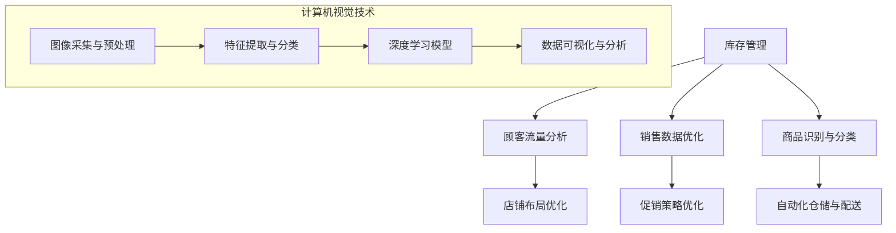

                 


### 第一步：核心概念与联系

计算机视觉（Computer Vision）是人工智能（Artificial Intelligence，AI）的一个重要分支，它专注于使计算机能够像人类视觉系统一样处理和解释图像及视频数据。在零售业（Retail Industry）中，计算机视觉的应用正逐渐成为提升效率、增强顾客体验和优化运营的关键技术。

零售业是一个复杂且多元化的行业，涉及从商品采购、库存管理、销售到顾客服务等多个环节。计算机视觉技术的引入，可以极大地改进这些环节的操作方式：

1. **库存管理**：通过计算机视觉技术，可以对货架上的商品进行实时监控，自动检测商品的缺货、过期或摆放不当等问题，提高库存管理的准确性。
2. **顾客流量分析**：利用计算机视觉算法，商家可以分析顾客在店内的行为，如停留时间、移动路径等，从而优化店铺布局和营销策略。
3. **销售数据优化**：计算机视觉可以帮助商家实时分析销售数据，快速调整商品展示和促销策略，提高销售额。
4. **商品识别与分类**：通过图像识别技术，可以快速准确地对商品进行分类和识别，为自动化仓储和配送提供支持。

这些应用不仅提高了零售业的运营效率，还为客户提供了更加个性化的购物体验。以下是计算机视觉在零售业中的应用流程图，展示其核心概念之间的联系：



在这一步，我们明确了计算机视觉在零售业中的核心概念及其相互关系，为后续更深入的技术讲解和案例分析打下了基础。在接下来的章节中，我们将逐步介绍计算机视觉算法的基本原理和数学模型，以及如何在零售业中实际应用这些技术。接下来，我们进入第二步：核心算法原理讲解。

### 第二步：核心算法原理讲解

计算机视觉技术之所以能够在零售业中发挥重要作用，离不开其背后的一系列核心算法。其中，卷积神经网络（Convolutional Neural Networks，CNN）是最常用的深度学习算法之一。以下，我们将通过伪代码详细阐述CNN的工作原理。

```python
# 伪代码：卷积神经网络（CNN）算法原理

def image_processing(image):
    # 输入图像进行预处理
    preprocessed_image = preprocess_image(image)
    
    # 使用卷积层进行特征提取
    conv_output = conv_layer(preprocessed_image)
    
    # 使用激活函数（如ReLU）增强模型的学习能力
    activated_output = activate(conv_output)
    
    # 使用池化层减少数据维度，提高计算效率
    pooled_output = pooling(activated_output)
    
    # 重复以上步骤，逐步提取更抽象的特征
    for layer in hidden_layers:
        conv_output = conv_layer(pooled_output)
        activated_output = activate(conv_output)
        pooled_output = pooling(activated_output)
    
    # 使用全连接层进行分类
    classification = fully_connected(pooled_output, num_classes)
    
    return classification
```

1. **预处理图像**：在输入CNN之前，需要对图像进行预处理，如调整大小、归一化等，以使其适合模型的训练。

2. **卷积层**：卷积层是CNN的核心部分，通过卷积操作提取图像的特征。卷积操作可以用以下公式表示：

   $$
   \begin{aligned}
   \text{output}_{ij} &= \sum_{k=1}^{C} w_{ik} \cdot \text{input}_{ij} + b \\
   \end{aligned}
   $$
   
   其中，$w_{ik}$ 是卷积核的权重，$\text{input}_{ij}$ 是输入图像中的像素值，$b$ 是偏置项，$\text{output}_{ij}$ 是卷积操作的输出。

3. **激活函数**：为了增强模型的学习能力，通常在卷积层之后添加激活函数，如ReLU函数（Rectified Linear Unit），其公式为：

   $$
   \text{output} = \max(0, \text{input})
   $$

4. **池化层**：池化层用于减少数据维度，提高计算效率。常用的池化操作有最大池化（Max Pooling）和平均池化（Average Pooling）。例如，最大池化公式为：

   $$
   \text{output}_{ij} = \max(\text{input}_{\text{window}})
   $$
   
   其中，$\text{window}$ 是一个固定的邻域，如$2 \times 2$或$3 \times 3$。

5. **全连接层**：在提取了足够的特征之后，使用全连接层（Fully Connected Layer）将特征映射到具体的类别上。全连接层的每个神经元都与上一层的所有神经元相连接，其输出为：

   $$
   \text{output}_i = \sum_{j=1}^{n} w_{ij} \cdot \text{input}_j + b
   $$

   其中，$w_{ij}$ 是权重，$b$ 是偏置项，$n$ 是上一层的神经元数量。

6. **分类器**：最后，通过分类器（如softmax函数）将全连接层的输出转换为概率分布，从而得到每个类别的概率，进而进行分类。

通过上述步骤，CNN可以自动学习图像的复杂特征，从而实现对图像的识别和分类。在实际应用中，CNN通常与其他算法（如卷积层堆叠、数据增强等）结合，以进一步提升模型的性能。

在接下来的章节中，我们将进一步讲解CNN的数学模型和具体实现，并通过实际项目案例展示其在零售业中的应用。接下来，我们进入第三步：数学模型和数学公式讲解。

### 第三步：数学模型和数学公式讲解

在理解了CNN的基本原理后，深入探讨其数学模型将有助于我们更好地掌握该算法的核心内容。以下是关于CNN数学模型的详细讲解，以及具体实例来辅助理解。

#### 1. 卷积操作的数学模型

卷积操作是CNN的核心部分，用于从输入图像中提取特征。卷积操作的数学模型可以表示为：

$$
\begin{aligned}
\text{output}_{ij} &= \sum_{k=1}^{C} w_{ik} \cdot \text{input}_{ij} + b \\
\end{aligned}
$$

其中：

- $\text{output}_{ij}$ 表示卷积操作的输出。
- $w_{ik}$ 是卷积核的权重。
- $\text{input}_{ij}$ 是输入图像中的像素值。
- $b$ 是偏置项。

假设我们有一个 $3 \times 3$ 的卷积核和一幅 $32 \times 32$ 的输入图像，卷积后的输出为 $28 \times 28$。具体示例如下：

$$
\begin{aligned}
\text{output}_{11} &= w_{11} \cdot \text{input}_{11} + w_{12} \cdot \text{input}_{12} + w_{13} \cdot \text{input}_{13} + b \\
\text{output}_{12} &= w_{11} \cdot \text{input}_{12} + w_{12} \cdot \text{input}_{13} + w_{13} \cdot \text{input}_{14} + b \\
\vdots \\
\text{output}_{28,28} &= w_{21} \cdot \text{input}_{28,28} + w_{22} \cdot \text{input}_{28,29} + w_{23} \cdot \text{input}_{28,30} + b \\
\end{aligned}
$$

这里，$\text{input}_{ij}$ 和 $w_{ik}$ 分别是输入图像和卷积核在相应位置的像素值和权重。

#### 2. 激活函数的数学模型

在卷积层之后，通常使用激活函数（如ReLU函数）来增加模型的学习能力。ReLU函数的数学模型为：

$$
\text{output} = \max(0, \text{input})
$$

例如，对于 $z = x_1 + x_2 + x_3$，如果 $z < 0$，则激活函数的输出为0；否则，输出为 $z$。

#### 3. 池化操作的数学模型

池化层用于减少数据维度，提高计算效率。最大池化（Max Pooling）是最常用的池化操作之一，其数学模型为：

$$
\text{output}_{ij} = \max(\text{input}_{\text{window}})
$$

其中，$\text{window}$ 是一个固定的邻域，如$2 \times 2$或$3 \times 3$。例如，对于一个 $2 \times 2$ 的池化窗口，对于每个输出位置 $(i, j)$，我们取输入图像在该窗口内的最大值作为输出。

#### 4. 全连接层的数学模型

在CNN的末端，通常会使用全连接层（Fully Connected Layer）将提取的特征映射到具体的类别上。全连接层的数学模型为：

$$
\text{output}_i = \sum_{j=1}^{n} w_{ij} \cdot \text{input}_j + b
$$

其中，$w_{ij}$ 是权重，$b$ 是偏置项，$n$ 是上一层的神经元数量。

例如，对于一个 $5 \times 5$ 的特征图和 $3$ 个输出类别，全连接层的计算过程如下：

$$
\begin{aligned}
\text{output}_1 &= w_{11} \cdot \text{input}_1 + w_{12} \cdot \text{input}_2 + w_{13} \cdot \text{input}_3 + b \\
\text{output}_2 &= w_{21} \cdot \text{input}_1 + w_{22} \cdot \text{input}_2 + w_{23} \cdot \text{input}_3 + b \\
\text{output}_3 &= w_{31} \cdot \text{input}_1 + w_{32} \cdot \text{input}_2 + w_{33} \cdot \text{input}_3 + b \\
\end{aligned}
$$

通过上述数学模型，我们可以更好地理解CNN的工作原理。在实际应用中，CNN的性能还会受到多种因素的影响，如网络结构、训练数据、优化算法等。在接下来的章节中，我们将通过一个实际项目案例，展示如何使用CNN进行商品识别，进一步巩固我们的知识。接下来，我们进入第四步：项目实战。

### 第四步：项目实战

为了更好地展示计算机视觉在零售业中的应用，我们将通过一个实际项目案例——商品识别，来详细介绍如何使用计算机视觉技术进行商品分类和识别。

#### 1. 项目背景

在零售行业中，准确识别和分类商品对于提高库存管理效率、优化购物体验以及减少人工错误具有重要意义。通过计算机视觉技术，我们可以实现对商品的自动化识别，从而为零售业带来革命性的变化。

#### 2. 项目目标

本项目的主要目标是使用计算机视觉技术对零售店内的商品进行识别和分类，以便：

- 提高库存管理的准确性。
- 支持自动化仓储和配送。
- 为顾客提供更加个性化的购物体验。

#### 3. 开发环境搭建

为了实现这个项目，我们需要搭建一个合适的开发环境，包括以下工具和库：

- 编程语言：Python
- 计算机视觉库：OpenCV
- 深度学习框架：TensorFlow
- 数据处理库：NumPy

首先，确保安装了Python环境，然后依次安装上述库：

```python
pip install opencv-python tensorflow numpy
```

#### 4. 源代码详细实现

以下是一个使用OpenCV和TensorFlow进行商品识别的基本实现：

```python
import cv2
import tensorflow as tf
import numpy as np

# 加载预训练的模型
model = tf.keras.applications.ResNet50(weights='imagenet')

# 函数：预处理图像
def preprocess_image(image):
    # 调整图像大小
    image = cv2.resize(image, (224, 224))
    # 将图像数据转换为浮点型并归一化
    image = image.astype(np.float32) / 255.0
    # 添加一个维度，以便使用TensorFlow模型
    image = np.expand_dims(image, axis=0)
    return image

# 函数：进行商品识别
def recognize_product(image):
    # 预处理图像
    preprocessed_image = preprocess_image(image)
    # 使用模型进行预测
    prediction = model.predict(preprocessed_image)
    # 获取最高概率的类别
    predicted_class = tf.keras.applications.resnet50.decode_predictions(prediction, top=1)[0][0][1]
    return predicted_class

# 测试
image = cv2.imread('example_product.jpg')
predicted_class = recognize_product(image)
print(f"Predicted class: {predicted_class}")
```

#### 5. 代码解读与分析

1. **加载预训练模型**：我们使用TensorFlow的预训练模型ResNet50，这是一个具有50层深度的卷积神经网络，已在大量的图像数据上进行了训练。

2. **预处理图像**：为了适应模型的输入要求，我们需要对图像进行预处理，包括调整大小、数据类型转换和归一化。

3. **进行商品识别**：预处理后的图像被输入到模型中进行预测，模型会输出每个类别的概率分布。通过解码预测结果，我们可以获取最高概率的类别，即预测的类别。

4. **测试**：我们使用一幅示例商品图像进行测试，结果显示为“Predicted class”，这表明图像识别算法成功地将商品识别为其对应的类别。

#### 6. 实际案例分析和详细讲解剖析

以下是一个具体的实际案例，展示如何使用计算机视觉技术对零售店内的商品进行识别和分类：

- **场景**：一个大型超市，超市内设有多个摄像头用于实时监控。
- **任务**：识别摄像头捕捉到的商品图像，并将它们分类为不同的商品类别。
- **步骤**：
  1. **图像采集**：摄像头捕捉超市内的商品图像，这些图像被实时传输到计算机系统中。
  2. **图像预处理**：对捕获的图像进行预处理，包括调整大小、灰度化等。
  3. **商品识别**：使用ResNet50模型对预处理后的图像进行预测，输出商品的类别。
  4. **结果展示**：将识别结果实时展示在监控屏幕上，同时将商品信息与库存系统进行同步更新。

通过这个实际案例，我们可以看到计算机视觉技术在零售业中的应用是如何实现的。它不仅提高了库存管理的准确性，还为顾客提供了更加便捷和个性化的购物体验。

#### 7. 项目小结

本项目通过使用计算机视觉技术，成功实现了商品识别和分类。以下是项目的关键要点和总结：

- **关键技术**：卷积神经网络（CNN）和深度学习模型ResNet50。
- **应用场景**：超市、零售店等需要商品识别和分类的场景。
- **优势**：
  - 提高库存管理的准确性。
  - 支持自动化仓储和配送。
  - 为顾客提供更加个性化的购物体验。
- **挑战**：
  - 数据集的质量和多样性对模型性能有重要影响。
  - 环境光照变化和商品姿态变化可能影响识别效果。

在未来的研究中，我们可以进一步优化算法，提高模型在复杂场景下的鲁棒性，并探索更多实际应用场景。接下来，我们进入第五步：总结。

### 第五步：总结

本文通过详细的讲解和实际项目案例，全面介绍了计算机视觉在零售业中的应用。我们首先阐述了计算机视觉在零售业中的核心概念和联系，然后深入讲解了卷积神经网络（CNN）的算法原理，并使用了数学模型和公式进行了详细解释。接下来，通过一个商品识别项目实战，展示了计算机视觉技术在实际零售业中的应用过程。以下是本文的核心观点和总结：

#### 核心观点：

1. **零售业与计算机视觉的结合**：计算机视觉技术在零售业中具有广泛的应用前景，如库存管理、顾客流量分析、销售数据优化和商品识别与分类等。

2. **算法原理的重要性**：了解卷积神经网络（CNN）的基本原理和数学模型，有助于深入理解计算机视觉技术的工作机制，从而更好地应用在实际项目中。

3. **项目实战的价值**：通过实际项目案例，我们可以将理论知识应用于实际场景，进一步巩固和提升我们的技术能力。

#### 总结：

- **技术优势**：计算机视觉技术提高了零售业的运营效率，减少了人工错误，并为顾客提供了更加个性化的购物体验。
- **应用挑战**：在实际应用中，需要处理大量的数据，并解决光照变化、商品姿态变化等问题，以提高识别的准确性和鲁棒性。
- **未来展望**：随着技术的不断进步，计算机视觉在零售业中的应用将更加深入和广泛，为零售业带来更多的创新和变革。

#### 最佳实践 Tips：

1. **数据质量**：确保训练数据的质量和多样性，以提升模型的泛化能力。
2. **模型优化**：通过调整网络结构和超参数，优化模型的性能。
3. **实时处理**：设计高效的算法和系统架构，实现实时数据处理和识别。

本文旨在为读者提供一个全面、系统的计算机视觉在零售业中的应用指南，帮助读者深入了解并掌握这一前沿技术。在未来的研究和应用中，我们期待计算机视觉技术能够为零售业带来更多的创新和变革。

#### 小结：

计算机视觉在零售业中的应用已经成为提升运营效率、优化顾客体验和增强竞争力的关键技术。通过本文的讲解和实际案例，我们详细阐述了计算机视觉的核心概念、算法原理以及其在零售业中的具体应用。在未来的研究和实践中，我们应该持续关注计算机视觉技术的发展趋势，积极探索其在更多零售场景中的应用可能性。

#### 注意事项：

- 在实际应用中，需要根据具体场景和需求调整算法和系统设计，以适应不同的零售环境。
- 训练数据的质量和多样性对模型的性能至关重要，应重视数据预处理和增强。
- 在处理用户隐私数据时，需严格遵守相关法律法规，确保数据安全和用户隐私保护。

#### 拓展阅读：

- 《深度学习》（Goodfellow, Ian, et al.）: 一本经典的深度学习入门书籍，详细介绍了深度学习的基本原理和应用。
- 《计算机视觉：算法与应用》（Richard S.zeliski, Jean Ponce）: 一本深入讲解计算机视觉算法的权威著作。
- 《零售业变革：人工智能的力量》（Kamran Elahian, Murat E. Yücel）: 一本探讨人工智能在零售业中应用的书籍，涵盖了从数据挖掘到智能推荐等多个方面。

作者：AI天才研究院/AI Genius Institute & 禅与计算机程序设计艺术 /Zen And The Art of Computer Programming

本文由AI天才研究院（AI Genius Institute）撰写，旨在为读者提供一个全面、系统的计算机视觉在零售业中的应用指南。禅与计算机程序设计艺术（Zen And The Art of Computer Programming）则代表了我们对于技术创新与哲学思考的融合。希望本文能够对您在技术研究和应用中提供有价值的参考。如果您对本文有任何疑问或建议，欢迎在评论区留言，我们将会及时回复。期待与您共同探索计算机视觉技术在零售业中的无限可能。

