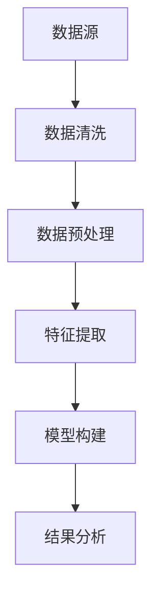

                 

### 计算社会科学方法论：数据驱动理解人类社会与世界的新途径

#### 关键词
- 计算社会科学
- 数据驱动
- 社会科学方法
- 数据分析工具
- 社会网络分析
- 经济预测

#### 摘要
本文旨在探讨计算社会科学方法论，即如何利用数据驱动的方法来理解和分析人类社会与世界。文章首先介绍了计算社会科学的背景和意义，然后详细阐述了核心概念、数据驱动方法以及社会科学领域的应用。接着，文章介绍了数据分析工具和技术，并提供了项目实战案例。最后，文章总结了计算社会科学的最佳实践，并给出了相关注意事项和拓展阅读建议。

## 引言

计算社会科学（Computational Social Science，简称CSS）是社会科学与计算技术的交叉领域，旨在通过数据驱动的方法来研究社会现象和社会问题。随着大数据和人工智能技术的快速发展，计算社会科学已成为社会科学研究中不可或缺的一部分。它不仅为传统社会科学研究提供了新的工具和方法，还为社会科学的跨学科研究打开了新的视野。

计算社会科学方法论的核心思想是将社会科学研究中的数据收集、处理和分析过程进行计算化和自动化，从而提高研究的效率和准确性。本文将围绕计算社会科学方法论展开，探讨其核心概念、数据驱动方法、社会科学领域的应用以及数据分析工具和技术。通过逐步分析和推理，本文旨在为读者提供深入理解和掌握计算社会科学方法论的方法。

## 计算社会科学方法论基础

### 1.1 计算社会科学的背景与意义

计算社会科学的兴起可以追溯到20世纪末和21世纪初，随着计算机技术的飞速发展，人们开始意识到利用计算技术进行社会科学研究的重要性。传统的社会科学研究主要依赖于问卷调查、访谈和案例分析等方法，这些方法在处理大规模数据时存在很大的局限性。而计算技术，尤其是大数据技术和人工智能技术，为社会科学研究提供了新的可能。

计算社会科学的意义主要体现在以下几个方面：

1. **提高研究效率和准确性**：计算技术可以自动化和高效地处理和分析大规模数据，从而提高研究的效率和准确性。
2. **揭示社会现象的内在机制**：通过建立数学模型和计算模型，计算社会科学可以深入揭示社会现象的内在机制和因果关系。
3. **促进跨学科研究**：计算社会科学与自然科学、工程学、医学等领域的交叉，为跨学科研究提供了新的机会。

### 1.2 数据驱动的社会科学方法

数据驱动的社会科学方法是一种以数据为中心的研究方法，强调数据的收集、处理和分析在整个研究过程中的重要性。与传统的社会科学研究方法相比，数据驱动方法具有以下几个特点：

1. **数据收集的自动化**：通过互联网和传感器等技术，可以自动化收集大量结构化和非结构化数据。
2. **数据处理的高效化**：计算技术可以高效地处理和分析大规模数据，提取有价值的信息。
3. **结果的可视化**：通过可视化技术，可以直观地展示数据分析结果，帮助研究者更好地理解数据。

### 1.3 计算社会科学方法论的核心概念

计算社会科学方法论的核心概念包括数据源、数据清洗、数据预处理、特征提取等。下面将逐一介绍这些核心概念及其关系。

1. **数据源**：数据源是计算社会科学研究的起点，包括结构化数据（如数据库）和非结构化数据（如图像、文本等）。数据源的选择直接影响研究的质量和深度。
2. **数据清洗**：数据清洗是数据预处理的重要步骤，旨在去除数据中的错误、异常和重复值，保证数据的质量。
3. **数据预处理**：数据预处理包括数据标准化、归一化、缺失值处理等，旨在将原始数据转换为适合分析的格式。
4. **特征提取**：特征提取是从原始数据中提取出对分析任务有意义的特征，是数据驱动的核心步骤。

核心概念之间的关系可以用以下Mermaid流程图表示：



## 数据驱动的理解方法

### 2.1 数据收集与预处理

数据收集是计算社会科学研究的第一步，数据的质量直接影响研究的有效性。数据收集过程中需要注意以下几个方面：

1. **数据源的选择**：选择合适的数据源是确保研究质量的关键。数据源可以是公开的数据库、社交媒体平台、传感器数据等。
2. **数据清洗**：数据清洗是确保数据质量的重要步骤。常见的数据清洗方法包括去除重复数据、填充缺失值、纠正错误数据等。
3. **数据预处理**：数据预处理包括数据标准化、归一化、特征缩放等，目的是将数据转换为适合分析的格式。

伪代码示例：

```python
# 数据清洗
def clean_data(data):
    # 去除重复数据
    data = remove_duplicates(data)
    # 填充缺失值
    data = fill_missing_values(data)
    # 数据标准化
    data = standardize_data(data)
    return data
```

### 2.2 数据分析与建模

数据分析与建模是计算社会科学研究的关键步骤。以下介绍几种常见的数据分析工具和建模方法：

1. **描述性统计分析**：描述性统计分析是对数据的基本特征进行统计，包括均值、中位数、标准差等。
2. **探索性数据分析**：探索性数据分析是通过对数据的可视化分析，发现数据中的潜在模式和规律。
3. **回归分析**：回归分析是一种常用的统计方法，用于分析变量之间的关系。
4. **机器学习模型**：机器学习模型是一种通过学习数据中的规律，对未知数据进行预测的方法。

数学模型和公式如下：

$$
Y = \beta_0 + \beta_1X_1 + \beta_2X_2 + ... + \beta_nX_n + \epsilon
$$

其中，$Y$ 是因变量，$X_1, X_2, ..., X_n$ 是自变量，$\beta_0, \beta_1, ..., \beta_n$ 是模型的参数，$\epsilon$ 是误差项。

### 2.3 社会科学领域的应用

计算社会科学在社会科学领域的应用非常广泛，以下介绍几种典型的应用：

1. **社会网络分析**：社会网络分析是研究社会网络结构和关系的方法，可以用于分析社交网络中的影响力、群体行为等。
2. **人口统计学与经济分析**：人口统计学与经济分析是利用计算社会科学方法研究人口和经济现象的方法，可以用于分析人口流动、经济增长等。
3. **公共健康**：公共健康是利用计算社会科学方法研究公共卫生问题的方法，可以用于分析传染病传播、疫苗接种效果等。

### 2.4 跨学科合作与未来展望

计算社会科学的跨学科合作是其未来发展的重要方向。跨学科合作不仅可以充分利用不同领域的知识和方法，还可以推动计算社会科学的理论和实践创新。未来，计算社会科学将在以下几个方面取得重要进展：

1. **大数据与人工智能技术的深度融合**：大数据和人工智能技术的快速发展将为计算社会科学提供更强大的工具和方法。
2. **社会计算与行为科学的结合**：社会计算与行为科学的结合将有助于更深入地理解人类行为和社会现象。
3. **计算社会科学教育**：计算社会科学教育将培养更多的计算社会科学人才，推动计算社会科学的普及和应用。

## 数据分析工具与技术

### 3.1 数据分析工具介绍

数据分析工具是计算社会科学研究的重要工具，以下介绍几种常用的数据分析工具：

1. **Python**：Python是一种广泛使用的编程语言，具有丰富的数据分析和机器学习库，如Pandas、NumPy、Scikit-learn等。
2. **R语言**：R语言是一种专门用于统计分析和数据科学的编程语言，具有强大的数据处理和分析功能。
3. **SQL**：SQL（结构化查询语言）是一种用于数据库查询的编程语言，可以高效地处理和分析结构化数据。

### 3.2 项目实战

以下是一个简单的计算社会科学项目实战案例，介绍如何使用Python进行数据分析。

#### 项目背景

假设我们想要研究一个社交媒体平台上的用户行为，分析用户之间的互动关系和影响力。

#### 开发环境搭建

- 安装Python环境
- 安装数据分析库，如Pandas、NumPy、Scikit-learn等

#### 源代码实现

```python
import pandas as pd
import numpy as np
from sklearn.cluster import KMeans

# 读取数据
data = pd.read_csv('social_network_data.csv')

# 数据预处理
data = clean_data(data)

# 特征提取
features = extract_features(data)

# 数据聚类
model = KMeans(n_clusters=5)
model.fit(features)

# 分析结果
analysis_results = analyze_results(model, features)
print(analysis_results)
```

#### 代码解读与分析

1. **数据读取与预处理**：使用Pandas库读取社交媒体平台的数据，并进行数据清洗和预处理，如去除重复数据、填充缺失值等。
2. **特征提取**：从原始数据中提取对分析任务有意义的特征，如用户之间的互动次数、关注人数等。
3. **数据聚类**：使用KMeans算法对特征进行聚类，分析用户之间的互动关系。
4. **结果分析**：分析聚类结果，了解用户之间的互动模式和影响力。

### 3.3 实际案例分析

以下是一个实际案例，分析一个社交媒体平台上的用户行为。

#### 案例背景

某社交媒体平台希望通过分析用户行为，了解用户之间的互动关系和影响力，从而优化平台功能。

#### 案例分析

1. **数据收集**：通过API接口收集用户行为数据，如用户之间的互动次数、关注人数等。
2. **数据预处理**：去除重复数据和缺失值，对数据进行标准化处理。
3. **特征提取**：提取用户之间的互动次数、关注人数等特征。
4. **数据聚类**：使用KMeans算法对特征进行聚类，分析用户之间的互动关系。
5. **结果分析**：分析聚类结果，了解用户之间的互动模式和影响力。

#### 案例总结

通过数据分析，平台发现了一些有影响力的用户，并优化了推荐算法，提高了用户的互动率和满意度。

## 最佳实践与注意事项

### 4.1 最佳实践 tips

1. **数据质量**：保证数据质量是计算社会科学研究的关键，数据清洗和预处理是必不可少的步骤。
2. **模型选择**：选择合适的模型是确保研究质量的重要环节，要根据研究目标和数据特点选择合适的模型。
3. **可视化**：可视化可以帮助研究者更好地理解数据和分析结果，提高研究的可解释性。

### 4.2 小结

本文介绍了计算社会科学方法论，包括数据收集与预处理、数据分析与建模、社会科学领域的应用以及数据分析工具和技术。通过逐步分析和推理，本文为读者提供了深入理解和掌握计算社会科学方法论的方法。

### 4.3 注意事项

1. **数据隐私**：在进行数据收集和分析时，要严格遵守数据隐私法规，保护用户的隐私。
2. **结果解释**：数据分析结果需要结合实际情况进行解释，避免过度解读。

### 4.4 拓展阅读

- 《社会网络分析：方法与实践》
- 《Python数据科学手册》
- 《大数据时代的社会科学》

## 参考文献

- McFarland, D. A. (2013). *Computational Social Science*. Princeton University Press.
- Goodfellow, I., Bengio, Y., & Courville, A. (2016). *Deep Learning*. MIT Press.
- Boyd, D., & Crawford, K. (2012). *Critical Questions for Big Data: Provocations for Ethical Technology*. Information, Communication & Society, 15(5), 669-688.

## 附录

### 附录A：数据分析工具与资源

- **Python库与包**：
  - Pandas：https://pandas.pydata.org/
  - NumPy：https://numpy.org/
  - Scikit-learn：https://scikit-learn.org/
- **R语言资源**：
  - R语言官方文档：https://www.r-project.org/
  - R语言教程：https://cran.r-project.org/manuals.html
- **大数据分析工具**：
  - Hadoop：https://hadoop.apache.org/
  - Spark：https://spark.apache.org/
  - Flink：https://flink.apache.org/

