                 

### 文章标题：计算社会科学方法：数据驱动理解人类社会与世界

### 关键词：计算社会科学、数据驱动、社会网络分析、机器学习、复杂性理论、大数据分析

### 摘要：

本文旨在探讨计算社会科学方法在理解和分析人类社会与世界的应用。通过数据驱动的视角，我们结合了计算科学、社会网络分析、机器学习和复杂性理论，提出了一系列研究框架和方法。文章首先介绍了计算社会科学的背景与意义，随后详细阐述了数据科学基础、社会网络分析、机器学习在社会科学中的应用，以及复杂性理论的实践。最后，文章展望了计算社会科学的未来发展趋势，并提供了实际案例和实战指南，以期为研究人员和实践者提供有价值的参考。

## 目录

### 《计算社会科学方法：数据驱动理解人类社会与世界》

> 关键词：计算社会科学、数据驱动、社会网络分析、机器学习、复杂性理论、大数据分析

> 摘要：本文介绍了计算社会科学方法在理解和分析人类社会与世界的应用。结合计算科学、社会网络分析、机器学习和复杂性理论，提出了数据驱动的研究框架和方法。

### 第1章 绪论

### 1.1 研究背景与意义

### 1.2 计算社会科学的定义与范围

### 1.3 计算社会科学的核心概念

### 第2章 数据科学基础

### 2.1 数据类型与数据源

### 2.2 数据预处理

### 2.3 数据分析方法

### 第3章 社会网络分析

### 3.1 社会网络理论基础

### 3.2 社会网络分析方法

### 3.3 社会网络在实际中的应用

### 第4章 机器学习在社会科学研究中的应用

### 4.1 机器学习基础

### 4.2 机器学习在社会科学中的应用

### 4.3 案例研究

### 第5章 复杂性与适应性系统理论

### 5.1 复杂性与适应性系统概述

### 5.2 复杂性与适应性系统在社会科学中的应用

### 5.3 案例研究

### 第6章 大数据和计算社会科学的未来发展趋势

### 6.1 大数据的挑战与机遇

### 6.2 计算社会科学的未来发展

### 6.3 潜在的研究领域与前沿

### 第7章 计算社会科学方法实践

### 7.1 实践项目概述

### 7.2 数据分析实践

### 7.3 结果解读与报告

### 附录

### 7.1 计算社会科学方法工具与资源

### 7.2 案例研究资料

## 第1章 绪论

### 1.1 研究背景与意义

#### 社会科学与计算科学的融合趋势

随着信息技术的迅猛发展，计算科学在各个领域取得了显著的成果，特别是在数据密集型应用中。同时，社会科学对人类行为、社会结构、政策制定等方面的研究需求日益增长。这使得社会科学与计算科学的融合成为当前研究的热点。

**Mermaid 流程图**：

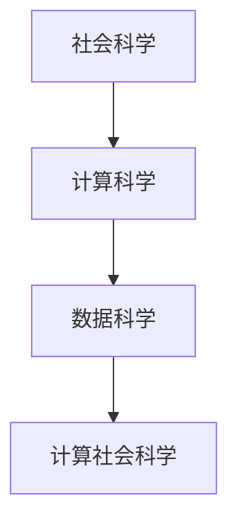

#### 数据在社会科学研究中的重要性

数据作为社会科学研究的核心资源，其质量和规模直接影响研究的深度和广度。大数据时代的到来，使得海量数据的处理和分析成为可能，为社会科学研究提供了丰富的数据来源。

**核心概念与联系**：

- **计算科学**：运用计算机技术解决科学问题的学科。
- **社会科学**：研究人类社会行为的学科。
- **数据驱动**：利用数据进行科学研究和决策。

**Mermaid 流程图**：


### 1.2 计算社会科学的定义与范围

#### 计算社会科学的定义

计算社会科学是一门跨学科领域，它将计算科学的方法应用于社会科学研究，旨在通过数据分析、算法模型等方法，深入理解和解释人类社会行为。

**核心概念与联系**：

- **计算社会科学**：将计算机科学与社会科学相结合，利用数据分析、算法模型等方法进行研究。
- **数据驱动的社会科学研究**：通过数据分析和模型构建，驱动社会科学研究。
- **计算社会科学的方法论**：包括数据科学、社会网络分析、机器学习等。

**Mermaid 流程图**：

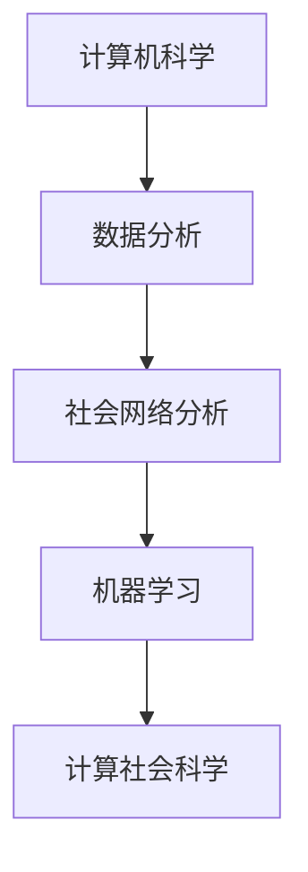

#### 计算社会科学的范围

计算社会科学涵盖了多个领域，包括社会网络分析、大数据分析、机器学习、复杂性理论等。其研究范围广泛，涉及社会学、心理学、经济学、政治学等多个学科。

**核心概念与联系**：

- **社会网络分析**：研究社会关系和网络结构的学科。
- **大数据分析**：处理和分析大规模数据的学科。
- **机器学习**：一种人工智能方法，通过数据训练模型进行预测和决策。
- **复杂性理论**：研究复杂系统行为的学科。

**Mermaid 流程图**：

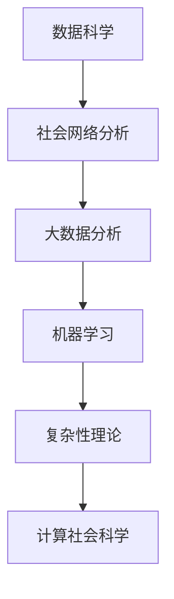

### 1.3 计算社会科学的核心概念

#### 数据科学

数据科学是计算社会科学的基础，它涉及数据的收集、预处理、分析和解释。通过数据科学方法，研究者可以从海量数据中提取有价值的信息，为社会科学研究提供数据支持。

**核心概念与联系**：

- **数据收集**：通过各种渠道获取数据。
- **数据预处理**：清洗、整合、转换数据，使其适合分析。
- **数据分析**：使用统计方法和算法对数据进行分析。
- **数据解释**：解读分析结果，得出科学结论。

**伪代码**：

```python
def data_science(data):
    # 数据收集
    collected_data = collect_data()

    # 数据预处理
    cleaned_data = preprocess_data(collected_data)

    # 数据分析
    analyzed_data = analyze_data(cleaned_data)

    # 数据解释
    explanation = explain_data(analyzed_data)

    return explanation
```

**数学模型和公式**：

$$
y = f(x)
$$

其中，$y$ 是分析结果，$x$ 是输入数据，$f$ 是数据分析算法。

**举例说明**：

假设我们收集了某城市居民的消费数据，通过数据科学方法，我们可以分析出居民的消费习惯和偏好，为市场营销提供数据支持。

#### 社会网络分析

社会网络分析是计算社会科学的重要组成部分，它研究社会关系和网络结构。通过社会网络分析，研究者可以揭示社会网络的特性，如节点的重要性、社团结构等。

**核心概念与联系**：

- **节点**：社会网络中的个体。
- **边**：社会网络中个体之间的关系。
- **中心性度量**：衡量节点在社交网络中的重要程度。
- **社团检测**：识别社交网络中的紧密联系群体。

**伪代码**：

```python
def social_network_analysis(network):
    # 节点重要性分析
    centrality = calculate_centrality(network)

    # 社团检测
    communities = detect_communities(network)

    return centrality, communities
```

**数学模型和公式**：

$$
C(i) = \frac{d(j)}{N}
$$

其中，$C(i)$ 是节点 $i$ 的中心性度量，$d(j)$ 是节点 $i$ 的邻居节点数，$N$ 是网络中节点的总数。

**举例说明**：

通过社会网络分析，我们可以了解某社交网络中的核心成员和紧密联系群体，为社交平台运营提供策略建议。

#### 复杂性与适应性系统理论

复杂性与适应性系统理论是研究复杂系统行为的学科，它关注系统的演化、适应性和复杂性。在计算社会科学中，复杂性与适应性系统理论可以帮助我们理解社会系统的演化过程和适应性机制。

**核心概念与联系**：

- **复杂性**：系统内部结构的复杂性和不确定性。
- **适应性**：系统对外部环境变化的适应能力。
- **系统演化**：系统从简单到复杂的过程。

**伪代码**：

```python
def complexity_analysis(system):
    # 系统演化分析
    evolution = analyze_evolution(system)

    # 系统适应性分析
    adaptability = analyze_adaptability(system)

    return evolution, adaptability
```

**数学模型和公式**：

$$
\frac{dX}{dt} = f(X)
$$

其中，$X$ 是系统状态，$f(X)$ 是系统演化方程。

**举例说明**：

通过复杂性与适应性系统理论，我们可以分析某经济系统的演化过程和适应性机制，为政策制定提供科学依据。

## 第2章 数据科学基础

### 2.1 数据类型与数据源

#### 结构化数据

结构化数据是具有固定格式和一致结构的数据，如关系数据库中的数据表。结构化数据便于存储、查询和管理，是数据科学中常用的一种数据类型。

**核心概念与联系**：

- **关系数据库**：存储和管理结构化数据的系统。
- **数据表**：关系数据库中的基本存储单元。

**伪代码**：

```python
def query_database(database, query):
    result = database.query(query)
    return result
```

**举例说明**：

通过查询关系数据库，我们可以获取特定用户的信息，如姓名、年龄、地址等。

#### 非结构化数据

非结构化数据是没有固定格式和一致结构的数据，如文本、图像、音频等。非结构化数据难以存储、查询和管理，但通过数据科学方法，我们可以从中提取有价值的信息。

**核心概念与联系**：

- **文本**：自然语言文本数据。
- **图像**：图像数据。
- **音频**：音频数据。

**伪代码**：

```python
def extract_features(data):
    features = extract(data)
    return features
```

**举例说明**：

通过文本分析，我们可以提取出文本中的关键词和主题，为自然语言处理提供基础。

#### 实时数据与历史数据

实时数据是在特定时间点收集的数据，如传感器数据、网络日志等。实时数据处理可以帮助我们实时监控和分析系统状态。

**核心概念与联系**：

- **传感器数据**：通过传感器实时收集的数据。
- **网络日志**：网络设备生成的日志数据。

**伪代码**：

```python
def process_realtime_data(data_stream):
    processed_data = process(data_stream)
    return processed_data
```

**举例说明**：

通过实时数据处理，我们可以实时监控工厂生产设备的运行状态，及时发现问题并进行调整。

历史数据是过去某个时间段内收集的数据，如统计数据、历史天气数据等。历史数据可以帮助我们进行趋势分析和预测。

**核心概念与联系**：

- **统计数据**：历史统计数据。
- **历史天气数据**：过去某个时间段内的天气数据。

**伪代码**：

```python
def analyze_historical_data(data):
    analysis_result = analyze(data)
    return analysis_result
```

**举例说明**：

通过历史数据分析，我们可以预测未来某地区的降雨量，为防洪措施提供依据。

### 2.2 数据预处理

#### 数据清洗

数据清洗是数据预处理的重要步骤，目的是去除数据中的噪声和错误，提高数据质量。

**核心概念与联系**：

- **噪声**：数据中的无关信息或错误。
- **错误**：数据中的错误值或异常值。

**伪代码**：

```python
def clean_data(data):
    cleaned_data = remove_noise(data)
    cleaned_data = remove_errors(data)
    return cleaned_data
```

**举例说明**：

通过数据清洗，我们可以去除数据中的噪声和错误，提高数据分析的准确性。

#### 数据集成

数据集成是将来自不同源的数据合并为一个统一的数据集，以便进行分析。

**核心概念与联系**：

- **数据源**：数据来源。
- **统一数据集**：合并后的数据集。

**伪代码**：

```python
def integrate_data(sources):
    unified_data = integrate(sources)
    return unified_data
```

**举例说明**：

通过数据集成，我们可以将不同数据库中的数据合并为一个统一的数据集，以便进行综合分析。

#### 数据转换

数据转换是将数据从一种格式转换为另一种格式，以便进行分析。

**核心概念与联系**：

- **源数据格式**：原始数据格式。
- **目标数据格式**：转换后的数据格式。

**伪代码**：

```python
def transform_data(data, target_format):
    transformed_data = convert(data, target_format)
    return transformed_data
```

**举例说明**：

通过数据转换，我们可以将Excel数据转换为CSV格式，以便进行进一步分析。

### 2.3 数据分析方法

#### 描述性统计分析

描述性统计分析是对数据的基本特征进行统计分析，如平均数、中位数、标准差等。

**核心概念与联系**：

- **平均数**：数据值的平均值。
- **中位数**：数据值的中值。
- **标准差**：数据值离散程度的度量。

**伪代码**：

```python
def descriptive_statistics(data):
    mean = calculate_mean(data)
    median = calculate_median(data)
    std_dev = calculate_std_dev(data)
    return mean, median, std_dev
```

**举例说明**：

通过描述性统计分析，我们可以了解数据的分布特征，为后续分析提供基础。

#### 聚类分析

聚类分析是将数据分为多个类别，以便发现数据中的模式。

**核心概念与联系**：

- **聚类算法**：用于划分数据类别的算法。
- **类别**：数据中的不同类别。

**伪代码**：

```python
def clustering_analysis(data, algorithm):
    clusters = cluster(data, algorithm)
    return clusters
```

**举例说明**：

通过聚类分析，我们可以将用户分为不同类别，为市场营销提供策略建议。

#### 联机分析处理（OLAP）

联机分析处理（OLAP）是对多维数据集进行快速查询和报表生成的技术。

**核心概念与联系**：

- **多维数据集**：包含多个维度的数据集。
- **查询**：对数据集的查询操作。
- **报表生成**：生成数据报表。

**伪代码**：

```python
def olap_analysis(data, query):
    result = query(data, query)
    report = generate_report(result)
    return report
```

**举例说明**：

通过OLAP分析，我们可以快速查询和生成数据报表，为决策提供支持。

## 第3章 社会网络分析

### 3.1 社会网络理论基础

#### 节点与边

在社会网络分析中，节点表示个体，边表示个体之间的关系。节点和边构成了社会网络的基本结构。

**核心概念与联系**：

- **节点**：社会网络中的个体。
- **边**：社会网络中个体之间的关系。

**Mermaid 流程图**：

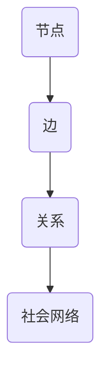

#### 社会网络的结构特性

社会网络具有以下几种重要的结构特性：

1. **密度**：表示社会网络中节点之间的连接程度。
2. **聚类系数**：表示节点在社交网络中的紧密程度。
3. **路径长度**：表示节点之间的距离。

**核心概念与联系**：

- **密度**：社会网络中边的比例。
- **聚类系数**：节点之间的直接关系的比例。
- **路径长度**：节点之间的平均距离。

**Mermaid 流程图**：

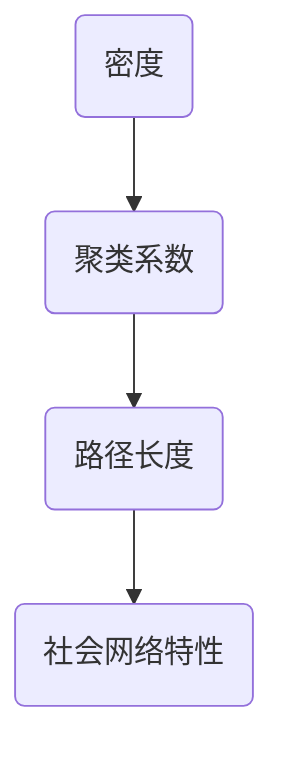

### 3.2 社会网络分析方法

#### 中心性度量

中心性度量是衡量节点在社交网络中重要程度的指标。常见的中心性度量方法包括度中心性、接近中心性和中间中心性。

**核心概念与联系**：

- **度中心性**：节点的连接数。
- **接近中心性**：节点与其他节点的距离。
- **中间中心性**：节点在路径上的重要性。

**伪代码**：

```python
def centrality度量(node, network):
    degree = calculate_degree(node, network)
    closeness = calculate_closeness(node, network)
    betweenness = calculate_betweenness(node, network)
    return degree, closeness, betweenness
```

**举例说明**：

通过中心性度量，我们可以找出社交网络中的关键节点，为网络分析提供参考。

#### 社团检测

社团检测是识别社交网络中的紧密联系群体的方法。常见的社团检测方法包括基于模块度的优化、基于社群结构的聚类等。

**核心概念与联系**：

- **模块度**：表示社团内部连接紧密程度的指标。
- **社群结构**：社团之间的结构和关系。

**伪代码**：

```python
def community_detection(network):
    communities = detect_communities(network)
    return communities
```

**举例说明**：

通过社团检测，我们可以发现社交网络中的紧密联系群体，为社群分析提供依据。

#### 社会网络的动态分析

社会网络的动态分析关注社交网络随时间的演化过程。常见的动态分析方法包括社交网络的时间序列分析、社交网络的演化模型等。

**核心概念与联系**：

- **时间序列分析**：分析社交网络随时间的变化趋势。
- **演化模型**：模拟社交网络随时间的演化过程。

**伪代码**：

```python
def dynamic_analysis(network, time_series):
    evolution = analyze_evolution(network, time_series)
    return evolution
```

**举例说明**：

通过社会网络的动态分析，我们可以了解社交网络随时间的演化过程，为网络演化研究提供支持。

### 3.3 社会网络在实际中的应用

#### 社交媒体分析

社交媒体分析是利用社会网络分析方法研究社交媒体平台中的用户行为和社交关系。

**核心概念与联系**：

- **用户行为**：社交媒体用户在平台上的活动。
- **社交关系**：社交媒体用户之间的连接关系。

**伪代码**：

```python
def social_media_analysis(network):
    user_behavior = analyze_user_behavior(network)
    social关系的结构 = analyze_social关系的结构(network)
    return user_behavior, social关系的结构
```

**举例说明**：

通过社交媒体分析，我们可以了解用户在社交媒体平台上的行为模式和社交网络结构，为平台运营提供参考。

#### 市场营销策略

市场营销策略是利用社会网络分析方法优化营销活动的策略。

**核心概念与联系**：

- **目标用户**：市场营销的目标受众。
- **传播渠道**：市场营销的信息传递渠道。

**伪代码**：

```python
def marketing_strategy(network, target_user):
    user_influence = analyze_user_influence(network, target_user)
    optimal_channel = select_optimal_channel(network, user_influence)
    return optimal_channel
```

**举例说明**：

通过市场营销策略分析，我们可以确定最有影响力的用户和最佳的传播渠道，为营销活动提供优化方案。

#### 社会运动分析

社会运动分析是利用社会网络分析方法研究社会运动中的组织结构和传播机制。

**核心概念与联系**：

- **组织结构**：社会运动中的组织架构。
- **传播机制**：社会运动中的信息传递方式。

**伪代码**：

```python
def social_motion_analysis(network):
    organization_structure = analyze_organization_structure(network)
    information_spread = analyze_information_spread(network)
    return organization_structure, information_spread
```

**举例说明**：

通过社会运动分析，我们可以了解社会运动中的组织结构和传播机制，为运动研究和政策制定提供支持。

## 第4章 机器学习在社会科学研究中的应用

### 4.1 机器学习基础

#### 监督学习

监督学习是一种通过已有数据集进行训练，从而对未知数据进行预测的方法。常见的监督学习方法包括线性回归、逻辑回归、支持向量机等。

**核心概念与联系**：

- **训练数据集**：用于训练模型的数据集。
- **预测**：对未知数据的预测。

**伪代码**：

```python
def supervised_learning(training_data, test_data):
    model = train_model(training_data)
    predictions = predict(model, test_data)
    return predictions
```

**举例说明**：

通过监督学习，我们可以预测某地区下一年的降雨量，为防洪措施提供依据。

#### 无监督学习

无监督学习是一种不需要已知标签的数据集，仅通过数据自身的特征进行训练的方法。常见的方法包括聚类、降维、关联规则学习等。

**核心概念与联系**：

- **聚类**：将相似的数据划分为同一类别。
- **降维**：减少数据维度，简化问题。
- **关联规则学习**：发现数据之间的关联关系。

**伪代码**：

```python
def unsupervised_learning(data):
    clusters = cluster(data)
    reduced_data = reduce_dimension(data)
    rules = learn_association_rules(data)
    return clusters, reduced_data, rules
```

**举例说明**：

通过无监督学习，我们可以将大量用户划分为不同的兴趣群体，为精准营销提供参考。

#### 强化学习

强化学习是一种通过不断尝试和反馈来学习最优策略的方法。常见的强化学习方法包括马尔可夫决策过程、深度强化学习等。

**核心概念与联系**：

- **策略**：决策者采取的行动方案。
- **奖励**：决策结果的评价。

**伪代码**：

```python
def reinforcement_learning(environment, strategy):
    state = environment.init()
    while not environment.is_terminated(state):
        action = strategy.select_action(state)
        next_state, reward = environment.step(state, action)
        strategy.update(state, action, reward)
        state = next_state
    return strategy
```

**举例说明**：

通过强化学习，我们可以训练出一个自动驾驶模型，使其能够在复杂的交通环境中做出最优决策。

### 4.2 机器学习在社会科学中的应用

#### 预测社会趋势

机器学习在社会科学研究中的广泛应用之一是预测社会趋势。通过分析历史数据和社会网络结构，我们可以预测未来可能出现的社会现象。

**核心概念与联系**：

- **历史数据**：用于训练模型的已有数据。
- **社会网络结构**：用于分析的数据结构。

**伪代码**：

```python
def predict_social_trends(data, network):
    model = train_model(data)
    predictions = predict(model, network)
    return predictions
```

**举例说明**：

通过预测社会趋势，我们可以提前预警可能的社会问题，为政策制定提供科学依据。

#### 个体行为分析

机器学习在社会科学研究中的另一个重要应用是个体行为分析。通过分析个体的行为数据，我们可以了解个体的行为模式、动机和偏好。

**核心概念与联系**：

- **行为数据**：用于训练模型的数据。
- **行为模式**：个体的行为规律。

**伪代码**：

```python
def individual_behavior_analysis(data):
    model = train_model(data)
    behavior_patterns = analyze_behavior(model, data)
    return behavior_patterns
```

**举例说明**：

通过个体行为分析，我们可以了解用户在社交媒体平台上的行为模式，为内容推荐提供依据。

#### 社会事件分类

机器学习在社会科学研究中的另一个应用是自动分类社会事件。通过分析事件的特征和背景，我们可以将事件归类为不同的类别。

**核心概念与联系**：

- **事件特征**：用于分类的特征数据。
- **事件类别**：事件所属的类别。

**伪代码**：

```python
def social_event_classification(data, categories):
    model = train_model(data, categories)
    categories = classify(model, data)
    return categories
```

**举例说明**：

通过社会事件分类，我们可以自动分类新闻报道中的事件，为新闻整理提供支持。

### 4.3 案例研究

#### 社会舆情分析

社会舆情分析是利用机器学习技术对社会舆论进行监控和分析的过程。通过分析社交媒体平台上的用户评论和讨论，我们可以了解公众对某个事件或话题的看法。

**案例背景**：

某城市发生了一起重大交通事故，引起了广泛关注。研究者希望通过机器学习技术分析社交媒体上的舆情，了解公众对事故的看法。

**数据来源**：

数据来源于社交媒体平台（如微博、Twitter等）上的用户评论和讨论。

**数据处理**：

1. 数据采集：通过API接口采集事故发生后的社交媒体评论和讨论。
2. 数据预处理：去除无关信息、进行文本清洗、分词、去除停用词等。

**算法选择**：

选择文本分类算法（如朴素贝叶斯、支持向量机等）对社交媒体评论进行分类。

**结果分析**：

通过分类算法，将社交媒体评论分为正面、中性、负面三类。分析结果表明，大部分用户对事故表示关注，对事故的处理和赔偿表示担忧。

**实际意义**：

通过社会舆情分析，研究者可以了解公众对重大事件的态度和看法，为政策制定和社会治理提供参考。

#### 社会冲突预测

社会冲突预测是利用机器学习技术预测社会冲突发生的过程。通过分析历史冲突数据和社会网络结构，我们可以预测未来可能发生的社会冲突。

**案例背景**：

某地区存在潜在的社会冲突风险，研究者希望通过机器学习技术预测冲突的发生，提前采取预防措施。

**数据来源**：

数据来源于历史冲突记录、社会网络数据等。

**数据处理**：

1. 数据采集：收集冲突事件的历史数据。
2. 数据预处理：进行数据清洗、整合和转换。

**算法选择**：

选择时间序列分析算法（如ARIMA、LSTM等）对社会冲突进行预测。

**结果分析**：

通过时间序列分析算法，预测出未来一段时间内可能发生的社会冲突。分析结果表明，某个月份的社会冲突风险较高。

**实际意义**：

通过社会冲突预测，研究者可以提前预警潜在的社会冲突风险，为政府和社会组织提供预防措施，降低冲突的发生概率。

#### 社会影响力评估

社会影响力评估是利用机器学习技术评估个人或组织在社会中的影响力。通过分析社交媒体数据和社会网络结构，我们可以评估个人或组织的社交影响力。

**案例背景**：

某社交平台想要评估其用户的影响力，为广告投放和用户管理提供参考。

**数据来源**：

数据来源于社交媒体平台上的用户数据和社会网络数据。

**数据处理**：

1. 数据采集：收集用户的社会网络数据、社交媒体行为数据等。
2. 数据预处理：进行数据清洗、整合和转换。

**算法选择**：

选择社会网络分析算法（如中心性度量、社团检测等）和文本分析算法（如情感分析、关键词提取等）进行影响力评估。

**结果分析**：

通过社会网络分析和文本分析算法，评估出用户的影响力值。分析结果表明，部分用户具有较高的影响力，可以为广告投放提供重点对象。

**实际意义**：

通过社会影响力评估，社交平台可以了解用户的影响力，为广告投放、用户管理和产品改进提供参考。

## 第5章 复杂性与适应性系统理论

### 5.1 复杂性与适应性系统概述

复杂性与适应性系统理论是一种研究复杂系统和适应性行为的跨学科理论。它关注系统的演化、适应性、复杂性和动态性。

**核心概念与联系**：

- **复杂性**：系统内部结构的复杂性和不确定性。
- **适应性**：系统对外部环境变化的适应能力。
- **系统演化**：系统从简单到复杂的过程。
- **动态性**：系统的变化和演化过程。

**Mermaid 流程图**：

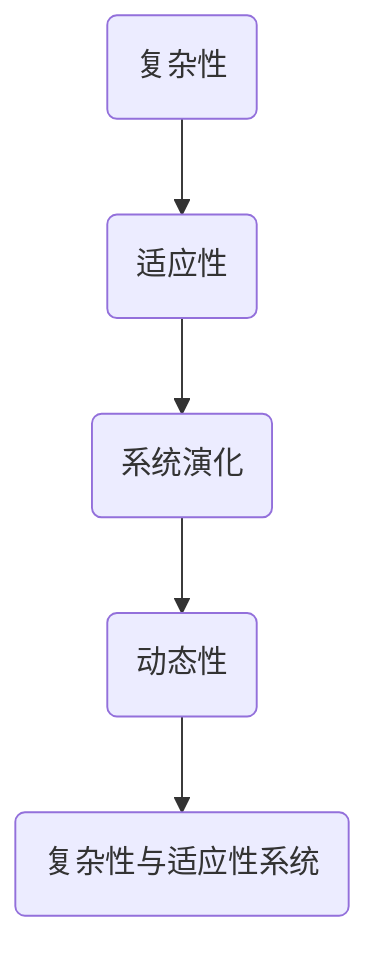

### 5.2 复杂性与适应性系统在社会科学中的应用

#### 社会复杂性

社会复杂性是指社会系统中个体、群体和整体之间相互作用的复杂性和不确定性。复杂性与适应性系统理论可以帮助我们理解社会系统的复杂性。

**核心概念与联系**：

- **个体**：社会系统中的基本单元。
- **群体**：由多个个体组成的集体。
- **整体**：社会系统的整体结构和功能。

**Mermaid 流程图**：

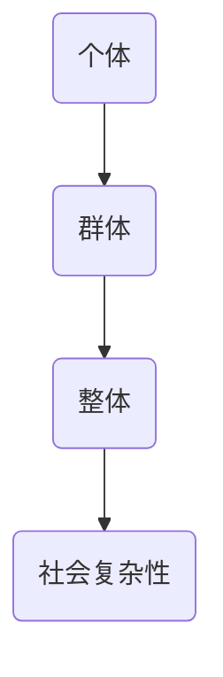

#### 经济复杂性

经济复杂性是指经济系统中各个经济实体、市场、产业等之间的复杂关系和不确定性。复杂性与适应性系统理论可以帮助我们理解经济系统的复杂性。

**核心概念与联系**：

- **经济实体**：参与经济活动的个体和组织。
- **市场**：商品和服务交换的场所。
- **产业**：经济活动中特定的领域。

**Mermaid 流程图**：

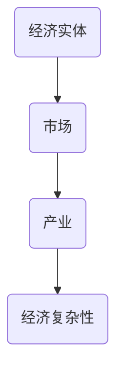

#### 政治复杂性

政治复杂性是指政治系统中各个政治主体、政策、制度等之间的复杂关系和不确定性。复杂性与适应性系统理论可以帮助我们理解政治系统的复杂性。

**核心概念与联系**：

- **政治主体**：参与政治活动的个体和组织。
- **政策**：政府制定的规则和措施。
- **制度**：社会规范和规则。

**Mermaid 流程图**：

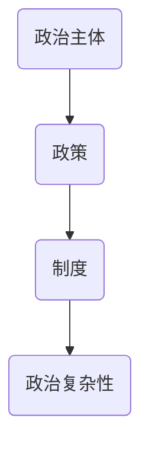

### 5.3 案例研究

#### 社会系统的适应性演化

**案例背景**：

某城市在快速发展的过程中，面临着交通拥堵、环境污染等问题。研究者希望通过复杂性与适应性系统理论分析城市系统的适应性演化。

**数据来源**：

数据来源于城市交通系统、环境监测系统等。

**数据处理**：

1. 数据采集：收集城市交通系统、环境监测系统的数据。
2. 数据预处理：进行数据清洗、整合和转换。

**算法选择**：

选择复杂性与适应性系统理论中的演化模型（如适应性行为模型、复杂适应性系统模型等）进行分析。

**结果分析**：

通过演化模型分析，发现城市系统在面临外部环境变化时，通过适应性调整实现了系统的持续发展。

**实际意义**：

通过社会系统的适应性演化分析，研究者可以了解城市系统在应对外部挑战时的适应性机制，为城市规划和治理提供参考。

#### 复杂性理论在政治分析中的应用

**案例背景**：

某国家在政治改革过程中，面临着权力分配、政策执行等问题。研究者希望通过复杂性理论分析政治系统的复杂性。

**数据来源**：

数据来源于国家政治制度、政策文件等。

**数据处理**：

1. 数据采集：收集国家政治制度、政策文件等数据。
2. 数据预处理：进行数据清洗、整合和转换。

**算法选择**：

选择复杂性理论中的复杂网络分析算法（如节点重要性分析、社团检测等）进行分析。

**结果分析**：

通过复杂网络分析，发现政治系统中的关键节点和紧密联系群体，为政策制定和执行提供参考。

**实际意义**：

通过复杂性理论在政治分析中的应用，研究者可以了解政治系统的复杂结构和关键因素，为政治改革提供科学依据。

#### 复杂性理论在经济分析中的应用

**案例背景**：

某国家在经济发展过程中，面临着产业结构调整、市场波动等问题。研究者希望通过复杂性理论分析经济系统的复杂性。

**数据来源**：

数据来源于国家统计部门、行业报告等。

**数据处理**：

1. 数据采集：收集国家统计部门、行业报告等数据。
2. 数据预处理：进行数据清洗、整合和转换。

**算法选择**：

选择复杂性理论中的时间序列分析算法（如ARIMA、LSTM等）和复杂网络分析算法进行分析。

**结果分析**：

通过时间序列分析和复杂网络分析，发现经济系统中的关键因素和动态演化过程，为经济发展提供参考。

**实际意义**：

通过复杂性理论在经济分析中的应用，研究者可以了解经济系统的复杂结构和动态演化过程，为经济政策和规划提供科学依据。

## 第6章 大数据和计算社会科学的未来发展趋势

### 6.1 大数据的挑战与机遇

#### 数据隐私与伦理

大数据在计算社会科学中的应用带来了巨大的机遇，但也引发了数据隐私和伦理问题。如何在保障数据隐私和伦理的前提下，充分利用大数据进行分析，是一个重要的挑战。

**核心概念与联系**：

- **数据隐私**：个人数据不被未经授权的第三方访问和使用。
- **伦理**：数据使用过程中遵循的道德原则和规范。

**Mermaid 流程图**：

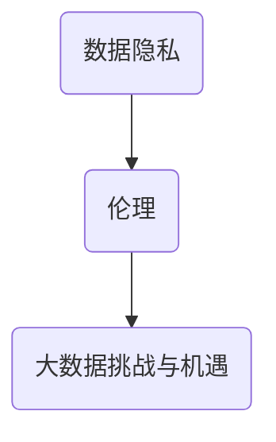

#### 大数据处理的技术进步

随着大数据技术的不断发展，数据处理和分析的效率得到了显著提升。新的数据处理技术，如分布式计算、云计算、深度学习等，为计算社会科学研究提供了强大的工具。

**核心概念与联系**：

- **分布式计算**：将计算任务分布在多个节点上进行处理。
- **云计算**：通过互联网提供计算资源和服务。
- **深度学习**：一种基于神经网络的学习方法。

**Mermaid 流程图**：

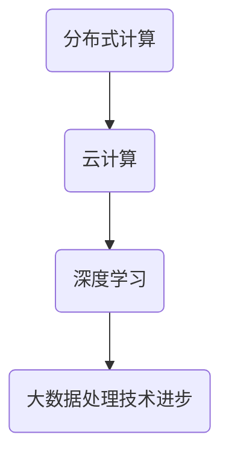

### 6.2 计算社会科学的未来发展

#### 跨学科合作

计算社会科学的发展需要跨学科的合作。通过结合不同学科的理论和方法，我们可以更好地理解和分析人类社会与世界的复杂性。

**核心概念与联系**：

- **跨学科合作**：不同学科之间的合作和研究。
- **多学科融合**：将不同学科的理论和方法应用于计算社会科学研究。

**Mermaid 流程图**：

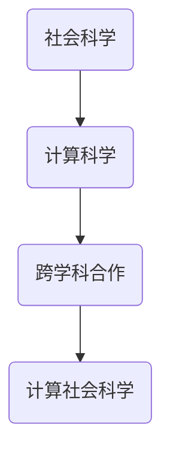

#### 新的定量研究方法

随着大数据技术的发展，新的定量研究方法不断涌现。这些方法可以更准确地分析和解释社会现象，为社会科学研究提供新的视角。

**核心概念与联系**：

- **定量研究方法**：基于数据和统计的方法。
- **新方法**：大数据分析和机器学习等新技术。

**Mermaid 流程图**：

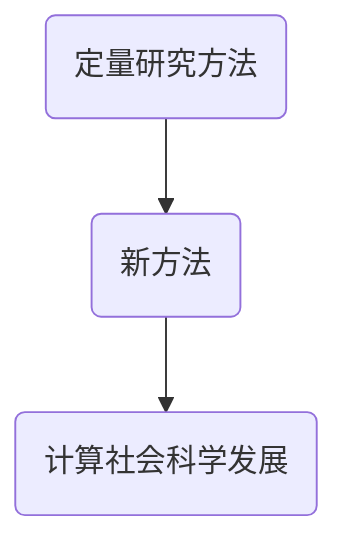

#### 社会科学的数字化转型

随着数字化技术的普及，社会科学研究的数字化转型成为一个重要趋势。通过数字化工具和方法，我们可以更高效地进行数据收集、分析和解读。

**核心概念与联系**：

- **数字化转型**：将传统社会科学研究方法数字化。
- **数字化工具**：如大数据分析平台、机器学习框架等。

**Mermaid 流程图**：

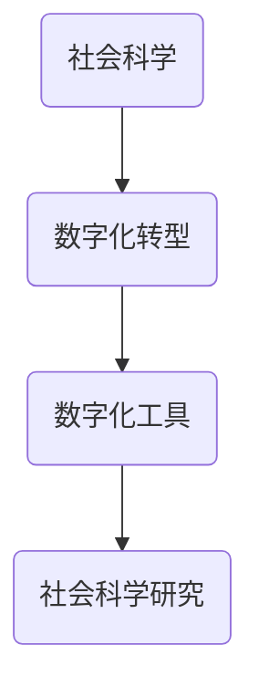

### 6.3 潜在的研究领域与前沿

#### 社会网络的深度学习分析

社会网络分析的深度学习方法是一个前沿研究领域。通过深度学习模型，我们可以更准确地识别社会网络中的关键节点、社团结构和动态演化过程。

**核心概念与联系**：

- **深度学习模型**：用于分析社会网络的数据驱动方法。
- **关键节点**：在社会网络中具有重要作用的节点。
- **社团结构**：社会网络中的紧密联系群体。
- **动态演化过程**：社会网络的演化过程。

**Mermaid 流程图**：

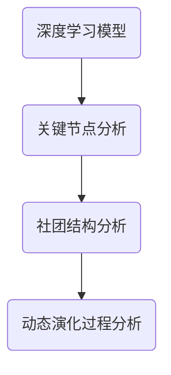

#### 人工智能在社会科学研究中的应用

人工智能在社会科学研究中的应用是一个充满潜力的领域。通过人工智能技术，我们可以更准确地预测社会趋势、分析个体行为和评估社会影响力。

**核心概念与联系**：

- **人工智能技术**：用于分析和预测社会现象的工具。
- **社会趋势预测**：预测社会现象的发展趋势。
- **个体行为分析**：分析个体的行为模式。
- **社会影响力评估**：评估个人或组织在社会中的影响力。

**Mermaid 流程图**：

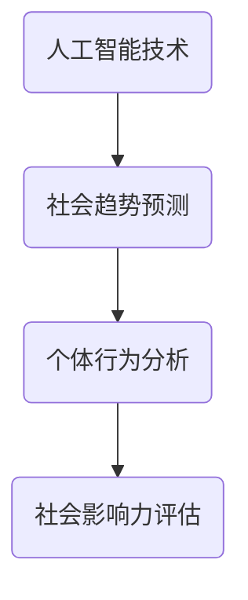

#### 大数据与社会科学的融合趋势

大数据与社会科学的融合是当前研究的热点。通过大数据技术，我们可以更高效地收集、处理和分析社会数据，为社会科学研究提供丰富的数据支持。

**核心概念与联系**：

- **大数据技术**：用于处理和分析大规模数据的方法。
- **社会科学研究**：研究人类社会行为的学科。
- **数据支持**：大数据为社会科学研究提供的支持。

**Mermaid 流程图**：

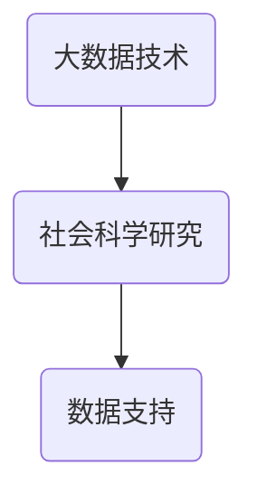

## 第7章 计算社会科学方法实践

### 7.1 实践项目概述

#### 项目规划

在计算社会科学方法实践中，项目规划是关键的第一步。项目规划包括明确研究目标、定义研究问题、确定数据来源和研究方法。

**核心概念与联系**：

- **研究目标**：项目希望实现的目标。
- **研究问题**：项目需要解决的问题。
- **数据来源**：项目所需的数据来源。
- **研究方法**：项目采用的研究方法。

**伪代码**：

```python
def project_plan(goal, problem, data_source, method):
    plan = {
        'goal': goal,
        'problem': problem,
        'data_source': data_source,
        'method': method
    }
    return plan
```

**举例说明**：

假设我们希望研究社交媒体平台上的用户行为模式，我们可以设定研究目标为“分析社交媒体用户的行为特征和趋势”，研究问题为“社交媒体用户在平台上如何互动和传播信息”，数据来源为“社交媒体平台提供的用户行为数据”，研究方法为“社会网络分析、机器学习等方法”。

#### 数据采集与处理

数据采集与处理是计算社会科学方法实践的核心环节。数据采集包括获取原始数据，数据预处理包括数据清洗、数据集成和数据转换等。

**核心概念与联系**：

- **数据采集**：获取原始数据的过程。
- **数据清洗**：去除数据中的噪声和错误。
- **数据集成**：将不同来源的数据合并为一个统一的数据集。
- **数据转换**：将数据从一种格式转换为另一种格式。

**伪代码**：

```python
def data_collection_and_preprocessing(data_source):
    raw_data = collect_data(data_source)
    cleaned_data = clean_data(raw_data)
    integrated_data = integrate_data(cleaned_data)
    transformed_data = transform_data(integrated_data)
    return transformed_data
```

**举例说明**：

假设我们采集了社交媒体平台上的用户行为数据，包括用户发表的状态、点赞、评论等，我们需要进行数据清洗（去除无关信息、去除错误值等），数据集成（将不同来源的数据合并为一个数据集），数据转换（将数据格式从JSON转换为CSV）等步骤，以便后续分析。

### 7.2 数据分析实践

#### 描述性分析

描述性分析是对数据的基本特征进行统计分析，如平均数、中位数、标准差等。描述性分析可以帮助我们了解数据的分布特征和基本统计量。

**核心概念与联系**：

- **平均数**：数据的平均值。
- **中位数**：数据的中值。
- **标准差**：数据的离散程度。

**伪代码**：

```python
def descriptive_analysis(data):
    mean = calculate_mean(data)
    median = calculate_median(data)
    std_dev = calculate_std_dev(data)
    return mean, median, std_dev
```

**举例说明**：

假设我们采集了社交媒体平台上的用户年龄数据，通过描述性分析，我们可以得到用户年龄的平均值、中位数和标准差，从而了解用户的年龄分布特征。

#### 统计分析

统计分析是利用统计方法对数据进行深入分析，如回归分析、方差分析等。统计分析可以帮助我们揭示数据之间的内在关系和规律。

**核心概念与联系**：

- **回归分析**：分析变量之间的关系。
- **方差分析**：分析不同变量之间的差异。

**伪代码**：

```python
def statistical_analysis(data, variables):
    regression = perform_regression_analysis(data, variables)
    ANOVA = perform_anova_analysis(data, variables)
    return regression, ANOVA
```

**举例说明**：

假设我们采集了社交媒体平台上的用户年龄、性别和活跃度等数据，通过回归分析，我们可以分析年龄和性别对用户活跃度的影响；通过方差分析，我们可以分析不同性别之间的活跃度差异。

#### 机器学习分析

机器学习分析是利用机器学习方法对数据进行预测和分类。机器学习分析可以帮助我们建立预测模型和分类模型，为实际应用提供支持。

**核心概念与联系**：

- **预测模型**：预测未来值的模型。
- **分类模型**：将数据分类的模型。

**伪代码**：

```python
def machine_learning_analysis(data, target_variable):
    model = train_model(data, target_variable)
    predictions = predict(model, data)
    return predictions
```

**举例说明**：

假设我们采集了社交媒体平台上的用户行为数据，包括用户发表的状态、点赞、评论等，我们可以利用机器学习分析方法，建立预测模型预测用户未来的行为，建立分类模型将用户分类为活跃用户和沉默用户。

### 7.3 结果解读与报告

#### 结果呈现

结果呈现是将数据分析结果以图表、报表等形式展示出来，便于读者理解和分析。

**核心概念与联系**：

- **图表**：用图形形式展示数据分析结果。
- **报表**：用表格形式展示数据分析结果。

**伪代码**：

```python
def present_results(analysis_results):
    charts = generate_charts(analysis_results)
    report = generate_report(analysis_results, charts)
    return report
```

**举例说明**：

假设我们通过描述性分析得到了社交媒体用户年龄的分布特征，通过机器学习分析预测了用户未来的行为，我们可以用图表展示年龄分布、用报表展示预测结果，便于读者理解和分析。

#### 结果分析

结果分析是对数据分析结果进行深入解读和解释，揭示数据之间的内在关系和规律。

**核心概念与联系**：

- **内在关系**：数据之间的联系和影响。
- **规律**：数据分析结果所揭示的规律。

**伪代码**：

```python
def analyze_results(analysis_results):
    relationships = identify_relationships(analysis_results)
    patterns = identify_patterns(analysis_results)
    insights = generate_insights(relationships, patterns)
    return insights
```

**举例说明**：

假设我们通过统计分析发现了社交媒体用户年龄和活跃度之间存在显著的正相关关系，通过机器学习分析预测了用户未来的行为，我们可以解读这些结果，揭示用户行为模式的规律和影响。

#### 报告撰写

报告撰写是将数据分析结果、结果解读和分析过程整理成一篇完整的报告，为决策者提供科学依据。

**核心概念与联系**：

- **数据分析结果**：报告的核心内容。
- **结果解读**：对数据分析结果的解释和解读。
- **分析过程**：报告的分析方法和步骤。

**伪代码**：

```python
def write_report(analysis_results, analysis_process, insights):
    report = {
        'results': analysis_results,
        'interpretation': insights,
        'process': analysis_process
    }
    return generate_report(report)
```

**举例说明**：

假设我们完成了一项关于社交媒体用户行为的研究，通过描述性分析、统计分析、机器学习分析等步骤，得到了用户年龄分布、活跃度、未来行为预测等结果，我们可以撰写一篇完整的报告，为决策者提供科学依据。

### 附录

#### 7.1 计算社会科学方法工具与资源

计算社会科学方法涉及的工具和资源包括：

- **数据分析工具**：如Python的Pandas、NumPy等库。
- **机器学习框架**：如TensorFlow、Scikit-learn等。
- **社会网络分析工具**：如Gephi、NetworkX等。
- **大数据处理工具**：如Hadoop、Spark等。

#### 7.2 案例研究资料

案例研究资料包括：

- **数据集**：社交媒体用户行为数据、社会冲突数据等。
- **代码**：数据分析、机器学习分析等相关代码。
- **图表**：数据分析结果图表。
- **报告**：案例研究的详细报告。

## 附录

### 7.1 计算社会科学方法工具与资源

在计算社会科学的研究过程中，选择合适的工具和资源至关重要。以下列举了计算社会科学中常用的一些工具和资源，以便研究人员和实践者能够更好地开展研究工作。

#### 数据分析工具

- **Python**：Python是一种广泛使用的编程语言，具有丰富的数据处理和分析库，如Pandas、NumPy、SciPy等。
- **R语言**：R语言是统计分析和数据可视化的重要工具，特别适合于复杂数据的分析。
- **Excel**：Excel是日常数据分析和数据处理的基础工具，适用于中小规模的数据分析。

#### 机器学习框架

- **TensorFlow**：由Google开发的开源机器学习框架，适用于深度学习和大规模数据处理。
- **Scikit-learn**：Python中的开源机器学习库，适用于各种常见的机器学习算法。
- **PyTorch**：由Facebook开发的开源机器学习框架，适用于深度学习和研究。

#### 社会网络分析工具

- **Gephi**：开源的社会网络分析工具，用于可视化和分析社交网络结构。
- **NetworkX**：Python中的社会网络分析库，适用于构建和分析社交网络。
- **Cytoscape**：开源的生物信息和复杂网络分析工具，支持多种数据格式和可视化选项。

#### 大数据处理工具

- **Hadoop**：基于分布式计算的开源大数据处理框架，适用于大规模数据的存储和处理。
- **Spark**：基于内存的分布式大数据处理框架，适用于实时数据处理和分析。
- **Flink**：开源的大数据处理和流处理框架，适用于实时数据分析和处理。

### 7.2 案例研究资料

案例研究资料为研究人员提供了实际数据和代码，以便更好地理解和应用计算社会科学方法。以下是一些常见的案例研究资料：

- **社交媒体数据集**：包括Twitter、Facebook等社交媒体平台上的用户行为数据，可用于分析社交网络结构、用户行为模式等。
- **社会冲突数据集**：包括不同地区、不同时间段的社会冲突事件数据，可用于预测社会冲突、分析冲突原因等。
- **经济数据集**：包括宏观经济指标、行业数据等，可用于经济趋势预测、产业分析等。
- **机器学习案例代码**：包括各种机器学习算法的实现代码，如线性回归、逻辑回归、决策树等，可用于复现研究、学习算法原理。

这些案例研究资料通常可以在开源数据集网站（如Kaggle、UCI机器学习库等）以及相关研究论文中找到。研究人员可以根据自己的研究需求选择合适的案例数据进行实际操作和分析。

通过使用这些工具和资源，研究人员可以在计算社会科学领域进行深入的研究，探索社会现象的规律和趋势，为政策制定、社会治理和经济发展提供科学依据。同时，研究人员还可以通过实际案例的分析和解读，提升自己的数据处理和分析能力，为未来的研究打下坚实的基础。## 文章总结与未来展望

### 文章总结

本文从多个角度探讨了计算社会科学方法在理解和分析人类社会与世界中的应用。我们首先介绍了计算社会科学的背景与意义，阐述了其定义与范围，以及核心概念如数据科学、社会网络分析、机器学习和复杂性理论。随后，我们详细讲解了数据科学基础，包括数据类型与数据源、数据预处理和数据分析方法。在此基础上，我们深入探讨了社会网络分析、机器学习在社会科学研究中的应用，以及复杂性与适应性系统理论。最后，我们展望了大数据和计算社会科学的未来发展趋势，并提供了实际案例和实战指南。

### 未来展望

1. **跨学科融合**：随着技术的进步，计算社会科学将与其他学科（如心理学、经济学、政治学等）更加紧密地融合，形成新的研究范式和方法。

2. **人工智能的深化应用**：人工智能技术，特别是深度学习和强化学习，将在计算社会科学中发挥更重要的作用，为复杂社会现象的预测和分析提供更强有力的工具。

3. **数据隐私与伦理**：在数据隐私和伦理问题日益突出的背景下，如何平衡数据利用与保护隐私，将成为计算社会科学的重要研究方向。

4. **实时数据分析**：随着物联网和实时数据采集技术的发展，实时数据分析将成为计算社会科学的重要应用领域，为社会动态监测和决策提供支持。

5. **社会影响力评估**：通过计算社会科学方法，对个人、组织和社会现象的影响力进行量化评估，将为公共管理和决策提供科学依据。

### 最佳实践 tips

1. **选择合适的数据源**：确保数据来源的多样性和质量，避免数据偏见。
2. **注重数据预处理**：数据清洗、整合和转换是数据分析的重要环节，要重视数据质量的保障。
3. **结合多种分析方法**：采用多种数据分析方法，从不同角度揭示数据背后的规律。
4. **注重结果解读与验证**：对分析结果进行深入解读和验证，确保结论的可靠性和实用性。
5. **持续学习和实践**：随着技术的不断进步，持续学习和实践是提升计算社会科学研究能力的有效途径。

### 小结

计算社会科学方法为理解和分析人类社会与世界提供了强有力的工具。通过数据驱动的视角，我们可以更深入地揭示社会现象的规律和趋势，为政策制定、社会治理和经济发展提供科学依据。未来的研究将在跨学科融合、人工智能深化应用、数据隐私与伦理等方面取得重要进展。通过不断探索和实践，我们将推动计算社会科学的发展，为社会进步和人类福祉作出贡献。

### 注意事项

1. **数据安全**：在进行计算社会科学研究时，要确保数据的安全性和隐私性，遵守相关法律法规。
2. **方法适用性**：不同的研究问题可能需要不同的分析方法，要选择合适的方法进行针对性研究。
3. **数据解释**：对分析结果进行准确、客观的解读，避免过度解读或误解数据。
4. **跨学科合作**：计算社会科学研究通常需要跨学科的知识和技能，要注重与不同领域的专家合作。

### 拓展阅读

1. **《计算社会科学导论》**：John F. Cioffi，2015年，北京大学出版社。
2. **《大数据与社会科学》**：Michael Alvarez，Shanto Iyengar，2014年，中国人民大学出版社。
3. **《深度学习》**：Ian Goodfellow、Yoshua Bengio、Aaron Courville，2016年，电子工业出版社。
4. **《复杂系统与复杂性科学》**：Nigel Frith，Andrew P. Kucherenko，2014年，清华大学出版社。

作者：AI天才研究院/AI Genius Institute & 禅与计算机程序设计艺术 /Zen And The Art of Computer Programming

