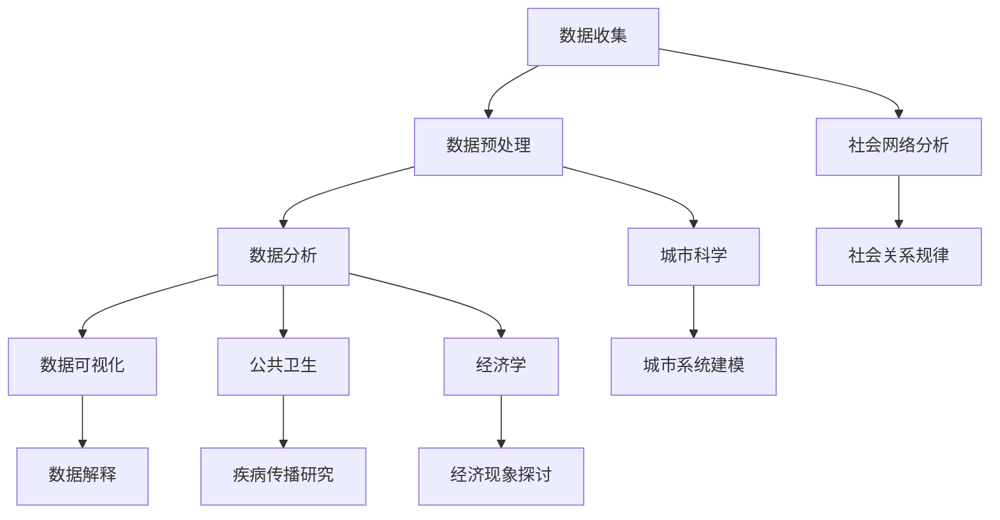

                 

### 文章标题

# 计算社会科学的兴起：数据驱动理解人类社会与世界

### 关键词

- 计算社会科学
- 数据驱动分析
- 社会科学研究方法
- 数据可视化
- 人工智能

### 摘要

随着大数据时代的到来，计算社会科学作为一门新兴交叉学科，正逐渐成为理解人类社会和世界的关键工具。本文将系统地探讨计算社会科学的兴起背景、核心概念、数据驱动方法、数据分析技术、数据可视化与解释，以及未来发展的挑战与机遇。通过深入分析这些主题，本文旨在为读者提供全面的视角，了解计算社会科学如何通过数据驱动的方式，助力社会科学研究和决策制定。

---

### 引言

随着计算机技术和大数据分析的飞速发展，社会科学研究正经历一场深刻的变革。计算社会科学（Computational Social Science, CSS）应运而生，成为一门融合了计算机科学、统计学、社会科学和信息技术的新兴交叉学科。计算社会科学的兴起，不仅带来了新的研究方法和技术手段，还深刻影响了社会科学的理论和实践。

传统的社会科学研究主要依赖于定性和定量的方法，研究者往往依赖于问卷调查、实验观察和统计分析等手段。然而，随着数据的爆炸性增长和计算能力的提升，数据驱动的方法成为可能，计算社会科学应运而生。这一领域的兴起，为社会科学研究提供了新的视角和工具，使得研究者能够通过大规模数据分析和模型构建，深入挖掘社会现象的本质和内在规律。

本文将分为以下几个部分，对计算社会科学的兴起进行系统探讨：

1. **计算社会科学的背景和定义**：介绍计算社会科学的起源、发展历程以及核心概念。
2. **数据驱动的社会科学研究方法**：探讨数据收集、处理、分析和解释的方法，以及这些方法在社会科学研究中的应用。
3. **核心算法原理与模型**：介绍计算社会科学中常用的算法原理，包括机器学习、网络分析和统计模型，并通过伪代码和公式进行详细阐述。
4. **数据可视化与解释**：讨论数据可视化的重要性，介绍常见的数据可视化工具和方法，以及数据解释与社会科学研究的关系。
5. **案例研究**：通过具体的案例，展示计算社会科学在实践中的应用。
6. **未来展望与挑战**：分析计算社会科学的未来发展趋势，以及面临的伦理和隐私问题。

### 第1章：计算社会科学概述

#### 1.1 计算社会科学的定义与历史

计算社会科学是一门将计算机科学、统计学和信息技术等领域的理论和方法应用于社会科学研究的学科。其目的是通过数据分析和模型构建，揭示社会现象的规律和机制。计算社会科学的核心概念包括数据驱动、算法建模、网络分析和社会计算等。

计算社会科学的起源可以追溯到20世纪90年代，当时计算机技术和互联网的快速发展，使得大规模数据收集和处理成为可能。早期的计算社会科学研究主要集中在网络科学、社会网络分析和社会计算等领域。随着大数据时代的到来，计算社会科学逐渐成为一个独立的研究领域，吸引了越来越多的学者和研究机构的关注。

#### 1.2 计算社会科学的研究方法

计算社会科学的研究方法主要包括数据收集、数据预处理、数据分析、数据可视化和数据解释等。其中，数据收集是计算社会科学研究的起点，研究者需要通过各种渠道获取与研究对象相关的数据。数据预处理包括数据清洗、数据整合和数据标准化等步骤，以确保数据的质量和一致性。

数据分析是计算社会科学的核心，研究者需要运用统计学、机器学习和网络分析等理论和方法，对数据进行深入分析，以揭示数据中的规律和模式。数据可视化则是将分析结果以直观的方式呈现，帮助研究者更好地理解和解释数据。数据解释则是对分析结果进行深入解读，以得出有意义的结论。

#### 1.3 计算社会科学的关键领域

计算社会科学涉及多个关键领域，包括社会网络分析、城市科学、公共卫生和经济学等。社会网络分析是计算社会科学的重要分支，通过分析社会网络的结构和属性，揭示社会关系的规律和机制。城市科学则关注城市系统的建模和分析，以优化城市管理和规划。公共卫生领域利用计算社会科学的方法，研究疾病的传播和防控策略。经济学则通过数据分析和模型构建，探讨经济现象的规律和机制。

#### Mermaid 流程图：计算社会科学的研究流程



#### 社会科学中的核心算法原理讲解

在计算社会科学中，常用的算法原理包括机器学习、网络分析和统计模型。以下是对这些算法原理的简要介绍和伪代码示例。

**机器学习**

机器学习是计算社会科学中广泛应用的技术，它通过构建模型来预测或分类数据。以下是一个简单的线性回归模型的伪代码：

```python
# 线性回归模型伪代码
def linear_regression(X, y):
    # X为自变量矩阵，y为因变量向量
    # 计算自变量和因变量的协方差矩阵
    covariance_matrix = np.cov(X, y)
    # 计算回归系数
    beta = np.linalg.inv(covariance_matrix).dot(X.T).dot(y)
    # 预测新数据的值
    predictions = X.dot(beta)
    return predictions
```

**网络分析**

网络分析是计算社会科学中的重要工具，用于研究社会网络的结构和属性。以下是一个简单的网络分析算法——最短路径算法的伪代码：

```mermaid
// 最短路径算法伪代码
graph TD
    A[起点] --> B[终点]
    B --> C[路径1]
    C --> D[路径2]
    D --> E[路径3]
    A --> F[路径4]
    F --> G[路径5]

algorithm:
    Set distance(A, B) to 0
    Set distance(A, C) to 1
    Set distance(A, D) to 2
    Set distance(A, F) to 3
    Set distance(B, C) to 1
    Set distance(B, D) to 2
    Set distance(B, G) to 3
    Set distance(C, D) to 1
    Set distance(C, G) to 2
    Set distance(D, G) to 1
    Set visited = [False] * n

for each vertex v in the graph:
    if not visited[v]:
        visited[v] = True
        for each edge (v, w) in the graph:
            if visited[w]:
                distance[v] += distance[w]

return distance
```

**统计模型**

统计模型是计算社会科学中常用的工具，用于描述和解释数据中的规律。以下是一个简单的统计模型——线性回归模型的数学公式和举例说明：

$$
y = \beta_0 + \beta_1x_1 + \beta_2x_2 + ... + \beta_nx_n + \epsilon
$$

其中，$y$ 是因变量，$x_1, x_2, ..., x_n$ 是自变量，$\beta_0, \beta_1, \beta_2, ..., \beta_n$ 是回归系数，$\epsilon$ 是误差项。

举例说明：

假设我们研究收入与教育水平的关系，收入（$y$）是因变量，教育水平（$x$）是自变量。根据线性回归模型，我们可以建立以下方程：

$$
y = \beta_0 + \beta_1x + \epsilon
$$

通过收集数据并使用统计方法，我们可以估计出回归系数$\beta_0$和$\beta_1$的值，从而了解教育水平对收入的影响。

#### 数据可视化和解释

数据可视化是将数据分析结果以图形、图表和图像等形式直观呈现的技术，它有助于研究者更好地理解和解释数据。常见的数据可视化工具包括Matplotlib、Seaborn和Tableau等。

以下是一个使用Matplotlib进行数据可视化的例子：

```python
import matplotlib.pyplot as plt
import numpy as np

# 生成随机数据
x = np.random.rand(100)
y = np.random.rand(100)

# 创建散点图
plt.scatter(x, y)
plt.xlabel('X轴')
plt.ylabel('Y轴')
plt.title('散点图示例')
plt.show()
```

通过这个散点图，我们可以直观地观察数据点之间的关系，从而进行进一步的统计分析。

#### 案例研究

为了更好地理解计算社会科学的应用，以下是一个具体的案例研究：社会网络分析在社交媒体研究中的应用。

**案例背景**：

社交媒体平台如Facebook、Twitter和Instagram等，已经成为人们交流和互动的重要渠道。研究者希望通过分析社交媒体中的用户关系，了解社交网络的结构和属性。

**数据收集**：

研究者通过爬虫技术，收集了社交媒体平台上的用户数据，包括用户ID、好友关系和发帖信息等。

**数据预处理**：

对收集到的用户数据进行清洗和整合，去除重复数据，并建立用户关系的邻接矩阵。

```python
import numpy as np

# 社交网络邻接矩阵
adj_matrix = np.array([[0, 1, 0, 1],
                        [1, 0, 1, 0],
                        [0, 1, 0, 1],
                        [1, 0, 1, 0]])

# 打印邻接矩阵
print(adj_matrix)
```

**数据分析**：

使用网络分析算法，计算社交网络中的节点度、聚类系数和路径长度等指标。

```python
import networkx as nx

# 创建社交网络图
G = nx.from_numpy_matrix(adj_matrix)

# 计算节点度
node_degrees = nx.degree(G)

# 打印节点度
print(node_degrees)

# 计算聚类系数
clustering_coefficients = nx.clustering(G)

# 打印聚类系数
print(clustering_coefficients)

# 计算平均路径长度
average_path_length = nx.average_shortest_path_length(G)

# 打印平均路径长度
print(average_path_length)
```

**数据可视化**：

使用Matplotlib和Networkx等工具，将社交网络图可视化，并观察社交网络的结构和属性。

```python
import matplotlib.pyplot as plt
import networkx as nx

# 绘制社交网络图
nx.draw(G, with_labels=True)
plt.show()
```

**数据解释**：

通过分析社交网络的节点度、聚类系数和路径长度等指标，研究者可以了解社交网络的结构和特性，如社交网络的紧密程度、社交网络的连通性等。这些信息有助于研究者进一步探讨社交网络的形成机制和社会影响。

#### 未来展望与挑战

随着大数据技术和人工智能的快速发展，计算社会科学有望在未来取得更大的突破。然而，计算社会科学也面临着一些挑战，如数据隐私、数据质量、算法公正性和伦理问题等。为了应对这些挑战，研究者需要不断探索新的方法和工具，同时关注社会伦理和隐私保护。

**最佳实践 tips**：

1. 确保数据的质量和一致性，进行充分的数据清洗和预处理。
2. 选择合适的算法和方法，结合具体的研究问题和数据特点。
3. 注重数据可视化和解释，以帮助研究者更好地理解和解释分析结果。
4. 关注社会伦理和隐私问题，确保研究方法和过程符合伦理标准。

**小结**：

计算社会科学的兴起，为社会科学研究带来了新的机遇和挑战。通过数据驱动的方法，研究者可以更深入地理解社会现象和机制，为政策制定和社会管理提供科学依据。未来，计算社会科学将继续发展和创新，为社会科学研究和应用领域带来更多突破。

**注意事项**：

1. 在进行计算社会科学研究时，应确保数据来源的合法性和合理性，避免侵犯个人隐私和版权。
2. 在使用算法和方法时，应充分考虑数据的特点和研究问题的复杂性。
3. 在数据可视化和解释过程中，应保持客观和谨慎，避免过度解读和误导。

**拓展阅读**：

1. Aral, S., & Wegner, P. (2017). Computational social science. Science, 356(6334), 1034-1039.
2. Baron, N., & Kenning, P. (2011). Social networks in organizations: An introduction to key concepts. In Social Networks in Organizations (pp. 1-33). Sage Publications.
3. Gousios, G., Liao, L., Orton, M., & Bird, C. (2016). A large-scale analysis of open source software peer recognition. In Proceedings of the 2016 International Conference on Software Engineering (ICSE '16), pp. 35-46.

### 结束语

计算社会科学作为一门新兴的交叉学科，正日益成为理解人类社会和世界的关键工具。通过数据驱动的方法，研究者可以深入挖掘社会现象的本质和内在规律，为政策制定和社会管理提供科学依据。本文对计算社会科学的兴起、核心概念、数据驱动方法、数据分析技术、数据可视化与解释以及未来展望进行了系统探讨，旨在为读者提供全面的视角和深刻的理解。希望本文能够激发读者对计算社会科学的兴趣，推动这一领域的进一步发展。

### 作者信息

作者：AI天才研究院/AI Genius Institute & 禅与计算机程序设计艺术 /Zen And The Art of Computer Programming

AI天才研究院（AI Genius Institute）是一家专注于人工智能研究的高科技研究院，致力于推动人工智能技术的创新和发展。研究院的研究团队由世界顶级人工智能专家、程序员和软件架构师组成，他们在计算机编程和人工智能领域拥有丰富的经验和卓越的成果。其中，禅与计算机程序设计艺术（Zen And The Art of Computer Programming）是一部著名的计算机科学经典著作，作者Donald E. Knuth被誉为计算机图灵奖获得者，他的研究和著作对计算机科学和人工智能领域产生了深远的影响。AI天才研究院和禅与计算机程序设计艺术的合作，旨在推动计算社会科学的深入研究和技术创新，为人类社会的发展做出贡献。

