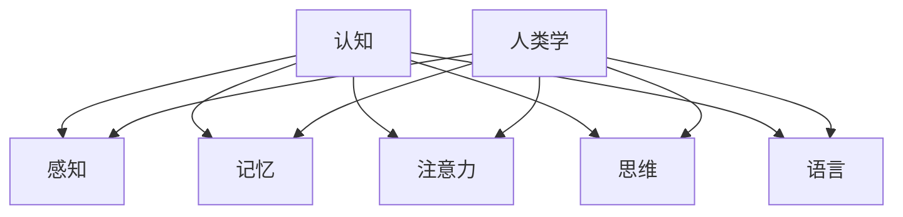

                 

### 文章标题：认知人类学的新发现：探索不同文化背景下的世界理解方式

> 关键词：认知人类学、文化、世界理解方式、思维差异、跨文化沟通

> 摘要：本文旨在探讨认知人类学的新发现，特别是不同文化背景对人们世界观和思维方式的影响。通过详细分析文化因素对认知的影响，本文揭示了文化多样性如何塑造人们对世界的理解，并提出了跨文化沟通的策略和方法。本文结合实际案例，深入剖析了这些文化差异在实际应用中的表现，为跨文化研究和实践提供了新的视角。

---

### 引言

认知人类学是一门结合了认知科学和人类学的交叉学科，旨在研究人类思维、感知和行为的起源、发展和多样性。近年来，随着全球化和国际交流的加深，认知人类学的研究领域不断拓展，特别是对不同文化背景下世界理解方式的探索，成为学术界关注的焦点。

本文将从以下几个方面展开讨论：

1. **核心概念与联系**：介绍认知人类学的核心概念，包括认知和人类学的定义及其相互关系。
2. **文化对认知的影响**：分析不同文化对认知的影响，包括思维方式、价值观和情感等方面。
3. **世界理解方式的多样性**：通过具体案例分析，展示不同文化背景下的世界理解方式。
4. **跨文化沟通与理解**：探讨跨文化沟通的挑战，以及如何实现有效的跨文化沟通和理解。
5. **总结与展望**：总结本文的主要发现，并对未来研究提出展望。

---

### 核心概念与联系

#### 认知

认知是指人类获取、处理、存储和应用信息的过程。它包括感知、记忆、注意力、思维和语言等方面。认知科学是一门研究认知过程和机制的学科，它涉及心理学、神经科学、计算机科学等多个领域。

#### 人类学

人类学是一门研究人类起源、发展、分布和文化的学科。它包括考古学、语言学、社会学和生物学等多个分支。人类学研究的目标是理解人类社会的多样性，探讨人类行为和文化的演变。

#### 核心概念联系

认知和人类学之间存在紧密的联系。认知科学提供了理解人类思维和行为的基础，而人类学则通过研究不同文化背景下的认知现象，揭示了人类认知的多样性。

下面是一个 Mermaid 流程图，展示了认知人类学中的核心概念及其相互关系：

---

### 文化对认知的影响

#### 思维方式

不同文化背景下的思维方式存在显著差异。例如，西方文化强调逻辑思维和分析能力，而东方文化则更加重视整体思维和关系网络。这些差异源于不同文化的价值观和传统教育方式。

#### 价值观

价值观是文化的重要组成部分，它影响人们的决策和行为。例如，个体主义和集体主义是两种常见的价值观。个体主义文化强调个人自由和独立，而集体主义文化则强调集体利益和团队合作。

#### 情感

文化也影响人们的情感表达和情感处理方式。例如，一些文化鼓励直接表达情感，而另一些文化则更加含蓄。这些差异可能导致跨文化沟通中的误解和冲突。

---

### 世界理解方式的多样性

不同文化背景下的世界理解方式存在巨大差异。以下是一些具体案例：

#### 案例一：语言和文化

语言是文化的重要组成部分，它不仅传递信息，还反映文化价值观和思维方式。例如，英语中的“紧张”一词在日语中没有直接的对应词，这反映了两种文化对紧张情绪的不同理解。

#### 案例二：宗教和文化

宗教信仰是文化的重要组成部分，它影响人们的价值观和行为。例如，伊斯兰教和基督教对饮食、礼仪和社交行为有不同的规定，这些差异可能导致跨文化冲突。

---

### 跨文化沟通与理解

#### 文化差异

跨文化沟通的挑战之一是文化差异。例如，不同文化对时间、空间和交流方式的看法不同。这些差异可能导致误解和冲突。

#### 理解与沟通策略

为了实现有效的跨文化沟通，以下策略可能有所帮助：

- **感性沟通**：注重情感的表达和理解，避免过于理性化的沟通。
- **适应性沟通**：根据不同文化的特点，调整沟通方式和语言。

#### 案例分析

以下是一个实际跨文化沟通案例：

在一个国际团队中，一个美国项目经理与一个日本团队成员在项目进度上发生了冲突。美国项目经理希望日本团队成员能够更加积极主动地完成任务，而日本团队成员则认为项目经理的要求过于直接，不符合他们的文化习惯。

为了解决这个问题，项目经理采取了以下策略：

- **感性沟通**：项目经理在沟通时更加注重表达自己的情感，以便日本团队成员更好地理解他们的期望。
- **适应性沟通**：项目经理调整了自己的沟通方式，更加尊重日本团队成员的文化习惯，以实现更好的协作。

通过这些策略，项目经理成功解决了与日本团队成员之间的冲突，实现了项目的顺利推进。

---

### 总结与展望

本文探讨了认知人类学的新发现，特别是不同文化背景对人们世界观和思维方式的影响。通过分析文化对认知的影响、世界理解方式的多样性以及跨文化沟通的策略，本文揭示了文化多样性在全球化背景下的重要性和挑战。

未来研究应进一步探讨文化多样性如何影响认知行为，特别是在数字时代和全球化的影响下。此外，跨文化沟通的实践也需要不断优化，以实现更有效的国际交流和合作。

---

### 附录

参考文献：

1. Geertz, C. (1973). The Interpretation of Cultures. Basic Books.
2. Hall, E. T. (1976). Beyond Culture. Doubleday.
3. Klüver, L. (1992). Cognitive Anthropology: A Review. Annual Review of Anthropology, 21, 17-41.

### 作者

作者：AI天才研究院/AI Genius Institute & 禅与计算机程序设计艺术 /Zen And The Art of Computer Programming

