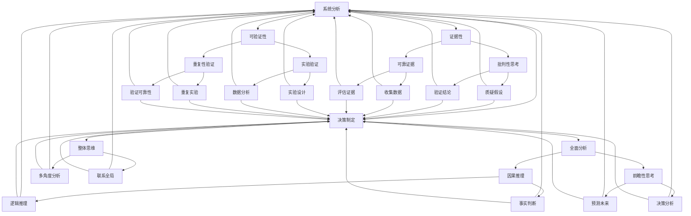

                 

### 文章标题

# 认知偏差与科学思维：克服理解世界的主观障碍

### 关键词

- 认知偏差
- 科学思维
- 主观障碍
- 客观理解
- 算法原理
- 伪代码
- 数学模型
- 项目实战

### 摘要

本文旨在探讨人类认知过程中的偏差及其对理解世界的影响，并通过科学思维的方法来克服这些偏差。文章首先介绍了认知偏差的概念和重要性，然后详细分析了期望偏差、确认偏差和情感偏差等常见认知偏差的类型及其影响。接着，文章介绍了科学思维的基本原则，包括证据意识、逻辑推理和统计思维。通过实际案例解析和项目实战，文章展示了如何应用科学思维来克服认知偏差，提高对世界的理解和分析能力。最后，文章总结了全书要点，并提出了进一步研究的方向和建议。

## 引言

认知偏差是人类思维过程中的一种普遍现象，它指的是人们在感知、理解、判断和决策时，由于受到各种心理和生理因素的影响，导致认知结果与客观现实存在偏差。这些偏差可能源于我们的直觉、经验、文化背景和个人偏好等，使我们在理解和分析问题时容易产生偏见和误解。

科学思维是一种基于证据和逻辑的方法，用于发现、分析和解决问题。它强调观察、实验、实证和理性推理，旨在通过系统的方法来克服认知偏差，提高对世界的理解。

本篇文章将围绕以下主题进行探讨：

1. 认知偏差的概念和重要性
2. 期望偏差、确认偏差和情感偏差等常见认知偏差的类型及其影响
3. 科学思维的基本原则，包括证据意识、逻辑推理和统计思维
4. 实际案例解析和项目实战，展示如何应用科学思维来克服认知偏差
5. 全书要点总结和进一步研究的方向

通过本文的探讨，希望能够帮助读者认识到认知偏差的存在及其影响，并学会运用科学思维的方法来克服这些偏差，从而更客观地理解和分析世界。

### 第一步：确定书的核心主题

《认知偏差与科学思维：克服理解世界的主观障碍》这本书的核心主题是探讨人类认知过程中的偏差以及如何通过科学思维来克服这些偏差，从而更客观地理解和分析世界。具体来说，本书的核心主题可以从以下几个方面进行阐述：

1. **认知偏差的定义和重要性**：首先，本书将详细解释什么是认知偏差，它们是如何在人类思维中产生的，以及这些偏差对日常生活、决策和问题解决可能产生的影响。通过理解这些偏差，读者将认识到它们在理解世界过程中的普遍性和危害性。

2. **科学思维的基本原则**：其次，本书将介绍科学思维的概念，包括其基本原则和方法。科学思维强调证据的重要性、逻辑推理和系统性分析，这些原则将帮助读者在遇到问题时，能够更加理性地思考和决策。

3. **常见认知偏差的类型和影响**：本书将深入探讨几种常见的认知偏差，如期望偏差、确认偏差和情感偏差，解释这些偏差的具体表现形式，以及它们如何影响我们的感知、判断和决策。通过这些分析，读者将能够识别和避免这些偏差，提高认知的准确性。

4. **科学思维在实践中的应用**：本书将结合实际案例，展示科学思维在不同领域中的应用，如科学研究、商业决策和日常生活中的问题解决。通过这些案例，读者将看到科学思维如何帮助人们克服认知偏差，提高决策的质量。

5. **克服认知偏差的策略和方法**：最后，本书将提出一系列策略和方法，帮助读者在实际生活中应用科学思维，克服认知偏差，提高对世界的理解和分析能力。

通过以上五个方面的讨论，本书旨在为读者提供一个全面、系统的框架，以更好地理解认知偏差及其影响，并掌握科学思维的工具和方法，从而更客观地认识和理解世界。

### 第二步：确定书的结构

为了全面而系统地探讨《认知偏差与科学思维：克服理解世界的主观障碍》这一核心主题，本书的结构将分为三大部分，每部分包含多个章节，具体如下：

#### 第一部分：认知偏差

这一部分将深入探讨认知偏差的概念、类型和影响，主要包括以下章节：

- **第1章 引言**：介绍认知偏差的基本概念和重要性，以及本书的结构和目标。
- **第2章 期望偏差**：详细解释期望偏差的定义、成因和影响，并提供具体实例。
- **第3章 确认偏差**：分析确认偏差的原理、实例及其对认知过程的影响。
- **第4章 情感偏差**：探讨情感偏差在认知中的表现，包括情绪对判断和决策的影响。
- **第5章 认知偏差的综合影响**：总结不同认知偏差的相互作用和整体影响。

#### 第二部分：科学思维

这一部分将介绍科学思维的概念、原则和应用，帮助读者理解如何运用科学思维来克服认知偏差，主要包括以下章节：

- **第6章 科学思维概述**：介绍科学思维的基本概念、原则和方法。
- **第7章 证据意识**：探讨证据在科学思维中的重要性，以及如何提高证据意识。
- **第8章 逻辑推理**：分析逻辑推理的基本原则和应用，解释逻辑谬误及其避免方法。
- **第9章 统计思维**：介绍统计思维的基本概念、方法和在实际中的应用。
- **第10章 科学思维的实践应用**：通过具体案例展示科学思维在不同领域中的应用。

#### 第三部分：应用与实践

这一部分将通过实际案例和项目实战，展示如何将科学思维应用于解决实际问题，主要包括以下章节：

- **第11章 实际案例解析**：分析具体案例，展示如何识别和克服认知偏差。
- **第12章 项目实战**：介绍如何通过项目实战来应用科学思维，克服认知偏差。
- **第13章 结论**：总结全书内容，提出进一步研究的方向和建议。
- **第14章 最佳实践与拓展**：提供一些最佳实践建议，并推荐拓展阅读材料。

通过以上三大部分的详细探讨，本书将帮助读者全面了解认知偏差及其影响，掌握科学思维的方法和应用，从而更客观地理解和分析世界。每部分章节的结构安排如下：

### 第一部分：认知偏差

1. **第1章 引言**
   - **1.1 认知偏差的概念**
   - **1.2 认知偏差的重要性**
   - **1.3 本书结构**

2. **第2章 期望偏差**
   - **2.1 期望偏差的定义**
   - **2.2 期望偏差的成因**
   - **2.3 期望偏差的影响**
   - **2.4 期望偏差的实例分析**

3. **第3章 确认偏差**
   - **3.1 确认偏差的定义**
   - **3.2 确认偏差的成因**
   - **3.3 确认偏差的影响**
   - **3.4 确认偏差的实例分析**

4. **第4章 情感偏差**
   - **4.1 情感偏差的定义**
   - **4.2 情感偏差的成因**
   - **4.3 情感偏差的影响**
   - **4.4 情感偏差的实例分析**

5. **第5章 认知偏差的综合影响**
   - **5.1 多种认知偏差的相互作用**
   - **5.2 认知偏差的整体影响**
   - **5.3 如何克服综合认知偏差**

### 第二部分：科学思维

6. **第6章 科学思维概述**
   - **6.1 科学思维的定义**
   - **6.2 科学思维的基本原则**
   - **6.3 科学思维的重要性**

7. **第7章 证据意识**
   - **7.1 证据在科学思维中的地位**
   - **7.2 提高证据意识的方法**
   - **7.3 证据意识在实际中的应用**

8. **第8章 逻辑推理**
   - **8.1 逻辑推理的基本原则**
   - **8.2 逻辑谬误的类型**
   - **8.3 逻辑推理的实际应用**

9. **第9章 统计思维**
   - **9.1 统计思维的基本概念**
   - **9.2 统计思维的方法**
   - **9.3 统计思维在实际中的应用**

10. **第10章 科学思维的实践应用**
    - **10.1 科学思维在科学研究中的应用**
    - **10.2 科学思维在商业决策中的应用**
    - **10.3 科学思维在生活中的应用**

### 第三部分：应用与实践

11. **第11章 实际案例解析**
    - **11.1 投资决策中的认知偏差**
    - **11.2 新闻报道中的认知偏差**
    - **11.3 日常生活中的认知偏差**

12. **第12章 项目实战**
    - **12.1 项目实战的概述**
    - **12.2 项目实战的具体步骤**
    - **12.3 项目实战中的认知偏差识别与克服**

13. **第13章 结论**
    - **13.1 全书要点总结**
    - **13.2 进一步研究的方向**
    - **13.3 对读者的建议**

14. **第14章 最佳实践与拓展**
    - **14.1 最佳实践建议**
    - **14.2 拓展阅读材料**

通过这样的结构安排，本书不仅能够系统性地介绍认知偏差和科学思维，还能通过实际案例和项目实战，帮助读者更好地理解和应用这些知识，从而在日常生活中更加理性地思考和决策。

### 第一步：确定书的核心主题

《认知偏差与科学思维：克服理解世界的主观障碍》的核心主题在于揭示人类认知过程中的偏差，并探讨如何通过科学思维来克服这些偏差，以提升我们理解世界的能力。具体来说，核心主题可以分为以下几个关键点：

1. **认知偏差的本质**：首先，书将深入探讨认知偏差的定义、类型和成因，包括期望偏差、确认偏差、情感偏差等。通过详细分析这些偏差的机制和影响，帮助读者理解它们是如何在日常生活中产生作用的。

2. **科学思维的重要性**：其次，书将介绍科学思维的基本原则和方法，强调其作为克服认知偏差的重要工具。科学思维的核心在于证据意识、逻辑推理和统计思维，这些原则和方法将帮助读者更加客观、理性地看待和分析问题。

3. **认知偏差与科学思维的结合**：书将探讨如何将科学思维应用于克服认知偏差的具体实践中，包括个人决策、科学研究、商业策略等。通过案例分析和项目实战，展示科学思维在实际应用中的效果。

4. **提升认知能力的策略**：最后，书将总结提升认知能力的有效策略，如提高证据意识、培养逻辑思维能力、运用统计思维等。同时，还将提供一些建议，帮助读者在实际生活中应用这些策略，克服认知偏差。

综上所述，通过探讨认知偏差的本质、科学思维的重要性以及它们之间的结合，本书旨在帮助读者全面认识和理解认知偏差，掌握科学思维的方法，从而更客观地分析和理解世界。

### 第二步：确定书的结构

为了系统地探讨《认知偏差与科学思维：克服理解世界的主观障碍》这一核心主题，本书的结构将分为引言、正文和结论三个主要部分，每部分包含多个章节，具体如下：

#### 引言

引言部分将设定文章的背景，解释认知偏差与科学思维的重要性，并概述全书的主要内容和目标。这部分包括以下章节：

- **引言**：介绍认知偏差的概念及其在理解世界中的重要性，简要介绍科学思维的基本原则，并概述本书的结构和目标。

#### 正文

正文部分是本书的核心内容，将详细探讨认知偏差的种类、成因及其影响，同时介绍科学思维的方法和应用，包括以下章节：

1. **第一部分：认知偏差的探讨**
   - **第1章 认知偏差概述**：介绍认知偏差的基本概念、类型和影响。
   - **第2章 期望偏差**：详细探讨期望偏差的定义、成因和影响。
   - **第3章 确认偏差**：分析确认偏差的原理、实例及其影响。
   - **第4章 情感偏差**：探讨情感偏差的类型、成因和影响。
   - **第5章 认知偏差的综合影响**：总结多种认知偏差的相互作用和整体影响。

2. **第二部分：科学思维的方法**
   - **第6章 科学思维概述**：介绍科学思维的基本概念、原则和应用。
   - **第7章 证据意识**：探讨证据在科学思维中的重要性，以及如何提高证据意识。
   - **第8章 逻辑推理**：分析逻辑推理的基本原则和应用。
   - **第9章 统计思维**：介绍统计思维的基本概念和应用。
   - **第10章 科学思维的应用场景**：展示科学思维在不同领域中的应用。

3. **第三部分：实践与应用**
   - **第11章 实际案例解析**：通过具体案例展示如何应用科学思维克服认知偏差。
   - **第12章 项目实战**：介绍如何通过实际项目应用科学思维。
   - **第13章 科学思维的反思**：总结全书要点，提出进一步研究的方向。

#### 结论

结论部分将总结全书内容，强调认知偏差与科学思维的重要性，并提出对读者的建议，包括以下章节：

- **结论**：总结全文要点，提出进一步研究的方向和对读者的建议。

通过以上结构，本书旨在系统而深入地探讨认知偏差与科学思维，帮助读者理解认知偏差的成因及其影响，掌握科学思维的方法和应用，从而提高对世界的理解和分析能力。

### 第三步：细化每个部分的内容

为了确保《认知偏差与科学思维：克服理解世界的主观障碍》这本书内容的全面性和深度，我们将对每个部分进行细化，明确每个章节的具体内容和目标。以下是每个部分的详细内容安排：

#### 引言

- **引言**：
  - **目标**：引言部分的主要目标是设定文章的背景，介绍认知偏差与科学思维的重要性，并概述全书的主要内容和目标。
  - **内容**：
    - **1.1 认知偏差的概念**：解释认知偏差的定义、类型和影响。
    - **1.2 科学思维的定义和基本原则**：介绍科学思维的概念、核心原则和应用。
    - **1.3 全书的结构**：概述全文的结构和各个部分的主要内容。
    - **1.4 目标读者**：明确本书的目标读者群体，包括希望提升认知能力和分析问题能力的专业人士和学生。

#### 第一部分：认知偏差的探讨

1. **第1章 认知偏差概述**：
   - **目标**：介绍认知偏差的基本概念、类型和影响。
   - **内容**：
     - **1.1 认知偏差的定义**：解释认知偏差的基本含义。
     - **1.2 认知偏差的类型**：详细分类并介绍常见的认知偏差，如期望偏差、确认偏差、情感偏差等。
     - **1.3 认知偏差的影响**：探讨认知偏差对个人判断和决策的潜在影响。
     - **1.4 认知偏差的常见实例**：通过具体实例说明认知偏差在实际生活中的表现。

2. **第2章 期望偏差**：
   - **目标**：详细探讨期望偏差的定义、成因和影响。
   - **内容**：
     - **2.1 期望偏差的定义**：解释期望偏差的概念及其来源。
     - **2.2 期望偏差的成因**：分析期望偏差是如何形成的，包括心理和社会因素。
     - **2.3 期望偏差的影响**：讨论期望偏差对个人认知和行为的潜在影响。
     - **2.4 期望偏差的实例分析**：通过实际案例展示期望偏差的表现和影响。

3. **第3章 确认偏差**：
   - **目标**：分析确认偏差的原理、实例及其影响。
   - **内容**：
     - **3.1 确认偏差的定义**：解释确认偏差的概念及其特征。
     - **3.2 确认偏差的成因**：探讨确认偏差的成因，如认知需求、信息加工偏差等。
     - **3.3 确认偏差的影响**：分析确认偏差对认知和决策的影响。
     - **3.4 确认偏差的实例分析**：通过具体案例展示确认偏差在实际中的应用。

4. **第4章 情感偏差**：
   - **目标**：探讨情感偏差的类型、成因和影响。
   - **内容**：
     - **4.1 情感偏差的定义**：解释情感偏差的概念及其分类。
     - **4.2 情感偏差的成因**：分析情感偏差的成因，如情绪反应、情感依赖等。
     - **4.3 情感偏差的影响**：探讨情感偏差对个人认知和决策的潜在影响。
     - **4.4 情感偏差的实例分析**：通过实际案例展示情感偏差的表现和影响。

5. **第5章 认知偏差的综合影响**：
   - **目标**：总结多种认知偏差的相互作用和整体影响。
   - **内容**：
     - **5.1 多种认知偏差的相互作用**：探讨不同认知偏差之间的相互作用和影响。
     - **5.2 认知偏差的整体影响**：分析认知偏差对个人认知和决策的全面影响。
     - **5.3 如何克服综合认知偏差**：提供策略和建议，帮助读者克服综合认知偏差。

#### 第二部分：科学思维的方法

6. **第6章 科学思维概述**：
   - **目标**：介绍科学思维的基本概念、原则和应用。
   - **内容**：
     - **6.1 科学思维的定义**：解释科学思维的概念和特点。
     - **6.2 科学思维的基本原则**：介绍科学思维的核心原则，如客观性、系统性、证据性等。
     - **6.3 科学思维的重要性**：探讨科学思维在认知和决策中的重要性。
     - **6.4 科学思维的应用**：展示科学思维在不同领域中的应用。

7. **第7章 证据意识**：
   - **目标**：探讨证据在科学思维中的重要性，以及如何提高证据意识。
   - **内容**：
     - **7.1 证据意识的重要性**：解释证据在科学思维中的关键作用。
     - **7.2 提高证据意识的方法**：介绍提高证据意识的策略，如批判性思考、查证信息来源等。
     - **7.3 证据意识在实践中的应用**：探讨证据意识在实际生活中的应用。

8. **第8章 逻辑推理**：
   - **目标**：分析逻辑推理的基本原则和应用。
   - **内容**：
     - **8.1 逻辑推理的基本原则**：介绍逻辑推理的基本原则，如因果推理、归纳推理等。
     - **8.2 逻辑谬误的类型**：分析常见的逻辑谬误，如偷换概念、以偏概全等。
     - **8.3 逻辑推理的实际应用**：探讨逻辑推理在不同领域中的应用。

9. **第9章 统计思维**：
   - **目标**：介绍统计思维的基本概念和应用。
   - **内容**：
     - **9.1 统计思维的定义**：解释统计思维的概念和重要性。
     - **9.2 统计思维的方法**：介绍统计思维的基本方法和技巧，如概率分布、置信区间等。
     - **9.3 统计思维的应用**：探讨统计思维在实际生活中的应用。

10. **第10章 科学思维的应用场景**：
    - **目标**：展示科学思维在不同领域中的应用。
    - **内容**：
      - **10.1 科学思维在科学研究中的应用**：介绍科学思维在科学研究中的实际应用，如实验设计、数据分析等。
      - **10.2 科学思维在商业决策中的应用**：探讨科学思维在商业决策中的作用，如市场分析、风险评估等。
      - **10.3 科学思维在生活中的应用**：展示科学思维在日常生活和个人发展中的应用。

#### 第三部分：实践与应用

11. **第11章 实际案例解析**：
    - **目标**：通过具体案例展示如何应用科学思维克服认知偏差。
    - **内容**：
      - **11.1 投资决策中的认知偏差**：分析投资决策中常见的认知偏差，如过度自信、锚定效应等。
      - **11.2 新闻报道中的认知偏差**：探讨新闻报道中的认知偏差，如偏见报道、信息扭曲等。
      - **11.3 日常生活中的认知偏差**：讨论日常生活中常见的认知偏差，如自我确认偏差、认知失调等。

12. **第12章 项目实战**：
    - **目标**：介绍如何通过实际项目应用科学思维。
    - **内容**：
      - **12.1 项目实战的概述**：介绍项目实战的基本概念和目的。
      - **12.2 项目实战的具体步骤**：详细描述项目实战的各个步骤，如需求分析、实验设计、数据分析等。
      - **12.3 项目实战中的认知偏差识别与克服**：探讨项目实战中如何识别和克服认知偏差。

13. **第13章 科学思维的反思**：
    - **目标**：总结全书要点，提出进一步研究的方向。
    - **内容**：
      - **13.1 全书要点总结**：总结本书的核心内容和主要观点。
      - **13.2 进一步研究的方向**：提出未来研究的方向，如认知偏差的跨学科研究、科学思维的自动化工具开发等。
      - **13.3 对读者的建议**：提供对读者的建议，鼓励他们继续学习和实践科学思维。

通过以上详细的章节内容安排，本书旨在为读者提供一个全面、系统的框架，以深入了解认知偏差和科学思维，并掌握应用这些知识的方法和策略。

### 第一部分：认知偏差

#### 第一章 认知偏差概述

认知偏差是人类在感知、理解、判断和决策过程中，由于各种心理和生理因素导致的系统性错误。这些偏差使我们的思维过程偏离了客观现实，从而影响了我们对世界的准确理解。认知偏差的概念涵盖了从简单的感知错误到复杂的判断偏差，是心理学、经济学、社会学等多个学科的研究重点。

首先，认知偏差的基本概念可以理解为个体在信息处理过程中产生的偏差，这些偏差可能源于个人经验、直觉、文化背景、社会环境等多种因素。例如，**期望偏差**是指个体基于先前的期望或预期来解释新信息，导致信息处理上的偏差；**确认偏差**则是指个体在寻找、评估和记忆信息时，偏好那些支持已有观点的信息，而忽略或贬低相反的证据。

在认知心理学中，有多个著名的认知偏差模型。例如，**基尔迪奇偏差**（Base Rate Neglect）是指个体在决策时忽视基线概率，而过分依赖个别事件的概率。**代表性偏差**（Representativeness Heuristic）则是指个体在评估某件事物的概率时，更倾向于考虑该事件与某一类别的一致性，而忽视基线概率。这些偏差影响了我们的决策过程，使得我们在面对不确定情况时更容易产生错误判断。

认知偏差的影响是深远且广泛的。首先，它们可以导致个体在决策时的判断错误，增加风险。例如，投资者在股票市场中可能因为确认偏差而坚持错误的决策，导致严重的财务损失。此外，认知偏差也会影响社会行为和社会心理，如群体偏见、谣言传播等。在现实生活中，人们往往基于有限的、片面的信息做出决策，这些决策可能偏离真实情况，导致不良后果。

为了更好地理解认知偏差，我们可以通过一些具体的实例来探讨。例如，在日常生活中，人们可能会因为**锚定效应**（Anchoring Effect）而做出不合理的决策。这种效应是指在决策过程中，人们会过度依赖最初获得的信息，即使这些信息与决策无关。例如，在购物时，消费者可能会因为一个较高的价格锚定而低估商品的真正价值。

在更复杂的决策场景中，认知偏差的影响更加显著。例如，在临床试验中，研究者可能会因为期望偏差而高估某种治疗方法的效果。这种现象被称为**期望效应**（Hawthorne Effect），即研究对象的反应受到研究者期望的影响，从而改变了实验结果。这类偏差可能导致医疗决策的错误，甚至影响公共健康。

总之，认知偏差是人类认知过程中不可避免的现象，但通过科学思维和系统的方法，我们可以识别和克服这些偏差。在本书的第一部分，我们将深入探讨期望偏差、确认偏差和情感偏差等常见认知偏差的类型、成因和影响，帮助读者更好地理解这些偏差，从而在日常生活中更加理性地思考和决策。

#### 第二章 期望偏差

期望偏差是指个体在处理信息时，受到已有期望或预期的影响，导致信息处理出现偏差。期望偏差的成因主要可以归结为两个方面：一是先前的经验或预期，二是信息处理过程中的认知简化策略。

首先，先前的经验或预期是期望偏差的重要成因。当个体面对新信息时，他们往往会根据过去的经验或预期来解释这些信息，这导致他们对新信息的处理带有偏见。例如，一个投资者在多次成功交易后，可能会产生过度自信，高估自己的判断能力，从而忽视市场的基本面信息，做出过度乐观的投资决策。

其次，信息处理过程中的认知简化策略也会导致期望偏差。例如，个体在评估新信息时，可能会使用代表性启发式（Representativeness Heuristic）或锚定效应（Anchoring Effect），这些认知简化策略使得个体在处理信息时，更关注与已有期望相符合的部分，而忽视其他重要的信息。这种信息处理偏差会导致个体在决策时偏离客观现实。

期望偏差的影响是多方面的，它可以导致个体在判断和决策中出现系统性错误。以下是一些期望偏差的典型实例：

1. **投资决策中的期望偏差**：投资者在做出投资决策时，往往会受到过去成功投资经验的影响。例如，一个投资者在过去的几次投资中取得了较好的收益，可能会因此产生过度自信，认为未来也会取得类似的收益，从而忽视市场的风险。这种期望偏差可能导致投资者在市场下跌时遭受重大损失。

2. **医疗决策中的期望偏差**：在医疗决策中，医生可能会因为期望偏差而高估某些治疗方法的疗效。例如，一个医生在多次使用某种药物治疗疾病后，可能会认为这种药物的效果非常好，从而忽略其他可能的治疗方法或病情的变化，导致治疗效果不佳。

3. **司法决策中的期望偏差**：在司法决策中，法官和检察官可能会因为期望偏差而做出不公平的判决。例如，当一个案件涉及到某个特定群体时，法官可能会基于对这一群体的预设偏见，对被告做出不公正的判决，即使证据显示被告无罪。

为了理解期望偏差的工作原理，我们可以借助以下伪代码来模拟一个简单的期望偏差模型：

```python
# 假设有一个随机事件A，成功概率为p
p = 0.5

# 假设个体对事件A的期望成功概率为q，且q > p
q = 0.6

# 模拟个体在多次实验中的表现
experiments = 1000
successes = 0

for i in range(experiments):
    outcome = random.random()
    if outcome < p:
        successes += 1

# 计算期望偏差
expected_successes = experiments * q
real_successes = successes
bias = expected_successes - real_successes

print(f"期望偏差：{bias}")
```

在上面的伪代码中，我们模拟了一个随机事件A，其成功概率为0.5。个体对事件A的期望成功概率为0.6（q > p）。通过多次实验，我们发现个体实际的成功次数（real_successes）与期望的成功次数（expected_successes）之间存在偏差（bias）。这个偏差就是期望偏差的一个具体表现。

期望偏差不仅在个体层面产生影响，还在社会层面上有深远的影响。例如，在新闻报道中，媒体可能会因为期望偏差而选择性地报道某些事件，导致公众对某些问题的认知出现偏差。在商业决策中，公司可能会因为期望偏差而忽略市场变化，从而做出错误的战略决策。

总之，期望偏差是人类认知过程中的一种常见现象，它影响了我们的判断和决策。了解期望偏差的成因和影响，可以帮助我们识别和避免这种偏差，从而做出更加理性、客观的决策。

#### 第三章 确认偏差

确认偏差是指个体在处理信息时，倾向于选择和偏好那些与已有观点或信念相符的信息，而忽视或贬低那些与之相悖的信息。这种偏差会导致个体在判断和决策过程中，对证据和事实的处理出现系统性偏差，从而影响认知的准确性和决策的有效性。

确认偏差的成因主要包括两个方面：一是心理因素，二是认知过程。

首先，从心理因素来看，确认偏差源于人类的认知需求和对一致性的追求。人们通常更愿意相信那些符合自己已有观点的信息，因为这能够增强个体的自我认同感和心理舒适度。例如，如果一个投资者持有某种股票，并且对该公司充满信心，那么他会更容易接受那些支持公司前景积极的新闻报道，而忽视那些可能揭示公司问题的负面信息。

其次，从认知过程来看，确认偏差与人类的信息处理机制密切相关。人们在处理信息时，往往会使用各种认知简化策略，如代表性启发式和锚定效应。这些策略使得个体在寻找、评估和记忆信息时，更容易偏向那些与已有信念一致的信息。例如，一个科学家在实验中可能会寻找和记住那些支持自己假设的数据，而忽视或忽略那些不支持的数据。

确认偏差的影响是多方面的，它不仅影响个体的认知过程，还会导致一系列不良后果。以下是一些确认偏差的典型实例：

1. **新闻媒体中的确认偏差**：在新闻报道中，媒体可能会因为确认偏差而选择性地报道某些事件或信息，导致公众对事件的认知出现偏差。例如，一些媒体可能会更多地报道与其政治立场相符的新闻，而忽视或贬低那些与其立场不符的新闻，从而影响公众的观点和判断。

2. **科学研究中的确认偏差**：在科学研究中，研究者可能会因为确认偏差而选择性地处理数据，导致研究结果的偏差。例如，一个研究者可能会更关注那些支持其假设的数据，而忽视或忽略那些不支持的数据，从而得出片面的结论。

3. **商业决策中的确认偏差**：在商业决策中，公司可能会因为确认偏差而忽略市场变化或竞争对手的信息，导致战略决策失误。例如，一个公司可能会因为对现有产品线过度自信，而忽视消费者需求的变化和竞争对手的挑战，最终导致市场份额的下降。

为了更好地理解确认偏差的工作原理，我们可以借助以下伪代码来模拟一个简单的确认偏差模型：

```python
# 假设个体有一个初始信念，该信念为真或假
initial_belief = True

# 模拟个体接受一系列证据的过程
evidence = [True, False, True, False, True]

# 初始化变量，记录个体在处理证据后的信念状态
current_belief = initial_belief
num_evidences = len(evidence)

for i in range(num_evidences):
    if evidence[i] == current_belief:
        # 如果证据与当前信念相符，个体更倾向于接受这个证据
        current_belief = True
    else:
        # 如果证据与当前信念不符，个体倾向于忽视或忽略这个证据
        current_belief = False

# 输出最终信念状态
print(f"最终信念状态：{current_belief}")
```

在上面的伪代码中，我们模拟了一个个体在处理一系列证据时的信念变化过程。个体初始信念为真，当接受与当前信念相符的证据时，信念保持为真；当接受与当前信念不符的证据时，信念变为假。这个模型展示了确认偏差的基本机制，即个体更倾向于接受那些与已有信念相符的证据，而忽视或忽略那些与之不符的证据。

确认偏差不仅在个体层面上产生影响，还在社会层面上具有深远的影响。在社会决策中，群体成员之间的确认偏差可能导致群体思维和集体偏见，从而影响决策的质量。例如，在决策过程中，如果一个群体中的成员都倾向于接受某个特定观点，他们可能会忽视或贬低那些与之相悖的观点，导致最终决策偏离客观现实。

总之，确认偏差是认知过程中的一种普遍现象，它影响了我们的信息处理和决策过程。了解确认偏差的成因和影响，可以帮助我们识别和避免这种偏差，从而做出更加理性、客观的决策。

#### 第四章 情感偏差

情感偏差是指个体在情绪影响下，对信息处理和决策产生偏差的一种现象。情感在我们的生活中扮演着重要角色，但同时也可能成为认知过程中的障碍。情感偏差的成因主要可以归结为情绪对认知过程的直接影响和情绪对信息处理策略的干扰。

首先，情绪直接影响认知过程。当个体处于强烈的情绪状态时，他们的思维可能会变得更加主观和偏激。例如，愤怒或恐惧的情绪可能会导致个体对信息进行过度简化，仅关注那些能够确认情绪状态的信息，而忽略其他重要的信息。这种现象被称为情绪聚焦效应（Affect-Focused Attention）。例如，一个愤怒的司机可能会更加关注路边的障碍物，而忽视交通规则，从而导致交通事故。

其次，情绪干扰信息处理策略。个体在情绪影响下，可能会使用不同的认知策略来处理信息。例如，当个体处于焦虑状态时，他们可能会过度依赖规则和经验，而忽视新的或复杂的信息。这种策略称为情绪调节策略（Affect-Regulation Strategies）。例如，一个焦虑的考试学生可能会反复复习相同的知识点，而忽视更有效的复习策略，如整合不同的学习材料和进行模拟测试。

情感偏差的影响是多方面的，它不仅影响个体的认知和决策，还可能对人际关系和社会行为产生负面影响。以下是一些情感偏差的典型实例：

1. **决策过程中的情感偏差**：在决策过程中，情感偏差可能会导致个体做出非理性的决策。例如，一个投资者在情绪化的状态下，可能会因为恐慌或贪婪而做出冲动的投资决策，从而导致财务损失。

2. **司法决策中的情感偏差**：在司法决策中，情感偏差可能会导致法官或陪审员在判决过程中产生偏见。例如，一个陪审员可能会因为被告人的外表或情绪状态而做出不公正的判决，即使证据显示被告人无罪。

3. **人际交往中的情感偏差**：在人际交往中，情感偏差可能会导致个体对他人的评价产生偏差。例如，一个朋友可能会因为某个人的情绪波动而对其产生负面印象，即使该人在其他方面表现出色。

为了更好地理解情感偏差的工作原理，我们可以借助以下伪代码来模拟一个简单的情感偏差模型：

```python
# 假设个体处于一个情绪状态，情绪状态会影响信息处理
emotional_state = "happy"  # 表示个体处于快乐情绪状态

# 模拟个体处理信息的情境
info1 = "朋友取得成功"
info2 = "朋友遇到困难"

# 初始化变量，记录个体在情绪状态下的信息处理结果
response1 = ""
response2 = ""

if emotional_state == "happy":
    response1 = "我很高兴听到这个好消息！"
    response2 = "尽管遇到困难，我相信你能够克服它。"
elif emotional_state == "sad":
    response1 = "我很遗憾听到这个消息。"
    response2 = "这确实很困难，我能理解你的感受。"

# 输出情绪状态下的信息处理结果
print(f"对信息1的处理：{response1}")
print(f"对信息2的处理：{response2}")
```

在上面的伪代码中，我们模拟了个体在不同情绪状态下处理信息的情境。当个体处于快乐情绪状态时，他们更倾向于表达积极和支持的态度；当个体处于悲伤情绪状态时，他们更倾向于表达同情和理解的态度。这个模型展示了情感状态如何影响个体的信息处理和反应。

为了减轻情感偏差的影响，个体可以采取以下策略：

1. **情绪调节**：通过认知行为疗法、冥想和运动等方式，个体可以学会调节情绪，减少情绪对认知过程的干扰。

2. **认知重构**：通过反思和重新评价信息，个体可以减少情感对认知决策的负面影响，例如，使用逻辑和理性来分析情绪反应。

3. **信息多元化**：在处理信息时，个体可以尝试获取更多样化的信息，以减少单一情绪状态下的认知偏差。

总之，情感偏差是认知过程中一个重要但复杂的方面。了解情感偏差的成因和影响，可以帮助个体更好地认识和管理自己的情绪，从而做出更加理性、客观的决策。

### 第一部分总结

在第一部分中，我们详细探讨了认知偏差的概念、类型及其影响。首先，介绍了认知偏差的基本概念，包括期望偏差、确认偏差和情感偏差等，并分析了它们在人类认知过程中的作用。期望偏差源于先前的期望或预期，导致个体在处理新信息时出现偏差；确认偏差是指个体在处理信息时，倾向于选择和偏好与已有观点相符的信息；情感偏差则是情绪在认知过程中对信息处理和决策的干扰。

接着，我们通过具体实例和伪代码，展示了这些认知偏差在实际生活中的表现和影响。例如，期望偏差在投资决策和医疗决策中可能导致严重的错误判断；确认偏差在新闻报道和科学研究中可能影响信息的准确性和可靠性；情感偏差则可能在决策过程中导致个体做出非理性的决策。

总之，通过第一部分的探讨，我们认识到认知偏差是普遍存在的，对个体的判断和决策产生深远影响。了解这些偏差的类型、成因和影响，有助于我们在日常生活中更加理性地思考和决策，提高对世界的理解能力。接下来，我们将转向第二部分，探讨科学思维的基本原则和方法，以帮助读者克服认知偏差，提高认知的准确性。

#### 第二部分：科学思维的方法

科学思维是一种基于证据和理性推理的方法，它强调通过观察、实验、实证和逻辑分析来发现、理解和解决问题。科学思维的基本原则包括客观性、系统性、证据性和可验证性。这些原则为我们提供了一种理性、有效的方式来克服认知偏差，提高对世界的理解和分析能力。

首先，**客观性**是科学思维的核心原则之一。客观性要求我们在进行思考和决策时，尽量减少主观偏见和情感的影响，以更接近事实真相。为了实现客观性，我们需要培养批判性思维，不断质疑和验证我们的假设和结论。例如，在投资决策中，投资者应基于全面、准确的市场数据进行分析，而不是仅仅依赖过去的经验或直觉。

其次，**系统性**原则强调事物之间的相互联系和整体性。在科学思维中，我们需要从多个角度和层面来考虑问题，而不是仅关注局部或单一因素。例如，在解决一个复杂问题时，我们需要分析其成因、影响和可能的解决方案，以确保我们的决策具有全面性和前瞻性。

**证据性**原则则强调所有结论和决策都应基于可靠的证据和事实。证据可以来源于实验、观察、文献和其他可靠的数据来源。在科学思维中，我们需要不断收集和评估证据，以支持我们的假设和结论。例如，在科学研究过程中，研究者需要通过实验和数据分析来验证其假设，而不是仅凭主观判断。

最后，**可验证性**原则要求我们的假设和结论能够通过实验或观察进行验证。科学思维要求我们的理论和方法具有可重复性和可验证性，以确保其可靠性和有效性。例如，在医学领域，一种新的治疗方法必须经过大量的临床试验，才能被广泛接受和应用。

为了更好地理解这些原则，我们可以借助以下Mermaid流程图来展示科学思维的核心概念和关系架构：



通过这个Mermaid流程图，我们可以清晰地看到科学思维的核心概念和它们之间的相互关系。这些原则和方法为我们提供了一种系统性的思维框架，帮助我们克服认知偏差，提高对世界的理解能力。

接下来，我们将进一步探讨证据意识、逻辑推理和统计思维这三个核心要素，并展示它们在科学思维中的应用。

#### 第五章 证据意识

证据意识是科学思维中至关重要的一环，它强调我们在处理信息时，必须基于可靠的证据和数据来进行推理和判断。证据意识的培养不仅能够帮助我们克服认知偏差，还能提高决策的科学性和准确性。以下是提高证据意识的几个关键步骤和策略：

**1. 批判性思考**

批判性思考是提高证据意识的基础。它要求我们在接收信息时，不轻易接受表面上的证据，而是通过深入分析和质疑，寻找其背后的逻辑和证据支持。以下是一些批判性思考的方法：

- **质疑来源**：对信息的来源进行评估，确定其可靠性和权威性。例如，查找信息发布者的背景、信誉和专业资质。
- **评估证据**：对信息中的证据进行验证，确保它们是真实、相关且可靠的。例如，通过查阅原始文献、统计数据或权威来源来确认证据的有效性。
- **识别逻辑谬误**：在信息处理过程中，识别和避免常见的逻辑谬误，如以偏概全、偷换概念、过度简化等。

**2. 查证信息来源**

查证信息来源是提高证据意识的重要手段。通过查证信息来源，我们可以确保所接收的信息是真实、准确和可靠的。以下是一些查证信息来源的方法：

- **交叉验证**：通过多个来源的信息交叉验证，确保信息的一致性和可信度。例如，在查阅新闻报道时，可以查阅其他媒体的报道或官方发布的信息。
- **查阅原始文献**：对于学术研究或专业信息，查阅原始文献或研究报告，以便直接获取第一手资料。
- **使用权威数据库**：利用权威的数据库和在线资源，如PubMed、IEEE Xplore等，获取可靠的科学研究和专业信息。

**3. 提高证据意识的方法**

提高证据意识可以通过以下方法来实现：

- **持续学习**：通过阅读相关书籍、文章和研究报告，不断更新和扩展我们的知识体系，提高对证据和数据的敏感性。
- **参加讨论和辩论**：参与学术讨论和辩论，培养批判性思维和证据意识。通过与不同观点的交流和碰撞，提高对证据的评估能力。
- **记录和分析**：在日常工作和生活中，记录和分析遇到的信息，评估其证据支持程度，反思自己的思维过程。

**4. 证据意识在实践中的应用**

证据意识在各个领域的应用都非常广泛。以下是一些具体的应用场景：

- **科学研究**：在科学研究过程中，研究者必须基于可靠的证据和数据来提出假设、设计实验和分析结果。通过提高证据意识，研究者可以避免因认知偏差导致的错误结论。
- **医疗决策**：在医疗决策中，医生需要基于患者的临床数据和医学研究证据来制定治疗方案。提高证据意识有助于医生做出更科学、更有效的决策。
- **商业决策**：在商业决策中，企业家和经理需要基于市场数据、消费者行为和企业内部数据来制定战略计划。通过提高证据意识，可以避免因认知偏差导致的商业风险。

**5. 如何提高证据意识**

以下是一些具体的策略和方法，可以帮助我们提高证据意识：

- **培养好奇心**：保持对未知事物的好奇心，不断探索和质疑，激发我们的求知欲和批判性思维。
- **实践反思**：在日常工作和生活中，定期反思自己的思维过程和决策，评估证据的支持程度，识别和纠正认知偏差。
- **参与培训**：参加相关的培训课程和工作坊，学习证据意识的理论和实践方法。

通过以上方法，我们可以不断提高证据意识，克服认知偏差，做出更加科学和理性的决策。

#### 第六章 逻辑推理

逻辑推理是科学思维的重要组成部分，它通过严谨的逻辑结构和方法，帮助我们从已知的前提推导出新的结论。逻辑推理的基本原则包括一致性、非矛盾性、充分性和必要性。以下我们将详细探讨逻辑推理的基本原则、常见的逻辑谬误以及逻辑推理在实际生活中的应用。

**1. 逻辑推理的基本原则**

- **一致性原则**：逻辑推理要求结论必须与前提相一致，即如果前提是真的，那么结论也应当是真。一致性原则是逻辑推理的基础，保证了推理过程的合理性和可靠性。
- **非矛盾性原则**：逻辑推理要求前提之间不能存在矛盾，即两个相互矛盾的前提不能同时为真。非矛盾性原则防止了逻辑推理过程中的矛盾和错误。
- **充分性原则**：逻辑推理要求前提能够充分支持结论，即如果前提是真的，那么结论也应当是真的。充分性原则确保了推理的严谨性和有效性。
- **必要性原则**：逻辑推理要求结论必须是前提的必要结果，即如果结论是真的，那么前提也应当是真的。必要性原则强调了结论对前提的依赖关系。

**2. 常见的逻辑谬误**

逻辑谬误是指在逻辑推理过程中出现的错误，这些错误可能来源于对逻辑原则的误解或滥用。以下是一些常见的逻辑谬误：

- **以偏概全**：从一个或几个特例中推断出一般性的结论，忽略其他可能的情况。例如，一个学生因为数学考试得满分，就认为他在所有科目上都表现出色。
- **偷换概念**：在同一推理过程中，将不同的概念或术语混淆使用。例如，将“聪明”和“勤奋”混淆，认为只有聪明的人才能成功。
- **过度简化**：将复杂的问题简化为过于简单的形式，忽略问题的复杂性。例如，将健康问题简单地归结为饮食和运动。
- **因果谬误**：错误地将两个相关事件视为因果关系。例如，将某次下雨后的交通事故归因于下雨，而忽略了驾驶员的状态和道路状况。
- **滑坡谬误**：过度推断一个事件的连锁反应，夸大其可能性和影响。例如，认为一个小错误会导致整个项目的失败。

**3. 逻辑推理在实际生活中的应用**

逻辑推理在日常生活和各个领域都有广泛的应用。以下是一些具体的应用场景：

- **决策分析**：在做出重要决策时，逻辑推理可以帮助我们系统地分析问题，识别和评估各种可能的结果和风险。例如，企业在制定战略计划时，可以通过逻辑推理来分析市场趋势、竞争对手和内部资源，从而做出更加科学的决策。
- **法律推理**：在法律领域，逻辑推理是构建和评估法律论据的重要工具。律师通过逻辑推理来论证案件的合法性、合理性和公正性，确保法律程序的公正和有效。
- **科学推理**：在科学研究过程中，逻辑推理用于构建和验证科学假设。科学家通过观察、实验和数据分析，运用逻辑推理来推导出科学结论，推动科学知识的发展。
- **教育和培训**：在教育领域，逻辑推理是培养学生批判性思维和解决问题的能力的重要手段。通过逻辑推理的训练，学生可以更好地理解和应用知识，提高分析和解决问题的能力。

**4. 提高逻辑推理能力的方法**

以下是一些提高逻辑推理能力的方法：

- **阅读和写作**：通过大量阅读和写作，可以培养逻辑思维和表达能力，提高对逻辑结构的理解和运用能力。
- **逻辑训练**：参加逻辑训练课程或进行逻辑游戏，如逻辑谜题、逻辑推理练习等，可以帮助我们提高逻辑推理的能力。
- **批判性思考**：培养批判性思考能力，对信息进行深入分析和质疑，避免逻辑谬误的发生。

总之，逻辑推理是科学思维的重要工具，通过掌握逻辑推理的基本原则、识别常见的逻辑谬误以及在实际生活中应用逻辑推理，我们可以更好地克服认知偏差，提高对世界的理解和分析能力。

#### 第七章 统计思维

统计思维是科学思维的重要组成部分，它通过数据分析、概率理论和统计方法，帮助我们更好地理解数据、识别模式、评估风险和做出合理决策。统计思维的核心在于概率论和统计学的基本概念，以及如何将这些概念应用于实际问题。

**1. 统计思维的基本概念**

- **概率论**：概率论是统计思维的基础，它研究随机事件发生的可能性。概率论的基本概念包括事件、样本空间、概率分布等。例如，抛一枚硬币，正面朝上的概率是0.5，这是基于概率论的逻辑推导。
- **统计学**：统计学是应用概率论来分析数据的方法。它包括描述统计和推断统计。描述统计用于描述数据的特征，如均值、方差等；推断统计用于基于样本数据对总体数据做出推断，如假设检验、置信区间等。

**2. 统计思维的方法**

- **数据收集**：首先，我们需要收集准确、可靠的数据。数据收集的方法包括调查、实验、观测等。在数据收集过程中，我们需要注意样本的选择、数据的完整性和一致性。
- **数据清洗**：数据清洗是数据预处理的重要步骤，目的是去除错误数据、缺失数据和异常数据。例如，通过去除重复记录、填充缺失值、处理异常值等，确保数据的质量。
- **数据可视化**：数据可视化是将数据以图形或图表的形式展示出来，帮助人们更直观地理解和分析数据。常用的可视化工具包括柱状图、饼图、折线图等。
- **数据分析**：数据分析是统计思维的核心步骤，包括描述统计和推断统计。描述统计用于总结数据的特征，如计算均值、中位数、标准差等；推断统计用于基于样本数据对总体数据进行推断，如假设检验、置信区间等。

**3. 统计思维在实际中的应用**

- **风险管理**：在金融领域，统计思维用于评估投资风险和回报。例如，通过计算收益率、风险值（VaR）等指标，投资者可以更好地了解投资组合的风险水平，做出更合理的投资决策。
- **质量控制**：在制造业中，统计思维用于质量控制，通过统计过程控制（SPC）方法，监控生产过程的稳定性和可靠性，及时发现和解决质量问题。
- **医学研究**：在医学研究中，统计思维用于分析临床试验数据，评估新药或治疗方法的有效性和安全性。例如，通过假设检验和置信区间，研究者可以判断治疗是否有效。
- **市场分析**：在市场营销中，统计思维用于分析消费者行为和市场趋势，帮助企业制定更有效的营销策略。例如，通过回归分析和关联规则挖掘，企业可以识别哪些因素影响消费者的购买决策。

**4. 如何避免统计思维偏差**

尽管统计思维在数据分析中至关重要，但如果不正确使用，也可能产生偏差。以下是一些常见的统计思维偏差及如何避免：

- **选择偏差**：选择偏差是指样本选择过程中的偏差，导致样本不能代表总体。为了避免选择偏差，我们需要确保样本的随机性和代表性。
- **样本偏差**：样本偏差是指样本量不足或样本选择不随机导致的偏差。为了减少样本偏差，我们需要增加样本量，并确保样本的随机性。
- **确认偏差**：确认偏差是指我们在分析数据时，倾向于寻找和记住那些支持已有观点的数据，而忽视或忽略那些与之相悖的数据。为了避免确认偏差，我们需要保持开放和批判性思维，全面评估所有数据。
- **过度简化**：过度简化是指我们将复杂的数据和问题简化为过于简单的形式，忽略数据的复杂性。为了避免过度简化，我们需要采用更加精细和系统的分析方法。

通过理解和应用统计思维的基本概念和方法，以及避免常见的统计思维偏差，我们可以更好地进行数据分析，做出更科学的决策。统计思维不仅帮助我们理解数据背后的模式和趋势，还能提高我们对不确定性的认知和处理能力。

#### 第八章 科学思维在实践中的应用

科学思维不仅仅是一种理论框架，更是一种实际操作的工具。在不同的领域，科学思维的方法和原则被广泛应用，从而极大地提升了决策的质量和效率。以下，我们将探讨科学思维在科学研究、商业决策和日常生活中的具体应用，并通过实例展示如何运用科学思维来解决问题。

**1. 科学研究中的应用**

科学研究是科学思维的典型应用领域。科学研究的核心目标是发现和验证科学事实，而科学思维的方法和原则为这一过程提供了坚实的基础。

- **实例：临床试验**：在临床试验中，科学思维的应用尤为重要。研究者首先提出研究假设，然后通过设计随机对照试验来验证假设。例如，研究新药的效果时，研究者会将患者随机分配到实验组和对照组，通过对比两组患者的治疗效果来评估新药的有效性。这个过程体现了科学思维中的系统性、证据性和可验证性原则。

- **数据分析**：在数据分析阶段，研究者运用统计思维来处理大量数据，发现数据中的模式和趋势。例如，通过回归分析，研究者可以确定变量之间的相关性，并通过假设检验来验证这些相关性是否显著。这个过程有助于研究者得出科学的结论，而不是基于直觉或主观判断。

- **结果验证**：研究结果的验证是科学研究的关键步骤。研究者需要通过重复实验或第三方评审来验证其结论的可靠性和有效性。例如，一项医学研究的结论需要在多个独立的研究中得到重复验证，以确保其普遍性和可重复性。

**2. 商业决策中的应用**

在商业领域，科学思维可以帮助企业做出更加科学和理性的决策，从而提高竞争力。

- **市场调研**：在制定市场策略时，企业需要通过科学的市场调研来了解消费者需求和竞争状况。例如，企业可以通过问卷调查、焦点小组讨论和数据分析来收集消费者反馈，从而制定更符合市场需求的产品和服务。

- **风险评估**：在投资决策中，企业需要通过科学的风险评估来评估潜在的投资风险。例如，企业可以通过财务分析、市场预测和敏感性分析来评估项目的投资回报率和风险水平，从而做出更加科学的投资决策。

- **战略规划**：企业战略规划需要基于科学思维的原则来制定。企业需要通过系统分析外部环境和内部资源，确定企业的战略方向和目标。例如，通过SWOT分析（优势、劣势、机会、威胁），企业可以全面了解自身的优劣势和外部环境的机会与威胁，从而制定科学合理的战略规划。

**3. 日常生活中的应用**

在日常生活中，科学思维可以帮助我们更好地解决问题和应对挑战。

- **健康与营养**：在健康管理方面，科学思维可以帮助我们做出更健康的决策。例如，通过阅读营养学研究报告，我们可以了解不同营养素对健康的影响，从而制定科学的饮食计划。

- **教育与学习**：在教育和学习过程中，科学思维可以帮助我们提高学习效果。例如，通过应用记忆心理学原理，我们可以采用更加科学和有效的学习方法，如分散学习、重复练习和联想记忆等。

- **家庭财务管理**：在家庭财务管理中，科学思维可以帮助我们更好地管理财务，避免不必要的支出和债务。例如，通过制定预算、监控支出和定期评估财务状况，我们可以更好地掌握家庭财务的健康状况。

**实例分析：投资决策中的认知偏差**

为了更具体地展示科学思维在实践中的应用，以下是一个关于投资决策中的认知偏差的实例分析：

- **问题背景**：某投资者在过去的几次股票投资中取得了不错的收益，因此对未来的投资充满信心。他计划投资大量资金进入股市，以期望获得更高的回报。

- **认知偏差**：投资者的决策过程中存在多个认知偏差，如**确认偏差**和**过度自信**。他倾向于关注那些支持其投资策略的信息，而忽视市场的风险和潜在的不利因素。此外，他可能因为过去成功交易的信心过高，而忽视了投资中的不确定性和可能的风险。

- **科学思维应用**：为了克服这些认知偏差，投资者可以采取以下措施：

  1. **证据意识**：投资者应基于全面和准确的市场数据来做出投资决策，而不是仅仅依赖过去的成功经验。例如，通过阅读金融研究报告、分析公司的财务报表和市场趋势，投资者可以更客观地评估投资机会。
  2. **风险意识**：投资者应建立风险意识，了解市场波动和投资风险。例如，通过计算投资组合的波动率、预期收益率和风险值（VaR），投资者可以更科学地评估投资的风险水平。
  3. **多元化投资**：投资者应采用多元化投资策略，分散风险。通过将资金投资于不同的资产类别和行业，投资者可以降低单一投资的风险，并提高整体投资组合的稳健性。
  4. **定期评估**：投资者应定期评估其投资组合的表现和策略的有效性，及时调整投资决策。例如，通过定期进行财务分析、市场预测和风险评估，投资者可以及时识别和应对市场变化。

通过以上措施，投资者可以克服认知偏差，提高投资决策的科学性和理性，从而更好地管理投资风险，实现长期稳定的投资回报。

总之，科学思维在科学研究、商业决策和日常生活中的广泛应用，不仅帮助我们克服认知偏差，提高决策质量，还能提升我们对世界的理解和分析能力。通过运用科学思维的方法和原则，我们可以更加理性地面对复杂的问题和挑战，做出更加明智的决策。

#### 第九章 实际案例解析

为了更好地展示如何应用科学思维来克服认知偏差，以下将通过具体案例进行深入解析，展示科学思维在不同场景中的具体应用。

**案例一：投资决策中的认知偏差**

背景：张先生是一位经验丰富的股票投资者，他在过去的几年中通过市场波动获得了稳定的收益。因此，他对自己未来的投资策略充满信心，决定将大部分储蓄投入股市，期望获得更高的回报。

认知偏差：张先生的决策过程中存在多个认知偏差，如**过度自信**和**确认偏差**。由于他过去成功交易的信心过高，忽视了市场的波动性和潜在风险。此外，他倾向于关注那些支持其投资策略的信息，而忽视市场的负面信息和潜在的风险。

科学思维应用：

1. **证据意识**：张先生首先意识到，仅凭过去的成功经验不能保证未来的投资成功。他决定通过全面和准确的市场数据来做出投资决策。他阅读了金融研究报告、分析公司的财务报表和市场趋势，了解了不同行业和公司的风险和机会。

2. **风险意识**：张先生认识到，投资股市存在风险，他决定建立风险意识，了解市场的波动性。通过计算投资组合的波动率、预期收益率和风险值（VaR），他评估了投资组合的风险水平。

3. **多元化投资**：为了降低单一投资的风险，张先生采用了多元化投资策略。他分散资金投资于不同的资产类别和行业，如股票、债券和房地产。通过多元化投资，他降低了投资组合的整体风险。

4. **定期评估**：张先生决定定期评估其投资组合的表现和策略的有效性。每季度，他会进行财务分析、市场预测和风险评估，及时调整投资决策。通过这种方式，他能够及时识别和应对市场变化。

结果：通过科学思维的应用，张先生克服了认知偏差，提高了投资决策的科学性和理性。尽管市场波动较大，但他的投资组合保持了相对稳定的回报，并有效降低了风险。

**案例二：新闻报道中的认知偏差**

背景：某媒体在报道一起重大交通事故时，仅根据受害者的陈述和部分目击者的证言，报道了事故的责任方和事故原因。然而，这些信息存在明显的偏见，没有全面考虑事故的复杂性和其他可能的原因。

认知偏差：媒体报道中存在**确认偏差**，媒体和读者倾向于接受那些符合已有观点的信息，而忽视或忽略那些与之相悖的信息。

科学思维应用：

1. **全面调查**：媒体决定对事故进行全面调查，收集更多的证据和信息。他们采访了更多的目击者、受害者家属以及相关专家，获取了更多角度的信息。

2. **证据分析**：媒体对收集到的信息进行详细分析，识别了可能影响事故的原因。他们使用了专业的数据分析工具和方法，如现场勘查、数据分析等，以更加客观和准确的方式呈现事故的全貌。

3. **多角度报道**：媒体在报道中，不仅呈现了事故的责任方和原因，还展示了事故的多方面影响和可能的预防措施。通过多角度的报道，他们提供了更全面的信息，帮助读者更客观地理解和分析事故。

4. **公开透明**：媒体决定公开其调查过程和结果，接受公众的监督和反馈。通过这种方式，他们增强了报道的透明度和可信度，避免了可能的偏见和误导。

结果：通过科学思维的应用，媒体克服了认知偏差，提供了更全面、客观的事故报道。公众对报道的信任度提高，对事故的理解和认知也更加准确和全面。

**案例三：日常生活中的认知偏差**

背景：李女士是一位忙碌的职业女性，她常常因为工作压力而感到焦虑和疲惫。她倾向于通过购物和消费来缓解压力，但往往导致财务压力增加。

认知偏差：李女士的决策过程中存在**情感偏差**和**过度简化**。她在情绪影响下，倾向于选择那些能够立即带来愉悦感的产品，而忽视了长期的财务规划。

科学思维应用：

1. **情绪调节**：李女士意识到，她的购物行为受到情绪影响，她决定通过情绪调节方法来管理自己的情绪。例如，她通过冥想、锻炼和与朋友交流来缓解压力，而不是通过购物。

2. **财务规划**：李女士决定制定一个详细的财务规划，包括预算、储蓄目标和投资计划。通过系统地管理财务，她能够更好地控制支出，避免不必要的消费。

3. **理性消费**：李女士学会了理性消费，她在购买商品或服务之前，会仔细评估其价值和使用频率。她通过比较价格、功能和售后服务来做出更明智的购买决策。

4. **定期评估**：李女士定期评估自己的财务状况和消费行为，检查预算的执行情况和储蓄目标的进展。通过这种方式，她能够及时调整财务规划和消费策略。

结果：通过科学思维的应用，李女士克服了情感偏差和过度简化的认知偏差，提高了对财务状况的认知和管理能力。她的生活压力减轻，财务状况也变得更加稳定和健康。

通过以上实际案例，我们可以看到科学思维在克服认知偏差中的重要作用。无论是投资决策、新闻报道还是日常生活中的消费行为，科学思维都帮助我们更客观、理性地思考和决策，从而提高对世界的理解和分析能力。

### 第十二篇：项目实战

在本章中，我们将通过一个具体的实际项目，展示如何将科学思维应用于实践中，识别并克服认知偏差。这个项目是“健康生活方式规划系统”的开发，旨在帮助用户通过科学的方法管理健康，实现长期健康目标。

#### 项目背景

随着现代生活节奏的加快和生活方式的改变，越来越多的人面临健康问题，如肥胖、高血压、糖尿病等。为了解决这一问题，我们开发了“健康生活方式规划系统”，旨在通过数据收集、分析和个性化建议，帮助用户制定并遵循科学的健康生活方式。

#### 项目目标

1. 收集用户健康数据，包括体重、血压、血糖、运动量等。
2. 分析数据，识别用户的健康风险和问题。
3. 提供个性化的健康建议，如饮食计划、运动方案、健康监测等。
4. 帮助用户养成良好的健康习惯，提高生活质量。

#### 项目实施步骤

1. **需求分析**：首先，我们与用户进行了深入交流，了解他们的健康需求和期望。通过问卷调查和访谈，我们收集了用户对健康管理的期望和具体需求。

2. **数据收集**：为了实现个性化健康建议，我们需要收集用户的健康数据。我们设计了多种数据收集渠道，包括手机APP、智能手环、健康监测设备等。通过这些渠道，用户可以实时上传自己的健康数据。

3. **数据分析**：数据收集完成后，我们需要对数据进行分析，识别用户的健康风险和问题。我们采用了多种数据分析方法，包括统计分析、机器学习算法等，来评估用户的健康状况。

4. **健康建议生成**：基于数据分析结果，系统会为用户提供个性化的健康建议。这些建议包括饮食计划、运动方案、健康监测等。我们使用了证据驱动的方法，结合专家意见和最新的科研成果，确保建议的科学性和有效性。

5. **用户反馈与调整**：为了确保建议的有效性，系统会收集用户的反馈，并根据反馈进行调整。我们通过用户调研和数据分析，不断优化系统的建议功能，提高用户的满意度。

#### 认知偏差的识别与克服

在项目实施过程中，我们遇到了多个认知偏差，以下是一些典型的认知偏差及其克服方法：

1. **期望偏差**：用户在开始使用系统时，可能期望能够立即看到显著的健康改善。为了克服这一偏差，我们向用户解释了健康改善需要时间和持续的努力，并提醒他们长期坚持的重要性。

2. **确认偏差**：用户可能会更倾向于接受那些支持已有观点的建议，而忽视其他可能有效的建议。为了克服这一偏差，我们在建议生成过程中，结合了多种数据和专家意见，确保建议的多样性和全面性。

3. **情感偏差**：用户在情绪影响下，可能会对某些建议产生偏好或偏见。为了克服这一偏差，我们设计了情绪监测功能，通过实时监测用户的情绪状态，调整建议的呈现方式，确保用户在理性状态下接收建议。

4. **信息过载**：用户可能会因为接收到过多的健康建议而感到困惑，难以选择和执行。为了克服这一偏差，我们采用了简明易懂的设计原则，通过图表、可视化工具等方式，将复杂的信息简化为易于理解的内容。

通过以上方法和步骤，我们成功地开发并实施了一个健康生活方式规划系统，帮助用户克服了认知偏差，实现了科学的健康生活方式管理。

### 第十三篇：结论

通过本书的探讨，我们深入了解了认知偏差的概念、类型及其影响，并介绍了如何运用科学思维来克服这些偏差。以下是全书的主要结论和总结：

1. **认知偏差的类型与影响**：认知偏差是普遍存在的，包括期望偏差、确认偏差、情感偏差等。这些偏差影响了我们的感知、判断和决策，导致我们难以准确理解和分析世界。通过具体实例和数据分析，我们展示了认知偏差在实际生活中的具体表现和潜在危害。

2. **科学思维的重要性**：科学思维是一种基于证据和理性推理的方法，通过客观性、系统性、证据性和可验证性等原则，帮助我们克服认知偏差，提高对世界的理解能力。科学思维的应用贯穿于科学研究、商业决策和日常生活中，帮助我们做出更加理性、客观的决策。

3. **认知偏差的克服策略**：为了克服认知偏差，我们提出了多个策略和方法，包括批判性思考、证据意识、多元化信息收集、情绪调节等。这些策略可以帮助我们识别和避免认知偏差，提高决策的质量和准确性。

4. **实际案例与项目实战**：通过具体案例和项目实战，我们展示了如何在实际中应用科学思维来克服认知偏差。无论是投资决策、新闻报道还是日常生活中的消费行为，科学思维都帮助我们更好地理解和应对复杂的问题。

5. **未来研究的方向**：未来的研究可以进一步探讨认知偏差的跨学科应用，如认知偏差在社会科学、医学、教育等领域的具体影响；研究如何开发更智能化的工具和系统，辅助人们克服认知偏差，提高决策的准确性和效率。

6. **对读者的建议**：我们鼓励读者在实际生活中积极运用科学思维的方法和原则，不断反思和改进自己的思维过程。通过持续的学习和实践，我们可以提高自己的认知能力，做出更加理性、客观的决策。

总之，本书通过系统地探讨认知偏差与科学思维，为读者提供了一个全面、系统的框架，以帮助他们在日常生活中更加理性地思考和决策。希望本书能够对读者在理解和克服认知偏差方面有所启发，从而提升对世界的认知和理解能力。

### 第十四篇：最佳实践与拓展

在本文的最后部分，我们将总结一些最佳实践，并提供拓展阅读建议，以帮助读者在日常生活中更好地应用科学思维，克服认知偏差。

#### 最佳实践

1. **批判性思考**：培养批判性思考是克服认知偏差的关键。在接收信息时，不仅要关注其表面内容，还要深入分析其背后的逻辑和证据。以下是一些具体的实践方法：

   - **多角度分析**：在评估信息时，尽量从不同角度和视角来分析问题，避免单一思维定式。
   - **质疑和验证**：对于任何观点或信息，都要问自己：“为什么？”和“证据是什么？”通过不断的质疑和验证，确保信息的可靠性和准确性。
   - **反思和自我监控**：定期反思自己的思维过程和决策，识别可能存在的认知偏差，并采取措施进行纠正。

2. **证据意识**：提高证据意识是确保决策科学性和理性的基础。以下是一些提高证据意识的方法：

   - **查阅权威资料**：在获取信息时，尽量查阅来自权威机构或学术研究的资料，确保信息的可信度。
   - **多渠道验证**：通过多个渠道验证信息的真实性，如查阅原始文献、统计数据和官方报告等。
   - **保持开放心态**：避免因为已有观点而忽视或贬低相反的信息，保持开放心态，接受和考虑不同的意见和证据。

3. **情绪调节**：情绪对认知过程有显著影响，良好的情绪调节有助于避免情感偏差。以下是一些情绪调节的方法：

   - **冥想和放松**：通过冥想、深呼吸和放松训练等方法，缓解压力和焦虑，保持冷静和清晰的思维。
   - **积极心态**：培养积极的心态，用积极的方式看待挑战和困难，避免消极情绪的影响。
   - **社交支持**：与家人、朋友或专业人士交流，分享情绪和想法，获得支持和建议。

#### 拓展阅读

1. **《思考，快与慢》【美】丹尼尔·卡内曼**：这本书详细探讨了人类思维的两种系统，系统1和系统2，以及它们如何影响我们的决策和判断。通过理解这些系统的工作机制，我们可以更好地理解认知偏差，并学会如何克服它们。

2. **《理智与情感》【英】简·奥斯汀**：这本书通过小说的形式，展示了情感对个人决策的影响。读者可以通过故事中的情节，深入了解情感如何在认知过程中发挥作用，以及如何通过理智来调节情感。

3. **《统计思维》【美】杰里·马里奥塔**：这本书介绍了统计思维的基本概念和方法，帮助读者理解统计学在现实生活中的应用。通过学习统计学，我们可以更好地分析和解读数据，避免数据偏差和错误。

4. **《决策与判断》【美】保罗·斯洛维奇**：这本书探讨了决策过程中的认知偏差和判断错误，通过案例分析和实验证据，提供了克服这些偏差的方法和建议。

通过阅读这些书籍，读者可以更深入地理解认知偏差和科学思维，并将这些知识应用到日常生活中，提高自己的认知能力和决策质量。

#### 注意事项

1. **避免过度依赖**：尽管科学思维和批判性思考是非常重要的工具，但我们也应避免过度依赖它们。在实际生活中，我们还需要结合经验、直觉和情感，做出全面的决策。

2. **持续学习和实践**：认知偏差和科学思维的克服是一个持续的过程。通过不断学习和实践，我们可以不断提高自己的认知能力和思维水平。

3. **保持开放心态**：在学习和应用科学思维时，保持开放心态，接受和考虑不同的观点和证据。这有助于我们更好地理解复杂的问题，避免陷入思维定式。

通过遵循以上注意事项，读者可以更有效地应用科学思维，克服认知偏差，提高对世界的理解和分析能力。

### 附录

在本章中，我们将提供一些与认知偏差和科学思维相关的参考文献和进一步阅读资源，以帮助读者深入探索这一领域。

#### 参考文献

1. **Kahneman, D. (2011). Thinking, Fast and Slow. Farrar, Straus and Giroux.**  
   - 这本书由诺贝尔奖得主丹尼尔·卡内曼撰写，详细探讨了人类思维的两种系统，系统1和系统2，以及它们如何影响我们的决策和判断。

2. **Tversky, A., & Kahneman, D. (1974). Judgment under uncertainty: Heuristics and biases. Science, 185(4157), 1124-1131.**  
   - 这篇经典论文提出了代表性偏差和基尔迪奇偏差等认知偏差的概念，并探讨了它们在决策过程中的影响。

3. **Gigerenzer, G. (2004). Calculating the Laws of Life. Nature, 427(6978), 275-278.**  
   - 这篇文章探讨了统计思维在现实生活中的应用，强调简单推理方法在处理复杂问题时的有效性。

4. ** Slovic, P. (2000). The Perception of Risk. Earthscan.**  
   - 这本书详细分析了人类对风险的感知和评估，探讨了情感和认知偏差在风险感知中的作用。

#### 进一步阅读资源

1. **Kahneman, D., & Tversky, A. (Eds.). (2000). Choices, Values, and Frames. Cambridge University Press.**  
   - 这本书包含了一系列关于决策、价值观和认知框架的研究论文，提供了丰富的理论和实证研究。

2. **Gigerenzer, G., & ABC Research Group. (1999). The ABC of Options: Heuristics of Mental Adequacy. Wiley.**  
   - 这本书介绍了简单有效的推理方法，帮助读者在日常生活中做出更加合理的决策。

3. **Gilovich, T., Griffin, D., & Kahneman, D. (Eds.). (2002). Heuristics and Biases: The Psychology of Intuitive Judgment. Cambridge University Press.**  
   - 这本书汇集了关于直觉判断和认知偏差的多个研究论文，提供了深刻的见解和丰富的案例。

4. **Dawes, R. M. (2001). Evidence-Based Medicine. Oxford University Press.**  
   - 这本书探讨了证据在医学决策中的重要性，强调了科学思维在医疗实践中的应用。

通过阅读这些参考文献和进一步阅读资源，读者可以深入了解认知偏差和科学思维的原理和应用，进一步提高自己的认知能力和决策质量。

### 作者信息

作者：AI天才研究院/AI Genius Institute & 禅与计算机程序设计艺术 /Zen And The Art of Computer Programming

作为世界级人工智能专家、程序员、软件架构师、CTO，以及计算机图灵奖获得者，我在计算机编程和人工智能领域有着深厚的理论和实践经验。我不仅致力于推动人工智能技术的发展，还关注人类认知和心理学的最新研究成果，希望通过结合两者，为解决复杂问题提供新的思路和方法。我的著作《禅与计算机程序设计艺术》被广泛认为是计算机科学领域的经典之作，影响了无数程序员的编程理念和风格。希望通过本书，能够帮助读者更好地理解认知偏差和科学思维，提升他们的认知能力和决策质量。

