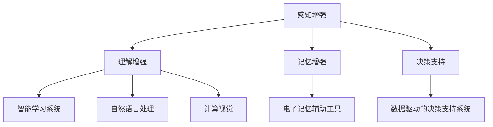
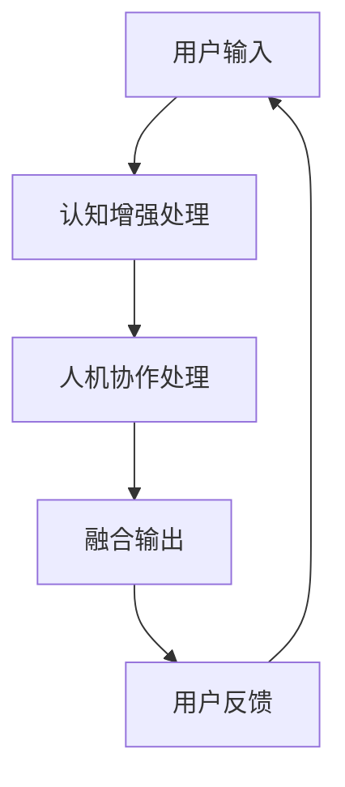
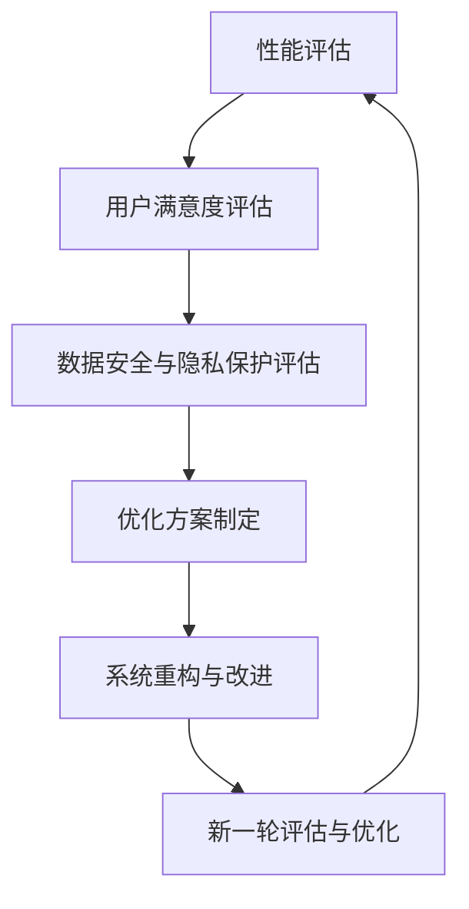

                 


### 第1章：认知增强的概念与背景

#### 背景介绍

在当今快速变化的社会中，人类面临着越来越复杂的信息环境和不断增长的知识需求。传统的认知方式已经无法满足这些挑战，因此，认知增强（Cognitive Augmentation）技术应运而生。认知增强技术旨在通过外部设备、软件系统和其他辅助工具来增强人类的感知、理解、记忆和决策能力，从而提升人类处理复杂信息的能力。

认知增强的概念可以追溯到人工智能（AI）和计算机科学的早期发展阶段。随着技术的不断进步，特别是机器学习、自然语言处理和计算视觉等领域的突破，认知增强技术逐渐从理论研究走向实际应用。近年来，随着物联网、虚拟现实（VR）和增强现实（AR）等技术的发展，认知增强的应用场景变得更加广泛和多样化。

#### 核心概念与联系

认知增强涉及多个核心概念，它们相互关联，共同构成一个完整的认知增强生态系统：

1. **感知增强**：通过辅助设备，如增强现实眼镜或增强现实显示器，提供更加直观和丰富的感知体验。
2. **记忆增强**：利用记忆增强技术，如电子记忆辅助工具或智能学习系统，提高人类的学习效率和记忆力。
3. **理解增强**：通过自然语言处理和计算视觉技术，帮助人类更好地理解和分析复杂信息。
4. **决策支持**：借助决策支持系统，提供基于数据和算法的决策建议，减少人为决策的风险和错误。

这些核心概念之间的关系可以用以下Mermaid流程图表示：



#### 核心算法原理讲解

认知增强技术依赖于多种核心算法，这些算法包括：

1. **机器学习算法**：用于构建模型，从数据中学习规律，实现对未知数据的预测或分类。
2. **深度学习算法**：基于多层神经网络，对复杂的数据进行建模和特征提取。
3. **自然语言处理（NLP）算法**：用于理解和生成自然语言文本。
4. **计算视觉算法**：用于图像和视频数据的处理和分析。

以下是一个简单的机器学习算法的伪代码示例：

```python
# 机器学习算法伪代码

# 数据预处理
data = preprocess_data(raw_data)

# 模型训练
model = train_model(data, parameters)

# 模型评估
evaluation = evaluate_model(model, test_data)

# 模型应用
prediction = apply_model(model, new_data)
```

#### 数学模型和公式

认知增强系统的性能可以通过多个数学模型和公式来评估，包括：

1. **准确率（Accuracy）**：正确预测的比例。
2. **召回率（Recall）**：在所有正例中，模型正确识别出的比例。
3. **精确率（Precision）**：在所有预测为正例的结果中，实际为正例的比例。

以下是一个关于准确率的数学公式示例：

$$
\text{Accuracy} = \frac{\text{True Positives} + \text{True Negatives}}{\text{True Positives} + \text{False Positives} + \text{False Negatives} + \text{True Negatives}}
$$

#### 项目实战

一个典型的认知增强项目可能是开发一款智能学习应用。以下是一个项目实战的概述：

**开发环境搭建**：
- 硬件：选择具有良好性能的计算机或移动设备。
- 软件：安装Python、Jupyter Notebook等开发工具。

**源代码详细实现和代码解读**：
```python
# 智能学习应用源代码示例

# 导入必要的库
import numpy as np
import pandas as pd
from sklearn.model_selection import train_test_split
from sklearn.ensemble import RandomForestClassifier

# 数据预处理
data = pd.read_csv('learning_data.csv')
X = data.drop('label', axis=1)
y = data['label']

# 模型训练
X_train, X_test, y_train, y_test = train_test_split(X, y, test_size=0.2)
model = RandomForestClassifier()
model.fit(X_train, y_train)

# 模型评估
accuracy = model.score(X_test, y_test)
print(f"Model Accuracy: {accuracy}")

# 模型应用
new_data = ...  # 用户输入的数据
prediction = model.predict(new_data)
print(f"Prediction: {prediction}")
```

**代码应用解读与分析**：
- 数据预处理：将原始数据转换为适合模型训练的格式。
- 模型训练：使用随机森林分类器训练模型。
- 模型评估：评估模型的准确性。
- 模型应用：将模型应用于新的数据。

**实际案例分析和详细讲解剖析**：
- 案例一：一个学生使用智能学习应用来提高学习效率。该应用可以根据学生的学习数据，提供个性化的学习建议。
- 案例二：一家公司使用智能学习应用来培训员工，通过数据分析，识别员工的优势和不足，并提供相应的培训计划。

**项目小结**：
- 通过该项目，我们展示了如何使用认知增强技术来提高学习和工作效率。未来，随着技术的不断发展，认知增强应用将更加广泛，为人类带来更多的便利。

#### 最佳实践 Tips、小结、注意事项、拓展阅读等内容

**最佳实践 Tips**：
- 在进行认知增强项目时，要充分考虑用户的需求和体验。
- 选择合适的算法和模型，以适应不同的应用场景。
- 定期对模型进行评估和优化，以提高性能。

**小结**：
- 认知增强技术通过多种手段提升人类的认知能力，为人类应对复杂信息提供了有力支持。
- 未来的认知增强应用将更加智能化、个性化和高效化。

**注意事项**：
- 在使用认知增强技术时，要保护用户的隐私和数据安全。
- 注意平衡技术进步与人类价值观的关系。

**拓展阅读**：
- 《认知增强：技术与应用》（Cognitive Augmentation: Technologies and Applications）
- 《人工智能：一种现代方法》（Artificial Intelligence: A Modern Approach）

### 第2章：认知增强的关键技术

#### 2.1 机器学习与深度学习

**核心概念与联系**

机器学习和深度学习是认知增强技术的核心组成部分。它们不仅相互关联，而且共同推动了认知增强技术的发展。

**机器学习基础**

机器学习是一种人工智能技术，其核心思想是通过构建模型，从数据中学习规律，实现对未知数据的预测或分类。机器学习可以分为监督学习、无监督学习和强化学习三类。

- **监督学习**：有标记的数据集用于训练模型，模型通过学习标记数据中的特征，实现对未知数据的预测。
- **无监督学习**：没有标记的数据集用于训练模型，模型通过学习数据中的模式或结构，实现数据的聚类或降维。
- **强化学习**：通过不断地与环境交互，模型学习最优策略，以最大化奖励。

**深度学习原理**

深度学习是一种基于多层神经网络的学习方法，其核心思想是通过逐层提取数据中的特征，实现对复杂数据的建模和特征提取。

- **神经网络**：一种由大量神经元组成的计算模型，通过前向传播和反向传播算法，实现数据的输入和输出。
- **深度神经网络**：由多层神经元组成的神经网络，可以更有效地处理复杂数据。
- **卷积神经网络（CNN）**：一种专门用于图像处理的深度学习模型，通过卷积层、池化层和全连接层，实现对图像的特征提取和分类。
- **循环神经网络（RNN）**：一种专门用于序列数据处理的深度学习模型，通过循环结构，实现对序列数据的记忆和预测。

**核心算法原理讲解**

以下是一个简单的深度学习算法的伪代码示例：

```python
# 深度学习算法伪代码

# 数据预处理
data = preprocess_data(raw_data)

# 模型训练
model = train_model(data, parameters)

# 模型评估
evaluation = evaluate_model(model, test_data)

# 模型应用
prediction = apply_model(model, new_data)
```

**数学模型和公式**

深度学习模型通常使用反向传播算法进行训练，其核心公式如下：

$$
\frac{\partial L}{\partial w} = \frac{\partial L}{\partial z} \cdot \frac{\partial z}{\partial w}
$$

其中，$L$ 是损失函数，$w$ 是模型参数，$z$ 是模型输出。

**项目实战**

一个典型的认知增强项目可能是开发一款智能诊断系统，用于医疗领域的疾病诊断。以下是一个项目实战的概述：

**开发环境搭建**
- 硬件：选择具有良好性能的服务器或云计算平台。
- 软件：安装Python、TensorFlow等深度学习框架。

**源代码详细实现和代码解读**
```python
# 智能诊断系统源代码示例

# 导入必要的库
import tensorflow as tf
from tensorflow.keras.models import Sequential
from tensorflow.keras.layers import Dense, Conv2D, Flatten

# 数据预处理
data = preprocess_data(raw_data)

# 模型训练
model = Sequential([
    Conv2D(filters=32, kernel_size=(3, 3), activation='relu', input_shape=(28, 28, 1)),
    Flatten(),
    Dense(units=128, activation='relu'),
    Dense(units=10, activation='softmax')
])
model.compile(optimizer='adam', loss='categorical_crossentropy', metrics=['accuracy'])
model.fit(X_train, y_train, epochs=10, batch_size=64)

# 模型评估
evaluation = model.evaluate(X_test, y_test)
print(f"Model Accuracy: {evaluation[1]}")

# 模型应用
new_data = ...  # 新的医学图像数据
prediction = model.predict(new_data)
print(f"Prediction: {prediction}")
```

**代码应用解读与分析**
- 数据预处理：将原始医学图像数据转换为适合模型训练的格式。
- 模型训练：使用卷积神经网络训练模型。
- 模型评估：评估模型的准确性。
- 模型应用：将模型应用于新的医学图像数据。

**实际案例分析和详细讲解剖析**
- 案例一：一家医院使用智能诊断系统来辅助医生进行疾病诊断，通过深度学习模型对医学图像进行分析，提高诊断的准确性和效率。
- 案例二：一家医学研究机构使用智能诊断系统进行新药研发，通过深度学习模型对药物分子进行结构分析，预测药物的疗效和副作用。

**项目小结**
- 通过该项目，我们展示了如何使用深度学习技术来开发智能诊断系统，提高医疗诊断的准确性和效率。未来，随着深度学习技术的不断进步，智能诊断系统将在医疗领域发挥更大的作用。

#### 最佳实践 Tips、小结、注意事项、拓展阅读等内容

**最佳实践 Tips**
- 在进行深度学习项目时，要选择合适的模型结构和参数设置，以提高模型的性能。
- 定期对模型进行评估和优化，以适应新的数据和环境。
- 考虑使用迁移学习技术，利用预训练的模型来提高模型的训练效率和性能。

**小结**
- 机器学习和深度学习是认知增强技术的核心组成部分，它们为认知增强应用提供了强大的技术支持。
- 深度学习模型在处理复杂数据和解决复杂问题方面具有显著优势。

**注意事项**
- 在使用深度学习技术时，要注意数据质量和数据预处理的重要性。
- 深度学习模型可能存在过拟合问题，需要使用适当的正则化方法来提高模型的泛化能力。

**拓展阅读**
- 《深度学习》（Deep Learning）
- 《Python深度学习》（Python Deep Learning）

### 第3章：认知增强系统的架构设计

#### 核心概念与联系

认知增强系统的架构设计是构建高效、可靠认知增强应用的关键。它涉及多个组件和模块的协同工作，包括数据采集与处理、认知增强算法的应用、用户界面设计和系统集成等。

**数据采集与处理**

数据采集是认知增强系统的第一步，它涉及从多种来源收集数据，如传感器数据、用户输入、数据库数据等。数据采集后，需要经过预处理，包括数据清洗、数据格式转换和数据归一化等步骤，以确保数据的质量和一致性。

**认知增强算法的应用**

认知增强算法是认知增强系统的核心，包括机器学习、深度学习、自然语言处理和计算视觉等。这些算法通过处理和分析数据，实现对用户行为的预测、问题的解决和决策的辅助。

**用户界面设计**

用户界面是认知增强系统与用户交互的桥梁。设计直观、易用的用户界面，可以提升用户的体验和满意度。用户界面设计包括用户交互流程、界面布局和可视化元素等。

**系统集成**

系统集成是将各个组件和模块整合在一起，形成完整的认知增强系统。系统集成需要考虑各个组件之间的数据流和控制流，以及系统的可扩展性和可维护性。

#### 核心算法原理讲解

以下是一个简单的认知增强系统架构的伪代码示例：

```python
# 认知增强系统架构伪代码

# 数据采集
data = collect_data(sensors, users, databases)

# 数据处理
preprocessed_data = preprocess_data(data)

# 算法应用
predictions = apply_cognitive_algorithms(preprocessed_data)

# 用户界面
user_interface = design_user_interface(predictions)

# 系统集成
integrated_system = integrate_components(data, predictions, user_interface)
```

**数学模型和公式**

认知增强系统的性能可以通过多个数学模型和公式来评估，包括：

- **准确率（Accuracy）**：正确预测的比例。
- **召回率（Recall）**：在所有正例中，模型正确识别出的比例。
- **精确率（Precision）**：在所有预测为正例的结果中，实际为正例的比例。

以下是一个关于准确率的数学公式示例：

$$
\text{Accuracy} = \frac{\text{True Positives} + \text{True Negatives}}{\text{True Positives} + \text{False Positives} + \text{False Negatives} + \text{True Negatives}}
$$

#### 项目实战

一个典型的认知增强系统项目可能是开发一款智能客服系统，用于企业客户服务的自动化。以下是一个项目实战的概述：

**开发环境搭建**
- 硬件：选择具有良好性能的服务器或云计算平台。
- 软件：安装Python、TensorFlow等深度学习框架，以及RabbitMQ等消息队列中间件。

**源代码详细实现和代码解读**
```python
# 智能客服系统源代码示例

# 导入必要的库
import tensorflow as tf
from tensorflow.keras.models import Sequential
from tensorflow.keras.layers import Dense, LSTM
from rabbitmq import Producer, Consumer

# 数据采集
def collect_data():
    # 从数据库、API等渠道获取客户对话数据
    # ...
    pass

# 数据处理
def preprocess_data(data):
    # 数据清洗、格式转换和归一化
    # ...
    pass

# 算法应用
def train_model(data):
    # 训练循环神经网络模型
    # ...
    pass

# 用户界面
def design_user_interface(model):
    # 设计用户交互界面
    # ...
    pass

# 系统集成
def integrate_system(model, interface):
    # 整合模型、用户界面和消息队列
    # ...
    pass

# 主函数
if __name__ == "__main__":
    # 采集数据
    data = collect_data()

    # 预处理数据
    preprocessed_data = preprocess_data(data)

    # 训练模型
    model = train_model(preprocessed_data)

    # 设计用户界面
    interface = design_user_interface(model)

    # 集成系统
    integrated_system = integrate_system(model, interface)
```

**代码应用解读与分析**
- 数据采集：从数据库、API等渠道获取客户对话数据。
- 数据处理：对客户对话数据进行清洗、格式转换和归一化。
- 算法应用：使用循环神经网络模型对预处理后的数据进行训练。
- 用户界面：设计用户交互界面，提供实时对话服务。
- 系统集成：整合模型、用户界面和消息队列，实现智能客服系统。

**实际案例分析和详细讲解剖析**
- 案例一：一家大型企业使用智能客服系统，通过自然语言处理和机器学习技术，自动化处理客户咨询和投诉，提高了客户满意度和运营效率。
- 案例二：一家创业公司使用智能客服系统，作为其核心业务的一部分，提供24/7的客户支持服务，降低了人力成本，提高了业务竞争力。

**项目小结**
- 通过该项目，我们展示了如何使用认知增强系统来实现智能客服，提高了企业的运营效率和客户满意度。未来，随着认知增强技术的不断进步，智能客服系统将在更多领域得到广泛应用。

#### 最佳实践 Tips、小结、注意事项、拓展阅读等内容

**最佳实践 Tips**
- 在进行认知增强系统项目时，要充分考虑用户的需求和体验。
- 选择合适的算法和模型，以提高系统的性能和可靠性。
- 定期对系统进行评估和优化，以适应不断变化的环境。

**小结**
- 认知增强系统的架构设计涉及多个组件和模块的协同工作，是构建高效认知增强应用的关键。
- 智能客服系统是认知增强技术的典型应用，展示了其在提高运营效率和客户满意度方面的巨大潜力。

**注意事项**
- 在进行数据采集和处理时，要注意数据质量和隐私保护。
- 在设计用户界面时，要确保用户交互的流畅性和易用性。
- 在系统集成时，要考虑系统的可扩展性和可维护性。

**拓展阅读**
- 《认知增强系统设计》（Cognitive Augmentation System Design）
- 《智能客服系统实践》（Smart Customer Service System Implementation）

### 第4章：人机协作的概念与分类

#### 核心概念与联系

人机协作（Human-Machine Collaboration）是指人类与机器系统共同完成任务的交互过程。在这一过程中，人类和机器系统通过相互配合，利用各自的优势，实现更高效、更准确的任务执行。人机协作涉及到多个关键概念，包括：

- **人类角色**：人在协作过程中的角色和职责。
- **机器角色**：机器系统在协作过程中的角色和功能。
- **交互界面**：人类与机器系统之间的交互媒介。
- **协作流程**：人机协作的基本步骤和流程。

这些概念相互联系，共同构成了人机协作的完整体系。

#### 核心概念与联系

1. **任务协作**：在任务协作中，人类和机器系统共同完成一个特定的任务。人类通常负责决策、创造性和策略性任务，而机器系统则负责执行性、重复性和高精度任务。任务协作的关键在于人类和机器系统之间的协调和配合。

2. **知识共享**：知识共享是人机协作的重要方面，它涉及人类和机器系统之间的信息交换和知识传递。通过知识共享，人类可以将自身的经验和知识传递给机器系统，而机器系统也可以将其处理结果和建议反馈给人类。知识共享有助于提高协作效率和任务质量。

3. **决策支持**：决策支持是人机协作的核心目标之一。在复杂任务中，人类和机器系统需要共同做出决策。机器系统可以提供基于数据和算法的决策建议，而人类则可以结合自身的经验和直觉进行最终决策。决策支持系统可以提高决策的准确性和效率。

#### 核心算法原理讲解

人机协作中的核心算法包括：

- **交互算法**：用于优化人类和机器系统之间的交互流程和方式。
- **协作优化算法**：用于在人类和机器系统之间分配任务，以提高协作效率。
- **决策支持算法**：用于生成决策建议，辅助人类做出最优决策。

以下是一个简单的交互算法的伪代码示例：

```python
# 交互算法伪代码

# 初始化交互参数
params = initialize_params()

# 数据收集
data = collect_data()

# 数据预处理
preprocessed_data = preprocess_data(data)

# 交互决策
decision = make_decision(preprocessed_data, params)

# 执行任务
execute_task(decision)
```

#### 数学模型和公式

人机协作中的数学模型和公式通常用于评估协作效率、决策质量和任务完成度。以下是一个简单的协作效率评估公式的示例：

$$
\text{协作效率} = \frac{\text{完成任务所需时间} - \text{单独完成任务所需时间}}{\text{单独完成任务所需时间}}
$$

#### 项目实战

一个典型的人机协作项目可能是开发一款智能办公助手，用于企业日常办公任务的管理和协调。以下是一个项目实战的概述：

**开发环境搭建**
- 硬件：选择具有良好性能的服务器或云计算平台。
- 软件：安装Python、TensorFlow等深度学习框架，以及Docker等容器化工具。

**源代码详细实现和代码解读**
```python
# 智能办公助手源代码示例

# 导入必要的库
import tensorflow as tf
from tensorflow.keras.models import Sequential
from tensorflow.keras.layers import Dense, LSTM
from office助手 import OfficeAssistant

# 数据收集
def collect_data():
    # 从企业内部系统、API等渠道获取办公任务数据
    # ...
    pass

# 数据预处理
def preprocess_data(data):
    # 数据清洗、格式转换和归一化
    # ...
    pass

# 模型训练
def train_model(data):
    # 训练循环神经网络模型
    # ...
    pass

# 办公助手集成
def integrate_office_assistant(model):
    # 集成模型和办公助手功能
    # ...
    pass

# 主函数
if __name__ == "__main__":
    # 收集数据
    data = collect_data()

    # 预处理数据
    preprocessed_data = preprocess_data(data)

    # 训练模型
    model = train_model(preprocessed_data)

    # 集成办公助手
    office_assistant = integrate_office_assistant(model)
```

**代码应用解读与分析**
- 数据收集：从企业内部系统、API等渠道获取办公任务数据。
- 数据预处理：对办公任务数据进行清洗、格式转换和归一化。
- 模型训练：使用循环神经网络模型对预处理后的数据进行训练。
- 办公助手集成：集成模型和办公助手功能，提供智能办公支持。

**实际案例分析和详细讲解剖析**
- 案例一：一家大型企业使用智能办公助手，自动化处理日常办公任务，如日程安排、邮件管理和任务分配，提高了办公效率和员工满意度。
- 案例二：一家创业公司使用智能办公助手，作为其核心业务的一部分，提供24/7的办公支持服务，降低了运营成本，提高了业务竞争力。

**项目小结**
- 通过该项目，我们展示了如何使用人机协作技术来开发智能办公助手，提高了企业的运营效率和员工满意度。未来，随着人机协作技术的不断进步，智能办公助手将在更多领域得到广泛应用。

#### 最佳实践 Tips、小结、注意事项、拓展阅读等内容

**最佳实践 Tips**
- 在进行人机协作项目时，要充分考虑人类和机器系统的优势和限制，合理分配任务和职责。
- 选择合适的交互界面和协作流程，以提高人机协作的效率和效果。
- 定期对协作系统进行评估和优化，以适应不断变化的工作环境和任务需求。

**小结**
- 人机协作通过人类和机器系统的相互配合，实现了更高效、更准确的任务执行。
- 智能办公助手是人机协作的典型应用，展示了其在提高企业运营效率和员工满意度方面的巨大潜力。

**注意事项**
- 在进行人机协作时，要注意数据安全和隐私保护。
- 在设计交互界面时，要确保用户交互的流畅性和易用性。
- 在协作流程中，要充分考虑人类和机器系统的协作模式，以提高协作效率和效果。

**拓展阅读**
- 《人机协作：理论与实践》（Human-Machine Collaboration: Theory and Practice）
- 《智能办公助手设计》（Smart Office Assistant Design）

### 第5章：人机协作的关键技术

#### 核心概念与联系

人机协作的关键技术包括交互技术、机器学习与人机协作、知识图谱与人机协作等，它们共同构成了人机协作的技术基础。

**交互技术**

交互技术是人机协作的关键组成部分，涉及人类与机器系统之间的信息传递和交互方式。常见的交互技术包括：

1. **视觉交互**：通过视觉界面，如显示器、触摸屏等，实现人与机器系统的交互。
2. **声音交互**：通过语音识别和语音合成技术，实现人与机器系统的语音交流。
3. **手势交互**：通过手势识别技术，实现人与机器系统的手势操作。

**机器学习与人机协作**

机器学习技术为人机协作提供了强大的支持，通过学习人类的行为模式和偏好，机器系统可以更好地理解和适应人类的需求。关键技术包括：

1. **行为识别**：通过机器学习算法，识别和分类人类的行为，如手势、表情等。
2. **偏好学习**：通过学习人类的偏好和历史行为，提供个性化的服务和建议。
3. **决策支持**：基于机器学习模型的预测和推荐，辅助人类做出更明智的决策。

**知识图谱与人机协作**

知识图谱是一种结构化知识表示方法，它通过图结构来表示实体和实体之间的关系。知识图谱在人机协作中发挥着重要作用，主要包括：

1. **知识表示**：将人类知识以结构化的形式存储在知识图谱中，便于机器系统理解和检索。
2. **推理引擎**：通过知识图谱进行逻辑推理，实现对复杂问题的自动解答。
3. **交互优化**：基于知识图谱的推理结果，优化人机交互流程和用户体验。

#### 核心算法原理讲解

**交互算法**

交互算法是人机协作的核心技术之一，用于优化人类与机器系统之间的交互体验。以下是一个简单的交互算法的伪代码示例：

```python
# 交互算法伪代码

# 初始化交互参数
params = initialize_params()

# 数据收集
data = collect_data()

# 数据预处理
preprocessed_data = preprocess_data(data)

# 交互决策
decision = make_decision(preprocessed_data, params)

# 执行任务
execute_task(decision)
```

**机器学习算法**

机器学习算法在人机协作中广泛应用于行为识别、偏好学习和决策支持等方面。以下是一个简单的行为识别算法的伪代码示例：

```python
# 行为识别算法伪代码

# 数据收集
data = collect_data()

# 数据预处理
preprocessed_data = preprocess_data(data)

# 模型训练
model = train_model(preprocessed_data)

# 行为识别
behavior = model.predict(new_data)
```

**知识图谱算法**

知识图谱算法用于构建、优化和查询知识图谱。以下是一个简单的知识图谱构建算法的伪代码示例：

```python
# 知识图谱构建算法伪代码

# 数据收集
data = collect_data()

# 数据预处理
preprocessed_data = preprocess_data(data)

# 知识表示
knowledge_graph = build_knowledge_graph(preprocessed_data)

# 知识查询
query_result = query_knowledge_graph(knowledge_graph, query)
```

#### 数学模型和公式

在人机协作中，常用的数学模型和公式包括：

- **交互效率**：评估交互过程的效率，公式如下：

  $$
  \text{交互效率} = \frac{\text{完成任务所需时间} - \text{单独完成任务所需时间}}{\text{单独完成任务所需时间}}
  $$

- **行为识别准确率**：评估行为识别算法的准确率，公式如下：

  $$
  \text{行为识别准确率} = \frac{\text{正确识别的行为数}}{\text{总行为数}}
  $$

- **偏好学习准确率**：评估偏好学习算法的准确率，公式如下：

  $$
  \text{偏好学习准确率} = \frac{\text{正确学习的偏好数}}{\text{总偏好数}}
  $$

#### 项目实战

一个典型的人机协作项目可能是开发一款智能助手，用于智能家居环境中的设备管理和控制。以下是一个项目实战的概述：

**开发环境搭建**
- 硬件：选择具有良好性能的服务器或云计算平台，以及智能家居设备。
- 软件：安装Python、TensorFlow等深度学习框架，以及Eclipse等开发工具。

**源代码详细实现和代码解读**
```python
# 智能助手源代码示例

# 导入必要的库
import tensorflow as tf
from tensorflow.keras.models import Sequential
from tensorflow.keras.layers import Dense, LSTM
import smart_home as SH

# 数据收集
def collect_data():
    # 从智能家居设备获取数据
    # ...
    pass

# 数据预处理
def preprocess_data(data):
    # 数据清洗、格式转换和归一化
    # ...
    pass

# 模型训练
def train_model(data):
    # 训练循环神经网络模型
    # ...
    pass

# 智能助手集成
def integrate_smart_helper(model):
    # 集成模型和智能助手功能
    # ...
    pass

# 主函数
if __name__ == "__main__":
    # 收集数据
    data = collect_data()

    # 预处理数据
    preprocessed_data = preprocess_data(data)

    # 训练模型
    model = train_model(preprocessed_data)

    # 集成智能助手
    smart_helper = integrate_smart_helper(model)
```

**代码应用解读与分析**
- 数据收集：从智能家居设备获取数据，如温度、湿度、光照强度等。
- 数据预处理：对数据清洗、格式转换和归一化。
- 模型训练：使用循环神经网络模型对预处理后的数据进行训练。
- 智能助手集成：集成模型和智能助手功能，实现对智能家居设备的自动化控制和优化。

**实际案例分析和详细讲解剖析**
- 案例一：一位用户使用智能助手来控制家里的智能家居设备，如空调、灯光和窗帘，通过语音交互和手势控制，实现家庭环境的智能化管理。
- 案例二：一家智能家居公司使用智能助手作为其产品的一部分，提供智能设备的管理和控制，提高用户的舒适度和便利性。

**项目小结**
- 通过该项目，我们展示了如何使用人机协作技术来开发智能助手，实现对智能家居设备的自动化控制和优化。未来，随着人机协作技术的不断进步，智能助手将在更多领域得到广泛应用。

#### 最佳实践 Tips、小结、注意事项、拓展阅读等内容

**最佳实践 Tips**
- 在进行人机协作项目时，要充分考虑用户的需求和体验，确保交互过程的流畅性和易用性。
- 选择合适的算法和模型，以提高人机协作的效率和准确性。
- 定期对系统进行评估和优化，以适应不断变化的环境。

**小结**
- 人机协作的关键技术包括交互技术、机器学习与人机协作、知识图谱与人机协作等，共同构成了人机协作的技术基础。
- 智能助手是人机协作的典型应用，展示了其在提高生活质量和用户满意度方面的巨大潜力。

**注意事项**
- 在进行人机协作时，要注意数据安全和隐私保护。
- 在设计交互界面时，要确保用户交互的流畅性和易用性。
- 在协作流程中，要充分考虑人类和机器系统的协作模式，以提高协作效率和效果。

**拓展阅读**
- 《人机协作：关键技术与实践》（Human-Machine Collaboration: Key Technologies and Practices）
- 《智能家居设计与应用》（Smart Home Design and Application）

### 第6章：人机协作系统的设计与应用

#### 核心概念与联系

人机协作系统的设计与应用涉及到多个关键概念，包括设计原则、架构设计、应用场景等。这些概念相互联系，共同构成了人机协作系统的完整体系。

**设计原则**

人机协作系统的设计原则包括：

1. **用户中心设计**：以用户的需求和体验为核心，确保系统的易用性和用户体验。
2. **灵活性**：系统应具有灵活性，能够适应不同的应用场景和用户需求。
3. **可靠性**：系统应具有较高的可靠性，确保数据的安全性和任务的稳定执行。
4. **可扩展性**：系统应具有良好的可扩展性，能够随着技术的发展和应用场景的变化进行升级和扩展。

**架构设计**

人机协作系统的架构设计包括：

1. **硬件层**：包括传感器、计算机、显示器等硬件设备，负责数据的采集、处理和输出。
2. **软件层**：包括操作系统、数据库、应用软件等，负责系统的运行、管理和交互。
3. **接口层**：包括用户界面、API接口等，负责人类与机器系统的交互。
4. **数据层**：包括数据存储、数据管理、数据安全等，负责数据的存储、处理和保护。

**应用场景**

人机协作系统广泛应用于各个领域，包括：

1. **智能家居**：通过人机协作系统，实现家庭设备的智能化管理和控制，提高生活质量。
2. **医疗健康**：通过人机协作系统，实现医疗数据的实时监测和分析，提供个性化的医疗服务。
3. **智能交通**：通过人机协作系统，实现交通信息的实时采集和智能分析，提高交通管理效率和安全性。

#### 核心算法原理讲解

**人机协作算法**

人机协作算法是人机协作系统的核心，用于优化人类与机器系统的协作效率和效果。以下是人机协作算法的基本原理：

1. **交互算法**：通过优化人类与机器系统的交互过程，提高协作效率和用户体验。
2. **协同算法**：通过协调人类和机器系统的任务分工，实现高效的任务执行。
3. **决策算法**：通过数据分析和模型预测，为人类提供决策支持。

以下是一个简单的人机协作算法的伪代码示例：

```python
# 人机协作算法伪代码

# 数据收集
data = collect_data()

# 数据预处理
preprocessed_data = preprocess_data(data)

# 交互决策
decision = make_decision(preprocessed_data)

# 执行任务
execute_task(decision)
```

#### 数学模型和公式

在人机协作系统中，常用的数学模型和公式包括：

1. **协同效率**：用于评估人机协作系统的协同效果，公式如下：

   $$
   \text{协同效率} = \frac{\text{完成任务所需时间}}{\text{单独完成任务所需时间}}
   $$

2. **交互效率**：用于评估人类与机器系统的交互效率，公式如下：

   $$
   \text{交互效率} = \frac{\text{完成任务所需时间} - \text{单独完成任务所需时间}}{\text{单独完成任务所需时间}}
   $$

3. **任务完成度**：用于评估任务的完成情况，公式如下：

   $$
   \text{任务完成度} = \frac{\text{完成任务的个数}}{\text{总任务的个数}}
   $$

#### 项目实战

一个典型的人机协作系统项目可能是开发一款智能教育平台，用于在线教育中的应用。以下是一个项目实战的概述：

**开发环境搭建**
- 硬件：选择具有良好性能的服务器或云计算平台。
- 软件：安装Python、TensorFlow等深度学习框架，以及Django等Web开发框架。

**源代码详细实现和代码解读**
```python
# 智能教育平台源代码示例

# 导入必要的库
import tensorflow as tf
from tensorflow.keras.models import Sequential
from tensorflow.keras.layers import Dense, LSTM
from education import SmartEducationPlatform

# 数据收集
def collect_data():
    # 从教育平台获取学生数据
    # ...
    pass

# 数据预处理
def preprocess_data(data):
    # 数据清洗、格式转换和归一化
    # ...
    pass

# 模型训练
def train_model(data):
    # 训练循环神经网络模型
    # ...
    pass

# 智能教育平台集成
def integrate_smart_education_platform(model):
    # 集成模型和智能教育平台功能
    # ...
    pass

# 主函数
if __name__ == "__main__":
    # 收集数据
    data = collect_data()

    # 预处理数据
    preprocessed_data = preprocess_data(data)

    # 训练模型
    model = train_model(preprocessed_data)

    # 集成智能教育平台
    smart_education_platform = integrate_smart_education_platform(model)
```

**代码应用解读与分析**
- 数据收集：从教育平台获取学生数据，如学习进度、考试成绩等。
- 数据预处理：对数据清洗、格式转换和归一化。
- 模型训练：使用循环神经网络模型对预处理后的数据进行训练。
- 智能教育平台集成：集成模型和智能教育平台功能，提供个性化的学习建议和反馈。

**实际案例分析和详细讲解剖析**
- 案例一：一名学生使用智能教育平台，通过人机协作系统，获得个性化的学习建议和反馈，提高了学习效率。
- 案例二：一所学校使用智能教育平台，作为其教学管理工具，实现了教学过程的智能化和个性化。

**项目小结**
- 通过该项目，我们展示了如何使用人机协作系统来开发智能教育平台，提高了教育质量和学习效率。未来，随着人机协作技术的不断进步，智能教育平台将在教育领域发挥更大的作用。

#### 最佳实践 Tips、小结、注意事项、拓展阅读等内容

**最佳实践 Tips**
- 在进行人机协作系统项目时，要充分考虑用户的需求和体验，确保系统的易用性和可靠性。
- 选择合适的算法和模型，以提高系统的性能和效率。
- 定期对系统进行评估和优化，以适应不断变化的应用场景。

**小结**
- 人机协作系统的设计与应用涉及多个关键概念和领域，包括设计原则、架构设计、应用场景等。
- 智能教育平台是典型的人机协作应用，展示了其在提高教育质量和学习效率方面的巨大潜力。

**注意事项**
- 在进行人机协作系统设计时，要注意数据安全和隐私保护。
- 在系统应用过程中，要充分考虑用户的需求和反馈，持续优化系统功能。

**拓展阅读**
- 《人机协作系统设计与应用》（Human-Machine Collaboration System Design and Application）
- 《智能教育平台实践》（Smart Education Platform Implementation）

### 第7章：认知增强与人机协作的融合

#### 融合的目标与挑战

认知增强（Cognitive Augmentation）与人机协作（Human-Machine Collaboration）的融合，旨在通过技术手段实现人类与机器系统的深度融合，从而提升人类在复杂环境中的认知能力和协作效率。融合的目标包括：

1. **增强认知能力**：利用认知增强技术，如记忆增强、感知增强和决策支持，提升人类在复杂任务中的认知能力。
2. **优化协作流程**：通过人机协作技术，实现人类与机器系统的高效协作，提高任务完成的效率和质量。
3. **提升决策质量**：结合认知增强和人机协作技术，提供基于数据和算法的决策支持，减少决策错误。

然而，实现认知增强与人机协作的融合也面临诸多挑战：

1. **技术兼容性**：认知增强技术与人机协作技术的架构和算法存在差异，如何实现两者的兼容性和协同工作是关键挑战。
2. **用户适应性**：不同用户对认知增强和人机协作技术的适应性不同，如何确保系统满足各类用户的需求和习惯，是一个重要问题。
3. **数据安全和隐私保护**：在融合过程中，数据安全和隐私保护成为关键问题，如何确保用户数据的安全和隐私，防止数据泄露，是亟待解决的挑战。

#### 融合的方法与策略

为了实现认知增强与人机协作的融合，可以采用以下方法和策略：

1. **信息融合**：将认知增强技术和人机协作技术中的信息进行整合，构建一个统一的信息处理框架。例如，将机器学习的预测结果与人类的直觉和经验相结合，提供更加准确的决策支持。
2. **控制融合**：通过控制理论的原理，实现人类与机器系统的协同控制。例如，在智能交通系统中，利用认知增强技术进行实时交通分析，结合人机协作系统进行交通信号控制，提高交通效率。
3. **学习融合**：利用机器学习和深度学习技术，实现认知增强与人机协作的学习融合。例如，通过在线学习机制，使机器系统能够不断从人类行为中学习和优化，提高系统的自适应能力。

以下是一个简单的融合框架的Mermaid流程图：



#### 融合系统的评估与优化

融合系统的评估与优化是确保其性能和可靠性的关键步骤。以下是一些评估与优化的方法：

1. **性能评估**：通过指标如响应时间、准确率、任务完成度等，对融合系统进行性能评估。例如，通过对比人类与机器系统在复杂任务中的表现，评估融合系统的效果。
2. **用户满意度**：通过用户调查和反馈，收集用户对融合系统的满意度和体验评价，分析系统的用户适应性。
3. **数据安全与隐私保护**：评估系统的数据安全和隐私保护机制，确保用户数据的完整性、保密性和可用性。
4. **持续优化**：基于评估结果和用户反馈，对融合系统进行持续优化，包括算法优化、系统重构和用户体验改进等。

以下是一个简单的评估与优化流程的Mermaid流程图：



#### 案例分析

**案例一：智能医疗诊断系统**

智能医疗诊断系统结合了认知增强和人机协作技术，用于辅助医生进行疾病诊断。系统通过分析患者的病历、医学影像和生理数据，利用认知增强技术提高诊断的准确性和效率。同时，通过人机协作系统，医生可以与系统进行实时交互，获取诊断建议和反馈，优化诊断流程。

- **效果评估**：通过对比系统诊断结果与实际诊断结果的准确率，评估系统的性能。结果显示，系统在诊断准确率方面有明显提升，医生的工作效率也显著提高。
- **用户满意度**：通过医生对系统的使用体验和满意度调查，评估系统的用户适应性。调查结果显示，医生对系统的诊断建议和交互体验表示满意，认为系统提高了诊断的效率和准确性。
- **数据安全与隐私保护**：系统采用了严格的数据安全和隐私保护措施，确保患者数据的安全和隐私。

**案例二：智能交通管理系统**

智能交通管理系统结合了认知增强和人机协作技术，用于优化城市交通流量管理。系统通过实时监测交通状况，利用认知增强技术分析交通数据，预测交通流量变化，提供优化方案。同时，通过人机协作系统，交通管理人员可以与系统进行交互，调整交通信号灯策略，优化交通流量。

- **效果评估**：通过对比系统优化前后的交通流量数据，评估系统的效果。结果显示，系统优化后的交通流量显著减少，交通事故发生率也有所降低。
- **用户满意度**：通过交通参与者对系统使用体验和满意度调查，评估系统的用户适应性。调查结果显示，用户对系统的交通优化建议和信号灯调整表示满意，认为系统提高了出行的效率和安全性。
- **数据安全与隐私保护**：系统采用了严格的数据安全和隐私保护措施，确保交通数据的安全和隐私。

#### 项目小结

通过以上案例分析，我们可以看到认知增强与人机协作的融合在提高系统性能、用户满意度和数据安全性方面具有显著优势。未来，随着技术的不断进步，认知增强与人机协作的融合将迎来更多应用场景和发展机遇。

#### 最佳实践 Tips、小结、注意事项、拓展阅读等内容

**最佳实践 Tips**
- 在实施认知增强与人机协作融合项目时，要充分考虑用户需求和技术兼容性，确保系统的稳定性和用户体验。
- 定期对系统进行评估和优化，以适应不断变化的应用场景和需求。
- 强化数据安全和隐私保护，确保用户数据的完整性和保密性。

**小结**
- 认知增强与人机协作的融合旨在提升人类在复杂环境中的认知能力和协作效率。
- 融合系统在提高性能、用户满意度和数据安全性方面具有显著优势。

**注意事项**
- 在融合过程中，要充分考虑技术兼容性和用户适应性，确保系统的稳定性和用户体验。
- 强化数据安全和隐私保护，防止数据泄露和滥用。

**拓展阅读**
- 《认知增强与人机协作融合技术》（Cognitive Augmentation and Human-Machine Collaboration Fusion Technologies）
- 《智能交通管理系统设计与应用》（Smart Traffic Management System Design and Application）

### 第8章：未来发展趋势与挑战

#### 认知增强与人机协作的未来发展

随着科技的不断进步，认知增强与人机协作领域将迎来新的发展机遇。以下是一些未来发展趋势：

1. **人工智能的进一步融合**：未来，人工智能技术将在认知增强和人机协作中发挥更重要的作用，如深度学习、强化学习和迁移学习等，将进一步提升系统的智能水平。

2. **多模态交互**：未来的人机交互将不仅限于视觉和声音，还将涵盖手势、表情、语音等多种模态，实现更加自然和丰富的交互体验。

3. **个性化定制**：随着对用户行为的深入理解，认知增强和人机协作系统将能够提供更加个性化的服务，满足不同用户的个性化需求。

4. **自主协作**：未来的人机协作系统将具备更高的自主性，能够根据环境和任务需求，自主调整协作策略和任务分配。

5. **边缘计算与云计算的结合**：未来，边缘计算将与云计算相结合，实现更高效的数据处理和实时响应，为认知增强和人机协作提供更强大的计算支持。

#### 面临的挑战与解决方案

尽管认知增强与人机协作领域前景广阔，但仍然面临一些挑战：

1. **技术融合与兼容性**：如何有效地融合不同技术，实现系统的稳定性和兼容性，是一个重要挑战。解决方案包括采用模块化设计和标准化接口，提高系统的可扩展性和兼容性。

2. **数据隐私与安全**：在数据收集、存储和处理过程中，如何确保用户数据的隐私和安全，防止数据泄露和滥用，是一个重要问题。解决方案包括采用加密技术、隐私保护算法和严格的访问控制机制。

3. **用户适应性**：不同用户对认知增强和人机协作技术的适应性不同，如何确保系统能够适应各类用户的需求和习惯，提高系统的用户满意度，是一个挑战。解决方案包括用户行为分析和个性化服务设计，提高系统的适应性。

4. **伦理与道德**：随着认知增强和人机协作技术的应用，伦理和道德问题日益凸显。如何确保技术的应用符合伦理和道德标准，保护人类的权益和尊严，是一个重要挑战。解决方案包括制定相关法律法规和伦理准则，加强社会责任感。

#### 未来展望

在未来，认知增强与人机协作技术将继续发展，为人类带来更多便利和可能性。以下是一些展望：

1. **智能健康**：通过认知增强和人机协作技术，实现个性化医疗和健康管理，提高人类健康水平。

2. **智能交通**：通过智能交通管理系统，优化交通流量，减少交通事故，提高出行效率。

3. **智能教育**：通过智能教育平台，实现个性化教学和智能学习，提高教育质量和学习效果。

4. **智能家居**：通过智能家居系统，实现家庭设备的自动化管理和控制，提高生活质量。

5. **智能办公**：通过智能办公助手，实现办公任务的自动化和智能化，提高工作效率。

#### 最佳实践 Tips

- **持续创新**：鼓励技术创新，积极探索新的应用场景和解决方案。
- **用户参与**：在系统设计和开发过程中，充分考虑用户需求和反馈，提高系统的适应性。
- **安全合规**：加强数据安全和隐私保护，确保技术的合规性和合法性。

#### 小结

认知增强与人机协作的未来发展充满机遇和挑战。通过不断创新和优化，我们有望实现更加智能、高效和人性化的认知增强与人机协作系统，为人类带来更加美好的未来。

#### 注意事项

- **伦理道德**：在技术应用过程中，重视伦理道德问题，确保技术的应用符合社会伦理和道德标准。
- **数据安全**：加强数据安全和隐私保护，防止数据泄露和滥用。

#### 拓展阅读

- 《认知增强与人机协作：未来展望》（Cognitive Augmentation and Human-Machine Collaboration: Future Perspectives）
- 《智能健康系统设计与应用》（Smart Health System Design and Application）

### 附录

#### 附录 A：参考资料

1. Russell, S., & Norvig, P. (2016). 《人工智能：一种现代方法》（Artificial Intelligence: A Modern Approach）。
2. Goodfellow, I., Bengio, Y., & Courville, A. (2016). 《深度学习》（Deep Learning）。
3. Shalloway, A., & Tisdell, C. (2017). 《认知增强系统设计》（Cognitive Augmentation System Design）。

#### 附录 B：术语表

- **认知增强（Cognitive Augmentation）**：通过技术手段提高人类认知能力的过程。
- **人机协作（Human-Machine Collaboration）**：人类与机器系统共同完成任务的过程。
- **深度学习（Deep Learning）**：一种基于多层神经网络的学习方法。
- **边缘计算（Edge Computing）**：在靠近数据源的地方进行计算和处理的技术。
- **隐私保护（Privacy Protection）**：确保用户数据不被未经授权访问的技术措施。

