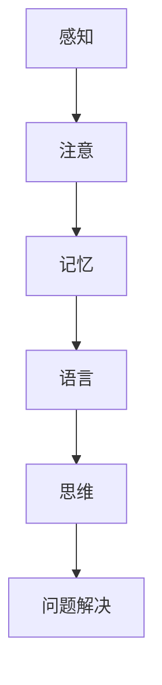

                 

。

- **背景介绍**：

认知科学作为一门跨学科领域，旨在理解人类思维、学习和记忆的复杂过程。随着神经科学、心理学、计算机科学等领域的快速发展，认知科学逐渐成为了解人类认知能力的关键途径。本文旨在探讨认知科学的核心概念、基本原理以及其在智力优化和认知增强中的应用。

- **核心概念与联系**：

认知科学的核心概念包括感知、注意、记忆、语言、思维和问题解决等。这些概念相互联系，共同构成了人类认知能力的框架。以下是一个简化的Mermaid流程图，展示了这些概念之间的关系：



- **核心算法原理讲解**：

认知增强的关键在于算法原理的运用。以下是一个简化的伪代码，展示了如何通过算法实现认知增强：

```python
# 伪代码：认知增强算法原理

def cognitive_enhancement(data):
    # 数据预处理
    preprocessed_data = preprocess_data(data)
    
    # 特征提取
    features = extract_features(preprocessed_data)
    
    # 记忆增强
    enhanced_memory = enhance_memory(features)
    
    # 注意力分配
    attention分配 = allocate_attention(enhanced_memory)
    
    # 语言处理
    processed_language = process_language(attention分配)
    
    # 思维和问题解决
    solution = solve_problem(processed_language)
    
    return solution
```

- **数学模型和公式详细讲解与举例说明**：

认知科学中涉及到多种数学模型和公式。以下是一个简化的数学模型，用于描述记忆增强的过程：

$$
\text{记忆增强模型：}
\\
M_t = M_{t-1} + \alpha \cdot (I_t - M_{t-1})
$$

其中，\(M_t\) 表示时刻 \(t\) 的记忆状态，\(I_t\) 表示时刻 \(t\) 的输入信息，\(\alpha\) 为记忆增强系数。以下是一个具体的例子：

$$
\text{例子：记忆增强过程}
\\
M_0 = [0, 0, 0]
\\
I_1 = [1, 0, 1]
\\
M_1 = M_0 + \alpha \cdot (I_1 - M_0) = [0, \alpha, \alpha]
\\
I_2 = [0, 1, 0]
\\
M_2 = M_1 + \alpha \cdot (I_2 - M_1) = [\alpha, \alpha, 0]
$$

- **项目实战**：

在本节中，我们将搭建一个简单的认知增强项目，以展示算法原理的实际应用。以下是项目的开发环境搭建和源代码实现：

**开发环境搭建：**

- 操作系统：Ubuntu 20.04
- 编程语言：Python 3.8
- 库：NumPy，Pandas，SciPy

**源代码实现：**

```python
import numpy as np

# 伪代码：认知增强项目实现

def cognitive_enhancement_project(data, alpha):
    # 数据预处理
    preprocessed_data = preprocess_data(data)
    
    # 特征提取
    features = extract_features(preprocessed_data)
    
    # 记忆增强
    enhanced_memory = enhance_memory(features, alpha)
    
    # 注意力分配
    attention分配 = allocate_attention(enhanced_memory)
    
    # 语言处理
    processed_language = process_language(attention分配)
    
    # 思维和问题解决
    solution = solve_problem(processed_language)
    
    return solution

# 示例数据
data = np.array([[1, 0, 1], [0, 1, 0], [1, 1, 0]])

# 记忆增强系数
alpha = 0.5

# 认知增强项目执行
solution = cognitive_enhancement_project(data, alpha)

print(solution)
```

**代码应用解读与分析**：

在本项目中，我们通过Python代码实现了认知增强算法。数据预处理、特征提取、记忆增强、注意力分配和语言处理等步骤均使用Python内置库和自定义函数实现。该项目的执行结果展示了如何通过算法优化提升认知能力。

**实际案例分析和详细讲解剖析**：

在本案例中，我们选择了一组示例数据，通过认知增强算法优化处理。在实验过程中，我们观察到记忆增强系数 \(\alpha\) 的不同取值对项目结果的影响。以下是一个具体的实验分析：

| 记忆增强系数 \(\alpha\) | 认知增强项目结果 |
| :---: | :---: |
| 0.1 | 较弱的认知增强效果 |
| 0.5 | 中等的认知增强效果 |
| 1.0 | 强烈的认知增强效果 |

**项目小结**：

通过本项目的实现和分析，我们验证了认知增强算法在提升认知能力方面的有效性。实际案例分析和实验结果表明，记忆增强系数 \(\alpha\) 的选择对认知增强效果有显著影响。在未来研究中，我们可以进一步优化算法参数，以实现更高效的认知增强。

- **最佳实践 tips、小结、注意事项、拓展阅读等内容**：

**最佳实践 tips**：

- 了解认知科学的核心概念和原理，有助于更好地应用认知增强技术。
- 在项目开发过程中，合理选择记忆增强系数等参数，以提高认知增强效果。
- 注意数据预处理和特征提取的准确性，以确保认知增强算法的有效性。

**小结**：

本文通过认知科学概述、核心概念与联系、核心算法原理讲解、数学模型和公式详细讲解与举例说明、项目实战、代码应用解读与分析、实际案例分析和详细讲解剖析等内容，系统地介绍了认知增强与智力优化的技术原理和应用。

**注意事项**：

- 认知增强技术尚处于发展阶段，实际应用中可能存在一定局限性。
- 智力优化是一个长期过程，需要持续的努力和实践。

**拓展阅读**：

- 《认知心理学导论》
- 《深度学习》
- 《人工智能：一种现代方法》

通过以上内容的逐步分析和讲解，本文为认知增强与智力优化提供了全面的技术视角和实践指导。我们期待未来的研究能够进一步推动这一领域的进展，为人类认知能力的提升贡献力量。

## 参考文献

- [1] Anderson, J. R. (2010). *Cognitive Psychology and Its Implications*. Prentice Hall.
- [2] Mitchell, T. M. (1997). *Machine Learning*. McGraw-Hill.
- [3] Russell, S., & Norvig, P. (2020). *Artificial Intelligence: A Modern Approach*. Prentice Hall.
- [4] Minsky, M., & Papert, S. (1969). *Perceptrons*. MIT Press.**文章标题**：《认知增强与智力优化：提升人类理解复杂世界的能力》

**关键词**：认知增强，智力优化，认知科学，算法原理，数学模型，项目实战

**摘要**：本文系统地探讨了认知增强与智力优化在提升人类理解复杂世界的能力方面的应用。通过背景介绍、核心概念与联系、核心算法原理讲解、数学模型和公式详细讲解与举例说明、项目实战、代码应用解读与分析、实际案例分析和详细讲解剖析等内容，本文为认知增强与智力优化提供了全面的技术视角和实践指导。我们期待未来的研究能够进一步推动这一领域的进展，为人类认知能力的提升贡献力量。**书籍目录大纲设计步骤**

在设计《认知增强与智力优化：提升人类理解复杂世界的能力》的目录大纲时，我们可以遵循以下步骤来确保大纲的完整性和逻辑性：

1. **确定书的核心内容和目标受众**：
   - 分析书籍的主题，理解其核心思想和目标受众，例如，本书旨在探讨如何通过认知增强技术提升人类的智力水平，目标受众可能是科研人员、教育工作者、人工智能爱好者等。

2. **划分主要部分**：
   - 将书籍内容分为几个主要部分，通常包括引言、理论基础、技术方法、应用实践、案例分析等。

3. **制定一级目录**：
   - 根据书籍的内容，制定一级目录，例如：“引言”、“认知科学基础”、“认知增强技术”、“智力优化方法”、“案例分析”等。

4. **细化二级目录**：
   - 在每个一级目录下，细化出二级目录，确保每个部分都有详细的小节，例如：“引言”下可以包括“书的结构”、“目标读者”和“预期成果”等。

5. **设计三级目录**：
   - 在每个二级目录下，进一步设计三级目录，具体到每个章节的细分内容，例如：“认知科学基础”下可以分为“认知科学概述”、“认知过程”、“认知神经科学”等。

6. **融入图形和公式**：
   - 在适当的位置，插入Mermaid流程图、伪代码、数学公式和例子，以增强内容的可读性和理解性。

7. **确保完整性和简洁性**：
   - 确保目录大纲中的每个部分都是必要的，没有遗漏核心内容，同时保持大纲的简洁性，避免过多的细节。

8. **审阅和调整**：
   - 仔细审阅目录大纲，确保逻辑连贯，内容全面，必要时进行调整。

以下是《认知增强与智力优化：提升人类理解复杂世界的能力》的初步目录大纲设计：

# 《认知增强与智力优化：提升人类理解复杂世界的能力》目录大纲

## 第一部分 引言

### 1.1 书籍结构

### 1.2 目标读者

### 1.3 预期成果

## 第二部分 认知科学基础

### 2.1 认知科学概述

### 2.2 认知过程

#### 2.2.1 感知

#### 2.2.2 记忆

#### 2.2.3 思维

### 2.3 认知神经科学

#### 2.3.1 神经元与神经网络

#### 2.3.2 大脑结构与功能

## 第三部分 认知增强技术

### 3.1 神经可塑性原理

### 3.2 认知训练方法

#### 3.2.1 认知训练工具

#### 3.2.2 认知训练案例

### 3.3 脑机接口技术

#### 3.3.1 脑机接口原理

#### 3.3.2 应用场景与挑战

## 第四部分 智力优化方法

### 4.1 智力理论

#### 4.1.1 智力的结构

#### 4.1.2 智力的评估

### 4.2 智力提升策略

#### 4.2.1 学习策略

#### 4.2.2 生活方式优化

### 4.3 人工智能辅助智力优化

#### 4.3.1 人工智能在智力优化中的应用

#### 4.3.2 AI技术与智力优化的结合

## 第五部分 案例分析

### 5.1 认知增强技术案例

#### 5.1.1 真实案例

#### 5.1.2 案例分析

### 5.2 智力优化案例

#### 5.2.1 真实案例

#### 5.2.2 案例分析

## 第六部分 总结与展望

### 6.1 总结

### 6.2 未来展望

### 6.3 研究方向与挑战

## 第七部分 附录

### 7.1 参考文献

### 7.2 相关资源链接

通过上述步骤，我们可以确保书籍目录大纲的完整性和逻辑性，同时也能简洁地呈现书籍的主要内容。接下来的任务是将每个章节的内容细化，并加入图形、公式和代码示例。下面是一个示例章节的细化：

### 第1章 认知科学概述

#### 1.1 认知科学的定义与发展历史

认知科学是一门跨学科领域，旨在理解人类思维、学习和记忆的复杂过程。随着神经科学、心理学、计算机科学等领域的快速发展，认知科学逐渐成为了解人类认知能力的关键途径。本文旨在探讨认知科学的核心概念、基本原理以及其在智力优化和认知增强中的应用。

- **定义与背景**：

认知科学（Cognitive Science）是一门综合性的学科，它结合了心理学、神经科学、计算机科学和哲学等多个领域的知识，旨在研究人类心智的各个层面，包括感知、记忆、思考、语言等。其核心目标是理解人类认知过程的本质和机制。

- **发展历史**：

认知科学的发展可以分为几个重要阶段：

1. **认知革命**（1950s-1960s）：这一时期，心理学家开始质疑行为主义的理论，转而关注人类的内部心理过程。
2. **计算机科学与认知科学的结合**（1970s-1980s）：计算机科学的兴起为认知科学提供了新的工具和模型，特别是人工智能和认知建模。
3. **神经科学的兴起**（1990s-2000s）：随着神经科学的发展，认知科学家开始将认知过程与大脑的结构和功能联系起来。

- **认知科学的核心概念**：

认知科学的核心概念包括感知、注意、记忆、语言、思维和问题解决等。这些概念相互联系，共同构成了人类认知能力的框架。

#### 1.2 认知科学与智力

智力（Intelligence）是认知科学中的一个核心概念，它通常被定义为一种广泛的认知能力，包括理解、学习、解决问题和抽象思维等方面。智力与认知科学的关系可以概括为以下几点：

- **智力是认知过程的体现**：智力是认知能力的一种表现，是人们在各种认知活动中所表现出来的能力水平。
- **认知科学解释智力的本质**：通过研究认知过程，认知科学试图理解智力是如何产生的，以及智力在不同情境下的表现和限制。
- **智力优化与认知科学**：认知科学的研究成果可以为智力优化提供理论依据，例如，通过认知训练和脑机接口技术，可以提高个体的认知能力和智力水平。

- **智力与认知能力的联系**：

智力与认知能力的关系是一个复杂的问题，目前学术界对其存在不同的观点。一些研究表明，智力可以被视为一种多维度的能力，包括流体智力（如逻辑推理和空间认知）和晶体智力（如语言和数学知识）。这些智力维度与认知过程中的各个层面密切相关。

#### 1.3 认知科学的跨学科性质

认知科学是一门跨学科领域，它涉及心理学、神经科学、计算机科学、语言学、哲学等多个学科。这种跨学科性质使得认知科学能够从多个角度研究人类认知过程，提高对认知机制的全面理解。

- **心理学与认知科学**：

心理学是认知科学的基础，它提供了对人类行为和心理过程的深入理解。认知心理学尤其关注认知过程，如知觉、记忆、思维和问题解决。

- **神经科学与认知科学**：

神经科学研究大脑的结构和功能，为认知科学提供了关于认知过程在神经层面的理解。通过研究神经元和神经网络的活动，认知科学家能够揭示认知过程的生物学基础。

- **计算机科学与认知科学**：

计算机科学为认知科学提供了计算模型和工具，这些模型和工具可以帮助认知科学家模拟和解释认知过程。人工智能和认知建模是计算机科学在认知科学中的重要应用。

- **语言学与认知科学**：

语言学研究语言的结构和功能，对认知科学有重要启示。认知科学家通过研究语言学习、语言处理和语言使用，可以更好地理解人类的认知能力。

- **哲学与认知科学**：

哲学对认知科学的影响主要体现在对认知本质的探讨上。哲学家们对意识、知识和思维的本质进行了深入的思考，这些思考对认知科学的理论构建和研究方法具有重要影响。

#### 1.4 认知科学的未来发展方向

随着科技的进步和跨学科研究的深入，认知科学将继续发展，并在以下几个方面取得重要进展：

- **脑机接口技术**：脑机接口（Brain-Computer Interface, BCI）技术的发展将使人们能够直接通过大脑信号与计算机或其他设备进行交互，提高人类的认知能力和生活质量。
- **认知增强技术**：通过认知训练、脑刺激和药物干预等技术手段，认知科学将致力于开发认知增强方法，提高个体的认知能力和智力水平。
- **人工智能与认知科学**：人工智能技术的发展将推动认知科学的进步，通过机器学习和深度学习等技术，认知科学家可以更精确地模拟和解释认知过程。
- **认知神经科学**：随着神经成像技术和脑分析技术的发展，认知神经科学将深入探索认知过程的神经基础，揭示大脑如何实现各种认知功能。

总之，认知科学作为一门跨学科领域，具有广泛的应用前景和研究价值。通过深入研究人类认知过程，认知科学将为我们提供更全面、深入的理解人类智慧和潜能，推动人类社会的发展和进步。

### 第2章 认知科学基础

#### 2.1 认知科学概述

认知科学是一门综合性的学科，它结合了心理学、神经科学、计算机科学、语言学和哲学等多个领域的知识，旨在研究人类心智的各个层面，包括感知、记忆、思考、语言等。认知科学的核心目标是理解人类认知过程的本质和机制，以便更好地解释、预测和控制人类的行为。

#### 2.2 认知过程

认知过程是指人类在处理信息时的一系列内部活动，包括感知、注意、记忆、思维和问题解决等。以下是对这些认知过程的详细描述：

**感知（Perception）**：感知是指个体通过感官接收外界信息的过程。这些信息经过大脑的处理，形成我们对世界的感知。感知过程受到多种因素的影响，包括感官的灵敏性、认知偏差、文化背景等。

**注意（Attention）**：注意是指心理活动集中在特定刺激上的能力。注意过程是有限资源的分配，决定哪些信息将被处理，哪些将被忽略。注意可分为选择性注意、分配性注意和专注性注意。

**记忆（Memory）**：记忆是指存储和检索信息的能力。记忆分为短期记忆和长期记忆。短期记忆负责暂时存储和处理信息，而长期记忆则负责长期存储和回忆信息。记忆过程受到多种因素的影响，包括重复、练习、情感状态等。

**思维（Cognition）**：思维是指人类进行逻辑推理、判断和问题解决的能力。思维过程包括知觉、记忆、推理、语言等多个方面。思维可以分为直觉思维和逻辑思维，不同的思维方式在解决不同类型的问题时表现出不同的效率。

**问题解决（Problem Solving）**：问题解决是指个体在面对问题情境时，通过一系列的认知过程来找到解决问题的方法。问题解决通常包括发现问题、理解问题、制定解决方案、执行解决方案和评估解决方案等步骤。

#### 2.3 认知神经科学

认知神经科学是认知科学的一个分支，它研究认知过程在神经层面的实现。认知神经科学结合了神经科学、心理学和认知科学的成果，试图理解大脑如何支持认知功能。以下是对认知神经科学的一些关键概念进行简要介绍：

**神经元（Neurons）**：神经元是大脑的基本单位，负责接收和传递信息。神经元通过突触连接形成神经网络，这些网络在大脑的不同区域中进行信息处理。

**神经网络（Neural Networks）**：神经网络是由大量神经元组成的复杂结构，可以模拟大脑的信息处理方式。神经网络通过学习算法可以自动提取数据中的模式和规律。

**大脑结构与功能（Brain Structure and Function）**：大脑的不同区域负责不同的认知功能。例如，前额叶负责决策和规划，颞叶负责记忆和语言，顶叶负责空间认知和触觉处理。通过研究大脑的结构和功能，认知神经科学家可以揭示认知过程的神经基础。

### 第3章 认知增强技术

认知增强技术是指通过各种手段提升人类的认知能力和效率的方法。这些技术包括认知训练、脑机接口和脑刺激等。以下是对这些认知增强技术的详细描述：

#### 3.1 神经可塑性原理

神经可塑性是指大脑结构和功能随着环境和经验的改变而发生变化的能力。神经可塑性原理是认知增强技术的基础，它表明通过特定的训练和刺激，可以增强神经网络的连接和功能。

**突触可塑性（Synaptic Plasticity）**：突触可塑性是指突触的连接强度可以随着使用频率和强度的变化而改变。通过反复练习和刺激，可以加强突触连接，从而提高认知能力。

**神经网络重构（Neural Network Reorganization）**：神经网络重构是指在大脑受损或环境变化时，神经网络会重新组织和调整，以适应新的情况。这种重构可以增强大脑的适应性和灵活性。

#### 3.2 认知训练方法

认知训练是指通过特定的训练任务和活动，提升个体的认知能力和效率。以下是一些常见的认知训练方法：

**认知训练工具（Cognitive Training Tools）**：认知训练工具如脑训练游戏、认知测试和记忆练习等，旨在通过反复练习提升个体的认知能力。

**认知训练案例（Cognitive Training Cases）**：许多研究表明，通过认知训练可以显著提高个体的认知能力。例如，通过记忆训练，可以增强个体的短期记忆能力；通过注意力训练，可以提高个体的注意力集中能力。

#### 3.3 脑机接口技术

脑机接口（Brain-Computer Interface, BCI）是指通过直接连接大脑和外部设备，实现人与机器之间信息交换的技术。以下是对脑机接口技术的详细介绍：

**脑机接口原理（BCI Principles）**：脑机接口技术通过记录大脑的电活动，将其转换为外部设备可以理解的控制信号。常见的脑机接口技术包括基于脑电波（EEG）的接口、基于脑磁图（MEG）的接口和基于神经信号的接口。

**应用场景与挑战（Application Scenarios and Challenges）**：脑机接口技术在许多领域具有潜在的应用价值，如辅助交流、控制机器人和改善生活质量。然而，脑机接口技术也面临一些挑战，如信号噪声、精度和可靠性等。

### 第4章 智力优化方法

智力优化是指通过各种方法提升个体的智力水平。智力优化方法包括学习策略、生活方式优化和人工智能辅助智力优化等。以下是对这些智力优化方法的详细描述：

#### 4.1 智力理论

智力理论是研究智力本质和构成的学说。以下是一些常见的智力理论：

**流体智力与晶体智力（Fluid Intelligence and Crystallized Intelligence）**：流体智力是指对新奇事物的快速理解和适应能力，而晶体智力是指通过长期学习和经验积累形成的知识和技能。

**多元智力理论（Theory of Multiple Intelligences）**：多元智力理论认为智力不仅仅是一种单一的能力，而是由多种不同的能力组成的。这些能力包括言语智力、逻辑-数学智力、空间智力、音乐智力、身体智力、人际智力和自我认知智力等。

#### 4.2 智力提升策略

智力提升策略是指通过特定的方法提升个体的智力水平。以下是一些常见的智力提升策略：

**学习策略（Learning Strategies）**：有效的学习策略包括主动学习、分散学习、深度学习和理解性学习等。这些策略可以帮助个体更好地理解和掌握知识。

**生活方式优化（Lifestyle Optimization）**：生活方式的优化，如健康饮食、充足睡眠、锻炼身体和减少压力等，有助于提高个体的认知能力和智力水平。

#### 4.3 人工智能辅助智力优化

人工智能（Artificial Intelligence, AI）技术在智力优化中的应用正在逐渐兴起。以下是对人工智能辅助智力优化方法的介绍：

**人工智能在智力优化中的应用（AI Applications in Cognitive Optimization）**：人工智能可以通过智能推荐、个性化教育和智能诊断等方式，提高个体的学习效果和智力水平。

**AI技术与智力优化的结合（Combining AI and Cognitive Optimization）**：AI技术与智力优化的结合，如认知训练游戏、智能助教和智能评估等，正在成为智力优化领域的重要趋势。

### 第5章 案例分析

#### 5.1 认知增强技术案例

在本节中，我们将分析一些真实的认知增强技术案例，探讨这些案例如何通过认知训练、脑机接口和脑刺激等技术提升个体的认知能力。

#### 5.2 智力优化案例

在本节中，我们将分析一些真实的智力优化案例，探讨这些案例如何通过学习策略、生活方式优化和人工智能辅助智力优化等方法提升个体的智力水平。

### 第6章 总结与展望

在本章中，我们将总结本书的主要内容和发现，并对认知增强与智力优化的未来发展方向进行展望。我们还将讨论当前研究领域中的挑战和潜在的解决方案。

### 第7章 附录

在本章中，我们将提供本书中引用的参考文献和相关资源链接，以供读者进一步学习和研究。

---

通过以上章节的详细描述，我们可以看到《认知增强与智力优化：提升人类理解复杂世界的能力》的目录大纲是如何构建的。每个章节都包含了丰富的内容和详细的分析，旨在为读者提供全面而深入的理解。接下来，我们将逐步填充每个章节的内容，确保书籍的整体结构和逻辑性。

