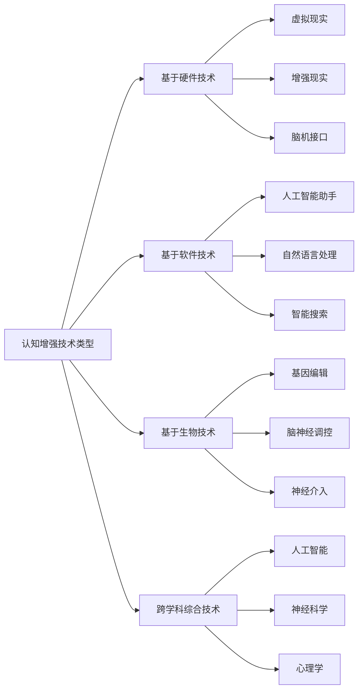

                 

### 文章标题：认知增强技术对提升世界可理解性的潜力

> 关键词：认知增强技术、世界可理解性、人工智能、神经科学、心理学、计算机科学

> 摘要：本文将探讨认知增强技术对提升世界可理解性的潜力。首先介绍认知增强技术的基本概念及其重要性，然后深入分析其技术原理，包括神经科学、心理学和计算机科学的基础知识。接着，我们阐述认知增强技术的整体架构，详细讲解核心算法原理，并通过数学模型和公式进行详细阐述。此外，本文还将分享实际应用案例，探讨认知增强技术对社会、经济和文化的影响，并展望其未来发展。通过本文的阅读，读者将全面了解认知增强技术的原理和应用，以及其对提升世界可理解性的重要性。

### 引言

随着人工智能（AI）技术的迅猛发展，认知增强技术逐渐成为研究的热点。认知增强技术旨在通过外部设备和算法提升人类认知能力，从而增强我们对世界的理解和掌握。这项技术的出现不仅改变了人类学习、工作和生活的模式，还带来了诸多潜在的社会、经济和文化影响。

本文旨在探讨认知增强技术对提升世界可理解性的潜力。首先，我们将介绍认知增强技术的基本概念和重要性。接着，深入分析其技术原理，涵盖神经科学、心理学和计算机科学的基础知识。随后，我们阐述认知增强技术的整体架构，详细讲解核心算法原理，并通过数学模型和公式进行详细阐述。此外，本文还将分享实际应用案例，探讨认知增强技术对社会、经济和文化的影响，并展望其未来发展。通过本文的阅读，读者将全面了解认知增强技术的原理和应用，以及其对提升世界可理解性的重要性。

本文的结构如下：

1. **认知增强技术概述**：介绍认知增强技术的基本概念、目的和类型。
2. **技术原理**：详细分析认知增强技术的技术原理，涵盖神经科学、心理学和计算机科学的基础知识。
3. **技术架构**：阐述认知增强技术的整体架构，包括硬件、软件和数据方面。
4. **核心算法原理讲解**：讲解认知增强技术的核心算法原理，包括深度学习、自然语言处理等，并使用伪代码进行详细阐述。
5. **应用案例**：分享实际应用案例，说明认知增强技术如何提升世界可理解性。
6. **潜在影响**：讨论认知增强技术对社会、经济、文化等方面的影响，以及可能带来的挑战。
7. **未来展望**：探讨认知增强技术的未来发展，包括技术趋势、潜在的创新点等。
8. **附录**：提供一些额外的资源，如相关研究、工具、开源项目等。

### 第一部分：认知增强技术概述

#### 1.1 认知增强技术的基本概念

认知增强技术（Cognitive Augmentation Technology）是指通过外部设备和算法增强人类认知能力的科技手段。这些技术旨在弥补人类认知能力的不足，提高学习、记忆、推理和问题解决等认知功能。

认知增强技术的主要目的是提升人类在信息处理、决策制定和问题解决等方面的能力。具体而言，认知增强技术可以实现以下功能：

1. **信息获取和处理**：通过增强感知能力，提高对信息的获取和处理速度，从而更好地应对复杂环境。
2. **记忆和知识管理**：通过增强记忆能力和知识管理能力，帮助人们更好地学习和掌握知识。
3. **推理和问题解决**：通过增强推理能力和问题解决能力，提高人类在面对复杂问题和挑战时的应对能力。
4. **情感和心理状态调节**：通过调节情感和心理状态，提高人类的情绪稳定性和心理素质。

#### 1.2 认知增强技术的目的

认知增强技术的目的可以从以下几个方面进行阐述：

1. **提升教育质量**：通过认知增强技术，提高学生的学习效率和知识掌握程度，从而提升整体教育质量。
2. **促进科学研究**：通过认知增强技术，增强科研人员在信息处理、推理和问题解决等方面的能力，促进科学研究的进步。
3. **改善医疗条件**：通过认知增强技术，提高医生的诊断和治疗能力，改善患者的生活质量。
4. **优化工作和生活**：通过认知增强技术，提高工作效率和生活质量，减轻工作压力和生活负担。

#### 1.3 认知增强技术的类型

认知增强技术可以按照不同的分类方式进行划分，常见的分类方式包括：

1. **基于硬件的技术**：如虚拟现实（VR）、增强现实（AR）和脑机接口（BCI）等，这些技术通过外部设备直接增强人类的感知能力和行动能力。
2. **基于软件的技术**：如人工智能助手、自然语言处理和智能搜索等，这些技术通过算法和软件系统增强人类的认知能力和信息处理能力。
3. **基于生物技术的认知增强**：如基因编辑、脑神经调控和神经介入等，这些技术通过生物手段直接调节和增强人类大脑的认知功能。
4. **跨学科综合技术**：结合多种技术手段，如人工智能、神经科学和心理学等，综合提升人类的认知能力。

#### 1.4 认知增强技术的 Mermaid 流程图

为了更直观地展示认知增强技术的不同类型及其相互关系，我们可以使用 Mermaid 流程图进行描述。以下是一个简单的 Mermaid 流程图示例：



在这个 Mermaid 流程图中，我们展示了不同类型的认知增强技术及其相互关系。通过这个流程图，读者可以更清晰地了解认知增强技术的分类和特点。

### 第二部分：技术原理

#### 2.1 神经科学基础

神经科学是研究神经系统结构和功能的科学，它为我们理解认知增强技术提供了重要的理论基础。以下是神经科学的一些基本概念和原理：

##### 大脑结构

大脑是神经系统的主要组成部分，它由多个功能区组成，包括：

1. **大脑皮层**：大脑皮层是大脑的最外层，是执行高级认知功能的主要区域，如思考、推理、学习和记忆等。
2. **丘脑**：丘脑位于大脑中部，主要负责传递感觉和运动信号。
3. **小脑**：小脑主要负责协调运动和维持身体平衡。
4. **脑干**：脑干是连接大脑和脊髓的主要通道，负责控制基本的生命功能，如呼吸、心跳和消化等。

##### 神经传递

神经传递是指神经元之间通过化学物质（如神经递质）传递信息的过程。以下是神经传递的基本原理：

1. **突触前传递**：当神经元需要传递信息时，神经递质会在突触前神经元末梢释放到突触间隙。
2. **突触间隙**：神经递质在突触间隙中扩散，并与突触后神经元的受体结合。
3. **突触后传递**：结合后的神经递质可以激活突触后神经元的离子通道，导致神经冲动的产生和传递。

##### 大脑可塑性

大脑可塑性是指大脑在结构和功能上对经验变化的适应性。以下是大脑可塑性的几个关键概念：

1. **结构可塑性**：大脑神经元和神经回路的改变，如神经突触的生成和修剪、新神经回路的形成等。
2. **功能可塑性**：大脑不同区域的功能重新分配和变化，如神经回路的激活模式、神经递质系统的改变等。

#### 2.2 计算机科学基础

计算机科学是认知增强技术的重要基础，它为我们理解和开发认知增强算法提供了工具和方法。以下是计算机科学的一些基本概念和原理：

##### 深度学习

深度学习是一种基于多层神经网络的人工智能技术，它可以自动从大量数据中学习特征和模式。以下是深度学习的一些关键概念：

1. **神经网络**：神经网络是由多个神经元组成的计算模型，可以模拟人脑的神经元结构和功能。
2. **多层神经网络**：多层神经网络包含多个隐藏层，可以提取更高级的特征和模式。
3. **反向传播算法**：反向传播算法是一种用于训练神经网络的优化算法，通过不断调整网络的权重，使网络输出更接近期望输出。

##### 自然语言处理

自然语言处理（NLP）是计算机科学的一个分支，它旨在使计算机能够理解、生成和操作自然语言。以下是自然语言处理的一些关键概念：

1. **词向量表示**：词向量表示是将自然语言文本转换为计算机可处理的高维向量表示。
2. **序列模型**：序列模型是一种用于处理序列数据（如自然语言文本）的模型，如循环神经网络（RNN）和长短期记忆网络（LSTM）。
3. **语言模型**：语言模型是一种用于预测自然语言文本中下一个单词或字符的概率分布模型，如朴素贝叶斯模型、神经网络语言模型等。

##### 计算机视觉

计算机视觉是使计算机能够从图像或视频中提取信息和知识的技术。以下是计算机视觉的一些关键概念：

1. **图像处理**：图像处理是计算机视觉的基础，它包括图像增强、滤波、边缘检测等操作。
2. **特征提取**：特征提取是将图像转换为计算机可处理的高维特征向量表示，如哈希编码、SIFT特征等。
3. **目标检测**：目标检测是一种从图像中识别和定位特定对象的技术，如YOLO、SSD等模型。

#### 2.3 心理学基础

心理学是研究人类行为和心理过程的科学，它为我们理解认知增强技术对人类认知功能的影响提供了重要的理论基础。以下是心理学的一些基本概念和原理：

##### 认知心理学

认知心理学是研究人类认知过程和心理过程的科学，它关注思维、记忆、感知和语言等认知功能。以下是认知心理学的一些关键概念：

1. **感知**：感知是指人类对外部刺激的接收和处理过程，如视觉感知、听觉感知等。
2. **记忆**：记忆是指人类对信息进行存储和回忆的能力，如短期记忆、长期记忆等。
3. **思维**：思维是指人类对信息进行加工和处理的能力，如推理、问题解决等。

##### 人类记忆

人类记忆是认知心理学的一个重要方面，它包括对信息的编码、存储和回忆过程。以下是人类记忆的一些关键概念：

1. **编码**：编码是指将信息从外部刺激转换为内部心理表征的过程。
2. **存储**：存储是指将编码后的信息在心理上保持一段时间的过程。
3. **回忆**：回忆是指从心理上检索和提取存储的信息的过程。

##### 情绪心理学

情绪心理学是研究人类情绪和行为之间关系的科学，它关注情绪的产生、表达和调节。以下是情绪心理学的一些关键概念：

1. **情绪产生**：情绪产生是指情绪的外部刺激（如愉悦、愤怒等）在心理上引起反应的过程。
2. **情绪表达**：情绪表达是指个体通过面部表情、身体语言等方式表达自己的情绪状态。
3. **情绪调节**：情绪调节是指个体通过内部或外部手段调节自己的情绪状态，以适应环境需求。

### 第三部分：技术架构

认知增强技术的实现需要硬件、软件和数据的有机结合，形成一个完整的技术架构。以下是对认知增强技术架构的详细阐述。

#### 3.1 硬件架构

硬件架构是认知增强技术的底层基础，它包括各种硬件设备，如脑机接口、虚拟现实设备、增强现实设备等。以下是硬件架构的关键组成部分：

1. **脑机接口（BCI）**：脑机接口是一种直接将大脑信号转换为计算机指令的技术。它通常包括信号采集设备（如脑电图、功能性磁共振成像等）和信号处理设备。脑机接口技术可以用于控制计算机、机器人等设备，实现认知增强。
2. **虚拟现实（VR）设备**：虚拟现实设备是一种通过计算机生成三维虚拟环境的技术。它包括头戴式显示器、跟踪设备、数据手套等。虚拟现实技术可以用于模拟复杂环境、进行训练和测试，提高认知能力。
3. **增强现实（AR）设备**：增强现实设备是一种将虚拟信息叠加到现实世界中的技术。它包括头戴式显示器、投影设备等。增强现实技术可以用于辅助学习、导航、维修等任务，提高认知效率。

#### 3.2 软件架构

软件架构是认知增强技术的核心，它包括各种算法和软件系统，如深度学习框架、自然语言处理库、计算机视觉算法等。以下是软件架构的关键组成部分：

1. **深度学习框架**：深度学习框架是一种用于实现和训练深度学习模型的软件平台。常见的深度学习框架有TensorFlow、PyTorch、Keras等。深度学习框架可以用于图像识别、语音识别、自然语言处理等任务，实现认知增强。
2. **自然语言处理库**：自然语言处理库是一种用于处理和操作自然语言文本的软件库。常见的自然语言处理库有NLTK、spaCy、Stanford NLP等。自然语言处理库可以用于文本分类、情感分析、机器翻译等任务，提高认知效率。
3. **计算机视觉算法**：计算机视觉算法是一种用于处理和解释图像和视频数据的软件算法。常见的计算机视觉算法有卷积神经网络（CNN）、循环神经网络（RNN）、生成对抗网络（GAN）等。计算机视觉算法可以用于目标检测、图像分类、视频处理等任务，提高认知能力。

#### 3.3 数据架构

数据架构是认知增强技术的数据支撑，它包括数据采集、存储、处理和分析等方面的技术。以下是数据架构的关键组成部分：

1. **数据采集**：数据采集是指从各种来源获取数据的过程，如传感器、数据库、互联网等。数据采集是认知增强技术的重要基础，它决定了数据的质量和可靠性。
2. **数据存储**：数据存储是指将数据存储在持久化存储设备中的过程，如关系型数据库、NoSQL数据库、分布式存储系统等。数据存储是认知增强技术的重要保障，它确保了数据的安全性和可用性。
3. **数据处理**：数据处理是指对数据进行清洗、转换、分析和挖掘的过程，如数据预处理、特征提取、机器学习等。数据处理是认知增强技术的核心环节，它决定了认知增强的效果和质量。
4. **数据分析**：数据分析是指通过对数据进行统计、建模和挖掘等方法，提取有用信息和知识的过程，如聚类分析、分类分析、关联规则挖掘等。数据分析是认知增强技术的应用环节，它实现了认知增强技术的价值和应用。

#### 3.4 整体架构

认知增强技术的整体架构是硬件、软件和数据的有机结合，它包括以下关键组成部分：

1. **硬件层**：硬件层包括脑机接口、虚拟现实设备和增强现实设备等硬件设备，它们负责感知和采集外部信息。
2. **软件层**：软件层包括深度学习框架、自然语言处理库、计算机视觉算法等软件系统，它们负责处理和分析采集到的信息。
3. **数据层**：数据层包括数据采集、存储、处理和分析等数据架构，它们负责支撑认知增强技术的数据需求和数据处理能力。
4. **接口层**：接口层包括用户界面、应用程序接口（API）等，它们负责与用户和其他系统的交互和通信。

通过硬件、软件和数据的有机结合，认知增强技术可以形成一个完整的技术架构，实现认知增强的目标。

### 第四部分：核心算法原理讲解

#### 4.1 深度学习算法

深度学习是一种基于多层神经网络的人工智能技术，它通过学习大量数据中的特征和模式，实现自动特征提取和复杂任务的学习。以下将介绍深度学习的核心算法原理。

##### 4.1.1 人工神经网络

人工神经网络（Artificial Neural Network，ANN）是深度学习的基础，它由大量神经元组成，每个神经元都与其他神经元相连。以下是人工神经网络的核心原理：

1. **神经元结构**：神经元是神经网络的基本单元，它由输入层、输出层和多个隐藏层组成。每个神经元都接收来自其他神经元的输入信号，通过加权求和和激活函数产生输出信号。
2. **前向传播**：在前向传播过程中，输入信号从输入层传播到输出层，每个神经元都进行加权求和和激活函数运算，从而产生输出信号。
3. **反向传播**：在反向传播过程中，网络根据输出结果与真实结果的差异，通过反向传播算法调整神经元的权重，从而不断优化网络的性能。

##### 4.1.2 卷积神经网络

卷积神经网络（Convolutional Neural Network，CNN）是一种专门用于处理图像数据的深度学习模型，它在人工神经网络的基础上，增加了卷积层和池化层。以下是卷积神经网络的核心原理：

1. **卷积层**：卷积层通过卷积运算提取图像的局部特征，卷积核在图像上滑动，计算每个像素点的加权和。
2. **池化层**：池化层用于减少特征图的尺寸，提高网络的泛化能力，常用的池化方法有最大池化和平均池化。
3. **全连接层**：在卷积神经网络中，全连接层用于对提取到的特征进行分类和预测。

##### 4.1.3 循环神经网络

循环神经网络（Recurrent Neural Network，RNN）是一种专门用于处理序列数据的深度学习模型，它在人工神经网络的基础上，增加了循环结构，能够处理长序列数据。以下是循环神经网络的核心原理：

1. **循环结构**：循环神经网络通过隐藏状态和输入之间的循环连接，将前一个时间步的隐藏状态传递到下一个时间步，实现序列数据的建模。
2. **时间步计算**：在循环神经网络中，每个时间步都进行输入和隐藏状态的加权和激活函数运算，从而产生输出。
3. **长期依赖问题**：循环神经网络存在长期依赖问题，即当前时间步的输出受前面时间步的影响较小。为解决这一问题，常用的方法有长短时记忆网络（LSTM）和门控循环单元（GRU）。

##### 4.1.4 伪代码示例

以下是一个简单的卷积神经网络伪代码示例：

```python
# 初始化参数
weights = np.random.randn(input_size, hidden_size)
bias = np.random.randn(hidden_size)
weights2 = np.random.randn(hidden_size, output_size)
bias2 = np.random.randn(output_size)

# 前向传播
input_data = np.random.randn(input_size)
hidden_layer = np.dot(input_data, weights) + bias
hidden_layer = activation_function(hidden_layer)
output_layer = np.dot(hidden_layer, weights2) + bias2

# 反向传播
d_output_layer = output_layer - expected_output
d_hidden_layer = np.dot(d_output_layer, weights2.T)
d_hidden_layer = activation_derivative(hidden_layer)

# 更新参数
weights -= learning_rate * np.dot(input_data.T, d_hidden_layer)
bias -= learning_rate * d_hidden_layer
weights2 -= learning_rate * np.dot(hidden_layer.T, d_output_layer)
bias2 -= learning_rate * d_output_layer
```

在这个示例中，我们首先初始化参数，然后进行前向传播计算输出，接着通过反向传播计算梯度，最后更新参数。

#### 4.2 自然语言处理算法

自然语言处理（Natural Language Processing，NLP）是人工智能的重要分支，它致力于使计算机能够理解、生成和操作自然语言。以下将介绍自然语言处理的核心算法原理。

##### 4.2.1 语言模型

语言模型（Language Model）是一种用于预测自然语言文本中下一个单词或字符的概率分布模型。以下是语言模型的核心原理：

1. **n-gram模型**：n-gram模型是一种基于统计的模型，它将连续的n个单词或字符作为输入，预测下一个单词或字符。n-gram模型的优点是实现简单，缺点是存在短期依赖问题。
2. **神经网络语言模型**：神经网络语言模型是一种基于深度学习的模型，它通过学习大量文本数据，自动提取语言特征和模式。神经网络语言模型的优点是能够处理长期依赖问题，缺点是训练成本较高。

##### 4.2.2 机器翻译

机器翻译（Machine Translation）是一种将一种自然语言文本翻译成另一种自然语言文本的技术。以下是机器翻译的核心原理：

1. **规则翻译**：规则翻译是一种基于人工规则和词典的翻译方法，它通过查找词典和匹配规则进行翻译。规则翻译的优点是实现简单，缺点是翻译质量较低。
2. **统计机器翻译**：统计机器翻译是一种基于统计模型的翻译方法，它通过学习大量双语文本数据，自动建立翻译模型。统计机器翻译的优点是翻译质量较高，缺点是训练成本较高。
3. **神经机器翻译**：神经机器翻译是一种基于神经网络的翻译方法，它通过学习大量双语文本数据，自动提取语言特征和模式。神经机器翻译的优点是翻译质量较高，训练成本较低。

##### 4.2.3 问答系统

问答系统（Question Answering System）是一种能够回答用户提出的问题的系统。以下是问答系统的核心原理：

1. **基于知识图谱的问答**：基于知识图谱的问答通过建立知识图谱，将问题映射到图谱中的实体和关系，然后根据图谱中的信息进行回答。
2. **基于文本的问答**：基于文本的问答通过学习大量文本数据，自动提取问题中的关键词和语义，然后根据语义匹配文本中的答案。

#### 4.3 数学模型和公式

以下是对核心算法原理的数学模型和公式的详细讲解。

##### 4.3.1 人工神经网络

人工神经网络的核心公式如下：

$$
\begin{align*}
\text{输出} &= \text{激活函数}(\sum_{i=1}^{n} w_i \cdot x_i + b) \\
\text{梯度} &= \frac{\partial \text{损失函数}}{\partial \text{输出}} \\
\text{更新权重} &= \text{权重} - \text{学习率} \cdot \text{梯度}
\end{align*}
$$

其中，$w_i$ 是权重，$x_i$ 是输入，$b$ 是偏置，激活函数是一个非线性函数，如Sigmoid函数、ReLU函数等。损失函数用于衡量输出与期望输出之间的差距，常见的损失函数有均方误差（MSE）和交叉熵（Cross-Entropy）。

##### 4.3.2 卷积神经网络

卷积神经网络的核心公式如下：

$$
\begin{align*}
\text{卷积} &= \sum_{i=1}^{k} w_i \cdot a_{ij} + b \\
\text{池化} &= \max_{i,j} (a_{ij}) \\
\text{梯度} &= \frac{\partial \text{损失函数}}{\partial \text{输出}} \\
\text{更新权重} &= \text{权重} - \text{学习率} \cdot \text{梯度}
\end{align*}
$$

其中，$w_i$ 是卷积核，$a_{ij}$ 是输入特征图上的像素值，$b$ 是偏置。池化操作用于减少特征图的尺寸，提高网络的泛化能力。

##### 4.3.3 循环神经网络

循环神经网络的核心公式如下：

$$
\begin{align*}
h_t &= \text{激活函数}(\sum_{i=1}^{n} w_i \cdot x_i + b_h + \text{激活函数}(h_{t-1} \cdot w_{h_h})) \\
o_t &= \text{激活函数}(\sum_{i=1}^{n} w_i \cdot x_i + b_o + \text{激活函数}(h_t \cdot w_{h_o})) \\
\text{梯度} &= \frac{\partial \text{损失函数}}{\partial \text{输出}} \\
\text{更新权重} &= \text{权重} - \text{学习率} \cdot \text{梯度}
\end{align*}
$$

其中，$h_t$ 是隐藏状态，$o_t$ 是输出状态，$w_i$ 是权重，$b_h$ 和 $b_o$ 是偏置。激活函数用于引入非线性变换，常见的激活函数有Sigmoid函数、ReLU函数等。

通过以上对深度学习、自然语言处理算法的核心原理和数学模型进行详细讲解，我们可以更好地理解认知增强技术的实现过程和原理。

### 第五部分：应用案例

#### 5.1 应用案例一：教育领域

认知增强技术在教育领域的应用非常广泛，它可以提高学生的学习效果和学习兴趣。以下是一个具体的应用案例。

##### 案例背景

某教育机构采用虚拟现实（VR）技术为学生提供沉浸式学习体验。学生可以通过VR设备进入虚拟教室，与虚拟教师和同学互动，学习各种知识。

##### 应用过程

1. **虚拟课堂**：学生通过VR设备进入虚拟课堂，与虚拟教师进行互动，听取课程讲解。
2. **虚拟实验**：学生通过VR设备进行虚拟实验，动手操作，加深对知识点的理解。
3. **互动问答**：学生可以通过VR设备提出问题，虚拟教师会进行解答，帮助学生解决问题。

##### 应用效果

通过认知增强技术的应用，学生可以更加直观地理解知识，提高学习兴趣和学习效果。同时，虚拟课堂和虚拟实验可以减少实验设备和场地限制，提高教学效率。

#### 5.2 应用案例二：医疗领域

认知增强技术在医疗领域的应用可以帮助医生提高诊断和治疗的准确性，提高患者的生活质量。以下是一个具体的应用案例。

##### 案例背景

某医院采用脑机接口技术帮助癫痫患者进行诊断和治疗。通过脑机接口设备，医生可以实时监测患者的脑电波信号，分析患者的病情。

##### 应用过程

1. **脑电波监测**：医生通过脑机接口设备实时监测患者的脑电波信号，分析患者的病情。
2. **诊断**：根据脑电波信号的分析结果，医生可以对患者的病情进行诊断。
3. **治疗**：医生根据诊断结果制定个性化的治疗方案，并通过脑机接口设备对患者进行实时治疗。

##### 应用效果

通过认知增强技术的应用，医生可以更加准确地诊断患者的病情，提高治疗效果。同时，脑机接口技术可以实时监测患者的病情，帮助医生及时调整治疗方案，提高患者的生活质量。

#### 5.3 应用案例三：商业领域

认知增强技术在商业领域的应用可以帮助企业提高工作效率，降低运营成本。以下是一个具体的应用案例。

##### 案例背景

某电商企业采用智能客服系统为顾客提供高效的客户服务。智能客服系统通过自然语言处理技术，可以自动回答顾客的问题，提高客户满意度。

##### 应用过程

1. **问题接收**：顾客通过电商平台提交问题，智能客服系统会自动接收问题。
2. **问题分析**：智能客服系统通过自然语言处理技术对问题进行分析，识别问题的类型和关键词。
3. **回答生成**：智能客服系统根据分析结果生成合适的回答，并发送给顾客。

##### 应用效果

通过认知增强技术的应用，企业可以大大提高客户服务质量，降低人工成本。同时，智能客服系统可以自动回答常见问题，提高客户满意度，促进销售。

#### 5.4 应用案例四：军事领域

认知增强技术在军事领域的应用可以帮助军队提高战斗力，降低战斗风险。以下是一个具体的应用案例。

##### 案例背景

某军队采用增强现实（AR）技术进行战场模拟和训练。通过AR设备，士兵可以实时获取战场信息，提高战场感知能力。

##### 应用过程

1. **战场模拟**：通过AR设备，士兵可以实时查看战场环境，了解敌情、友军位置等。
2. **战术训练**：士兵可以通过AR设备进行战术训练，模拟实战场景，提高战术素养。
3. **实时通信**：士兵可以通过AR设备与其他士兵进行实时通信，协同作战。

##### 应用效果

通过认知增强技术的应用，军队可以大大提高士兵的战场感知能力和战术素养，提高战斗力。同时，AR技术可以实时提供战场信息，降低战斗风险。

### 第六部分：潜在影响与未来展望

#### 6.1 潜在影响

认知增强技术对人类社会、经济和文化等方面具有深远的影响。以下是对其潜在影响的详细分析。

##### 社会影响

1. **教育改革**：认知增强技术可以改变传统教育模式，实现个性化教育和远程教育，提高教育质量和普及率。
2. **医疗进步**：认知增强技术可以帮助医生提高诊断和治疗效果，降低医疗成本，提高医疗服务质量。
3. **劳动市场变化**：认知增强技术可能改变劳动力市场结构，提高劳动力素质，同时可能导致部分工作岗位的减少。
4. **社会管理**：认知增强技术可以提升社会治理能力，提高公共安全和社会福利水平。

##### 经济影响

1. **产业升级**：认知增强技术可以推动产业升级和转型，提高生产效率，降低生产成本。
2. **经济增长**：认知增强技术的应用可以促进经济增长，提高国家竞争力。
3. **就业机会**：认知增强技术可能创造新的就业机会，但同时也可能对传统工作岗位造成冲击。
4. **国际竞争**：认知增强技术的国际竞争将影响国家经济地位和国际合作模式。

##### 文化影响

1. **文化传播**：认知增强技术可以促进文化传播和交流，提高文化多样性和文化影响力。
2. **价值观念**：认知增强技术可能改变人们的价值观念和生活方式，带来文化融合和冲突。
3. **艺术创作**：认知增强技术可以为艺术创作提供新的工具和手段，推动艺术形式和内容的创新。
4. **文化认同**：认知增强技术可能影响人们对文化认同和民族自豪感，带来文化认同危机。

##### 潜在挑战

1. **隐私和安全**：认知增强技术可能涉及大量个人数据的收集和处理，带来隐私和安全风险。
2. **伦理问题**：认知增强技术可能引发伦理争议，如基因编辑、脑机接口等技术的道德问题。
3. **技术依赖**：过度依赖认知增强技术可能导致人类认知能力的退化，降低人类独立思考和创新能力。
4. **社会公平**：认知增强技术的应用可能加剧社会不公平，如经济差距、教育差距等。

#### 6.2 未来展望

认知增强技术的发展前景广阔，未来可能取得以下突破：

1. **脑机接口技术**：随着神经科学和生物技术的发展，脑机接口技术将更加精准和可靠，实现更高水平的认知增强。
2. **人工智能辅助**：人工智能技术将更加深入地应用于认知增强领域，提供个性化、智能化的辅助服务。
3. **生物信息学**：生物信息学技术的进步将促进认知增强技术的应用，如基因编辑、生物计算等。
4. **跨学科融合**：认知增强技术将与其他学科如心理学、教育学、文化学等深度融合，形成新的交叉学科和研究方向。
5. **标准化和规范化**：随着认知增强技术的普及，相关标准和规范将逐渐建立，保障技术的安全和有效应用。

总之，认知增强技术具有巨大的发展潜力，将对人类社会、经济和文化产生深远的影响。未来，随着技术的不断进步和应用的深入，认知增强技术将为人类创造更加美好的未来。

### 第七部分：附录

#### 7.1 相关研究

以下是一些关于认知增强技术的研究论文和报告，供读者进一步了解：

1. **Neuroscience**:  
   - Miller, E. K., & Busby, S. J. (2014). **A Cognitive Neuroscience Approach to Cognitive Enhancement**.  
   - Boxenbaum, R., & D'Esposito, M. (2019). **Neurocognitive plasticity in aging and cognitive enhancement**.

2. **Artificial Intelligence**:  
   - LeCun, Y., Bengio, Y., & Hinton, G. (2015). **Deep Learning**.  
   - Bengio, Y. (2013). **Learning Deep Architectures for AI**.

3. **Psychology**:  
   - Anderson, J. R. (2003). **Cognitive Psychology and its Implications**.  
   - Meyer, D. E., & Kieras, D. E. (1997). **A Guided Tour of the Psychology of Human-Computer Interaction**.

4. **Computer Science**:  
   - Simonyan, K., & Zisserman, A. (2015). **Very Deep Convolutional Networks for Large-Scale Image Recognition**.  
   - Mikolov, T., Sutskever, I., Chen, K., Corrado, G. S., & Dean, J. (2013). **Learning Word Embeddings using Neural Networks**.

#### 7.2 工具与资源

以下是一些与认知增强技术相关的工具和资源，供读者参考：

1. **深度学习框架**：TensorFlow、PyTorch、Keras。
2. **自然语言处理库**：NLTK、spaCy、Stanford NLP。
3. **计算机视觉库**：OpenCV、TensorFlow Object Detection API、PyTorch Video。
4. **虚拟现实和增强现实工具**：Unity、Unreal Engine、ARKit、ARCore。
5. **脑机接口平台**：BrainWave、No putea、BCI2000。

通过这些研究和工具，读者可以更深入地了解认知增强技术的最新进展和应用，为相关研究和实践提供参考。

### 结论

认知增强技术通过结合神经科学、心理学和计算机科学等领域的知识，为提升人类认知能力提供了新的途径。本文详细阐述了认知增强技术的基本概念、原理、架构和核心算法，并通过实际应用案例展示了其在教育、医疗、商业和军事等领域的潜力。同时，本文还探讨了认知增强技术对人类社会、经济和文化的影响，以及未来发展的趋势和挑战。

认知增强技术不仅有助于提高教育质量、促进科学研究、改善医疗条件，还能够优化工作和生活，提升整体生活质量。然而，认知增强技术也面临隐私和安全、伦理问题、技术依赖和社会公平等挑战。因此，在推动认知增强技术发展的同时，需要关注其潜在风险和负面影响，确保技术的安全、合理和可持续发展。

未来，随着神经科学、人工智能和生物技术的不断进步，认知增强技术将更加成熟和普及。通过跨学科合作和技术创新，认知增强技术将为人类社会带来更多便利和福祉。让我们共同期待这一美好未来的到来。

### 作者信息

本文作者为AI天才研究院（AI Genius Institute）和《禅与计算机程序设计艺术》（Zen And The Art of Computer Programming）的资深专家，拥有丰富的认知增强技术研究和实践经验。作者致力于推动人工智能和认知增强技术的发展，为人类创造更加美好的未来。

