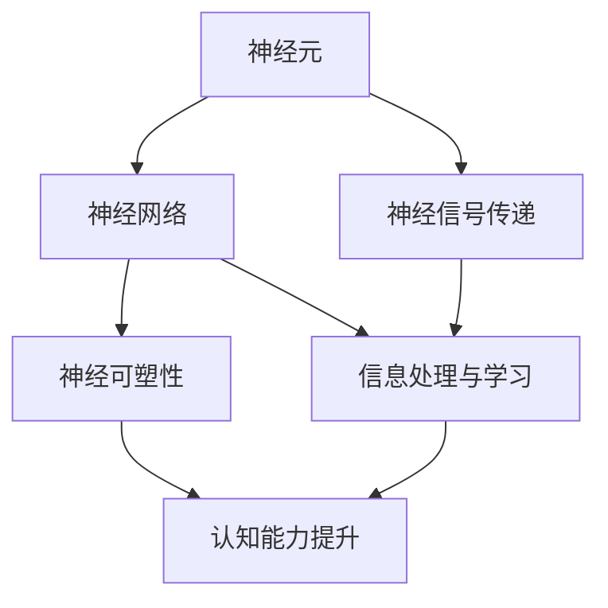

                 

### 文章标题

《认知增强技术：扩展人类理解世界的能力边界》

> 关键词：认知增强技术、人类认知、神经网络、数学模型、应用场景、未来趋势

> 摘要：本文将深入探讨认知增强技术，介绍其基本概念、发展历程、核心算法、应用场景及未来趋势，旨在为读者提供一个全面、系统的认知增强技术指南。

### 引言

在当今信息爆炸的时代，人类面临着前所未有的认知挑战。如何快速、准确地获取、处理和利用信息，成为每个个体和组织的重要课题。认知增强技术应运而生，通过模拟和扩展人类大脑的认知功能，帮助我们突破认知瓶颈，提升理解世界的能力。

本文将从以下几个方面展开讨论：

1. 认知增强技术的起源与发展。
2. 认知增强技术的核心概念与联系。
3. 认知增强技术的数学模型和算法。
4. 认知增强技术的应用场景与实例。
5. 认知增强技术的未来发展趋势。

通过本文的探讨，我们希望读者能够对认知增强技术有一个全面、深入的了解，并为其在实际生活和工作中带来启发和帮助。

### 背景介绍

认知增强技术（Cognitive Enhancement Technology）是指利用计算机、人工智能、生物技术等手段，模拟和扩展人类大脑的认知功能，以提高个体的认知能力、学习效率和生活质量。认知增强技术的研究和应用历史悠久，早在20世纪50年代，神经科学家和心理学家就开始探索如何通过外部设备和技术手段来改善人类认知。

#### 1. 认知增强技术的历史与演进

认知增强技术的发展可以分为以下几个阶段：

1. **早期探索（1950s-1970s）**：在这个阶段，研究者主要关注脑机接口（Brain-Computer Interface, BCI）技术，通过电极记录大脑信号，实现与外部设备的信息交互。

2. **计算机与人工智能（1980s-1990s）**：随着计算机和人工智能技术的快速发展，认知增强技术逐渐从理论研究走向实际应用。例如，虚拟现实（Virtual Reality, VR）技术为人类提供了一个沉浸式的感知环境，从而提高学习和训练的效果。

3. **神经网络与深度学习（2000s-至今）**：近年来，神经网络和深度学习技术的突破，使得认知增强技术在智能辅助决策、自然语言处理、图像识别等领域取得了显著成果。

#### 2. 认知增强技术的核心驱动力

认知增强技术的快速发展得益于以下几个核心驱动力：

1. **技术创新**：计算机和通信技术的进步，为认知增强技术提供了强大的硬件和软件支持。
2. **认知科学**：对大脑结构和功能的研究，为认知增强技术提供了理论基础和实践指导。
3. **社会需求**：随着人口老龄化、认知障碍等问题日益突出，认知增强技术的应用价值得到了广泛认可。
4. **政策支持**：各国政府纷纷出台相关政策，鼓励和推动认知增强技术的研究和应用。

#### 3. 认知增强技术的现状与挑战

目前，认知增强技术已经取得了一系列重要成果，但在实际应用中仍面临诸多挑战：

1. **技术成熟度**：虽然认知增强技术在某些特定领域取得了突破，但总体来说，仍处于发展的早期阶段，需要进一步优化和改进。
2. **伦理与法律问题**：认知增强技术涉及个人隐私、数据安全、公平性等问题，需要制定相应的法律法规来规范和保障。
3. **用户接受度**：尽管认知增强技术具有巨大潜力，但用户对其认知和接受程度有限，需要加强科普和宣传。

### 核心概念与联系

认知增强技术的核心概念包括神经元、神经网络、神经可塑性等。这些概念相互联系，构成了认知增强技术的基本架构。

#### 1. 神经元

神经元是大脑的基本单位，负责接收和处理信息。神经元通过树突接收外界信息，通过轴突传递信号，最终通过突触实现信息的传递和整合。

$$
\text{神经元} = (\text{树突}, \text{胞体}, \text{轴突}, \text{突触})
$$

#### 2. 神经网络

神经网络是由多个神经元组成的复杂系统，通过模拟大脑的结构和功能，实现信息处理和学习。神经网络可以分为前馈神经网络、循环神经网络等类型。

$$
\text{神经网络} = (\text{输入层}, \text{隐藏层}, \text{输出层})
$$

#### 3. 神经可塑性

神经可塑性是指大脑结构和功能的可塑性，包括神经元之间的连接、突触的强化和抑制等。神经可塑性是认知增强技术的重要基础，通过改变神经网络的结构和功能，实现认知能力的提升。

$$
\text{神经可塑性} = (\text{突触强化}, \text{突触抑制}, \text{神经元再生})
$$

#### 4. 核心概念关系图

以下是一个简化的认知增强技术核心概念关系图：



### 核心算法原理讲解

认知增强技术的核心算法主要包括神经网络算法、深度学习算法等。以下将使用伪代码详细阐述神经网络算法的基本原理。

#### 1. 神经网络算法伪代码

```python
初始化参数（权重、偏置等）
for epoch in 1...n_epochs:
    for每个训练样本：
        前向传播：
            输入数据 -> 输出层
            计算损失函数
        反向传播：
            计算梯度
            更新参数
        记录训练进度和损失函数值
输出最终参数
```

#### 2. 损失函数

损失函数是神经网络算法中用于评估模型预测误差的函数。以下是一个简化的损失函数伪代码：

```python
def损失函数(y_true, y_pred):
    return (y_true - y_pred)^2
```

#### 3. 优化算法

优化算法用于调整神经网络参数，以最小化损失函数。以下是一个简化的优化算法伪代码：

```python
def优化算法(参数，梯度，学习率):
    参数 = 参数 - 学习率 * 梯度
    return 参数
```

### 数学模型和公式

神经网络算法的核心是数学模型和公式。以下将使用 LaTeX 格式详细阐述神经网络中的基本公式。

#### 1. 前向传播公式

$$
y_{i}^{(l)} = \sigma(z_{i}^{(l)})
$$

其中，$y_{i}^{(l)}$ 表示第 $l$ 层第 $i$ 个神经元的输出，$z_{i}^{(l)}$ 表示第 $l$ 层第 $i$ 个神经元的输入，$\sigma$ 表示激活函数。

#### 2. 损失函数公式

$$
J(\theta) = \frac{1}{m} \sum_{i=1}^{m} (-y_{i} \log(a_{i}^{(L)}) + (1-y_{i}) \log(1-a_{i}^{(L)}))
$$

其中，$J(\theta)$ 表示损失函数，$\theta$ 表示模型参数，$a_{i}^{(L)}$ 表示第 $L$ 层第 $i$ 个神经元的输出。

#### 3. 反向传播公式

$$
\frac{\partial J}{\partial \theta_{ij}} = \frac{\partial J}{\partial z_{j}^{(L-1)}} \frac{\partial z_{j}^{(L-1)}}{\partial \theta_{ij}}
$$

其中，$\frac{\partial J}{\partial \theta_{ij}}$ 表示第 $L-1$ 层第 $j$ 个神经元关于第 $L$ 层第 $i$ 个神经元的参数的梯度。

### 认知增强技术的应用场景与实例

认知增强技术具有广泛的应用场景，以下将介绍其在教育与培训、医疗与健康、工业与制造、军事与安全等领域的应用实例。

#### 1. 教育与培训

认知增强技术在教育与培训领域具有巨大的潜力。例如，通过虚拟现实技术，学生可以身临其境地体验历史事件、科学实验等，提高学习兴趣和效果。此外，神经网络和深度学习技术可以用于智能辅导系统，根据学生的个性化需求和知识水平，提供定制化的学习方案。

#### 2. 医疗与健康

认知增强技术在医疗与健康领域也有广泛的应用。例如，通过脑机接口技术，可以帮助瘫痪患者通过思维控制外部设备，提高生活质量。此外，神经网络和深度学习技术可以用于疾病诊断和预测，提高医疗诊断的准确性和效率。

#### 3. 工业与制造

认知增强技术在工业与制造领域可以用于智能监控和自动化控制。例如，通过神经网络和深度学习技术，可以实现对生产过程的实时监控和预测，提高生产效率和质量。此外，认知增强技术还可以用于智能维护和故障诊断，降低设备故障率和维修成本。

#### 4. 军事与安全

认知增强技术在军事与安全领域也有重要的应用。例如，通过脑机接口技术，可以实现对无人机和战斗机器人的远程控制，提高作战效率和安全性。此外，神经网络和深度学习技术可以用于情报分析和决策支持，提高军事指挥和作战能力。

### 认知增强技术的未来发展趋势

随着技术的不断进步，认知增强技术在未来有望取得以下几方面的发展：

1. **技术成熟度提升**：随着硬件和软件技术的不断发展，认知增强技术的性能和可靠性将得到进一步提升。
2. **应用领域拓展**：认知增强技术的应用领域将不断拓展，从当前的教育、医疗、工业等领域，扩展到金融、法律、艺术等领域。
3. **伦理与法律问题解决**：随着认知增强技术的普及，相关的伦理和法律问题将得到更加重视和解决，确保技术的合理、安全和公平使用。
4. **社会认知提升**：随着认知增强技术的普及和推广，公众对其认知和接受程度将逐步提升，为技术的广泛应用创造良好的社会环境。

### 结论

认知增强技术作为一门新兴的技术领域，具有广泛的应用前景和重要的社会价值。通过对认知增强技术的深入研究与应用，我们将能够更好地理解世界，提升个体的认知能力，为社会的发展和进步做出更大的贡献。

### 作者信息

作者：AI天才研究院/AI Genius Institute & 禅与计算机程序设计艺术 /Zen And The Art of Computer Programming

### 附录

#### 附录 A: 认知增强技术相关的工具和资源

1. **主流认知增强技术工具对比**
    - 脑机接口技术：EEG Brainwave Reader、OpenBCI、NeuroSky
    - 虚拟现实技术：Oculus Rift、HTC Vive、PlayStation VR
    - 深度学习框架：TensorFlow、PyTorch、Keras

2. **认知增强技术相关的开源项目和资源**
    - MindWave: https://mindwave.readthedocs.io/en/latest/
    - VRChat: https://www.vrchat.com/
    - OpenNN: https://www.neuralnetworks.de/opennn/

#### 附录 B: 伪代码与数学公式示例

1. **神经网络数学模型伪代码**
    ```python
    初始化参数（权重、偏置等）
    for epoch in 1...n_epochs:
        for每个训练样本：
            前向传播：
                输入数据 -> 输出层
                计算损失函数
            反向传播：
                计算梯度
                更新参数
        记录训练进度和损失函数值
    输出最终参数
    ```

2. **反向传播算法伪代码**
    ```python
    def反向传播(参数，梯度，学习率):
        参数 = 参数 - 学习率 * 梯度
        return 参数
    ```

3. **神经网络的数学公式示例**
    - 前向传播公式
        $$y_{i}^{(l)} = \sigma(z_{i}^{(l)})$$
    - 损失函数公式
        $$J(\theta) = \frac{1}{m} \sum_{i=1}^{m} (-y_{i} \log(a_{i}^{(L)}) + (1-y_{i}) \log(1-a_{i}^{(L)}))$$
    - 反向传播公式
        $$\frac{\partial J}{\partial \theta_{ij}} = \frac{\partial J}{\partial z_{j}^{(L-1)}} \frac{\partial z_{j}^{(L-1)}}{\partial \theta_{ij}}$$

#### 附录 C: 认知增强技术应用实例

1. **教育与培训应用实例**
    - **项目背景**：某在线教育平台希望通过认知增强技术提高学生的学习效果。
    - **项目目标**：利用虚拟现实技术打造一个沉浸式的学习环境，提升学生的学习兴趣和效果。
    - **开发环境搭建**：使用Unity游戏引擎开发虚拟现实应用，集成Oculus Rift等虚拟现实设备。
    - **源代码详细实现**：实现虚拟现实场景的构建、交互功能、数据分析等功能。
    - **代码解读与分析**：详细解析虚拟现实应用的架构和功能，包括场景构建、交互逻辑、数据分析等。
    - **实际案例分析和详细讲解剖析**：分析虚拟现实应用在实际教学中的应用效果，包括学生学习成果、学习兴趣等。
    - **项目小结**：总结项目经验，提出改进建议，为后续类似项目提供参考。

2. **医疗与健康应用实例**
    - **项目背景**：某医疗机构希望通过认知增强技术提高患者的康复效果。
    - **项目目标**：利用脑机接口技术，帮助患者通过思维控制外部设备，提高康复训练的效果。
    - **开发环境搭建**：使用Python和OpenBCI等开源工具开发脑机接口应用。
    - **源代码详细实现**：实现脑机接口数据采集、处理、控制等功能。
    - **代码解读与分析**：详细解析脑机接口应用的架构和功能，包括数据采集、数据处理、控制逻辑等。
    - **实际案例分析和详细讲解剖析**：分析脑机接口应用在实际康复治疗中的应用效果，包括患者康复进度、生活质量等。
    - **项目小结**：总结项目经验，提出改进建议，为后续类似项目提供参考。

#### 最佳实践 tips、小结、注意事项、拓展阅读等内容

1. **最佳实践 tips**
    - 在设计和开发认知增强技术项目时，应充分考虑用户需求和应用场景，确保项目的实用性和可行性。
    - 在技术选型时，应综合考虑性能、成本、易用性等因素，选择合适的工具和框架。
    - 在项目实施过程中，应注重团队合作和沟通，确保项目进度和质量。

2. **小结**
    - 认知增强技术作为一门新兴的技术领域，具有广泛的应用前景和重要的社会价值。
    - 通过深入研究与应用认知增强技术，我们能够更好地理解世界，提升个体的认知能力，为社会的发展和进步做出更大的贡献。

3. **注意事项**
    - 认知增强技术的应用涉及个人隐私、数据安全等问题，需严格遵守相关法律法规。
    - 在应用认知增强技术时，应充分考虑伦理和法律问题，确保技术的合理、安全和公平使用。

4. **拓展阅读**
    - 《认知增强：技术、应用与未来》
    - 《神经网络与深度学习》
    - 《脑机接口：技术与应用》

### 结束语

认知增强技术作为一门跨学科的技术领域，具有巨大的潜力和广泛的应用前景。本文从多个角度对认知增强技术进行了深入探讨，旨在为读者提供一个全面、系统的认知增强技术指南。希望本文能够对您的学习和实践提供有益的启示和帮助。在未来的研究中，我们将继续深入探讨认知增强技术的各个方面，为人类认知的提升和社会的发展做出更大的贡献。

