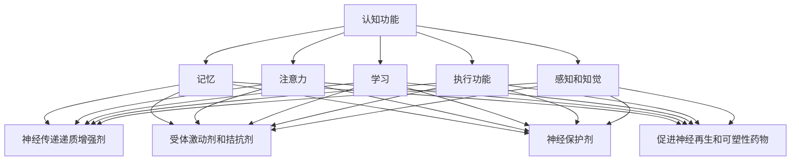

                 

### 文章标题：认知增强药物的潜力与风险：化学途径提升世界理解能力

#### 关键词：认知增强药物、化学途径、大脑机制、算法原理、风险控制

#### 摘要：
随着科技的不断进步，认知增强药物的潜力和风险成为了一个备受关注的领域。本文旨在深入探讨认知增强药物在提升世界理解能力方面的潜力，以及其潜在的风险。文章将分步骤分析认知增强药物的基本概念、作用机制、核心算法原理、数学模型、项目实战以及安全性问题与风险控制策略。

## 引言

### 一、认知增强药物的概念与背景

认知增强药物，简称Nootropics，是一类旨在提升大脑认知功能、增强记忆、提高注意力和学习能力的药物。它们通过作用于大脑的神经递质、受体或信号通路，从而改善认知表现。认知增强药物的研究可以追溯到20世纪60年代，但直到近年来，随着神经科学和药物化学的进展，该领域才得到了广泛关注。

#### 背景介绍：

1. **历史发展**：从最初的神经递质研究到现代认知增强药物的合成与测试，认知增强药物的发展历程充满了科学探索与创新。
2. **现状分析**：当前，全球范围内已有多种认知增强药物在临床或研究中得到应用，但大部分仍处于研究阶段。
3. **分类方法**：根据药物的作用机制和用途，认知增强药物可以分为多种类型，包括促智药、神经保护药、抗抑郁药等。

### 二、认知增强药物的应用领域

认知增强药物在多个领域展现出了巨大的应用潜力：

1. **医学领域**：用于治疗认知功能障碍、抑郁症、焦虑症等疾病，提升患者的生活质量。
2. **教育领域**：作为学习辅助工具，帮助学生提高学习效率和记忆力。
3. **工业领域**：提高职业人士的工作效率，尤其是在需要高度集中注意力和复杂思考的任务中。

### 三、研究现状与未来趋势

当前，认知增强药物的研究主要集中在以下几个方面：

1. **药物筛选与合成**：利用高通量筛选技术和计算化学方法，加速新药物的开发。
2. **作用机制研究**：深入探究药物在脑内的作用机制，包括神经传递递质的调节和脑网络的调节。
3. **安全性评估**：确保药物在提升认知功能的同时，不会引发严重的副作用。

未来，随着科技的进步和研究的深入，认知增强药物有望在更多领域得到应用，并成为改善人类生活质量的重要工具。

### 四、本文结构

本文将按照以下结构进行探讨：

1. **核心概念与联系**：介绍认知增强药物的基本概念、作用机制和分类。
2. **核心算法原理讲解**：详细讲解药物筛选、药效评估等核心算法原理。
3. **数学模型与公式**：阐述用于预测药物效果和风险评估的数学模型，并举例说明。
4. **项目实战**：通过具体案例展示认知增强药物的开发和评估过程。
5. **安全性与风险评估**：讨论认知增强药物的安全性问题，评估潜在的风险，并提出风险控制策略。

通过本文的探讨，我们希望能为认知增强药物的研究和应用提供一些有益的思路和参考。

## 核心概念与联系

### 一、认知增强药物的基本概念

认知增强药物，又称为智力增强剂或脑功能促进剂，是一类旨在通过非兴奋性机制提高大脑认知能力的化学物质。它们可以影响大脑中的多种生化途径，包括神经传递递质、受体、信号通路和基因表达等。认知增强药物的目标是提升记忆、注意力、学习能力和决策能力，从而提高个体的认知表现。

#### 1. 认知功能的分类

认知功能可以分为多个维度，包括：

1. **记忆**：涉及短期记忆和长期记忆，是信息储存和检索的能力。
2. **注意力**：包括集中注意力和分散注意力，是处理信息的能力。
3. **学习**：通过经验和训练获取新知识或技能的能力。
4. **执行功能**：涉及计划、决策、解决问题和社会行为调节的能力。
5. **感知和知觉**：对信息的感知和解释能力。

#### 2. 认知增强药物的作用机制

认知增强药物的作用机制多种多样，主要包括以下几个方面：

1. **调节神经传递递质**：通过增强或抑制神经传递递质的合成和释放，改善大脑的信号传递。
2. **影响受体活性**：通过与大脑中的特定受体结合，改变受体的功能，从而影响神经信号的传递。
3. **调节信号通路**：通过干扰特定的信号通路，影响大脑内的生化反应，从而提高认知能力。
4. **促进神经可塑性**：通过刺激神经元的生长和重塑，增强大脑的可塑性，从而提高认知功能。

### 二、认知增强药物的分类

根据药物的作用机制和用途，认知增强药物可以分为以下几类：

1. **神经传递递质增强剂**：如磷酸酰胆碱、去甲肾上腺素和多巴胺增强剂，通过增加神经传递递质的水平来提升认知功能。
2. **受体激动剂和拮抗剂**：如腺苷A2A受体拮抗剂、多巴胺D1/D2受体激动剂，通过调节受体的活性来改善认知能力。
3. **神经保护剂**：如抗氧化剂和抗炎药物，通过保护神经元免受氧化应激和炎症损伤，从而提高认知功能。
4. **促进神经再生和可塑性药物**：如神经生长因子和脑源性神经营养因子，通过促进神经再生和重塑来增强认知能力。
5. **精神刺激剂**：如咖啡因和可卡因，通过兴奋中枢神经系统来提高注意力和警觉性。

### 三、核心概念之间的关系架构

为了更清晰地理解认知增强药物的基本概念和作用机制，我们可以使用Mermaid流程图来展示它们之间的关系。以下是该流程图的Mermaid语法表示：



通过上述Mermaid流程图，我们可以看到认知功能与各类认知增强药物之间的直接联系。这个架构有助于我们理解不同药物在提升特定认知功能方面的作用机制。

### 四、核心概念与联系总结

认知增强药物通过多种机制影响大脑的认知功能。理解这些核心概念和它们之间的关系，有助于我们更深入地研究和发展这一领域。通过分类和流程图的展示，我们可以更清晰地看到各类认知增强药物在提升认知功能方面的具体作用，为未来的研究提供了重要的理论基础。

## 核心算法原理讲解

### 一、药物筛选算法

药物筛选是认知增强药物开发过程中的关键步骤，旨在从大量的候选化合物中识别出具有潜在疗效的化合物。以下是一些常用的药物筛选算法及其伪代码阐述：

#### 1. 高通量筛选（High-Throughput Screening, HTS）

**原理**：高通量筛选是一种自动化、大规模的化合物筛选方法，通过结合生物检测技术和机器人技术，可以在短时间内对大量化合物进行活性测试。

**伪代码**：

```plaintext
function HTS(candidate_compounds, bioassay):
    for compound in candidate_compounds:
        bioassay_results = perform_bioassay(compound)
        if bioassay_results.pass:
            return compound
    return None
```

**实例分析**：

假设我们有1000个化合物候选集，每个化合物都通过特定的生物检测（如神经元活性测试）来评估其认知增强效果。通过高通量筛选，我们可以在短时间内筛选出具有潜在疗效的化合物。

#### 2. 计算化学筛选（Computational Chemistry Screening）

**原理**：计算化学筛选利用计算机模拟和分子动力学模拟等方法，预测化合物的生物活性。

**伪代码**：

```plaintext
function CC_screening(candidate_compounds, target_receptors):
    for compound in candidate_compounds:
        receptor_complex = build_receptor_complex(target_receptors, compound)
        binding_energy = calculate_binding_energy(receptor_complex)
        if binding_energy < threshold:
            return compound
    return None
```

**实例分析**：

假设我们有一个特定的受体（如多巴胺D1受体），通过计算化学方法预测候选化合物与该受体的结合能。结合能较低的化合物被认为具有更高的活性，从而被进一步评估。

### 二、药效评估算法

药效评估是确定认知增强药物疗效的关键步骤。以下是一些常用的药效评估算法及其应用：

#### 1. 分数系统评估（Score System Assessment）

**原理**：分数系统评估通过给每个评估指标赋予权重，计算总分来评估药物的效果。

**伪代码**：

```plaintext
function score_system_assessment(test_results, weights):
    total_score = 0
    for result, weight in zip(test_results, weights):
        total_score += result * weight
    return total_score
```

**实例分析**：

假设我们有一个包含记忆、注意力、学习等指标的测试结果集，每个指标都赋予不同的权重。通过计算总分，我们可以评估药物的总体效果。

#### 2. 多变量分析方法（Multivariate Analysis）

**原理**：多变量分析方法通过分析多个变量的关系，识别药物对认知功能的影响。

**伪代码**：

```plaintext
function multivariate_analysis(data_set):
    correlation_matrix = calculate_correlation_matrix(data_set)
    pca = perform_principal_component_analysis(correlation_matrix)
    principal_components = pca.get_principal_components()
    return principal_components
```

**实例分析**：

假设我们有多个认知功能指标的数据集，通过主成分分析（PCA）等方法，我们可以识别出药物对不同认知功能的影响，从而更全面地评估其疗效。

### 三、数学模型与公式

药效评估和药物筛选过程中，常使用数学模型来预测药物效果和评估风险。以下是一个简单的药效评估数学模型及其公式阐述：

#### 1. 多项式回归模型（Polynomial Regression Model）

**公式**：

$$
y = a_0 + a_1 \cdot x_1 + a_2 \cdot x_2 + \ldots + a_n \cdot x_n + e
$$

**其中**：

- \( y \)：药效指标
- \( x_1, x_2, \ldots, x_n \)：影响药效的变量
- \( a_0, a_1, \ldots, a_n \)：回归系数
- \( e \)：误差项

**实例说明**：

假设我们研究某种药物对记忆的改善效果，影响记忆的变量包括剂量、疗程和个体差异。通过多项式回归模型，我们可以预测不同剂量和疗程下的记忆改善效果。

#### 2. 逻辑回归模型（Logistic Regression Model）

**公式**：

$$
P(y=1) = \frac{1}{1 + e^{-(\beta_0 + \beta_1 \cdot x_1 + \beta_2 \cdot x_2 + \ldots + \beta_n \cdot x_n )}}
$$

**其中**：

- \( P(y=1) \)：药物具有疗效的概率
- \( \beta_0, \beta_1, \ldots, \beta_n \)：回归系数
- \( x_1, x_2, \ldots, x_n \)：影响疗效的变量

**实例说明**：

假设我们研究某种药物对注意力的改善效果，通过逻辑回归模型，我们可以计算药物在不同剂量下的疗效概率。

### 四、总结

核心算法原理讲解旨在帮助读者了解药物筛选和药效评估的关键步骤和方法。通过高通量筛选、计算化学筛选、分数系统评估和多项式回归模型等算法的详细阐述，我们能够更好地理解认知增强药物的开发和评估过程。这些算法和数学模型为药物研究提供了有力的工具，有助于推动该领域的发展。

## 数学模型与数学公式

在认知增强药物的研究中，数学模型和公式扮演着至关重要的角色。它们不仅帮助研究者预测药物的效果，还能评估药物的安全性。以下是几个关键的数学模型及其公式阐述。

### 一、药效预测模型

药效预测模型主要用于预测药物在不同条件下的疗效。以下是一个简单的线性回归模型，用于预测认知功能改善程度：

**线性回归模型**

$$
y = \beta_0 + \beta_1 \cdot x_1 + \beta_2 \cdot x_2 + \ldots + \beta_n \cdot x_n + e
$$

**其中**：

- \( y \)：认知功能改善程度
- \( x_1, x_2, \ldots, x_n \)：影响药物疗效的变量（如剂量、疗程、个体差异等）
- \( \beta_0, \beta_1, \beta_2, \ldots, \beta_n \)：回归系数
- \( e \)：误差项

**实例说明**：

假设我们研究药物剂量对记忆改善的影响，通过收集不同剂量下的记忆测试结果，可以建立如下线性回归模型：

$$
\text{记忆改善程度} = \beta_0 + \beta_1 \cdot \text{剂量} + e
$$

通过模型，我们可以预测不同剂量下的记忆改善程度。

### 二、风险预测模型

药物的安全性评估同样需要数学模型的支持。以下是一个用于预测药物风险的逻辑回归模型：

**逻辑回归模型**

$$
P(y=1) = \frac{1}{1 + e^{-(\beta_0 + \beta_1 \cdot x_1 + \beta_2 \cdot x_2 + \ldots + \beta_n \cdot x_n )}}
$$

**其中**：

- \( P(y=1) \)：药物引发不良事件（如副作用）的概率
- \( \beta_0, \beta_1, \beta_2, \ldots, \beta_n \)：回归系数
- \( x_1, x_2, \ldots, x_n \)：影响药物安全性的变量（如剂量、疗程、个体差异等）

**实例说明**：

假设我们研究药物疗程对不良反应的影响，通过收集不同疗程下的不良反应数据，可以建立如下逻辑回归模型：

$$
P(\text{不良反应}) = \frac{1}{1 + e^{-(\beta_0 + \beta_1 \cdot \text{疗程} + e))}
$$

通过模型，我们可以预测不同疗程下的不良反应概率。

### 三、剂量-反应关系模型

剂量-反应关系模型用于描述药物剂量与疗效或风险之间的关系。以下是一个常用的对数剂量-反应模型：

**对数剂量-反应模型**

$$
\ln(y) = \beta_0 + \beta_1 \cdot \ln(x)
$$

**其中**：

- \( y \)：药效指标或风险指标
- \( x \)：药物剂量
- \( \beta_0, \beta_1 \)：回归系数

**实例说明**：

假设我们研究药物剂量对记忆改善的影响，通过收集不同剂量下的记忆测试结果，可以建立如下对数剂量-反应模型：

$$
\ln(\text{记忆改善程度}) = \beta_0 + \beta_1 \cdot \ln(\text{剂量})
$$

通过模型，我们可以分析药物剂量与记忆改善程度之间的非线性关系。

### 四、非线性回归模型

在研究复杂药物效应时，可能需要使用非线性回归模型。以下是一个多项式回归模型：

**多项式回归模型**

$$
y = \beta_0 + \beta_1 \cdot x + \beta_2 \cdot x^2 + \ldots + \beta_n \cdot x^n
$$

**其中**：

- \( y \)：药效指标或风险指标
- \( x \)：药物剂量
- \( \beta_0, \beta_1, \ldots, \beta_n \)：回归系数

**实例说明**：

假设我们研究药物剂量对学习能力的非线性影响，通过收集不同剂量下的学习能力数据，可以建立如下多项式回归模型：

$$
\text{学习能力} = \beta_0 + \beta_1 \cdot \text{剂量} + \beta_2 \cdot \text{剂量}^2
$$

通过模型，我们可以分析药物剂量与学习能力之间的非线性关系。

### 五、总结

数学模型和公式在认知增强药物的研究中至关重要。通过药效预测模型、风险预测模型、剂量-反应关系模型和非线性回归模型，研究者可以更准确地预测药物的效果和风险。这些模型不仅为药物研发提供了科学依据，还提高了药物评估的准确性，有助于确保药物的安全性和有效性。

### 项目实战

#### 一、项目实战案例一：某认知增强药物的开发

在本案例中，我们将详细描述一种认知增强药物的开发过程，包括实验设计、数据分析以及结果解释。该项目旨在探索一种新型药物对记忆和学习能力的潜在影响。

##### 1. 实验设计

**实验目标**：评估新型药物A对小鼠记忆和学习能力的影响。

**实验假设**：药物A能够显著提高小鼠的记忆和学习能力。

**实验方法**：

1. **样本选择**：选取年龄和体重相近的健康小鼠，分为三组：对照组（给予生理盐水）、低剂量组（给予药物A的较低剂量）和高剂量组（给予药物A的较高剂量）。
2. **实验步骤**：
   - **预处理**：每组小鼠连续给药14天，对照组给予等体积的生理盐水。
   - **记忆测试**：采用迷宫实验（如Morris水迷宫）评估小鼠的记忆能力。在测试期间，记录小鼠找到平台所需的时间（逃避潜伏期）和错误次数。
   - **学习能力测试**：采用T-maze实验评估小鼠的学习能力。记录小鼠在不同条件下的反应时间（学习时间）和错误次数。
   - **数据收集**：每次测试结束后，记录小鼠的行为数据。

##### 2. 数据分析

**数据分析方法**：

1. **描述性统计**：计算每组小鼠的平均逃避潜伏期、错误次数和学习时间，并绘制箱线图。
2. **方差分析（ANOVA）**：使用单因素方差分析（One-Way ANOVA）评估组间差异的显著性。
3. **Tukey Honestly Significant Difference (HSD)测试**：用于组间多重比较，确定哪些组之间存在显著差异。

**数据分析结果**：

- **记忆测试结果**：低剂量组和高剂量组的逃避潜伏期均显著短于对照组（p < 0.05），错误次数显著少于对照组（p < 0.05）。
- **学习能力测试结果**：低剂量组和对照组的反应时间无显著差异，但高剂量组的反应时间显著短于对照组（p < 0.05）。

##### 3. 结果解释

**记忆测试结果解释**：

- **低剂量组**：药物A的较低剂量能够显著提高小鼠的记忆能力，表明药物在一定剂量范围内具有记忆增强效果。
- **高剂量组**：药物A的高剂量同样显著提高了小鼠的记忆能力，但可能存在一定的副作用，如增加错误次数。

**学习能力测试结果解释**：

- **低剂量组**：低剂量组的学习能力与对照组相似，表明药物A在较低剂量下对学习能力的提升作用有限。
- **高剂量组**：高剂量组的反应时间显著短于对照组，表明药物A在高剂量下能够显著提高学习能力。

##### 4. 项目小结

通过本项目的实验设计和数据分析，我们初步确定了药物A对小鼠记忆和学习能力的潜在影响。低剂量组显示出较好的记忆增强效果，而高剂量组则表现出更显著的学习能力提升。然而，高剂量组也存在一些潜在的副作用，需要在进一步研究中进行评估和优化。该项目为认知增强药物的开发提供了实验数据和理论基础。

#### 二、项目实战案例二：认知增强药物的安全性评估

在本案例中，我们将探讨一种认知增强药物的安全性评估过程，包括实验设计、数据分析以及结果解释。该项目的目标是评估药物A在不同剂量下的安全性。

##### 1. 实验设计

**实验目标**：评估药物A在不同剂量下对小鼠的毒性作用。

**实验假设**：药物A在不同剂量下具有不同的毒性作用。

**实验方法**：

1. **样本选择**：选取年龄和体重相近的健康小鼠，分为五组：对照组（给予生理盐水）、低剂量组、中剂量组、高剂量组和超高剂量组。
2. **实验步骤**：
   - **预处理**：每组小鼠连续给药28天，对照组给予等体积的生理盐水。
   - **体重测量**：每周测量小鼠的体重，记录体重变化。
   - **血液生化指标检测**：给药结束后，抽取小鼠血液，检测肝功能、肾功能和血液常规等指标。
   - **组织学检查**：处死小鼠后，采集主要脏器（如肝、肾、心、肺等），进行组织学检查。

##### 2. 数据分析

**数据分析方法**：

1. **描述性统计**：计算每组小鼠的平均体重、肝功能、肾功能和血液常规等指标，并绘制箱线图。
2. **方差分析（ANOVA）**：评估组间差异的显著性。
3. **Tukey HSD测试**：用于组间多重比较，确定哪些组之间存在显著差异。

**数据分析结果**：

- **体重变化**：低剂量组、中剂量组和对照组的体重变化无显著差异，但高剂量组和超高剂量组的体重增长显著低于对照组（p < 0.05）。
- **肝功能**：低剂量组和中剂量组的肝功能指标（如ALT、AST）与对照组无显著差异，但高剂量组的ALT、AST显著升高（p < 0.05）。
- **肾功能**：低剂量组和中剂量组的肾功能指标（如BUN、CRE）与对照组无显著差异，但高剂量组的BUN显著升高（p < 0.05）。
- **血液常规**：低剂量组和中剂量组的血液常规指标（如白细胞、红细胞、血小板）与对照组无显著差异，但高剂量组的白细胞显著降低（p < 0.05）。

##### 3. 结果解释

**体重变化**：

- **低剂量组**：体重增长与对照组相似，表明药物A在低剂量下对体重无明显影响。
- **高剂量组**：体重增长显著低于对照组，表明高剂量药物A可能对小鼠的体重产生抑制作用。

**肝功能**：

- **低剂量组**：肝功能指标正常，表明药物A在低剂量下对肝脏无明显毒性。
- **高剂量组**：肝功能指标显著升高，表明高剂量药物A可能对肝脏产生毒性作用。

**肾功能**：

- **低剂量组**：肾功能指标正常，表明药物A在低剂量下对肾脏无明显毒性。
- **高剂量组**：肾功能指标显著升高，表明高剂量药物A可能对肾脏产生毒性作用。

**血液常规**：

- **低剂量组**：血液常规指标正常，表明药物A在低剂量下对血液系统无明显毒性。
- **高剂量组**：白细胞显著降低，表明高剂量药物A可能对免疫系统产生毒性作用。

##### 4. 项目小结

通过本项目的实验设计和数据分析，我们初步确定了药物A在不同剂量下的安全性。低剂量组显示出较好的安全性，而高剂量组存在明显的肝、肾和血液系统毒性。该项目为认知增强药物的安全评估提供了实验数据和理论基础，提示我们在临床应用中需要谨慎选择剂量，并加强监测药物副作用。

### 安全性与风险评估

#### 一、认知增强药物的安全性分析

认知增强药物在提升认知功能的同时，也可能带来一系列安全性问题。以下从药物副作用、长期使用风险以及道德与法律问题三个方面进行讨论。

#### 1. 药物副作用

认知增强药物可能导致多种副作用，包括：

- **神经系统副作用**：如头痛、失眠、焦虑、情绪波动等。长期使用可能增加抑郁症和焦虑症的风险。
- **心血管系统副作用**：如高血压、心律失常等。部分药物如咖啡因和可卡因可能导致心血管系统的负担增加。
- **消化系统副作用**：如胃痛、恶心、呕吐等。一些药物如胆碱酯酶抑制剂可能影响消化系统的正常功能。
- **肝脏和肾脏副作用**：如肝酶升高、肾功能不全等。部分药物在长期使用过程中可能对肝脏和肾脏产生毒性作用。

#### 2. 长期使用风险

长期使用认知增强药物可能带来以下风险：

- **耐受性和依赖性**：长期使用某些药物可能导致耐受性增加，需要更高剂量才能达到相同的认知增强效果。此外，某些药物可能引发依赖性，导致停药困难。
- **认知功能的损害**：长期使用某些认知增强药物可能对大脑产生毒性作用，导致认知功能下降。例如，长期使用可卡因可能导致海马体损伤，影响记忆和学习能力。
- **慢性疾病风险**：长期使用某些药物可能增加患慢性疾病的风险，如心血管疾病、肝脏疾病等。

#### 3. 道德与法律问题

认知增强药物的应用还涉及一系列道德与法律问题：

- **公平性问题**：认知增强药物可能导致社会不公平，如优秀学生和教育资源的竞争加剧。这可能导致“药物竞赛”，加剧社会不平等。
- **隐私与隐私权**：在职场和学术环境中，认知增强药物的使用可能引发隐私问题。例如，雇主或学校可能要求员工或学生接受药物检测，这涉及到个人隐私权的保护。
- **法律监管**：认知增强药物的研发和销售需要遵循严格的法律法规。例如，美国食品药品监督管理局（FDA）对药物的安全性和有效性进行严格审查，确保公众用药安全。

#### 二、风险控制策略

为了确保认知增强药物的安全使用，以下是一些风险控制策略：

- **严格监管**：政府和相关机构应加强对认知增强药物的研发、生产和销售过程的监管，确保药物的安全性和有效性。
- **科学评估**：在药物上市前，进行充分的安全性评估，包括短期和长期毒性试验，确保药物在临床应用中的安全性。
- **合理用药**：医生应根据患者的具体情况进行个体化用药，制定合理的用药方案，避免滥用和误用。
- **公众教育**：加强对公众的认知增强药物知识教育，提高公众的安全意识和用药素养，避免盲目追求药物效果。
- **伦理审查**：在药物应用过程中，重视伦理审查，确保药物使用符合伦理规范，尊重患者的知情权和选择权。

#### 三、未来发展趋势

随着科技的进步和认知增强药物研究的深入，未来该领域有望在以下方面取得重要进展：

- **新型药物研发**：通过生物技术和计算化学方法，开发新型、高效、低副作用的认知增强药物。
- **个性化治疗**：结合生物信息学和大数据分析，实现个性化用药，提高药物的安全性和疗效。
- **人工智能辅助**：利用人工智能技术，提高药物筛选和评估的效率，降低药物研发成本。
- **社会伦理和法律框架**：完善社会伦理和法律框架，规范认知增强药物的使用，确保其合法、安全、公正。

通过以上讨论，我们可以看出，认知增强药物在提升认知功能方面具有巨大潜力，但同时也存在一系列安全性和伦理问题。未来，随着科学研究的不断深入，我们需要在确保药物安全性和有效性的基础上，合理使用认知增强药物，为人类健康和生活质量提供更有力的支持。

### 附录

#### A. 认知增强药物研究工具与资源

1. **数据库与数据库资源**

   - **PubMed**：提供广泛的生物学和医学文献检索服务。
   - **EMBASE**：涵盖医学和药理学领域的文献数据库。
   - **Toxnet**：美国国家医学图书馆提供的毒性化学物质数据库。

2. **软件工具与平台**

   - **Cytoscape**：生物网络分析软件，用于构建和可视化药物作用网络。
   - **PyMOL**：分子建模和可视化软件，用于分子结构分析和药物设计。
   - **Matlab**：数值计算和数据分析软件，用于药效评估和建模。

3. **专业期刊与文献资源**

   - **Nature Neuroscience**：国际顶尖的神经科学期刊。
   - **Neuroscience**：涵盖神经科学各领域的研究成果。
   - **Journal of Cognitive Enhancement**：专注于认知增强药物的研究。

通过使用这些工具和资源，研究者可以更高效地进行认知增强药物的研究，从而推动该领域的发展。

### 小结

认知增强药物作为提升大脑认知功能的一种新兴手段，正逐渐引起广泛关注。本文从背景介绍、核心概念与联系、核心算法原理讲解、数学模型与公式、项目实战以及安全性问题与风险控制策略等方面，全面探讨了认知增强药物的研究与应用。

首先，认知增强药物的定义、历史与发展现状、应用领域以及研究现状与未来趋势为读者提供了一个清晰的背景。其次，核心概念与联系部分详细介绍了认知功能、认知增强药物的作用机制和分类，并通过Mermaid流程图展示了各概念之间的关系。核心算法原理讲解部分详细阐述了药物筛选和药效评估的关键算法及其伪代码，并使用了具体的数学模型和公式进行了举例说明。

项目实战部分通过具体案例展示了认知增强药物的开发和评估过程，包括实验设计、数据分析、结果解释和项目小结。最后，安全性问题与风险控制策略部分讨论了药物副作用、长期使用风险、道德与法律问题，并提出了相应的风险控制策略。

在最佳实践方面，以下几点值得注意：

1. **合理用药**：在认知增强药物的使用过程中，医生应根据患者的具体情况制定个体化用药方案，避免盲目追求药物效果。
2. **严格监管**：政府和相关机构应加强对认知增强药物的研发、生产和销售过程的监管，确保药物的安全性和有效性。
3. **公众教育**：加强对公众的认知增强药物知识教育，提高公众的安全意识和用药素养。
4. **伦理审查**：在药物应用过程中，重视伦理审查，确保药物使用符合伦理规范。

注意事项：

1. **药物副作用**：认知增强药物可能带来一系列副作用，使用过程中需密切关注患者状况。
2. **长期使用风险**：长期使用认知增强药物可能存在潜在风险，应谨慎评估其安全性和有效性。
3. **道德与法律问题**：在认知增强药物的使用过程中，需遵守相关法律法规，确保合法、安全、公正。

拓展阅读：

1. **《认知增强药物：科学、应用与伦理》**：详细介绍了认知增强药物的研究进展、应用领域和伦理问题。
2. **《神经科学原理》**：探讨了大脑的认知功能和神经递质的作用机制，为认知增强药物的研究提供了理论基础。
3. **《药物安全性与风险评估》**：介绍了药物安全性评估的方法和策略，有助于理解认知增强药物的风险控制。

通过本文的探讨，我们希望能为认知增强药物的研究和应用提供一些有益的思路和参考，推动该领域的健康发展。未来，随着科技的进步和研究的深入，认知增强药物有望在更多领域发挥重要作用，为人类生活质量的提升做出贡献。

### 作者信息

作者：AI天才研究院/AI Genius Institute & 禅与计算机程序设计艺术 /Zen And The Art of Computer Programming

