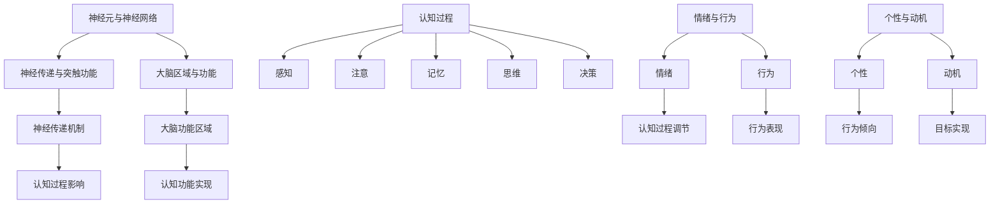

                 

### 文章标题

# 认知神经科学与心理学的整合：全面理解人类心智与世界关系的方法

### 关键词

- 认知神经科学
- 心理学
- 整合研究
- 人类心智
- 世界关系

### 摘要

本文旨在探讨认知神经科学与心理学的整合研究，通过回顾两者的历史背景、核心概念，分析它们之间的联系与区别，介绍整合研究的方法和技术，最后通过经典案例和应用领域展示整合研究的成果和未来展望。文章强调认知神经科学与心理学在理解人类心智与世界关系中的重要性，并提出未来研究的方向和应用前景。

### 引言

#### 认知神经科学与心理学的整合概述

认知神经科学与心理学作为现代科学中两个重要的分支，分别从神经科学和心理学的角度研究人类心智的运作机制。认知神经科学通过研究大脑结构和功能的神经基础，揭示认知过程的神经机制；而心理学则通过实验、观察和理论分析，探究人类心智、行为和情感的本质。

近年来，随着神经科学技术的发展，认知神经科学与心理学之间的整合研究逐渐成为热点。这种整合不仅有助于深化对人类心智的认识，还能为解决复杂的社会问题提供新的思路和方法。本文将围绕认知神经科学与心理学的整合研究，探讨其背景、核心概念、研究方法、经典案例和应用领域，以及未来的发展方向。

#### 文章结构

本文结构如下：

1. **第一部分：引言**：介绍认知神经科学与心理学的整合研究的背景和意义。
2. **第二部分：核心概念**：阐述认知神经科学与心理学中的核心概念及其关系。
3. **第三部分：整合研究方法**：介绍认知神经科学与心理学整合研究的方法和技术。
4. **第四部分：整合研究的案例与应用**：分析认知神经科学与心理学整合研究的经典案例和应用领域。
5. **第五部分：未来展望**：探讨认知神经科学与心理学整合研究的未来发展。

通过本文的阅读，读者将全面了解认知神经科学与心理学的整合研究，对其核心概念、研究方法、应用领域和未来趋势有深入的认识。

### 第一部分：引言

#### 认知神经科学与心理学的关系

认知神经科学与心理学的关系可以追溯到20世纪60年代，当时神经科学和心理学开始逐渐融合。认知神经科学的发展得益于神经科学技术，如功能性磁共振成像（fMRI）、脑电图（EEG）和脑磁图（MEG）等，这些技术使得研究者能够直接观察大脑的活动和结构，从而深入探讨认知过程的神经基础。

心理学作为研究人类行为和心理过程的科学，长期以来对认知神经科学的发展产生了深远影响。心理学中的认知理论，如信息加工理论、认知地图理论等，为认知神经科学提供了重要的理论基础。同时，心理学的研究方法，如实验心理学、认知心理学和人格心理学等，也为认知神经科学提供了有效的工具。

#### 整合研究的意义

认知神经科学与心理学的整合研究具有重要意义，主要体现在以下几个方面：

1. **深化对人类心智的理解**：通过整合认知神经科学与心理学的研究成果，可以更全面地理解人类心智的运作机制，揭示认知过程、情绪和行为之间的复杂关系。

2. **推动跨学科发展**：整合研究打破了认知神经科学与心理学之间的学科壁垒，促进了跨学科合作，有助于形成新的研究范式和方法。

3. **应用前景广阔**：整合研究在多个领域具有广泛应用前景，如心理健康、教育、认知障碍治疗等，有助于提升人类生活质量。

4. **解决复杂问题**：整合研究可以提供新的视角和方法，帮助解决复杂的社会问题，如抑郁症、焦虑症等心理疾病的诊断与治疗。

#### 整合研究的方法

认知神经科学与心理学的整合研究方法主要包括以下几个方面：

1. **跨学科实验设计**：通过结合认知神经科学和心理学的实验设计方法，设计出更为复杂和全面的实验方案，以揭示认知过程的神经基础。

2. **多模态数据采集**：结合多种神经科学技术，如fMRI、EEG、MEG等，采集大脑活动的多模态数据，以获得更全面的认知过程信息。

3. **数据整合与分析**：运用统计学、机器学习等方法，整合和分析不同模态的数据，揭示认知过程的神经机制。

4. **理论整合**：结合认知神经科学和心理学的理论框架，提出新的整合理论，以解释复杂的认知现象。

#### 整合研究的进展与挑战

认知神经科学与心理学的整合研究已经取得了显著进展，例如在情绪认知、注意力机制、记忆功能等方面的研究取得了重要成果。然而，整合研究仍然面临着诸多挑战：

1. **技术限制**：虽然神经科学技术不断进步，但仍存在技术瓶颈，如信号噪声比、空间分辨率等，限制了研究的深度和精度。

2. **数据整合困难**：不同模态的数据存在差异，整合分析过程复杂，数据解释难度大。

3. **理论整合困难**：认知神经科学和心理学的理论体系存在差异，理论整合面临挑战。

4. **跨学科合作不足**：尽管跨学科研究受到重视，但实际跨学科合作仍存在不足，制约了整合研究的进展。

总的来说，认知神经科学与心理学的整合研究具有广阔的前景，但也面临着诸多挑战。未来，通过不断的技术创新和跨学科合作，有望取得更多的突破，为人类心智研究提供更全面、深刻的理解。

### 第二部分：核心概念

#### 认知神经科学的核心概念

认知神经科学是一门跨学科的研究领域，它结合了神经科学、心理学、认知科学和计算机科学的理论和方法，旨在揭示认知过程的神经基础。以下是认知神经科学中的核心概念：

1. **神经元与神经网络**

神经元是大脑的基本功能单元，负责接收、传递和处理信息。神经网络是由大量神经元互联而成的复杂网络结构，通过电信号进行信息传递。认知神经科学关注神经网络如何处理复杂的信息，从而实现认知功能。

2. **神经传递与突触功能**

神经传递是神经元之间通过化学或电信号传递信息的过程。突触是神经元之间的连接点，通过释放神经递质传递信号。认知神经科学研究突触的可塑性和调节机制，以及这些机制如何影响认知功能。

3. **大脑区域与功能**

大脑是认知过程的物理基础，不同大脑区域具有不同的功能。认知神经科学研究各个大脑区域的结构和功能，以及它们如何协同工作以实现复杂的认知任务。

#### 心理学中的核心概念

心理学是研究人类行为和心理过程的科学，包括认知过程、情绪、行为、人格和动机等多个方面。以下是心理学中的核心概念：

1. **认知过程**

认知过程涉及信息的获取、处理、存储和利用，包括感知、注意、记忆、思维和决策等。认知心理学研究这些认知过程的机制和规律，以及它们如何影响个体的行为和情绪。

2. **情绪与行为**

情绪是心理状态的一部分，与个体的认知、行为和生理反应密切相关。情绪心理学研究情绪的来源、类型、作用和调节机制，以及情绪如何影响个体的行为。

3. **个性与动机**

个性是指个体在心理和行为上的稳定特征，包括性格、兴趣、价值观等。动机是指推动个体行为的内在力量，涉及目标设置、努力程度和行为选择。个性心理学和动机心理学研究这些概念的形成、发展和作用。

#### 认知神经科学与心理学中的核心概念之间的关系架构

认知神经科学与心理学的核心概念之间存在着密切的联系和互动。以下是一个简化的Mermaid流程图，展示了这些概念之间的关系：

在这个流程图中，神经元与神经网络（A）、神经传递与突触功能（B）和大脑区域与功能（C）构成了认知神经科学的核心概念，它们共同作用于认知过程（D）。认知过程进一步影响情绪与行为（J）和个性与动机（M）。此外，神经传递机制（P）和大脑功能区域（Q）也对认知过程（D）产生重要影响。情绪（K）、行为（L）、个性（N）和动机（O）之间也存在相互作用，共同塑造个体的行为表现和心理状态。

通过这个关系架构，我们可以更清晰地理解认知神经科学与心理学中的核心概念是如何相互关联和作用的。这种整合不仅有助于深化对人类心智的认识，也为跨学科研究提供了理论基础。

### 第三部分：整合研究方法

#### 实验设计

认知神经科学与心理学的整合研究需要综合运用心理学实验设计和认知神经科学实验设计的方法。以下是两种设计方法的详细介绍：

1. **实验心理学实验设计**

实验心理学实验设计主要关注心理过程的测量和评估。常用的设计方法包括：

- **单因素实验设计**：通过控制单一变量，观察其对心理过程的影响。例如，研究者可以通过改变视觉刺激的亮度，探究其对注意力的效果。

- **多因素实验设计**：同时控制多个变量，以探讨不同变量之间的相互作用。例如，研究者可以同时改变视觉刺激的亮度和持续时间，以研究它们对记忆效果的综合影响。

- **重复测量实验设计**：在同一被试身上进行多次实验，以减少个体差异的影响。例如，研究者可以在不同时间点对同一组被试进行记忆测试，以观察记忆的稳定性。

2. **认知神经科学实验设计**

认知神经科学实验设计主要关注大脑活动的测量和评估。常用的设计方法包括：

- **功能性磁共振成像（fMRI）实验设计**：通过测量大脑血氧水平依赖（BOLD）信号的变化，反映大脑活动。研究者可以设计不同的任务，如视觉识别、记忆任务等，以探讨不同认知过程的神经基础。

- **脑电图（EEG）实验设计**：通过记录大脑的电活动，揭示认知过程中的电生理机制。研究者可以设计事件相关电位（ERP）任务，如视觉刺激识别任务，以分析不同认知阶段的大脑活动。

- **脑磁图（MEG）实验设计**：与EEG类似，但测量的是大脑的磁场活动。MEG具有更高的时间和空间分辨率，可以提供更精细的大脑活动信息。

#### 数据分析方法

在认知神经科学与心理学的整合研究中，数据分析方法至关重要。以下是常用的数据分析方法：

1. **实验数据采集与处理**

- **数据采集**：通过实验设计，研究者可以采集到多种类型的数据，如行为数据、脑成像数据和生理数据。这些数据通常存储在数据库中，以便后续分析。

- **数据处理**：数据预处理是数据分析的重要步骤，包括去除噪声、校正数据、标准化数据等。预处理后的数据可以用于进一步分析。

2. **数据分析方法**

- **统计方法**：常用的统计方法包括描述性统计、相关分析、回归分析、方差分析（ANOVA）等。这些方法可以帮助研究者识别变量之间的关系和差异。

- **机器学习方法**：机器学习方法，如分类、聚类、回归等，可以用于分析复杂的数据模式。例如，使用支持向量机（SVM）进行脑成像数据的分类，可以识别不同认知状态的大脑活动。

- **数据可视化方法**：数据可视化可以帮助研究者直观地理解数据。常用的数据可视化工具包括matplotlib、seaborn、plotly等。

3. **数据整合与分析**

- **多模态数据整合**：认知神经科学与心理学研究通常涉及多种数据类型，如脑成像数据、生理数据和行为数据。通过多模态数据整合，研究者可以综合不同数据类型的信息，以获得更全面的认知过程理解。

- **多变量分析**：多变量分析方法，如主成分分析（PCA）、独立成分分析（ICA）等，可以帮助研究者识别数据中的主要变量和成分，从而简化数据并提高分析的精度。

#### 跨学科研究方法

在认知神经科学与心理学的整合研究中，跨学科研究方法至关重要。以下是几种常用的跨学科研究方法：

1. **神经心理学方法**

神经心理学方法结合神经科学和心理学的理论和方法，研究大脑损伤或疾病对认知功能的影响。例如，研究者可以通过fMRI技术评估脑损伤患者记忆功能的改变，并结合心理学实验方法，探究记忆机制的神经基础。

2. **认知心理学方法**

认知心理学方法结合实验心理学和认知神经科学的实验设计，研究认知过程的心理机制。例如，研究者可以通过ERP技术测量大脑对不同认知任务的响应，并结合认知心理学的理论模型，分析认知过程的时间动态和空间分布。

3. **跨学科整合方法**

跨学科整合方法结合多种学科的理论和方法，以解决复杂的认知科学问题。例如，研究者可以结合认知神经科学、心理学和计算机科学的模型，开发认知模拟系统，以探究认知过程的机制和功能。

通过上述整合研究方法，认知神经科学与心理学的研究者可以更全面地理解人类心智的运作机制，揭示认知过程、情绪和行为之间的复杂关系。这些方法不仅为理论研究提供了新的思路，也为应用领域，如心理健康、教育和认知障碍治疗等，提供了新的工具和方法。

### 第四部分：整合研究的经典案例与应用

#### 情绪与认知的整合研究

情绪与认知的整合研究是一个重要的领域，旨在探讨情绪如何影响认知过程。以下是一个经典案例：

**案例介绍**：研究者通过功能性磁共振成像（fMRI）技术，设计了一个情绪认知任务，要求被试在正性和负性情绪状态下识别物体。研究的目标是观察情绪对认知过程的神经基础影响。

**研究方法**：实验分为两个条件，即正性情绪状态和负性情绪状态。在正性情绪状态下，被试观看快乐面孔和积极词汇；在负性情绪状态下，被试观看悲伤面孔和消极词汇。实验过程中，被试需要识别屏幕上出现的物体。

**研究结果与解释**：fMRI结果显示，在正性情绪状态下，被试的默认模式网络（DMN）活动增加，而在负性情绪状态下，注意力控制网络（ACN）活动增加。DMN与内省和社交思维相关，而ACN与注意力控制和执行功能相关。这些结果说明情绪状态显著影响了认知过程的神经基础，具体表现为正性情绪促进了内省和社交思维，而负性情绪增强了注意力控制和执行功能。

#### 注意力与决策的整合研究

注意力与决策的整合研究旨在探讨注意力分配如何影响决策过程。以下是一个经典案例：

**案例介绍**：研究者通过眼动追踪技术和行为实验，研究不同注意力分配方式对决策的影响。实验要求被试在两种情境下做出决策，一种情境下需要同时关注多个目标（高注意力分配），另一种情境下只需要关注单一目标（低注意力分配）。

**研究方法**：实验分为两个条件，即高注意力分配和低注意力分配。在高注意力分配条件下，被试需要同时追踪两个移动目标；在低注意力分配条件下，被试只需要追踪一个移动目标。实验过程中，被试需要在目标移动停止后立即做出选择，判断目标最终停留在哪个位置。

**研究结果与解释**：眼动追踪数据显示，在高注意力分配条件下，被试的眼动轨迹更加分散，而在低注意力分配条件下，眼动轨迹更加集中。行为结果显示，在高注意力分配条件下，被试的决策反应时间更长，但准确性更高；在低注意力分配条件下，被试的决策反应时间更短，但准确性更低。这些结果说明注意力分配方式显著影响了决策过程，高注意力分配有助于提高决策准确性，但会延长反应时间；低注意力分配则有助于缩短反应时间，但会降低决策准确性。

#### 整合研究在健康心理与心理健康领域的应用

整合研究在健康心理与心理健康领域具有广泛的应用前景。以下是一些应用案例：

1. **情绪管理与心理健康**

整合研究揭示了情绪对心理健康的影响机制。例如，研究者通过fMRI技术发现，正性情绪调节与大脑前额叶皮层活动相关，这一区域与认知控制和情绪调节密切相关。基于这些发现，心理健康干预可以设计针对前额叶皮层活动的训练程序，以帮助个体更好地管理情绪，提高心理健康水平。

2. **注意力训练与认知功能提升**

整合研究还揭示了注意力训练对认知功能提升的作用。例如，通过认知神经科学的方法，研究者发现，通过特定的注意力训练任务，可以增强大脑注意控制网络的活动，提高个体的注意力和执行功能。这些训练程序可以应用于认知障碍患者，帮助改善其认知功能。

3. **认知神经科学与心理学在心理健康领域的应用案例**

整合研究在心理健康领域的应用案例还包括抑郁症和焦虑症的治疗。例如，通过认知神经科学的方法，研究者发现，抑郁症患者的大脑默认模式网络活动异常，这与内省和消极情绪有关。基于这些发现，可以设计针对默认模式网络活动的神经反馈训练，帮助抑郁症患者改善情绪状态。

总的来说，整合研究在健康心理与心理健康领域提供了新的视角和方法，有助于更全面地理解心理健康问题，并开发有效的干预策略。

### 第五部分：未来展望

#### 整合研究的未来发展

认知神经科学与心理学的整合研究在未来将继续快速发展，并在多个方面取得突破。以下是几个可能的研究趋势和方向：

1. **技术进步**：随着神经科学技术的发展，如高分辨率脑成像技术、脑机接口和神经反馈技术等，整合研究将获得更精细、更全面的大脑活动数据，从而深化对认知过程和心理健康问题的理解。

2. **跨学科合作**：认知神经科学与心理学的整合研究需要跨学科合作，结合生物学、计算机科学、物理学等领域的理论和方法。未来，跨学科研究将更加紧密，形成新的研究范式和理论框架。

3. **个性化研究**：整合研究将更加关注个体的差异，开发个性化研究方法，以揭示不同人群在认知和情绪方面的独特特征，为心理健康干预提供更有效的策略。

4. **临床应用**：整合研究将在心理健康、认知障碍治疗、教育等领域发挥重要作用，开发基于神经科学技术和心理学理论的新疗法和教育方法，提升人类生活质量。

#### 潜在的研究领域与挑战

尽管整合研究取得了显著进展，但仍然面临诸多挑战。以下是几个潜在的研究领域和挑战：

1. **技术瓶颈**：神经科学技术的发展仍存在瓶颈，如信号噪声比、空间分辨率等，限制了研究的深度和精度。未来需要开发更先进的神经成像技术和脑机接口技术，以提高研究的可靠性和有效性。

2. **数据整合**：整合研究涉及多种数据类型，如何有效地整合这些数据，提取有意义的信息，是一个重要挑战。未来需要开发新的数据分析方法，如多模态数据融合和机器学习方法，以提高数据整合和分析的效率。

3. **理论整合**：认知神经科学和心理学的理论体系存在差异，如何实现理论整合，构建统一的认知模型，是一个关键问题。未来需要进一步探讨认知神经科学和心理学的共同基础，建立整合的理论框架。

4. **伦理问题**：随着神经科学技术的发展，隐私保护、数据安全和伦理问题日益凸显。未来需要建立严格的伦理规范，确保神经科学技术的研究和应用符合伦理标准，保护个体的权益。

#### 整合研究的未来应用前景

整合研究在未来的应用前景广阔，以下是一些可能的应用领域：

1. **心理健康**：整合研究将有助于开发个性化的心理健康干预方案，包括情绪调节、注意力训练和认知行为治疗等，提高心理健康水平。

2. **认知障碍治疗**：通过整合研究，可以更准确地诊断和评估认知障碍，开发基于神经科学技术的康复训练方法，帮助患者恢复认知功能。

3. **教育**：整合研究将有助于优化教育方法，提高学生的学习效果。例如，通过认知神经科学的方法，可以设计个性化的学习计划，帮助学生更好地掌握知识和技能。

4. **人机交互**：整合研究将促进人机交互技术的发展，开发更智能、更人性化的智能系统，为人类生活提供更多便利。

总的来说，认知神经科学与心理学的整合研究具有广阔的应用前景，将不断推动人类对心智和世界的理解，为解决复杂的社会问题提供新的思路和方法。

### 附录

#### 相关资源与参考文献

1. **认知神经科学与心理学的重要文献**
   - **核心书籍**：
     - Miller, P. A., & Cohen, J. D. (2001). An integrative theory of prefrontal cortex function. Annual Review of Neuroscience, 24, 167-211.
     -神经科学百科全书，第二版（Encyclopedia of Neuroscience, 2nd Ed.）
     -神经科学基础（Fundamentals of Neuroscience）
   - **主要期刊**：
     -《认知神经科学》（Cognitive Neuroscience）
     -《神经科学杂志》（Journal of Neuroscience）
     -《心理学评论》（Psychological Review）

2. **整合研究的最新进展与动态**
   - 认知神经科学国际会议（Cognitive Neuroscience Society）
   - 心理学国际会议（Annual Meeting of the Association for Psychological Science）
   - 神经科学学会会议（Society for Neuroscience Annual Meeting）

3. **实验设计、数据分析和跨学科研究的资源与工具**
   - **实验设计**：
     - **G*Power**：用于实验设计统计功效分析。
     - **PsychoPy**：用于心理学实验编程。
   - **数据分析**：
     - **SPM**：用于fMRI数据分析。
     - **EEGLAB**：用于EEG数据分析。
   - **跨学科研究工具**：
     - **NIMARE**：用于神经成像数据分析。
     - **PyMVPA**：用于多变量机器学习分析。

4. **相关学术组织和期刊介绍**
   - **学术组织**：
     - 神经科学学会（Society for Neuroscience）
     - 认知科学学会（Cognitive Science Society）
     - 心理学学会（American Psychological Association）
   - **期刊**：
     - 《认知神经科学杂志》（Journal of Cognitive Neuroscience）
     - 《神经心理学与神经科学杂志》（Journal of Neuropsychology and Clinical Neuroscience）
     - 《心理学评论》（Psychological Review）

通过这些资源与参考文献，读者可以深入了解认知神经科学与心理学整合研究的最新进展，掌握相关的实验设计、数据分析和跨学科研究方法，为未来的研究提供有力支持。

### 总结与展望

本文系统地探讨了认知神经科学与心理学的整合研究，从核心概念、研究方法、经典案例和应用领域等方面进行了详细分析。我们首先回顾了认知神经科学与心理学的关系，阐述了整合研究的意义和方法。接着，我们介绍了认知神经科学与心理学中的核心概念，并通过Mermaid流程图展示了它们之间的关系。随后，我们详细讨论了整合研究的方法，包括实验设计、数据分析和跨学科研究方法。最后，我们通过经典案例展示了整合研究的实际应用，并展望了未来的研究方向和应用前景。

整合研究在理解人类心智与世界关系方面具有重要意义，它不仅深化了对认知过程、情绪和行为机制的理解，还为心理健康、教育和认知障碍治疗等领域提供了新的方法和工具。然而，整合研究仍面临诸多挑战，如技术瓶颈、数据整合和理论整合等。未来，随着技术的进步和跨学科合作的深化，整合研究有望取得更多突破，为人类心智研究和社会发展提供更全面的指导。

通过本文的阅读，读者可以全面了解认知神经科学与心理学的整合研究，掌握核心概念和研究方法，对这一领域的发展有更深刻的认识。希望本文能够激发读者对认知神经科学与心理学整合研究的兴趣，为未来的学术和实际应用提供启示。**作者：AI天才研究院/AI Genius Institute & 禅与计算机程序设计艺术 /Zen And The Art of Computer Programming**

