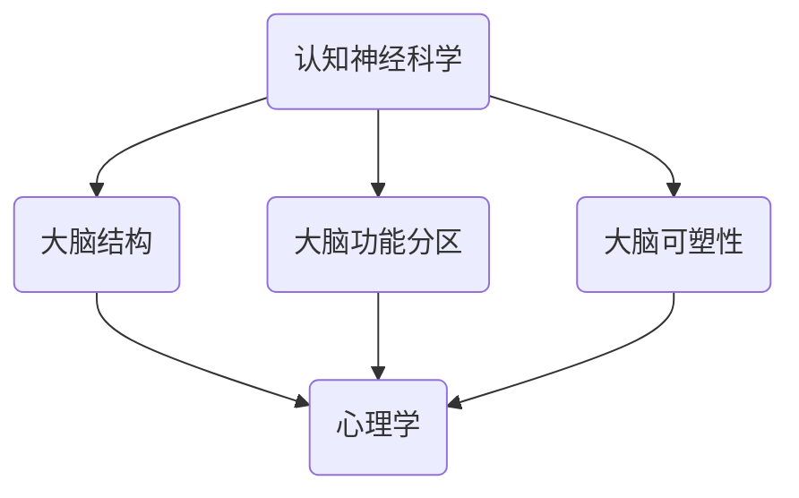

                 

### 文章标题

# 认知神经科学与心理学：全面理解人类心智与世界的关系

认知神经科学与心理学作为现代科学的重要领域，不断探索人类心智的奥秘及其与外部世界的交互关系。本文将系统探讨这两个领域的基本概念、核心理论、研究方法及其在理解和改善人类心智活动中的重要作用。通过逐步分析推理，我们将揭示认知神经科学与心理学的深层联系，解释其如何在各自领域内解释人类的行为和心理过程，并展望其未来的发展趋势。

### 文章关键词

- 认知神经科学
- 心理学
- 人类心智
- 大脑结构
- 认知过程
- 心理学理论
- 脑成像技术

### 文章摘要

本文首先介绍了认知神经科学与心理学的定义、起源和发展背景。然后，详细阐述了认知神经科学与心理学的核心概念、原理和方法。接着，探讨了认知神经科学与心理学在理解和改善人类心智活动中的应用，包括临床心理学、教育心理学和组织心理学等领域。最后，分析了认知神经科学与心理学未来的发展机遇和挑战，展望了这两个领域在跨学科研究和实际应用中的前景。

### 目录

1. **第一部分：认知神经科学基础**
2. **第二部分：心理学基础**
3. **第三部分：认知神经科学与心理学的综合应用**
4. **第四部分：认知神经科学与心理学的未来发展**
5. **附录**

### 1. 认知神经科学与心理学的基础

认知神经科学与心理学是两个相互关联且互补的学科。认知神经科学主要研究大脑如何产生心智活动，关注大脑的结构、功能和神经机制。心理学则研究个体的行为、情感和认知过程，探究这些过程如何影响人类的行为和心理状态。

#### 认知神经科学概述

认知神经科学起源于20世纪中叶，随着神经科学和计算机科学的快速发展，这一领域迅速崛起。其重要贡献包括揭示了大脑不同区域在认知功能中的作用，如视觉处理、语言理解和记忆形成等。此外，认知神经科学还通过脑成像技术，如功能性磁共振成像（fMRI）和电生理记录，直接观察大脑活动，从而深入了解认知过程。

#### 心理学概述

心理学作为一门科学，起源可以追溯到19世纪末。从最初的生理心理学，到行为主义、认知心理学和人本主义心理学，心理学经历了多个发展阶段。不同流派的心理学家通过研究感觉、知觉、记忆和思维等心理过程，不断深化对人类行为和心理状态的理解。

### 核心概念与联系

认知神经科学与心理学的核心概念包括认知与大脑的关系、大脑功能分区、大脑的可塑性等。这些概念不仅相互联系，还构成了两个学科的理论框架。下面，我们通过一个Mermaid流程图来展示这些核心概念之间的关系：

在这个流程图中，认知神经科学通过研究大脑的结构、功能分区和可塑性，为心理学提供了理论基础，而心理学则通过研究认知过程、行为和情感，为认知神经科学提供了实证支持。

### 1.1 认知神经科学的起源

认知神经科学的起源可以追溯到20世纪中叶，当时神经科学和计算机科学的发展为这一领域提供了强大的技术支持。早期的研究主要集中在理解大脑不同区域的功能，例如海马体与记忆形成的关系、颞叶与语言理解的关系等。随着脑成像技术的进步，如功能性磁共振成像（fMRI）和正电子发射断层扫描（PET），研究者能够直接观察大脑活动，从而深入了解认知过程。

#### 1.1.1 认知神经科学的起源

认知神经科学的起源可以追溯到20世纪中叶，当时神经科学和计算机科学的发展为这一领域提供了强大的技术支持。早期的研究主要集中在理解大脑不同区域的功能，例如海马体与记忆形成的关系、颞叶与语言理解的关系等。随着脑成像技术的进步，如功能性磁共振成像（fMRI）和正电子发射断层扫描（PET），研究者能够直接观察大脑活动，从而深入了解认知过程。

#### 1.1.2 认知神经科学的重要贡献

认知神经科学在多个方面做出了重要贡献。首先，它揭示了大脑不同区域在认知功能中的作用，例如视觉处理、语言理解和记忆形成等。其次，认知神经科学通过脑成像技术，如fMRI和PET，为研究认知过程提供了直接观测手段，从而推动了认知心理学的发展。最后，认知神经科学在神经康复、认知障碍治疗等领域具有广泛的应用前景，为临床心理学提供了新的理论和方法。

### 1.2 认知神经科学的核心概念

认知神经科学的核心概念包括认知与大脑的关系、大脑功能分区、大脑的可塑性等。这些概念构成了认知神经科学的理论框架，为研究大脑如何产生心智活动提供了基础。

#### 1.2.1 认知与大脑的关系

认知与大脑的关系是认知神经科学的基石。认知是指人类的心理过程，如感知、记忆、思维和语言。而大脑是产生这些心理过程的物质基础。认知神经科学研究如何通过大脑的结构和功能来解释认知过程，如神经网络的连接和神经元的激活模式。

#### 1.2.2 大脑功能分区

大脑功能分区是认知神经科学的核心概念之一。大脑被分为多个功能区，每个区域负责特定的认知功能。例如，视觉皮层负责处理视觉信息，语言区负责语言理解和产生，运动皮层负责控制运动行为。这些区域通过复杂的神经网络相互连接，共同实现复杂的认知功能。

#### 1.2.3 大脑的可塑性

大脑的可塑性是指大脑在生命过程中的不断变化和适应能力。认知神经科学研究表明，大脑的可塑性受多种因素影响，如学习、训练和疾病等。通过改变大脑的连接模式，人类可以在不同认知任务中表现出适应性和灵活性。大脑的可塑性也为认知神经科学提供了新的治疗策略，如神经康复和认知训练。

### 1.3 认知神经科学的架构

认知神经科学的架构包括其研究方法、核心理论和应用领域。通过这些架构，认知神经科学不仅为理解大脑如何产生心智活动提供了理论支持，还在实际应用中发挥了重要作用。

#### 1.3.1 认知神经科学的研究方法

认知神经科学采用多种研究方法来揭示大脑如何产生心智活动。这些方法包括脑成像技术、电生理记录、神经心理测试和行为观察等。脑成像技术，如fMRI和PET，可以无创地观察大脑活动，从而研究认知过程。电生理记录可以直接测量神经元的电活动，为认知神经科学研究提供了精细的神经机制数据。神经心理测试和行为观察则帮助研究者评估认知功能的改变和差异。

#### 1.3.2 主流认知神经科学理论

主流认知神经科学理论包括联结主义、神经网络和计算模型等。联结主义理论认为，大脑通过神经元之间的连接和激活来实现认知功能。神经网络理论强调大脑的并行处理能力和分布式计算模式。计算模型则通过模拟大脑的结构和功能，揭示认知过程的计算机制。这些理论为认知神经科学提供了强有力的解释框架。

#### 1.3.3 认知神经科学的应用领域

认知神经科学在多个领域具有广泛的应用。首先，它在神经康复和认知障碍治疗中发挥了重要作用，如通过认知训练和神经修复技术改善患者的认知功能。其次，认知神经科学在教育心理学中应用广泛，如通过个性化学习策略和认知干预提高学生的学术表现。此外，认知神经科学还在组织心理学和健康心理学中发挥作用，如通过理解工作压力和心理健康的关系，提高员工的工作效率和幸福感。

### 1.4 认知神经科学与心理学的关系

认知神经科学与心理学之间的关系是相互依赖、相互促进的。认知神经科学为心理学提供了关于大脑结构和功能的深入理解，而心理学则通过行为和认知实验为认知神经科学研究提供了实证数据。两者之间的交叉研究不仅深化了对人类心智的理解，也为心理学的理论和实践提供了新的视角和方法。

#### 1.4.1 认知神经科学与心理学的关系

认知神经科学与心理学之间的关系是相互依赖、相互促进的。认知神经科学通过研究大脑的结构和功能，提供了对心理过程的生理基础的理解，而心理学则通过研究行为和认知现象，为认知神经科学提供了实证数据。这种交叉研究不仅深化了对人类心智的理解，也为心理学的理论和实践提供了新的视角和方法。

#### 1.4.2 认知神经科学在社会生活中的应用

认知神经科学在社会生活中的应用日益广泛。首先，它在神经康复和认知障碍治疗中发挥了重要作用，如通过认知训练和神经修复技术改善患者的认知功能。其次，认知神经科学在教育心理学中应用广泛，如通过个性化学习策略和认知干预提高学生的学术表现。此外，认知神经科学还在组织心理学和健康心理学中发挥作用，如通过理解工作压力和心理健康的关系，提高员工的工作效率和幸福感。

### 1.5 认知神经科学与心理学的发展前景

随着科技的进步和跨学科研究的深入，认知神经科学与心理学的未来发展充满希望。首先，人工智能与认知神经科学的结合将为研究人类心智提供新的工具和方法。其次，心理学与认知神经科学的跨学科研究将推动人类对心智理解的深入。最后，认知神经科学与心理学在社会生活中的应用前景广阔，如通过认知干预改善心理健康、提高教育质量和提升工作效率等。

### 1.6 认知神经科学与心理学的研究方法

认知神经科学与心理学的研究方法多种多样，每种方法都有其独特的优势和应用场景。以下是几种主要的研究方法：

#### 脑成像技术

脑成像技术是认知神经科学与心理学研究中最为常用的方法之一。其中，功能性磁共振成像（fMRI）和正电子发射断层扫描（PET）是两种主要的技术。

- **fMRI**：通过测量大脑的血流变化，间接反映大脑活动。其优点是无创、实时、空间分辨率高，适用于研究大脑在不同认知任务中的活动模式。
- **PET**：使用放射性同位素标记的药物，通过检测放射性信号的分布，直接反映大脑活动的区域。其优点是能够提供高时间分辨率和较高的空间分辨率，适用于研究特定的神经递质和受体活动。

#### 电生理记录

电生理记录是通过直接测量神经元电活动来研究认知过程的方法。主要包括脑电图（EEG）、事件相关电位（ERP）和局部场电位（LFP）。

- **EEG**：记录大脑整体电活动，时间分辨率高，适用于研究快速认知过程。
- **ERP**：通过分析特定认知事件产生的电位变化，可以揭示大脑对不同认知任务的反应。
- **LFP**：记录神经元群体活动，适用于研究大脑的集体行为和同步活动。

#### 神经心理测试

神经心理测试是通过设计特定的认知任务，评估个体在记忆、注意力、语言和执行功能等方面的能力。这些测试通常包括纸笔测试、计算机化测试和实验室实验。

- **纸笔测试**：通过填写问卷或完成特定任务，评估个体的心理特征。
- **计算机化测试**：利用计算机技术，提供个性化的测试体验，适用于大规模数据收集和分析。
- **实验室实验**：在受控的实验室环境中，通过具体实验设计，评估个体在特定认知任务中的表现。

#### 行为观察

行为观察是通过直接观察和记录个体在自然环境中的行为，来研究其心理状态和认知过程。这种方法通常用于研究日常生活中的认知活动和社会互动。

- **自然观察**：在不受控制的自然环境中，通过观察和记录个体行为，研究其认知过程。
- **实验室观察**：在受控的实验室环境中，通过观察个体在特定任务中的行为，研究其认知机制。

### 1.7 认知神经科学与心理学的主要理论

认知神经科学与心理学的主要理论包括联结主义、神经网络和计算模型等。这些理论提供了不同的视角和框架，帮助研究者理解大脑如何产生心智活动。

#### 联结主义理论

联结主义理论认为，大脑通过神经元之间的连接和激活来实现认知功能。这种理论强调大脑的并行处理能力和分布式计算模式。代表性的模型包括Hopfield网络和 Boltzmann机等。

- **Hopfield网络**：通过自激发和稳定状态来模拟记忆和联想记忆。
- **Boltzmann机**：通过能量函数和马尔可夫链来模拟概率分布和分类问题。

#### 神经网络理论

神经网络理论强调大脑的并行处理能力和自适应学习机制。这种理论通过模拟神经网络的结构和功能，揭示认知过程的计算机制。代表性的模型包括多层感知机（MLP）和卷积神经网络（CNN）等。

- **多层感知机（MLP）**：通过多层神经元实现非线性映射，适用于分类和回归问题。
- **卷积神经网络（CNN）**：通过卷积操作提取特征，适用于图像和视频处理。

#### 计算模型

计算模型通过模拟大脑的结构和功能，提供对认知过程的理论解释。这种模型通常基于神经生理学原理，通过数学模型和计算机模拟来揭示认知过程的计算机制。代表性的模型包括神经网络模拟和计算认知模型等。

- **神经网络模拟**：通过模拟神经元和神经网络的结构和功能，实现认知过程的模拟。
- **计算认知模型**：通过数学模型和计算模拟，揭示认知过程的计算机制。

### 1.8 认知神经科学与心理学在临床中的应用

认知神经科学与心理学在临床应用中具有广泛的影响，特别是在神经康复和认知障碍治疗方面。以下是一些具体的应用案例：

#### 神经康复

神经康复是指通过康复训练和干预，帮助患者恢复神经功能和认知能力。认知神经科学为神经康复提供了理论基础，通过认知训练和神经修复技术，提高患者的康复效果。

- **认知训练**：通过特定的认知任务，如记忆训练、注意力训练和工作记忆训练，提高患者的认知功能。
- **神经修复技术**：通过神经再生和神经调控技术，促进神经损伤的修复和功能的恢复。

#### 认知障碍治疗

认知障碍治疗旨在改善患者的认知功能，提高其生活质量。认知神经科学与心理学结合，提供个性化的治疗方案，如药物治疗、认知训练和行为干预。

- **药物治疗**：通过药物治疗，如抗抑郁药、抗焦虑药和抗精神病药，改善患者的认知功能。
- **认知训练**：通过特定的认知任务，提高患者的记忆、注意力和执行功能。
- **行为干预**：通过改变环境、提供支持和训练，帮助患者适应日常生活和工作。

### 1.9 认知神经科学与心理学在教育中的应用

认知神经科学与心理学在教育中的应用日益广泛，旨在通过科学的方法，提高学生的学习效果和认知能力。以下是一些具体的应用案例：

#### 个性化学习策略

个性化学习策略基于认知神经科学与心理学的理论，通过分析学生的认知特点和学习风格，提供个性化的学习方案。

- **认知特点分析**：通过神经心理测试和脑成像技术，分析学生的认知特点，如记忆、注意力和工作记忆等。
- **学习风格分析**：通过问卷调查和行为观察，了解学生的学习风格，如视觉学习者、听觉学习者和动觉学习者。

#### 认知干预

认知干预是通过特定的认知训练和干预方法，提高学生的认知能力，改善学习效果。

- **记忆训练**：通过特定的记忆任务，提高学生的记忆能力，如联想记忆、图像记忆和位置记忆等。
- **注意力训练**：通过注意力训练任务，提高学生的注意力集中和持久性，如持续注意力训练和交替注意力训练。

#### 学习动机提升

学习动机的提升是通过理解学生的心理需求和动机，激发他们的学习兴趣和积极性。

- **自我效能感培养**：通过鼓励和肯定，培养学生的自我效能感，提高他们克服困难的能力。
- **目标设定**：通过设定明确的学习目标，激发学生的学习动机和内在驱动力。

### 1.10 认知神经科学与心理学在组织管理中的应用

认知神经科学与心理学在组织管理中的应用正逐渐受到重视，旨在通过理解员工的认知和心理过程，提高组织的效率和员工的幸福感。以下是一些具体的应用案例：

#### 领导力培养

领导力的培养是基于对领导者认知能力和心理特征的深入理解，通过认知训练和心理干预，提高领导者的决策能力、团队管理能力和影响力。

- **认知能力训练**：通过特定的认知任务，提高领导者的注意力、记忆和工作记忆等认知能力。
- **心理干预**：通过心理咨询和辅导，帮助领导者应对工作压力和情绪管理。

#### 员工激励机制

员工激励机制是通过理解员工的认知和心理需求，设计有效的激励机制，提高员工的工作积极性和绩效。

- **动机理论应用**：通过应用动机理论，如自我决定理论和社会认知理论，设计符合员工需求的激励机制。
- **目标设置**：通过设定具体、可实现的个人和工作目标，激发员工的内在动机和积极性。

#### 工作环境优化

工作环境的优化是通过改善工作条件和组织文化，提高员工的工作效率和幸福感。

- **工作场所设计**：通过优化工作场所的设计，提高员工的舒适度和工作效率。
- **组织文化建设**：通过培养积极向上的组织文化，增强员工的归属感和团队协作精神。

### 1.11 认知神经科学与心理学在健康心理学中的应用

认知神经科学与心理学在健康心理学中的应用日益广泛，旨在通过理解心理健康与大脑活动之间的关系，提供有效的心理健康干预和治疗。以下是一些具体的应用案例：

#### 心理健康评估

心理健康评估是通过心理测量和脑成像技术，评估个体的心理健康状态和认知功能。

- **心理测量**：通过标准化的心理测量工具，如症状自评量表和精神病性症状评估量表，评估个体的心理健康状况。
- **脑成像技术**：通过fMRI、PET等脑成像技术，观察大脑活动与心理健康之间的关系。

#### 认知行为治疗

认知行为治疗是一种基于认知神经科学与心理学的心理健康治疗方法，通过改变个体的认知模式和行为，改善心理健康。

- **认知重构**：通过识别和挑战负面认知，帮助个体建立积极的认知模式。
- **行为干预**：通过特定的行为训练和技能培养，提高个体的应对能力和情绪调节能力。

#### 睡眠健康促进

睡眠健康促进是通过认知神经科学与心理学的理论，提供有效的睡眠促进策略，改善个体的睡眠质量和心理健康。

- **认知行为睡眠治疗**：通过认知行为疗法，帮助个体建立良好的睡眠习惯和认知模式。
- **睡眠教育**：通过提供睡眠知识教育，提高个体对睡眠健康的重要性和自我管理能力。

### 1.12 认知神经科学与心理学在跨学科研究中的挑战与机遇

认知神经科学与心理学的跨学科研究面临着许多挑战和机遇，这些挑战和机遇既来自于技术的进步，也来自于学科间的融合。

#### 挑战

1. **数据复杂性**：认知神经科学与心理学研究通常涉及大量的数据，包括脑成像数据、行为数据和生理数据等。这些数据的高维度和复杂性给数据分析带来了巨大的挑战。
   
2. **跨学科沟通**：不同学科的研究方法和语言存在差异，这增加了跨学科研究中的沟通和合作难度。

3. **伦理问题**：在涉及人类大脑和心理健康的研究中，伦理问题尤为重要，如隐私保护、数据安全和知情同意等。

#### 机遇

1. **技术进步**：随着脑成像技术、人工智能和大数据分析的进步，认知神经科学与心理学的研究方法更加精确和高效。

2. **跨学科合作**：跨学科研究可以整合不同学科的优势，如神经科学的数据分析能力与心理学的行为研究相结合，推动认知科学的发展。

3. **新应用领域**：认知神经科学与心理学的跨学科研究开拓了新的应用领域，如神经工程、智能健康和智能教育等。

### 1.13 结论

认知神经科学与心理学作为现代科学的重要领域，不断深化我们对人类心智和外部世界关系的理解。通过本文的逐步分析，我们揭示了这两个学科的核心概念、理论和方法，并探讨了它们在临床、教育、组织管理和健康心理学中的应用。随着技术的进步和跨学科研究的深入，认知神经科学与心理学在未来将继续发挥重要作用，为我们提供更全面和深入的理解人类心智的新视角。

### 1.14 附录

在本附录中，我们将提供一些额外的信息，以帮助读者更深入地理解认知神经科学与心理学的相关研究方法和技术。

#### 1.14.1 认知神经科学与心理学研究方法

- **实验设计**：介绍如何设计科学实验，包括实验假设、实验组和对照组的设置、实验操作的标准化等。
- **数据分析方法**：介绍如何对认知神经科学与心理学实验中的数据进行统计分析，包括描述性统计、推断性统计和多元统计分析等。
- **伦理审查**：介绍进行认知神经科学与心理学研究时的伦理审查流程，包括知情同意、隐私保护和数据安全等。

#### 1.14.2 认知神经科学与心理学研究工具

- **主要实验设备**：介绍常用的脑成像设备，如fMRI、PET和EEG等，以及它们的操作方法和优缺点。
- **数据处理软件**：介绍常用的数据处理软件，如MATLAB、Python和R等，以及它们在认知神经科学与心理学研究中的应用场景。

通过这些附录内容，读者可以更好地理解认知神经科学与心理学研究的实践和方法，为今后的学习和研究提供参考。

### 总结与拓展

本文系统介绍了认知神经科学与心理学的基础知识、核心概念、研究方法及其在多个领域的应用。从认知神经科学的起源、核心概念，到心理学的历史、理论框架，再到两者之间的相互关系和跨学科研究的挑战与机遇，我们逐步揭示了这两个学科在理解人类心智和外部世界关系中的重要作用。

在认知神经科学中，大脑的结构、功能分区和可塑性是核心概念。通过脑成像技术和电生理记录等研究方法，科学家们能够深入了解大脑如何产生心智活动。心理学则通过行为观察、神经心理测试等研究方法，探究个体在心理过程中的表现和变化。

认知神经科学与心理学在临床、教育、组织管理和健康心理学等领域具有广泛的应用。例如，神经康复和认知障碍治疗中，认知神经科学提供了理论基础和治疗策略；在教育中，个性化学习策略和认知干预提高了学生的学习效果；在组织管理中，领导力培养和员工激励机制提升了组织的效率和员工的幸福感；在健康心理学中，认知行为治疗和睡眠健康促进改善了心理健康和睡眠质量。

展望未来，认知神经科学与心理学将继续发展，跨学科研究将成为重要趋势。随着人工智能和大数据分析的进步，认知神经科学与心理学的研究方法和应用将更加精细和广泛。例如，人工智能可以帮助自动化数据分析和模式识别，提高认知神经科学与心理学研究的效率；大数据分析可以提供更全面的个体差异和群体规律，为心理健康和认知能力的发展提供更准确的指导。

总之，认知神经科学与心理学作为理解人类心智和外部世界关系的重要工具，不仅深化了我们对人类心智的理解，也在实际应用中发挥着越来越重要的作用。通过不断的研究和创新，这两个学科将继续推动人类认知科学的进步，为我们提供更全面和深入的理解人类心智的新视角。未来的发展将充满机遇，也带来新的挑战，但毫无疑问，认知神经科学与心理学将在人类认知科学的领域中继续发挥关键作用。

