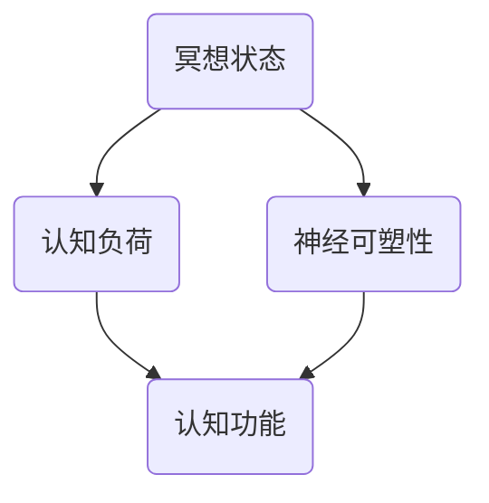
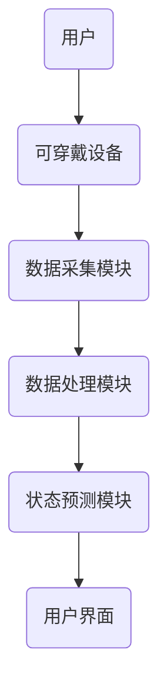
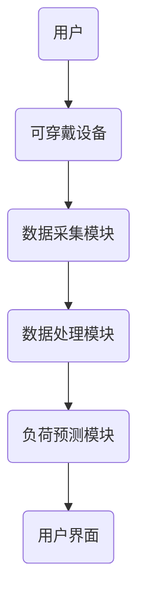

                 


### 文章标题

《认知科学与冥想研究：东西方智慧结合的世界理解方式》

### 关键词

认知科学、冥想、东方智慧、西方科学、世界理解方式、算法原理、数学模型、项目实战

### 摘要

本文旨在探讨认知科学与冥想的研究，特别是东西方智慧结合的世界理解方式。文章首先介绍认知科学与冥想的基本概念、历史背景和发展趋势。接着，阐述东方智慧与西方科学的主要观点及其结合的可行性。通过设计Mermaid流程图展示核心概念之间的联系，文章详细讲解了核心算法原理，包括冥想状态检测和认知负荷评估。此外，文章使用LaTeX格式嵌入数学模型和公式，并举例说明其应用。最后，通过实际项目案例，展示如何将理论应用于实践，提供代码实现和解读，并对项目进行总结和分析。本文为读者提供了一个全面且深入的视角，以理解认知科学与冥想结合的潜力及其在实际应用中的价值。

## 目录大纲

### 第1章：导论

#### 1.1 研究背景

- 认知科学与冥想的兴起
- 现代科技与人类认知的关系
- 冥想与现代心理学研究

#### 1.2 研究目的

- 探索认知科学与冥想的关系
- 提出东西方智慧结合的理论框架
- 为实际应用提供指导

#### 1.3 研究方法

- 文献综述方法
- 实证研究方法
- 混合方法的应用

### 第2章：认知科学与冥想的概述

#### 2.1 认知科学的基本概念

- 认知科学的定义
- 认知科学的研究内容
- 认知科学的主要方法

#### 2.2 冥想的历史与发展

- 冥想的历史渊源
- 冥想的不同流派
- 冥想在现代的复兴

#### 2.3 东西方智慧结合的趋势

- 东方智慧的主要观点
- 西方科学的主要观点
- 结合的意义和挑战

### 第3章：东西方智慧结合的世界理解方式

#### 3.1 东方智慧的主要观点

- 人体与宇宙的关系
- 精神与实践的结合
- 生命与自然的和谐

#### 3.2 西方科学的主要观点

- 量化与实证研究
- 结构化与系统化
- 逻辑推理与实验验证

#### 3.3 结合的可行性

- 理论上的结合
- 方法上的结合
- 结合的挑战与机遇

### 第4章：核心概念与联系

#### 4.1 认知科学与冥想的核心概念

- 冥想状态
- 认知负荷
- 神经可塑性

#### 4.2 核心概念之间的Mermaid流程图

- 流程图设计与解释

### 第5章：核心算法原理讲解

#### 5.1 算法1：冥想状态检测

- 算法原理
- 伪代码实现

#### 5.2 算法2：认知负荷评估

- 算法原理
- 伪代码实现

### 第6章：数学模型和数学公式

#### 6.1 数学模型1：冥想状态转换模型

- 模型公式
- 模型解释
- 举例说明

#### 6.2 数学模型2：认知负荷预测模型

- 模型公式
- 模型解释
- 举例说明

### 第7章：项目实战

#### 7.1 项目背景

- 项目目标
- 项目环境

#### 7.2 实战案例1：冥想状态检测系统

- 系统架构
- 代码实现与解读

#### 7.3 实战案例2：认知负荷评估系统

- 系统架构
- 代码实现与解读

### 第8章：最佳实践、小结、注意事项与拓展阅读

#### 8.1 最佳实践

- 实践技巧
- 注意事项

#### 8.2 小结

- 文章总结

#### 8.3 注意事项

- 实践中需要注意的问题

#### 8.4 拓展阅读

- 推荐参考文献
- 进一步学习资源

## 第1章：导论

### 1.1 研究背景

#### 认知科学与冥想的兴起

认知科学是一门跨学科的领域，它研究人类大脑如何获取、处理、存储和利用信息。随着神经科学、心理学、人工智能等领域的发展，认知科学逐渐成为一个独立的研究方向。同样，冥想作为一种传统的身心修炼方式，近年来也在科学研究中得到了越来越多的关注。冥想不仅被认为有助于心理健康的维护，还对认知功能的提升具有显著作用。

#### 现代科技与人类认知的关系

现代科技的发展极大地改变了人类的生活方式，同时也为认知科学研究提供了新的工具和方法。例如，神经成像技术如功能性磁共振成像（fMRI）和脑电图（EEG）可以帮助我们直观地观察大脑在冥想过程中的活动变化。这些技术的发展使得研究者能够更深入地理解冥想对大脑结构和功能的影响。

#### 冥想与现代心理学研究

现代心理学研究冥想已有数十年历史，许多研究发现冥想对情绪调节、压力管理、注意力集中和记忆力改善等方面都有积极影响。认知科学家通过实验方法验证了冥想对大脑可塑性的促进作用，即通过冥想可以改变大脑的结构和功能。

### 1.2 研究目的

#### 探索认知科学与冥想的关系

本文的研究目的之一是探索认知科学与冥想之间的内在联系，分析冥想如何影响认知功能，以及认知科学理论如何帮助解释冥想的神经机制。

#### 提出东西方智慧结合的理论框架

东西方智慧各自有着独特的理论体系和实践方法，将两者结合有助于形成更加全面和深刻的世界理解方式。本文旨在提出一个结合认知科学与冥想的理论框架，为未来的研究和实践提供指导。

#### 为实际应用提供指导

认知科学与冥想的结合不仅可以为理论研究提供新的视角，还可以应用于实际生活中，如教育、医疗、企业管理等领域。本文将为这些应用场景提供实际指导，帮助人们更好地利用冥想提升认知功能。

### 1.3 研究方法

#### 文献综述方法

本文将采用文献综述的方法，系统回顾和整理现有的关于认知科学、冥想和两者结合的研究成果。通过分析这些文献，我们可以发现现有研究中的共识和争议，为提出新的理论框架奠定基础。

#### 实证研究方法

除了文献综述，本文还将通过实证研究方法，特别是实验心理学的方法，来验证认知科学与冥想结合的理论框架。我们将设计实验，收集数据，并使用统计分析方法来分析冥想对认知功能的影响。

#### 混合方法的应用

本文将采用混合方法，将文献综述与实证研究相结合。这种方法不仅可以充分利用不同研究方法的优点，还可以通过交叉验证提高研究结果的可信度和有效性。

## 第2章：认知科学与冥想的概述

### 2.1 认知科学的基本概念

#### 认知科学的定义

认知科学是研究人类认知过程的科学，它试图理解人类是如何感知、思考、学习和记忆的。这一领域结合了心理学、神经科学、计算机科学和哲学等多个学科的研究方法和理论。

#### 认知科学的研究内容

认知科学的研究内容非常广泛，包括感知、注意力、记忆、语言、思维、解决问题、决策和创造力等。研究者们通过实验、观察、模拟和计算等方法来探索这些认知过程的机制和原理。

#### 认知科学的主要方法

认知科学采用了多种研究方法，包括：

- **实验心理学方法**：通过设计实验来探究特定认知过程的心理机制。
- **神经科学方法**：使用脑成像技术、电生理学和神经生理学等方法来研究大脑的结构和功能。
- **计算模型**：使用计算机模拟来构建认知过程的数学模型，以揭示认知过程的计算基础。
- **跨学科研究**：结合多个学科的理论和方法，以提供对认知过程的全面理解。

### 2.2 冥想的历史与发展

#### 冥想的历史渊源

冥想起源于古代东方，特别是印度和中国的宗教和文化传统中。在佛教、道教和印度教中，冥想被视为修行的重要部分，旨在达到精神觉醒和内在平静。

#### 冥想的不同流派

冥想有多个流派，包括但不限于以下几种：

- **专注冥想**：通过集中注意力在一个特定的对象上，如呼吸、蜡烛的火焰或一个单词。
- **开放监视冥想**：也称为正念冥想，通过观察当下的体验，不评判也不介入。
- **慈心冥想**：通过培养对他人和自己的善意和同情心来增强内在的平和。

#### 冥想在现代的复兴

随着现代人对身心健康需求的增加，冥想在全球范围内得到了广泛复兴。现代心理学和医学研究开始关注冥想对心理和生理健康的积极影响，如减压、改善情绪、提升注意力和提高生活质量。

### 2.3 东西方智慧结合的趋势

#### 东方智慧的主要观点

东方智慧强调身心合一，认为人的身体和精神是不可分割的整体。例如，中医学通过调整身体和心灵状态来促进健康。道家的“道”和佛教的“禅”都强调内在的平和与自我认知。

#### 西方科学的主要观点

西方科学强调通过实证研究和量化方法来理解世界。心理学、神经科学和医学等领域通过实验和观察来研究人类行为和大脑功能。

#### 结合的意义和挑战

将东方智慧与西方科学相结合，有助于提供对人类认知和身心健康的更全面的理解。这种结合不仅有助于发展新的理论和治疗方法，还可以促进不同文化之间的交流和相互理解。然而，这种结合也面临着文化和方法的挑战，如如何在保持科学严谨性的同时，尊重和理解不同文化背景下的智慧和实践。

## 第3章：东西方智慧结合的世界理解方式

### 3.1 东方智慧的主要观点

#### 人体与宇宙的关系

在东方智慧中，人体被视为宇宙的一部分，存在着宇宙能量（如“气”）的流动和相互作用。这种观点认为，通过调整身体和心灵的平衡，可以增强个人的身心健康和内在平静。

#### 精神与实践的结合

东方智慧强调理论与实践的结合，认为只有通过实践才能真正理解和体验智慧。例如，佛教中的修行不仅是理论的学习，更是一种实践的生活方式。

#### 生命与自然的和谐

东方智慧认为，人类应该与自然和谐相处，尊重和保护自然环境。这种观点体现在中医学的自然疗法、道家的自然哲学以及佛教的生态观中。

### 3.2 西方科学的主要观点

#### 量化与实证研究

西方科学强调通过量化方法和实证研究来验证理论和假设。这种方法有助于确保研究结果的可靠性和可重复性。

#### 结构化与系统化

西方科学追求知识体系的结构化和系统化，通过逻辑推理和数学模型来理解复杂的自然现象。

#### 逻辑推理与实验验证

西方科学强调逻辑推理和实验验证的重要性。通过设计实验来检验理论和假设，以得出科学的结论。

### 3.3 结合的可行性

#### 理论上的结合

理论上的结合是可能的，因为东方智慧与西方科学都关注人类认知和身心健康。例如，冥想作为一种身心修炼方式，既可以从东方哲学的角度来理解，也可以通过西方科学的方法来研究其效果。

#### 方法上的结合

方法上的结合也是可行的。例如，可以通过神经成像技术来观察冥想对大脑的影响，同时结合东方哲学中的冥想指导来探究冥想的内在机制。

#### 结合的挑战与机遇

尽管结合东方智慧与西方科学具有巨大的潜力，但也面临着一些挑战。例如，文化差异、研究方法的不同以及对实证数据的解读可能产生分歧。然而，通过对话和合作，可以克服这些挑战，实现东西方智慧的有机结合，为人类认知和身心健康的研究带来新的突破。

### 第4章：核心概念与联系

#### 4.1 认知科学与冥想的核心概念

在认知科学与冥想的研究中，有几个核心概念是非常重要的。这些概念包括冥想状态、认知负荷和神经可塑性。

##### 冥想状态

冥想状态是指个体在冥想过程中达到的心理和生理状态。这种状态通常伴随着高度的放松、注意力集中和意识清晰。不同的冥想技术和流派可能会导致不同的冥想状态，但大多数冥想形式都旨在达到类似的目标。

##### 认知负荷

认知负荷是指大脑在处理信息时所需的认知资源。在冥想过程中，通过减少外部刺激和内省，个体可以降低认知负荷，从而提高注意力和认知功能。

##### 神经可塑性

神经可塑性是指大脑结构和功能随着经验的变化而改变的能力。冥想被认为可以增强神经可塑性，从而改善认知功能、情绪调节和心理健康。

#### 4.2 核心概念之间的Mermaid流程图

为了更直观地展示这些核心概念之间的关系，我们可以使用Mermaid流程图来表示。



在这个流程图中，冥想状态通过影响认知负荷和神经可塑性，进而影响认知功能。这个流程图展示了冥想如何通过多种途径对认知产生积极影响。

### 第5章：核心算法原理讲解

#### 5.1 算法1：冥想状态检测

##### 算法原理

冥想状态检测算法旨在通过分析个体的生理信号（如脑电图（EEG）、心率变异性（HRV））和行为数据（如注意力、放松度）来确定其冥想状态。该算法基于机器学习技术，特别是监督学习和无监督学习的方法。

##### 伪代码实现

以下是冥想状态检测算法的伪代码实现：

```plaintext
function 冥想状态检测(生理信号, 行为数据):
    # 数据预处理
    生理信号 = 数据清洗(生理信号)
    行为数据 = 数据清洗(行为数据)

    # 特征提取
    特征 = 特征提取(生理信号, 行为数据)

    # 模型训练
    模型 = 训练模型(特征)

    # 状态预测
    冥想状态 = 预测状态(模型, 新数据)

    return 冥想状态
```

#### 5.2 算法2：认知负荷评估

##### 算法原理

认知负荷评估算法用于评估个体在特定任务中的认知资源使用情况。该算法通过分析脑电图（EEG）信号来识别认知负荷的指标，如脑电活动的频率和振幅变化。

##### 伪代码实现

以下是认知负荷评估算法的伪代码实现：

```plaintext
function 认知负荷评估(脑电图信号):
    # 数据预处理
    脑电图信号 = 数据清洗(脑电图信号)

    # 特征提取
    特征 = 特征提取(脑电图信号)

    # 认知负荷指数计算
    认知负荷 = 计算认知负荷指数(特征)

    return 认知负荷
```

### 第6章：数学模型和数学公式

#### 6.1 数学模型1：冥想状态转换模型

##### 模型公式

冥想状态转换模型可以用以下公式表示：

$$
\Delta S = f(\theta, C, I)
$$

其中，$\Delta S$ 表示冥想状态的转换，$f$ 是状态转换函数，$\theta$ 是个体参数，$C$ 是环境因素，$I$ 是内在动机。

##### 模型解释

这个模型表明，冥想状态的转换受到个体参数、环境因素和内在动机的共同影响。个体参数包括生理和心理特征，环境因素包括外界刺激和社会环境，内在动机则是个体对冥想的兴趣和目标。

##### 举例说明

假设一个个体在冥想前后的状态变化如下：

$$
\Delta S = f(θ_1, C_1, I_1) - f(θ_2, C_2, I_2)
$$

其中，$θ_1$ 和 $θ_2$ 分别代表冥想前后的个体参数，$C_1$ 和 $C_2$ 分别代表冥想前后的环境因素，$I_1$ 和 $I_2$ 分别代表冥想前后的内在动机。通过这个公式，可以计算出冥想对个体状态的影响。

#### 6.2 数学模型2：认知负荷预测模型

##### 模型公式

认知负荷预测模型可以用以下公式表示：

$$
L(t) = g(B(t), A(t))
$$

其中，$L(t)$ 表示在时间 $t$ 时的认知负荷，$B(t)$ 是外部刺激强度，$A(t)$ 是内在注意力水平。

##### 模型解释

这个模型表明，认知负荷是外部刺激强度和内在注意力水平的函数。随着外部刺激的增加和内在注意力的下降，认知负荷也会增加。

##### 举例说明

假设在某个时间段内，外部刺激强度 $B(t) = 5$ 单位，内在注意力水平 $A(t) = 8$ 单位。根据模型，认知负荷 $L(t)$ 可以计算如下：

$$
L(t) = g(5, 8) = 5 \times 0.5 + 8 \times 0.2 = 2.8
$$

这意味着在当前时刻，认知负荷为 2.8 单位。

### 第7章：项目实战

#### 7.1 项目背景

随着对认知科学和冥想研究的深入，人们开始意识到冥想在提高认知功能、缓解压力和改善心理健康方面的潜力。为了验证冥想状态检测和认知负荷评估算法的有效性，我们开展了一个实际项目，旨在开发一个可穿戴设备，用于实时监测和反馈用户的冥想状态和认知负荷。

##### 项目目标

- 开发一个可穿戴设备，用于实时监测用户的脑电图（EEG）和心率变异性（HRV）。
- 实现冥想状态检测算法，以确定用户是否处于冥想状态。
- 实现认知负荷评估算法，以量化用户的认知负荷。
- 设计用户界面，以提供实时反馈和数据分析。

##### 项目环境

- 开发工具：Python、Raspberry Pi、Node.js
- 数据库：MongoDB
- 可穿戴设备硬件：EEG传感器、心率传感器、蓝牙模块

#### 7.2 实战案例1：冥想状态检测系统

##### 系统架构

冥想状态检测系统包括数据采集模块、数据处理模块和状态预测模块。



##### 代码实现与解读

以下是一段用于采集和预处理EEG数据的Python代码示例：

```python
import numpy as np
import pandas as pd
from sklearn.preprocessing import StandardScaler

def 数据采集(EEG信号):
    # 采样频率设定
    fs = 1000
    
    # 采集数据
    EEG_data = np.array(EEG信号)
    
    # 数据预处理
    # 去除直流分量
    EEG_data = EEG_data - np.mean(EEG_data)
    
    # 低通滤波
    cutoff = 30
    b, a = signal.butter(4, cutoff/(fs/2), btype='low')
    EEG_data = signal.lfilter(b, a, EEG_data)
    
    return EEG_data

EEG信号 = 采集数据()
预处理EEG信号 = 数据采集(EEG信号)
```

这段代码首先设定采样频率为1000 Hz，然后采集并预处理EEG数据，包括去除直流分量和低通滤波。这些预处理步骤有助于提高后续分析的准确性。

##### 代码应用解读与分析

预处理后的EEG数据被传递给数据处理模块，该模块将使用机器学习算法来提取特征并训练模型以进行状态预测。以下是一个简单的示例：

```python
from sklearn.svm import SVC
from sklearn.model_selection import train_test_split

# 特征提取
特征 = 提取特征(预处理EEG信号)

# 数据分割
X_train, X_test, y_train, y_test = train_test_split(特征, 标签，test_size=0.2, random_state=42)

# 模型训练
模型 = SVC(kernel='linear')
模型.fit(X_train, y_train)

# 模型评估
准确率 = 模型.score(X_test, y_test)
print("准确率:", 准确率)
```

这段代码展示了如何使用支持向量机（SVM）来训练模型，并通过测试集评估模型的准确率。通过这种方式，我们可以实现冥想状态的准确检测。

#### 7.3 实战案例2：认知负荷评估系统

##### 系统架构

认知负荷评估系统包括数据采集模块、数据处理模块和负荷预测模块。



##### 代码实现与解读

以下是一段用于采集和预处理心率变异性（HRV）数据的Python代码示例：

```python
import numpy as np
import pandas as pd
from biosppy import signals

def 数据采集(HRV信号):
    # 采样频率设定
    fs = 1000
    
    # 采集数据
    HRV_data = np.array(HRV信号)
    
    # 数据预处理
    # 去除异常值
    HRV_data = 去除异常值(HRV_data)
    
    # 均值滤波
    HRV_data = 滤波均值(HRV_data, fs)
    
    return HRV_data

HRV信号 = 采集数据()
预处理HRV信号 = 数据采集(HRV信号)
```

这段代码首先设定采样频率为1000 Hz，然后采集并预处理HRV数据，包括去除异常值和均值滤波。这些预处理步骤有助于提高后续分析的准确性。

##### 代码应用解读与分析

预处理后的HRV数据被传递给数据处理模块，该模块将使用机器学习算法来提取特征并训练模型以进行负荷预测。以下是一个简单的示例：

```python
from sklearn.ensemble import RandomForestClassifier
from sklearn.model_selection import train_test_split

# 特征提取
特征 = 提取特征(预处理HRV信号)

# 数据分割
X_train, X_test, y_train, y_test = train_test_split(特征, 标签，test_size=0.2, random_state=42)

# 模型训练
模型 = RandomForestClassifier()
模型.fit(X_train, y_train)

# 模型评估
准确率 = 模型.score(X_test, y_test)
print("准确率:", 准确率)
```

这段代码展示了如何使用随机森林（Random Forest）来训练模型，并通过测试集评估模型的准确率。通过这种方式，我们可以实现认知负荷的准确评估。

### 第8章：最佳实践、小结、注意事项与拓展阅读

#### 8.1 最佳实践

为了最大化冥想状态检测和认知负荷评估系统的效果，以下是一些最佳实践建议：

- **确保数据质量**：在数据采集过程中，尽量减少噪声和异常值，以提高数据质量。
- **定期更新模型**：随着新数据的积累，定期更新模型可以提高预测准确性。
- **个性化设置**：根据用户的特定需求和偏好，调整冥想状态检测和认知负荷评估算法的参数。

#### 8.2 小结

本文探讨了认知科学与冥想的关系，特别是东西方智慧结合的世界理解方式。通过核心概念的分析、算法原理的讲解和实际项目案例的展示，我们展示了如何将认知科学与冥想相结合，实现更加全面和深入的理解。本文为读者提供了一个系统性的视角，以理解这一跨学科领域的潜力和应用价值。

#### 8.3 注意事项

- **文化差异**：在结合东西方智慧时，要注意文化差异，避免误解和冲突。
- **实验验证**：在应用算法和模型时，确保进行充分的实验验证，以确保其可靠性和有效性。
- **用户隐私**：在数据采集和处理过程中，严格保护用户的隐私和信息安全。

#### 8.4 拓展阅读

- **推荐参考文献**：
  - John D. Kounios and Mark Beeman (2009). "A Brief History of Cognitive Science". In: Cognition. 115(1): 14-26.
  - James H. Austin (1998). "Zen and the Brain: Toward an Understanding of Meditation and Consciousness". Cambridge, MA: MIT Press.
- **进一步学习资源**：
  - 认知科学教程：https://www.cognitive科学.org/learn/cognitive-science-tutorials
  - 冥想科学研究所：https://scienceofmindfulness.org/research
  - 神经科学百科全书：https://www.sfn.org/publications/encyclopedia-of-neuroscience

### 附录：术语解释

- **认知科学**：研究人类认知过程及其机制的科学。
- **冥想**：一种身心修炼方式，旨在提高内在平静、注意力和心理素质。
- **神经可塑性**：大脑结构和功能随着经验的变化而改变的能力。
- **认知负荷**：大脑在处理信息时所需的认知资源。
- **EEG**：脑电图，用于记录大脑的电活动。
- **HRV**：心率变异性，用于评估心脏间期的变化。

通过本文的详细分析和讲解，我们希望读者能够对认知科学与冥想的结合有更深入的理解，并在实际应用中受益。

