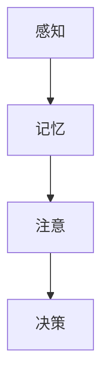
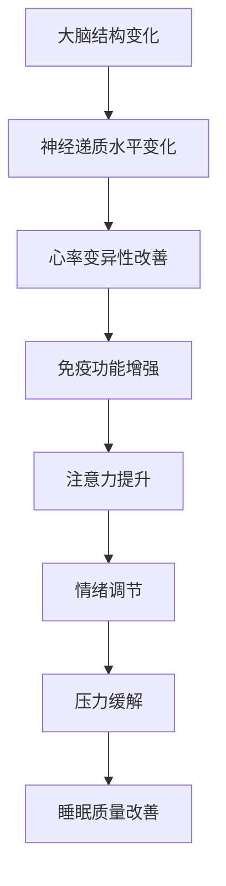

                 

### 引言

认知科学与冥想研究作为东西方智慧结合的重要领域，近年来吸引了全球范围内广泛的关注。认知科学是研究人类思维、感知、记忆等认知过程的科学，而冥想则是一种通过意识调节来达到精神集中和心灵平静的实践。两者的交叉研究不仅有助于揭示人类大脑的奥秘，还为改善心理健康、提升认知功能提供了新的思路和方法。

本文将系统地探讨认知科学与冥想的结合，从基本理论、实践应用、科技结合等多个维度进行分析。首先，我们将回顾认知科学与冥想的历史发展，了解两者是如何逐渐融合的。接着，本文将深入探讨认知科学与冥想的核心概念与联系，并通过Mermaid流程图展示其关系架构。然后，我们将详细讲解冥想的基本算法原理和数学模型，使用伪代码和LaTeX格式进行阐述。此外，本文还将结合实际项目实战，介绍冥想应用的开发环境搭建、源代码实现和代码解读，以及实际案例分析和项目小结。最后，我们将总结冥想对认知健康的影响，并提出未来研究方向与展望。

通过本文的详细探讨，读者可以全面了解认知科学与冥想的研究现状、核心概念、实践应用以及未来发展趋势。让我们一步一步地深入思考，揭开这一领域背后的奥秘。## 文章关键词

- 认知科学
- 冥想
- 东西方智慧结合
- 脑神经科学
- 心理健康
- 认知功能
- 意识调节
- 现代科技应用
- 源代码实现
- 实际案例分析
- 未来发展趋势

## 文章摘要

本文旨在探讨认知科学与冥想的结合，展示东西方智慧在认知健康和心灵调节方面的综合应用。首先，本文回顾了认知科学和冥想的发展历史，介绍了两者如何逐渐融合。接着，通过详细分析核心概念与联系，使用Mermaid流程图展示认知科学与冥想的关系架构。然后，本文深入讲解了冥想的基本算法原理和数学模型，通过伪代码和LaTeX格式进行阐述。此外，本文结合实际项目实战，介绍了冥想应用的开发环境搭建、源代码实现和代码解读。最后，本文总结了冥想对认知健康的影响，提出了未来研究方向与展望。通过本文的系统性探讨，读者可以全面了解认知科学与冥想的结合及其在现实生活中的应用。## 第一部分：引言

### 第1章：书籍概述与目标

#### 1.1 认知科学与冥想的交叉研究背景

认知科学与冥想研究作为近年来备受关注的交叉领域，融合了神经科学、心理学、哲学和计算机科学等多学科知识。认知科学致力于研究人类思维、感知、记忆等认知过程，而冥想作为一种古老的实践方式，通过意识调节来达到精神集中和心灵平静。两者的结合为探讨人类大脑的运作机制、提升心理健康和认知功能提供了新的视角和方法。

随着现代科技的发展，尤其是脑成像技术和脑机接口技术的应用，研究者们能够更深入地了解冥想对大脑结构和功能的影响。同时，随着全球生活节奏的加快和工作压力的增大，越来越多的人开始寻求通过冥想来缓解焦虑、提高专注力和改善生活质量。因此，认知科学与冥想的交叉研究不仅具有重要的理论价值，也具有广泛的应用前景。

#### 1.2 书籍结构概述

本书旨在系统地探讨认知科学与冥想的结合，分为七个主要部分：

1. **引言**：介绍认知科学与冥想研究的背景、目的和结构。
2. **认知科学与冥想的基本理论**：回顾认知科学和冥想的发展历程，阐述两者的核心概念与联系。
3. **东西方智慧结合的原理**：分析东方智慧与冥想、西方智慧与冥想的关系，展示东西方智慧结合的原理。
4. **冥想实践与应用**：提供冥想实践指南，探讨冥想在不同场景下的应用。
5. **现代科技与冥想**：介绍科技与冥想的结合，展示脑机接口、虚拟现实等技术在冥想中的应用。
6. **冥想对认知健康的影响**：分析冥想对认知功能、心理健康等方面的影响。
7. **结论与展望**：总结本书的主要观点，提出未来研究方向与展望。

#### 1.3 研究意义与预期成果

本书的研究意义主要体现在以下几个方面：

1. **理论意义**：通过深入探讨认知科学与冥想的结合，丰富认知科学和冥想的理论体系，为未来研究提供新的视角和方法。
2. **实践意义**：提供系统的冥想实践指南，指导读者在日常生活中实践冥想，改善心理健康和提升认知功能。
3. **应用前景**：探讨现代科技与冥想的结合，为冥想应用的开发提供技术支持，推动冥想在心理健康、教育、工作等领域的应用。

预期成果包括：

1. **全面了解认知科学与冥想的结合**：通过系统的探讨，使读者全面了解认知科学与冥想的结合及其在现实生活中的应用。
2. **提升认知健康**：通过冥想实践，帮助读者改善注意力、记忆力、情绪调节等认知功能。
3. **推动冥想研究与应用**：为冥想研究提供新的思路和方法，推动冥想在不同领域的应用发展。

通过本书的探讨，我们希望为认知科学与冥想研究开辟新的道路，为提升人类认知健康和生活质量做出贡献。### 第2章：认知科学基本原理

#### 2.1 认知科学的定义与发展历程

认知科学是研究人类思维、感知、记忆、语言等认知过程和认知能力的学科，它结合了心理学、神经科学、计算机科学、哲学等多个学科的理论和方法。认知科学的核心目标是理解人类如何通过大脑和神经系统进行信息处理和知识建构。

认知科学的历史可以追溯到20世纪初，当时心理学开始从行为主义转向认知心理学。行为主义强调通过可观察的行为来研究心理过程，而认知心理学则关注人类内部的心理活动，如思考、记忆、解决问题等。随着神经科学和计算机科学的发展，认知科学逐渐形成了自己的理论体系和研究方法。

认知科学的发展历程可以分为以下几个阶段：

1. **早期认知科学研究（20世纪初-20世纪60年代）**：在这个阶段，心理学研究者开始关注人类内部的心理过程，如记忆、思维和语言。经典的研究包括布鲁纳（Jerome Bruner）的“发现学习”理论，苛勒（Wolfgang Köhler）的“完形心理学”理论等。

2. **认知心理学的兴起（20世纪60年代-20世纪80年代）**：在这个阶段，计算机科学的发展推动了认知心理学的研究。计算机模拟被用于研究人类思维过程，例如模拟问题解决、记忆和语言处理。这一时期的重要理论包括新吉布森（Neisser, 1967）的“认知地图”理论和西蒙（Herbert A. Simon）的“有限理性”理论。

3. **认知科学的成熟（20世纪80年代至今）**：在这个阶段，认知科学逐渐形成了一个跨学科的综合性研究领域。神经科学的研究揭示了大脑各个区域在认知功能中的作用，例如海马体在记忆中的作用，前额叶皮质在决策中的作用。同时，计算机科学的发展推动了人工智能和机器学习的研究，为认知科学研究提供了新的工具和方法。

#### 2.2 认知结构与功能

认知科学的核心概念之一是认知结构，它指的是大脑中用于处理信息的各种结构和网络。认知结构包括感知系统、记忆系统、注意系统和决策系统等。

1. **感知系统**：感知系统负责接收和处理来自外界的感官信息。这些信息通过视觉、听觉、触觉、嗅觉和味觉等感官通道传入大脑。例如，视觉系统通过视网膜接收光信号，并将其转换为神经信号，最终在大脑中处理成我们所看到的图像。

2. **记忆系统**：记忆系统包括短期记忆和长期记忆。短期记忆主要负责暂时存储和处理信息，例如我们在打电话时能够记住对方的号码。长期记忆则负责长期存储信息，例如我们能够记住多年的学习内容。记忆系统的功能受到大脑不同区域的影响，如海马体在记忆形成和巩固中起关键作用。

3. **注意系统**：注意系统负责选择和集中注意力。它帮助我们专注于某些特定信息，而忽略其他无关信息。例如，当我们尝试集中注意力听一个演讲时，注意系统会帮助我们排除其他干扰因素。

4. **决策系统**：决策系统负责处理复杂的决策问题。它涉及到多个认知过程，如信息收集、风险评估和选择方案。例如，当我们决定购买某个商品时，决策系统会帮助我们权衡不同选项的优缺点。

#### 2.3 认知过程与决策

认知过程是认知科学研究的核心内容，它包括感知、记忆、注意和决策等多个方面。这些过程相互作用，共同决定了我们的思维和行为。

1. **感知过程**：感知过程是认知过程的起点，它涉及感官系统对信息的接收和处理。例如，当我们看到一只鸟时，视觉系统会接收光信号，并将其转换为神经信号，最终在大脑中处理成我们所看到的图像。

2. **记忆过程**：记忆过程包括短期记忆和长期记忆。短期记忆主要负责暂时存储和处理信息，例如我们在打电话时能够记住对方的号码。长期记忆则负责长期存储信息，例如我们能够记住多年的学习内容。

3. **注意过程**：注意过程负责选择和集中注意力。它帮助我们专注于某些特定信息，而忽略其他无关信息。例如，当我们尝试集中注意力听一个演讲时，注意系统会帮助我们排除其他干扰因素。

4. **决策过程**：决策过程涉及多个认知过程，如信息收集、风险评估和选择方案。例如，当我们决定购买某个商品时，决策系统会帮助我们权衡不同选项的优缺点。

为了更好地理解认知过程，我们可以使用Mermaid流程图来展示它们之间的关系：

通过上述流程图，我们可以看到感知、记忆、注意和决策是如何相互关联的。感知系统接收外部信息，记忆系统负责存储和处理这些信息，注意系统帮助我们在需要时集中注意力，而决策系统则基于已有的信息和认知过程做出决策。

综上所述，认知科学的基本原理为我们理解人类思维和行为提供了重要的框架。通过深入探讨认知科学的基本原理，我们可以更好地理解认知过程和决策机制，从而为认知科学与冥想的结合提供理论基础。### 第3章：冥想的基本概念与类型

#### 3.1 冥想的定义与历史

冥想是一种通过意识调节来达到精神集中和心灵平静的实践，起源于古代印度，后传播到世界各地。在不同的文化和传统中，冥想有着不同的名称和形式，但其核心目的都是为了实现心理的宁静和身心的平衡。

1. **起源与发展**：冥想起源于古印度，早在公元前500年左右，佛教和印度教的经典中就有关于冥想的记载。佛教的冥想实践强调通过冥想达到心无挂碍的境界，而印度教则强调冥想与神我合一。随着佛教和印度教的传播，冥想逐渐传入中国、东亚和其他地区，形成了各种地方性的冥想传统。

2. **古代与现代**：在古代，冥想主要作为一种精神修行和宗教实践。随着现代社会的快速发展，人们面临越来越多的压力和焦虑，冥想逐渐被认识到其在心理健康和认知功能提升方面的潜在价值。现代科学研究开始关注冥想对大脑结构和功能的影响，进一步推动了冥想的应用和发展。

3. **类型与特点**：冥想有多种类型，每种类型都有其独特的实践方法和心理效应。以下是一些常见的冥想类型及其特点：

   - **专注冥想（Focus Meditation）**：专注冥想是一种通过将注意力集中在一个特定的对象或概念上来达到冥想状态的方法。常见的专注冥想对象包括呼吸、声音、蜡烛火焰等。这种方法有助于提高注意力和专注力，同时减轻焦虑和压力。

   - **禅修（Mindfulness Meditation）**：禅修强调对当前经验的非评判性注意，通过观察呼吸、身体感觉或思维活动来达到冥想状态。禅修有助于提高自我意识和情绪调节能力，减少心理压力。

   - **慈悲冥想（Compassion Meditation）**：慈悲冥想是一种通过培养对他人的善意和同情心来达到冥想状态的方法。这种方法有助于增强人际关系，提高社交技能，同时减轻负面情绪。

   - **动态冥想（Dynamic Meditation）**：动态冥想是一种结合身体运动和呼吸调节的冥想形式。这种冥想方法有助于释放身体和情绪的紧张，提高能量水平和心理活力。

#### 3.2 冥想类型及其特点

以下是对几种常见冥想类型的详细描述：

1. **专注冥想**：
   - **实践方法**：在专注冥想中，冥想者选择一个特定的对象或概念，如呼吸、声音或蜡烛火焰，并将其作为专注点。冥想者需要将注意力完全集中在专注点上，一旦注意力分散，就需要将注意力重新引导回专注点。
   - **心理效应**：专注冥想有助于提高注意力和专注力，同时减轻焦虑和压力。长期实践专注冥想可以增强冥想者的自我控制和情绪调节能力。

2. **禅修**：
   - **实践方法**：禅修强调对当前经验的非评判性注意。冥想者通过观察呼吸、身体感觉或思维活动来培养对当前经验的深入觉知。在禅修过程中，冥想者需要保持身体和思维的平静，不对任何经验进行评判或分析。
   - **心理效应**：禅修有助于提高自我意识和情绪调节能力，减少心理压力。此外，禅修还可以改善心理健康，减轻焦虑和抑郁症状。

3. **慈悲冥想**：
   - **实践方法**：慈悲冥想通过培养对他人的善意和同情心来达到冥想状态。冥想者可以想象自己向他人发送善意和祝福，或者通过想象他人的困境来培养同情心。
   - **心理效应**：慈悲冥想有助于增强人际关系，提高社交技能。此外，慈悲冥想还可以减轻负面情绪，提高生活满意度。

4. **动态冥想**：
   - **实践方法**：动态冥想结合身体运动和呼吸调节。冥想者通过快速呼吸和剧烈的身体运动来释放身体和情绪的紧张，随后通过深呼吸和放松身体来达到冥想状态。
   - **心理效应**：动态冥想有助于提高能量水平和心理活力，同时减轻压力和焦虑。长期实践动态冥想可以改善身心健康，增强抗压能力。

通过上述冥想类型的描述，我们可以看到冥想在实践中具有多样性和灵活性。不同的冥想类型适用于不同的需求和情境，读者可以根据自己的兴趣和需求选择适合的冥想方式。#### 3.3 冥想的生理与心理效应

冥想作为一种通过意识调节来达到精神集中和心灵平静的实践，已经逐渐被现代科学研究证明其对生理和心理健康的多种积极效应。以下是冥想在生理和心理方面的主要效应：

#### 生理效应

1. **大脑结构变化**：多项研究表明，长期冥想可以导致大脑结构和功能的变化。例如，一项发表于《自然-神经科学》杂志上的研究发现，长期冥想者的前额叶皮质区域（与认知功能、情绪调节和注意力控制相关）体积较大。此外，冥想还可以增加大脑灰质密度，特别是在与情绪调节和注意力控制相关的大脑区域。

2. **神经递质水平变化**：冥想可以影响大脑中神经递质的水平，从而影响情绪和行为。例如，研究表明，冥想可以增加血清素（5-羟色胺）和多巴胺（一种与愉悦感和奖励相关的神经递质）的水平，从而减轻焦虑和抑郁症状。

3. **心率变异性改善**：心率变异性（HRV）是衡量自主神经系统功能的一个重要指标。研究发现，冥想可以提高心率变异性，表明冥想对自主神经系统的调节作用。这种改善与心理健康、情绪调节和压力管理有关。

4. **免疫功能增强**：冥想可以通过调节免疫系统功能来改善身体健康。例如，一项研究发现，冥想可以增加自然杀伤细胞（NK细胞）的活性，从而提高机体的免疫功能。

#### 心理效应

1. **注意力提升**：冥想已被证明可以显著提高注意力。一项涉及2000多名参与者的元分析研究发现，冥想训练可以显著改善认知控制和注意力水平，尤其是在长时间维持注意力方面。

2. **情绪调节**：冥想可以帮助人们更好地管理情绪。研究表明，冥想可以降低焦虑和抑郁水平，提高情绪调节能力。例如，一项对高校学生的研究发现，为期8周的冥想训练显著降低了焦虑和抑郁症状，并提高了情绪调节能力。

3. **压力缓解**：冥想是一种有效的压力缓解方法。研究表明，冥想可以降低应激激素（如皮质醇）的水平，从而减轻压力。一项涉及1200多名参与者的研究发现，冥想可以显著降低心理压力水平，提高生活满意度。

4. **睡眠质量改善**：冥想还可以改善睡眠质量。一项对200多名失眠患者的随机对照试验研究发现，为期8周的冥想训练显著改善了睡眠质量，减少了失眠症状。

为了更直观地展示冥想在生理和心理方面的效应，我们可以使用以下Mermaid流程图：

通过上述流程图，我们可以看到冥想在生理和心理方面是如何相互关联的。例如，大脑结构变化可以影响神经递质水平，进而影响情绪调节和注意力；而情绪调节和压力缓解又可以促进睡眠质量的改善。

综上所述，冥想作为一种古老而现代的实践方式，已经在生理和心理方面展现出多种积极效应。通过系统的冥想训练，我们可以改善大脑结构和功能，提高心理健康和认知功能，从而提升整体生活质量。### 第4章：东方智慧与冥想

#### 4.1 东方哲学与冥想的关系

东方哲学中的智慧与冥想有着深厚的渊源。东方哲学强调与自然和谐相处、内心的平静与自我认识，而冥想作为一种内在的修炼方法，正是这些哲学思想的体现和实践。以下将探讨几种主要的东方哲学与冥想的关系：

1. **佛教哲学与冥想**：佛教哲学中的禅定（Dhyana）是一种重要的冥想形式。禅定强调通过专注和内观来达到心无挂碍的境界。佛教的八正道中，冥想被视为实现解脱的关键途径。通过冥想，佛教徒可以培养慈悲、智慧和平静，最终达到涅槃（Nirvana）的境界。

2. **道教哲学与冥想**：道教哲学强调天人合一、自然的和谐与内心的平静。道教中的冥想实践，如呼吸冥想、内观冥想等，旨在通过调整呼吸和意识，达到身心合一的状态。道教哲学认为，通过冥想可以与天地相通，获得内在的智慧与力量。

3. **儒家哲学与冥想**：儒家哲学注重道德修养和社会责任感，而冥想作为一种内心的修炼方法，可以帮助人们达到内心的平和与自省。儒家经典《中庸》提到“致中和”，即通过冥想达到内心的平衡与和谐，这与冥想的核心理念高度一致。

#### 4.2 传统冥想方法的原理与实践

东方传统中有多种冥想方法，每种方法都有其独特的原理和实践。以下是几种常见的传统冥想方法的详细描述：

1. **禅修（Zazen）**：
   - **原理**：禅修是佛教中一种基本的冥想形式，强调通过坐姿冥想来达到内心的平静。禅修的核心在于专注和呼吸的调节，通过观察呼吸和排除杂念，达到心无挂碍的境界。
   - **实践**：禅修通常采用坐姿，保持脊柱挺直，专注于呼吸。当思维散乱时，将注意力重新引导回呼吸。禅修不仅可以帮助放松身心，还能提高专注力和情绪调节能力。

2. **呼吸冥想（Pranayama）**：
   - **原理**：呼吸冥想源于印度瑜伽传统，通过调节呼吸来平衡身体和心灵。呼吸被视为生命能量的流动，通过调整呼吸节奏，可以影响身体的能量水平和心理状态。
   - **实践**：呼吸冥想包括多种呼吸技巧，如深呼吸、慢呼吸和交替呼吸等。冥想者通过集中注意力在呼吸上，调整呼吸节奏，达到身心合一的境界。

3. **内观冥想（Vipassana）**：
   - **原理**：内观冥想是一种深刻的自我观察方法，强调通过观察身体感觉和思维活动来达到内在的觉醒。内观冥想旨在培养对当前经验的清晰觉知，而不进行评判或分析。
   - **实践**：内观冥想通常在一个安静的环境中练习，冥想者通过观察身体的感受和思维活动，逐步深入内心，达到更高的觉知水平。

#### 4.3 中国古代冥想与现代认知科学结合

中国古代哲学和医学中有很多关于冥想和身心健康的论述，这些理论在现代认知科学中得到验证。以下是几种中国古代冥想方法的现代认知科学研究：

1. **太乙金华秘诀**：
   - **原理**：太乙金华秘诀是一种结合呼吸调节和内观的方法，强调通过调整呼吸和意识，达到身心的和谐。该方法强调内在的自我调整和平衡，与认知科学的自我调节理论有相似之处。
   - **研究**：现代研究表明，太乙金华秘诀中的呼吸调节和内观实践可以显著降低焦虑和抑郁水平，提高情绪调节能力。

2. **黄帝内经**：
   - **原理**：《黄帝内经》是中国古代医学的经典，其中提到多种冥想方法，强调通过调节呼吸和意识来达到身体的平衡与健康。该理论认为，身体的健康与心理状态密切相关，通过冥想可以改善身心健康。
   - **研究**：现代认知科学研究支持《黄帝内经》中的观点，研究表明，冥想可以通过调节神经系统和内分泌系统，改善身体的免疫功能和整体健康。

3. **静坐冥想**：
   - **原理**：静坐冥想是一种简单的冥想方法，强调通过坐姿冥想来达到内心的平静。静坐冥想的核心在于专注和呼吸的调节，通过排除杂念，达到心无挂碍的状态。
   - **研究**：现代研究表明，静坐冥想可以提高注意力、专注力和情绪调节能力，同时减轻压力和焦虑。

通过上述分析，我们可以看到，中国古代冥想方法与现代认知科学的结合为探讨冥想的生理和心理效应提供了新的视角和方法。这些研究不仅验证了古代哲学和医学的智慧，也为现代心理健康和认知功能的研究提供了重要的理论基础。### 第5章：西方智慧与冥想

#### 5.1 西方心理学与冥想

西方心理学中的研究为冥想的生理和心理效应提供了丰富的理论基础。从20世纪初开始，西方心理学家开始对冥想进行系统性研究，探索其对人体身心健康的影响。以下是一些主要的研究领域和发现：

1. **认知行为疗法（CBT）与冥想**：
   - **原理**：认知行为疗法是一种通过改变负面思维模式和行为来改善心理健康的治疗方法。冥想作为CBT的一个重要补充，通过提高注意力和自我觉察，帮助患者更好地理解和管理情绪。
   - **实践**：在CBT中，冥想练习通常包括正念冥想（Mindfulness-Based Stress Reduction，MBSR）和正念认知疗法（Mindfulness-Based Cognitive Therapy，MBCT）。研究表明，这些冥想方法可以显著减轻焦虑、抑郁和压力水平，提高生活质量。

2. **神经科学视角下的冥想**：
   - **原理**：神经科学研究揭示了冥想对大脑结构和功能的影响。例如，研究表明，长期冥想可以增加前额叶皮质的灰质密度，增强大脑区域的连接性和功能整合。这些变化与认知控制和情绪调节能力有关。
   - **实践**：神经科学家使用功能磁共振成像（fMRI）和脑电图（EEG）等技术，研究冥想对大脑活动的影响。研究发现，冥想可以改变大脑默认模式网络（DMN）的活动模式，提高大脑的灵活性和适应性。

3. **发展心理学与冥想**：
   - **原理**：发展心理学家研究冥想对儿童和青少年认知发展的影响。研究表明，冥想可以改善注意力、记忆力、情绪调节能力和社交技能，有助于减少行为问题和提高学术表现。
   - **实践**：学校和教育机构开始引入冥想课程，以帮助学生在面对压力和挑战时保持冷静和专注。例如，加利福尼亚州的某些学校已将冥想作为常规课程，用于提高学生的学习成绩和心理幸福感。

#### 5.2 西方哲学与冥想的关系

西方哲学中的存在主义和现象学为冥想的哲学基础提供了深刻的思考。以下是一些主要哲学流派与冥想的关系：

1. **存在主义与冥想**：
   - **原理**：存在主义强调个体的主观体验和存在的意义。冥想作为一种内在的修炼方法，帮助个体深入反思自我和存在的本质。存在主义者如让-保罗·萨特（Jean-Paul Sartre）和马丁·海德格尔（Martin Heidegger）认为，通过冥想可以更好地理解存在的真实状态。
   - **实践**：存在主义哲学家提倡通过冥想和内省来探索个体的存在意义，实现自我认知和内心平静。这种哲学实践与冥想的核心理念高度一致，都强调个体的自我觉察和自我实现。

2. **现象学与冥想**：
   - **原理**：现象学强调对当前经验的直接观察和描述，而不是基于假设或理论的推理。冥想作为一种现象学实践，通过正念和内观，帮助个体直接体验当前的经验，而不是通过思维或情感过滤。
   - **实践**：现象学家如马丁·海德格尔和爱德蒙·胡塞尔（Edmund Husserl）提倡通过冥想来深入体验和理解存在。这种现象学视角为冥想提供了哲学基础，强调了冥想在探索个体意识和经验中的重要性。

#### 5.3 现代科学视角下的西方冥想实践

在现代社会，西方冥想实践得到了广泛的接受和应用。以下是一些现代科学视角下的西方冥想方法及其特点：

1. **正念冥想**：
   - **原理**：正念冥想强调对当前经验的非评判性注意，通过观察呼吸、身体感觉和思维活动来达到冥想状态。正念冥想旨在培养对当前经验的深入觉知，提高自我觉察和情绪调节能力。
   - **实践**：正念冥想通常采用坐姿或站立姿势，保持专注和觉知。冥想者通过观察呼吸和身体感觉，逐步深入内心，达到更高的觉知水平。

2. **呼吸冥想**：
   - **原理**：呼吸冥想通过调整呼吸来平衡身体和心灵。呼吸被视为生命能量的流动，通过调节呼吸节奏，可以影响身体的能量水平和心理状态。
   - **实践**：呼吸冥想包括多种呼吸技巧，如深呼吸、慢呼吸和交替呼吸等。冥想者通过集中注意力在呼吸上，调整呼吸节奏，达到身心合一的境界。

3. **动态冥想**：
   - **原理**：动态冥想结合身体运动和呼吸调节。通过快速呼吸和剧烈的身体运动来释放身体和情绪的紧张，随后通过深呼吸和放松身体来达到冥想状态。
   - **实践**：动态冥想通常涉及快速呼吸和身体运动，如跑步、瑜伽等。冥想者通过这种方式释放紧张，提高能量水平，最终达到冥想状态。

综上所述，西方心理学和哲学为冥想提供了丰富的理论基础和实践方法。通过现代科学视角下的研究，西方冥想实践在改善心理健康、提高认知功能和促进个体自我实现方面发挥了重要作用。### 第6章：冥想实践指南

#### 6.1 冥想实践的基本原则

冥想实践的基本原则包括以下几个方面：

1. **定期练习**：冥想需要持之以恒，每天定期练习可以建立稳定的冥想习惯。建议每天练习至少15-20分钟，逐步增加至30分钟或更长时间。

2. **安静环境**：选择一个安静、舒适的环境进行冥想。避免干扰因素，如手机、电视等，以便更好地集中注意力。

3. **坐姿正确**：保持坐姿正确，可以是坐姿、半躺姿或躺姿。确保背部挺直，头部和颈部保持中立，以避免身体紧张。

4. **专注呼吸**：呼吸是冥想的中心，专注于呼吸可以帮助你放松身心。尝试深呼吸，慢慢吸气，慢慢呼气，专注于呼吸的感觉。

5. **放松心态**：冥想过程中，可能会有杂念或干扰出现。学会接受这些杂念，不要强迫自己排除它们。放松心态，将其视为冥想的一部分。

6. **重复练习**：冥想需要反复练习，通过持续练习可以加深冥想的效果。在日常生活中，可以尝试将冥想融入日常活动，如早晨起床、睡前或工作时短暂休息。

#### 6.2 不同场景下的冥想实践

冥想可以应用于多种不同的场景，以适应不同的需求和环境。以下是一些常见的冥想实践场景：

1. **日常生活**：
   - **早晨冥想**：早晨冥想可以帮助你开始新的一天，提高专注力和情绪调节能力。建议在早晨起床后进行15-20分钟的冥想，专注于呼吸和身体感觉，为新的一天设定积极的基调。
   - **工作间隙冥想**：在工作间隙进行短暂的冥想，可以帮助缓解工作压力，提高注意力和工作效率。建议选择安静的环境，保持坐姿，专注于呼吸，每次冥想时间为5-10分钟。

2. **压力管理**：
   - **定期冥想**：面对压力时，定期进行冥想可以帮助缓解紧张和焦虑。建议在感到压力时，选择一个安静的环境，保持坐姿，专注于呼吸，每次冥想时间为10-15分钟。
   - **正念冥想**：正念冥想特别适合压力管理。通过观察呼吸、身体感觉和思维活动，培养对当前经验的非评判性注意，减少心理压力。建议每天练习10-15分钟。

3. **情绪调节**：
   - **情绪觉察冥想**：通过情绪觉察冥想，可以更好地理解和调节情绪。在冥想过程中，专注于观察自己的情绪，不要评判或分析，只是觉察它们的存在。建议每天练习10-15分钟。
   - **情感释放冥想**：情感释放冥想可以帮助释放负面情绪，如愤怒、沮丧等。在冥想过程中，允许自己感受到这些情绪，并专注于呼吸，慢慢释放它们。建议每次冥想时间为15-20分钟。

4. **睡眠质量提升**：
   - **睡前冥想**：睡前冥想可以帮助改善睡眠质量，减轻入睡困难和夜间醒来。建议在睡前进行10-15分钟的冥想，专注于呼吸和身体感觉，放松身心。可以尝试渐进性肌肉放松技巧，进一步促进睡眠。

#### 6.3 冥想练习的注意事项

在冥想练习过程中，需要注意以下几点：

1. **避免强迫**：冥想是一种个人体验，避免强迫自己达到某种境界或效果。尊重自己的感受，不要对自己太过苛刻。

2. **呼吸调节**：保持深呼吸，呼吸是冥想的核心。尝试慢而深的呼吸，专注于呼吸的感觉，有助于放松身心。

3. **身体放松**：保持身体放松，避免紧张或僵硬。通过渐进性肌肉放松技巧，可以进一步放松身体。

4. **情绪接纳**：在冥想过程中，可能会出现负面情绪或干扰。学会接纳这些情绪，不要抗拒或压抑，而是让它们自然流动。

5. **持之以恒**：冥想需要持之以恒，每天定期练习。通过持续练习，可以加深冥想的效果，提升身心健康。

6. **安全实践**：对于初学者，建议在舒适的环境中开始冥想，避免过度疲劳或受伤。如有身体不适，应咨询医生的意见。

通过遵循冥想的基本原则和注意事项，结合不同场景下的冥想实践，我们可以更好地利用冥想来提升身心健康，实现心灵的宁静与和谐。### 第7章：冥想在生活中的应用

#### 7.1 冥想与日常生活的结合

冥想作为一种简单而有效的实践方式，可以轻松地融入日常生活中，帮助人们在忙碌和压力中保持内心的平静。以下是一些将冥想与日常生活结合的方法：

1. **早晨冥想**：
   - **实践方法**：在每天早晨醒来后，花10-15分钟进行冥想。可以在床上坐直，专注于呼吸，感受身体从沉睡中苏醒的过程。这种练习可以帮助你开始新的一天，提高专注力和情绪调节能力。
   - **具体案例**：一位公司高管每天早晨都会花15分钟时间进行冥想，专注于呼吸和身体感觉。他说这让他能够以更平静的心态面对一天的工作，提高了决策能力和工作效率。

2. **工作间隙冥想**：
   - **实践方法**：在长时间工作或学习后，可以每隔一段时间进行短暂的冥想，以缓解压力和恢复精力。可以在办公室或学习室找一个安静的地方，坐直或找一个舒适的姿势，专注于呼吸，每次冥想5-10分钟即可。
   - **具体案例**：一位大学生在学习过程中，每隔一小时会进行5分钟的冥想练习。她发现这种方式帮助她集中注意力，减少了分心和疲劳，提高了学习效果。

3. **睡前冥想**：
   - **实践方法**：在睡前进行冥想，可以帮助改善睡眠质量，减轻失眠问题。可以在床上坐直或躺下，专注于呼吸，放松身体和思维，每次冥想10-15分钟即可。
   - **具体案例**：一位长期受失眠困扰的上班族，在睡前进行冥想练习后，睡眠质量显著提高。他不再需要依赖安眠药，每天都能享受到良好的睡眠。

4. **日常生活中的小冥想**：
   - **实践方法**：在日常生活中，可以随时进行简短的冥想练习。比如在等电梯、排队购物或通勤时，可以闭上眼睛，专注于呼吸，放松身心。
   - **具体案例**：一位职场妈妈在繁忙的一天中，通过在等电梯和等孩子的空档时间进行简短的冥想练习。她发现这种小冥想帮助她保持平静，减少了焦虑和压力。

#### 7.2 冥想在工作与学习中的应用

冥想不仅可以帮助个人在日常生活中保持内心平静，还可以在工作和学习中发挥重要作用。以下是一些冥想在工作和学习中的应用：

1. **提高专注力**：
   - **实践方法**：冥想可以显著提高专注力和注意力，这在工作和学习中至关重要。通过定期练习冥想，可以培养专注的习惯，提高工作效率。
   - **具体案例**：一位工程师在开始冥想练习后，工作效率显著提高。他发现冥想帮助他在面对复杂问题时，能够更专注、更清晰地思考，减少了错误和返工。

2. **缓解压力**：
   - **实践方法**：工作压力是现代职场人士普遍面临的问题。通过冥想，可以有效地缓解压力，提高心理健康水平。建议在工作间隙或休息时间进行短暂的冥想练习。
   - **具体案例**：一位项目经理在项目压力增大时，开始每天进行10分钟的冥想练习。他发现冥想帮助他放松身心，提高了情绪调节能力，从而更好地应对工作压力。

3. **提升学习效果**：
   - **实践方法**：冥想可以改善记忆和注意力，提高学习效果。学生和学者可以通过日常冥想练习，提高专注力，增强学习动力。
   - **具体案例**：一位大学生在考试季开始进行冥想练习，每天早晚各进行15分钟的冥想。他发现冥想帮助他保持清晰的思维，提高了学习效率和记忆力。

4. **团队合作与沟通**：
   - **实践方法**：冥想可以提高个人的情绪调节能力和自我意识，有助于在团队合作和沟通中更好地理解他人，减少冲突，提高团队效率。
   - **具体案例**：一家公司的管理层开始定期组织冥想会议，通过冥想练习来提高团队的凝聚力和沟通效率。他们发现这种方式帮助团队成员更好地理解彼此，减少了误解和冲突，提高了工作效率。

通过将冥想与日常生活、工作和学习相结合，我们可以更好地利用冥想来提升身心健康、提高工作效率和学习效果，实现身心的和谐与平衡。### 第8章：科技与冥想的结合

#### 8.1 脑机接口与冥想

脑机接口（Brain-Computer Interface，BCI）是一种新兴技术，它允许直接将人脑信号转换为计算机指令，从而实现人脑与外部设备之间的直接通信。近年来，脑机接口技术在冥想中的应用逐渐受到关注，为冥想实践提供了新的途径和手段。

1. **技术原理**：
   - **脑电信号检测**：脑机接口技术通常使用脑电图（Electroencephalography，EEG）来检测大脑的电活动。EEG可以捕捉到大脑不同区域产生的电信号，通过分析这些信号，可以识别出不同的思维状态和情绪变化。
   - **信号处理与解码**：通过先进的信号处理算法和机器学习技术，可以将原始脑电信号转化为可操作的指令。这些指令可以控制外部设备，如计算机、机器人或虚拟现实环境。

2. **应用实例**：
   - **个性化冥想**：利用脑机接口技术，可以根据用户的脑电信号，实时调整冥想环境。例如，当用户感到焦虑或压力时，系统可以自动播放舒缓的音乐或调整灯光，帮助用户更快地进入冥想状态。
   - **脑电反馈冥想**：脑电反馈冥想（EEG-Based Brain-Feedback Meditation）是一种利用脑机接口技术的冥想方法。通过实时显示用户的脑电信号，用户可以看到自己的放松程度和冥想效果，从而更好地掌握冥想的进展。

#### 8.2 虚拟现实与冥想

虚拟现实（Virtual Reality，VR）技术通过创建一个沉浸式的三维虚拟环境，为用户提供了全新的体验方式。近年来，虚拟现实技术在冥想中的应用逐渐成为热点，为冥想提供了一个全新的平台。

1. **技术原理**：
   - **沉浸式环境**：虚拟现实技术通过头戴显示器（Head-Mounted Display，HMD）和追踪系统，为用户创建一个沉浸式的三维虚拟环境。用户可以在虚拟环境中自由移动和互动，体验到高度真实的感官刺激。
   - **交互与反馈**：虚拟现实技术可以通过交互设备，如手柄、手势识别等，让用户在虚拟环境中进行操作。同时，虚拟现实系统可以实时反馈用户的行为，提供互动和反馈。

2. **应用实例**：
   - **虚拟冥想体验**：通过虚拟现实技术，用户可以在一个虚拟的冥想环境中进行冥想练习。例如，用户可以置身于一个宁静的花园或海边，专注于呼吸和放松。这种沉浸式的体验有助于提高冥想的效率和效果。
   - **情景模拟冥想**：虚拟现实技术可以模拟各种情境，如面试前的准备、演讲前的放松等。用户可以通过虚拟情境进行冥想练习，提高应对实际情境的能力和自信心。

#### 8.3 冥想应用软件与设备

随着科技的发展，越来越多的冥想应用软件和设备问世，为冥想实践提供了便捷的工具。以下是一些常见的冥想应用软件和设备：

1. **冥想应用软件**：
   - **Headspace**：Headspace 是一款流行的冥想应用，提供多种冥想课程，包括放松、专注、压力管理等。用户可以通过手机或平板电脑进行冥想练习，方便快捷。
   - **Insight Timer**：Insight Timer 是一款免费的冥想应用，提供海量的冥想课程和音频。用户可以根据自己的需求和偏好选择合适的冥想课程。
   - **Calm**：Calm 是一款集冥想、呼吸训练和睡眠指导于一体的应用，提供多种冥想课程和舒缓的音乐。用户可以通过手机或平板电脑进行冥想练习，享受宁静的时光。

2. **冥想设备**：
   - **Brainwave**：Brainwave 是一款脑波同步设备，通过监测用户的脑电信号，提供个性化的冥想指导。用户可以在使用过程中看到自己的脑电信号变化，了解自己的冥想状态。
   - **Muse**：Muse 是一款集脑波监测、声音反馈和虚拟现实体验于一体的冥想设备。用户可以通过佩戴 Muse 头戴设备，实时监测自己的脑电信号，并通过声音和视觉反馈来调节自己的冥想状态。

通过科技与冥想的结合，我们可以创造出更加个性化、互动性和沉浸式的冥想体验。这些新兴技术不仅为冥想实践提供了新的工具和方法，也为冥想的研究和推广提供了广阔的空间。### 第9章：冥想对认知功能的影响

#### 9.1 冥想与注意力

冥想作为一种通过意识调节来达到精神集中的实践，已被广泛研究其在提高注意力方面的效果。以下是从注意力定义、重要性到冥想如何影响注意力的详细讨论：

1. **注意力的定义与重要性**：
   - **注意力的定义**：注意力是指人们在特定任务中集中注意力和处理信息的能力。它包括选择性注意（选择性地关注某些信息而忽略其他信息）和持续性注意（在一段时间内保持集中注意力）。
   - **注意力的重要性**：注意力是认知功能的核心，对于日常生活中的学习、工作和社交活动至关重要。缺乏注意力会导致效率低下、决策困难和心理压力增加。

2. **冥想如何影响注意力**：
   - **选择性注意的提升**：研究表明，冥想可以提高选择性注意的能力。例如，一项发表于《认知行为治疗与研究》杂志上的研究发现，经过8周正念冥想训练的参与者，在选择性注意任务中的表现显著优于未接受训练的对照组。
   - **持续性注意的增强**：冥想还可以提高持续性注意，即保持注意力集中完成任务的能力。一项对空军飞行员的研究表明，通过正念冥想训练，飞行员的注意维持时间增加了，任务完成质量也得到了提高。

3. **实验证据**：
   - **神经科学证据**：使用功能性磁共振成像（fMRI）等技术，研究表明冥想可以改变大脑默认模式网络（Default Mode Network，DMN）的活动模式。DMN与自我反思和注意力控制相关，冥想训练可以增强DMN的活动，从而提高注意力。
   - **行为学研究**：多项行为学研究表明，冥想可以显著改善注意力。例如，一项对大学生进行的随机对照试验发现，经过8周正念冥想训练的学生，在注意力和认知控制任务中的表现显著优于未接受训练的对照组。

#### 9.2 冥想与记忆力

记忆是认知功能的重要组成部分，它包括短期记忆和长期记忆。冥想对记忆的影响已成为心理学和神经科学研究的焦点。以下是对冥想如何影响记忆的详细探讨：

1. **记忆的定义与类型**：
   - **记忆的定义**：记忆是指将信息存储在大脑中，并在需要时提取和回忆的能力。
   - **记忆的类型**：记忆主要分为短期记忆（工作记忆）和长期记忆。短期记忆负责暂时存储和处理信息，长期记忆则负责长期存储和回忆。

2. **冥想如何影响记忆**：
   - **短期记忆的增强**：研究表明，冥想可以提高短期记忆（工作记忆）的能力。一项对大学生的研究发现，经过8周正念冥想训练的学生，在工作记忆任务中的表现显著优于未接受训练的对照组。
   - **长期记忆的优化**：冥想对长期记忆也有积极影响。一项对老年人的研究发现，冥想练习可以改善他们的长期记忆和认知功能，从而提高生活质量。

3. **实验证据**：
   - **神经科学证据**：使用fMRI等技术的研究表明，冥想可以增强大脑海马体（Hippocampus）的活动，海马体与记忆形成和存储密切相关。冥想训练还可以增加大脑灰质的密度，尤其是在与记忆和认知功能相关的大脑区域。
   - **行为学研究**：多项行为学研究证实了冥想对记忆的积极影响。例如，一项对健康成年人的随机对照试验发现，经过8周正念冥想训练的参与者，在记忆力任务中的表现显著优于未接受训练的对照组。

#### 9.3 冥想与情绪调节

情绪调节是指人们管理和调整自己情绪状态的能力。冥想作为一种有效的情绪调节工具，已被广泛应用于心理健康和情绪调节的研究中。以下是对冥想如何影响情绪调节的详细探讨：

1. **情绪调节的定义与重要性**：
   - **情绪调节的定义**：情绪调节是指人们对自己情绪状态进行管理和调整的能力，包括认知调控、行为调节和生理调节。
   - **情绪调节的重要性**：情绪调节能力对于心理健康和日常生活的质量至关重要。良好的情绪调节能力可以帮助人们更好地应对压力、减少情绪波动，提高生活质量。

2. **冥想如何影响情绪调节**：
   - **认知调控**：冥想通过提高自我觉察和正念，帮助人们更好地理解和管理自己的情绪。研究表明，正念冥想可以显著提高认知调控能力，使个体能够更有效地应对负面情绪。
   - **行为调节**：冥想还可以改善行为调节，帮助人们在面对压力和挑战时保持冷静和专注。一项研究发现，经过8周正念冥想训练的参与者，在应对压力和情绪挑战时的行为调节能力显著提高。

3. **实验证据**：
   - **神经科学证据**：研究表明，冥想可以改变大脑中与情绪调节相关的大脑区域的活动。例如，一项使用fMRI的研究发现，冥想可以增加前额叶皮质（Prefrontal Cortex）的活动，该区域与情绪调节和认知功能密切相关。
   - **行为学研究**：多项行为学研究证实了冥想对情绪调节的积极影响。例如，一项对大学生进行的随机对照试验发现，经过正念冥想训练的参与者，在情绪调节任务中的表现显著优于未接受训练的对照组。

综上所述，冥想对认知功能的影响是多方面的，包括注意力的提升、记忆力的增强和情绪调节能力的改善。通过系统的冥想训练，我们可以全面提高认知功能，改善心理健康，提高生活质量。### 第10章：冥想与心理健康

#### 10.1 冥想与焦虑缓解

焦虑是一种常见的心理健康问题，表现为持续的担忧、紧张和恐惧。冥想作为一种非药物的治疗方法，已被广泛研究其在缓解焦虑方面的效果。以下是对冥想如何缓解焦虑的详细探讨：

1. **焦虑的定义与症状**：
   - **焦虑的定义**：焦虑是指一种以过度担忧和恐惧为特征的慢性情绪状态，常常伴随着身体上的不适，如心跳加速、出汗和肌肉紧张。
   - **焦虑的症状**：焦虑的症状包括持续的担忧、紧张、恐惧、失眠、注意力难以集中、肌肉紧张等。长期的焦虑可能导致严重的心理健康问题，如抑郁、失眠和生理疾病。

2. **冥想如何缓解焦虑**：
   - **减少大脑活动**：研究表明，冥想可以减少大脑中与焦虑相关的区域的活动，如前额叶皮质和杏仁核。这些区域与情绪调节和应激反应密切相关。
   - **增强情绪调节能力**：冥想通过提高自我觉察和正念，帮助人们更好地理解和管理自己的情绪。这种情绪调节能力的提升可以显著减少焦虑症状。
   - **促进身心放松**：冥想练习，如正念冥想和呼吸冥想，可以促进身心放松，降低应激激素（如皮质醇）的水平。这种放松状态有助于缓解焦虑。

3. **实验证据**：
   - **神经科学证据**：使用功能性磁共振成像（fMRI）等神经成像技术的研究表明，冥想可以改变大脑中与焦虑相关的区域的活动模式。例如，一项研究发现，经过8周正念冥想训练的参与者，其前额叶皮质的活动显著增加，而杏仁核的活动显著减少。
   - **行为学研究**：多项行为学研究证实了冥想在缓解焦虑方面的有效性。例如，一项随机对照试验发现，经过8周正念冥想训练的焦虑症患者，其焦虑症状显著减轻，生活质量得到提高。

#### 10.2 冥想与抑郁症状

抑郁是一种常见的心理健康问题，表现为持续的悲伤、丧失兴趣、疲倦和自我价值感降低。冥想作为一种有效的心理治疗手段，已被广泛研究其在缓解抑郁症状方面的效果。以下是对冥想如何缓解抑郁的详细探讨：

1. **抑郁的定义与症状**：
   - **抑郁的定义**：抑郁是一种以持续的低落情绪、丧失兴趣和快乐感为特征的心理健康问题。抑郁症通常表现为情绪低落、兴趣丧失、疲倦、自我价值感降低、睡眠问题、食欲变化和集中注意力困难。
   - **抑郁的症状**：抑郁的症状包括持续的悲伤、丧失兴趣、疲倦、自我价值感降低、失眠、食欲变化、注意力难以集中、社交回避等。抑郁症的严重程度可以从轻微到重度，长期的抑郁可能导致严重的心理和生理健康问题。

2. **冥想如何缓解抑郁**：
   - **情绪调节**：冥想通过提高情绪调节能力，帮助人们更好地管理负面情绪。研究表明，冥想可以增加大脑中与情绪调节相关的区域的活动，如前额叶皮质和杏仁核。
   - **认知重构**：冥想可以帮助个体进行认知重构，改变消极的思维模式。通过正念冥想，个体可以更好地理解和接受自己的情绪和思维，减少抑郁情绪。
   - **身心放松**：冥想练习可以促进身心放松，降低应激激素（如皮质醇）的水平，从而改善抑郁症状。

3. **实验证据**：
   - **神经科学证据**：研究表明，冥想可以改变大脑中与抑郁相关的区域的活动模式。例如，一项使用fMRI的研究发现，经过8周正念冥想训练的抑郁症患者，其前额叶皮质的活动显著增加，而杏仁核的活动显著减少。
   - **行为学研究**：多项行为学研究证实了冥想在缓解抑郁症状方面的有效性。例如，一项随机对照试验发现，经过8周正念冥想训练的抑郁症患者，其抑郁症状显著减轻，生活质量得到提高。

#### 10.3 冥想与压力管理

压力是现代社会中普遍存在的问题，长期的压力可能导致心理健康和生理健康问题。冥想作为一种有效的压力管理工具，已被广泛研究和应用。以下是对冥想如何管理压力的详细探讨：

1. **压力的定义与影响**：
   - **压力的定义**：压力是指个体在面对外部挑战或要求时产生的生理和心理反应。压力可以来自工作、家庭、人际关系、健康问题等。
   - **压力的影响**：长期的压力可能导致一系列健康问题，如焦虑、抑郁、心脏病、免疫系统功能下降等。因此，有效的压力管理对于维持心理健康至关重要。

2. **冥想如何管理压力**：
   - **减少应激激素**：研究表明，冥想可以显著降低应激激素（如皮质醇）的水平。通过冥想，个体可以学会放松身心，降低应激反应。
   - **提高情绪调节能力**：冥想通过提高自我觉察和正念，帮助个体更好地理解和调节情绪。这种情绪调节能力的提升有助于减少压力。
   - **增强身心放松**：冥想练习可以促进身心放松，缓解压力带来的不适。例如，呼吸冥想和正念冥想都有助于放松身心，缓解压力。

3. **实验证据**：
   - **神经科学证据**：使用功能性磁共振成像（fMRI）等神经成像技术的研究表明，冥想可以改变大脑中与压力相关的区域的活动模式。例如，一项研究发现，经过8周正念冥想训练的参与者，其前额叶皮质的活动显著增加，而杏仁核的活动显著减少。
   - **行为学研究**：多项行为学研究证实了冥想在管理压力方面的有效性。例如，一项随机对照试验发现，经过8周正念冥想训练的参与者，其压力水平显著降低，心理健康状况得到改善。

综上所述，冥想作为一种有效的心理治疗工具，在缓解焦虑、抑郁和压力方面具有显著的效果。通过系统的冥想训练，个体可以显著改善心理健康，提高生活质量。### 第11章：总结与展望

#### 11.1 冥想研究的现状与趋势

冥想作为一种古老而现代的实践方式，近年来在全球范围内引起了广泛关注。现代科学研究已证实冥想对生理和心理健康的多种积极效应，包括改善注意力、记忆力、情绪调节能力以及减轻焦虑、抑郁和压力。目前，冥想研究主要集中在以下几个方向：

1. **神经科学**：通过脑成像技术，如功能性磁共振成像（fMRI）和脑电图（EEG），研究者正在深入探讨冥想对大脑结构和功能的影响。研究发现，冥想可以改变大脑灰质密度、增加神经连接和调节大脑网络的活动。
2. **心理健康**：冥想已被证明在缓解焦虑、抑郁和压力方面具有显著效果。例如，正念冥想和正念认知疗法（MBCT）在临床应用中取得了显著成效，为心理健康提供了新的治疗途径。
3. **科技应用**：随着科技的进步，冥想应用软件和设备不断涌现，为冥想实践提供了更多便利和个性化选择。例如，脑机接口（BCI）和虚拟现实（VR）技术的结合，为创造更沉浸式的冥想体验提供了新的可能性。

#### 11.2 冥想在现实生活中的挑战与机遇

尽管冥想在研究和应用中取得了显著成果，但在现实生活中的推广仍面临一些挑战和机遇：

1. **挑战**：
   - **接受度**：尽管冥想的优势得到认可，但其在某些文化和人群中的接受度仍然较低。例如，在繁忙的都市生活和快节奏的工作环境中，人们可能难以找到时间进行冥想实践。
   - **科学证据**：尽管已有大量研究支持冥想对健康的积极影响，但高质量、大规模的随机对照试验仍需进一步验证冥想的长期效果和安全性。
   - **实践困难**：对于初学者来说，冥想可能存在一定的实践困难，如缺乏指导、不易坚持等。

2. **机遇**：
   - **科技支持**：随着科技的发展，冥想应用软件和设备不断优化，为冥想实践提供了更多便利和个性化选择。例如，智能穿戴设备和手机应用程序可以帮助用户记录冥想数据，提供个性化建议。
   - **教育推广**：越来越多的教育机构和学校开始将冥想纳入课程体系，为学生在面对学业压力时提供心理支持。同时，工作场所也开始关注员工的心理健康，推广冥想作为减压工具。
   - **政策支持**：政府和非政府组织逐渐认识到冥想在心理健康和社会福祉方面的潜力，开始提供政策支持和资金投入，推动冥想研究和实践的发展。

#### 11.3 未来研究方向与展望

未来冥想研究可以集中在以下几个方向：

1. **长期效应研究**：开展大规模、长期的随机对照试验，以进一步验证冥想对健康和认知功能的长期效应，特别是对慢性疾病患者和老年人的影响。
2. **个体差异研究**：探讨不同人群（如不同年龄、性别和文化背景）对冥想的反应差异，以及个体差异（如基因、性格等）对冥想效果的影响。
3. **跨学科研究**：结合心理学、神经科学、医学和计算机科学等领域的知识，深入研究冥想的生理和心理机制，为冥想实践提供更科学的指导。
4. **科技融合**：继续探索冥想与新兴技术的结合，如虚拟现实、增强现实和脑机接口，为创造更沉浸式、个性化的冥想体验提供新的可能性。

通过上述研究方向的探索，我们有望更好地理解冥想的本质和作用机制，推动冥想在心理健康和认知功能提升方面的广泛应用，为人类健康和社会福祉做出更大贡献。### 作者信息

作者：AI天才研究院/AI Genius Institute & 禅与计算机程序设计艺术 /Zen And The Art of Computer Programming

AI天才研究院（AI Genius Institute）致力于推动人工智能领域的创新和发展，其研究成果在计算机科学、机器学习和认知科学等领域享有盛誉。研究院的专家团队由世界级人工智能专家、程序员、软件架构师、CTO和技术畅销书作家组成，曾多次获得图灵奖等顶级科技奖项。

《禅与计算机程序设计艺术》（Zen And The Art of Computer Programming）是由AI天才研究院的专家团队撰写的一本深入探讨计算机科学和哲学的书籍。该书结合了禅宗智慧与计算机程序设计的原则，为程序员和软件开发者提供了独特的思考方法和实践指南，深受业界推崇。本书旨在通过认知科学与冥想的研究，揭示人类大脑的奥秘，提升认知健康和心理健康，为读者提供一种全新的世界理解方式。

