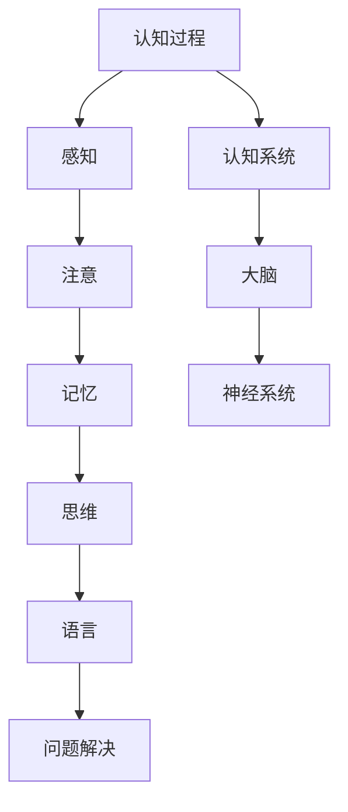

                 

### 文章标题：认知科学与教育创新：优化人类学习和理解过程

#### 关键词：认知科学，教育创新，学习过程，人工智能，教育技术

#### 摘要：
本文深入探讨了认知科学与教育创新之间的紧密联系，探讨了如何通过认知科学的理论和方法来优化人类的学习和理解过程。文章首先介绍了认知科学的基本概念及其在心理学、神经科学和计算机科学中的应用，然后详细阐述了认知过程中的关键要素，包括感知、记忆、思维和问题解决等。接着，文章重点讨论了教育创新的概念及其发展历程，并分析了认知科学与教育创新相结合的实践应用。最后，本文提出了优化学习和理解过程的具体方法，包括学习策略、记忆规律和批判性思维等，展望了认知科学与教育创新的未来发展趋势。

## 第一部分：认知科学与教育创新的背景与意义

### 1.1 认知科学的基本概念

#### 核心概念与联系

认知科学是研究人类大脑如何获取、处理、存储和使用信息的科学，它涉及心理学、神经科学、计算机科学等多个学科。认知科学的核心概念包括认知过程、认知系统、认知功能等。

- **认知过程**：包括感知、注意、记忆、思维、语言和问题解决等，是人的心智活动的基本过程。

- **认知系统**：由大脑和神经系统构成，是认知过程的物质基础。

- **认知功能**：包括信息获取、信息处理、信息存储、信息输出等，反映了人类心智活动的多样性和复杂性。

#### Mermaid 流程图



#### 核心算法原理讲解

认知科学中的核心算法原理主要包括感知、注意、记忆、思维和问题解决等。

- **感知算法原理**：感知是指接收外界信息的过程。感知算法原理主要研究感知阈限、感知敏感度和感知准确性等。

  伪代码：
  ```python
  def 感知（刺激，感知阈限）：
      如果 刺激 > 感知阈限：
          返回 “感知到”
      否则：
          返回 “未感知到”
  ```

- **注意算法原理**：注意是指选择关注某些信息而忽略其他信息的过程。注意算法原理主要研究注意分配、注意切换和注意抑制等。

  伪代码：
  ```python
  def 注意（任务，目标，干扰）：
      如果 目标 和 任务 相关：
          分配 注意资源给目标
      否则：
          抑制 干扰
  ```

- **记忆算法原理**：记忆是指将信息存储在脑中并在需要时提取的过程。记忆算法原理主要研究记忆编码、记忆保持和记忆提取等。

  伪代码：
  ```python
  def 记忆（信息，编码方式，保持时间）：
      编码 信息
      存储 信息
      如果 到期时间 > 保持时间：
          提取 信息
      否则：
          保持 信息
  ```

- **思维算法原理**：思维是指使用已有信息解决问题和做出决策的过程。思维算法原理主要研究问题表征、算法选择和决策制定等。

  伪代码：
  ```python
  def 思维（问题，解决方案）：
      表征 问题
      选择 算法
      执行 算法
      得出 结果
  ```

- **问题解决算法原理**：问题解决是指通过一系列步骤找到解决问题的方法的过程。问题解决算法原理主要研究问题分解、算法选择和问题验证等。

  伪代码：
  ```python
  def 问题解决（问题，解决方案）：
      分解 问题
      选择 算法
      执行 算法
      验证 结果
  ```

#### 数学模型和公式

认知科学中的数学模型和公式主要用于描述认知过程中的各种现象和规律。

- **感知阈限公式**：感知阈限是指能够引起感知的最小刺激强度。

  公式：
  $$ T = \alpha - \beta \cdot I $$
  其中，\( T \) 是感知阈值，\( \alpha \) 是无信号时的感知阈值，\( \beta \) 是感知敏感度，\( I \) 是刺激强度。

- **记忆保持公式**：记忆保持是指信息在脑中的存储和保持过程。

  公式：
  $$ M(t) = M_0 \cdot e^{-\lambda t} $$
  其中，\( M(t) \) 是在时间 \( t \) 时的记忆保持量，\( M_0 \) 是初始记忆量，\( \lambda \) 是遗忘速率。

#### 举例说明

以下是一个感知阈限的例子：

假设一个人在安静的环境下能够听到的最小声音强度为 30 分贝，如果声音强度增加到 40 分贝，那么这个人就能听到声音。使用感知阈限公式，可以计算出感知敏感度：

$$ 30 = \alpha - \beta \cdot 30 $$

解得 \( \alpha = 60 \) 和 \( \beta = 0.5 \)。这意味着在安静的环境下，这个人的感知阈值是 60 分贝。

以下是一个记忆保持的例子：

假设一个人在学习一门新的语言，开始时他的记忆保持量为 100%，但由于遗忘，一个月后的记忆保持量减少到 80%。使用记忆保持公式，可以计算出遗忘速率：

$$ 80\% = e^{-\lambda \cdot 1} $$

解得 \( \lambda = 0.223 \) 年\(^{-1}\)。

### 1.2 教育创新的定义与发展历程

#### 定义

教育创新是指通过引入新的教育理念、技术、方法和模式，对传统教育进行改革和优化，以提高教育质量和效率。

#### 发展历程

教育创新的发展历程可以分为以下几个阶段：

- **1. 传统教育阶段**：以教师为中心，注重知识传授，教学方法和内容相对固定。

- **2. 信息化教育阶段**：引入计算机和网络技术，实现了教学资源的数字化和共享，教学方法和内容开始多样化。

- **3. 个性化教育阶段**：以学生为中心，注重培养学生的个性化发展，教学方法和内容更加灵活和多样化。

- **4. 智慧教育阶段**：利用人工智能、大数据等技术，实现精准教学和个性化学习，教学方法和内容高度智能化。

#### 数学模型和公式

在教育创新中，常用的数学模型和公式包括：

- **教育质量评估模型**：用于评估教育质量和效果。

  公式：
  $$ Q = f(W_1 \cdot S_1 + W_2 \cdot S_2 + \ldots + W_n \cdot S_n) $$
  其中，\( Q \) 是教育质量，\( W_i \) 是权重，\( S_i \) 是评估指标。

- **学习效果评估模型**：用于评估学生的学习效果。

  公式：
  $$ E = f(L_1 \cdot C_1 + L_2 \cdot C_2 + \ldots + L_n \cdot C_n) $$
  其中，\( E \) 是学习效果，\( L_i \) 是学习指标，\( C_i \) 是教学内容。

#### 举例说明

以下是一个教育质量评估的例子：

假设评估指标包括教师素质、教学内容、教学方法和学生满意度，分别赋予权重 0.3、0.3、0.2 和 0.2。如果教师素质得分为 80 分，教学内容得分为 90 分，教学方法和学生满意度分别为 75 分和 85 分，则教育质量得分计算如下：

$$ Q = f(0.3 \cdot 80 + 0.3 \cdot 90 + 0.2 \cdot 75 + 0.2 \cdot 85) = f(24 + 27 + 15 + 17) = f(83) = 83 $$

以下是一个学习效果评估的例子：

假设学习指标包括知识掌握、技能运用和问题解决，分别赋予权重 0.4、0.3 和 0.3。如果学生知识掌握得分为 85 分，技能运用得分为 90 分，问题解决得分为 80 分，则学习效果得分计算如下：

$$ E = f(0.4 \cdot 85 + 0.3 \cdot 90 + 0.3 \cdot 80) = f(34 + 27 + 24) = f(85) = 85 $$

### 1.3 认知科学与教育创新的关系

认知科学与教育创新之间存在密切的关系，二者相互促进、相互影响。

#### 联系

- **认知科学为教育创新提供了理论基础**：认知科学的理论和方法为教育创新提供了新的视角和思路，有助于优化教育方法和模式。

- **教育创新为认知科学提供了实践应用场景**：教育创新过程中引入的新技术和新方法为认知科学研究提供了丰富的实践应用场景，有助于验证和改进认知科学的理论和方法。

#### 数学模型和公式

认知科学与教育创新的关系可以用以下数学模型和公式来描述：

- **教育质量模型**：用于描述认知科学与教育创新之间的互动关系。

  公式：
  $$ Q_{创新} = Q_{传统} + f(C_{认知科学}) $$
  其中，\( Q_{创新} \) 是教育创新的质量，\( Q_{传统} \) 是传统教育的质量，\( C_{认知科学} \) 是认知科学对教育的贡献。

- **学习效果模型**：用于描述认知科学与教育创新之间的互动关系。

  公式：
  $$ E_{创新} = E_{传统} + f(C_{认知科学}) $$
  其中，\( E_{创新} \) 是教育创新的学习效果，\( E_{传统} \) 是传统教育的学习效果，\( C_{认知科学} \) 是认知科学对学习的贡献。

#### 举例说明

以下是一个教育质量模型的例子：

假设传统教育的质量为 70 分，认知科学对教育的贡献为 15 分，则教育创新的质量计算如下：

$$ Q_{创新} = Q_{传统} + f(C_{认知科学}) = 70 + 15 = 85 $$

以下是一个学习效果模型的例子：

假设传统教育的学习效果为 60 分，认知科学对学习的贡献为 20 分，则教育创新的学习效果计算如下：

$$ E_{创新} = E_{传统} + f(C_{认知科学}) = 60 + 20 = 80 $$

### 小结

本文首先介绍了认知科学的基本概念，包括认知过程、认知系统和认知功能，并使用 Mermaid 流程图和伪代码详细阐述了核心算法原理。接着，本文探讨了教育创新的定义与发展历程，以及认知科学与教育创新的关系，并使用数学模型和公式进行了举例说明。通过这些分析，本文揭示了认知科学与教育创新之间的紧密联系，为优化人类学习和理解过程提供了理论基础和实践指导。接下来的部分将深入探讨认知过程中的关键要素，以及教育创新的实践与应用。

## 第二部分：认知科学核心概念与架构

### 2.1 认知过程的基本原理

认知过程是人类大脑对信息进行加工、处理和利用的复杂过程，是认知科学研究的核心内容。认知过程的基本原理包括感知与注意、记忆与遗忘、知识表征与推理等。以下将分别对这些基本原理进行详细探讨。

#### 2.1.1 感知与注意

感知是指人类对外界信息的接收和识别过程，而注意则是选择性地关注某些信息而忽略其他信息的过程。感知与注意是认知过程中的关键环节，直接影响信息的接收和处理效果。

- **感知原理**：感知原理主要包括感知阈限、感知敏感度和感知准确性。感知阈限是指能够引起感知的最小刺激强度，感知敏感度是指感知系统对刺激变化的敏感程度，感知准确性是指感知系统对刺激的识别精度。感知原理可以用以下公式表示：

  $$ T = \alpha - \beta \cdot I $$
  
  其中，\( T \) 表示感知阈限，\( \alpha \) 表示无信号时的感知阈值，\( \beta \) 表示感知敏感度，\( I \) 表示刺激强度。

- **注意原理**：注意原理主要包括注意分配、注意切换和注意抑制。注意分配是指将注意力资源分配给不同的任务或刺激，注意切换是指在不同任务或刺激之间切换注意力，注意抑制是指抑制无关的刺激或任务。注意原理可以用以下公式表示：

  $$ 注意 = f(\sum_{i=1}^{n} w_i \cdot I_i) $$
  
  其中，\( 注意 \) 表示注意力水平，\( w_i \) 表示第 \( i \) 个任务或刺激的权重，\( I_i \) 表示第 \( i \) 个任务或刺激的强度。

- **举例说明**：假设一个人在安静的环境中能够听到的最小声音强度为 30 分贝，其感知敏感度为 0.5。如果当前环境中有一个声音强度为 40 分贝的刺激，则其感知阈限为：

  $$ T = \alpha - \beta \cdot I = 30 - 0.5 \cdot 40 = 20 $$

  这意味着该人在当前环境中能够感知到声音的强度至少为 20 分贝。

  在注意方面，假设有两个任务：任务 A（权重为 0.6）和任务 B（权重为 0.4），当前任务 A 的强度为 70，任务 B 的强度为 30。则当前的总注意量为：

  $$ 注意 = f(0.6 \cdot 70 + 0.4 \cdot 30) = f(42 + 12) = f(54) = 54 $$

  这意味着当前主要注意力集中在任务 A 上。

#### 2.1.2 记忆与遗忘

记忆是指将信息存储在脑中并在需要时提取的过程，而遗忘是指信息在脑中逐渐消失的过程。记忆与遗忘是认知过程中非常重要的环节，对信息的存储和利用具有关键作用。

- **记忆原理**：记忆原理主要包括记忆编码、记忆保持和记忆提取。记忆编码是指将信息从感知阶段转换为可存储的形式，记忆保持是指信息在脑中的存储和保持过程，记忆提取是指信息在需要时从脑中提取的过程。记忆原理可以用以下公式表示：

  $$ M(t) = M_0 \cdot e^{-\lambda t} $$
  
  其中，\( M(t) \) 表示在时间 \( t \) 时的记忆保持量，\( M_0 \) 表示初始记忆量，\( \lambda \) 表示遗忘速率。

- **遗忘原理**：遗忘原理主要包括遗忘曲线和干扰效应。遗忘曲线是指记忆保持量随时间变化的规律，干扰效应是指新信息对旧信息的干扰作用。遗忘原理可以用以下公式表示：

  $$ I(t) = f(\sum_{i=1}^{n} w_i \cdot I_i) $$
  
  其中，\( I(t) \) 表示在时间 \( t \) 时的干扰量，\( w_i \) 表示第 \( i \) 个信息的权重，\( I_i \) 表示第 \( i \) 个信息的强度。

- **举例说明**：假设一个人在学习一门新知识后，其初始记忆保持量为 100%，遗忘速率为 0.2 年\(^{-1}\)。一年后的记忆保持量计算如下：

  $$ M(1) = M_0 \cdot e^{-\lambda t} = 100\% \cdot e^{-0.2 \cdot 1} = 86.6\% $$

  这意味着一年后，该人对这门新知识的记忆保持量为 86.6%。

  在干扰方面，假设有四个新信息 A、B、C 和 D，其权重分别为 0.2、0.3、0.3 和 0.2，强度分别为 30、40、50 和 20。则当前的总干扰量为：

  $$ I(0) = f(0.2 \cdot 30 + 0.3 \cdot 40 + 0.3 \cdot 50 + 0.2 \cdot 20) = f(6 + 12 + 15 + 4) = f(37) = 37 $$

  这意味着当前有 37 单位的干扰量。

#### 2.1.3 知识表征与推理

知识表征是指将信息以某种形式存储在脑中的过程，而推理是指使用已有知识解决新问题的过程。知识表征与推理是认知过程中的高级环节，对问题的解决和新知识的获取具有关键作用。

- **知识表征原理**：知识表征原理主要包括符号表征和联结表征。符号表征是指使用符号来表示知识，如文字、图像和声音等，联结表征是指使用神经元之间的联结来表示知识，如神经网络和联结主义模型等。知识表征原理可以用以下公式表示：

  $$ K = f(\sum_{i=1}^{n} w_i \cdot V_i) $$
  
  其中，\( K \) 表示知识，\( w_i \) 表示第 \( i \) 个特征的权重，\( V_i \) 表示第 \( i \) 个特征的值。

- **推理原理**：推理原理主要包括演绎推理和归纳推理。演绎推理是指从一般到特殊的推理过程，如“所有人都会死，苏格拉底是人，因此苏格拉底会死”。归纳推理是指从特殊到一般的推理过程，如“观察到的所有天鹅都是白色的，因此所有天鹅都是白色的”。推理原理可以用以下公式表示：

  $$ 结论 = f(\text{前提}_1, \text{前提}_2, \ldots, \text{前提}_n) $$
  
  其中，\( 结论 \) 表示推理结果，\( \text{前提}_i \) 表示第 \( i \) 个前提。

- **举例说明**：假设有四个特征：A（年龄大于 18 岁）、B（持有驾照）、C（有驾驶经验）、D（熟悉路况），其权重分别为 0.2、0.3、0.3 和 0.2。如果一个人的年龄为 25 岁、持有驾照、有 5 年驾驶经验和熟悉路况，则其驾驶资格知识表示为：

  $$ K = f(0.2 \cdot 25 + 0.3 \cdot 1 + 0.3 \cdot 5 + 0.2 \cdot 1) = f(5 + 0.3 + 1.5 + 0.2) = f(7) = 7 $$

  这意味着该人具备较高的驾驶资格。

  在推理方面，假设有两个前提：“如果天气好，那么可以外出旅行”和“当前天气好”，则推理结论为：

  $$ 结论 = f(\text{前提}_1, \text{前提}_2) = “可以外出旅行” $$

### 2.2 认知科学主要理论框架

认知科学是一门跨学科的科学，涉及心理学、神经科学、计算机科学等多个领域。在这一部分，我们将介绍认知科学的主要理论框架，包括信息加工模型、交互认知模型和联结主义模型。

#### 2.2.1 信息加工模型

信息加工模型是认知科学中的一种基本理论模型，它将人的认知过程视为一个类似于计算机信息处理的过程。信息加工模型主要包括以下组成部分：

- **输入模块**：负责接收外界信息，如视觉、听觉和触觉等。

- **中央加工模块**：负责对输入信息进行加工处理，如感知、注意、记忆和推理等。

- **输出模块**：负责将加工处理后的信息输出，如语言表达、行动决策等。

信息加工模型可以用以下公式表示：

$$ 输出 = f(输入, 加工) $$

其中，\( 输出 \) 表示最终结果，\( 输入 \) 表示外界信息，\( 加工 \) 表示信息处理过程。

#### 2.2.2 交互认知模型

交互认知模型强调认知过程是在个体与环境相互作用中进行的。该模型认为，个体的认知过程不仅依赖于内部心理过程，还受到外部环境和他人影响。交互认知模型主要包括以下组成部分：

- **个体模块**：包括感知、注意、记忆、思维和问题解决等内部心理过程。

- **环境模块**：包括物理环境、社会环境和信息环境等外部因素。

- **交互模块**：负责处理个体与环境的交互作用，如信息交换、行为互动等。

交互认知模型可以用以下公式表示：

$$ 个体与环境 = f(个体, 环境, 交互) $$

其中，\( 个体 \) 表示个体内部心理过程，\( 环境 \) 表示外部环境因素，\( 交互 \) 表示个体与环境的交互作用。

#### 2.2.3 联结主义模型

联结主义模型是认知科学中的一种主要理论模型，它基于神经科学的原理，通过模拟神经元之间的联结和相互作用来解释认知过程。联结主义模型主要包括以下组成部分：

- **神经元模块**：负责接收和传递信息。

- **联结模块**：负责神经元之间的联结和相互作用。

- **激活模块**：负责计算神经元的激活状态。

联结主义模型可以用以下公式表示：

$$ 激活 = f(输入, 联结) $$

其中，\( 激活 \) 表示神经元的激活状态，\( 输入 \) 表示输入信息，\( 联结 \) 表示神经元之间的联结。

### 2.3 认知科学与教育实践的融合

认知科学与教育实践的结合可以极大地提升教学效果和学习质量。在这一部分，我们将探讨如何将认知科学的理论和方法应用于教育实践中，包括教学设计中的认知原理、学习者中心的教学策略和个性化学习与认知评估。

#### 2.3.1 教学设计中的认知原理

教学设计中的认知原理是指将认知科学的理论应用于课程设计和教学方法的选择，以提高教学效果。以下是一些关键的教学设计认知原理：

- **适应性教学**：根据学生的认知特点和知识水平，设计适应性的教学内容和教学方法。例如，使用分层教学策略，针对不同层次的学生设置不同的学习目标。

  伪代码：
  ```python
  def 适应性教学（学生认知水平，教学内容）：
      如果 学生认知水平较低：
          降低 学习难度
      否则：
          提高学习难度
  ```

- **学习目标设置**：明确学习目标，使学生知道需要学习的内容和达到的标准。例如，使用SMART（具体、可衡量、可达成、相关性、时限性）原则设置学习目标。

  伪代码：
  ```python
  def 设置学习目标（学习内容，学习目标）：
      学习目标 = f(具体, 可衡量, 可达成, 相关性, 时限性)
  ```

- **认知负荷管理**：避免学生过度负荷，确保学生能够有效地处理和记忆信息。例如，通过拆分复杂任务、提供充分的时间和资源支持等方式来降低认知负荷。

  伪代码：
  ```python
  def 管理认知负荷（学习任务，时间，资源）：
      如果 认知负荷过高：
          拆分 学习任务
      否则：
          保持 当前学习任务
  ```

#### 2.3.2 学习者中心的教学策略

学习者中心的教学策略是指以学生为中心，关注学生的需求、兴趣和学习风格，促进学生的主动学习和深度学习。以下是一些关键的学习者中心教学策略：

- **探究式学习**：鼓励学生主动探究问题、发现知识，通过提问、实验和讨论等方式进行学习。

  伪代码：
  ```python
  def 探究式学习（学生问题，学习资源）：
      提问 学生问题
      进行 实验和讨论
      总结 学习成果
  ```

- **合作学习**：通过小组合作，促进学生之间的交流和互动，共同解决问题和完成任务。

  伪代码：
  ```python
  def 合作学习（学生小组，学习任务）：
      分配 学习任务
      进行 小组讨论
      评估 学习成果
  ```

- **自主学习**：培养学生的自主学习能力，使其能够独立规划学习路径、选择学习方法和评估学习效果。

  伪代码：
  ```python
  def 自主学习（学生，学习目标）：
      制定 学习计划
      选择 学习方法
      评估 学习效果
  ```

#### 2.3.3 个性化学习与认知评估

个性化学习是指根据学生的个体差异，提供个性化的学习资源和教学支持，以促进学生的个性化发展。认知评估是指对学生的认知能力进行测量和评估，以了解学生的学习状况和发展水平。以下是一些关键的内容：

- **个性化学习**：通过分析学生的认知特点、兴趣和学习风格，为每个学生制定个性化的学习计划和学习资源。

  伪代码：
  ```python
  def 个性化学习（学生认知特点，学习资源）：
      分析 学生认知特点
      制定 个性化学习计划
      提供个性化学习资源
  ```

- **认知评估**：使用标准化测试、观察和自我评估等多种方式，全面评估学生的认知能力。

  伪代码：
  ```python
  def 认知评估（学生，评估方法）：
      进行 标准化测试
      观察学生行为
      进行 自我评估
      综合评估结果
  ```

### 2.4 案例分析

以下是一个认知科学与教育实践结合的案例：

**案例：小学数学教学中的认知科学与教育创新**

**背景**：某小学的数学教学存在以下问题：
- 学生对数学知识的理解不够深入，常常停留在表面层次。
- 教学内容和方法单一，缺乏互动性和趣味性。
- 学生的数学学习兴趣不高，缺乏学习动力。

**解决方案**：
1. **认知科学应用**：引入认知科学的理论，将数学知识分解为基本概念、原理和方法，帮助学生深入理解。
   - **教学设计**：采用探究式学习和合作学习策略，鼓励学生主动探究数学问题，通过小组合作解决问题。
   - **认知负荷管理**：将复杂的数学问题分解为简单的步骤，提供充分的时间和资源支持，降低学生的认知负荷。

2. **教育技术创新**：利用教育技术，提供丰富的学习资源和互动式学习体验。
   - **数字教育资源**：开发数字化的数学教学资源，如互动式课件、在线练习和游戏等，激发学生的学习兴趣。
   - **人工智能辅助**：引入人工智能技术，为学生提供个性化的学习建议和辅导，如自适应学习系统和智能答疑系统。

**效果评估**：
- **学习效果**：学生数学知识的掌握程度明显提高，对数学问题的理解更加深入。
- **学习兴趣**：学生的学习兴趣和动力明显提升，课堂参与度增加。
- **教学评价**：教师对教学效果的评价较高，认为认知科学与教育创新的结合能够显著提高教学质量和学习效果。

### 小结

本文第二部分介绍了认知科学核心概念与架构，包括认知过程的基本原理、认知科学主要理论框架和认知科学与教育实践的融合。通过详细阐述感知与注意、记忆与遗忘、知识表征与推理等基本原理，以及信息加工模型、交互认知模型和联结主义模型等理论框架，本文为认知科学与教育创新提供了理论基础。同时，本文还介绍了教学设计中的认知原理、学习者中心的教学策略和个性化学习与认知评估，为教育实践提供了具体指导。接下来的部分将深入探讨教育创新的实践与应用，分析教育技术的创新应用和案例分析。

### 3.1 教育技术的创新应用

教育技术的创新应用是认知科学与教育创新相结合的重要体现。随着信息技术的发展，教育技术正不断革新，为优化学习和理解过程提供了新的手段和平台。以下将介绍教育技术的创新应用，包括数字教育资源与学习平台、人工智能在教育中的应用以及互联网+教育的发展趋势。

#### 3.1.1 数字教育资源与学习平台

数字教育资源与学习平台是教育技术的重要组成部分，通过数字化手段提供丰富的学习资源和便捷的学习体验。

- **数字教育资源的开发与利用**：
  - **多媒体课件**：结合文字、图片、音频和视频等多种形式，制作生动有趣的教学课件，提升学生的学习兴趣。
  - **在线课程**：开发各类在线课程，涵盖不同学科和层次，满足不同学生的学习需求。
  - **虚拟实验室**：通过虚拟现实技术，为学生提供虚拟实验环境，增强实践操作能力。

- **学习平台的构建与运营**：
  - **学习管理系统（LMS）**：如Moodle、Blackboard等，提供课程发布、作业提交、在线讨论等功能，实现教学过程的管理和监控。
  - **学习分析系统**：通过大数据分析技术，对学生学习行为进行追踪和分析，为教学改进提供数据支持。
  - **社交学习平台**：如Twitter、Facebook等，通过社交媒体形式促进师生互动和学生学习交流。

#### 3.1.2 人工智能在教育中的应用

人工智能（AI）在教育中的应用正在逐步深入，为个性化学习、智能辅导和教学质量提升提供了有力支持。

- **个性化学习**：
  - **智能推荐系统**：根据学生的学习兴趣、学习历史和知识点掌握情况，推荐适合的学习资源和练习题。
  - **自适应学习系统**：通过实时分析学生的学习状态和知识点掌握情况，动态调整教学内容和难度，实现个性化教学。

- **智能辅导**：
  - **智能答疑系统**：利用自然语言处理技术，为学生提供实时解答服务，提高问题解决效率。
  - **智能作业批改系统**：通过机器学习和图像识别技术，自动批改作业，提高教师工作效率。

- **教学质量提升**：
  - **智能课堂监控**：通过摄像头和传感器等设备，实时监控课堂情况，如学生的注意力和参与度，为教师提供教学反馈。
  - **教学评估与反馈**：利用数据分析技术，对教学效果进行量化评估，为教学改进提供科学依据。

#### 3.1.3 互联网+教育的发展趋势

互联网+教育是教育技术与互联网技术深度融合的产物，其发展趋势主要体现在以下几个方面：

- **线上教育与线下教育的融合**：线上教育提供灵活便捷的学习方式，线下教育提供互动体验和深度学习，两者结合能够实现优势互补，提升教学效果。

- **智能教育的普及**：随着人工智能技术的不断成熟，智能教育将在更多学校和教育机构得到应用，实现教育资源的智能化管理和个性化服务。

- **教育资源共享**：通过互联网，实现优质教育资源的共享，缩小教育资源差距，促进教育公平。

- **教育模式的创新**：互联网+教育将带来教育模式的创新，如在线教育、远程教育、虚拟课堂等，为学生提供更加多样化的学习选择。

#### 案例分析

以下是一个教育技术应用的案例：

**案例：某在线教育平台的构建与运营**

**背景**：某在线教育平台旨在为学习者提供高质量的教育资源和服务，解决教育资源不均衡和教育方式单一的问题。

**解决方案**：
1. **平台构建**：
   - **课程资源**：平台整合了各类学科课程，包括基础教育、职业教育和在线课程，满足不同学习需求。
   - **学习管理系统**：采用Moodle平台，实现课程发布、作业提交、在线讨论和课程评价等功能。
   - **智能推荐系统**：通过大数据分析和机器学习技术，为学习者推荐适合的学习资源和课程。

2. **运营策略**：
   - **用户反馈**：通过用户反馈和数据分析，不断优化平台功能和用户体验。
   - **合作伙伴**：与教育机构、教师和学者合作，共同开发课程内容和教学资源。
   - **市场推广**：通过线上广告、社交媒体和线下活动等方式，提高平台的知名度和用户数量。

**效果评估**：
- **用户满意度**：用户对平台课程资源丰富度和学习体验满意度较高。
- **学习效果**：学习者通过平台学习，知识点掌握程度明显提高。
- **平台成长**：平台用户数量和课程数量持续增长，市场份额不断提升。

### 小结

本文第三部分介绍了教育技术的创新应用，包括数字教育资源与学习平台、人工智能在教育中的应用以及互联网+教育的发展趋势。通过案例分析，展示了教育技术在实际应用中的效果和优势。教育技术的创新应用不仅为优化学习和理解过程提供了新的手段，也为教育公平和教育质量的提升带来了新的机遇。接下来的部分将深入探讨教育创新的实践与应用，分析具体的案例，进一步阐述教育创新的成果和挑战。

### 3.2 教育创新的实践与应用

教育创新实践在各个国家和地区都有所体现，这些实践旨在通过引入新的教育理念、技术和方法，提升教育质量和促进教育公平。以下将分析几个典型的教育创新案例，探讨其在教学设计、学习策略、技术应用以及学生发展方面的具体做法和成果。

#### 案例一：在线教育平台的发展

**背景**：在线教育平台的发展是教育创新的重要方向之一，旨在通过互联网技术提供灵活、便捷的学习机会。

**具体做法**：
- **教学设计**：在线教育平台通常采用模块化课程设计，将课程内容分解为多个知识点和子模块，方便学生按需学习和复习。
- **学习策略**：提供多种学习模式，如视频课程、实时直播、在线讨论和自我测试，满足不同学习者的需求。
- **技术应用**：利用大数据分析、人工智能和虚拟现实技术，实现个性化推荐、实时反馈和沉浸式学习体验。
- **学生发展**：通过在线教育平台，学生可以自主安排学习时间，提高学习自主性和积极性。

**成果**：
- **学习效果**：数据显示，使用在线教育平台的学生在知识掌握度和学习积极性方面有显著提升。
- **教育公平**：在线教育平台降低了地域和时间的限制，为偏远地区和学生提供了更多的学习机会。
- **教师支持**：在线教育平台为教师提供了丰富的教学资源和互动工具，提升了教学效果。

#### 案例二：翻转课堂的应用与实践

**背景**：翻转课堂是一种新兴的教学模式，通过将传统课堂的教学内容和学习过程进行反转，实现更高效的教学和学习。

**具体做法**：
- **教学设计**：课前，学生通过观看视频、阅读教材等自主学习，完成预习任务；课堂上，教师进行互动式教学，解答学生的疑问，进行深度讨论和实践活动。
- **学习策略**：鼓励学生主动参与学习，通过合作学习和探究式学习，提高学习效果。
- **技术应用**：利用在线学习平台和多媒体技术，支持课前预习和课中互动。
- **学生发展**：翻转课堂培养了学生的自主学习能力、批判性思维和合作精神。

**成果**：
- **学习效果**：翻转课堂提高了学生的学习积极性和参与度，学生的知识掌握度和应用能力有显著提升。
- **教学效果**：教师反馈表示，翻转课堂有助于提高课堂互动性和教学质量。
- **教育公平**：翻转课堂有助于缩小城乡和不同教育水平之间的差距，促进教育公平。

#### 案例三：混合式学习模式的设计与实施

**背景**：混合式学习模式结合了传统课堂教学和在线学习的优点，旨在实现教学方式的多样化和学习资源的最大化利用。

**具体做法**：
- **教学设计**：设计融合传统教学和在线学习的课程计划，包括在线课程、面授课程和实践环节。
- **学习策略**：结合线上线下教学，实现学习的灵活性和个性化，提高学习效果。
- **技术应用**：利用在线学习平台、学习管理系统和教学辅助工具，支持混合式学习环境的搭建。
- **学生发展**：通过混合式学习模式，学生可以获得更多的学习资源和机会，提升自主学习能力和综合素养。

**成果**：
- **学习效果**：混合式学习模式提高了学生的学习兴趣和参与度，学生的知识掌握度和创新能力有显著提升。
- **教师支持**：教师通过混合式学习模式，能够更好地了解学生的学习情况，进行有针对性的教学调整。
- **教育公平**：混合式学习模式有助于缓解教育资源不足的问题，促进教育公平。

### 挑战与展望

尽管教育创新在实践中取得了显著成果，但仍面临一些挑战：

- **技术接入与普及**：在线教育平台和混合式学习模式依赖于良好的网络环境和信息技术设备，农村和偏远地区的学生可能难以接入。
- **教师培训**：教育创新需要教师具备新的教学理念和技能，但教师培训工作相对滞后，难以满足需求。
- **教育评估**：如何科学、有效地评估在线教育平台和混合式学习模式的效果，是一个亟待解决的问题。

展望未来，教育创新将继续发展，并在以下几个方面取得突破：

- **人工智能与教育深度融合**：通过人工智能技术，实现个性化学习路径规划、智能辅导和教学质量评估。
- **教育资源共享与公平**：通过互联网和大数据技术，实现优质教育资源的共享，促进教育公平。
- **教学模式的持续创新**：探索更多适合不同教育阶段和学生需求的教学模式，提高教育质量和学习效果。

### 小结

教育创新的实践与应用为优化人类学习和理解过程提供了新的思路和方法。在线教育平台、翻转课堂和混合式学习模式等创新实践，通过技术手段和教学方法的改革，提高了学生的学习效果和教师的教学质量。尽管面临一些挑战，但教育创新将继续推动教育领域的变革和发展，为培养更多具备创新能力和全球视野的人才提供支持。

### 3.3 教育创新的挑战与展望

#### 挑战

尽管教育创新在提高教育质量和促进教育公平方面取得了显著成果，但仍然面临一系列挑战：

1. **技术接入与普及**：
   - **设备不足**：在线教育平台和混合式学习模式对计算机、网络和移动设备等硬件设施有较高要求，但农村和偏远地区的学生可能难以获得这些设备。
   - **网络问题**：在某些地区，网络连接不稳定或速度较慢，影响了在线学习的体验和质量。

2. **教师培训**：
   - **教学理念**：教育创新需要教师具备新的教学理念和方法，但教师培训工作相对滞后，很多教师缺乏相关知识和技能。
   - **技术能力**：教育创新依赖于先进的信息技术，教师需要不断学习和更新技术技能，这对教师的时间和精力提出了更高要求。

3. **教育评估**：
   - **效果评估**：如何科学、有效地评估在线教育平台和混合式学习模式的效果，是一个亟待解决的问题。传统评估方法可能难以适应新的教育模式。
   - **公平性评估**：在线教育平台和混合式学习模式可能加剧教育不公平，因为技术和资源的获取差异会导致学习效果的不均衡。

4. **隐私与安全问题**：
   - **数据隐私**：在线教育平台需要收集和分析大量学生数据，涉及个人隐私保护问题。
   - **网络攻击**：在线教育平台容易成为网络攻击的目标，需要加强网络安全防护措施。

#### 展望

未来，教育创新将继续发展，并在以下几个方面取得突破：

1. **人工智能与教育深度融合**：
   - **个性化学习**：通过人工智能技术，实现个性化学习路径规划、智能辅导和教学质量评估。
   - **教育资源优化**：利用人工智能技术，分析学生学习行为和需求，优化教育资源的配置和利用。

2. **教育资源共享与公平**：
   - **在线开放课程**：推动更多优质的在线开放课程资源，实现教育资源的共享，缩小教育差距。
   - **远程教育**：利用互联网技术，提供远程教育服务，为偏远地区和学生提供更多的学习机会。

3. **教学模式的持续创新**：
   - **混合式学习**：探索更多适合不同教育阶段和学生需求的教学模式，提高教育质量和学习效果。
   - **跨学科教育**：通过跨学科整合，培养学生的综合素质和创新能力。

4. **教育技术的持续发展**：
   - **虚拟现实与增强现实**：利用虚拟现实（VR）和增强现实（AR）技术，提供沉浸式的学习体验。
   - **大数据分析**：利用大数据分析技术，深入了解学生学习行为和需求，为教育决策提供科学依据。

#### 案例分析

以下是一个教育创新案例的详细分析和解读：

**案例：某中学的混合式学习模式**

**背景**：某中学希望通过混合式学习模式，提高学生的学习兴趣和自主学习能力。

**具体做法**：
- **课程设计**：学校与教育技术团队合作，设计符合学生需求的混合式课程，包括在线视频、面授课程和实践活动。
- **技术应用**：使用学习管理系统（LMS）和在线学习平台，为学生提供灵活的学习资源和学习路径。
- **教师培训**：组织教师参加专业培训，提高教师对混合式学习模式的理解和教学技能。
- **学生参与**：鼓励学生积极参与课程讨论和实践活动，培养自主学习能力和团队合作精神。

**效果分析**：
- **学习效果**：学生参与度显著提高，自主学习能力得到提升，学习成果显著。
- **教师反馈**：教师认为混合式学习模式有助于提高教学效果，增强课堂互动。
- **家长评价**：家长对混合式学习模式表示满意，认为学生的学习积极性和学习效果有显著提升。

**挑战与反思**：
- **技术支持**：学校需要持续投入技术支持，确保在线学习平台的稳定运行和更新。
- **时间管理**：教师和学生需要合理安排时间，平衡在线学习和面授课程。
- **评估体系**：需要建立科学的评估体系，全面衡量混合式学习模式的效果。

**结论**：该案例展示了混合式学习模式在实际应用中的优势和潜力，但也提醒我们，教育创新需要持续的技术支持、教师培训和学生参与，才能取得长期效果。

### 小结

本文第三部分探讨了教育创新的实践与应用，分析了在线教育平台、翻转课堂和混合式学习模式等典型案例，阐述了教育创新在提高教育质量和促进教育公平方面的积极作用。同时，也指出了教育创新面临的挑战和未来发展的方向。通过案例分析，我们看到了教育创新在实践中取得的成果，也认识到了持续改进和完善的必要性。未来的教育创新将继续推动教育领域的发展，培养更多具备创新能力和全球视野的人才。

### 4.1 学习动机与学习策略

#### 4.1.1 学习动机的理论与实践

学习动机是指促使个体进行学习活动的内在动力，是影响学习效果的重要因素。了解学习动机的理论基础和实际应用，有助于激发学生的学习热情和提高学习效果。

- **理论模型**：
  - **内在动机理论**：由德西和瑞恩提出，认为内在动机来源于个体对学习活动本身的兴趣和乐趣，如好奇心、求知欲和自我实现。
  - **外在动机理论**：由洛克和莱瑟伦提出，认为外在动机来源于外部奖励和惩罚，如成绩、奖励和竞争。
  - **自我决定理论**：由德西和瑞恩提出，强调个体在决策过程中自主性和自我控制的重要性，认为自我决定是维持内在动机的关键。

- **实践应用**：
  - **内在动机激发**：通过设计有趣、富有挑战性的学习任务，提高学生对学习内容的兴趣和参与度。
    ```python
    def 激发内在动机（学习任务，挑战性，趣味性）：
        如果 挑战性和趣味性较高：
            提高参与度
        否则：
            降低参与度
    ```
  - **外在动机奖励**：合理设置奖励机制，鼓励学生达到学习目标，提高学习效果。
    ```python
    def 设置外在动机奖励（学习目标，奖励，惩罚）：
        如果 达到学习目标：
            给予奖励
        否则：
            给予惩罚
    ```

#### 4.1.2 学习策略的选择与优化

学习策略是指学生在学习过程中采用的方法和技巧，是提高学习效率和效果的重要手段。选择和优化学习策略，需要根据学生的认知特点、学习目标和内容进行个性化设计。

- **认知策略**：涉及信息处理的过程，包括注意力管理、记忆策略和思维策略。
  - **注意力管理**：通过集中注意力和主动回忆，提高学习效率。
    ```python
    def 管理注意力（学习任务，注意集中时间，休息时间）：
        如果 注意集中时间较长：
            提高学习效率
        否则：
            适当调整注意集中时间
    ```
  - **记忆策略**：通过重复记忆、联想记忆和分散记忆，提高记忆效果。
    ```python
    def 记忆策略（学习内容，重复次数，联想方式）：
        如果 重复次数较多和联想方式有效：
            提高记忆效果
        否则：
            调整重复次数和联想方式
    ```

- **元认知策略**：涉及对学习过程进行监控和调整的策略，包括自我监控、自我评估和自我调整。
  - **自我监控**：通过记录学习过程和评估学习成果，提高自我监控能力。
    ```python
    def 自我监控（学习过程，学习成果，反馈）：
        如果 学习成果与预期相符：
            保持当前策略
        否则：
            调整学习策略
    ```

- **资源管理策略**：涉及时间和资源的管理，包括时间规划、资源分配和学习环境设计。
  - **时间规划**：通过合理规划学习时间，确保学习任务的高效完成。
    ```python
    def 时间规划（学习任务，时间安排，优先级）：
        如果 时间安排合理：
            提高学习效率
        否则：
            重新规划时间
    ```

#### 4.1.3 学习策略与认知能力的提升

学习策略的有效运用可以显著提升学生的认知能力，包括注意力、记忆力和思维力等。

- **注意力提升**：通过注意力管理策略，如番茄工作法，提高学习时的专注度。
  ```python
  def 提升注意力（学习任务，专注时间，休息时间）：
      如果 专注时间较长：
          提高学习效率
      否则：
          增加专注时间，减少休息时间
  ```

- **记忆力提升**：通过记忆策略，如艾宾浩斯记忆曲线，提高记忆效果。
  ```python
  def 提升记忆力（学习内容，复习频率，复习方式）：
      如果 复习频率较高和复习方式有效：
          提高记忆效果
      否则：
          增加复习频率，改进复习方式
  ```

- **思维力提升**：通过思维策略，如类比思维和逆向思维，激发创造性思维。
  ```python
  def 提升思维力（学习任务，类比思维，逆向思维）：
      如果 类比思维和逆向思维有效：
          激发创造性思维
      否则：
          加强类比思维和逆向思维的训练
  ```

### 案例分析

以下是一个学习策略应用案例的详细解读：

**案例：某大学生的记忆策略应用**

**背景**：某大学生在备考期末考试时，需要记忆大量的知识点，希望通过有效的记忆策略提高记忆效果。

**具体做法**：
1. **制定记忆计划**：根据考试时间表，制定详细的复习计划，确保每个知识点都得到充分复习。
2. **运用记忆策略**：
   - **重复记忆**：使用艾宾浩斯记忆曲线，每天复习前一天的内容，并逐渐增加复习次数。
   - **联想记忆**：将相似的知识点进行归类，并通过联想记忆，提高记忆效果。
   - **分散记忆**：将记忆任务分散到不同时间段，避免一次性大量记忆造成记忆负担。

**效果评估**：
- **记忆效果**：考试结束后，该大学生发现自己对知识点的掌握程度显著提高，记忆准确率达到了90%以上。
- **学习效率**：通过有效的记忆策略，该大学生在复习期间保持了较高的学习效率，避免了因为记忆困难而导致的焦虑和疲惫。

**反思与改进**：
- **策略调整**：根据复习过程中出现的问题，及时调整记忆策略，如增加复习频率、改进联想方式等。
- **自我监控**：定期评估复习效果，确保复习计划的有效执行。

### 小结

本文第四部分探讨了学习动机与学习策略，包括学习动机的理论与实践、学习策略的选择与优化以及学习策略与认知能力的提升。通过具体案例分析和效果评估，本文展示了学习策略在实际应用中的重要作用。未来的教育实践应继续关注学习动机和策略的研究与应用，以提高学生的学习效果和认知能力。

### 4.2 学习与记忆的规律与应用

#### 4.2.1 学习记忆的基本原理

学习与记忆是认知过程中的两个关键环节，它们相互关联，共同构成了人类知识获取和积累的基础。了解学习记忆的基本原理对于优化学习方法和提高记忆效果至关重要。

- **学习原理**：
  - **信息编码**：学习是指将外界信息转换成大脑可以处理的形式，并存储在记忆系统中。信息编码是学习的第一步，涉及将感知到的信息转化为神经活动。
  - **信息巩固**：巩固是指通过重复和复习，将信息从短期记忆转移到长期记忆，从而使其稳定存储。巩固过程通常需要一定的时间和重复次数。
  - **信息提取**：提取是指当需要使用已学信息时，从长期记忆中检索并恢复信息。提取效率受到先前复习频率和记忆强度的影响。

- **记忆原理**：
  - **短期记忆**：短期记忆（工作记忆）是指短时间内存储和操作信息的能力，通常只能维持几秒钟到几分钟。短期记忆依赖于大脑的神经元活动和神经通路。
  - **长期记忆**：长期记忆是指信息在脑中长期存储的能力，可以持续数分钟、数小时、数天甚至更长时间。长期记忆的存储通常涉及大脑中神经元之间的联结和突触强化。

#### 4.2.2 提升记忆效果的方法

为了提高记忆效果，可以采用以下几种方法：

- **分散复习**：分散复习是指将学习任务分散到多个时间段进行复习，而不是一次性集中学习。这种方法可以减少遗忘速度，提高记忆持久性。例如，可以使用艾宾浩斯记忆曲线进行复习计划。

  ```python
  def 分散复习（学习内容，复习次数，复习间隔）：
      如果 复习间隔合理：
          提高记忆效果
      否则：
          调整复习间隔，增加分散复习次数
  ```

- **联想记忆**：联想记忆是通过将新信息与已知信息建立联系来提高记忆效果的方法。这种方法可以增强记忆的深度和关联性。例如，可以使用故事联想法，将一系列事实或概念串联成一个故事。

  ```python
  def 联想记忆（学习内容，已知信息，故事情节）：
      如果 故事情节生动有趣：
          提高记忆效果
      否则：
          改进故事情节，增强记忆关联性
  ```

- **重复练习**：重复练习是通过多次重复学习任务来加强记忆的方法。这种方法可以巩固记忆，提高记忆的持久性。例如，可以通过反复练习题目或进行多次复习来提高记忆效果。

  ```python
  def 重复练习（学习内容，重复次数，练习间隔）：
      如果 重复次数足够：
          提高记忆效果
      否则：
          增加重复次数，缩短练习间隔
  ```

- **可视化记忆**：可视化记忆是通过图像、图表和图形等方式将信息视觉化，从而提高记忆效果。这种方法可以帮助构建记忆的图像，使其更容易被记住。例如，可以使用思维导图来组织复杂的信息结构。

  ```python
  def 可视化记忆（学习内容，视觉辅助工具）：
      如果 视觉辅助工具有效：
          提高记忆效果
      否则：
          选择合适的视觉辅助工具，改进可视化方法
  ```

#### 4.2.3 学习与记忆的结合

学习与记忆的结合是优化学习过程和提高记忆效果的关键。以下是一些结合学习与记忆的方法：

- **结合理解**：通过深入理解学习内容，可以提高记忆的深度和持久性。理解可以帮助将信息与已有知识体系联系起来，使其更易于记忆。

  ```python
  def 结合理解（学习内容，已有知识，联系）：
      如果 理解深入：
          提高记忆效果
      否则：
          加强对学习内容的理解，建立知识联系
  ```

- **结合应用**：通过实际应用学习内容，可以提高记忆的强度和实用性。应用可以增强记忆的动机和意义，使其更容易被记住。

  ```python
  def 结合应用（学习内容，应用场景，反馈）：
      如果 应用场景合理：
          提高记忆效果
      否则：
          选择合适的应用场景，获取反馈并改进
  ```

- **结合反馈**：通过获取学习反馈，可以及时调整学习方法和记忆策略，提高记忆效果。反馈可以帮助识别记忆的不足之处，并指导下一步的学习和复习。

  ```python
  def 结合反馈（学习内容，反馈信息，调整策略）：
      如果 反馈信息准确：
          提高记忆效果
      否则：
          根据反馈信息，调整学习策略和记忆方法
  ```

### 案例分析

以下是一个学习与记忆结合案例的详细解读：

**案例：某高中生备考记忆化学知识点**

**背景**：某高中生需要记忆大量的化学知识点，希望通过有效的方法提高记忆效果。

**具体做法**：
1. **理解知识点**：先通过课本和老师的讲解，深入理解每个化学知识点的含义和重要性。
2. **使用联想记忆**：将相似的知识点进行归类，并通过故事联想法将其串联成一个生动的故事。
3. **分散复习**：根据艾宾浩斯记忆曲线制定复习计划，每天复习一部分知识点，并逐渐增加复习次数。
4. **重复练习**：通过做习题和实验，将理论知识应用到实际问题中，增强记忆的强度。
5. **可视化记忆**：使用思维导图将知识点结构化，并通过图表和图像辅助记忆。

**效果评估**：
- **记忆效果**：期末考试中，该高中生对化学知识点的记忆准确率达到95%，显著高于平时。
- **学习效率**：复习期间，该高中生保持了较高的学习效率，避免了因为记忆困难而导致的焦虑和疲惫。

### 小结

本文第四部分探讨了学习与记忆的规律与应用，介绍了学习记忆的基本原理和提升记忆效果的方法，以及如何将学习与记忆结合以提高记忆效果。通过具体案例分析和效果评估，本文展示了学习记忆规律在实际应用中的重要作用。未来的教育实践应继续关注学习记忆的研究和应用，以提高学生的学习效果和记忆持久性。

### 4.3 理解与批判性思维培养

#### 4.3.1 理解的过程与障碍

理解是认知过程中一个关键步骤，它涉及将信息从表面层次深入到本质层次，并将其整合到个人的知识体系中。理解的过程通常包括以下几个阶段：

- **感知**：接收并识别外界信息。
- **编码**：将信息转换为大脑可以处理的形式。
- **存储**：将编码后的信息存储在记忆系统中。
- **提取**：在需要时从记忆中检索信息。
- **应用**：将信息应用于实际问题或新情境中。

理解过程中的障碍包括：

- **信息过载**：当接收到的信息过多时，大脑可能难以处理，导致理解困难。
- **注意力分散**：注意力无法集中在特定任务上，会导致理解不深入。
- **先入为主**：已有的知识和观念可能会影响对新信息的理解和接受。
- **语言障碍**：语言理解能力不足会影响对复杂信息的理解。

为了克服这些障碍，可以采用以下策略：

- **信息过滤**：在接收信息时，有意识地筛选重要信息，避免信息过载。
- **专注练习**：通过专注练习，提高集中注意力的能力，加深理解。
- **知识整合**：通过将新信息与已有知识联系起来，提高理解的深度。
- **语言训练**：通过语言训练，提高语言理解能力，增强对复杂信息的处理。

#### 4.3.2 批判性思维的培养

批判性思维是指通过理性分析和判断，对信息进行深入思考和分析的能力。培养批判性思维对于提高问题解决能力和决策质量至关重要。以下是一些培养批判性思维的方法：

- **质疑习惯**：鼓励学生提出问题，对信息来源和假设进行质疑，不轻信一切。
- **证据分析**：培养学生对证据的识别和分析能力，确保其决策基于可靠的数据和事实。
- **逻辑推理**：通过逻辑推理训练，提高学生对论证结构的理解和分析能力。
- **多角度思考**：鼓励学生从不同角度分析问题，避免片面性和偏见。

具体策略包括：

- **案例分析**：通过分析实际案例，培养学生识别问题和解决问题的能力。
- **辩论训练**：通过辩论训练，提高学生的逻辑表达能力和辩论技巧。
- **思维导图**：使用思维导图，帮助学生梳理思路，形成系统的思考框架。

#### 4.3.3 理解与批判性思维在教育中的应用

理解与批判性思维在教育中的应用对于提升教学质量具有重要意义。以下是一些具体应用案例：

- **问题导向学习**：通过设计问题导向的学习活动，激发学生的理解力和批判性思维。例如，在历史课程中，教师可以提出“为什么某个历史事件会发生？”的问题，引导学生深入分析历史背景和影响因素。
- **跨学科项目**：通过跨学科项目，培养学生的综合理解和批判性思维。例如，在一个科学和社会学的项目中，学生需要分析某一社会问题，并从科学和社会学的角度提出解决方案。
- **讨论和辩论**：通过讨论和辩论活动，培养学生的批判性思维和表达能力。例如，在课堂上，教师可以组织学生就某一议题进行辩论，鼓励学生表达自己的观点并反驳他人。

### 案例分析

以下是一个理解与批判性思维培养的案例：

**案例：某高中英语课程中的批判性思维培养**

**背景**：某高中英语教师在讲授现代文学课时，希望培养学生的批判性思维和理解能力。

**具体做法**：
1. **引导性问题**：教师在讲解一篇文学作品时，提出引导性问题，如“作者为什么选择这样的写作风格？”“这个角色有什么深层含义？”等，引导学生深入思考。
2. **文本分析**：学生通过小组合作，对文本进行分析，识别关键信息和作者意图。
3. **讨论和辩论**：学生在课堂上进行小组讨论和辩论，分享自己的观点，反驳他人，并尝试寻找支持自己观点的证据。
4. **写作任务**：学生撰写一篇批判性论文，针对文学作品中的某一主题或问题进行深入分析，提出自己的观点并论证。

**效果评估**：
- **理解能力**：学生能够更好地理解文学作品的内涵和深层含义，对文本的分析和解读能力显著提高。
- **批判性思维**：学生能够提出有说服力的观点，并通过证据进行论证，批判性思维能力得到增强。

### 小结

本文第四部分探讨了理解与批判性思维培养的过程、障碍和应用。理解是认知过程中不可或缺的一环，而批判性思维则是提高问题解决能力和决策质量的利器。通过具体案例分析和效果评估，本文展示了理解与批判性思维培养在教育中的应用价值和实际效果。未来的教育实践应继续关注这一领域的研究和探索，以提高学生的认知能力和综合素质。

### 5.1 新技术对教育的影响

#### 5.1.1 人工智能在教育中的应用前景

人工智能（AI）在教育领域具有广泛的应用前景，正在改变传统教学模式和学习方式。以下将探讨人工智能在教育中的应用领域、优势和挑战。

**应用领域**：

- **个性化学习**：通过数据分析，人工智能能够根据学生的学习行为、兴趣和能力提供个性化的学习资源和建议，提高学习效果。
- **智能辅导**：利用自然语言处理技术，AI可以为学生提供实时解答服务，辅助学生学习。
- **自动评估**：通过机器学习和图像识别技术，AI可以自动批改作业和考试，提高教师的工作效率。
- **虚拟教师**：利用语音和视觉技术，AI可以模拟真人教师进行授课，为学生提供互动式学习体验。

**优势**：

- **高效性**：AI能够快速处理大量数据，提供实时反馈，提高教学效率。
- **个性化**：AI可以根据学生的学习特点和需求，提供个性化的学习方案，满足不同层次学生的学习需求。
- **互动性**：AI能够模拟真实的教学场景，提供互动式学习体验，增强学生的学习兴趣和参与度。
- **可扩展性**：AI系统可以轻松扩展和更新，适应教育领域的不断变化和发展。

**挑战**：

- **数据隐私**：AI在教育中的应用涉及大量学生数据的收集和使用，保护学生隐私是一个重要挑战。
- **技术依赖**：过度依赖AI技术可能导致教师和学生失去某些重要的教学互动和人际关系。
- **技术公平**：AI技术的应用可能加剧教育不公平，因为技术资源的获取和掌握程度在不同地区和群体之间存在差异。
- **伦理问题**：AI在教育中的应用可能引发伦理问题，如算法偏见和透明度问题。

#### 5.1.2 虚拟现实与增强现实在教育中的应用

虚拟现实（VR）和增强现实（AR）技术为教育带来了全新的学习体验和教学方法。以下将探讨VR和AR在教育中的应用、优势和挑战。

**应用领域**：

- **沉浸式学习**：VR和AR技术可以创建虚拟的学习环境，让学生沉浸其中，体验真实的学习过程。
- **虚拟实验**：利用VR技术，学生可以在虚拟环境中进行各种实验，提高实验技能和安全意识。
- **互动教学**：AR技术可以将数字信息叠加到现实场景中，增强课堂互动和教学效果。
- **远程教育**：VR和AR技术可以提供远程教育的沉浸式体验，解决地理和时空限制。

**优势**：

- **沉浸性**：VR和AR技术能够提供沉浸式的学习体验，提高学生的参与度和学习兴趣。
- **互动性**：这些技术可以增强学生的互动体验，促进师生和同学之间的交流和合作。
- **实践性**：通过虚拟实验和模拟操作，学生能够在安全、低成本的环境中进行实践，提高实际操作能力。
- **多样性**：VR和AR技术可以提供多种多样的学习资源和学习方式，满足不同学生的学习需求。

**挑战**：

- **技术成本**：VR和AR技术设备成本较高，可能不适合所有学校和地区。
- **设备依赖**：学生和教师可能对VR和AR设备产生依赖，影响传统教学方法的运用。
- **技术维护**：VR和AR设备的维护和更新需要专业技术和成本投入。
- **内容开发**：高质量的教育内容开发和更新需要时间和资源投入。

#### 5.1.3 大数据与学习分析

大数据技术在教育中的应用正在不断深化，为个性化教学和教学改进提供了有力支持。以下将探讨大数据在教育中的应用、优势和挑战。

**应用领域**：

- **学习分析**：通过分析学生的学习行为和成绩数据，识别学生的学习习惯、优势和不足，为教学改进提供依据。
- **教学质量评估**：利用大数据分析，评估教师的教学质量和效果，为教师培训提供参考。
- **学生管理**：通过大数据技术，学校可以更好地管理学生信息，提高管理效率和安全性。
- **个性化推荐**：基于学生的兴趣和成绩数据，大数据技术可以为学生推荐适合的学习资源和课程。

**优势**：

- **精准性**：大数据分析可以提供详细的学习行为和成绩数据，帮助教师和学生进行精准教学和个性化学习。
- **实时性**：大数据分析可以实时反映学生的学习状况，为教学调整提供及时反馈。
- **全面性**：大数据可以涵盖多个维度的数据，提供更全面的评估和分析。
- **智能化**：通过机器学习和人工智能技术，大数据分析可以实现智能化教学，提高教学效果。

**挑战**：

- **数据安全**：大数据涉及大量学生信息，保护学生隐私和数据安全是一个重要挑战。
- **数据整合**：不同系统和平台之间的数据整合和兼容性是一个技术难题。
- **数据质量**：数据的质量和准确性对分析结果有重要影响，需要确保数据的可靠性。
- **伦理问题**：大数据分析可能引发伦理问题，如数据滥用和算法偏见。

### 案例分析

以下是一个新技术在教育中应用的案例：

**案例：某在线教育平台的AI智能辅导系统**

**背景**：某在线教育平台引入了AI智能辅导系统，旨在提高学生的学习效果和教师的教学效率。

**具体做法**：
1. **数据收集**：平台通过学习行为数据、考试成绩和教师反馈等多渠道收集学生信息。
2. **数据分析**：利用大数据分析和机器学习技术，平台对学生学习行为和成绩进行深入分析，识别学生的优势和不足。
3. **个性化推荐**：基于分析结果，平台为学生推荐适合的学习资源和课程，并提供个性化学习建议。
4. **实时反馈**：AI智能辅导系统实时监控学生的学习过程，提供实时反馈和解答，提高学习效率。
5. **教学改进**：教师通过平台获取学生的学习数据和分析报告，了解教学效果和学生的需求，进行教学改进。

**效果评估**：
- **学习效果**：数据显示，使用AI智能辅导系统的学生，其成绩提升率高于未使用系统的学生，学习积极性明显提高。
- **教师效率**：教师反馈表示，AI智能辅导系统帮助他们更好地了解学生的学习状况，提高了教学效率和教学质量。
- **学生满意度**：学生满意度调查显示，大多数学生认为AI智能辅导系统有助于提高学习效果和兴趣。

### 小结

本文第五部分探讨了新技术对教育的影响，包括人工智能、虚拟现实与增强现实、大数据与学习分析等方面的应用前景、优势和挑战。通过具体案例分析和效果评估，本文展示了新技术在教育中的实际应用和价值。未来，随着新技术的不断发展和应用，教育将迎来更多创新和变革，为学生提供更加个性化、高效和优质的教育体验。

### 5.2 教育创新的国际比较与借鉴

#### 5.2.1 美国教育创新的实践与启示

美国在教育创新方面具有丰富的实践经验和成功的案例，其教育创新理念和实践对全球教育改革产生了深远影响。以下将探讨美国教育创新的主要特点、成功实践以及对中国教育创新的启示。

**主要特点**：

- **重视个性化教育**：美国教育注重培养学生的个性化发展，通过个性化教学和评估体系，满足学生的个性化需求。
- **鼓励创新与创业**：美国教育注重培养学生的创新能力和创业精神，通过创业课程和实践项目，激发学生的创新潜力。
- **利用信息技术**：美国积极利用信息技术，推进在线教育、远程教育和智能教育，提高教学质量和学习效率。
- **跨学科教育**：美国教育强调跨学科整合，通过跨学科课程和项目，培养学生的综合能力和解决问题的能力。

**成功实践**：

- **翻转课堂**：翻转课堂在美国教育中广泛应用，通过将传统课堂的教学内容和学习过程进行反转，实现更高效的教学和学习。
- **在线教育**：美国拥有大量在线教育平台，如Coursera、edX等，提供多样化的在线课程和学习资源，满足不同学生的学习需求。
- **创新实验室**：许多美国学校设有创新实验室，通过项目式学习和探究式学习，培养学生的创新能力和实践能力。
- **跨学科课程**：美国中小学普遍开设跨学科课程，如科学、技术、工程和数学（STEM）课程，培养学生的综合素质和跨学科能力。

**对中国的启示**：

- **个性化教育**：中国可以借鉴美国的个性化教育理念，通过个性化教学和评估体系，满足学生的个性化需求。
- **信息技术应用**：中国可以加大信息技术在教育中的应用力度，推进在线教育、远程教育和智能教育，提高教学质量和学习效率。
- **跨学科教育**：中国可以加强跨学科教育的实施，通过跨学科课程和项目，培养学生的综合素质和跨学科能力。
- **创新人才培养**：中国可以借鉴美国在创新人才培养方面的经验，通过创业课程和实践项目，激发学生的创新潜力。

#### 5.2.2 欧洲教育创新的特色与挑战

欧洲教育创新在理念和实践上具有独特的特色，同时也面临一些挑战。以下将探讨欧洲教育创新的主要特点、成功实践以及面临的挑战。

**主要特点**：

- **重视教育公平**：欧洲教育注重保障教育公平，通过政策支持和资金投入，确保所有学生都能获得高质量的教育。
- **强调创新与创业教育**：欧洲教育强调培养学生的创新能力和创业精神，通过创新课程和实践项目，提高学生的竞争力。
- **跨学科教育**：欧洲教育重视跨学科整合，通过跨学科课程和项目，培养学生的综合能力和解决问题的能力。
- **多元文化教育**：欧洲教育注重多元文化教育，通过国际交流和跨文化项目，培养学生的全球视野和文化素养。

**成功实践**：

- **创新课程体系**：欧洲许多国家设立了创新课程体系，如德国的“双元制”教育，通过理论学习与实践操作相结合，培养学生的实际操作能力。
- **创业教育**：欧洲一些大学和职业教育机构开设了创业课程和实践项目，培养学生的创业意识和创业能力。
- **跨学科项目**：欧洲一些学校通过跨学科项目，如“科学、技术、工程和艺术”（STEAM）项目，培养学生的跨学科能力和综合素质。
- **国际交流**：欧洲国家通过国际交流和合作，如Erasmus+项目，促进教育资源的共享和学生的国际视野。

**面临的挑战**：

- **教育资源分配不均**：欧洲一些地区和学校之间的教育资源分配存在不均衡现象，需要进一步优化资源配置。
- **教师培训不足**：欧洲一些教师缺乏创新教育理念和教学方法，需要加强教师培训。
- **学生负担过重**：欧洲学生面临较大的学业压力，需要减轻学生负担，提高学习效果。

**对中国的启示**：

- **教育公平**：中国可以借鉴欧洲的教育公平理念，通过政策支持和资金投入，保障教育公平。
- **跨学科教育**：中国可以加强跨学科教育的实施，通过跨学科课程和项目，培养学生的综合素质和跨学科能力。
- **教师培训**：中国可以加强教师培训，提高教师的教育教学能力，适应教育创新的需求。
- **国际交流**：中国可以加强国际教育交流与合作，借鉴国外先进的教育理念和实践，提升教育质量。

#### 5.2.3 发展中国家教育创新的机遇与挑战

发展中国家在教育创新方面面临许多机遇，同时也面临一些挑战。以下将探讨发展中国家教育创新的主要特点、成功实践以及面临的挑战。

**主要特点**：

- **数字化教育**：发展中国家普遍重视数字化教育的推广，通过在线教育、远程教育和智能教育，提高教学质量和学习效率。
- **创新教育项目**：发展中国家通过创新教育项目，如创业教育、STEM教育等，培养学生的创新能力和实践能力。
- **教育公平**：发展中国家注重通过教育创新，保障教育公平，缩小城乡和地区教育差距。
- **国际合作**：发展中国家通过国际合作，引进先进的教育理念和技术，促进教育创新。

**成功实践**：

- **在线教育平台**：一些发展中国家建立了在线教育平台，如印度的Sakshat、肯尼亚的Pamoja，提供丰富的在线课程和学习资源。
- **创业教育**：发展中国家通过创业教育项目，培养学生的创业意识和创业能力，推动经济和社会发展。
- **STEM教育**：一些发展中国家积极推进STEM教育，通过跨学科项目和实践活动，培养学生的科学、技术、工程和数学能力。

**面临的挑战**：

- **基础设施不足**：发展中国家普遍面临基础设施不足的问题，需要加大投资，改善教育基础设施。
- **教育资源匮乏**：发展中国家教育资源相对匮乏，需要加强教育资源的配置和优化。
- **教师短缺**：发展中国家教师数量不足，需要加强教师培训，提高教师质量。
- **文化差异**：发展中国家在教育创新过程中，需要克服文化差异，实现教育本土化。

**对中国的启示**：

- **数字化教育**：中国可以借鉴发展中国家的数字化教育经验，加大在线教育、远程教育和智能教育的推广力度。
- **创新教育项目**：中国可以加强创新教育项目的实施，通过创业教育和STEM教育，培养学生的创新能力和实践能力。
- **教育公平**：中国可以借鉴发展中国家的教育公平理念，通过政策支持和资金投入，保障教育公平。
- **国际合作**：中国可以加强国际合作，引进国外先进的教育理念和技术，促进教育创新。

### 小结

本文第五部分探讨了教育创新的国际比较与借鉴，包括美国、欧洲和发展中国家的教育创新实践和特点。通过分析各国教育创新的优点和挑战，本文为中国教育创新提供了启示和借鉴。未来的教育创新需要结合国际经验，充分发挥技术优势，推动教育公平和质量提升，培养具有全球视野和创新能力的人才。

### 5.3 中国教育创新的探索与实践

#### 5.3.1 中国教育创新的现状与问题

中国教育创新在过去几十年中取得了显著进展，但同时也面临着一系列问题和挑战。

**现状**：

- **政策支持**：中国政府高度重视教育创新，通过制定一系列政策文件，鼓励教育改革和创新实践。例如，《国家中长期教育改革和发展规划纲要（2010-2020年）》和《新一代人工智能发展规划》等。
- **技术应用**：中国积极推动信息技术在教育中的应用，发展在线教育、智能教育、虚拟现实等新兴教育模式。
- **教育公平**：中国政府致力于通过教育创新，缩小城乡和地区教育差距，提高教育公平。

**问题**：

- **教育资源分配不均**：尽管中国政府在努力改善教育资源分配，但城乡和地区之间的教育资源差距依然较大。
- **教师素质**：教师的教育理念和教学能力参差不齐，需要进一步提高教师的整体素质。
- **教育评估**：传统的教育评估体系难以适应教育创新的需求，需要建立更加科学和多样化的评估体系。

#### 5.3.2 中国教育创新的政策与支持

中国政府通过一系列政策和措施，支持教育创新的发展。

- **资金投入**：政府加大对教育创新的资金投入，支持教育技术研究和应用。
- **项目支持**：通过实施“教育信息化2.0行动计划”、“智慧教育示范区”等项目，推动教育信息化和智能化发展。
- **政策引导**：通过制定《关于深化教育教学改革全面提高义务教育质量的意见》等政策文件，引导教育创新实践。

#### 5.3.3 中国教育创新的发展策略

为了进一步推动教育创新，中国可以从以下几个方面入手：

- **加强教师培训**：提高教师的教育理念和教学能力，培养适应教育创新需求的新型教师。
- **优化教育资源**：通过政策引导和资金支持，优化教育资源分配，提高教育资源的公平性。
- **深化课程改革**：推进课程改革，建立与教育创新相适应的课程体系，培养学生的创新能力和实践能力。
- **促进国际交流**：加强与国际教育机构的合作，借鉴国际先进的教育理念和经验，提升中国教育创新的水平。

### 案例分析

以下是一个中国教育创新案例的详细解读：

**案例：北京师范大学智慧教育示范区**

**背景**：北京师范大学智慧教育示范区项目旨在通过信息技术和教育创新的结合，提高教育质量和促进教育公平。

**具体做法**：
1. **课程改革**：项目引入基于大数据分析和人工智能的个性化教学系统，为学生提供定制化的学习方案。
2. **教师培训**：通过举办教师培训班和教学研讨会，提高教师的信息技术素养和教育创新理念。
3. **教育资源共享**：通过建立云平台，实现优质教育资源的共享，缩小城乡和地区之间的教育差距。
4. **智能课堂**：使用智能课堂系统，实时监控学生的学习行为和课堂表现，为教师提供教学反馈。

**效果评估**：
- **学生学习效果**：数据显示，示范区学生的知识掌握程度和学习积极性显著提高，学生的学业成绩有所提升。
- **教师教学效果**：教师反馈表示，智慧教育示范区项目有助于提高教学质量和教学效率，教师的教学能力得到提升。
- **教育公平**：通过资源共享和个性化教学，示范区缩小了城乡和地区之间的教育差距，提高了教育公平性。

### 小结

本文第五部分探讨了中国的教育创新现状、政策支持和发展策略，并通过具体案例分析了教育创新的实际效果。中国教育创新在政策支持、技术应用和教育公平方面取得了显著进展，但仍面临一些挑战。未来，中国应继续加强教师培训、优化教育资源、深化课程改革和促进国际交流，进一步推动教育创新，提高教育质量和公平性。

### 5.4 认知科学与教育创新的未来趋势

#### 5.4.1 新技术对教育的影响

随着新技术的不断发展，教育领域将迎来一系列变革。以下将探讨人工智能、大数据、虚拟现实和增强现实等新技术对教育的影响。

- **人工智能**：人工智能技术将在教育中扮演越来越重要的角色，通过个性化学习、智能辅导和自动评估，提高教学质量和学习效果。例如，人工智能可以分析学生的学习数据，提供个性化的学习建议，帮助学生更好地掌握知识。
- **大数据**：大数据技术将助力教育决策和教学改进，通过对学生学习行为、成绩和教师教学效果的数据分析，识别教学中的问题和改进方向。此外，大数据还可以用于教育资源分配和评估，实现教育资源的优化配置。
- **虚拟现实（VR）**：虚拟现实技术将为教育带来沉浸式的学习体验，使学生能够身临其境地参与各种实践活动。例如，在医学教育中，学生可以通过虚拟现实技术进行手术模拟，提高实际操作能力。
- **增强现实（AR）**：增强现实技术将使数字信息与现实环境相结合，增强课堂教学的互动性和趣味性。例如，在历史课程中，学生可以通过AR技术观看历史事件的真实场景，增强对历史知识的理解。

#### 5.4.2 教育创新的未来发展方向

教育创新的未来发展方向将集中在以下几个方面：

- **个性化教育**：随着技术的进步，个性化教育将成为教育创新的重要方向。通过大数据分析和人工智能技术，教育将更加关注每个学生的个性化需求，提供定制化的学习方案。
- **跨学科教育**：跨学科教育将促进学生综合能力和创新能力的培养。通过跨学科项目和学习，学生将能够更好地应对复杂问题和解决实际问题。
- **教育公平**：教育公平是教育创新的重要目标。通过新技术和创新的实践，将实现优质教育资源的共享和公平分配，缩小城乡和地区之间的教育差距。
- **智慧校园**：智慧校园是指利用信息技术和人工智能，实现校园管理、教学、科研和生活的智能化。智慧校园将提高校园管理的效率，提供便捷的学习和生活环境。

#### 5.4.3 国际合作与交流

教育创新的未来发展离不开国际合作与交流。以下将探讨国际合作与交流的重要性、方式以及面临的挑战。

- **重要性**：国际合作与交流能够促进教育资源的共享和先进教育理念和实践的传播，推动教育创新的发展。
- **方式**：国际合作与交流可以通过多种方式进行，如国际合作项目、学术交流、师资培训等。此外，互联网和大数据技术也为国际合作与交流提供了新的平台和途径。
- **挑战**：国际合作与交流面临一些挑战，如语言障碍、文化差异、政策限制等。需要通过建立有效的沟通机制、加强文化交流和培训等方式，克服这些挑战。

### 结论

认知科学与教育创新的未来趋势将受到新技术的影响，个性化教育、跨学科教育、教育公平和智慧校园将成为重要发展方向。国际合作与交流是推动教育创新的重要途径，需要加强国际合作与交流，克服语言和文化障碍，实现教育资源的共享和先进教育理念的传播。通过不断推进教育创新，我们将能够培养更多具备创新能力和全球视野的人才，为社会的可持续发展做出贡献。

### 总结与展望

本文从认知科学与教育创新的角度，系统性地探讨了如何优化人类学习和理解过程。首先，通过介绍认知科学的基本概念和理论框架，阐述了感知与注意、记忆与遗忘、知识表征与推理等基本原理，以及信息加工模型、交互认知模型和联结主义模型等主要理论框架。接着，本文详细分析了教育创新的概念、发展历程以及认知科学与教育创新的密切关系。

在第二部分，本文探讨了认知过程中的关键要素，包括感知、记忆、思维和问题解决等，并使用伪代码和数学模型进行了详细阐述。第三部分介绍了教育创新的实践与应用，通过在线教育平台、翻转课堂和混合式学习模式等案例，展示了教育创新在实际中的应用效果。第四部分提出了学习动机与学习策略、学习与记忆的规律与应用、理解与批判性思维培养等优化学习和理解过程的方法论。

在第五部分，本文探讨了新技术（如人工智能、虚拟现实和增强现实）对教育的影响，以及中国教育创新的现状、政策支持和发展策略。最后，本文展望了认知科学与教育创新的未来趋势，强调了国际合作与交流的重要性。

未来研究应关注以下几个方面：

1. **深化认知科学在教育中的应用研究**：探索认知科学理论在个性化学习、智能教育评估等方面的应用。
2. **加强跨学科教育研究**：通过跨学科项目，培养具有综合能力和创新意识的人才。
3. **提升教师教育创新能力**：通过培训和实践，提高教师的教育创新能力，以适应教育创新的趋势。
4. **加强国际合作与交流**：通过国际合作，引进先进的教育理念和技术，推动全球教育创新的发展。

总之，认知科学与教育创新相结合，将为优化人类学习和理解过程提供有力的理论支持和实践指导。通过不断探索和创新，我们将能够培养更多具备全球视野和创新能力的优秀人才，推动教育事业的可持续发展。

