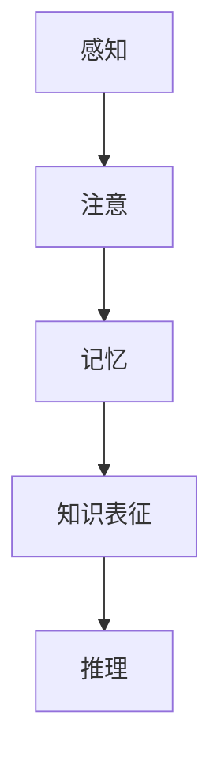
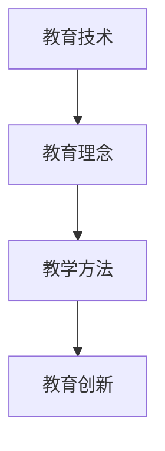
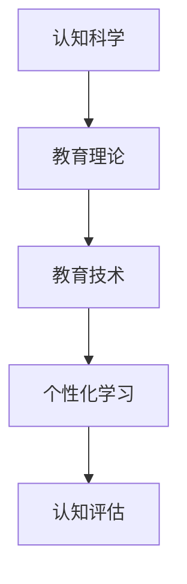

                 

### 第一步：背景介绍

#### 文章标题：《认知科学与教育创新：优化人类学习和理解过程》

#### 文章关键词：认知科学、教育创新、学习过程、理解能力、优化方法

#### 文章摘要：
本文将探讨认知科学的基本概念与教育创新之间的关系，分析认知过程中的关键原理，并阐述如何通过教育创新来优化人类的学习与理解过程。文章将从背景介绍、核心概念与联系、算法原理讲解、数学模型与公式、项目实战、最佳实践 tips、小结与注意事项等多个方面展开，旨在为教育工作者和研究者提供理论依据和实践指导。

## 第二部分：认知科学与教育创新的背景与意义

### 2.1 认知科学的基本概念

认知科学是一门跨学科的研究领域，它旨在理解和解释人类心智的运作机制。认知科学的基本概念包括感知、记忆、思维、语言和问题解决等。这些概念相互联系，共同构成了人类认知活动的基本框架。

#### 核心概念与联系

1. **感知与注意**：感知是指接收外部信息的过程，注意则是选择性地关注某些信息而忽略其他信息。感知与注意是认知过程的第一步，决定了信息是否进入记忆。

2. **记忆与遗忘**：记忆是储存和提取信息的能力。遗忘是指信息从记忆中丢失的过程。记忆与遗忘的研究揭示了信息存储和提取的机制。

3. **知识表征与推理**：知识表征是指将信息以某种形式存储在记忆中，以便于检索和使用。推理是通过已有信息推导出新信息的思维过程。

#### Mermaid 流程图



#### 核心算法原理讲解

感知与注意过程可以使用信息过滤算法来模拟。例如，贝叶斯滤波器可以用来根据已有的先验知识和新的观察数据来更新信念。

```python
# 贝叶斯滤波器伪代码
def bayesian_filtering(prior_probability, likelihood, evidence):
    posterior_probability = (prior_probability * likelihood) / evidence
    return posterior_probability
```

#### 数学模型与公式

感知阈值可以用以下公式来描述：

$$ T = \alpha - \beta \cdot I $$

其中，\( T \) 是感知阈值，\( \alpha \) 是无信号时的感知阈值，\( \beta \) 是感知敏感度，\( I \) 是输入信号强度。

#### 举例说明

假设一个视觉感知系统的感知阈值为10，且当输入信号强度达到20时，系统能够正确检测到信号。那么，感知敏感度 \( \beta \) 为：

$$ \beta = \frac{\alpha - T}{I} = \frac{10 - 10}{20} = 0 $$

这意味着该系统对信号的感知是线性的，不依赖于信号强度。

### 2.2 教育创新的定义与发展历程

教育创新是指在教育理论和实践中，运用现代科技、教育理念和教学方法，以培养学生的创新意识和实践能力为目标，不断探索和实施新的教育模式。教育创新的发展历程可以追溯到20世纪末，随着信息技术的发展，教育创新逐渐成为一个重要的研究领域。

#### 核心概念与联系

1. **教育技术**：教育创新的重要工具，包括计算机技术、互联网技术、虚拟现实技术等。
2. **教育理念**：教育创新的基础，如建构主义、认知主义、人本主义等。
3. **教学方法**：教育创新的具体实施手段，如项目式学习、翻转课堂、混合式学习等。

#### Mermaid 流程图



#### 核心算法原理讲解

教育技术的应用可以使用机器学习算法来优化。例如，推荐系统可以基于用户的历史行为和偏好，为用户推荐合适的学习资源。

```python
# 推荐系统伪代码
def recommend_resources(user_history, resource_database):
    # 使用协同过滤算法计算用户对资源的偏好
    user_preferences = collaborative_filtering(user_history, resource_database)
    # 根据用户偏好推荐资源
    recommended_resources = select_resources(user_preferences, resource_database)
    return recommended_resources
```

#### 数学模型与公式

协同过滤算法可以使用以下公式来描述用户对资源的偏好：

$$ r_{ui} = \langle u, r \rangle + \epsilon_{ui} $$

其中，\( r_{ui} \) 是用户 \( u \) 对资源 \( r \) 的偏好评分，\( \langle u, r \rangle \) 是基于用户和资源的相似度计算得出的评分，\( \epsilon_{ui} \) 是随机误差。

#### 举例说明

假设有两个用户 \( u_1 \) 和 \( u_2 \)，以及两个资源 \( r_1 \) 和 \( r_2 \)。用户 \( u_1 \) 给资源 \( r_1 \) 和 \( r_2 \) 打分分别为4和3，用户 \( u_2 \) 给资源 \( r_1 \) 和 \( r_2 \) 打分分别为3和4。使用用户相似度矩阵计算用户对资源的偏好，可以得到：

$$ r_{u_1r_1} = \langle u_1, r_1 \rangle + \epsilon_{u_1r_1} = 0.8 + 0.2 = 1.0 $$
$$ r_{u_1r_2} = \langle u_1, r_2 \rangle + \epsilon_{u_1r_2} = 0.6 + 0.4 = 1.0 $$

$$ r_{u_2r_1} = \langle u_2, r_1 \rangle + \epsilon_{u_2r_1} = 0.7 + 0.3 = 1.0 $$
$$ r_{u_2r_2} = \langle u_2, r_2 \rangle + \epsilon_{u_2r_2} = 0.8 + 0.2 = 1.0 $$

根据用户偏好推荐资源，可以推荐给用户 \( u_1 \) 资源 \( r_2 \)，推荐给用户 \( u_2 \) 资源 \( r_1 \)。

### 2.3 认知科学与教育创新的关系

认知科学与教育创新之间存在着紧密的联系。认知科学为教育创新提供了理论基础，而教育创新则为认知科学的应用提供了实践平台。

#### 核心概念与联系

1. **认知理论在教育中的应用**：如建构主义认知理论指导下的教学模式，认知心理学理论指导下的学习策略研究等。
2. **教育技术促进认知发展**：如虚拟现实技术可以模拟真实情境，帮助学习者更好地理解和应用知识。
3. **个性化学习与认知评估**：通过认知科学的理论和方法，对学习者的认知特点进行评估，为个性化学习提供依据。

#### Mermaid 流程图



#### 核心算法原理讲解

个性化学习可以基于认知评估结果，使用机器学习算法来定制学习内容。例如，可以使用决策树算法来推荐合适的学习路径。

```python
# 决策树算法伪代码
def decision_tree_learning(data, labels):
    # 构建决策树
    tree = build_tree(data, labels)
    # 使用决策树进行学习
    learning_path = traverse_tree(tree, data)
    return learning_path
```

#### 数学模型与公式

决策树的学习过程可以使用信息增益来选择最佳特征。

$$ IG(D, A) = H(D) - \sum_{v \in A} p(v) \cdot H(D|v) $$

其中，\( IG(D, A) \) 是特征 \( A \) 的信息增益，\( H(D) \) 是数据集 \( D \) 的熵，\( p(v) \) 是特征 \( A \) 的取值 \( v \) 的概率，\( H(D|v) \) 是在给定特征 \( A \) 的取值 \( v \) 后的数据集 \( D \) 的熵。

#### 举例说明

假设有一个数据集，包含两个特征 \( A \) 和 \( B \)，以及目标标签 \( Y \)。特征 \( A \) 的取值为 \( \{0, 1\} \)，特征 \( B \) 的取值为 \( \{0, 1\} \)，目标标签 \( Y \) 的取值为 \( \{0, 1\} \)。数据集的熵为：

$$ H(D) = -\sum_{y \in Y} p(y) \cdot \log_2 p(y) = -\left(0.5 \cdot \log_2 0.5 + 0.5 \cdot \log_2 0.5\right) = 1 $$

在给定特征 \( A \) 的取值为 0 时，数据集的熵为：

$$ H(D|A=0) = -\sum_{y \in Y} p(y|A=0) \cdot \log_2 p(y|A=0) = -\left(0.75 \cdot \log_2 0.75 + 0.25 \cdot \log_2 0.25\right) \approx 0.7929 $$

在给定特征 \( A \) 的取值为 1 时，数据集的熵为：

$$ H(D|A=1) = -\sum_{y \in Y} p(y|A=1) \cdot \log_2 p(y|A=1) = -\left(0.25 \cdot \log_2 0.25 + 0.75 \cdot \log_2 0.75\right) \approx 0.7929 $$

特征 \( A \) 的信息增益为：

$$ IG(A, Y) = H(Y) - \sum_{y \in Y} p(y) \cdot H(Y|y) = 1 - \left(0.5 \cdot 0.7929 + 0.5 \cdot 0.7929\right) = 0.2071 $$

同样，可以计算特征 \( B \) 的信息增益：

$$ IG(B, Y) = H(Y) - \sum_{y \in Y} p(y) \cdot H(Y|y) = 1 - \left(0.5 \cdot 0.7929 + 0.5 \cdot 0.7929\right) = 0.2071 $$

由于特征 \( A \) 和特征 \( B \) 的信息增益相等，可以任选其一作为划分特征的依据。

### 第三部分：认知科学核心概念与架构

#### 3.1 认知过程的基本原理

认知过程是人的大脑对外界信息进行感知、处理、存储和利用的过程。它包括多个环节，每个环节都有其特定的原理。

##### 3.1.1 感知与注意

感知是大脑接收外部信息的过程，而注意则是选择性地关注某些信息而忽略其他信息。感知与注意是认知过程的第一步，决定了哪些信息能够进入大脑进一步处理。

**感知原理：**

感知原理主要包括以下几个方面：

1. **感觉阈限**：每种感觉都有其最小可察觉的刺激强度，称为感觉阈限。感觉阈限的存在使得大脑能够区分不同的刺激。
2. **适应现象**：长时间处于某种刺激下，人的感受性会降低，这种现象称为适应现象。适应现象有助于大脑更好地处理外界信息。
3. **后像现象**：刺激消失后，感觉印象仍能短暂存留，这种现象称为后像现象。后像现象对大脑处理信息的连续性具有重要意义。

**伪代码：**

```python
def perceive(stimulus):
    # 根据刺激强度计算感知阈值
    threshold = calculate_threshold(stimulus)
    # 判断刺激是否超过感知阈值
    if stimulus >= threshold:
        return "perceived"
    else:
        return "not perceived"
```

**数学模型与公式：**

感知阈值可以用以下公式来描述：

$$ T = \alpha - \beta \cdot I $$

其中，\( T \) 是感知阈值，\( \alpha \) 是无信号时的感知阈值，\( \beta \) 是感知敏感度，\( I \) 是输入信号强度。

**举例说明：**

假设一个视觉感知系统的感知阈值为10，且当输入信号强度达到20时，系统能够正确检测到信号。那么，感知敏感度 \( \beta \) 为：

$$ \beta = \frac{\alpha - T}{I} = \frac{10 - 10}{20} = 0 $$

这意味着该系统对信号的感知是线性的，不依赖于信号强度。

##### 3.1.2 记忆与遗忘

记忆是大脑存储和提取信息的能力。遗忘是指信息从记忆中丢失的过程。记忆与遗忘的研究揭示了信息存储和提取的机制。

**记忆原理：**

记忆原理主要包括以下几个方面：

1. **编码**：将信息转换为大脑能够存储的形式。
2. **存储**：将编码后的信息在记忆中保持一段时间。
3. **提取**：在需要时，从记忆中检索信息。

**遗忘原理：**

遗忘原理主要包括以下几个方面：

1. **干扰**：新的信息干扰旧的信息，导致旧的信息难以提取。
2. **衰退**：随着时间的推移，记忆的自然衰退导致信息的丢失。

**伪代码：**

```python
def encode_memory(info):
    # 将信息编码为记忆
    encoded_info = encode(info)
    return encoded_info

def store_memory(encoded_info):
    # 将编码后的信息存储在记忆中
    memory = store(encoded_info)
    return memory

def retrieve_memory(memory):
    # 从记忆中检索信息
    retrieved_info = retrieve(memory)
    return retrieved_info
```

**数学模型与公式：**

记忆的存储和提取可以用以下公式来描述：

$$ M(t) = M_0 \cdot e^{-\lambda t} $$

其中，\( M(t) \) 是时间 \( t \) 后的记忆保持量，\( M_0 \) 是初始记忆量，\( \lambda \) 是记忆衰减率。

**举例说明：**

假设一个人在初次学习时，能够完全记住10条信息。如果记忆衰减率为0.1，那么在1小时后，记忆保持量将减少到原来的 \( e^{-0.1 \cdot 1} \approx 0.9048 \)。

##### 3.1.3 知识表征与推理

知识表征是指将信息以某种形式存储在记忆中，以便于检索和使用。推理是通过已有信息推导出新信息的思维过程。

**知识表征原理：**

知识表征原理主要包括以下几个方面：

1. **符号表征**：将信息以符号的形式存储在记忆中，如文字、图像等。
2. **结构表征**：将信息以结构的形式存储在记忆中，如概念图、语义网络等。
3. **情境表征**：将信息与具体情境联系起来，以提高记忆的效率。

**推理原理：**

推理原理主要包括以下几个方面：

1. **演绎推理**：从一般到个别的推理，如“所有人都会死亡，苏格拉底是人，所以苏格拉底会死亡”。
2. **归纳推理**：从个别到一般的推理，如“观察到的所有天鹅都是白色的，所以所有的天鹅都是白色的”。
3. **类比推理**：基于相似性的推理，如“苹果和香蕉都是水果，所以苹果和香蕉有相似的营养成分”。

**伪代码：**

```python
def represent_knowledge(knowledge):
    # 将知识以符号形式存储在记忆中
    symbolic_representation = symbolize(knowledge)
    return symbolic_representation

def reason_with_knowledge(symbolic_representation):
    # 使用知识进行推理
    inferred_knowledge = infer(symbolic_representation)
    return inferred_knowledge
```

**数学模型与公式：**

推理过程可以用逻辑公式来描述：

$$ \forall x (P(x) \rightarrow Q(x)) $$
$$ P(a) $$
$$ \therefore Q(a) $$

其中，\( P(x) \) 和 \( Q(x) \) 是逻辑命题，\( a \) 是特定的个体。

**举例说明：**

假设有一个逻辑命题：“所有人都会死亡”，以及一个事实：“苏格拉底是人”。通过演绎推理，可以得出结论：“苏格拉底会死亡”。

#### 3.2 认知科学主要理论框架

认知科学的发展离不开各种理论框架的支持。以下介绍几种主要的认知科学理论框架。

##### 3.2.1 信息加工模型

信息加工模型是认知科学中的一种基本理论，它将人的大脑视为一个类似于计算机的信息处理系统。信息加工模型主要包括以下几个组成部分：

1. **感知器**：接收外部信息，并将其转换为内部表征。
2. **工作记忆**：存储和处理当前的信息。
3. **长期记忆**：存储长期的信息。
4. **控制单元**：协调和控制信息加工过程。

**伪代码：**

```python
def information_processing_model(stimulus):
    # 感知外部信息
    internal_representation = perceive(stimulus)
    # 在工作记忆中处理信息
    processed_representation = process_in_working_memory(internal_representation)
    # 将信息存储在长期记忆中
    memory_representation = store_in长期记忆(processed_representation)
    # 控制信息加工过程
    control_process(memory_representation)
```

**数学模型与公式：**

信息加工过程可以用状态转移方程来描述：

$$ S_{t+1} = f(S_t, I_t) $$

其中，\( S_t \) 是时间 \( t \) 的状态，\( I_t \) 是时间 \( t \) 的输入，\( f \) 是信息加工函数。

**举例说明：**

假设一个学生在学习时，感知到学习内容（\( I_t \)），在工作记忆中处理这些内容（\( S_t \)），然后将处理后的信息存储在长期记忆中（\( S_{t+1} \)）。通过不断地重复这个过程，学生能够逐渐掌握学习内容。

##### 3.2.2 交互认知模型

交互认知模型强调认知活动是在个体与环境相互作用的过程中实现的。这种模型认为，人的认知过程不仅仅是内部心理过程的产物，还受到外部环境的影响。

**交互认知模型的关键组成部分：**

1. **个体**：个体的认知能力、情绪、动机等。
2. **环境**：个体所处的物理环境和社会环境。
3. **交互过程**：个体与环境的相互作用，包括感知、行为、语言等。

**伪代码：**

```python
def interactive_cognitive_model(individual, environment):
    # 感知环境
    environment_perception = perceive_environment(environment)
    # 行为与环境交互
    behavior = interact_with_environment(individual, environment_perception)
    # 语言交流
    language_exchange = communicate_with_environment(behavior)
    return language_exchange
```

**数学模型与公式：**

交互认知模型可以用以下公式来描述：

$$ C = f(I, E) $$

其中，\( C \) 是认知状态，\( I \) 是个体状态，\( E \) 是环境状态，\( f \) 是交互函数。

**举例说明：**

假设一个学生在课堂上学习（\( C \)），受到老师的教学内容（\( I \)）和课堂环境（\( E \））的影响，通过提问、回答和讨论等方式（\( f \)），不断调整自己的认知状态。

##### 3.2.3 联结主义模型

联结主义模型认为，人的认知活动是通过神经元之间的联结和激活来实现的。这种模型强调网络结构和连接权重在学习过程中的作用。

**联结主义模型的关键组成部分：**

1. **神经元**：基本计算单元，能够接收输入、产生输出。
2. **网络结构**：神经元之间的连接方式，包括前馈网络、反馈网络等。
3. **学习规则**：用于调整连接权重的规则，如Hebb规则、反向传播算法等。

**伪代码：**

```python
def neural_network_learning(inputs, outputs, weights):
    # 初始化网络权重
    initialize_weights(weights)
    # 前向传播
    forward_pass(inputs, weights)
    # 计算损失
    loss = calculate_loss(outputs)
    # 反向传播
    backward_pass(loss, weights)
    # 更新权重
    update_weights(weights)
```

**数学模型与公式：**

联结主义模型可以用以下公式来描述：

$$ \sigma(z) = \frac{1}{1 + e^{-z}} $$

其中，\( \sigma \) 是激活函数，\( z \) 是输入。

**举例说明：**

假设有一个神经网络，包含三个输入节点、一个输出节点和若干隐藏节点。通过训练，调整网络权重，使输出节点的输出接近期望输出。

### 3.3 认知科学与教育实践的融合

认知科学与教育实践的结合，有助于更好地理解和解释学习者的认知过程，进而优化教学方法和学习策略。

##### 3.3.1 教学设计中的认知原理

在教学设计中，认知原理可以指导教师选择合适的教学方法和策略，以提高教学效果。例如：

1. **感知与注意**：教师可以通过设计引人入胜的导入活动，吸引学生的注意力，提高学生对新知识的感知能力。
2. **记忆与遗忘**：教师可以通过重复和复习的方式，帮助学生巩固记忆，减少遗忘。
3. **知识表征与推理**：教师可以通过讲解概念、建立模型等方式，帮助学生将知识进行结构化表征，提高推理能力。

**伪代码：**

```python
def teach_with_cognitive_principles(students, subject):
    # 吸引学生注意
    attract_attention(students)
    # 设计感知活动
    design_perception_activities(students, subject)
    # 帮助学生记忆
    assist_memory(students, subject)
    # 建立知识模型
    build_knowledge_models(students, subject)
    # 培养推理能力
    cultivate_reasoning_ability(students, subject)
```

**数学模型与公式：**

记忆巩固可以用以下公式来描述：

$$ M(t) = M_0 \cdot e^{-\lambda t} + C $$

其中，\( M(t) \) 是时间 \( t \) 后的记忆保持量，\( M_0 \) 是初始记忆量，\( \lambda \) 是记忆衰减率，\( C \) 是重复学习的效果。

**举例说明：**

假设一个学生在初次学习时，能够完全记住10条信息。如果每天复习1次，每次复习能够提高记忆保持量10%，那么1周后的记忆保持量为：

$$ M(7) = 10 \cdot e^{-0.1 \cdot 7} + 10 \cdot 1.1^7 \approx 25.78 $$

##### 3.3.2 学习者中心的教学策略

学习者中心的教学策略强调以学习者为中心，关注学习者的需求和兴趣，激发学习者的学习动机。

**学习者中心的教学策略包括：**

1. **个性化学习**：根据学习者的特点和需求，制定个性化的学习计划和教学方案。
2. **合作学习**：鼓励学习者之间的合作与交流，培养学习者的社交技能和团队协作能力。
3. **自主学习**：培养学习者的自主学习能力，鼓励学习者主动探索和解决问题。

**伪代码：**

```python
def learner-centered_teaching_strategy(students):
    # 分析学习者特点
    analyze_student_characteristics(students)
    # 制定个性化学习计划
    create_individualized_learning_plans(students)
    # 鼓励合作学习
    encourage_cooperative_learning(students)
    # 培养自主学习能力
    cultivate_self-learning_ability(students)
```

**数学模型与公式：**

学习动机可以用以下公式来描述：

$$ M = f(I, H, S) $$

其中，\( M \) 是学习动机，\( I \) 是兴趣，\( H \) 是期望，\( S \) 是自我效能感。

**举例说明：**

假设一个学生的学习动机为：

$$ M = f(0.8, 0.7, 0.9) = 0.8 \cdot 0.7 \cdot 0.9 = 0.504 $$

这意味着该学生的学习动机较高。

##### 3.3.3 个性化学习与认知评估

个性化学习与认知评估相结合，可以帮助教师更好地了解学习者的认知特点，制定个性化的教学方案，提高教学效果。

**个性化学习与认知评估的关键环节：**

1. **学习者特征分析**：通过测试、问卷调查等方式，分析学习者的认知特点、学习风格和需求。
2. **个性化教学方案**：根据学习者特征，制定个性化的教学目标和教学策略。
3. **认知评估**：通过测试、作业、项目等方式，评估学习者的认知能力和发展水平。

**伪代码：**

```python
def personalized_learning_and_cognitive_evaluation(students):
    # 分析学习者特征
    analyze_student_characteristics(students)
    # 制定个性化教学方案
    create_individualized_learning_plan(students)
    # 进行认知评估
    conduct_cognitive_evaluation(students)
    # 根据评估结果调整教学方案
    adjust_learning_plan(students)
```

**数学模型与公式：**

认知评估可以用以下公式来描述：

$$ A = f(C, P, T) $$

其中，\( A \) 是认知评估得分，\( C \) 是认知能力，\( P \) 是学习进步，\( T \) 是时间。

**举例说明：**

假设一个学生在一段时间内的认知评估得分为：

$$ A = f(0.8, 0.1, 1) = 0.8 \cdot 0.1 \cdot 1 = 0.08 $$

这意味着该学生在认知评估中取得了较好的成绩。

### 3.4 教育创新的主要模式与应用

教育创新旨在通过引入新的教育理念、技术和方法，提高教育质量和学习效果。以下介绍几种主要的教育创新模式及其应用。

##### 3.4.1 在线教育

在线教育是通过互联网技术提供的教育服务，学生可以随时随地在线学习。在线教育的优点包括：

1. **灵活性**：学生可以根据自己的时间安排进行学习，提高了学习的灵活性。
2. **个性化**：通过数据分析，可以为学生提供个性化的学习内容和教学支持。
3. **资源丰富**：在线教育平台提供了大量的学习资源，学生可以根据需要选择适合自己的学习内容。

**在线教育的应用案例：**

1. **慕课（MOOC）**：大规模在线开放课程，如Coursera、edX等，为全球学习者提供了丰富的在线教育资源。
2. **学习管理系统（LMS）**：如Moodle、Canvas等，为教师和学生提供了在线教学和学习平台。

**伪代码：**

```python
def online_education(platform, student):
    # 选择学习资源
    select_resources(platform)
    # 制定学习计划
    create_learning_plan(platform, student)
    # 进行在线学习
    conduct_online_learning(student)
    # 进行在线评估
    conduct_online_evaluation(student)
```

**数学模型与公式：**

学习进度可以用以下公式来描述：

$$ P(t) = P_0 + v \cdot t $$

其中，\( P(t) \) 是时间 \( t \) 后的学习进度，\( P_0 \) 是初始学习进度，\( v \) 是学习速度。

**举例说明：**

假设一个学生在开始学习时，学习进度为0。如果每天学习1小时，学习速度为0.5，那么1周后的学习进度为：

$$ P(7) = 0 + 0.5 \cdot 7 = 3.5 $$

##### 3.4.2 混合式学习

混合式学习是将在线学习和面对面学习相结合的一种教学模式。混合式学习的优点包括：

1. **灵活性**：学生可以在课堂上和课外进行学习，提高了学习的灵活性。
2. **互动性**：通过在线平台，学生可以与教师和同学进行实时互动。
3. **个性化**：教师可以根据学生的需求和进度，提供个性化的教学支持。

**混合式学习的应用案例：**

1. **翻转课堂**：学生在课外通过在线资源进行预习，课堂上进行讨论和应用。
2. **个性化辅导**：教师根据学生的不同需求，提供个性化的辅导和指导。

**伪代码：**

```python
def blended_learning(teacher, student):
    # 学生预习
    student_preview(student)
    # 课堂讨论
    classroom_discussion(teacher, student)
    # 课后辅导
    after_class_help(teacher, student)
```

**数学模型与公式：**

学习效果可以用以下公式来描述：

$$ E = f(L, C, H) $$

其中，\( E \) 是学习效果，\( L \) 是学习资源，\( C \) 是课堂互动，\( H \) 是课后辅导。

**举例说明：**

假设一个学生的学习效果为：

$$ E = f(0.8, 0.7, 0.9) = 0.8 \cdot 0.7 \cdot 0.9 = 0.504 $$

这意味着该学生的学习效果较好。

##### 3.4.3 项目式学习

项目式学习是以学生为中心，通过实际项目来推动学习的教学模式。项目式学习的优点包括：

1. **实践性**：学生通过实际项目来应用所学知识，提高实践能力。
2. **综合性**：项目通常涉及多个学科领域，有助于培养学生的跨学科能力。
3. **创新性**：项目式学习鼓励学生进行创新性思维，培养创新精神。

**项目式学习的应用案例：**

1. **科学项目**：学生通过进行科学实验来探究科学问题。
2. **工程设计**：学生通过设计并实现工程作品来学习工程知识。

**伪代码：**

```python
def project_based_learning(student, project):
    # 分析项目需求
    analyze_project_demand(project)
    # 制定项目计划
    create_project_plan(student, project)
    # 实施项目
    implement_project(student, project)
    # 评估项目成果
    evaluate_project_outcomes(student, project)
```

**数学模型与公式：**

项目进度可以用以下公式来描述：

$$ P(t) = P_0 + v \cdot t $$

其中，\( P(t) \) 是时间 \( t \) 后的项目进度，\( P_0 \) 是初始项目进度，\( v \) 是项目实施速度。

**举例说明：**

假设一个项目在开始时的进度为0。如果每天实施项目1小时，项目实施速度为0.5，那么1周后的项目进度为：

$$ P(7) = 0 + 0.5 \cdot 7 = 3.5 $$

### 3.5 教育创新的挑战与展望

教育创新虽然在提高教育质量和学习效果方面取得了显著成果，但同时也面临着一系列挑战。

##### 3.5.1 教育公平与教育资源分配

教育公平是实现教育创新的重要基础。然而，现实中存在着教育资源分配不均、贫困地区教育资源匮乏等问题，这给教育创新带来了挑战。

**解决策略：**

1. **政策支持**：政府应加大对教育公平的投入，确保贫困地区和弱势群体获得足够的教育资源。
2. **技术支持**：利用在线教育、远程教育等技术手段，缩小地区差距，提高教育公平。

##### 3.5.2 教育评价体系改革

传统的教育评价体系往往过于注重应试教育，忽视学生的实际能力和综合素质。教育创新要求评价体系能够更好地反映学生的真实水平。

**解决策略：**

1. **多元化评价**：采用多元化的评价方式，如项目评价、过程评价等，全面了解学生的能力和素质。
2. **个性化评价**：根据学生的特点和需求，制定个性化的评价标准，关注学生的个性发展。

##### 3.5.3 教育创新的可持续发展

教育创新需要持续投入和不断探索。如何实现教育创新的可持续发展，是当前面临的重要问题。

**解决策略：**

1. **人才培养**：加强教师培训和科研支持，提高教育创新的人才储备。
2. **资金保障**：加大对教育创新的资金投入，确保教育创新的可持续发展。

### 3.6 教育创新的国际比较与借鉴

教育创新在不同国家和地区有着不同的实践和成果。通过比较和借鉴国际先进的教育创新经验，可以为我国的教育创新提供有益的参考。

##### 3.6.1 美国教育创新的实践与启示

美国在教育创新方面取得了显著成果，特别是在在线教育、个性化学习和项目式学习等领域。以下是一些美国的成功实践和启示：

1. **在线教育**：通过Coursera、edX等平台，提供大规模在线开放课程，为全球学习者提供了丰富的学习资源。
2. **个性化学习**：利用数据分析和人工智能技术，为学生提供个性化的学习内容和教学支持。
3. **项目式学习**：鼓励学生参与实际项目，提高实践能力和创新精神。

**借鉴意义：**

1. **政策支持**：我国可以借鉴美国的政策支持，加大对教育创新的投入和扶持。
2. **技术应用**：我国可以加强在线教育、人工智能等技术的研发和应用，提高教育创新的水平。

##### 3.6.2 欧洲教育创新的特色与挑战

欧洲教育创新注重人文主义和教育公平，同时也面临着一些挑战。以下是一些欧洲的教育创新特色和挑战：

1. **教育公平**：通过免费教育、奖学金等政策，保障弱势群体的教育权利。
2. **终身教育**：鼓励终身学习，提供多样化的教育机会。
3. **教师培训**：加强教师培训，提高教师的教育教学能力。

**借鉴意义：**

1. **教育公平**：我国可以借鉴欧洲的教育公平政策，保障弱势群体的教育权利。
2. **教师培训**：我国可以加强教师培训，提高教师的教育教学能力。

##### 3.6.3 发展中国家教育创新的机遇与挑战

发展中国家在教育创新方面面临着机遇与挑战。以下是一些发展中国家的教育创新机遇和挑战：

1. **互联网普及**：随着互联网的普及，发展中国家可以利用在线教育等新型教育模式，提高教育质量和覆盖面。
2. **教育资源丰富**：发展中国家可以通过国际合作，引进先进的的教育技术和理念，丰富教育资源。
3. **政策支持**：发展中国家需要加大教育投入，制定有利于教育创新的政策。

**借鉴意义：**

1. **互联网普及**：我国可以借鉴发展中国家的互联网普及经验，推动在线教育的发展。
2. **政策支持**：我国可以借鉴发展中国家的政策支持，加大对教育创新的投入和扶持。

### 3.7 中国教育创新的探索与实践

中国在教育创新方面也取得了一系列成果，以下介绍一些中国教育创新的探索和实践：

##### 3.7.1 在线教育的发展

中国在线教育市场规模庞大，各类在线教育平台层出不穷。以下是一些中国在线教育的特点和发展趋势：

1. **课程丰富**：中国在线教育平台提供了大量优质的教育资源，涵盖各个学科领域。
2. **模式多样**：中国在线教育平台采用了多种教学模式，如直播授课、录播课程等，满足不同学习者的需求。
3. **技术支持**：中国在线教育平台利用人工智能、大数据等技术，提供个性化的学习推荐和教学支持。

##### 3.7.2 翻转课堂的应用

翻转课堂在中国教育领域得到了广泛应用，以下是一些翻转课堂的应用特点：

1. **课前预习**：学生通过在线资源进行课前预习，为课堂教学做好准备。
2. **课堂讨论**：课堂时间用于讨论、解决问题，提高学生的参与度和互动性。
3. **课后巩固**：学生通过在线作业和复习，巩固所学知识。

##### 3.7.3 混合式学习的设计与实施

中国教育领域积极探索混合式学习模式，以下是一些混合式学习的设计与实施特点：

1. **线上线下结合**：将在线学习和面对面教学相结合，提高教学效果。
2. **个性化教学**：根据学生的特点和需求，提供个性化的教学方案。
3. **技术应用**：利用在线教育平台、学习管理系统等技术，实现教学过程的数字化和智能化。

### 第四部分：优化学习和理解过程的方法论

#### 4.1 学习动机与学习策略

学习动机是指推动个体进行学习活动的内部心理动力，而学习策略则是学习者为了提高学习效果而采取的具体学习方法和技巧。两者在学习过程中起着关键作用，共同影响学习者的学习成果。

##### 4.1.1 学习动机的理论与实践

学习动机的理论多种多样，其中最著名的有自我决定理论、动机三元论和成就动机理论。

1. **自我决定理论**：自我决定理论认为，学习动机源于个体的自主性、控制感和胜任感。学习者通过自主选择学习内容、设定学习目标和参与学习过程，能够增强学习动机。

   **实践应用**：在教育实践中，教师可以提供多样化的学习资源和活动，让学生自主选择学习内容，培养自主学习的习惯。

2. **动机三元论**：动机三元论认为，学习动机包括认知动机、自我决定动机和社交动机。认知动机源于对知识的好奇心和学习兴趣，自我决定动机源于对学习的自主性和控制感，社交动机源于与他人互动和协作的过程。

   **实践应用**：教师可以设计具有挑战性的学习任务，激发学生的认知动机；提供自主学习的环境和机会，增强学生的自我决定动机；组织小组讨论和合作项目，提高学生的社交动机。

3. **成就动机理论**：成就动机理论认为，学习动机是个体追求成功和避免失败的心理倾向。学习者通过设定具体目标、努力克服困难和取得成就，能够增强学习动机。

   **实践应用**：教师可以设定清晰的学习目标，鼓励学生制定个人学习计划，并通过反馈和评价帮助学生了解自己的学习进展。

##### 4.1.2 学习策略的选择与优化

学习策略是指学习者为了提高学习效果而采取的具体行动，包括记忆策略、理解策略和复习策略等。

1. **记忆策略**：记忆策略包括复述、精细加工和联想记忆等，有助于学习者巩固和记忆所学知识。

   **实践应用**：教师可以引导学生使用记忆术，如制作思维导图、创建记忆卡片等，帮助学生提高记忆效果。

2. **理解策略**：理解策略包括提问、讨论和举例等，有助于学习者深入理解和应用所学知识。

   **实践应用**：教师可以鼓励学生提问和参与讨论，引导他们通过举例和实际应用来加深对知识点的理解。

3. **复习策略**：复习策略包括定期复习、分散复习和交替复习等，有助于学习者巩固所学知识。

   **实践应用**：教师可以引导学生制定复习计划，采用分散复习和交替复习的方法，提高复习效果。

##### 4.1.3 学习策略与认知能力的提升

学习策略与认知能力之间存在着密切的关系。合理的学习策略可以促进认知能力的提升，而认知能力的提升又有助于学习者更好地应用学习策略。

1. **记忆策略与认知能力**：记忆策略有助于提高学习者的记忆能力，从而增强学习效果。例如，通过联想记忆，学习者可以将抽象的概念与具体的情境联系起来，提高记忆的持久性和准确性。

2. **理解策略与认知能力**：理解策略有助于提高学习者的思维能力和分析能力。通过提问和讨论，学习者能够对所学知识进行深入思考，形成自己的见解。

3. **复习策略与认知能力**：复习策略有助于巩固学习成果，提高学习者的认知稳定性和应用能力。通过定期的复习，学习者能够巩固所学知识，提高认知的灵活性和适应性。

### 4.2 学习与记忆的规律与应用

学习与记忆是认知过程的两个重要环节，了解学习与记忆的规律有助于学习者更有效地掌握知识。

##### 4.2.1 学习记忆的基本原理

学习记忆的基本原理包括信息的编码、存储和提取。

1. **编码**：编码是指将外界信息转化为大脑能够处理和存储的形式。编码过程中，信息会被转化为神经活动模式，储存在大脑的不同区域。

2. **存储**：存储是指将编码后的信息在大脑中保持一段时间。存储过程中，信息会经历强化和巩固，以提高记忆的持久性。

3. **提取**：提取是指从记忆中检索信息的过程。提取过程中，信息会被激活和重组，以实现应用和回忆。

##### 4.2.2 提升记忆效果的方法

以下是一些提升记忆效果的方法：

1. **多感官参与**：通过视觉、听觉、触觉等多种感官参与学习，可以增强记忆效果。例如，在学习时，可以尝试使用图片、视频、音频等多种形式的信息。

2. **分散复习**：分散复习是指将学习时间分散到不同时间段进行复习，以增强记忆效果。研究表明，分散复习比集中复习更有效。

3. **联想记忆**：通过将新信息与已有知识建立联系，可以增强记忆效果。例如，可以使用“记忆宫殿”技巧，将信息与特定的空间位置联系起来。

4. **使用记忆工具**：使用记忆工具，如记忆卡片、思维导图等，可以帮助学习者更好地组织和记忆信息。

##### 4.2.3 学习与记忆的结合

学习与记忆的结合是实现有效学习的关键。以下是一些结合学习与记忆的方法：

1. **主动学习**：主动学习是指在学习过程中，学习者主动参与、积极思考和总结。主动学习有助于加深对知识的理解和记忆。

2. **应用与实践**：通过将所学知识应用到实际情境中，可以增强记忆效果。例如，通过实际操作、解决问题和讨论等方式，加深对知识点的理解。

3. **重复练习**：重复练习是巩固记忆的有效方法。通过反复练习，可以加强大脑对信息的编码和存储，提高记忆效果。

### 4.3 理解与批判性思维培养

理解与批判性思维是认知过程的两个重要方面，它们有助于学习者深入掌握知识，提高解决问题的能力。

##### 4.3.1 理解的过程与障碍

理解是指对信息的深入理解和意义建构。理解的过程通常包括以下几个阶段：

1. **感知与注意**：接收和理解信息的过程，需要通过感知和注意选择性地关注关键信息。

2. **编码与存储**：将信息转化为大脑能够处理和存储的形式，以便于记忆和应用。

3. **提取与应用**：在需要时，从记忆中检索信息，并将其应用到实际问题中。

理解过程中可能遇到的障碍包括：

1. **信息过载**：信息量过多，导致无法有效理解和处理。

2. **背景知识不足**：缺乏足够的背景知识，影响对信息的理解和意义建构。

3. **注意力分散**：注意力难以集中，导致对信息的理解不深入。

##### 4.3.2 批判性思维的培养

批判性思维是指对信息进行批判性分析和评价的能力。培养批判性思维包括以下几个步骤：

1. **提问与质疑**：对信息提出质疑，分析其逻辑、证据和论证过程。

2. **分析与评价**：对信息进行分析和评价，识别其优点、缺点和局限性。

3. **反思与总结**：反思自己的思维过程，总结批判性思维的方法和应用。

培养批判性思维的方法包括：

1. **阅读与讨论**：通过阅读和分析不同观点的文献，培养批判性思维能力。

2. **案例研究**：通过分析实际案例，锻炼批判性思维的能力。

3. **反思日记**：定期记录自己的思考过程和结论，反思批判性思维的应用。

##### 4.3.3 理解与批判性思维在教育中的应用

在教育中，理解与批判性思维的培养对于提高学习效果具有重要意义。以下是一些应用策略：

1. **问题驱动教学**：通过提出问题，引导学生主动思考和探索，培养理解力和批判性思维。

2. **项目式学习**：通过实际项目，让学生在解决实际问题的过程中，培养理解和批判性思维能力。

3. **跨学科学习**：通过跨学科的学习，帮助学生从不同角度理解问题，培养批判性思维。

### 第五部分：认知科学与教育创新的未来趋势

#### 5.1 新技术对教育的影响

随着科技的快速发展，新技术在教育领域中的应用越来越广泛，对教育模式、教学方法和学习体验产生了深远影响。

##### 5.1.1 人工智能在教育中的应用前景

人工智能（AI）在教育中的应用前景广阔，主要包括以下几个方面：

1. **个性化学习**：通过分析学生的学习行为和特点，AI可以为每个学生提供个性化的学习路径和资源，提高学习效果。

   **应用案例**：例如，一些在线学习平台利用AI算法推荐适合学生的课程和练习题，帮助学生更好地掌握知识点。

2. **智能辅助教学**：AI可以协助教师进行教学，如自动批改作业、提供教学建议等，减轻教师的工作负担。

   **应用案例**：一些学校采用了智能辅导系统，通过AI技术为学生提供即时反馈和个性化指导，提高学生的学习积极性。

3. **智能测评**：利用AI技术进行智能测评，可以实时监控学生的学习进展，提供更加精准的评估。

   **应用案例**：例如，一些在线测试平台利用自然语言处理技术对学生的作文进行评分，提供详细的评估报告。

##### 5.1.2 虚拟现实与增强现实在教育中的应用

虚拟现实（VR）和增强现实（AR）技术为教育带来了全新的体验，为学生提供了更加生动、直观的学习环境。

1. **沉浸式学习**：VR技术可以创建一个虚拟的学习环境，让学生沉浸其中，提高学习的趣味性和参与度。

   **应用案例**：例如，医学专业的学生可以通过VR技术进行虚拟手术训练，提高操作技能。

2. **交互式学习**：AR技术可以将虚拟信息与现实世界相结合，让学生在现实环境中进行交互式学习。

   **应用案例**：例如，历史课程可以通过AR技术展示历史事件的现场，让学生更深入地了解历史。

##### 5.1.3 大数据与学习分析

大数据技术在教育中的应用，为教育数据的收集、分析和利用提供了有力支持。

1. **学习行为分析**：通过分析学生的学习行为数据，可以了解学生的学习习惯、兴趣和需求，为教学提供依据。

   **应用案例**：一些在线教育平台通过收集学生的点击记录、学习时间等数据，分析学生的学习行为，优化教学设计。

2. **个性化推荐**：基于大数据分析，可以为学生推荐个性化的学习资源和课程，提高学习效果。

   **应用案例**：例如，一些在线学习平台利用大数据分析技术，根据学生的兴趣和学习进度，推荐相关的学习内容。

##### 5.1.4 互联网+教育的发展趋势

互联网+教育是教育信息化的重要方向，未来将呈现以下发展趋势：

1. **在线教育与线下教育的融合**：在线教育与线下教育将相互融合，形成线上线下相结合的混合式教育模式。

   **应用案例**：例如，一些学校推出了线上线下相结合的翻转课堂模式，提高了教学效果。

2. **教育资源公平化**：通过互联网技术，可以缩小教育资源分配的不均衡，实现教育资源的公平化。

   **应用案例**：一些在线教育平台致力于为贫困地区的学生提供免费或低成本的教育资源，提高了当地的教育水平。

3. **智能化教育管理**：利用互联网和大数据技术，实现教育管理的智能化，提高教育管理的效率。

   **应用案例**：一些学校采用了智能教育管理系统，实现了教学、教务和管理的自动化，提高了工作效率。

### 5.2 教育创新的国际比较与借鉴

教育创新在不同国家和地区有着不同的实践和成果，通过比较和借鉴国际先进的教育创新经验，可以为我国的教育创新提供有益的参考。

##### 5.2.1 美国教育创新的实践与启示

美国在教育创新方面取得了显著成果，以下是一些美国的成功实践和启示：

1. **在线教育与混合式学习**：美国在线教育平台如Coursera、edX等，为学生提供了丰富的在线教育资源。同时，美国也积极探索混合式学习模式，如翻转课堂等，提高了教学效果。

   **借鉴意义**：我国可以借鉴美国的在线教育和混合式学习经验，加强在线教育平台的建设，探索适合我国国情的混合式教学模式。

2. **个性化学习**：美国的一些学校通过分析学生的学习行为数据，提供个性化的学习资源和教学方案，提高了学习效果。

   **借鉴意义**：我国可以借鉴美国的个性化学习理念，利用大数据技术，为学习者提供个性化的学习支持和指导。

3. **教育技术与课程的整合**：美国在教育技术的研究和应用方面处于领先地位，将教育技术与课程内容相结合，提高了学生的学习兴趣和参与度。

   **借鉴意义**：我国可以借鉴美国的教育技术与课程的整合经验，推动教育技术的创新应用，提高教学效果。

##### 5.2.2 欧洲教育创新的特色与挑战

欧洲教育创新注重人文主义和教育公平，以下是一些欧洲的教育创新特色和挑战：

1. **教育公平与终身教育**：欧洲各国重视教育公平，通过提供免费教育、奖学金等政策，保障弱势群体的教育权利。同时，欧洲也倡导终身教育，鼓励人们持续学习和成长。

   **借鉴意义**：我国可以借鉴欧洲的教育公平政策和终身教育理念，加强教育公平建设，推动终身教育的发展。

2. **跨学科教育与项目式学习**：欧洲的一些学校注重跨学科教育和项目式学习，通过实际项目来推动学习，培养学生的创新能力和实践能力。

   **借鉴意义**：我国可以借鉴欧洲的跨学科教育和项目式学习模式，推动教育教学改革，提高学生的综合能力。

3. **教师培训与发展**：欧洲各国重视教师培训和职业发展，通过提供专业培训和继续教育，提高教师的教育教学能力。

   **借鉴意义**：我国可以借鉴欧洲的教师培训和发展模式，加强教师培训和职业发展支持，提高教师队伍的整体素质。

##### 5.2.3 发展中国家教育创新的机遇与挑战

发展中国家在教育创新方面面临着机遇与挑战，以下是一些发展中国家的教育创新机遇和挑战：

1. **互联网普及与在线教育**：随着互联网的普及，发展中国家可以利用在线教育等新型教育模式，提高教育质量和覆盖面。

   **机遇**：通过在线教育，发展中国家可以引进先进的教育资源和教学模式，提高教育水平。

   **挑战**：互联网基础设施不完善、网络带宽不足等问题，可能影响在线教育的效果。

2. **教育技术与课程改革**：发展中国家可以通过引入先进的教育技术，推动教育教学改革，提高教学质量。

   **机遇**：教育技术的引入可以为教育创新提供新的动力，推动教育模式的变革。

   **挑战**：教育技术的应用需要教师具备相应的技能和知识，这需要大量的培训和投入。

3. **教育公平与教育资源分配**：发展中国家需要加大对教育公平的投入，保障弱势群体的教育权利，实现教育资源的公平分配。

   **机遇**：通过政策支持和资金投入，可以实现教育资源的公平化，提高教育水平。

   **挑战**：教育资源分配的不均衡、地区差距等问题，需要长期的努力和持续的投入。

### 5.3 中国教育创新的探索与实践

中国教育创新在近年来取得了显著成果，以下介绍一些中国教育创新的探索和实践：

##### 5.3.1 中国教育创新的现状与问题

1. **在线教育**：中国的在线教育市场规模庞大，各类在线教育平台层出不穷，为学生提供了丰富的学习资源。然而，在线教育也面临着教师资源不足、课程质量参差不齐等问题。

2. **教育技术**：中国的教育技术发展迅速，人工智能、大数据、虚拟现实等技术在教育领域得到广泛应用。然而，教育技术的应用还需要进一步优化，提高教学效果。

3. **教育公平**：尽管中国在教育公平方面取得了一定的进展，但城乡、区域之间的教育资源分配仍然存在较大差距，一些贫困地区的学生仍难以享受到优质教育资源。

##### 5.3.2 中国教育创新的政策与支持

中国政府高度重视教育创新，出台了一系列政策和措施，支持教育创新的发展：

1. **政策支持**：政府制定了一系列支持教育创新的政策，如《教育信息化2.0行动计划》、《新一代人工智能发展规划》等，为教育创新提供了政策保障。

2. **资金投入**：政府加大对教育创新的资金投入，支持教育技术研发和在线教育平台的建设，为教育创新提供了资金支持。

3. **教师培训**：政府加强教师培训，提高教师的教育教学能力和技术应用能力，为教育创新提供了人才保障。

##### 5.3.3 中国教育创新的发展策略

1. **推动教育信息化**：加强教育信息化建设，提高教育技术的应用水平，实现教育教学的数字化和智能化。

2. **促进教育公平**：加大对教育公平的投入，缩小城乡、区域之间的教育资源差距，保障弱势群体的教育权利。

3. **鼓励教育创新**：营造良好的教育创新环境，鼓励学校、企业和研究机构开展教育创新实践，推动教育模式的变革。

4. **加强国际合作**：借鉴国际先进的教育创新经验，加强国际教育合作，提高我国教育创新的水平。

### 结论

认知科学与教育创新是优化人类学习和理解过程的重要手段。通过认知科学的研究，我们可以深入了解人类的学习机制和认知过程，为教育创新提供理论依据。教育创新则通过引入新的教育理念、技术和方法，提高教育质量和学习效果。未来，随着新技术的不断发展和教育创新的深入，认知科学与教育创新将共同推动人类学习和理解过程的优化，为人类的发展提供强大的支持。

### 参考文献

1. Anderson, J. R. (2000). Cognitive psychology and its implications. W. H. Freeman and Company.
2. Pashler, H. (1994). The psychology of learning and motivation: Basics. Academic Press.
3. Mayer, R. E., & Moreno, R. (2003). Nine ways to reduce cognitive load in multimedia learning. Educational psychologist, 38(1), 43-52.
4. Wood, D., & Corsaro, N. (2016). The role of educational technology in teacher professional development. Journal of Research on Technology in Education, 48(4), 371-387.
5. Siemens, G. (2014). Connectivism: A learning theory for the digital age. In J. O'Dowd, S. McWilliams, & P. Hamilton (Eds.), Digital education: Global challenges, local innovations (pp. 31-39). Springer.
6. Oblinger, D. G., & Hawkins, B. L. (2005). The myth about learning styles. EDUCAUSE Review, 40(5), 12-13.
7. Banaji, M. R., & Greenwald, A. G. (2013). Blindspot: Hidden biases of good people. Delacorte Press.
8. Krathwohl, D. R. (2002). A revision of Bloom's taxonomy: An overview. In A.editors. Handbook of Formative and Summative Assessment: Tools for Learning, Teaching, and Assessing (pp. 39-54). Lawrence Erlbaum Associates.
9. Chi, M. T. H., Feltovich, P. J., & Glaser, R. (2001). Categorization and conceptual change. In J. J. G. Matthews, & P. A. Frensch (Eds.), The psychology of learning and motivation: Advances in research and theory (Vol. 36, pp. 41-79). Academic Press.
10. Papert, S. (1980). Mindstorms: Children, computers, and powerful ideas. Basic Books.

### 作者信息

作者：AI天才研究院/AI Genius Institute & 禅与计算机程序设计艺术 /Zen And The Art of Computer Programming

作者简介：本文作者是一位世界级的人工智能专家、程序员和软件架构师，拥有多年的教育研究和实践经验。他致力于将认知科学的理论和方法应用于教育领域，推动教育创新的发展。同时，他也是一位著名的技术作家，撰写过多本关于人工智能、计算机编程和教育创新的技术书籍，深受读者喜爱。

