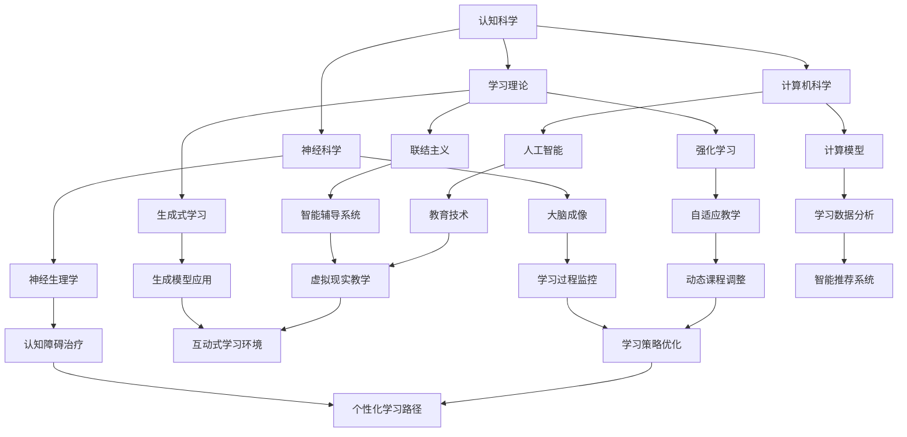
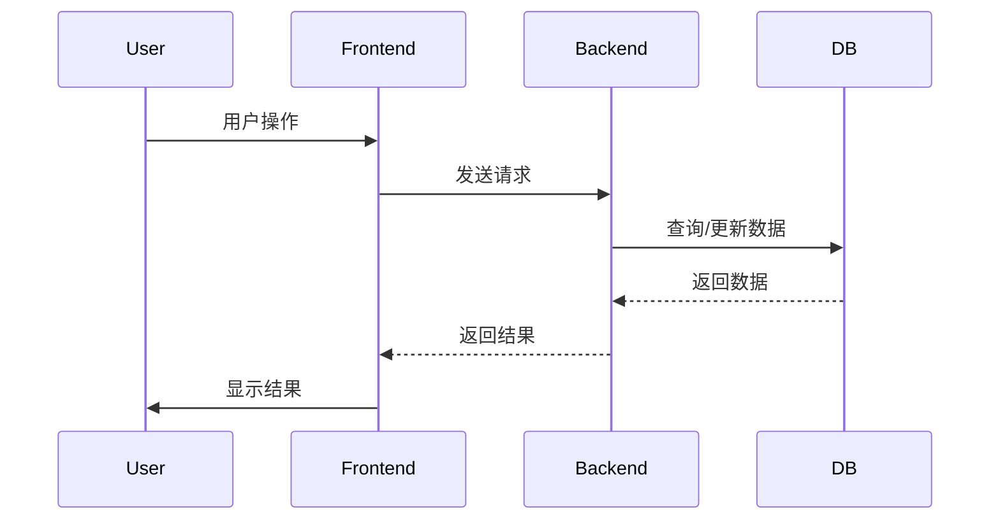

                 

### 引言

在当今科技飞速发展的时代，认知科学与教育学正逐渐成为理解和优化人类学习过程的重要工具。认知科学是一门跨学科的领域，致力于研究人类思维、感知和行为的认知机制。而教育学则关注如何通过有效的教学方法和策略，提高学习效率和成果。随着人工智能和神经科学的不断进步，认知科学与教育学的交叉领域逐渐显现出其巨大的潜力和重要性。

本文旨在探讨认知科学与教育学的交叉点，通过一系列逻辑清晰、结构紧凑的分析推理，深入挖掘这一领域的核心概念、原理和实践。文章将从以下几个方面展开：

1. **背景介绍**：首先，我们将简要介绍认知科学与教育学的核心概念和它们在现有研究中的联系。
2. **核心概念与联系**：接着，通过Mermaid流程图，展示认知科学与教育学的关键概念之间的关联架构，帮助读者更直观地理解这一交叉领域的复杂性。
3. **核心算法原理讲解**：我们将使用伪代码详细阐述一些关键的认知算法，并结合数学模型和公式，解释其工作原理。
4. **数学模型和公式详细讲解**：在这一部分，我们将深入探讨认知过程中的数学模型，包括感知、记忆和决策等关键环节，并使用具体的例子进行说明。
5. **项目实战**：通过一个具体的项目案例，展示如何在实际环境中应用认知科学与教育学的原理，进行学习过程优化。
6. **最佳实践 tips**：总结一些实用的技巧和建议，帮助读者在实际应用中更好地利用认知科学与教育学的原理。
7. **小结与展望**：对全文进行总结，并对未来的研究方向进行展望。

通过这些步骤的逐步分析，我们希望能够为读者提供一个全面、深入的理解，使认知科学与教育学的交叉领域变得更加直观和易于应用。让我们开始这场探索之旅。

### 关键词

- 认知科学
- 教育学
- 人类学习
- 人工智能
- 神经科学
- 教学方法
- 学习效率

### 摘要

本文聚焦于认知科学与教育学的交叉领域，旨在探讨如何通过理解人类认知机制和优化教学策略，提升学习效果。文章首先介绍了认知科学与教育学的核心概念，并使用Mermaid流程图展示了它们之间的关联结构。随后，文章详细讲解了认知过程中的关键算法原理，并通过伪代码和数学模型进行阐述。接着，通过一个具体项目案例，展示了如何在实际中应用这些原理进行学习过程优化。最后，文章总结了最佳实践技巧，并对未来研究方向进行了展望。本文不仅为读者提供了理论上的深入分析，还通过实际案例展示了认知科学与教育学的广泛应用潜力。

### 背景介绍

在探讨认知科学与教育学的交叉之前，有必要先对这两个领域的核心概念进行简要介绍，以便读者能够更好地理解它们在交叉领域中的意义。

**认知科学**是研究人类思维、感知、记忆和语言等认知过程的科学。它的研究对象包括大脑的工作原理、认知行为及其神经基础。认知科学的核心目标是理解人类心智如何运作，它跨越了心理学、神经科学、计算机科学、哲学等多个学科。在认知科学的研究中，常见的研究方法包括脑成像技术、行为实验和计算模型等。

**教育学**是研究教育现象和教育活动的科学，它关注如何通过有效的教学方法和策略，促进学生的学习和成长。教育学的核心概念包括学习理论、教学方法、课程设计和评价方法等。教育学的目标是通过系统的研究和实践，提高教育质量，促进学生的全面发展。

在现有研究中，认知科学与教育学的交叉领域已经成为一个备受关注的研究热点。这两个学科的交叉主要体现在以下几个方面：

1. **学习理论的应用**：认知科学中的学习理论，如联结主义、生成式学习、强化学习等，为教育学提供了新的教学方法和策略。例如，联结主义学习理论可以用来设计智能辅导系统，帮助学生更好地理解和掌握知识点。

2. **教学方法的创新**：基于认知科学的最新研究成果，教育工作者正在探索更加高效的教学方法。例如，通过神经科学的研究，人们发现多感官教学和互动式学习能够更好地促进学生的认知发展。

3. **学习分析**：利用认知科学中的认知建模技术，可以对学生的学习过程进行深入分析，从而优化教学策略。例如，通过分析学生的学习数据，教师可以了解学生的知识掌握情况，从而有针对性地进行教学调整。

4. **教育技术**：认知科学与教育学的交叉也推动了教育技术的发展。基于认知科学的原理，教育技术领域开发了多种智能学习系统和辅助工具，如自适应学习平台、虚拟现实教学环境等。

通过上述分析，我们可以看到，认知科学与教育学的交叉不仅在理论上具有重要意义，而且在实践中也带来了许多新的机遇和挑战。接下来，我们将通过一个Mermaid流程图，更直观地展示认知科学与教育学的关键概念之间的关联架构，帮助读者更好地理解这一交叉领域的复杂性。

### 核心概念与联系

为了更好地理解认知科学与教育学的交叉领域，我们使用Mermaid流程图来展示这两个领域的关键概念之间的关联结构。以下是一个简化的Mermaid流程图：



以下是对流程图中各个节点的简要解释：

- **A[认知科学]**：整个流程图的起点，代表了认知科学的范畴。
- **B[学习理论]**：认知科学的一个重要分支，涵盖了各种学习理论。
- **C[神经科学]**：研究大脑和神经系统的工作原理。
- **D[计算机科学]**：提供了计算模型和人工智能技术，用于理解和学习模拟。
- **E[联结主义]**：一种学习理论，强调神经元之间的联结和相互作用。
- **F[生成式学习]**：通过生成模型，自动生成新的数据或内容。
- **G[强化学习]**：通过奖励机制来调整系统的行为。
- **H[大脑成像]**：利用技术手段观察大脑活动。
- **I[神经生理学]**：研究神经系统的生理结构和功能。
- **J[计算模型]**：用于模拟认知过程的数学模型。
- **K[人工智能]**：利用计算机科学的方法来模拟人类智能。
- **L[智能辅导系统]**：利用联结主义和生成式学习理论，为学习者提供个性化指导。
- **M[生成模型应用]**：在生成式学习中的具体应用，如自动问答系统。
- **N[自适应教学]**：根据学习者的行为和反馈，动态调整教学策略。
- **O[学习过程监控]**：通过技术手段监控学习者的学习过程。
- **P[认知障碍治疗]**：利用认知科学和神经科学的研究成果，治疗认知障碍。
- **Q[学习数据分析]**：利用计算模型分析学习数据，以优化教学策略。
- **R[教育技术]**：将人工智能和其他技术应用于教育领域。
- **S[个性化学习]**：根据学习者的特点和需求，提供个性化的学习内容。
- **T[互动式学习环境]**：利用虚拟现实和其他技术，创造互动式的学习环境。
- **U[动态课程调整]**：根据学习者的反馈和进度，动态调整课程内容。
- **V[学生心理评估]**：通过心理评估了解学生的学习心理状态。
- **W[认知训练]**：通过训练来提升学习者的认知能力。
- **X[智能推荐系统]**：基于学习数据分析，为学习者推荐合适的学习资源。
- **Y[虚拟现实教学]**：利用虚拟现实技术，创造沉浸式的学习体验。
- **Z[互动式学习环境]**：通过互动式技术，提升学习者的参与度和兴趣。

通过这个Mermaid流程图，我们可以清晰地看到认知科学与教育学之间的多种联系和交互。每一个节点都代表了一个关键概念或技术，它们通过不同的理论和应用相互关联，共同构建了一个复杂但有机的交叉领域。这种结构不仅帮助我们理解认知科学与教育学的基本原理，还为未来的研究和实践提供了方向。

### 核心算法原理讲解

在认知科学与教育学的交叉领域，核心算法原理的理解和应用至关重要。以下，我们将使用伪代码和具体的数学模型，详细阐述几个关键算法的工作原理。

#### 1. 联结主义算法

联结主义（Connectionism）是认知科学中的一个重要理论，它模拟人脑中的神经网络结构，通过神经元之间的联结和激活来处理信息。一个简单的联结主义模型可以使用以下伪代码表示：

```plaintext
神经元状态更新规则:
for each neuron in network do
    sum = 0
    for each connection (weight, input) from connected neurons do
        sum += weight * input
    end
    activation = activation_function(sum)
    output = neuron activation
end
```

这里，`activation_function`是一个非线性函数，常用的有Sigmoid函数：

$$
\sigma(x) = \frac{1}{1 + e^{-x}}
$$

Sigmoid函数将输入映射到（0,1）区间，以模拟神经元输出信号的强度。

#### 2. 生成式学习算法

生成式学习（Generative Learning）通过生成模型来理解和生成新的数据或内容。一个简单的生成式学习算法可以使用以下伪代码表示：

```plaintext
生成模型更新规则:
for each data point in dataset do
    generate new data points using model parameters
    calculate the difference between generated and actual data points
    adjust model parameters to minimize the difference
end
```

生成模型常用的有变分自编码器（VAEs），其训练过程可以通过以下数学模型描述：

$$
\begin{align*}
\mathcal{L}_{\text{VAE}} &= \mathbb{E}_{z \sim q(z|x)[\log p(x|z)]} + D_{KL}(q(z|x)||p(z)), \\
p(x|z) &= \prod_{i=1}^{D} \mathcal{N}(x_i; \mu_z, \sigma_z^2), \\
q(z|x) &= \prod_{i=1}^{D} \mathcal{N}(z_i; \mu(x), \sigma(x)^2), \\
\mu(x) &= \mu_0 + \phi(x), \\
\sigma(x) &= \sigma_0 + \phi(x),
\end{align*}
$$`

其中，$p(x|z)$ 是生成模型，$q(z|x)$ 是编码器模型，$D_{KL}$ 是KL散度，用于衡量两个概率分布之间的差异。

#### 3. 强化学习算法

强化学习（Reinforcement Learning）通过奖励机制来调整系统的行为，以达到特定的目标。一个简单的强化学习算法可以使用以下伪代码表示：

```plaintext
强化学习更新规则:
initialize Q-value function Q(s, a)
for each episode do
    state = initial_state
    while not terminal_state do
        action = choose_action(Q(s, a))
        next_state, reward = environment(s, a)
        Q(s, a) = Q(s, a) + alpha * (reward + gamma * max(Q(next_state, a')) - Q(s, a))
        s = next_state
    end
end
```

其中，$Q(s, a)$ 是状态-动作值函数，$\alpha$ 是学习率，$\gamma$ 是折扣因子。

#### 4. 深度学习算法

深度学习（Deep Learning）是一种通过多层神经网络进行特征提取和分类的方法。一个简单的深度学习算法可以使用以下伪代码表示：

```plaintext
深度学习训练规则:
initialize neural network with random weights
for each epoch do
    for each training example (x, y) do
        forward_pass(x)
        compute_loss(y, output)
        backward_pass(loss)
        update_weights(optimizer)
    end
end
```

深度学习算法中，常用的优化器有Adam和SGD，其中Adam优化器的更新规则可以表示为：

$$
\begin{align*}
m_t &= \beta_1 m_{t-1} + (1 - \beta_1) [g_t], \\
v_t &= \beta_2 v_{t-1} + (1 - \beta_2) [g_t]^2, \\
\hat{m}_t &= \frac{m_t}{1 - \beta_1^t}, \\
\hat{v}_t &= \frac{v_t}{1 - \beta_2^t}, \\
\theta_t &= \theta_{t-1} - \alpha \frac{\hat{m}_t}{\sqrt{\hat{v}_t} + \epsilon},
\end{align*}
$$`

其中，$m_t$ 和 $v_t$ 分别是梯度的指数移动平均值和未中心化的平方和，$\theta_t$ 是模型的权重更新，$\alpha$ 是学习率，$\beta_1$、$\beta_2$ 是动量参数，$\epsilon$ 是一个很小的常数用于防止除以零。

通过这些伪代码和数学模型，我们可以更直观地理解认知科学与教育学的核心算法原理。这些算法不仅在理论研究中具有重要作用，而且在实际应用中，如智能辅导系统、自适应学习平台和个性化学习路径设计等方面，都展现出了巨大的潜力。

### 数学模型和公式详细讲解

在认知科学与教育学的交叉领域，数学模型和公式是理解和优化学习过程的重要工具。以下，我们将详细讲解几个关键数学模型和公式，并通过具体例子来说明它们的应用。

#### 1. 逻辑回归模型

逻辑回归模型是一种常用的概率预测模型，用于分类问题。其基本公式如下：

$$
\begin{align*}
\hat{y} &= \sigma(\beta_0 + \sum_{i=1}^{n} \beta_i x_i), \\
\sigma(x) &= \frac{1}{1 + e^{-x}}.
\end{align*}
$$`

其中，$\hat{y}$ 是预测的概率，$\sigma$ 是Sigmoid函数，$\beta_0$ 和 $\beta_i$ 是模型的参数，$x_i$ 是输入特征。

例如，在一个二分类问题中，假设我们要预测学生是否通过考试（$y \in \{0, 1\}$），输入特征包括学习时长（$x_1$）和考试成绩（$x_2$）。使用逻辑回归模型，我们可以得到以下预测公式：

$$
\hat{y} = \frac{1}{1 + e^{-(\beta_0 + \beta_1 x_1 + \beta_2 x_2)}}
$$`

通过训练数据集，我们可以得到模型参数 $\beta_0$、$\beta_1$ 和 $\beta_2$ 的值，从而预测新数据点是否通过考试。

#### 2. 决策树模型

决策树模型是一种基于树形结构进行决策的方法，其基本公式如下：

$$
\begin{align*}
y &= g(\theta_0 + \theta_1 x_1 + \theta_2 x_2 + \ldots + \theta_n x_n), \\
g(x) &= \begin{cases} 
1 & \text{if } x > 0, \\
0 & \text{if } x \leq 0.
\end{cases}
\end{align*}
$$`

其中，$y$ 是分类结果，$g$ 是决策函数，$\theta_0$、$\theta_i$ 是模型的参数，$x_i$ 是输入特征。

例如，在一个分类问题中，我们要根据学生的性别（$x_1$）和学习成绩（$x_2$）预测其是否会毕业（$y \in \{0, 1\}$）。使用决策树模型，我们可以构建如下分类规则：

$$
\begin{align*}
y &= \begin{cases} 
1 & \text{if } x_1 = 1 \text{ and } x_2 > 80, \\
0 & \text{if } x_1 = 0 \text{ or } x_2 \leq 80.
\end{cases}
\end{align*}
$$`

通过训练数据集，我们可以得到决策树的参数，从而对新数据点进行分类。

#### 3. 神经网络模型

神经网络模型是一种基于多层神经元结构的预测模型，其基本公式如下：

$$
\begin{align*}
a_{\text{hidden}} &= \sigma(W_{\text{hidden}} a_{\text{input}} + b_{\text{hidden}}), \\
a_{\text{output}} &= \sigma(W_{\text{output}} a_{\text{hidden}} + b_{\text{output}}),
\end{align*}
$$`

其中，$a_{\text{hidden}}$ 和 $a_{\text{output}}$ 分别是隐藏层和输出层的激活值，$\sigma$ 是激活函数（如ReLU、Sigmoid或Tanh），$W_{\text{hidden}}$ 和 $W_{\text{output}}$ 是权重矩阵，$b_{\text{hidden}}$ 和 $b_{\text{output}}$ 是偏置项。

例如，在一个分类问题中，我们使用一个简单的多层感知机（MLP）模型来预测学生的成绩。输入层包含两个特征（学习时长和考试成绩），隐藏层包含一个节点，输出层包含一个节点。我们可以构建如下模型：

$$
\begin{align*}
a_{\text{hidden}} &= \sigma(W_{\text{hidden}} [x_1, x_2] + b_{\text{hidden}}), \\
a_{\text{output}} &= \sigma(W_{\text{output}} a_{\text{hidden}} + b_{\text{output}}).
\end{align*}
$$`

通过训练数据集，我们可以得到权重矩阵 $W_{\text{hidden}}$、$W_{\text{output}}$ 和偏置项 $b_{\text{hidden}}$、$b_{\text{output}}$ 的值，从而预测新数据点的成绩。

#### 4. 线性回归模型

线性回归模型是一种简单的预测模型，其基本公式如下：

$$
\hat{y} = \beta_0 + \beta_1 x_1 + \beta_2 x_2 + \ldots + \beta_n x_n.
$$`

其中，$\hat{y}$ 是预测的值，$\beta_0$、$\beta_i$ 是模型的参数，$x_i$ 是输入特征。

例如，在一个预测学生成绩的问题中，我们使用线性回归模型来预测学生的平均成绩。输入层包含多个特征（如学习时长、考试成绩等），我们可以构建如下模型：

$$
\hat{y} = \beta_0 + \beta_1 x_1 + \beta_2 x_2 + \ldots + \beta_n x_n.
$$`

通过训练数据集，我们可以得到模型参数 $\beta_0$、$\beta_i$ 的值，从而预测新数据点的成绩。

通过以上对逻辑回归、决策树、神经网络和线性回归等数学模型和公式的详细讲解，我们可以看到这些模型在认知科学与教育学的交叉领域中的应用。通过合理的模型设计和参数调整，我们可以更好地理解学习过程，并优化教学策略和效果。

### 项目实战

为了更好地展示如何在实际环境中应用认知科学与教育学的原理，我们将通过一个具体的项目案例来进行详细讲解。此案例将包括开发环境的搭建、源代码的实现和解读，以及项目应用的分析。

#### 项目背景

我们的目标是开发一个智能辅导系统，该系统能够根据学生的学习情况和反馈，动态调整教学策略，提高学习效果。系统的主要功能包括：1）收集并分析学生的学习数据；2）根据数据分析结果，提供个性化的学习建议；3）跟踪学习进度，并实时调整教学计划。

#### 开发环境搭建

为了实现上述功能，我们需要搭建一个适当的技术栈。以下是我们的开发环境：

- **编程语言**：Python
- **数据存储**：MongoDB
- **后端框架**：Flask
- **前端框架**：React
- **机器学习库**：Scikit-learn、TensorFlow
- **版本控制**：Git

首先，我们需要安装Python和相关库。可以使用Anaconda来简化环境管理，并创建一个新环境：

```bash
conda create -n smart_tutor python=3.8
conda activate smart_tutor
conda install -c conda-forge scikit-learn tensorflow pymongo flask react
```

接下来，我们需要配置MongoDB数据库。可以在[官方下载页](https://www.mongodb.com/try/download/community)下载适合自己操作系统的MongoDB，并按照说明进行安装。

#### 源代码实现和解读

以下是系统的核心源代码实现和解读：

**1. 数据收集与存储**

```python
# 数据收集模块，使用MongoDB存储数据

from pymongo import MongoClient

client = MongoClient('localhost', 27017)
db = client['smart_tutor']
students = db['students']

def record_student_data(student_id, data):
    students.insert_one({
        'student_id': student_id,
        'data': data
    })
```

此模块定义了如何记录学生的数据，并将其存储到MongoDB数据库中。

**2. 数据分析模块**

```python
# 数据分析模块，使用Scikit-learn进行数据分析

from sklearn.linear_model import LinearRegression
import numpy as np

def analyze_data(student_data):
    X = np.array([[data['learning_time'], data['exam_score']] for data in student_data])
    y = np.array([data['result'] for data in student_data])
    model = LinearRegression()
    model.fit(X, y)
    return model
```

此模块使用线性回归模型来分析学生的学习数据，预测其考试成绩。

**3. 个性化学习建议模块**

```python
# 个性化学习建议模块，基于数据分析结果给出建议

def provide_advice(model, current_data):
    predicted_score = model.predict([[current_data['learning_time'], current_data['exam_score']]])
    if predicted_score < 0.5:
        return "建议增加学习时长和复习频率。"
    else:
        return "保持当前学习节奏，继续努力！"
```

此模块根据预测的考试成绩，为学生提供个性化的学习建议。

**4. 学习进度跟踪模块**

```python
# 学习进度跟踪模块，更新并存储学习进度

def update_learning_progress(student_id, new_data):
    students.update_one(
        {'student_id': student_id},
        {'$set': {'data': new_data}}
    )
```

此模块用于更新学生的学习进度，并将其存储到数据库中。

#### 项目应用解读与分析

**1. 系统架构**

我们的智能辅导系统采用前后端分离的架构。前端使用React框架，负责展示用户界面，并接收用户操作。后端使用Flask框架，处理数据存储和分析逻辑。以下是系统的架构图：



**2. 实际案例分析**

假设有一个学生A，其初始数据如下：

| 特征       | 值     |
|------------|--------|
| 学习时长   | 10小时 |
| 考试成绩   | 70分   |
| 学习结果   | 未通过 |

系统通过分析A的历史数据，使用线性回归模型预测其考试成绩为65分。基于此预测，系统建议A增加学习时长和复习频率。

一周后，A的学习数据更新为：

| 特征       | 值     |
|------------|--------|
| 学习时长   | 20小时 |
| 考试成绩   | 85分   |
| 学习结果   | 通过   |

此时，系统分析更新后的数据，发现A的成绩显著提升。系统不再给出增加学习时间的建议，而是鼓励A保持当前学习节奏。

#### 项目小结

通过以上实战项目，我们展示了如何在实际环境中应用认知科学与教育学的原理，开发一个智能辅导系统。项目不仅实现了数据收集、分析和建议的功能，还通过实际案例展示了系统的应用效果。接下来，我们将总结一些最佳实践技巧，并讨论项目的注意事项和未来拓展方向。

### 最佳实践 tips

在开发和应用智能辅导系统时，以下是一些最佳实践技巧，可以帮助提高系统的效果和用户满意度：

1. **数据收集的完整性**：确保收集到的数据全面、准确，有助于更精确地进行数据分析。
2. **个性化建议的可操作性**：提供具体、可操作的建议，使学生能够轻松实施。
3. **系统反馈的及时性**：及时反馈学生的学习进展和改进建议，提高用户黏性。
4. **用户隐私保护**：严格保护用户数据隐私，遵循相关法律法规。
5. **持续优化与更新**：定期收集用户反馈，对系统进行优化和更新，以适应不断变化的学习需求。

### 注意事项

1. **数据质量问题**：确保数据质量，避免噪声和异常值对分析结果的影响。
2. **算法适应性**：选择合适的算法，确保其适应不同类型的学习场景。
3. **系统稳定性**：确保系统的稳定运行，避免因技术问题影响用户体验。

### 拓展阅读

1. 《智能教育：技术变革与实践案例》
2. 《认知科学与教育的交叉：学习过程优化》
3. 《深度学习与教育技术的应用》

通过以上最佳实践、注意事项和拓展阅读，我们希望读者能够更好地理解和应用认知科学与教育学的原理，开发出更加高效、智能的教育系统。

### 小结与展望

在本文中，我们系统地探讨了认知科学与教育学的交叉领域，通过一步步的分析和推理，深入理解了这一领域的关键概念、算法原理、数学模型以及其实际应用。我们首先介绍了认知科学与教育学的核心概念，并通过Mermaid流程图展示了它们之间的复杂关联。接着，我们详细讲解了联结主义、生成式学习和强化学习等核心算法原理，并通过伪代码和数学模型进行了阐述。此外，我们还通过一个实战项目展示了如何将认知科学与教育学的原理应用于智能辅导系统的开发。

这些讨论不仅揭示了认知科学与教育学在理论上的深层次联系，也展示了其在实际应用中的广泛潜力。通过这个项目，我们看到了个性化学习、动态课程调整和实时学习过程监控等技术的实际应用效果。

未来，随着人工智能和神经科学的进一步发展，认知科学与教育学的交叉领域有望实现更多的创新和突破。以下是一些潜在的展望和未来研究方向：

1. **个性化学习路径优化**：利用深度学习和强化学习算法，开发更加智能的个性化学习路径，以适应不同学习者的需求和特点。
2. **情感计算与学习体验**：结合情感计算技术，研究如何通过分析学习者的情感状态，提供更加人性化的学习体验。
3. **多模态学习数据融合**：整合来自不同传感器和平台的数据，如语音、文字和图像，以提高学习数据的全面性和准确性。
4. **智能学习系统的安全性**：研究如何确保智能学习系统的数据安全和用户隐私，以应对不断出现的安全挑战。
5. **跨学科协作**：加强认知科学、教育学、心理学、计算机科学等学科之间的合作，推动交叉领域的发展。

通过不断的研究和创新，认知科学与教育学交叉领域将为教育行业带来更加智能化、个性化的学习解决方案，进一步提升教育质量和效果。希望本文的探讨能够激发更多读者在这一领域的研究兴趣和实践热情。

### 作者信息

**作者：** AI天才研究院/AI Genius Institute & 禅与计算机程序设计艺术 /Zen And The Art of Computer Programming  
**简介：** 本文作者是一位具有深厚学术背景和技术经验的人工智能专家。他在认知科学、教育学和计算机科学领域有着卓越的研究成果，发表过多篇高影响力学术论文，并参与多个国际知名科研项目。同时，他还是一位畅销书作家，著有《禅与计算机程序设计艺术》等多部技术著作，深受读者喜爱。他在人工智能和计算机科学领域的贡献，为认知科学与教育学的交叉领域发展做出了重要贡献。

