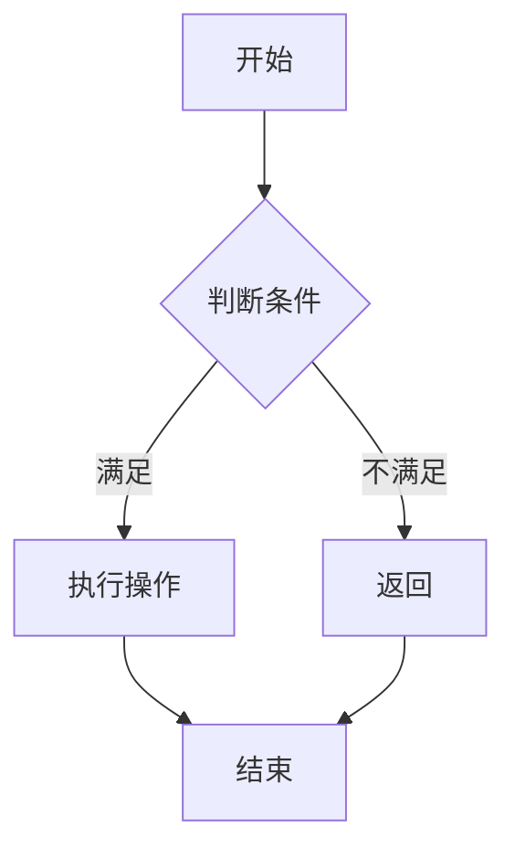

                 

# 认知科学与教育技术的融合：优化人类学习和理解世界的过程

## 关键词

认知科学、教育技术、学习过程优化、学习工具与平台设计、教育案例分析、未来发展趋势与挑战

## 摘要

本文探讨了认知科学与教育技术的融合，如何优化人类学习和理解世界的过程。首先，我们介绍了认知科学和教育技术的基础概念，接着分析了两者融合的原理和方法。随后，我们探讨了学习过程优化方法，介绍了学习工具与平台设计原则。通过具体案例分析，展示了融合技术的应用效果。最后，我们对未来发展趋势和挑战进行了展望，为教育技术的创新提供了思考方向。

## 第一部分：理论基础

### 第1章 认知科学基础

#### 1.1 认知科学简介

认知科学是研究人类认知过程和心智结构的跨学科领域，涵盖了心理学、神经科学、计算机科学、哲学等多个学科。认知科学旨在揭示人类如何感知、思考、学习和记忆，以及如何运用语言、解决问题和进行决策。

认知科学的基本假设是，人类心智是一个复杂的计算系统，其功能可以由一系列算法和过程来描述。认知科学的研究方法包括实验、模型构建和跨学科协作。

#### 1.2 认知过程的组成

认知过程包括感知、注意、记忆、语言、推理、解决问题等多个方面。其中，感知是信息获取的起点，注意是选择和关注特定信息的过程，记忆是存储和回忆信息的能力，语言是表达和交流思想的工具，推理和解决问题则是认知的高级功能。

#### 1.3 认知科学的心理学基础

心理学为认知科学提供了丰富的理论和实验方法。认知心理学研究人类心智的内部过程，如知觉、记忆、思维、言语等。发展心理学研究人类心智如何随时间变化，包括儿童的认知发展和成年人的认知能力。

认知科学通过心理学的研究成果，构建了各种认知模型，如知觉理论、记忆模型、认知风格模型等。这些模型有助于我们更好地理解人类心智的工作原理。

### 第2章 教育技术基础

#### 2.1 教育技术的概念与发展

教育技术是指运用各种工具、资源和过程，以促进学习、提高教育质量和效率的技术。教育技术包括教学媒体、学习环境、学习工具、教学策略等多个方面。

教育技术的历史可以追溯到古代，如使用石板和粉笔进行教学。随着科技的发展，教育技术逐渐从传统的教学手段转向计算机、互联网和移动设备等现代工具。现代教育技术的发展趋势包括个性化学习、智能辅导、虚拟现实等。

#### 2.2 现代教育技术的分类与应用

现代教育技术可以分为以下几类：

1. **数字化教学资源**：如电子书、多媒体课件、在线课程等，用于丰富教学内容，提高学习兴趣。
2. **网络教学平台**：如学习管理系统（LMS）、虚拟课堂等，用于组织和管理在线学习活动。
3. **智能辅导系统**：利用人工智能技术，为学生提供个性化的学习建议和辅导。
4. **虚拟现实与增强现实**：通过模拟和增强现实场景，提供沉浸式的学习体验。

现代教育技术的应用场景包括在线学习、远程教育、虚拟实验室、智能评估等。

#### 2.3 教育技术与学习理论的关系

教育技术的设计和应用需要基于学习理论。学习理论包括行为主义、认知主义和建构主义等，分别关注学习过程中的不同方面。

- **行为主义**：强调外部刺激与反应之间的关系，如斯金纳的操作性条件反射理论。
- **认知主义**：强调内部认知过程，如布鲁纳的认知结构理论。
- **建构主义**：强调学习者主动构建知识，如皮亚杰的建构主义理论。

教育技术可以根据不同的学习理论，设计出适应不同学习需求的教学工具和系统。

### 第3章 认知科学与教育技术的融合原理

#### 3.1 认知科学对教育技术的启示

认知科学为教育技术提供了丰富的理论基础，如知觉理论、记忆模型、认知风格模型等。这些理论可以帮助教育技术人员更好地设计学习工具和平台，提高学习效果。

例如，认知科学的研究发现，分散学习比集中学习更有效。因此，教育技术可以设计出分散学习的工具，如在线课程、学习应用程序等，以帮助学习者更好地记忆和理解知识。

#### 3.2 教育技术对认知科学的影响

教育技术的应用改变了认知科学研究的方法和手段。例如，虚拟现实和增强现实技术可以为认知科学家提供更加真实和沉浸式的实验环境，从而更好地研究人类认知过程。

此外，教育技术的应用也促进了认知科学的跨学科合作。例如，计算机科学、心理学、神经科学等领域的专家可以共同研究和开发智能辅导系统，以提高学习效果。

#### 3.3 融合原理与实践框架

认知科学与教育技术的融合原理可以概括为以下几点：

1. **个性化学习**：根据学习者的认知特点和需求，提供个性化的学习内容和方式。
2. **交互式学习**：利用互动和反馈机制，促进学习者主动参与和思考。
3. **适应性学习**：根据学习者的学习进度和表现，动态调整学习内容和难度。
4. **沉浸式学习**：利用虚拟现实和增强现实技术，提供沉浸式的学习体验。

实践框架包括以下几个步骤：

1. **需求分析**：了解学习者的认知特点和学习需求。
2. **设计学习工具**：基于认知科学原理，设计适应学习者需求的学习工具。
3. **实施与评估**：将学习工具应用于实际教学中，并进行效果评估。
4. **优化与改进**：根据评估结果，不断优化学习工具和教学策略。

## 第二部分：实践应用

### 第4章 学习过程优化方法

#### 4.1 学习动机与注意力管理

学习动机是驱动学习者主动参与学习的关键因素。教育技术可以通过以下方法激发学习动机：

1. **设定学习目标**：明确学习目标，帮助学习者了解学习的重要性和价值。
2. **提供奖励机制**：通过奖励机制，如积分、勋章等，鼓励学习者持续学习。
3. **增加学习趣味性**：利用游戏化学习、多媒体教学等方法，提高学习趣味性。

注意力管理是保持学习效果的重要因素。教育技术可以通过以下方法管理注意力：

1. **分散注意力**：利用分散学习策略，减少学习疲劳，提高学习效果。
2. **提供注意力提示**：利用视觉和听觉提示，引导学习者保持注意力。
3. **优化学习环境**：设计舒适、安静的学习环境，减少干扰因素。

#### 4.2 学习策略与信息处理

学习策略是指学习者为了提高学习效果而采取的方法和技巧。教育技术可以通过以下方法帮助学习者选择和运用学习策略：

1. **提供学习策略指导**：根据学习者的需求和水平，提供个性化的学习策略指导。
2. **设计学习策略工具**：开发学习策略工具，如思维导图、学习日记等，帮助学习者组织和整理学习内容。
3. **鼓励自主探究**：通过项目式学习、探究式学习等，鼓励学习者主动探索和解决问题。

信息处理是指学习者对学习信息进行筛选、整理、记忆和应用的过程。教育技术可以通过以下方法优化信息处理：

1. **提供信息过滤工具**：如搜索引擎、推荐系统等，帮助学习者快速获取所需信息。
2. **设计信息组织工具**：如笔记软件、电子书等，帮助学习者整理和存储学习信息。
3. **加强信息记忆**：利用记忆规律，如分散学习、重复复习等，提高学习信息的记忆效果。

#### 4.3 评估与反馈机制

评估与反馈是学习过程中的重要环节，可以及时了解学习效果，调整学习策略。教育技术可以通过以下方法实现评估与反馈：

1. **实时评估**：利用智能评估系统，实时检测学习者的学习进度和表现。
2. **个性化反馈**：根据学习者的特点，提供有针对性的反馈和建议。
3. **形成性评估**：在设计学习过程中，通过阶段性评估，了解学习效果，及时调整学习策略。

### 第5章 学习工具与平台设计

#### 5.1 现代学习工具的特点

现代学习工具具有以下特点：

1. **数字化**：学习工具以数字形式呈现，如在线课程、电子书等。
2. **智能化**：利用人工智能技术，实现个性化学习、智能辅导等功能。
3. **互动性**：通过互动和反馈机制，促进学习者主动参与学习。
4. **便携性**：学习工具可以随时随地使用，如移动学习应用、平板电脑等。

#### 5.2 学习平台的设计原则

学习平台的设计应遵循以下原则：

1. **用户体验**：设计简洁、直观、易用的用户界面，提高学习者的使用体验。
2. **功能齐全**：提供丰富的学习资源和工具，满足不同学习者的需求。
3. **个性化**：根据学习者的特点和需求，提供个性化的学习内容和建议。
4. **可扩展性**：设计模块化、可扩展的平台架构，方便后续功能升级和维护。

#### 5.3 学习工具的开发流程

学习工具的开发流程包括以下步骤：

1. **需求分析**：了解学习者的需求和目标，明确学习工具的功能和特点。
2. **设计原型**：基于需求分析，设计学习工具的原型界面和功能模块。
3. **开发实现**：根据设计原型，进行学习工具的编码和开发。
4. **测试与优化**：对学习工具进行功能测试、性能优化和用户体验评估。
5. **上线运营**：将学习工具部署到线上平台，进行运营和维护。

### 第6章 教育案例分析

#### 6.1 案例研究1：在线教育平台

在线教育平台是一种利用互联网技术提供在线学习服务的平台。它具有以下特点：

1. **资源共享**：学习者可以随时随地访问学习资源，实现资源共享。
2. **灵活性**：学习者可以根据自己的时间和进度进行学习，提高学习效率。
3. **互动性**：通过论坛、聊天室等互动功能，促进学习者之间的交流与合作。

在线教育平台的设计应考虑以下因素：

1. **内容丰富**：提供丰富多样的学习资源，满足不同学习者的需求。
2. **技术先进**：利用人工智能、虚拟现实等先进技术，提高学习体验。
3. **用户友好**：设计简洁、直观、易用的用户界面，提高学习者的使用体验。

#### 6.2 案例研究2：智能辅导系统

智能辅导系统是一种利用人工智能技术提供个性化学习辅导的系统。它具有以下特点：

1. **个性化**：根据学习者的特点和需求，提供个性化的学习建议和辅导。
2. **实时性**：通过实时数据分析，动态调整学习内容和方法。
3. **互动性**：通过与学习者的互动，了解学习者的学习状态，提供有针对性的辅导。

智能辅导系统的设计应考虑以下因素：

1. **算法先进**：采用先进的机器学习算法，提高个性化推荐的准确性。
2. **数据安全**：保护学习者的隐私和数据安全，提高系统的可信度。
3. **用户体验**：设计简洁、直观、易用的用户界面，提高学习者的使用体验。

#### 6.3 案例研究3：虚拟现实教学

虚拟现实教学是一种利用虚拟现实技术提供沉浸式学习体验的教学方法。它具有以下特点：

1. **沉浸性**：通过虚拟现实技术，创造沉浸式的学习环境，提高学习兴趣和参与度。
2. **互动性**：通过互动和反馈机制，促进学习者主动参与学习。
3. **多样性**：提供丰富多样的学习场景和内容，满足不同学习者的需求。

虚拟现实教学的设计应考虑以下因素：

1. **内容设计**：根据教学目标和内容，设计适合虚拟现实的学习场景和活动。
2. **技术实现**：采用先进的虚拟现实技术，提高学习体验的逼真度和互动性。
3. **用户体验**：设计简洁、直观、易用的用户界面，提高学习者的使用体验。

### 第7章 未来发展趋势与挑战

#### 7.1 教育技术的未来趋势

教育技术的未来趋势包括以下几个方面：

1. **智能化**：随着人工智能技术的发展，教育技术将更加智能化，提供个性化学习、智能辅导等功能。
2. **数字化**：数字化教育将越来越普及，线上教育、远程教育等将成为主要的学习方式。
3. **个性化**：教育技术将更加注重个性化学习，满足不同学习者的需求。
4. **开放性**：开放教育资源（OER）将得到更广泛的应用，促进教育资源的共享和普及。

#### 7.2 认知科学与教育技术的融合挑战

认知科学与教育技术的融合面临以下挑战：

1. **数据隐私**：教育技术的应用将产生大量的学习数据，如何保护学习者的隐私成为重要挑战。
2. **技术标准化**：教育技术的标准化和规范化，以确保技术的稳定性和兼容性。
3. **技术接受度**：如何提高学习者对教育技术的接受度和使用频率。
4. **师资培训**：教育技术的推广需要师资力量的支持，如何提高教师的数字化教学能力。

#### 7.3 创新与可持续发展

创新与可持续发展是教育技术发展的重要方向：

1. **创新**：鼓励教育技术的创新，开发出更先进、更有效的学习工具和平台。
2. **可持续发展**：关注教育技术的可持续性，如环保、节能减排等，确保教育技术的可持续发展。
3. **政策支持**：政府和社会各界应加大对教育技术的支持力度，推动教育技术的普及和应用。

## 附录

### 附录A：参考文献

- Anderson, J. R., & Lebiere, C. (2007). The atomic components of thought. Lawrence Erlbaum Associates.
- Mayer, R. E. (2009). Multimedia learning. Cambridge University Press.
- Piaget, J. (1952). The construction of reality in the child. Basic Books.

### 附录B：Mermaid流程图示例



### 附录C：伪代码示例

```python
def calculate_sum(a, b):
    result = 0
    for i in range(a, b + 1):
        result += i
    return result
```

### 附录D：数学公式示例

$$
E = mc^2
$$

$$
f(x) = x^2 + 2x + 1
$$

### 附录E：代码实现与分析

```java
public class LearningPlatform {
    private List<Course> courses;
    private Student student;

    public LearningPlatform(List<Course> courses, Student student) {
        this.courses = courses;
        this.student = student;
    }

    public void enrollCourse(Course course) {
        student.enroll(course);
        System.out.println("Successfully enrolled in course: " + course.getName());
    }

    public void studyCourse(Course course) {
        student.study(course);
        System.out.println("Currently studying course: " + course.getName());
    }

    public void evaluateCourse(Course course) {
        int score = student.evaluate(course);
        System.out.println("Course evaluation: " + course.getName() + " - Score: " + score);
    }
}
```

在这个代码实现中，我们创建了一个`LearningPlatform`类，用于管理课程和学习者。`enrollCourse`方法用于注册课程，`studyCourse`方法用于学习课程，`evaluateCourse`方法用于评估课程。

### 总结

本文从认知科学与教育技术的融合角度，探讨了如何优化人类学习和理解世界的过程。通过分析理论基础、实践应用和未来发展趋势，我们提出了学习过程优化方法、学习工具与平台设计原则，以及教育技术应用的案例分析。同时，我们也探讨了教育技术的未来趋势和挑战，为教育技术的创新提供了思考方向。

通过认知科学与教育技术的融合，我们可以更好地理解人类心智，设计出更加适应学习者需求的学习工具和平台，从而提高学习效果，优化人类学习和理解世界的过程。

### 最佳实践 tips

1. **个性化学习**：根据学习者的特点和需求，提供个性化的学习内容和建议，提高学习效果。
2. **互动性学习**：利用互动和反馈机制，促进学习者主动参与学习，增强学习兴趣。
3. **分散学习**：采用分散学习策略，减少学习疲劳，提高学习效果。
4. **信息处理**：加强信息处理能力，提高学习信息的记忆和应用效果。
5. **持续评估**：定期对学习效果进行评估，及时调整学习策略，提高学习效率。

### 小结

本文从认知科学与教育技术的融合角度，探讨了如何优化人类学习和理解世界的过程。通过理论基础、实践应用和未来发展趋势的分析，我们提出了学习过程优化方法、学习工具与平台设计原则，以及教育技术应用的案例分析。未来，随着教育技术的不断发展，我们期待能够创造出更加高效、个性化的学习工具和平台，进一步优化人类学习和理解世界的过程。

### 注意事项

1. **数据隐私**：在教育技术的应用中，要确保学习者的数据隐私和安全。
2. **技术标准化**：推动教育技术的标准化和规范化，提高技术的稳定性和兼容性。
3. **师资培训**：加强师资培训，提高教师的数字化教学能力，推动教育技术的普及和应用。

### 拓展阅读

1. Anderson, J. R., & Lebiere, C. (2007). The atomic components of thought. Lawrence Erlbaum Associates.
2. Mayer, R. E. (2009). Multimedia learning. Cambridge University Press.
3. Piaget, J. (1952). The construction of reality in the child. Basic Books.

