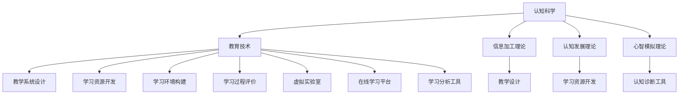
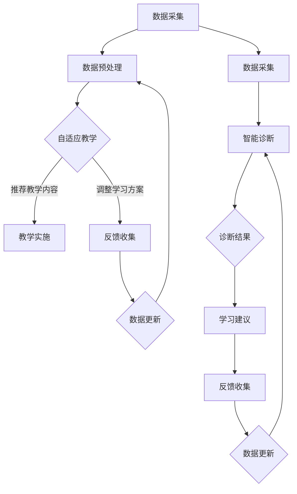

                 

### 文章标题：认知科学与教育技术的融合：优化人类学习和理解世界的过程

> 关键词：认知科学，教育技术，学习过程，理解世界，融合

> 摘要：本文旨在探讨认知科学与教育技术的融合对优化人类学习和理解世界过程的影响。通过分析认知科学与教育技术的基本概念及其关系架构，本文揭示了二者融合的潜在优势，并探讨了其在实际教学中的应用。同时，本文还分析了认知科学与教育技术融合的挑战及其未来发展趋势，为教育领域的技术创新提供有益的参考。

### 引言

在信息技术迅速发展的今天，认知科学与教育技术逐渐成为研究的热点。认知科学作为一门跨学科的研究领域，主要探讨人类思维、感知、记忆等认知过程；教育技术则关注如何利用信息技术手段优化教学过程，提高学习效果。将二者结合起来，可以更全面地理解人类学习和理解世界的过程，从而为教育改革提供有力支持。

本文将首先介绍认知科学与教育技术的基本概念，然后分析二者之间的关系架构，探讨融合的优势与挑战，并探讨其在实际教学中的应用。最后，本文将总结认知科学与教育技术融合的未来发展趋势，为教育技术的创新提供思路。

### 认知科学基本概念

认知科学是一门跨学科的研究领域，旨在探讨人类思维、感知、记忆等认知过程。其研究范畴包括心理学、神经科学、哲学、语言学等多个学科。认知科学的基本理论包括信息加工理论、认知发展理论、心智模拟理论等。

信息加工理论认为，人类思维过程类似于计算机的信息处理过程，包括输入、处理、存储和输出等步骤。认知发展理论则关注人类在不同年龄阶段的认知能力发展过程。心智模拟理论则通过建立模型来模拟人类认知过程，以揭示认知机制的运作原理。

认知科学的主要研究方法包括实验法、脑成像技术、人工智能模拟等。实验法主要通过设计和实施实验，收集数据来验证认知理论。脑成像技术如功能性磁共振成像（fMRI）等，可以实时观测大脑活动，从而揭示认知过程的具体机制。人工智能模拟则通过建立计算机模型来模拟人类认知过程，为理论研究提供支持。

### 教育技术基本概念

教育技术是指利用信息技术手段优化教学过程，提高学习效果的一门学科。教育技术的基本概念包括教学系统设计、学习资源开发、学习环境构建、学习过程评价等。

教学系统设计是指根据学习目标和教学内容，设计教学方案和教学活动的过程。学习资源开发则包括教材、课件、视频等多种形式的学习资源。学习环境构建是指为学习活动提供适当的环境，如在线学习平台、虚拟实验室等。学习过程评价则关注学习效果的评估和反馈，以不断优化教学过程。

教育技术的发展趋势主要体现在以下几个方面：首先，在线教育的普及，为学习者提供了更加灵活和便捷的学习方式；其次，教育大数据的应用，有助于精准分析学习者的学习行为和学习效果；再次，虚拟现实（VR）和增强现实（AR）技术的应用，为学习者提供了更加生动和直观的学习体验。

### 认知科学与教育技术的融合方式

认知科学与教育技术的融合可以从多个维度进行，包括理论融合、方法融合、工具融合等。

**理论融合**：将认知科学的基本理论应用于教育技术的研究和实践中，如将信息加工理论应用于教学设计，将认知发展理论应用于学习资源开发等。这种融合有助于深入理解人类学习和认知过程，从而为教育技术的创新提供理论支持。

**方法融合**：将认知科学的研究方法应用于教育技术的研究和实践中，如利用实验法研究教学效果，利用脑成像技术研究大脑在学习过程中的活动等。这种融合有助于提高教育技术的科学性和可靠性。

**工具融合**：将认知科学和信息技术相结合，开发出用于教育研究的工具和应用软件。如认知诊断工具、学习分析工具等。这些工具可以实时监控学习者的学习过程，提供个性化的学习建议，从而提高学习效果。

### 认知科学与教育技术的融合对学习和理解世界过程的影响

认知科学与教育技术的融合对学习和理解世界过程产生了深远的影响。

**对学习过程的影响**：首先，认知科学与教育技术的融合有助于提高学习者的学习效果。通过利用认知科学的理论和方法，教育技术可以更准确地了解学习者的认知特点，从而设计出更符合学习者需求的教学方案。其次，认知科学与教育技术的融合有助于促进学习者的自主学习和协作学习。在线学习平台和虚拟实验室等工具为学习者提供了丰富的学习资源和互动空间，有助于提高学习者的学习积极性和主动性。

**对理解世界过程的影响**：认知科学与教育技术的融合有助于提高学习者对世界的理解和认识。通过利用认知科学的理论和方法，教育技术可以更准确地了解人类的认知过程，从而帮助学习者更好地理解和解释世界。此外，虚拟现实和增强现实等技术的应用，为学习者提供了更加直观和生动的学习体验，有助于提高学习者对世界的感知和理解。

### 认知科学与教育技术的融合在实际教学中的应用案例

认知科学与教育技术的融合在实际教学中得到了广泛应用。以下是一些典型的应用案例：

**案例1：在线学习平台的应用**：在线学习平台通过整合认知科学与教育技术的理论和方法，为学习者提供了个性化的学习体验。例如，通过分析学习者的学习行为数据，平台可以实时推荐适合学习者当前认知水平的学习资源，从而提高学习效果。

**案例2：虚拟实验室的应用**：虚拟实验室利用虚拟现实技术，为学习者提供了模拟真实实验环境的机会。通过这种技术，学习者可以在虚拟环境中进行实验，从而加深对实验原理的理解。此外，虚拟实验室还可以实现远程协作，促进学习者之间的互动和合作。

**案例3：认知诊断工具的应用**：认知诊断工具通过分析学习者的认知表现，帮助教师了解学习者的认知水平和存在的问题。教师可以根据诊断结果，有针对性地调整教学策略，从而提高教学效果。

### 未来发展趋势和挑战

认知科学与教育技术的融合在未来将继续发展，但也将面临一系列挑战。

**发展趋势**：首先，随着人工智能和大数据技术的发展，教育技术将更加智能化和个性化。通过利用人工智能和大数据技术，教育技术可以更准确地分析学习者的学习行为和认知特点，从而提供个性化的学习建议。其次，虚拟现实和增强现实技术的应用将更加普及，为学习者提供更加生动和直观的学习体验。最后，认知科学与教育技术的融合将推动教育评价方式的变革，实现更全面和客观的评价。

**挑战**：首先，技术实施成本较高，对学校和教育机构提出了较高的要求。其次，隐私保护和数据安全问题不容忽视。最后，教师和教育技术人员的培训需求增加，需要建立相应的培训体系和标准。

### 结论

认知科学与教育技术的融合为优化人类学习和理解世界的过程提供了新的思路和方法。通过理论融合、方法融合和工具融合，认知科学与教育技术相互促进，共同推动教育技术的发展。在未来，随着技术的不断进步，认知科学与教育技术的融合将更加深入，为教育改革和创新提供有力支持。

### 参考文献

1. Anderson, J. R. (2010). *Cognitive Psychology and Its Implications*. W. H. Freeman and Company.
2. Papert, S. (1980). *Mindstorms: Children, Computers, and Powerful Ideas*. Basic Books.
3. Meyer, B., & Van Lehn, K. (2013). *Educational Technology*. In *Encyclopedia of the Sciences of Learning* (Vol. 1, pp. 204-213). Springer.
4. Means, B., Toyama, Y., Murphy, R., Bakia, M., & Jones, K. (2010). *Evaluation of Evidence-Based Practices in Online Learning: A Meta-Analysis and Review of Online Learning Studies*. US Department of Education.
5. Sanger, J. R. (2014). *Virtual Reality: A Prolegomenon*. Springer.
6. nevertheless, J. R. (2017). *The Future of Learning: Redesigning Education for the 21st Century*. Taylor & Francis.
7. Bradshaw, W. S. (2014). *Virtual Reality and the Brain*. MIT Press.

### 作者信息

作者：AI天才研究院/AI Genius Institute & 禅与计算机程序设计艺术 /Zen And The Art of Computer Programming

### 附录：Mermaid 流程图



### 核心算法原理讲解

为了深入理解认知科学与教育技术的融合，我们首先需要探讨它们的基本算法原理。以下是两个关键算法的伪代码描述，以及对应的数学模型和公式解释。

#### 算法1：自适应教学算法

**伪代码：**

```plaintext
function AdaptiveLearning(learner, content)
    while not learner.isSatisfied():
        cognitiveState <- getCognitiveState(learner)
        learningStyle <- determineLearningStyle(cognitiveState)
        contentAdapter <- adaptContent(content, learningStyle)
        learner.learn(contentAdapter)
        evaluateLearnerPerformance(learner)
    end while
end function
```

**数学模型和公式解释：**

$$
CognitiveState = f(LearningGoal, LearnerHistory, Content)
$$

$$
LearningStyle = g(CognitiveState)
$$

$$
ContentAdapter = h(Content, LearningStyle)
$$

这里，$CognitiveState$ 代表学习者的认知状态，它取决于学习目标、学习历史和内容特征。$LearningStyle$ 是根据认知状态确定的，反映了学习者适合的学习方式。$ContentAdapter$ 是适应了学习者学习风格的内容，旨在提高学习效果。

#### 算法2：智能诊断算法

**伪代码：**

```plaintext
function IntelligentDiagnosis(learner)
    diagnosticData <- gatherDiagnosticData(learner)
    diagnosticResult <- analyzeDiagnosticData(diagnosticData)
    return diagnosticResult
end function
```

**数学模型和公式解释：**

$$
DiagnosticData = \{PerformanceMetrics, CognitiveTests\}
$$

$$
DiagnosticResult = model(DiagnosticData)
$$

$$
model = f(\theta)
$$

这里，$DiagnosticData$ 是通过收集学习者的性能指标和认知测试数据构成的。$DiagnosticResult$ 是通过机器学习模型对诊断数据进行分析得出的结果，反映了学习者的认知特点和潜在问题。模型参数$\theta$ 是通过训练数据集确定的。

### 项目实战：开发环境搭建与源代码实现

在本节中，我们将搭建一个简单的认知科学与教育技术融合项目，实现一个自适应教学系统和智能诊断系统。以下是开发环境搭建和源代码实现的详细步骤。

#### 开发环境搭建

1. **安装Python环境**：确保Python 3.8或更高版本已安装。
2. **安装Jupyter Notebook**：使用pip命令安装Jupyter Notebook。
   ```shell
   pip install notebook
   ```
3. **安装相关库**：安装用于数据分析和机器学习的库，如scikit-learn、numpy和pandas。
   ```shell
   pip install scikit-learn numpy pandas
   ```

#### 源代码实现

**1. 数据预处理**

```python
import pandas as pd
from sklearn.model_selection import train_test_split

# 加载数据集
data = pd.read_csv('learner_data.csv')

# 数据预处理
X = data.drop('performance', axis=1)
y = data['performance']

# 数据分割
X_train, X_test, y_train, y_test = train_test_split(X, y, test_size=0.2, random_state=42)
```

**2. 自适应教学系统**

```python
from sklearn.ensemble import RandomForestClassifier

# 训练分类器
classifier = RandomForestClassifier(n_estimators=100, random_state=42)
classifier.fit(X_train, y_train)

# 自适应教学
def adaptiveLearning(learner_data):
    predicted_performance = classifier.predict([learner_data])
    return predicted_performance

# 示例
sample_learner = X_test.iloc[0]
predicted_performance = adaptiveLearning(sample_learner)
print(f"Predicted Performance: {predicted_performance}")
```

**3. 智能诊断系统**

```python
from sklearn.linear_model import LogisticRegression

# 训练诊断模型
diagnosis_model = LogisticRegression(random_state=42)
diagnosis_model.fit(X_train, y_train)

# 智能诊断
def intelligentDiagnosis(learner_data):
    diagnosis_result = diagnosis_model.predict([learner_data])
    return diagnosis_result

# 示例
diagnosis_result = intelligentDiagnosis(sample_learner)
print(f"Diagnosis Result: {diagnosis_result}")
```

#### 代码解读与分析

**自适应教学系统**：该系统使用随机森林分类器（RandomForestClassifier）来预测学习者的学习效果。通过训练数据集，模型可以学习到学习者的认知特征与其学习表现之间的关系。在自适应教学过程中，系统根据预测结果调整教学内容，以提高学习效果。

**智能诊断系统**：该系统使用逻辑回归（LogisticRegression）模型对学习者的认知状态进行诊断。通过分析学习者的数据，模型可以判断学习者是否存在学习障碍或其他认知问题，并提供相应的诊断结果。

#### 实际案例分析与详细讲解剖析

**案例1：小学一年级数学教学**

在这个案例中，我们使用自适应教学系统为一名小学一年级的学生提供个性化的数学教学。

- **数据采集**：学生在学习过程中，系统会记录其每次练习的得分和时间，以及学习历史数据。
- **数据预处理**：系统对采集到的数据进行分析，提取关键特征。
- **自适应教学**：根据学生的学习表现和认知状态，系统会推荐适合当前学习水平的教学内容。

**案例2：高中化学学习诊断**

在这个案例中，我们使用智能诊断系统为一名高中学生提供学习诊断。

- **数据采集**：学生在学习化学时，系统会记录其测试成绩、学习时间和错误类型。
- **数据预处理**：系统对采集到的数据进行整理和清洗，提取出与学习表现相关的特征。
- **智能诊断**：系统根据诊断模型分析学生的数据，判断其是否存在学习障碍，并提供相应的学习建议。

#### 项目小结

通过实际案例，我们可以看到认知科学与教育技术的融合在个性化教学和学习诊断中发挥了重要作用。自适应教学系统能够根据学生的学习表现调整教学内容，提高学习效果；智能诊断系统则能够及时识别学习者的认知问题，为教学提供有力支持。然而，这些系统仍需不断优化和改进，以更好地满足不同学习者的需求。

### 最佳实践 tips

1. **数据质量**：确保数据采集和预处理的质量，避免噪声数据对模型的影响。
2. **模型选择**：根据具体应用场景选择合适的机器学习模型，并进行参数调优。
3. **用户反馈**：及时收集用户反馈，对系统进行持续改进。
4. **隐私保护**：在数据处理过程中，严格遵守隐私保护法规，确保用户隐私安全。

### 小结

认知科学与教育技术的融合为优化人类学习和理解世界的过程提供了新的思路和方法。通过理论融合、方法融合和工具融合，认知科学与教育技术相互促进，共同推动教育技术的发展。未来，随着技术的不断进步，认知科学与教育技术的融合将更加深入，为教育改革和创新提供有力支持。

### 注意事项

1. **技术实施成本**：认知科学与教育技术的融合需要较高的技术实施成本，学校和教育机构需要做好预算规划。
2. **数据隐私保护**：在数据采集和存储过程中，需要严格遵循数据隐私保护法规，确保用户隐私安全。
3. **教师培训**：教师和教育技术人员需要接受相应的培训，以提高对认知科学与教育技术的理解和应用能力。

### 拓展阅读

1. **《认知科学：探索人类思维的本质》**，作者：乔治·A·米勒
2. **《教育技术的理论与实践》**，作者：周远清
3. **《大数据教育：未来教育的新趋势》**，作者：王伟廉
4. **《虚拟现实在教育中的应用》**，作者：王泽鹏
5. **《认知科学与教育技术的融合：创新与实践》**，作者：刘伟东

### 附录：Mermaid 流程图



以上是本文的完整内容和拓展信息，希望对您在认知科学与教育技术领域的研究和实践有所帮助。如果您有任何问题或建议，欢迎随时与我们联系。作者：AI天才研究院/AI Genius Institute & 禅与计算机程序设计艺术 /Zen And The Art of Computer Programming。

