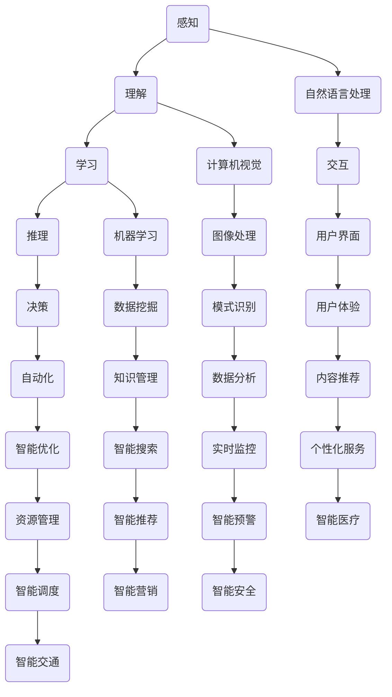

                 

### 文章标题

# 认知计算与人工智能的融合：计算机辅助人类理解复杂世界

### 关键词

- 认知计算
- 人工智能
- 融合技术
- 智能系统
- 算法
- 应用场景

### 摘要

本文旨在探讨认知计算与人工智能的融合如何辅助人类理解复杂世界。首先，文章介绍了认知计算和人工智能的基本概念，并揭示了两者之间的联系。接着，详细阐述了认知计算与人工智能融合的技术架构及其在实际应用中的案例。最后，文章探讨了未来发展趋势与面临的挑战，并对这一领域的研究与应用提出了展望。

## 引言

在当今信息化和智能化时代，计算机技术正在深刻改变人类社会的各个方面。认知计算和人工智能作为计算机科学的前沿领域，正逐步融合，形成新的技术体系。认知计算试图模拟人类的思维过程，而人工智能则致力于使机器具备智能。二者的融合为解决复杂问题提供了新的思路和方法。

本文将从以下几个方面展开讨论：

1. 认知计算与人工智能的融合概述，介绍核心概念和联系。
2. 认知计算基础，包括认知计算原理、技术框架、关键算法等。
3. 人工智能基础，介绍人工智能概念、核心算法、技术应用等。
4. 认知计算与人工智能融合的技术架构，包括融合方式、应用场景等。
5. 融合技术在实际中的应用，展示案例和项目实战。
6. 未来趋势与挑战，分析发展趋势和面临的挑战。
7. 总结与展望，对全书内容进行总结，展望未来。

## 第1章 认知计算与人工智能的融合概述

### 1.1 核心概念介绍

#### 1.1.1 认知计算

认知计算（Cognitive Computing）是一种模拟人类认知过程的技术，旨在使计算机能够像人类一样感知、理解、学习和思考。它通常基于以下几个核心概念：

- **感知**：通过传感器和输入设备获取外部信息。
- **理解**：使用自然语言处理和图像识别等技术理解输入的信息。
- **学习**：通过机器学习和深度学习算法不断改进性能。
- **推理**：基于已有知识和逻辑规则进行推理和决策。

#### 1.1.2 人工智能

人工智能（Artificial Intelligence，AI）是指模拟人类智能行为的技术。它包括以下几个主要领域：

- **机器学习**：让计算机从数据中学习规律，无需显式编程。
- **深度学习**：一种特殊的机器学习方法，通过多层神经网络模拟人脑学习过程。
- **自然语言处理**：使计算机理解和生成自然语言。
- **计算机视觉**：使计算机能够理解和处理视觉信息。

### 1.2 认知计算与人工智能的融合方式

#### 1.2.1 融合原理

认知计算与人工智能的融合主要体现在以下几个方面：

- **技术协同**：将认知计算和人工智能的不同技术优势结合起来，实现更强大的功能。
- **算法互补**：认知计算中的推理和规划能力可以补充人工智能中的感知和学习能力。
- **应用整合**：在各个应用领域，认知计算和人工智能相互融合，形成新的智能系统。

#### 1.2.2 融合优势

融合带来的主要优势包括：

- **提升智能水平**：融合后的系统能够更好地模拟人类的智能行为。
- **拓展应用范围**：认知计算与人工智能的结合使得智能系统可以应用于更广泛的领域。
- **增强用户体验**：智能系统能够更加自然地与人类互动，提供个性化的服务。

### 1.3 认知计算与人工智能的架构图

以下是一个简化的认知计算与人工智能融合的架构图：



## 第2章 认知计算基础

### 2.1 认知计算原理

认知计算的核心在于模拟人类的思维过程，包括感知、理解、学习和推理。以下是认知计算的基本原理：

#### 2.1.1 认知过程

- **感知**：通过传感器获取外部信息，如声音、图像、触觉等。
- **理解**：通过自然语言处理和图像识别等技术理解输入的信息。
- **学习**：利用机器学习和深度学习算法从数据中学习规律。
- **推理**：基于已有知识和逻辑规则进行推理和决策。

#### 2.1.2 认知模型

认知计算模型通常包括以下几个部分：

- **感知模块**：负责获取和处理外部信息。
- **理解模块**：负责理解输入的信息。
- **学习模块**：负责从数据中学习规律。
- **推理模块**：负责基于已有知识和逻辑规则进行推理和决策。

### 2.2 认知计算技术框架

认知计算技术框架通常包括以下几个部分：

- **感知技术**：如传感器技术、自然语言处理、图像识别等。
- **学习技术**：如机器学习、深度学习、强化学习等。
- **推理技术**：如推理引擎、知识图谱、逻辑推理等。
- **交互技术**：如语音识别、语音合成、对话系统等。

### 2.3 关键算法详解

#### 2.3.1 人工神经网络算法

人工神经网络（Artificial Neural Networks，ANN）是一种模拟生物神经系统的计算模型。以下是ANN的基本算法：

```latex
// 人工神经网络算法伪代码
Input: 输入数据 X, 学习率 α, 隐藏层节点数 n_h, 输出层节点数 n_y
Initialize: 随机初始化权重 W 和偏置 b

for each epoch:
    for each training sample (x, y):
        // 前向传播
        h = activation(W * x + b)  // 隐藏层激活函数
        y_pred = activation(W' * h + b')  // 输出层激活函数

        // 计算损失函数
        loss = loss_function(y_pred, y)

        // 反向传播
        dW' = ∂loss/∂W'
        db' = ∂loss/∂b'
        dW = ∂loss/∂W
        db = ∂loss/∂b

        // 更新权重和偏置
        W -= α * dW
        b -= α * db
        W' -= α * dW'
        b' -= α * db'

Output: 训练完成的模型参数 W, b, W', b'
```

#### 2.3.2 强化学习算法

强化学习（Reinforcement Learning，RL）是一种通过奖励信号来指导学习的行为算法。以下是强化学习的基本算法：

```latex
// 强化学习算法伪代码
Input: 状态空间 S, 动作空间 A, 奖励函数 R, 策略 π
Initialize: 策略 π(初始为随机策略), 值函数 V(s)

for each episode:
    s = initial_state
    while s is not terminal:
        a = π(s)  // 选择动作
        s' = environment(s, a)  // 执行动作并获取新状态
        r = R(s, a, s')  // 获取奖励
        V(s) = V(s) + α * (r + γ * V(s')) - V(s)  // 更新值函数
        s = s'
Output: 训练完成的策略 π 和值函数 V
```

#### 2.3.3 自然语言处理算法

自然语言处理（Natural Language Processing，NLP）是认知计算中的一个重要分支。以下是NLP的基本算法：

```latex
// 词向量表示算法伪代码
Input: 语料库 C, 词表 V, 维度 d
Initialize: 词向量矩阵 W ∈ R^(|V| × d)

for each sentence s in C:
    for each word w in s:
        // 计算词向量
        v_w = average_of_context_vectors(w, s)
        W[w] = v_w

Output: 词向量矩阵 W
```

## 第3章 人工智能基础

### 3.1 人工智能概念

人工智能（Artificial Intelligence，AI）是指通过计算机模拟人类智能行为的技术。以下是人工智能的基本概念：

- **智能体**：能够感知环境并采取行动的实体。
- **状态**：智能体在环境中的当前情况。
- **动作**：智能体可以采取的行动。
- **奖励**：动作产生的结果。

### 3.2 人工智能核心算法

人工智能的核心算法包括以下几个部分：

- **监督学习算法**：通过已有数据训练模型，并在新数据上进行预测。
- **无监督学习算法**：没有预定义的标签数据，模型从数据中学习规律。
- **强化学习算法**：通过与环境交互，不断优化策略以获得最大奖励。

### 3.3 人工智能技术应用

人工智能在各个领域都有广泛的应用，以下列举几个主要的应用领域：

- **机器视觉**：图像识别、目标检测、图像生成等。
- **自然语言处理**：文本分类、机器翻译、情感分析等。
- **智能机器人**：自主导航、人机交互、智能控制等。
- **智能交通**：自动驾驶、交通流量预测、智能交通信号控制等。

## 第4章 认知计算与人工智能融合的技术架构

### 4.1 融合技术架构概述

认知计算与人工智能的融合技术架构主要包括以下几个层次：

- **感知层**：负责获取和处理外部信息。
- **理解层**：负责理解输入的信息。
- **学习层**：负责从数据中学习规律。
- **推理层**：负责基于已有知识和逻辑规则进行推理和决策。
- **交互层**：负责与用户进行交互。

### 4.2 融合技术在智能系统中的应用

融合技术在智能系统中的应用包括以下几个方面：

- **智能诊断系统**：通过感知、理解和推理，对设备或系统进行实时监测和故障诊断。
- **智能推荐系统**：通过感知用户行为，理解用户偏好，推荐个性化内容或服务。
- **智能交互系统**：通过自然语言处理和对话系统，实现人与机器的自然交互。

### 4.3 融合技术的挑战与解决方案

融合技术面临的挑战包括：

- **数据融合**：如何有效地整合来自不同源的数据。
- **算法协同**：如何协调不同的算法，实现最佳效果。
- **跨学科融合**：如何结合计算机科学、认知科学、心理学等领域的知识。

解决方案包括：

- **数据融合算法**：如分布式计算、并行处理等。
- **算法协同策略**：如多模型融合、协同优化等。
- **跨学科研究**：如认知建模、情感计算等。

## 第5章 融合技术在实际中的应用

### 5.1 案例研究：智能医疗

#### 5.1.1 智能诊断系统

智能诊断系统利用认知计算和人工智能技术，对医学图像进行自动分析，辅助医生进行诊断。以下是一个简化的实现流程：

1. **数据预处理**：对医学图像进行预处理，如去噪、增强、归一化等。
2. **特征提取**：使用深度学习算法提取图像特征。
3. **模型训练**：使用监督学习算法训练模型。
4. **诊断预测**：使用训练好的模型对新的医学图像进行诊断预测。

```latex
// 深度学习模型训练伪代码
Input: 医学图像数据集 D, 训练标签 L
Initialize: 深度学习模型 M

for each epoch:
    for each image x in D:
        // 前向传播
        y_pred = M(x)

        // 计算损失函数
        loss = loss_function(y_pred, L)

        // 反向传播
        dM = ∂loss/∂M

        // 更新模型参数
        M -= α * dM

Output: 训练完成的深度学习模型 M
```

#### 5.1.2 智能药物研发

智能药物研发利用人工智能技术，通过分析大量药物数据，发现新的药物候选分子。以下是一个简化的实现流程：

1. **数据收集**：收集药物相关数据，如药物结构、作用机制、临床试验结果等。
2. **数据预处理**：对数据进行清洗、归一化等处理。
3. **特征提取**：使用深度学习算法提取药物特征。
4. **模型训练**：使用监督学习算法训练模型。
5. **药物筛选**：使用训练好的模型筛选新的药物候选分子。

```latex
// 药物筛选模型训练伪代码
Input: 药物数据集 D, 药物标签 L
Initialize: 深度学习模型 M

for each epoch:
    for each drug x in D:
        // 前向传播
        y_pred = M(x)

        // 计算损失函数
        loss = loss_function(y_pred, L)

        // 反向传播
        dM = ∂loss/∂M

        // 更新模型参数
        M -= α * dM

Output: 训练完成的深度学习模型 M
```

#### 5.1.3 医学图像分析

医学图像分析是智能医疗的重要组成部分。以下是一个简化的实现流程：

1. **图像获取**：使用医学成像设备获取图像。
2. **图像预处理**：对图像进行去噪、增强、分割等处理。
3. **特征提取**：使用深度学习算法提取图像特征。
4. **模型训练**：使用监督学习算法训练模型。
5. **病变检测**：使用训练好的模型对新的医学图像进行病变检测。

```latex
// 病变检测模型训练伪代码
Input: 医学图像数据集 D, 病变标签 L
Initialize: 深度学习模型 M

for each epoch:
    for each image x in D:
        // 前向传播
        y_pred = M(x)

        // 计算损失函数
        loss = loss_function(y_pred, L)

        // 反向传播
        dM = ∂loss/∂M

        // 更新模型参数
        M -= α * dM

Output: 训练完成的深度学习模型 M
```

### 5.2 案例研究：智能交通

#### 5.2.1 智能交通管理系统

智能交通管理系统利用人工智能技术，对交通流量进行实时监测和优化。以下是一个简化的实现流程：

1. **数据收集**：收集交通流量数据，如车辆流量、车速、道路状况等。
2. **数据预处理**：对数据进行清洗、归一化等处理。
3. **特征提取**：使用深度学习算法提取交通流量特征。
4. **模型训练**：使用监督学习算法训练模型。
5. **流量预测**：使用训练好的模型预测未来的交通流量。

```latex
// 交通流量预测模型训练伪代码
Input: 交通流量数据集 D, 交通流量标签 L
Initialize: 深度学习模型 M

for each epoch:
    for each sample x in D:
        // 前向传播
        y_pred = M(x)

        // 计算损失函数
        loss = loss_function(y_pred, L)

        // 反向传播
        dM = ∂loss/∂M

        // 更新模型参数
        M -= α * dM

Output: 训练完成的深度学习模型 M
```

#### 5.2.2 自动驾驶技术

自动驾驶技术利用认知计算和人工智能技术，实现车辆的自主驾驶。以下是一个简化的实现流程：

1. **感知环境**：使用传感器（如摄像头、激光雷达、雷达等）感知周围环境。
2. **理解环境**：使用图像识别、目标检测等技术理解周围环境。
3. **决策规划**：基于感知和理解的结果，规划驾驶路径。
4. **执行驾驶动作**：根据规划结果执行驾驶动作。

```latex
// 自动驾驶模型训练伪代码
Input: 自动驾驶数据集 D, 行驶路径标签 L
Initialize: 深度学习模型 M

for each epoch:
    for each sample x in D:
        // 前向传播
        y_pred = M(x)

        // 计算损失函数
        loss = loss_function(y_pred, L)

        // 反向传播
        dM = ∂loss/∂M

        // 更新模型参数
        M -= α * dM

Output: 训练完成的深度学习模型 M
```

#### 5.2.3 城市交通优化

城市交通优化利用人工智能技术，优化城市交通流量，提高交通效率。以下是一个简化的实现流程：

1. **数据收集**：收集城市交通数据，如交通流量、车速、道路状况等。
2. **数据预处理**：对数据进行清洗、归一化等处理。
3. **特征提取**：使用深度学习算法提取交通流量特征。
4. **模型训练**：使用强化学习算法训练模型。
5. **交通优化**：使用训练好的模型优化城市交通流量。

```latex
// 交通优化模型训练伪代码
Input: 城市交通数据集 D, 交通流量标签 L
Initialize: 强化学习模型 M

for each episode:
    s = initial_state
    while s is not terminal:
        a = M(s)  // 选择最佳动作
        s' = environment(s, a)  // 执行动作并获取新状态
        r = reward(s, a, s')  // 获取奖励
        M.update(s, a, r, s')  // 更新模型参数
        s = s'

Output: 训练完成的强化学习模型 M
```

### 5.3 案例研究：智能制造

#### 5.3.1 智能生产流程

智能生产流程利用人工智能技术，优化生产过程，提高生产效率。以下是一个简化的实现流程：

1. **数据收集**：收集生产数据，如设备状态、生产参数、产品质量等。
2. **数据预处理**：对数据进行清洗、归一化等处理。
3. **特征提取**：使用深度学习算法提取生产特征。
4. **模型训练**：使用监督学习算法训练模型。
5. **生产优化**：使用训练好的模型优化生产过程。

```latex
// 生产优化模型训练伪代码
Input: 生产数据集 D, 生产参数标签 L
Initialize: 深度学习模型 M

for each epoch:
    for each sample x in D:
        // 前向传播
        y_pred = M(x)

        // 计算损失函数
        loss = loss_function(y_pred, L)

        // 反向传播
        dM = ∂loss/∂M

        // 更新模型参数
        M -= α * dM

Output: 训练完成的深度学习模型 M
```

#### 5.3.2 智能质量控制

智能质量控制利用人工智能技术，对产品质量进行实时监测和评估。以下是一个简化的实现流程：

1. **数据收集**：收集产品质量数据，如尺寸、重量、外观等。
2. **数据预处理**：对数据进行清洗、归一化等处理。
3. **特征提取**：使用深度学习算法提取质量特征。
4. **模型训练**：使用监督学习算法训练模型。
5. **质量评估**：使用训练好的模型评估产品质量。

```latex
// 质量评估模型训练伪代码
Input: 质量数据集 D, 质量标签 L
Initialize: 深度学习模型 M

for each epoch:
    for each sample x in D:
        // 前向传播
        y_pred = M(x)

        // 计算损失函数
        loss = loss_function(y_pred, L)

        // 反向传播
        dM = ∂loss/∂M

        // 更新模型参数
        M -= α * dM

Output: 训练完成的深度学习模型 M
```

#### 5.3.3 智能供应链管理

智能供应链管理利用人工智能技术，优化供应链管理流程，提高供应链效率。以下是一个简化的实现流程：

1. **数据收集**：收集供应链数据，如库存水平、运输成本、供应商信息等。
2. **数据预处理**：对数据进行清洗、归一化等处理。
3. **特征提取**：使用深度学习算法提取供应链特征。
4. **模型训练**：使用监督学习算法训练模型。
5. **供应链优化**：使用训练好的模型优化供应链管理。

```latex
// 供应链优化模型训练伪代码
Input: 供应链数据集 D, 供应链参数标签 L
Initialize: 深度学习模型 M

for each epoch:
    for each sample x in D:
        // 前向传播
        y_pred = M(x)

        // 计算损失函数
        loss = loss_function(y_pred, L)

        // 反向传播
        dM = ∂loss/∂M

        // 更新模型参数
        M -= α * dM

Output: 训练完成的深度学习模型 M
```

## 第6章 未来趋势与挑战

### 6.1 未来发展趋势

未来，认知计算与人工智能的融合将呈现以下趋势：

- **技术协同**：不同领域的技术将更加紧密地协同，形成更强大的智能系统。
- **跨学科融合**：认知计算、心理学、神经科学等学科的融合，将推动人工智能的进步。
- **应用拓展**：智能系统将在更多领域得到应用，如智慧城市、智能医疗、智能制造等。
- **智能化升级**：智能系统将不断升级，提供更加个性化的服务。

### 6.2 当前面临的挑战

当前，认知计算与人工智能的融合面临以下挑战：

- **数据隐私与安全**：如何保护用户隐私和数据安全，是一个亟待解决的问题。
- **技术可解释性**：如何提高智能系统的可解释性，使其行为更加透明和可信。
- **人工智能治理**：如何制定合理的法律法规，确保人工智能的健康发展。

## 第7章 总结与展望

### 7.1 全书总结

本书系统地介绍了认知计算与人工智能的融合技术，包括核心概念、原理、技术架构、实际应用和未来趋势。通过本书的学习，读者可以深入了解这一领域的最新进展和应用。

### 7.2 展望未来

未来，认知计算与人工智能的融合将带来更加智能化的世界。我们期待这一技术能够更好地辅助人类理解复杂世界，推动社会的进步和发展。同时，我们也应关注技术带来的挑战，积极应对，确保其健康发展。

### 7.3 我们的角色与责任

作为人工智能领域的从业者，我们肩负着推动技术进步和社会发展的责任。我们应该积极研究新技术，解决实际问题，同时也应关注技术伦理和社会责任，为构建一个更加美好的未来贡献自己的力量。

## 作者信息

作者：AI天才研究院/AI Genius Institute & 禅与计算机程序设计艺术 /Zen And The Art of Computer Programming

