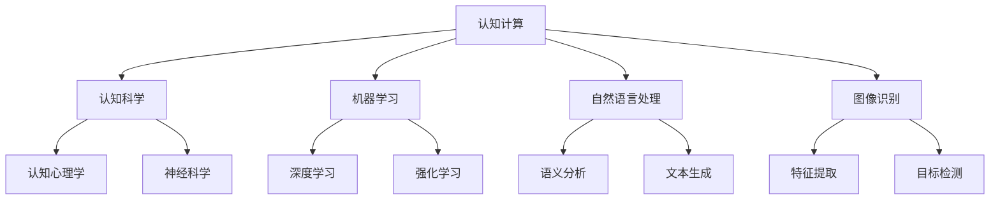
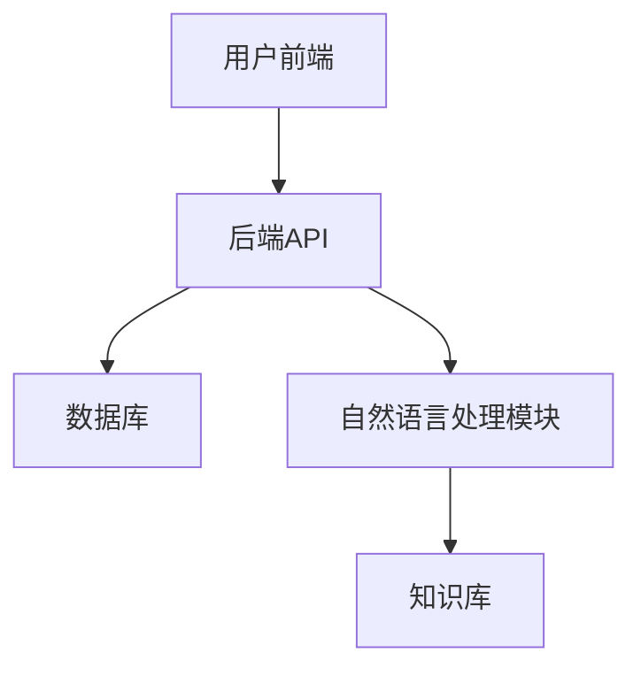

                 

### 设计《认知计算对增强人类理解世界能力的潜力》的文章

#### 1. 文章标题设计

在确定文章标题时，我们需要确保它能够简洁明了地传达文章的核心主题，同时具有吸引力，能够吸引读者的兴趣。对于《认知计算对增强人类理解世界能力的潜力》这篇文章，我们可以设计以下标题：

**“认知计算：解锁人类理解世界的全新维度”**

这个标题首先提到了“认知计算”，直接指向文章的主题；接着用“解锁”和“全新维度”这样的词语，暗示了文章内容的突破性和创新性，能够激发读者的好奇心。

#### 2. 文章关键词

为了确保文章在搜索引擎和读者中有良好的可发现性，我们需要列出几个核心关键词。以下是这篇文章的可能关键词：

- 认知计算
- 人类理解力
- 潜力分析
- 计算模型
- 人工智能
- 自然语言处理
- 图像识别

这些关键词不仅涵盖了文章的主题，还能帮助目标读者快速定位到文章的相关内容。

#### 3. 文章摘要

文章摘要需要简洁地概括文章的主要内容，同时吸引读者继续阅读。以下是这篇文章的摘要示例：

**摘要：**

本文深入探讨了认知计算在增强人类理解世界能力方面的潜力。通过分析认知科学的基础、认知计算的原理及其在不同领域的应用，本文揭示了认知计算如何帮助人类更好地理解复杂的信息。文章还讨论了认知计算的挑战与未来趋势，并通过实际案例展示了其应用前景。阅读本文，您将了解认知计算如何为人类带来全新的理解和认知体验。

#### 4. 文章目录大纲

根据提供的目录大纲，我们可以按照以下结构逐步展开文章的内容：

**1. 引言**

- **1.1 认知计算的概念与背景**
- **1.2 人类理解世界的挑战**
- **1.3 认知计算在提升人类理解力方面的潜力**

**2. 认知计算的基本原理**

- **2.1 认知科学的基础**
  - **2.1.1 人类认知过程的概述**
  - **2.1.2 人类大脑的结构与功能**
  - **2.1.3 认知心理学的基本理论**
- **2.2 认知计算的原理**
  - **2.2.1 认知计算的核心概念**
  - **2.2.2 认知计算的架构与模型**
  - **2.2.3 认知计算的优势与局限性**

**3. 认知计算在理解世界中的应用**

- **3.1 自然语言处理**
  - **3.1.1 文本分析与语义理解**
  - **3.1.2 语言生成与翻译**
  - **3.1.3 跨语言与跨领域的语义理解**
- **3.2 图像识别与处理**
  - **3.2.1 图像特征提取与分类**
  - **3.2.2 目标检测与追踪**
  - **3.2.3 图像生成与风格迁移**
- **3.3 人类行为分析**
  - **3.3.1 行为模式识别**
  - **3.3.2 心理健康与行为干预**
  - **3.3.3 社交网络分析**

**4. 认知计算对人类理解世界的提升**

- **4.1 认知计算的数学模型**
  - **4.1.1 机器学习与深度学习模型**
  - **4.1.2 神经网络与图神经网络**
  - **4.1.3 常用算法的数学基础**
- **4.2 认知计算的实现方法**
  - **4.2.1 数据预处理与特征工程**
  - **4.2.2 模型训练与评估**
  - **4.2.3 模型部署与优化**

**5. 认知计算的挑战与未来趋势**

- **5.1 认知计算的挑战**
  - **5.1.1 数据隐私与伦理问题**
  - **5.1.2 计算资源与能耗问题**
  - **5.1.3 模型解释性与可解释性**
- **5.2 认知计算的未来趋势**
  - **5.2.1 新兴技术的融合应用**
  - **5.2.2 跨学科研究的趋势**
  - **5.2.3 认知计算在产业中的应用前景**

**6. 实际案例研究**

- **6.1 案例一：智能客服系统**
  - **6.1.1 系统架构与实现方法**
  - **6.1.2 系统性能评估与优化**
  - **6.1.3 用户反馈与改进建议**
- **6.2 案例二：智能教育系统**
  - **6.2.1 系统设计与实现**
  - **6.2.2 教育效果评估与反馈**
  - **6.2.3 系统优化与推广**

**7. 结论**

- **7.1 认知计算对人类理解世界的贡献**
- **7.2 认知计算的研究与应用前景**
- **7.3 未来研究方向与挑战**

#### 5. 文章核心概念与联系

在引言部分，我们首先介绍了认知计算的概念，并对其背景进行了简要阐述。为了帮助读者更好地理解认知计算的核心概念及其与其他相关领域的关系，我们可以使用Mermaid流程图来展示这一结构。

以下是认知计算核心概念与联系的Mermaid流程图：



#### 6. 核心算法原理讲解

在文章的第二部分，我们将深入探讨认知计算的基本原理，包括机器学习、深度学习、自然语言处理和图像识别等核心算法。以下是使用伪代码详细阐述机器学习算法的示例：

**6.1 机器学习算法（伪代码）**

```python
# 机器学习算法伪代码

# 初始化模型参数
initialize_model_params()

# 数据预处理
preprocess_data(data)

# 训练模型
for epoch in range(num_epochs):
    for sample in data:
        # 前向传播
        prediction = forward_pass(sample)
        
        # 计算损失
        loss = compute_loss(target, prediction)
        
        # 反向传播
        backward_pass(loss)
        
        # 更新模型参数
        update_model_params()

# 模型评估
evaluate_model(model, validation_data)
```

#### 7. 数学模型和公式讲解

在文章中，我们将介绍认知计算的数学模型，包括神经网络和图神经网络等。以下是使用LaTeX格式展示神经网络基本公式的示例：

**7.1 神经网络基本公式**

```latex
\begin{equation}
    Z = W \cdot X + b
\end{equation}

\begin{equation}
    a = \sigma(Z)
\end{equation}

\begin{equation}
    L = -\frac{1}{m} \sum_{i=1}^{m} y \cdot \log(a) + (1 - y) \cdot \log(1 - a)
\end{equation}
```

这些公式分别代表了前向传播、激活函数以及损失函数的计算方式。

#### 8. 实际案例研究

为了使文章内容更加具体和实用，我们将通过实际案例研究来展示认知计算的应用。以下是智能客服系统的实现步骤和代码解读：

**8.1 案例一：智能客服系统**

**8.1.1 系统架构与实现方法**

智能客服系统的架构通常包括前端界面、后端服务、数据库和自然语言处理模块。以下是一个简单的系统架构图：



实现方法主要包括以下步骤：

1. **前端界面开发**：使用HTML、CSS和JavaScript等技术构建用户界面，实现用户与系统的交互。
2. **后端API开发**：使用Node.js、Python Flask等后端技术构建API，处理用户请求并返回响应。
3. **数据库设计**：使用MySQL、MongoDB等数据库技术存储用户数据和知识库。
4. **自然语言处理**：使用NLTK、spaCy等库进行文本处理和语义分析，构建问答系统。

**8.1.2 代码解读**

以下是一个简单的后端API实现示例（使用Python Flask）：

```python
from flask import Flask, request, jsonify
from nltk.corpus import stopwords
from nltk.tokenize import word_tokenize

app = Flask(__name__)

@app.route('/api/ask', methods=['POST'])
def ask_question():
    data = request.get_json()
    question = data['question']
    processed_question = preprocess_question(question)
    answer = get_answer(processed_question)
    return jsonify({'answer': answer})

def preprocess_question(question):
    # 去除停用词
    stop_words = set(stopwords.words('english'))
    words = word_tokenize(question)
    filtered_words = [word for word in words if word not in stop_words]
    return ' '.join(filtered_words)

def get_answer(processed_question):
    # 查询知识库并返回答案
    # ...（知识库查询逻辑）
    return "This is a placeholder answer."

if __name__ == '__main__':
    app.run(debug=True)
```

**8.1.3 代码应用解读与分析**

在这个示例中，我们接收用户的POST请求，提取问题文本，对其进行预处理（去除停用词），然后查询知识库以获取答案。这个简单的API实现了问答系统的基础功能，但在实际应用中，我们需要更复杂的自然语言处理和知识库管理机制。

**8.1.4 用户反馈与改进建议**

用户反馈是改进系统性能的关键。在案例中，我们可以通过收集用户提问和系统回答的日志，分析用户满意度，并根据反馈进行系统优化。例如，可以通过以下方式改进：

- **改进自然语言处理**：引入更先进的文本处理技术，提高问题的理解和回答的准确性。
- **扩展知识库**：增加更多问题和答案，提高系统的回答能力。
- **优化用户界面**：改善交互设计，提高用户体验。

通过实际案例研究，我们不仅展示了认知计算的应用，还探讨了如何通过用户反馈不断优化系统性能，从而更好地提升人类理解世界的能力。

### 9. 总结与未来展望

在文章的结论部分，我们将总结认知计算对人类理解世界能力的贡献，并探讨未来的研究方向与挑战。

**9.1 认知计算对人类理解世界的贡献**

认知计算通过模拟人类认知过程，显著提升了人类理解复杂信息的能力。在自然语言处理、图像识别、行为分析等领域，认知计算的应用不仅提高了信息的处理效率，还增强了我们理解世界的能力。例如，智能客服系统能够快速理解用户问题并给出准确回答，智能教育系统能够根据学生的学习情况提供个性化辅导。

**9.2 研究与未来趋势**

未来，认知计算的研究将集中在以下几个方面：

- **跨学科融合**：认知计算将与心理学、神经科学、教育学等学科深度融合，推动认知科学的发展。
- **模型解释性**：提高认知计算模型的解释性和可解释性，使研究人员和用户能够更好地理解和信任这些模型。
- **新兴技术**：结合量子计算、区块链等新兴技术，进一步拓展认知计算的应用领域。

**9.3 未来研究方向与挑战**

尽管认知计算取得了显著进展，但未来仍面临一些挑战：

- **数据隐私与伦理**：如何保护用户隐私和数据安全，是认知计算面临的重要伦理问题。
- **计算资源与能耗**：随着模型复杂性的增加，计算资源和能耗的需求也在不断上升，如何优化资源利用是关键问题。
- **模型可解释性**：提高模型的可解释性，使非专业人员也能理解和应用这些模型。

通过总结和展望，我们希望读者能够更加全面地认识认知计算的潜力，并期待未来在认知计算领域的进一步探索和突破。

### 10. 附录

**A.1 认知计算的常用工具与资源**

- **开源库与框架**：
  - TensorFlow
  - PyTorch
  - Keras
  - Theano
- **自然语言处理工具**：
  - NLTK
  - spaCy
  - Stanford NLP
- **图像识别工具**：
  - OpenCV
  - TensorFlow Object Detection API
  - PyTorch Vision
- **在线资源与教程**：
  - Coursera《深度学习》
  - Udacity《人工智能纳米学位》
  - fast.ai《深度学习课程》

**A.2 参考文献**

1. Goodfellow, I., Bengio, Y., & Courville, A. (2016). *Deep Learning*.
2. Russell, S., & Norvig, P. (2020). *Artificial Intelligence: A Modern Approach*.
3. LeCun, Y., Bengio, Y., & Hinton, G. (2015). "Deep learning." Nature, 521(7553), 436-444.
4. Bengio, Y. (2009). "Learning deep architectures." Found. Trends Mach. Learn., 2(1), 1-127.
5. Mitchell, T. M. (1997). "Machine learning." McGraw-Hill.
6. Wallach, H., & Webber, C. L. (2017). "Ethics and Data Privacy in AI". Springer.

