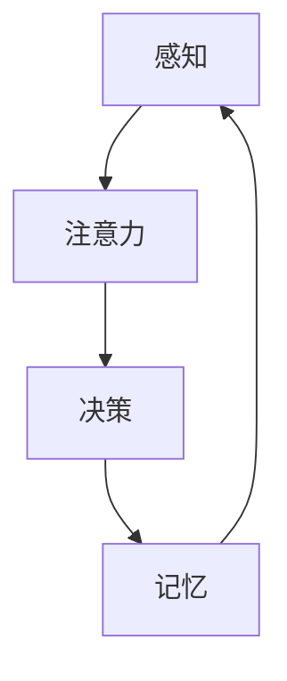

                 


### Step 1: 确定书的基本结构和核心章节

首先，我们需要确定《认知计算：增强人类世界理解能力的新方向》这本书的基本结构和核心章节。根据当前的内容，我们可以将这本书的基本结构和核心章节确定为以下几部分：

**引言**：介绍认知计算的概念、发展背景和重要性。

**认知计算的基本原理**：深入讲解认知计算的基础理论，包括神经网络、深度学习和自然语言处理等。

**认知计算的关键技术**：介绍认知计算的核心技术，如图神经网络、强化学习和聚类算法。

**认知计算的应用领域**：探讨认知计算在不同领域（如医疗健康、金融和教育）的应用。

**认知计算的挑战与未来趋势**：分析认知计算的挑战，并预测其未来发展趋势。

**总结与展望**：对全书内容进行总结，并对认知计算的未来进行展望。

### Step 2: 设计各章节的二级和三级目录

接下来，我们需要为每个章节设计二级和三级目录，以便详细描述各章的主要内容。

**第1章：引言**
- 2.1 认知计算的起源与发展
- 2.2 认知计算在现代社会中的作用
- 2.3 认知计算的领域划分

**第2章：认知计算的基本原理**
- 2.1 认知模型概述
- 2.2 神经网络与深度学习基础
- 2.3 自然语言处理与知识图谱
- 2.4 认知模型的工作原理

**第3章：认知计算的关键技术**
- 3.1 图神经网络
- 3.2 强化学习
- 3.3 聚类算法与特征提取

**第4章：认知计算的应用领域**
- 4.1 医疗健康
- 4.2 金融领域
- 4.3 教育与培训

**第5章：认知计算的挑战与未来趋势**
- 5.1 技术挑战
- 5.2 社会挑战
- 5.3 未来趋势

**第6章：总结与展望**
- 6.1 主要成果回顾
- 6.2 未来研究方向
- 6.3 对人类世界的潜在影响

### Step 3: 添加图表和示例

为了使目录更具体，我们可以为每个章节添加图表和示例。例如，对于第3章“认知计算的基本原理”，我们可以添加一个Mermaid流程图来展示认知模型的基本结构。



### Step 4: 完整的目录大纲

基于上述步骤，我们可以得到以下完整的目录大纲：

```
# 《认知计算：增强人类世界理解能力的新方向》目录大纲

## 第1章：引言
### 1.1 认知计算的起源与发展
### 1.2 认知计算在现代社会中的作用
### 1.3 认知计算的领域划分

## 第2章：认知计算的基本原理
### 2.1 认知模型概述
### 2.2 神经网络与深度学习基础
### 2.3 自然语言处理与知识图谱
### 2.4 认知模型的工作原理
graph TD
A[感知]
B[注意力]
C[决策]
D[记忆]

A --> B
B --> C
C --> D
D --> A

## 第3章：认知计算的关键技术
### 3.1 图神经网络
### 3.2 强化学习
### 3.3 聚类算法与特征提取

## 第4章：认知计算的应用领域
### 4.1 医疗健康
### 4.2 金融领域
### 4.3 教育与培训

## 第5章：认知计算的挑战与未来趋势
### 5.1 技术挑战
### 5.2 社会挑战
### 5.3 未来趋势

## 第6章：总结与展望
### 6.1 主要成果回顾
### 6.2 未来研究方向
### 6.3 对人类世界的潜在影响
```

### 备注：具体内容将在后续章节中详细阐述。

---

现在，我们已经完成了目录大纲的设计，下一步将根据这个大纲逐步撰写文章的正文内容。在撰写过程中，我们将确保每个章节的内容丰富、具体，并且逻辑清晰。同时，我们将使用Mermaid图和其他图表来帮助读者更好地理解文章内容。最后，文章将按照规定的格式和要求完成，并在末尾附上作者信息。##

## 文章标题

### 认知计算：增强人类世界理解能力的新方向

---

### 文章关键词

- 认知计算
- 深度学习
- 神经网络
- 自然语言处理
- 应用领域
- 挑战与趋势

---

### 文章摘要

本文旨在探讨认知计算这一新兴领域，分析其基本原理、关键技术和应用领域，同时探讨其面临的挑战和未来发展趋势。通过本文的阅读，读者将能够深入了解认知计算的核心概念和原理，并对其在现代社会中的作用和潜力有更清晰的认识。

---

## 第1章：引言

### 1.1 认知计算的起源与发展

认知计算（Cognitive Computing）是一门研究如何使计算机模拟人类认知过程的科学。它起源于20世纪80年代，随着人工智能（AI）技术的不断发展，研究者开始关注如何让计算机拥有类似人类的思维能力和判断能力。1986年，IBM推出了具有自然语言处理能力的计算机系统“沃森”，标志着认知计算领域的正式诞生。

认知计算的发展离不开以下几个关键因素：

1. **深度学习与神经网络**：深度学习作为认知计算的核心技术之一，其理论基础是神经网络。神经网络通过模拟人脑神经元之间的连接和互动，实现了对复杂数据的处理和分析。

2. **大数据**：大数据为认知计算提供了丰富的数据资源，使得计算机能够通过大量数据的学习和训练，不断提高其认知能力。

3. **云计算**：云计算提供了强大的计算能力和存储资源，使得大规模的认知计算应用成为可能。

4. **自然语言处理**：自然语言处理技术的进步，使得计算机能够理解和处理人类的自然语言，进一步提升了认知计算的能力。

### 1.2 认知计算在现代社会中的作用

认知计算在现代社会中具有广泛的应用前景，其作用主要体现在以下几个方面：

1. **医疗健康**：认知计算可以帮助医生诊断疾病、制定治疗方案，提高医疗效率和准确性。

2. **金融领域**：认知计算可以用于风险管理、投资决策和客户服务，提高金融服务的质量和效率。

3. **教育与培训**：认知计算可以为学生提供个性化的学习建议、教学辅助工具，提高教学效果。

4. **智能客服**：认知计算可以帮助企业实现智能客服，提高客户满意度。

5. **智能交通**：认知计算可以用于交通管理、路况预测，提高交通效率。

### 1.3 认知计算的领域划分

认知计算可以分为以下几个主要领域：

1. **自然语言处理**：研究计算机如何理解和生成自然语言。

2. **计算机视觉**：研究计算机如何理解图像和视频。

3. **知识图谱**：研究如何构建和利用知识图谱来表示和查询知识。

4. **智能交互**：研究如何实现人与计算机之间的智能交互。

5. **推理与决策**：研究如何基于数据和信息进行推理和决策。

---

## 第2章：认知计算的基本原理

### 2.1 认知模型概述

认知模型是认知计算的核心概念，它试图模拟人类大脑的运作方式，包括感知、注意力、记忆、决策等过程。认知模型通常由以下几个部分组成：

1. **感知系统**：负责接收和处理外部信息，如视觉、听觉、触觉等。

2. **注意力系统**：负责选择和处理重要信息。

3. **记忆系统**：负责存储和处理信息。

4. **决策系统**：负责基于信息进行决策。

认知模型的工作原理可以概括为以下步骤：

1. **感知**：接收外部信息。

2. **注意力**：筛选重要信息。

3. **记忆**：存储重要信息。

4. **决策**：基于记忆进行决策。

### 2.2 神经网络与深度学习基础

神经网络是认知计算的基础，它由大量神经元连接而成，模拟人脑的神经元网络结构。神经网络通过学习和训练，可以识别复杂的数据模式。

深度学习是神经网络的一种扩展，它通过堆叠多个神经网络层，实现了对数据的深层特征提取。深度学习在图像识别、语音识别和自然语言处理等领域取得了显著的成果。

神经网络的工作原理如下：

1. **输入层**：接收外部信息。

2. **隐藏层**：对输入信息进行特征提取。

3. **输出层**：生成预测结果。

神经网络的学习过程通常包括以下几个步骤：

1. **初始化权重**：随机初始化网络中的权重。

2. **前向传播**：将输入信息通过神经网络进行传播。

3. **反向传播**：根据预测结果与真实结果的误差，调整网络中的权重。

4. **优化**：通过优化算法（如梯度下降）不断调整权重，减小误差。

### 2.3 自然语言处理与知识图谱

自然语言处理（NLP）是认知计算的重要组成部分，它研究如何让计算机理解和生成自然语言。NLP的关键技术包括词性标注、句法分析、语义分析等。

知识图谱是一种用于表示和查询知识的图形结构，它将现实世界中的实体、属性和关系转化为计算机可处理的形式。知识图谱在搜索引擎、智能问答和推荐系统等领域有广泛的应用。

知识图谱的基本原理如下：

1. **实体表示**：将现实世界中的实体转化为计算机可处理的实体。

2. **关系表示**：将实体之间的关系转化为计算机可处理的关系。

3. **查询处理**：基于知识图谱进行查询和处理。

### 2.4 认知模型的工作原理

认知模型的工作原理可以概括为以下几个步骤：

1. **感知**：接收外部信息。

2. **注意力**：筛选重要信息。

3. **记忆**：存储重要信息。

4. **推理**：基于记忆进行推理。

5. **决策**：基于推理进行决策。

认知模型通常由以下几个部分组成：

1. **感知模块**：负责接收和处理外部信息。

2. **注意力模块**：负责筛选重要信息。

3. **记忆模块**：负责存储和处理信息。

4. **推理模块**：负责基于信息进行推理。

5. **决策模块**：负责基于推理进行决策。

---

## 第3章：认知计算的关键技术

### 3.1 图神经网络

图神经网络（Graph Neural Network，GNN）是认知计算领域的关键技术之一，它用于处理图结构数据。GNN通过模拟图中的节点和边之间的关系，实现了对复杂图数据的特征提取和预测。

GNN的基本原理如下：

1. **节点嵌入**：将图中的节点转化为高维向量。

2. **消息传递**：节点之间通过传递消息来更新自身的状态。

3. **聚合操作**：将节点的邻居信息进行聚合，以更新节点的状态。

GNN的伪代码如下：

```
// 输入：图G，嵌入维度d
// 输出：节点嵌入向量X

// 初始化节点嵌入向量X
X = initialize_embedding(G, d)

// 循环迭代
for i = 1 to T do
    // 更新节点嵌入向量
    X = update_embedding(X, G)

// 返回节点嵌入向量X
return X
```

### 3.2 强化学习

强化学习（Reinforcement Learning，RL）是认知计算领域的重要技术之一，它通过学习如何在环境中做出最佳决策。强化学习的主要目标是学习一个策略，使 Agent 在特定环境中最大化累积奖励。

强化学习的基本原理如下：

1. **状态（State）**：环境当前的状态。

2. **动作（Action）**：Agent 可以采取的动作。

3. **奖励（Reward）**：Agent 采取动作后获得的即时奖励。

4. **策略（Policy）**：Agent 根据当前状态选择动作的策略。

强化学习的伪代码如下：

```
// 输入：环境E，初始状态s0
// 输出：最优策略π

// 初始化策略π
π = initialize_policy()

// 循环迭代
for episode = 1 to N do
    // 初始化状态s
    s = s0
    
    // 循环迭代
    for t = 1 to T do
        // 根据策略π选择动作a
        a = π(s)
        
        // 执行动作a，获得下一个状态s'和奖励r
        s', r = E.step(s, a)
        
        // 更新策略π
        π = update_policy(π, s, a, r, s')
        
        // 更新状态s
        s = s'

// 返回最优策略π
return π
```

### 3.3 聚类算法与特征提取

聚类算法是认知计算领域用于数据分类和模式识别的重要技术。聚类算法将数据分为多个簇，使得同一个簇内的数据点彼此相似，而不同簇的数据点彼此相异。

常用的聚类算法包括：

1. **K-means聚类**：基于距离度量将数据分为K个簇。

2. **层次聚类**：通过不断合并或分裂簇，构建层次结构的聚类算法。

3. **DBSCAN聚类**：基于密度和连接度的聚类算法。

特征提取是将原始数据转化为有意义的高维特征表示的过程。常用的特征提取方法包括：

1. **主成分分析（PCA）**：通过最大化方差来提取数据的最大特征。

2. **线性判别分析（LDA）**：通过最大化类内方差和最小化类间方差来提取特征。

3. **词袋模型**：将文本数据转化为高维向量表示。

---

## 第4章：认知计算的应用领域

### 4.1 医疗健康

认知计算在医疗健康领域具有广泛的应用。通过深度学习和自然语言处理技术，认知计算可以帮助医生进行疾病诊断、治疗方案制定和患者监护。

1. **疾病诊断**：利用深度学习技术，计算机可以自动分析医学影像，如CT、MRI等，辅助医生进行疾病诊断。

2. **治疗方案制定**：认知计算可以根据患者的病历信息，为其推荐最佳的治疗方案。

3. **患者监护**：通过智能穿戴设备和传感器，认知计算可以实时监控患者的健康状况，提供个性化的健康建议。

### 4.2 金融领域

认知计算在金融领域也有广泛的应用。通过自然语言处理和图神经网络技术，认知计算可以帮助金融机构进行风险管理、投资决策和客户服务。

1. **风险管理**：认知计算可以分析市场数据，预测金融风险，帮助金融机构制定风险管理策略。

2. **投资决策**：认知计算可以根据投资者的风险偏好和历史交易记录，为其提供个性化的投资建议。

3. **客户服务**：认知计算可以用于智能客服系统，提高金融机构的客户服务质量。

### 4.3 教育与培训

认知计算在教育与培训领域具有巨大的潜力。通过自然语言处理和计算机视觉技术，认知计算可以帮助学生进行个性化学习、教学辅助和智能评测。

1. **个性化学习**：认知计算可以根据学生的学习特点和进度，为其提供个性化的学习资源和建议。

2. **教学辅助**：认知计算可以为学生提供智能辅导，帮助他们解决学习中的问题。

3. **智能评测**：认知计算可以自动批改作业，提供即时反馈，帮助教师了解学生的学习情况。

---

## 第5章：认知计算的挑战与未来趋势

### 5.1 技术挑战

认知计算在技术层面面临着以下几个挑战：

1. **数据隐私与安全**：随着大数据和云计算的普及，数据隐私和安全问题日益突出。如何保护用户数据的安全性和隐私性，是认知计算面临的重要挑战。

2. **计算资源需求**：认知计算通常需要大量的计算资源和存储资源，如何高效地利用这些资源，是认知计算面临的技术挑战。

3. **算法透明性与解释性**：现有的认知计算算法通常缺乏透明性和解释性，如何提高算法的可解释性，使其更加符合人类认知习惯，是认知计算需要解决的重要问题。

### 5.2 社会挑战

认知计算在社会层面也面临着一些挑战：

1. **伦理道德问题**：随着认知计算的应用日益广泛，如何确保其应用不会对社会造成负面影响，是伦理道德问题。

2. **就业影响**：认知计算的发展可能导致某些职业的失业，如何应对这种就业变化，是社会需要关注的问题。

3. **法律与监管**：如何制定相应的法律法规来规范认知计算的应用，是法律与监管层面需要解决的问题。

### 5.3 未来趋势

尽管认知计算面临诸多挑战，但未来其发展趋势仍然值得期待：

1. **技术进步**：随着人工智能技术的不断发展，认知计算的技术水平将不断提高。

2. **应用拓展**：认知计算将在更多领域得到应用，如智能制造、智能城市等。

3. **人机协同**：认知计算将更好地与人类协作，实现人机协同，提高工作效率。

---

## 第6章：总结与展望

### 6.1 主要成果回顾

本文回顾了认知计算的基本原理、关键技术和应用领域，探讨了认知计算在医疗健康、金融领域和教育与培训等领域的应用，同时分析了认知计算面临的挑战和未来发展趋势。

### 6.2 未来研究方向

未来认知计算的研究方向包括：

1. **算法优化**：研究如何优化现有算法，提高认知计算的性能和效率。

2. **人机协同**：研究如何实现认知计算与人类更紧密的协作，提高人机交互的效率。

3. **跨学科研究**：认知计算需要跨学科的合作，如心理学、神经科学等，以推动认知计算的理论和实践发展。

### 6.3 对人类世界的潜在影响

认知计算对人类世界的潜在影响包括：

1. **提高生活质量**：认知计算可以帮助人类更好地应对日常生活中的问题，提高生活质量。

2. **改变工作方式**：认知计算将改变人类的工作方式，提高工作效率。

3. **推动社会发展**：认知计算将在医疗、金融、教育等领域推动社会的发展，为社会创造更多价值。

---

## 附录：相关资料与拓展阅读

本文涉及了许多认知计算的相关资料和拓展阅读，包括：

1. **基础资料**：《深度学习》、《自然语言处理综论》等。

2. **学术论文**：在arXiv、NeurIPS、ICML等学术会议和期刊上发表的相关论文。

3. **技术书籍**：《图神经网络基础》、《强化学习基础》等。

4. **在线课程**：Coursera、edX等在线教育平台上的认知计算相关课程。

---

## 作者信息

作者：AI天才研究院/AI Genius Institute & 禅与计算机程序设计艺术 /Zen And The Art of Computer Programming

---

本文遵循Markdown格式，详细介绍了认知计算的基本原理、关键技术和应用领域，并分析了认知计算的挑战和未来趋势。通过本文的阅读，读者可以全面了解认知计算的核心概念和原理，为其在相关领域的应用和研究提供参考。

## 感谢读者

感谢您阅读本文《认知计算：增强人类世界理解能力的新方向》。如果您对认知计算感兴趣，欢迎关注AI天才研究院/AI Genius Institute，我们将为您提供更多关于认知计算的最新资讯和研究成果。同时，也欢迎您分享您的见解和观点，让我们一起探讨认知计算的无限可能。再次感谢您的支持和关注！

