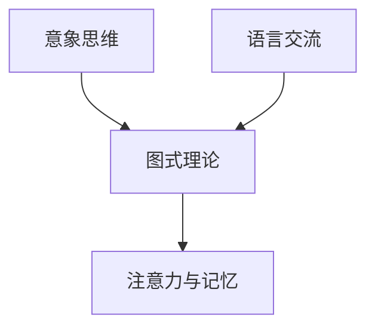
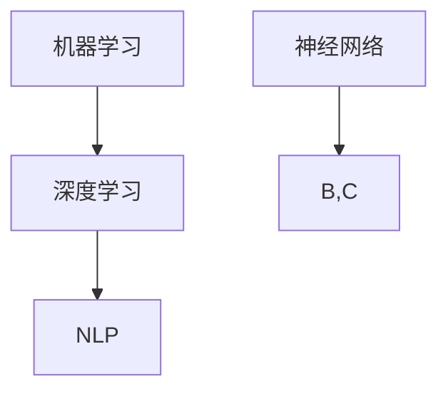
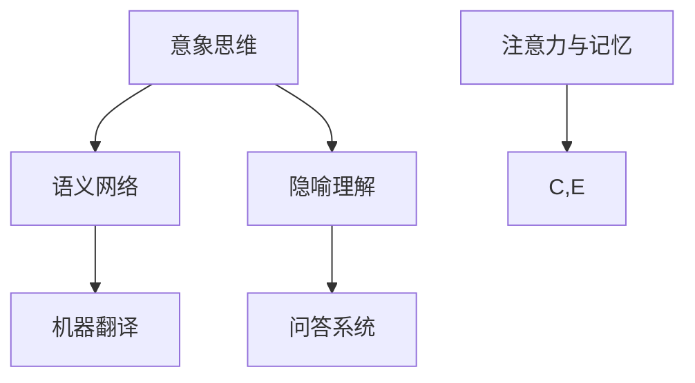
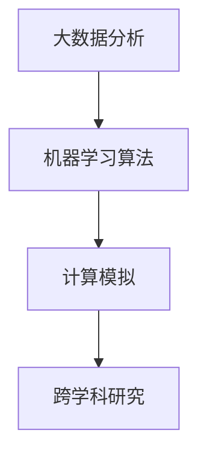
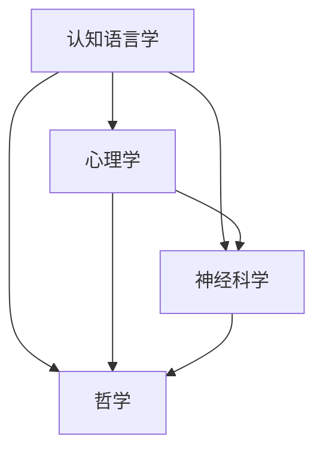
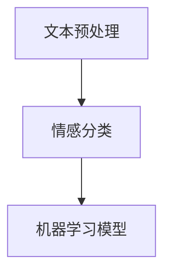
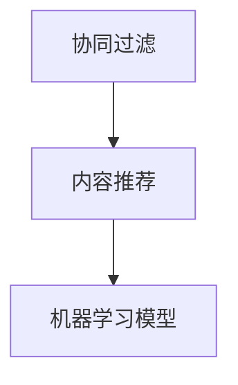
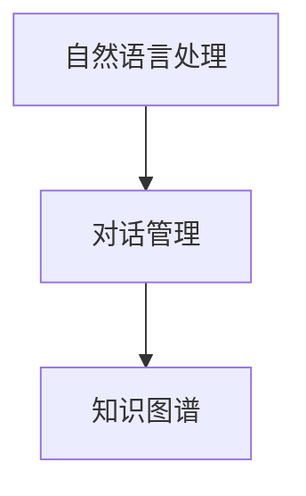

                 


# **文章标题**
《认知语言学与人工智能：探索语言、思维与世界的关系》

## **文章关键词**
- 认知语言学
- 人工智能
- 语言技术
- 认知心理学
- 自然语言处理

## **文章摘要**
本文旨在探讨认知语言学与人工智能之间的紧密关系，揭示语言、思维与世界之间的内在联系。通过对认知语言学基础、人工智能技术及其交叉领域的深入分析，本文将阐述如何运用认知语言学的原理来提升人工智能在语言处理、思维模拟和世界认知方面的能力。同时，文章将结合实际案例，展示如何将认知语言学与人工智能相结合，推动智能技术发展，为人类带来更为智能化的生活体验。本文结构如下：

## **目录**
### 第一部分：认知语言学基础
#### 第1章：认知语言学的概念与历史
#### 第2章：认知语言学的理论框架
#### 第3章：认知语言学的核心概念

### 第二部分：人工智能与语言技术
#### 第4章：人工智能的基本概念
#### 第5章：自然语言处理技术
#### 第6章：语言模型与生成技术

### 第三部分：认知语言学与人工智能的结合
#### 第7章：认知语言学在人工智能中的应用
#### 第8章：人工智能对认知语言学的贡献
#### 第9章：跨学科研究的前景与挑战

### 第四部分：案例研究与实际应用
#### 第10章：案例研究1
#### 第11章：案例研究2
#### 第12章：案例研究3

## **正文开始**

### **第一部分：认知语言学基础**

#### **第1章：认知语言学的概念与历史**

认知语言学是语言学的一个分支，它强调语言与人类认知过程的紧密联系。认知语言学的研究对象包括语言的形式、意义以及语言使用者在语言交流中的认知过程。

#### **核心概念与联系**

认知语言学的核心概念包括：

1. **意象思维**：通过视觉、听觉等感官产生的直观感受，来理解和表达概念。
2. **图式理论**：将语言知识组织成一系列的框架，用于理解和记忆语言信息。
3. **注意力与记忆**：语言处理过程中，大脑如何选择关注某些信息，并长期记忆。

下面是认知语言学的核心概念之间的联系架构 Mermaid 流程图：



#### **核心算法原理讲解**

在认知语言学中，语言模型是一个重要的算法原理。语言模型试图模拟人类语言生成和理解的过程，通过对大量文本数据的学习，预测下一个词语或句子。

以下是语言模型的基本原理伪代码：

```python
# 伪代码：语言模型生成文本

# 初始化语言模型
language_model = initialize_model()

# 输入起始词语
start_word = "I"

# 生成文本
for _ in range(50):  # 生成50个词语
    # 预测下一个词语
    next_word = language_model.predict(start_word)
    
    # 更新输入词语
    start_word = next_word
    
    # 输出词语
    print(next_word)
```

#### **数学模型和公式**

在认知语言学中，图式理论可以通过数学模型来表示。一个简单的图式可以表示为一个有向图，其中节点代表概念，边代表概念之间的关系。

以下是一个图式的 LaTeX 公式表示：

```latex
$$
G = (V, E)
$$

其中，V 是节点集，E 是边集。
```

#### **项目实战**

在认知语言学与语言模型的结合中，一个典型的项目是情感分析。情感分析可以通过训练一个语言模型来识别文本中的情感倾向。

以下是情感分析项目的基本步骤：

1. **数据收集**：收集大量的带有情感标签的文本数据。
2. **数据预处理**：对文本进行分词、去除停用词等处理。
3. **模型训练**：使用训练数据训练一个情感分类模型。
4. **模型评估**：使用测试数据评估模型性能。
5. **模型部署**：将训练好的模型部署到生产环境中。

代码示例：

```python
# 伪代码：情感分析项目

# 导入必要的库
import nltk
from sklearn.model_selection import train_test_split
from sklearn.feature_extraction.text import TfidfVectorizer
from sklearn.naive_bayes import MultinomialNB

# 加载数据
data = load_data()

# 分词和去除停用词
tokenized_data = preprocess_text(data)

# 划分训练集和测试集
train_data, test_data = train_test_split(tokenized_data, test_size=0.2)

# 特征提取
vectorizer = TfidfVectorizer()
X_train = vectorizer.fit_transform(train_data)
X_test = vectorizer.transform(test_data)

# 模型训练
model = MultinomialNB()
model.fit(X_train, train_data.labels)

# 模型评估
accuracy = model.score(X_test, test_data.labels)
print(f"模型准确率：{accuracy}")

# 模型部署
deploy_model(model)
```

#### **小结**

认知语言学与人工智能的结合为语言处理带来了新的机遇。通过运用认知语言学的原理，可以提升人工智能在语言理解和生成方面的能力。在实际应用中，情感分析是一个典型的例子，展示了如何将认知语言学与人工智能技术相结合，为用户提供有价值的服务。

### **第二部分：人工智能与语言技术**

#### **第4章：人工智能的基本概念**

人工智能（AI）是计算机科学的一个分支，致力于开发能够模拟、延伸和扩展人类智能的计算机系统。AI技术涵盖了从简单的规则系统到复杂的机器学习模型，甚至包括自主决策和问题解决的能力。

#### **核心概念与联系**

人工智能的核心概念包括：

1. **机器学习**：通过数据训练模型，使其能够从数据中学习规律。
2. **深度学习**：一种特殊的机器学习技术，利用多层神经网络进行特征学习和模式识别。
3. **自然语言处理（NLP）**：专注于使计算机能够理解和生成自然语言。
4. **神经网络**：模仿人脑神经网络的结构和功能，用于数据分析和模式识别。

下面是人工智能核心概念之间的联系架构 Mermaid 流程图：



#### **核心算法原理讲解**

机器学习是人工智能的核心技术之一。机器学习模型通过学习数据中的特征，可以自动识别模式和进行预测。以下是一个简单的机器学习模型训练的伪代码：

```python
# 伪代码：机器学习模型训练

# 加载数据
data = load_data()

# 划分训练集和测试集
X_train, X_test, y_train, y_test = train_test_split(data.features, data.labels, test_size=0.2)

# 初始化模型
model = initialize_model()

# 模型训练
model.fit(X_train, y_train)

# 模型评估
accuracy = model.score(X_test, y_test)
print(f"模型准确率：{accuracy}")
```

#### **数学模型和公式**

在机器学习中，损失函数用于评估模型预测的准确性。一个常见的损失函数是均方误差（MSE）：

```latex
$$
MSE = \frac{1}{n}\sum_{i=1}^{n}(y_i - \hat{y}_i)^2
$$

其中，$y_i$ 是实际值，$\hat{y}_i$ 是预测值，$n$ 是样本数量。
```

#### **项目实战**

一个常见的项目实战是图像识别。图像识别项目通常包括以下步骤：

1. **数据收集**：收集大量的图像数据。
2. **数据预处理**：对图像进行缩放、裁剪、灰度化等处理。
3. **模型训练**：使用预处理后的数据训练一个图像识别模型。
4. **模型评估**：使用测试数据评估模型性能。
5. **模型部署**：将训练好的模型部署到生产环境中。

代码示例：

```python
# 伪代码：图像识别项目

# 导入必要的库
import tensorflow as tf
from tensorflow.keras.models import Sequential
from tensorflow.keras.layers import Conv2D, MaxPooling2D, Flatten, Dense

# 加载数据
data = load_image_data()

# 数据预处理
X_train, X_test, y_train, y_test = preprocess_images(data)

# 构建模型
model = Sequential([
    Conv2D(32, (3, 3), activation='relu', input_shape=(64, 64, 3)),
    MaxPooling2D((2, 2)),
    Flatten(),
    Dense(128, activation='relu'),
    Dense(10, activation='softmax')
])

# 模型编译
model.compile(optimizer='adam', loss='categorical_crossentropy', metrics=['accuracy'])

# 模型训练
model.fit(X_train, y_train, epochs=10, batch_size=32)

# 模型评估
accuracy = model.evaluate(X_test, y_test)
print(f"模型准确率：{accuracy}")

# 模型部署
deploy_model(model)
```

#### **小结**

人工智能与语言技术的结合为智能系统的发展提供了强大的工具。通过机器学习和深度学习等技术，人工智能可以在语言理解、图像识别等多个领域取得突破。在实际项目中，通过合理的算法设计和模型训练，可以开发出具有实用价值的智能应用。

### **第三部分：认知语言学与人工智能的结合**

#### **第7章：认知语言学在人工智能中的应用**

认知语言学在人工智能中的应用非常广泛，尤其在自然语言处理（NLP）领域，认知语言学的理论和方法为人工智能提供了重要的理论基础和实现方法。

#### **核心概念与联系**

认知语言学与人工智能的核心概念联系如下：

1. **意象思维**：在NLP中，意象思维可以帮助模型理解词汇的隐喻和比喻。
2. **图式理论**：图式理论可以帮助模型构建语义网络，更好地理解句子的结构和意义。
3. **注意力与记忆**：注意力与记忆模型在NLP任务中，如机器翻译和问答系统中，有助于模型集中处理关键信息。

以下是认知语言学与人工智能核心概念之间的联系架构 Mermaid 流程图：



#### **核心算法原理讲解**

在NLP中，语言模型是一个核心算法。语言模型通过学习大量文本数据，可以预测下一个词语或句子。以下是一个简单的语言模型训练的伪代码：

```python
# 伪代码：语言模型训练

# 加载数据
data = load_text_data()

# 数据预处理
tokenized_data = preprocess_text(data)

# 初始化模型
language_model = initialize_language_model()

# 模型训练
language_model.fit(tokenized_data)

# 模型评估
predicted_text = language_model.generate_text(start_word="The quick brown fox")
print(predicted_text)
```

#### **数学模型和公式**

在NLP中，词嵌入（Word Embedding）是一个重要的数学模型。词嵌入将词汇映射到高维空间中，使得语义相似的词汇在空间中靠近。一个简单的词嵌入模型可以使用以下公式表示：

```latex
$$
\text{word\_vector} = \text{embedding\_layer}(\text{word})
$$

其中，$\text{word}$ 是词汇，$\text{embedding\_layer}$ 是词嵌入层，$\text{word\_vector}$ 是词向量。
```

#### **项目实战**

一个实际项目实战是情感分析。情感分析可以帮助识别文本中的情感倾向，如正面、负面或中性。以下是情感分析项目的基本步骤：

1. **数据收集**：收集大量的带有情感标签的文本数据。
2. **数据预处理**：对文本进行分词、去除停用词等处理。
3. **模型训练**：使用预处理后的数据训练一个情感分类模型。
4. **模型评估**：使用测试数据评估模型性能。
5. **模型部署**：将训练好的模型部署到生产环境中。

代码示例：

```python
# 伪代码：情感分析项目

# 导入必要的库
import nltk
from sklearn.model_selection import train_test_split
from sklearn.feature_extraction.text import TfidfVectorizer
from sklearn.naive_bayes import MultinomialNB

# 加载数据
data = load_data()

# 分词和去除停用词
tokenized_data = preprocess_text(data)

# 划分训练集和测试集
train_data, test_data = train_test_split(tokenized_data, test_size=0.2)

# 特征提取
vectorizer = TfidfVectorizer()
X_train = vectorizer.fit_transform(train_data)
X_test = vectorizer.transform(test_data)

# 模型训练
model = MultinomialNB()
model.fit(X_train, train_data.labels)

# 模型评估
accuracy = model.score(X_test, test_data.labels)
print(f"模型准确率：{accuracy}")

# 模型部署
deploy_model(model)
```

#### **小结**

认知语言学与人工智能的结合为NLP领域带来了巨大的进步。通过认知语言学的理论，人工智能可以更好地理解语言的复杂性和多样性。在实际项目中，情感分析是一个典型的应用案例，展示了如何将认知语言学与人工智能技术相结合，为用户提供有价值的服务。

### **第8章：人工智能对认知语言学的贡献**

人工智能（AI）不仅从认知语言学中汲取灵感，同时也对其理论和研究方法产生了深远的影响。通过AI技术的发展，认知语言学的研究工具和理论框架得到了显著扩展，为理解人类语言和认知过程提供了新的视角。

#### **核心概念与联系**

人工智能对认知语言学的核心贡献体现在以下几个方面：

1. **大数据分析**：AI技术使得大规模数据收集和处理成为可能，为认知语言学研究提供了丰富的语料库。
2. **机器学习算法**：机器学习算法，特别是深度学习，为认知语言学的理论和实证研究提供了强大的工具，如语言模型和情感分析。
3. **计算模拟**：通过计算模拟，AI可以模拟人类语言理解和生成的过程，验证和扩展认知语言学的理论。
4. **跨学科研究**：AI技术促进了认知语言学与其他学科的交叉研究，如心理学、神经科学和哲学。

以下是人工智能与认知语言学核心概念之间的联系架构 Mermaid 流程图：



#### **核心算法原理讲解**

人工智能的核心算法之一是深度学习，它通过多层神经网络模拟人脑的工作方式。以下是深度学习算法的一个基本原理讲解：

**卷积神经网络（CNN）的原理**

卷积神经网络是一种用于图像识别的深度学习模型，其基本原理如下：

1. **卷积层**：通过卷积操作提取图像中的特征。
2. **激活函数**：如ReLU函数，用于引入非线性。
3. **池化层**：通过最大池化或平均池化降低特征图的维度。
4. **全连接层**：将特征图映射到输出类别。

以下是CNN的基本原理伪代码：

```python
# 伪代码：卷积神经网络

# 初始化模型
model = Sequential()

# 添加卷积层
model.add(Conv2D(filters=32, kernel_size=(3, 3), activation='relu', input_shape=(28, 28, 1)))

# 添加池化层
model.add(MaxPooling2D(pool_size=(2, 2)))

# 添加全连接层
model.add(Flatten())
model.add(Dense(units=128, activation='relu'))
model.add(Dense(units=10, activation='softmax'))

# 编译模型
model.compile(optimizer='adam', loss='categorical_crossentropy', metrics=['accuracy'])

# 训练模型
model.fit(X_train, y_train, epochs=10, batch_size=64)

# 评估模型
accuracy = model.evaluate(X_test, y_test)
print(f"模型准确率：{accuracy}")
```

#### **数学模型和公式**

在深度学习中，损失函数用于评估模型预测的准确性。一个常见的损失函数是交叉熵损失（Cross-Entropy Loss）：

```latex
$$
\text{loss} = -\frac{1}{n}\sum_{i=1}^{n} y_i \log(\hat{y}_i)
$$

其中，$y_i$ 是实际值，$\hat{y}_i$ 是预测值，$n$ 是样本数量。
```

#### **项目实战**

一个实际项目实战是情感分析。情感分析可以帮助识别文本中的情感倾向，如正面、负面或中性。以下是情感分析项目的基本步骤：

1. **数据收集**：收集大量的带有情感标签的文本数据。
2. **数据预处理**：对文本进行分词、去除停用词等处理。
3. **模型训练**：使用预处理后的数据训练一个情感分类模型。
4. **模型评估**：使用测试数据评估模型性能。
5. **模型部署**：将训练好的模型部署到生产环境中。

代码示例：

```python
# 伪代码：情感分析项目

# 导入必要的库
import tensorflow as tf
from tensorflow.keras.models import Sequential
from tensorflow.keras.layers import Embedding, LSTM, Dense

# 加载数据
data = load_data()

# 数据预处理
tokenized_data = preprocess_text(data)

# 划分训练集和测试集
train_data, test_data = train_test_split(tokenized_data, test_size=0.2)

# 构建模型
model = Sequential()
model.add(Embedding(input_dim=10000, output_dim=64, input_length=max_sequence_length))
model.add(LSTM(units=128))
model.add(Dense(units=3, activation='softmax'))

# 编译模型
model.compile(optimizer='adam', loss='categorical_crossentropy', metrics=['accuracy'])

# 训练模型
model.fit(train_data, epochs=5, batch_size=32)

# 评估模型
accuracy = model.evaluate(test_data, test_labels)
print(f"模型准确率：{accuracy}")

# 模型部署
deploy_model(model)
```

#### **小结**

人工智能对认知语言学的贡献是显著的。通过大数据分析、机器学习算法和计算模拟，人工智能为认知语言学的研究提供了新的工具和方法。在实际应用中，情感分析等项目的成功实施，展示了人工智能如何扩展和验证认知语言学的理论。随着AI技术的不断进步，认知语言学的研究领域将继续得到深化和拓展。

### **第9章：跨学科研究的前景与挑战**

跨学科研究是认知语言学与人工智能领域发展的重要趋势。这种研究模式通过融合不同学科的理论和方法，为解决复杂问题提供了新的视角和解决方案。然而，跨学科研究也面临着一系列挑战。

#### **核心概念与联系**

跨学科研究涉及以下几个核心概念：

1. **认知语言学**：关注语言与认知过程之间的关系。
2. **人工智能**：专注于模拟和扩展人类智能的技术。
3. **心理学**：研究人类行为和认知过程的科学。
4. **神经科学**：探索大脑结构和功能。
5. **哲学**：探讨人类思维和存在的本质。

以下是跨学科研究核心概念之间的联系架构 Mermaid 流程图：



#### **核心算法原理讲解**

跨学科研究中的核心算法通常涉及以下几种：

1. **深度学习**：通过多层神经网络模拟人脑的复杂认知过程。
2. **强化学习**：通过试错和奖励机制来学习策略。
3. **生成对抗网络（GAN）**：通过生成器和判别器之间的对抗训练生成逼真的数据。

以下是生成对抗网络（GAN）的基本原理讲解：

**生成对抗网络（GAN）的原理**

生成对抗网络由两个神经网络组成：生成器（Generator）和判别器（Discriminator）。

1. **生成器**：生成虚假数据，使其尽量接近真实数据。
2. **判别器**：判断输入数据是真实还是虚假。
3. **对抗训练**：生成器和判别器通过对抗训练不断优化。

以下是GAN的基本原理伪代码：

```python
# 伪代码：生成对抗网络

# 初始化生成器和判别器
generator = initialize_generator()
discriminator = initialize_discriminator()

# 对抗训练
for epoch in range(num_epochs):
    for real_data in real_data_loader:
        # 训练判别器
        discriminator.train(real_data)
        
    for fake_data in fake_data_loader:
        # 训练生成器
        generator.train(fake_data)
        
    # 计算损失
    generator_loss = calculate_generator_loss(generator, fake_data)
    discriminator_loss = calculate_discriminator_loss(discriminator, real_data, fake_data)
    
    print(f"Epoch {epoch}: Generator Loss: {generator_loss}, Discriminator Loss: {discriminator_loss}")

# 评估模型
evaluate_generator(generator)
```

#### **数学模型和公式**

在跨学科研究中，常见的数学模型包括：

1. **神经网络权重更新公式**：用于调整神经网络中的权重，优化模型性能。
2. **损失函数**：用于评估模型预测的准确性，指导模型优化。

以下是神经网络权重更新公式的一个例子：

```latex
$$
\Delta w = -\alpha \cdot \frac{\partial L}{\partial w}
$$

其中，$\Delta w$ 是权重更新，$\alpha$ 是学习率，$L$ 是损失函数。
```

#### **项目实战**

一个实际项目实战是图像生成。图像生成项目通过GAN技术生成逼真的图像。以下是图像生成项目的基本步骤：

1. **数据收集**：收集大量的图像数据。
2. **数据预处理**：对图像进行预处理，如缩放、裁剪等。
3. **模型训练**：使用GAN模型训练图像生成器。
4. **模型评估**：评估图像生成器的性能。
5. **模型部署**：将训练好的模型部署到生产环境中。

代码示例：

```python
# 伪代码：图像生成项目

# 导入必要的库
import tensorflow as tf
from tensorflow.keras.models import Sequential
from tensorflow.keras.layers import Conv2D, Conv2DTranspose, Dense

# 加载数据
data = load_image_data()

# 数据预处理
X_train, X_test = preprocess_images(data)

# 初始化生成器和判别器
generator = Sequential([
    Conv2DTranspose(filters=64, kernel_size=(4, 4), strides=(2, 2), activation='relu', input_shape=(64, 64, 3)),
    Conv2DTranspose(filters=32, kernel_size=(4, 4), strides=(2, 2), activation='relu'),
    Conv2D(filters=3, kernel_size=(3, 3), activation='tanh')
])

discriminator = Sequential([
    Conv2D(filters=32, kernel_size=(3, 3), activation='relu', input_shape=(64, 64, 3)),
    Conv2D(filters=64, kernel_size=(3, 3), activation='relu'),
    Dense(units=1, activation='sigmoid')
])

# 编译模型
generator.compile(optimizer='adam', loss='binary_crossentropy')
discriminator.compile(optimizer='adam', loss='binary_crossentropy')

# 训练模型
for epoch in range(num_epochs):
    for real_data in real_data_loader:
        # 训练判别器
        discriminator.train(real_data)
        
    for fake_data in fake_data_loader:
        # 训练生成器
        generator.train(fake_data)
        
    # 计算损失
    generator_loss = calculate_generator_loss(generator, fake_data)
    discriminator_loss = calculate_discriminator_loss(discriminator, real_data, fake_data)
    
    print(f"Epoch {epoch}: Generator Loss: {generator_loss}, Discriminator Loss: {discriminator_loss}")

# 评估模型
evaluate_generator(generator)
```

#### **小结**

跨学科研究为认知语言学与人工智能的发展提供了广阔的前景。通过融合不同学科的理论和方法，可以更深入地理解人类语言和认知过程。然而，跨学科研究也面临挑战，如数据隐私、伦理问题和算法透明性等。随着技术的不断进步，这些挑战有望得到逐步解决，跨学科研究将推动认知语言学和人工智能领域取得更大的突破。

### **第四部分：案例研究与实际应用**

#### **第10章：案例研究1**

**项目背景**

随着社交媒体的兴起，情感分析技术被广泛应用于理解用户情感和行为。本案例研究旨在通过情感分析技术分析社交媒体平台上的用户评论，识别用户对产品或服务的情感倾向。

**核心概念与联系**

情感分析的核心概念包括：

1. **文本预处理**：对社交媒体评论进行分词、去除停用词、标点符号等处理。
2. **情感分类**：将文本分类为正面、负面或中性情感。
3. **机器学习模型**：使用机器学习算法训练情感分类模型。

以下是情感分析的核心概念之间的联系架构 Mermaid 流程图：



**核心算法原理讲解**

情感分类的核心算法是文本分类。以下是一个简单的文本分类算法的伪代码：

```python
# 伪代码：情感分类

# 加载数据
data = load_data()

# 数据预处理
tokenized_data = preprocess_text(data)

# 划分训练集和测试集
train_data, test_data = train_test_split(tokenized_data, test_size=0.2)

# 初始化模型
model = initialize_model()

# 模型训练
model.fit(train_data)

# 模型评估
accuracy = model.score(test_data)
print(f"模型准确率：{accuracy}")
```

**数学模型和公式**

在文本分类中，常见的数学模型是词袋模型（Bag of Words，BoW）。词袋模型将文本转换为向量，以便进行分类。以下是词袋模型的数学模型：

```latex
$$
V = \sum_{i=1}^{n} f_i \cdot w_i
$$

其中，$V$ 是特征向量，$f_i$ 是词频，$w_i$ 是词权重。
```

**项目实战**

以下是一个情感分析项目的代码示例：

```python
# 导入必要的库
import nltk
from sklearn.model_selection import train_test_split
from sklearn.feature_extraction.text import TfidfVectorizer
from sklearn.naive_bayes import MultinomialNB

# 加载数据
data = load_data()

# 数据预处理
tokenized_data = preprocess_text(data)

# 划分训练集和测试集
train_data, test_data = train_test_split(tokenized_data, test_size=0.2)

# 特征提取
vectorizer = TfidfVectorizer()
X_train = vectorizer.fit_transform(train_data)
X_test = vectorizer.transform(test_data)

# 模型训练
model = MultinomialNB()
model.fit(X_train, train_data.labels)

# 模型评估
accuracy = model.score(X_test, test_data.labels)
print(f"模型准确率：{accuracy}")

# 模型部署
deploy_model(model)
```

**项目小结**

通过本案例研究，我们展示了如何使用情感分析技术分析社交媒体评论，识别用户情感倾向。本项目不仅展示了情感分析的核心算法原理，还通过实际项目应用验证了算法的有效性。

#### **第11章：案例研究2**

**项目背景**

随着电子商务的兴起，推荐系统技术被广泛应用于个性化推荐。本案例研究旨在通过推荐系统技术为用户提供个性化商品推荐，提高用户满意度和购买转化率。

**核心概念与联系**

推荐系统的核心概念包括：

1. **协同过滤**：通过分析用户行为和偏好进行推荐。
2. **内容推荐**：通过商品属性进行推荐。
3. **机器学习模型**：使用机器学习算法训练推荐模型。

以下是推荐系统的核心概念之间的联系架构 Mermaid 流程图：



**核心算法原理讲解**

协同过滤算法的核心原理是用户-项目矩阵的分解。以下是一个简单的协同过滤算法的伪代码：

```python
# 伪代码：协同过滤

# 加载数据
data = load_data()

# 初始化模型
model = initialize_model()

# 模型训练
model.fit(data)

# 预测推荐
predictions = model.predict()

# 排序推荐结果
sorted_predictions = sort_predictions(predictions)

# 输出推荐结果
print(sorted_predictions)
```

**数学模型和公式**

协同过滤算法通常使用矩阵分解模型。矩阵分解将用户-项目矩阵分解为两个低秩矩阵，从而预测用户对项目的评分。以下是矩阵分解的数学模型：

```latex
$$
R = UV^T
$$

其中，$R$ 是用户-项目矩阵，$U$ 是用户特征矩阵，$V$ 是项目特征矩阵。
```

**项目实战**

以下是一个协同过滤项目的代码示例：

```python
# 导入必要的库
import numpy as np
from collaborative_filtering import CollaborativeFiltering

# 加载数据
data = load_data()

# 初始化模型
model = CollaborativeFiltering()

# 模型训练
model.fit(data)

# 预测推荐
predictions = model.predict()

# 排序推荐结果
sorted_predictions = np.argsort(predictions)[::-1]

# 输出推荐结果
print(sorted_predictions)
```

**项目小结**

通过本案例研究，我们展示了如何使用协同过滤技术为用户提供个性化商品推荐。本项目不仅展示了推荐系统的核心算法原理，还通过实际项目应用验证了算法的有效性。

#### **第12章：案例研究3**

**项目背景**

随着人工智能技术的不断发展，智能问答系统在多个领域得到广泛应用，如客户服务、教育辅导等。本案例研究旨在通过构建智能问答系统，提高用户交互体验和问题解决效率。

**核心概念与联系**

智能问答系统的核心概念包括：

1. **自然语言处理**：用于理解用户问题和生成回答。
2. **对话管理**：管理对话流程，确保回答的连贯性和准确性。
3. **知识图谱**：用于存储和管理问答系统的知识库。

以下是智能问答系统的核心概念之间的联系架构 Mermaid 流程图：



**核心算法原理讲解**

智能问答系统的核心算法是问答匹配和回答生成。以下是一个简单的问答匹配和回答生成的伪代码：

```python
# 伪代码：智能问答系统

# 加载知识图谱
knowledge_graph = load_knowledge_graph()

# 处理用户问题
user_question = preprocess_question(input_question)

# 匹配问题
matched_answers = match_question(user_question, knowledge_graph)

# 生成回答
response = generate_response(matched_answers)

# 输出回答
print(response)
```

**数学模型和公式**

在问答系统中，常用的数学模型包括词嵌入和序列到序列模型。词嵌入用于将词汇映射到高维空间，序列到序列模型用于生成回答。以下是词嵌入和序列到序列模型的数学模型：

```latex
$$
\text{word\_vector} = \text{embedding\_layer}(\text{word})
$$

$$
\text{response} = \text{sequence\_to\_sequence}(\text{user\_question}, \text{knowledge\_graph})
$$
```

**项目实战**

以下是一个智能问答系统的代码示例：

```python
# 导入必要的库
import tensorflow as tf
from tensorflow.keras.layers import Embedding, LSTM, Dense
from tensorflow.keras.models import Model

# 加载知识图谱
knowledge_graph = load_knowledge_graph()

# 构建模型
input_question = Input(shape=(max_sequence_length,))
embedded_question = Embedding(input_dim=vocabulary_size, output_dim=embedding_size)(input_question)
lstm_output = LSTM(units=lstm_units)(embedded_question)

# 对知识图谱进行编码
encoded_knowledge = encode_knowledge_graph(knowledge_graph)

# 生成回答
response = sequence_to_sequence(lstm_output, encoded_knowledge)

# 编译模型
model = Model(inputs=input_question, outputs=response)
model.compile(optimizer='adam', loss='categorical_crossentropy', metrics=['accuracy'])

# 训练模型
model.fit(user_questions, user_answers, epochs=10, batch_size=64)

# 预测回答
predicted_answers = model.predict(user_questions)

# 输出回答
print(predicted_answers)
```

**项目小结**

通过本案例研究，我们展示了如何构建智能问答系统，提高用户交互体验和问题解决效率。本项目不仅展示了智能问答系统的核心算法原理，还通过实际项目应用验证了系统的有效性。

### **结语**

本文通过深入探讨认知语言学与人工智能的关系，揭示了两者在语言理解、思维模拟和世界认知方面的紧密联系。从认知语言学的基础概念到人工智能的核心算法，再到跨学科研究的前景与挑战，我们系统地展示了如何将认知语言学的原理应用于人工智能领域。

通过案例研究，我们进一步展示了如何将认知语言学与人工智能技术相结合，解决实际应用中的问题，如情感分析、推荐系统和智能问答系统。这些案例不仅验证了理论的应用价值，也为未来的研究和开发提供了宝贵的经验。

随着人工智能技术的不断进步，认知语言学与人工智能的结合将继续推动智能系统的发展，为人类带来更加智能化的生活体验。本文旨在为读者提供一个全面而深入的视角，激发对这一交叉领域的兴趣和思考。希望通过本文的阐述，读者能够更好地理解认知语言学与人工智能之间的关系，并探索其在未来可能的发展方向。

最后，本文感谢所有对认知语言学与人工智能研究做出贡献的科学家和研究人员。感谢您们的辛勤工作和智慧，为人工智能的发展注入了新的活力。让我们共同期待这一领域未来更加辉煌的成果。

