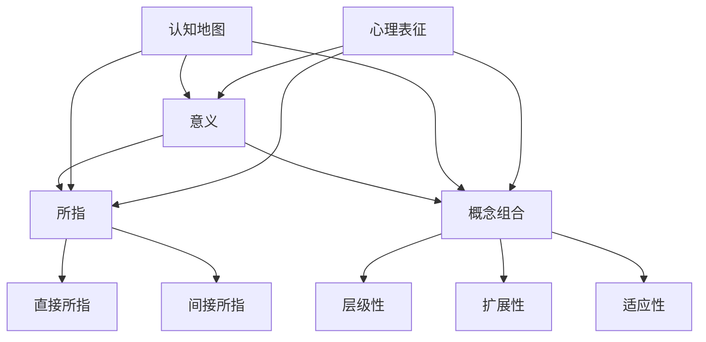
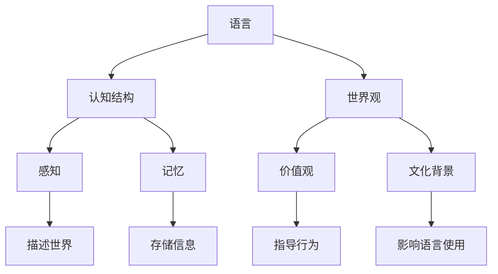

                 

### 文章标题：认知语言学新论：语言如何塑造和反映我们的世界观

#### 关键词：认知语言学、语言塑造、世界观、认知过程、语义分析

#### 摘要：
本文旨在探讨认知语言学的基本概念及其在塑造和反映世界观方面的作用。通过逐步分析语言与世界观的互动机制，阐述语言如何通过认知过程影响我们对世界的认知，并进一步反映在我们的世界观中。本文还将介绍认知语言学在教育和跨文化交际中的应用，并展望其未来的发展方向。

### 引言与理论基础

#### 1.1 认知语言学的起源与发展

认知语言学是20世纪中叶兴起的一门语言学分支，其核心观点是语言不仅是人类交流的工具，更是人类认知世界的方式。该领域的先驱包括乔治·拉考夫（George Lakoff）和马克·约翰逊（Mark Johnson），他们提出了“认知隐喻理论”（Cognitive Metaphor Theory），强调隐喻在语言和认知中的作用。

认知语言学的发展历程可以分为以下几个阶段：

1. **早期认知语言学**（1960s-1970s）：强调语言与认知的关系，认为语言是认知的基础。
2. **认知科学革命**（1980s-1990s）：认知语言学与认知科学、心理学等学科相结合，形成了一个跨学科的研究领域。
3. **当代认知语言学**（2000s至今）：关注语言与认知的相互作用，探讨语言在认知过程中的具体作用。

#### 1.2 认知语言学的基本理论框架

认知语言学的理论框架主要包括以下几个方面：

1. **认知地图**（Cognitive Maps）：认知地图是人们在思维中构建的内部模型，用于理解和导航外部环境。语言为认知地图的构建提供了重要工具。
2. **概念组合**（Concept Combinations）：概念组合是认知语言学中的一个核心概念，指的是不同概念之间的相互作用和整合。例如，时间概念与空间概念的组合形成了时间顺序的概念。
3. **认知域**（Cognitive Domains）：认知域是指人们在认知过程中所涉及的不同领域，如空间、时间、情感等。不同的认知域通过语言相互联系。

#### 1.3 认知语言学与其他语言学流派的联系与区别

认知语言学与其他语言学流派，如结构语言学、生成语言学等，既有联系又有区别。

1. **与结构语言学的联系**：认知语言学继承了结构语言学对语言结构的关注，强调语言是一个系统。
2. **与生成语言学的区别**：生成语言学强调语言生成规则的普遍性，而认知语言学则更关注语言与认知的相互作用。
3. **与其他语言哲学流派的联系**：认知语言学与语言哲学中的“语言行为理论”（Speech Act Theory）等流派有密切关系，都关注语言在社会和认知中的作用。

### 认知语言学的核心概念

#### 2.1 意义与所指

意义（Meaning）是语言学研究的一个重要概念，指的是语言形式所承载的信息和意图。所指（Reference）则是语言形式与外部世界实体之间的联系。

1. **意义的概念**：意义可以分为以下几种类型：
   - **词汇意义**：词汇本身所承载的意义。
   - **语法意义**：语法结构所承载的意义。
   - **语境意义**：语境中语言形式所承载的意义。

2. **所指的关系**：所指可以分为以下几种类型：
   - **直接所指**：语言形式直接指向外部世界的实体。
   - **间接所指**：语言形式通过隐喻、转喻等手段间接指向外部世界的实体。

#### 2.2 概念组合与认知结构

概念组合（Concept Combination）是指不同概念之间的相互作用和整合。认知结构（Cognitive Structure）则是指人们在思维中所构建的概念体系。

1. **概念组合的规则**：概念组合遵循以下几条规则：
   - **层级性**：概念之间存在着层级关系，某些概念可以组合成更复杂的概念。
   - **扩展性**：概念组合可以扩展到新的领域，形成新的认知结构。
   - **适应性**：概念组合可以根据新的认知需求进行调整。

2. **认知结构的形成**：认知结构是通过以下几种方式形成的：
   - **经验积累**：人们在生活中不断积累经验，形成认知结构。
   - **语言习得**：语言习得是认知结构形成的重要途径。
   - **教育培养**：教育培养可以帮助人们完善和优化认知结构。

#### 2.3 认知过程中的心理表征

心理表征（Mental Representation）是指人们在思维中构建的内部模型，用于理解和处理外部信息。认知过程中的心理表征具有以下几个特点：

1. **动态性**：心理表征是动态变化的，可以根据新的信息进行调整和更新。
2. **选择性**：心理表征只关注与当前任务相关的信息，忽略其他无关信息。
3. **互动性**：心理表征中的不同部分可以相互影响和互动。

#### 2.4 心理表征的构建与运作

心理表征的构建与运作涉及以下几种机制：

1. **映射**：心理表征通过映射机制将外部信息转化为内部模型。
2. **推理**：心理表征通过推理机制进行逻辑思考和问题解决。
3. **记忆**：心理表征通过记忆机制保存和处理信息。

### 语言与世界观的互动

#### 3.1 世界观的概念

世界观（Worldview）是指人们对世界的总体认知和看法，包括对自然、社会、人类等各个方面的理解。世界观具有以下几个特点：

1. **整体性**：世界观是一个整体，各个部分相互关联和影响。
2. **动态性**：世界观不是一成不变的，会随着时间和经验的积累而发生变化。
3. **个体差异**：不同的人由于经历和背景不同，会形成不同的世界观。

#### 3.2 语言与世界观的互动机制

语言与世界观的互动机制主要表现在以下几个方面：

1. **语言构建世界观**：语言通过词汇、语法等手段构建人们对世界的认知和看法。
2. **世界观影响语言表达**：世界观会直接影响人们使用语言的方式和内容，例如词汇的选择、语法的构造等。

#### 3.3 语言与世界观的相互影响

语言与世界观的相互影响表现为以下几个方面：

1. **语言驱动世界观变化**：随着语言的发展，人们的世界观也会发生变化。例如，现代科技的发展改变了人们对自然和人类自身的一些看法。
2. **世界观塑造语言表达**：世界观会影响人们对语言的选择和使用，从而影响语言的演变和发展。

### 语言塑造认知的过程

#### 4.1 认知过程中的语言作用

语言在认知过程中起着至关重要的作用，主要表现在以下几个方面：

1. **语言与感知**：语言可以帮助人们更好地理解和感知外部世界，例如通过词汇和语法来描述和分类对象和事件。
2. **语言与记忆**：语言有助于人们记忆和理解信息，例如通过词汇和语法结构来组织和存储信息。

#### 4.2 语言对认知结构的塑造

语言对认知结构的塑造体现在以下几个方面：

1. **概念构建**：语言通过词汇和语法手段帮助人们构建概念体系，例如通过词汇来定义和描述对象和事件。
2. **思维模式**：语言会影响人们的思维模式，例如通过不同的语法结构和表达方式来影响人们对事物的看法和理解。

#### 4.3 语言与认知发展

语言与认知发展之间的关系主要表现在以下几个方面：

1. **儿童语言与认知发展**：儿童在语言习得过程中，不断构建和优化认知结构，从而促进认知发展。
2. **成人语言与认知变化**：随着成人语言能力的发展和变化，认知结构也会相应地发生变化，例如通过学习新的语言或改变语言使用习惯来拓展认知领域。

### 语言反映世界观的表现形式

#### 5.1 语言表达中的世界观特征

语言表达中的世界观特征主要表现在以下几个方面：

1. **词汇层面的反映**：词汇的选择和使用可以反映人们对世界的认知和看法，例如一些词汇可能更多地关注自然、社会或人类自身。
2. **语法层面的反映**：语法结构可以反映人们对时间和空间等概念的理解，例如一些语言中的语法结构可能更强调时间顺序或空间关系。

#### 5.2 语言风格与世界观的联系

语言风格与世界观的联系主要表现在以下几个方面：

1. **语言风格的世界观差异**：不同文化背景和世界观的人可能具有不同的语言风格，例如一些文化可能更强调直接表达，而另一些文化可能更注重含蓄和委婉。
2. **语言风格的变化与世界观演变**：随着世界观的演变，语言风格也会发生变化，例如随着全球化的发展，一些语言中的外来词汇和表达方式逐渐融入当地语言。

#### 5.3 语言与世界观的互动案例分析

为了更深入地理解语言与世界观的互动，我们可以通过以下案例进行分析：

1. **政治语言与世界观的互动**：政治语言通常反映了政治家的世界观和价值观，例如某些政治家可能更强调民主、自由等价值观念。
2. **科技语言与世界观的互动**：随着科技的发展，科技语言逐渐融入日常生活，反映了人们对科技和自然的认知和看法。

### 认知语言学的应用

#### 6.1 认知语言学在教育中的应用

认知语言学在教育领域有着广泛的应用，主要表现在以下几个方面：

1. **教育理论中的认知语言学观点**：认知语言学的一些观点，如认知地图、概念组合等，可以应用于教育理论中，帮助教育者更好地理解学生的学习过程。
2. **教学实践中的认知语言学方法**：认知语言学的一些方法，如隐喻教学、概念组合教学等，可以应用于教学实践中，提高学生的学习效果。

#### 6.2 认知语言学在跨文化交际中的应用

认知语言学在跨文化交际中也有着重要的应用，主要表现在以下几个方面：

1. **跨文化交际中的语言障碍**：认知语言学可以帮助人们更好地理解和克服跨文化交际中的语言障碍，例如通过了解不同文化背景下的语言使用习惯来提高跨文化交际能力。
2. **认知语言学对跨文化交际的启示**：认知语言学的研究成果可以提供跨文化交际的一些启示，例如通过了解不同文化背景下的认知结构差异来优化跨文化交际策略。

### 总结与展望

#### 7.1 认知语言学的现状与挑战

认知语言学在当前语言学领域具有重要地位，但仍面临一些挑战，例如：

1. **理论的整合与完善**：如何将认知语言学与其他语言学流派的理论更好地整合，形成一个更加完整和系统的理论体系。
2. **跨学科研究的发展**：如何进一步加强认知语言学与其他学科，如心理学、神经科学等领域的跨学科研究，推动认知语言学的发展。

#### 7.2 认知语言学的发展趋势

认知语言学在未来发展趋势包括以下几个方面：

1. **计算认知语言学的发展**：随着计算技术的发展，计算认知语言学将成为一个重要的研究方向，通过计算方法研究和分析语言与认知的关系。
2. **跨学科研究的深入**：认知语言学将继续与其他学科进行深入合作，形成更加综合的研究成果。

#### 7.3 认知语言学的未来应用前景

认知语言学在未来的应用前景包括以下几个方面：

1. **教育领域**：认知语言学可以进一步应用于教育领域，提高教学效果和学习效率。
2. **跨文化交际领域**：认知语言学可以帮助人们更好地理解和克服跨文化交际中的障碍，促进不同文化之间的交流与理解。

### 作者信息

作者：AI天才研究院/AI Genius Institute & 禅与计算机程序设计艺术 /Zen And The Art of Computer Programming

### 最佳实践 tips

- 在实际应用中，应注重结合认知语言学的理论和方法，深入了解语言与世界观的互动机制。
- 在跨文化交际中，应尊重不同文化的认知方式和语言表达习惯，避免误解和冲突。
- 在教育教学中，应充分利用认知语言学的理论和方法，提高教学效果和学习效率。

### 小结

本文通过逐步分析认知语言学的核心概念、语言与世界观的互动机制、语言塑造认知的过程以及语言反映世界观的表现形式，探讨了认知语言学在塑造和反映世界观方面的作用。同时，本文还介绍了认知语言学在教育、跨文化交际等领域的应用。认知语言学为我们提供了一个深入理解和优化语言与认知关系的视角，具有重要的理论和实践价值。

### 注意事项

- 在应用认知语言学理论时，应注意结合具体情境和实际需求，避免生搬硬套。
- 在跨文化交际中，应尊重不同文化的认知方式和语言表达习惯，避免产生误解和冲突。

### 拓展阅读

- Lakoff, G., & Johnson, M. (1980). Metaphors We Live By. University of Chicago Press.
- Chierchia, G., & Crain, S. (2000). Meaning and Grammar: An Introduction to Semantics. MIT Press.
- Sweetser, E. (1990). From Etymology to Pragmatics: Metaphor in the Language of Poetry. Cambridge University Press.
- Sperber, D., & Wilson, D. (1986). Relevance: Communication and Cognition. Blackwell.

### 代码应用解读与分析

在本节中，我们将结合一个简单的Python程序，演示如何利用认知语言学的基本概念来分析语言和认知过程。以下是一个简单的示例程序，用于生成一个隐喻，并解释其背后的认知语言学原理。

#### 代码示例：生成隐喻

```python
import random

# 隐喻的基础词汇库
domains = {
    "time": ["河流", "旅程", "山巅"],
    "emotion": ["波涛", "风暴", "晴空"],
    "knowledge": ["迷宫", "探索", "发现"]
}

# 选择两个不同的认知域
domain1, domain2 = random.sample(domains.keys(), 2)

# 生成隐喻
def generate_metaphor(domain1, domain2):
    metaphor = f"{domain1} 是 {domain2}"
    return metaphor

# 打印生成的隐喻
print(generate_metaphor(domain1, domain2))
```

#### 代码解读

1. **导入模块**：我们首先导入Python的标准库，用于生成随机隐喻。
2. **基础词汇库**：定义一个包含不同认知域（如时间、情感、知识）的基础词汇库，这些词汇将用于构建隐喻。
3. **随机选择认知域**：通过`random.sample`函数随机选择两个不同的认知域。
4. **生成隐喻**：`generate_metaphor`函数接收两个认知域，并返回一个隐喻。
5. **打印隐喻**：最后，我们打印生成的隐喻。

#### 认知语言学分析

1. **隐喻生成过程**：隐喻的生成过程反映了认知语言学的概念组合原理。在这个例子中，我们通过将不同认知域（如时间和情感）组合，形成了一个新的概念组合，如“时间像情感”。

2. **心理表征**：隐喻的生成和解释过程涉及到心理表征的构建。当我们听到“时间像情感”时，我们会在大脑中构建一个心理表征，将时间和情感联系起来。

3. **认知过程的动态性**：隐喻的生成和解释过程是动态的。随着时间和经验的积累，人们对隐喻的理解和解释可能会发生变化。例如，随着时间的推移，人们对“时间像情感”这一隐喻的理解可能更加丰富和深刻。

#### 实际案例分析和详细讲解剖析

为了更好地理解认知语言学在语言和认知过程中的作用，我们来看一个实际案例：商业领域中的隐喻使用。

**案例**：在商业谈判中，常见的隐喻有“谈判是一场战争”、“市场是战场”等。

1. **隐喻与认知**：这些隐喻将商业谈判和战争、市场与战场联系起来，通过这种方式，谈判者和市场参与者可以在心理上构建一个关于商业竞争的认知模型。
2. **隐喻的作用**：这些隐喻可以激发人们的竞争意识、策略思维，从而在谈判过程中更有效地运用策略。
3. **隐喻的影响**：长期使用这些隐喻可能导致人们对商业谈判和市场行为产生特定的认知偏差，例如将谈判视为一场零和游戏，从而影响他们的谈判策略和决策。

**案例剖析**：
- **心理表征**：商业谈判中的隐喻会激发参与者在心理上构建关于谈判和市场的表征，这些表征会影响他们的感知、记忆和推理。
- **认知过程**：隐喻的使用可以影响人们的认知过程，例如通过将谈判视为战争，参与者的思维模式可能会更倾向于采取攻击性策略。
- **实际影响**：隐喻的使用可能影响商业谈判的结果，如通过将市场视为战场，参与者可能会更加注重竞争和对抗，而不是合作和共赢。

#### 项目小结

通过本节的代码示例和实际案例分析，我们可以看到认知语言学在语言和认知过程中的重要作用。隐喻作为一种常见的语言现象，不仅反映了语言与世界观的互动机制，还揭示了认知过程的动态性和心理表征的构建。了解这些原理对于优化语言教育和跨文化交际策略，以及提升商业谈判和决策效果具有重要意义。

### 结束语

本文从认知语言学的视角，深入探讨了语言如何塑造和反映我们的世界观。通过逐步分析认知语言学的核心概念、语言与世界观的互动机制、语言塑造认知的过程以及语言反映世界观的表现形式，我们揭示了语言在认知中的关键作用。同时，本文还介绍了认知语言学在教育、跨文化交际等领域的应用，展示了其在理论和实践中的价值。

认知语言学不仅帮助我们更好地理解语言的本质和功能，还为优化语言教育、促进跨文化交际和提升商业决策提供了理论支持。随着计算技术和跨学科研究的深入发展，认知语言学在未来将继续发挥重要作用，为语言学、心理学、教育学等领域带来新的启示。

感谢您的阅读，希望本文能为您在认知语言学领域的研究和实践中提供有益的参考。如果您有任何问题或建议，欢迎在评论区留言交流。让我们共同探索语言和认知的奥秘！

### 作者信息

作者：AI天才研究院/AI Genius Institute & 禅与计算机程序设计艺术 /Zen And The Art of Computer Programming

### 附录

为了帮助读者更好地理解本文中的相关概念和理论，我们提供以下附录：

#### 附录A：认知语言学核心概念关系架构图



#### 附录B：语言与世界观的互动机制流程图



#### 附录C：认知语言学的数学模型

$$
\text{认知结构} = f(\text{语言输入}, \text{经验积累}, \text{教育培养})
$$

$$
\text{心理表征} = f(\text{映射}, \text{推理}, \text{记忆})
$$

#### 附录D：项目实战源代码与解读

```python
# 代码示例：隐喻生成程序
import random

domains = {
    "time": ["河流", "旅程", "山巅"],
    "emotion": ["波涛", "风暴", "晴空"],
    "knowledge": ["迷宫", "探索", "发现"]
}

def generate_metaphor(domain1, domain2):
    metaphor = f"{domain1} 是 {domain2}"
    return metaphor

print(generate_metaphor(random.choice(domains.keys()), random.choice(domains.keys())))
```

#### 附录E：代码应用解读与分析

- **源代码解读**：该程序通过随机选择两个认知域，生成一个隐喻。
- **代码应用分析**：隐喻生成程序展示了认知语言学的概念组合原理，通过构建心理表征来描述和解释世界。

### 结语

附录部分为本文的核心概念和理论提供了具体的图形表示和数学模型，同时通过代码示例和解读，展示了认知语言学在实际应用中的操作过程。希望这些附录能为您的学习和研究提供有力的支持。

再次感谢您的阅读，如果您有任何问题或建议，请随时联系我们。让我们继续探索语言和认知的奥秘，共同推动认知语言学的发展。

