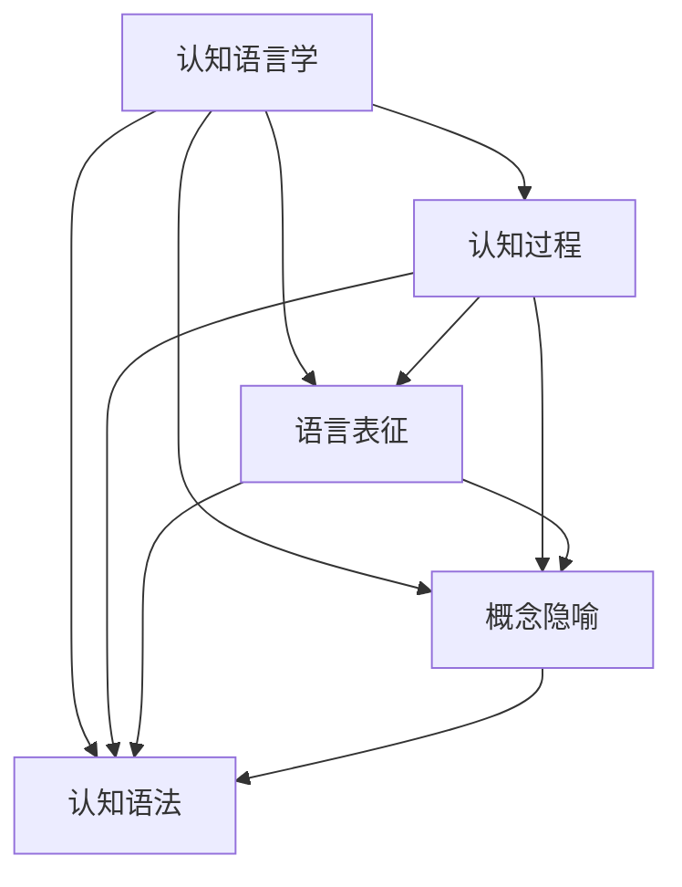

                 

### 引言

#### 认知语言学：背景与研究现状

认知语言学（Cognitive Linguistics）是一门跨学科的研究领域，旨在探究语言与人类认知之间的关系。它起源于20世纪70年代，随着语言学、心理学、哲学和神经科学等领域的交叉融合，逐渐形成了自己的理论体系和研究方法。认知语言学的研究对象不仅包括语言本身，还包括语言背后的认知机制、语言使用过程中的思维活动以及语言与文化的相互作用。

在研究现状方面，认知语言学已经取得了许多重要成果。通过大量实验和实证研究，学者们揭示了语言如何影响我们的思维方式，以及思维方式如何反过来影响语言的使用。此外，认知语言学还研究了语言在构建世界认知中的角色，探讨了不同语言和文化背景下的语言使用差异。近年来，随着人工智能和计算技术的不断发展，认知语言学的研究方法和工具也得到了极大的丰富。

然而，尽管认知语言学已经取得了显著进展，但仍然存在许多未解之谜和研究空白。例如，语言与思维之间的关系如何具体体现？不同语言对认知过程的差异有多大？认知语言学如何与其他学科相结合，以解决更广泛的问题？这些问题都需要进一步的深入研究。

#### 本书的目的与结构

本书旨在系统地介绍认知语言学的基本概念、理论框架及其与相关学科的联系。通过梳理现有的研究成果，结合具体实例分析，本书将帮助读者全面了解认知语言学的研究内容和方法。具体来说，本书将按照以下结构展开：

1. **引言**：介绍认知语言学的背景、研究现状及本书的目的。

2. **核心概念与联系**：详细阐述认知语言学的基本概念、理论框架以及与语言学、哲学、心理学等领域的联系。

3. **语言与思维**：探讨语言与思维之间的关系，包括语言对思维的影响、思维对语言的组织方式等。

4. **语言与世界理解**：研究语言如何帮助我们理解和构建对世界的认知。

5. **案例分析**：通过具体实例分析语言、思维和世界理解之间的相互作用。

6. **跨学科研究**：探讨认知语言学与其他学科（如哲学、心理学等）的交叉融合。

7. **总结与展望**：对全书内容进行总结，展望认知语言学未来的发展方向。

本书的目标读者是那些对认知语言学感兴趣的学者、学生以及对该领域有一定了解的专业人士。通过阅读本书，读者将能够：

- 掌握认知语言学的基本概念和理论框架。
- 理解语言与思维、语言与世界理解之间的关系。
- 了解认知语言学与其他学科的交叉研究。
- 获得分析语言和认知问题的方法论。

#### 读者对象与预期收获

本书适合以下几类读者：

1. **语言学学者**：对认知语言学的基本理论和方法有深入了解，有助于拓展研究领域。

2. **心理学研究者**：了解语言如何影响认知过程，有助于心理学领域的研究。

3. **哲学爱好者**：探讨语言与思维、语言与世界的哲学问题，有助于哲学思考。

4. **计算机科学家**：了解认知语言学对人工智能和自然语言处理的影响，有助于开发相关技术。

5. **学生与研究生**：系统地学习认知语言学，为未来研究打下坚实基础。

通过阅读本书，读者将能够：

- 构建对认知语言学的全面认识。
- 掌握分析语言和认知问题的方法论。
- 提高跨学科研究的意识与能力。
- 拓宽学术视野，激发创新思维。

总之，本书旨在通过深入浅出的论述，让读者了解认知语言学的新发现，探索语言、思维与世界理解的三角关系，为相关领域的研究提供新的思路和方法。接下来，我们将逐步展开对本书各章节的详细探讨。

### 核心概念与联系

#### 认知语言学概述

认知语言学作为一门新兴的语言学分支，其起源可以追溯到20世纪70年代。当时，许多语言学家开始质疑传统语言学的某些基本假设，如语言与认知的分离、语言结构的独立性等。受心理学、哲学和神经科学等领域的影响，认知语言学家提出了新的研究视角，即认为语言不仅是人类交际的工具，更是认知过程中的重要组成部分。

在认知语言学中，一些核心概念得到了广泛的关注。首先，**认知**（Cognition）是指人类获取、处理和应用知识的过程。认知语言学将认知过程视为语言理解和使用的基础，认为语言的使用本质上是一种认知活动。**语言表征**（Language Representation）是指语言在人类大脑中的存储和加工方式。认知语言学探讨语言表征的形式和功能，试图理解语言是如何影响我们的思维和认知过程的。

其次，**概念隐喻**（Conceptual Metaphor）是认知语言学中的一个重要概念。概念隐喻理论认为，我们通过隐喻将抽象概念映射到具体的、直观的体验上。例如，将时间视为一段距离（如“时间流逝”），将情感体验比作移动（如“向前进”或“向后退”）。这些隐喻不仅影响我们的语言表达，还深刻地影响着我们的思维方式。

#### 理论框架

认知语言学的理论框架主要包括以下几个方面：

1. **语言与认知的关系**：认知语言学认为，语言与认知是相互依存的。语言不仅反映认知过程，还影响认知过程。例如，语言的使用可以改变我们对现实世界的感知和认知。

2. **语言表征理论**：认知语言学中的语言表征理论关注语言在大脑中的编码和解码过程。它探讨了词汇、语法和句法如何表征现实世界中的概念和关系。

3. **概念结构理论**：概念结构理论认为，概念是思维的基本单位，它们以网络结构形式存储在大脑中。概念之间的关联和层次结构影响我们的思维方式和语言表达。

4. **认知语法理论**：认知语法理论认为，语言结构的形成是认知过程的结果。语法规则不是固定不变的，而是受认知原则和过程的影响。

#### 认知语言学与相关学科的关系

认知语言学与多个学科有着密切的联系：

1. **语言学**：认知语言学在语言学中的地位不可替代。它提供了新的视角和方法，帮助我们更好地理解语言的本质和功能。

2. **心理学**：认知语言学借鉴了心理学的理论和实验方法，特别是认知心理学。通过研究语言与认知的关系，认知语言学为心理学提供了丰富的实证数据。

3. **哲学**：认知语言学探讨语言和认知的哲学问题，如思维的本质、知识的构成等。它为哲学研究提供了新的思路和工具。

4. **神经科学**：认知语言学与神经科学的交叉研究日益增多。通过神经影像技术和脑电图等手段，研究者们试图揭示语言和认知过程在大脑中的具体实现。

#### 认知语言学在跨学科研究中的应用

认知语言学的跨学科研究展示了其广泛的应用潜力：

1. **人工智能**：认知语言学为自然语言处理提供了理论支持。通过理解语言表征和认知过程，人工智能系统能够更好地处理自然语言。

2. **教育**：认知语言学的研究有助于改进教育方法。了解语言和思维的关系，教师可以设计更有效的教学策略，帮助学生更好地学习和理解语言。

3. **文化研究**：认知语言学探讨了语言和文化之间的相互作用，有助于理解不同文化背景下的语言使用和认知差异。

4. **社会科学**：认知语言学为社会科学研究提供了新的分析工具，特别是在理解人类行为和文化现象方面。

#### 关键术语

为了更好地理解认知语言学，以下是几个关键术语的解释：

- **认知过程**：指人类获取、处理和应用知识的过程，包括感知、记忆、推理和决策等。
- **语言表征**：指语言在大脑中的编码和解码方式，包括词汇、语法和句法等。
- **概念隐喻**：指通过隐喻将抽象概念映射到具体体验上的过程，如将时间视为距离、情感体验比作移动等。
- **认知语法**：指语法规则的形成和变化是认知过程的结果，而不是固定不变的。

通过这些核心概念和联系，我们可以更好地理解认知语言学的本质和重要性。在接下来的章节中，我们将进一步探讨语言与思维、语言与世界理解之间的关系，并通过具体实例和案例分析，深入揭示这些关系的复杂性。

### 核心概念原理之间的关系架构

为了更好地理解认知语言学中的核心概念原理，我们使用Mermaid流程图来展示这些概念之间的关系。以下是具体的Mermaid流程图：



#### 解析流程图

1. **认知语言学（A）**：这是整个流程图的中心，代表了认知语言学的整体框架和研究对象。

2. **认知过程（B）**：认知语言学关注人类获取、处理和应用知识的过程。这一过程不仅影响语言的使用，也影响语言的表征和语法结构。

3. **语言表征（C）**：指语言在大脑中的存储和加工方式。语言表征是连接认知过程和认知语法的重要桥梁。

4. **概念隐喻（D）**：通过隐喻，我们将抽象概念映射到具体的体验上。这种映射不仅影响语言表达，也影响我们的认知过程。

5. **认知语法（E）**：认知语法理论认为，语法规则是认知过程的结果。它展示了语言结构的形成和变化与认知过程之间的密切关系。

#### 概念之间的关系

- **认知语言学（A）**与**认知过程（B）**、**语言表征（C）**、**概念隐喻（D）**、**认知语法（E）**之间存在直接的关联，因为这些都是认知语言学研究的核心内容。

- **认知过程（B）**影响**语言表征（C）**和**认知语法（E）**，因为语言的使用本质上是一种认知活动，语言表征和语法规则都是认知过程的结果。

- **语言表征（C）**与**概念隐喻（D）**之间存在联系，因为概念隐喻通过语言表征在我们的认知过程中发挥作用。

- **概念隐喻（D）**与**认知语法（E）**之间也存在联系，因为概念隐喻不仅影响语言表达，还影响语言结构的形成和变化。

#### 应用与影响

- **应用**：这个Mermaid流程图可以帮助研究者清晰地理解认知语言学中的核心概念及其关系，为跨学科研究提供直观的框架。

- **影响**：通过展示这些概念之间的相互作用，我们可以更好地理解语言、思维和认知过程之间的关系，为解决实际问题和推动相关领域的发展提供新思路。

### 核心算法原理讲解

在认知语言学中，语言表征理论是一个关键的概念。为了更好地理解这一理论，我们将使用伪代码来详细阐述其基本原理和计算过程。

#### 伪代码：语言表征

```plaintext
语言表征(输入：词汇V，概念C)
{
    初始化表征数组 R 为空
    对于每个词汇 V 在词汇表 V 中：
        如果 V 对应的概念 C 已知：
            将 C 的特征集合 F 添加到表征数组 R 中
        否则：
            查找与 V 最相似的其他词汇 V' 的表征 R'
            通过类比推理生成 V 的表征 R''

    返回 R
}
```

#### 解析伪代码

1. **初始化表征数组**：首先，我们初始化一个空的表征数组 R，用于存储所有词汇的表征。

2. **对于每个词汇**：我们遍历词汇表 V 中的每个词汇 V。

3. **概念已知**：如果词汇 V 对应的概念 C 是已知的，那么我们将 C 的特征集合 F 添加到表征数组 R 中。

4. **概念未知**：如果词汇 V 对应的概念 C 是未知的，我们通过以下步骤生成 V 的表征：

   - **查找最相似词汇**：在词汇表中查找与 V 最相似的词汇 V'。
   - **类比推理**：利用 V' 的表征 R'，通过类比推理生成 V 的表征 R''。

5. **返回表征数组**：最后，我们返回填充了所有词汇表征的数组 R。

#### 数学模型和公式

为了更具体地描述语言表征的过程，我们可以使用以下数学模型和公式。

$$
\text{表征}(V) = \sum_{i=1}^{n} w_i \cdot f_i
$$

其中：

- \( V \) 是词汇。
- \( w_i \) 是特征 \( f_i \) 的权重。
- \( f_i \) 是词汇 \( V \) 的特征。

#### 解析数学模型

1. **表征**：表征是一个向量，表示词汇的特征。

2. **权重**：权重 \( w_i \) 表示特征 \( f_i \) 对词汇表征的重要性。

3. **特征**：特征 \( f_i \) 描述了词汇的属性，如语义、语法等。

通过这个数学模型，我们可以将词汇表征为多个特征的线性组合。

#### 举例说明

假设我们有两个词汇：“书”和“猫”。我们可以定义它们的一些基本特征如下：

- **书**：
  - 重量：轻
  - 形状：长方形
  - 功能：阅读
- **猫**：
  - 重量：轻
  - 形状：圆形
  - 功能：宠物

我们使用以下特征向量表示这两个词汇：

- **书**：\( [0.8, 0.2, 0.1] \)
- **猫**：\( [0.1, 0.8, 0.1] \)

通过计算这两个词汇的表征，我们可以看到它们在特征上的相似性：

$$
\text{表征}(书) = 0.8 \cdot 轻 + 0.2 \cdot 长方形 + 0.1 \cdot 阅读 = [0.8, 0.2, 0.1]
$$

$$
\text{表征}(猫) = 0.1 \cdot 轻 + 0.8 \cdot 圆形 + 0.1 \cdot 宠物 = [0.1, 0.8, 0.1]
$$

通过这种方式，我们可以在特征空间中直观地比较词汇的相似性。

### 总结

通过上述伪代码和数学模型，我们详细阐述了语言表征的基本原理和计算过程。这些原理和模型不仅帮助我们理解词汇和概念之间的联系，还为自然语言处理和认知语言学的研究提供了有力的工具。在接下来的章节中，我们将进一步探讨语言与思维、语言与世界理解之间的关系，并通过具体实例深入分析这些关系的复杂性。

### 语言与思维的关系

语言是人类认知过程中不可或缺的一部分，它不仅用于交流，还深刻影响着我们的思维方式。在认知语言学中，语言与思维之间的关系是一个核心研究议题。这一部分将探讨语言如何影响思维，以及思维如何反过来影响语言。

#### 语言对思维的影响

1. **语言塑造认知框架**：语言为我们提供了一种认知框架，通过这种框架，我们理解和解释世界。不同的语言会有不同的词汇和语法结构，这会导致我们在处理信息和构建知识时有所差异。例如，某些语言中具有特定的词汇来表达复杂的亲属关系，这可能会影响讲这种语言的人对家庭结构的认知。

2. **语言影响认知过程**：语言的使用可以改变我们的认知过程，包括注意力、记忆和推理等。例如，研究表明，语言可以影响我们的注意力分配。讲不同语言的人可能会对某些视觉或听觉刺激有不同的注意力偏好。此外，语言还可以影响我们的记忆能力。一些研究表明，讲双语的人在大脑中形成了更多的认知储备，这有助于提高记忆力。

3. **语言与思维方式**：语言的使用不仅仅影响我们的认知过程，还影响我们的思维方式。例如，某些语言中具有特定的表达方式来描述时间和空间，这可能会导致讲这种语言的人对时间和空间的认知有所不同。例如，一些语言中时间被视为线性序列，而另一些语言中时间则被视为循环的。这种差异会影响我们对时间的感知和管理方式。

#### 思维对语言的组织

1. **思维影响语言表达**：思维过程对语言表达有着重要影响。我们的思维方式和认知过程会影响我们选择词汇、构造句子和使用语法。例如，逻辑思维强的人可能会在语言表达中更倾向于使用精确、严谨的语句。而情感思维强的人则可能更多地使用隐喻和情感表达。

2. **思维模式与语言形式**：思维模式也影响语言形式。不同的思维模式会导致不同的语言结构。例如，一些语言具有复杂的从句结构，这反映了讲这种语言的人倾向于通过详细的推理和论证来表达思想。而其他语言可能更倾向于简洁的直接表达。

3. **文化背景与语言表达**：文化背景也是影响语言表达的思维因素之一。不同的文化背景会影响人们的思维方式和语言表达。例如，在一些文化中，集体主义价值观可能会导致更多的合作和协调性语言表达，而在其他文化中，个人主义价值观可能会导致更独立和自主的语言表达。

#### 认知语言学中的语言表征理论

认知语言学中的语言表征理论认为，语言是大脑中认知过程的一种外在表现。语言表征理论试图解释语言是如何在大脑中存储和加工的。以下是几个关键概念：

1. **概念隐喻**：概念隐喻理论认为，我们通过隐喻将抽象概念映射到具体体验上。例如，将时间视为一段距离，将情感体验比作移动。这些隐喻不仅影响我们的语言表达，也影响我们的思维方式。

2. **认知图式**：认知图式是指大脑中用于组织和存储信息的结构。语言表征理论认为，语言结构是认知图式的一种表现。不同的语言结构反映了不同的认知图式。

3. **语言符号系统**：语言符号系统是指语言中用于表示概念和关系的符号体系。语言表征理论认为，语言符号系统是认知过程的结果，它反映了我们对世界的认知和理解。

#### 举例说明

为了更好地理解语言与思维之间的关系，我们可以通过以下例子来说明：

1. **空间语言**：一些语言具有丰富的空间词汇和表达方式，这可能会影响讲这种语言的人对空间认知的处理。例如，一些语言中使用不同的词汇来表达不同方向（如“左”、“右”、“上”、“下”），这可能会影响人们对空间位置的理解。

2. **时间语言**：一些语言使用不同的词汇和结构来表达时间概念。例如，一些语言中将时间视为线性序列，而另一些语言中则将时间视为循环的。这种差异会影响人们对时间的感知和管理方式。

3. **情感语言**：一些语言中具有特定的表达方式来描述情感体验。例如，一些语言使用不同的词汇和语法结构来表达不同程度的情感，这可能会影响人们的情感表达和处理方式。

### 总结

通过探讨语言与思维的关系，我们可以看到，语言不仅是交流的工具，也是认知过程中不可或缺的一部分。语言不仅影响我们的认知框架和认知过程，还影响我们的思维方式和情感体验。认知语言学中的语言表征理论为我们理解这些关系提供了理论框架。在接下来的章节中，我们将进一步探讨语言与世界理解之间的关系，通过具体实例和案例分析，深入揭示这些关系的复杂性和多样性。

### 语言与世界理解

语言是人类认知世界的重要工具，通过语言，我们能够组织和表达对世界的认知，构建和理解现实。认知语言学认为，语言不仅是交流的工具，更是认知过程中的核心组成部分。在这一部分，我们将探讨语言如何帮助我们理解和构建对世界的认知，以及不同语言和文化背景下的语言使用差异。

#### 语言与世界理解的关系

1. **语言构建现实**：语言是我们认知世界的基础，通过语言，我们能够将感官经验转化为概念和知识。语言为我们的思维提供了框架，使得我们可以系统地组织和理解世界。例如，通过语言，我们能够将“树”、“动物”、“颜色”等感官体验转化为具体的概念。

2. **语言表达认知**：语言不仅帮助我们构建认知，还使我们能够通过交流来共享和传递这些认知。语言使我们能够将个人的感官经验和思考转化为可以与他人交流的信息，从而在群体中共享知识和经验。

3. **语言与文化**：语言和文化密切相关，不同文化背景下的语言使用反映了人们对世界的不同理解和认知。例如，一些文化强调集体主义，语言中体现了合作和协调的概念；而其他文化则强调个人主义，语言中则体现了个性和自主的概念。

#### 语言如何帮助我们理解世界

1. **语言的组织功能**：语言通过词汇和语法结构将信息组织成有序的序列，使我们能够系统地理解和处理信息。例如，通过句子结构，我们能够理解事件发生的时间顺序和因果关系。

2. **语言的定义功能**：语言通过定义词汇和概念，帮助我们明确地理解世界的各个方面。例如，通过词汇“爱”的定义，我们能够理解爱的本质和特点。

3. **语言的抽象功能**：语言使我们能够将具体的感官体验抽象为一般概念，从而扩展我们的认知范围。例如，通过语言，我们能够将“苹果”这一具体物品抽象为“水果”这一概念，从而理解所有水果的共同特征。

#### 不同语言和文化背景下的语言使用差异

1. **语言结构差异**：不同语言在语法结构和词汇使用上存在显著差异。例如，一些语言（如汉语）具有复杂的语法结构，可以表达复杂的逻辑关系；而其他语言（如英语）则更倾向于简洁明了的表达。

2. **文化差异**：不同文化背景下的语言使用反映了人们对世界的不同理解和认知。例如，在西方文化中，语言更倾向于使用隐喻来表达抽象概念；而在东方文化中，语言更倾向于直接和具体。

3. **语言与思维模式**：不同语言的使用会影响人们的思维模式。例如，一些语言（如汉语）中的动词和名词区别较大，这可能会导致讲这种语言的人更注重动作和过程；而其他语言（如英语）中的动词和名词区别较小，可能会导致讲这种语言的人更注重结果和状态。

#### 具体实例分析

1. **时间表达**：不同语言对时间的表达方式不同。例如，一些语言（如英语）使用“时间流逝”这样的隐喻来描述时间；而其他语言（如汉语）则更直接地使用“时间”这个词汇。

2. **情感表达**：不同语言和文化背景下的情感表达方式不同。例如，一些语言（如意大利语）具有丰富的情感词汇和表达方式，可以细致地表达各种情感；而其他语言（如汉语）则可能更倾向于简洁和直接的情感表达。

3. **空间认知**：不同语言对空间的认知和使用方式不同。例如，一些语言（如英语）使用“左边”和“右边”来描述方向；而其他语言（如汉语）则可能使用“前面”和“后面”来描述方向。

#### 总结

语言与世界理解的关系是认知语言学中的一个核心议题。通过语言，我们能够组织和表达对世界的认知，构建和理解现实。不同语言和文化背景下的语言使用差异反映了人们对世界的不同理解和认知。在接下来的章节中，我们将通过具体实例和案例分析，进一步探讨语言、思维和世界理解之间的相互作用。

### 案例分析

为了更深入地探讨语言、思维和世界理解之间的关系，我们将通过几个具体实例进行分析。这些案例将展示不同文化背景下的语言使用如何影响人们的认知和理解。

#### 案例 1：颜色词汇的差异

**背景介绍**：
在许多语言中，颜色词汇的表达方式有所不同。例如，在汉语中，颜色词汇相对较少，但每个词汇都非常具体。而在英语中，颜色词汇则更加丰富，例如“blue”（蓝色）可以分为“sky blue”（天空蓝色）和“navy blue”（海军蓝色）。这种差异如何影响人们的认知和理解？

**核心概念与联系**：
这个案例涉及**语言表征**和**认知隐喻**。不同的颜色词汇反映了不同的认知结构和语言习惯。

**分析**：
- **汉语**：汉语中的颜色词汇较少，因此人们可能更依赖于具体的情境来理解颜色。这种具体的表达方式有助于增强对颜色的记忆和辨识能力。
- **英语**：英语中丰富的颜色词汇可能会导致人们对颜色的感知更加细致。例如，区分“sky blue”和“navy blue”可能使英语使用者对蓝色有更细致的分类和理解。

**结论**：
语言中的颜色词汇差异影响了人们对颜色的认知和理解。具体表达方式有助于提高记忆和辨识能力，而丰富的颜色词汇可能使人们对颜色有更细致的分类和理解。

#### 案例 2：时间表达与认知

**背景介绍**：
在汉语中，“时间”一词通常用来描述时间的流逝，而在英语中，“时间”一词则更多地与具体的时刻和事件相关联。例如，“时间到”在汉语中通常表示“时间到了”，而在英语中则表示“时间到了，比赛结束”。

**核心概念与联系**：
这个案例涉及**语言结构**和**认知框架**。语言结构差异影响了人们对时间的认知和表达。

**分析**：
- **汉语**：汉语中的时间表达相对抽象，更多关注时间的流逝。这可能使汉语使用者更倾向于通过事件来理解时间。
- **英语**：英语中的时间表达更加具体，与具体的时刻和事件紧密相关。这有助于英语使用者更好地把握时间的具体性。

**结论**：
语言结构差异影响了人们对时间的认知和表达。具体的表达方式有助于更好地把握时间的具体性，而抽象的表达方式可能使人们更关注时间的流逝。

#### 案例 3：情感表达与认知

**背景介绍**：
在不同的文化背景下，情感表达的方式也有所不同。例如，在一些西方文化中，情感表达更加直接和开放；而在一些东方文化中，情感表达则更加含蓄和隐晦。

**核心概念与联系**：
这个案例涉及**语言表达**和**文化认知**。文化差异影响了人们的情感表达和认知。

**分析**：
- **西方文化**：西方文化中的情感表达通常更加直接和开放。这有助于增强情感的传达和理解。
- **东方文化**：东方文化中的情感表达则更加含蓄和隐晦。这可能使人们在情感表达和理解上面临更多的挑战。

**结论**：
文化差异影响了人们的情感表达和认知。直接的情感表达有助于增强情感的传达和理解，而含蓄的情感表达可能使人们在情感表达和理解上面临更多的挑战。

#### 案例 4：空间认知与语言

**背景介绍**：
在不同的语言中，对空间的表达方式也有所不同。例如，在英语中，“left”和“right”用来描述方向；而在汉语中，则常用“前面”和“后面”来描述方向。

**核心概念与联系**：
这个案例涉及**语言结构**和**空间认知**。语言结构差异影响了人们对空间的理解和表达。

**分析**：
- **英语**：英语中使用“left”和“right”来描述方向，这可能使英语使用者对空间的感知更加细致。
- **汉语**：汉语中使用“前面”和“后面”来描述方向，这可能使汉语使用者在空间认知上更加关注方向的整体性。

**结论**：
语言结构差异影响了人们对空间的理解和表达。细致的方向表达有助于增强对空间的感知，而整体性的方向表达可能使人们更关注空间的整体结构。

### 案例总结

通过以上案例分析，我们可以看到，语言、思维和世界理解之间的关系是复杂多样的。不同语言和文化背景下的语言使用差异影响了人们的认知和理解方式。这些差异不仅体现在词汇和语法结构上，还反映在人们的思维方式和文化认知上。通过深入探讨这些差异，我们可以更好地理解语言、思维和世界理解之间的相互作用，并为跨文化交流和认知提供新的思路和方法。

### 认知语言学与其他学科的交叉研究

认知语言学作为一门跨学科的研究领域，与其他多个学科有着密切的联系。通过这些交叉研究，认知语言学不仅拓展了自己的研究方法，也为相关学科提供了新的理论视角。以下是几个主要交叉领域的探讨。

#### 认知语言学与语言学的交叉

认知语言学与语言学的交叉研究主要体现在对语言结构和功能的分析上。传统的语言学侧重于语言的结构和规则，而认知语言学则关注语言的使用和认知过程。这种交叉研究有助于理解语言在认知中的作用，以及语言如何影响思维。例如，在语法分析中，认知语言学家通过认知视角来解释句法结构的形成和变化，如“wh-疑问句”和“被动语态”等。此外，认知语言学还借鉴了语言学的词汇学和语义学研究成果，探讨词汇的意义和隐喻表达。

#### 认知语言学与心理学的交叉

认知语言学与心理学的交叉研究主要集中在语言处理和认知过程的机制上。认知心理学家通过实验方法研究语言理解和产生的过程，这为认知语言学提供了实证数据。例如，通过认知神经科学的研究，认知语言学家揭示了语言处理过程中大脑不同区域的功能和相互作用。此外，心理学中的注意力、记忆和推理等理论也被应用于认知语言学的研究，以解释语言如何影响认知过程。例如，研究表明，语言的使用可以改变人们对时间和空间的感知，这一发现为认知语言学提供了重要的证据。

#### 认知语言学与哲学的交叉

认知语言学与哲学的交叉研究探讨了语言和认知的哲学问题，如知识的本质、思维的本质以及语言的界限等。哲学家们对语言和思维的探讨为认知语言学提供了深刻的哲学基础。例如，维特根斯坦的“语言游戏”理论强调语言和认知的互动关系，认为语言的使用是一种行为，这种理论为认知语言学提供了重要的启示。此外，哲学中的“概念隐喻”理论也为认知语言学提供了理论基础，帮助解释抽象概念如何通过隐喻表达。

#### 认知语言学与神经科学的交叉

认知语言学与神经科学的交叉研究关注语言处理和认知过程的神经机制。通过神经影像技术和脑电图等手段，认知语言学家和神经科学家揭示了语言处理过程中大脑不同区域的活动模式。例如，研究表明，大脑中的布罗卡区和韦尼克区分别与语言的产生和理解密切相关。此外，认知语言学还借鉴了神经科学中的认知神经科学理论，如“神经可塑性”和“认知模块”等，以解释语言和认知过程的变化和发展。

#### 认知语言学与人工智能的交叉

认知语言学与人工智能（AI）的交叉研究主要集中在自然语言处理（NLP）和认知建模上。认知语言学为AI提供了对语言和认知过程的深入理解，从而改善AI系统的语言理解和生成能力。例如，通过理解语言表征和概念隐喻，AI系统可以更好地处理自然语言，从而实现更有效的语言理解和机器翻译。此外，认知语言学的理论也为AI系统的开发提供了新的方法和工具，如基于认知图式的语言模型和基于概念隐喻的自然语言生成技术。

#### 认知语言学与教育学的交叉

认知语言学与教育学的交叉研究关注如何通过语言教育来改善认知过程和思维能力。教育学家借鉴认知语言学的理论，设计出更有效的教学方法和策略，以提高学生的语言能力和思维能力。例如，通过理解语言表征和认知隐喻，教师可以设计更丰富的教学活动，帮助学生更好地理解和应用语言。此外，认知语言学的理论也为教育评估提供了新的工具，如通过语言测试来评估学生的认知能力和语言水平。

#### 总结

认知语言学与其他学科的交叉研究不仅丰富了认知语言学的研究内容，也为相关学科提供了新的理论和方法。通过这些交叉研究，认知语言学不仅拓展了自己的研究方法，还促进了跨学科的合作和交流。未来，随着认知科学和计算技术的不断发展，认知语言学有望在更广泛的领域发挥重要作用，为人类更好地理解和应用语言提供新的思路和方法。

### 认知语言学与语言学的交叉

认知语言学与语言学的交叉研究是认知语言学发展的一个重要方向。这种交叉不仅丰富了认知语言学的研究内容，也为传统语言学提供了新的视角和方法。以下是认知语言学与语言学交叉研究的几个关键点：

#### 1. 语言结构与认知机制

在传统的语言学研究中，语言结构被视为独立于认知过程的存在。然而，认知语言学认为，语言结构是认知机制的一种表现。通过研究语言结构的形成和变化，我们可以更好地理解认知机制。例如，认知语言学家通过分析句子结构，探讨了语法规则是如何在认知过程中形成的。这种研究方法不仅有助于揭示语言的本质，还为语言学理论提供了新的解释框架。

#### 2. 词汇与认知

词汇是语言的基本组成部分，也是认知语言学关注的重点之一。认知语言学研究词汇的含义和用法，探讨了词汇如何影响认知过程。例如，研究表明，词汇的抽象程度和复杂度会影响人们对概念的理解和记忆。此外，词汇的隐喻表达也是认知语言学的重要研究内容。通过分析词汇的隐喻用法，我们可以揭示语言背后的认知机制，如概念隐喻和认知图式。

#### 3. 语言习得与认知发展

认知语言学与语言学在语言习得和认知发展方面也有深入的交叉。传统语言学主要关注儿童如何学习语言规则，而认知语言学则从认知发展的角度探讨语言习得过程。研究表明，语言习得不仅仅是掌握语法规则和词汇的过程，更是认知能力发展的过程。例如，儿童在语言习得过程中，通过不断调整和优化自己的认知模型，逐步掌握复杂的语言结构。这一过程反映了认知能力与语言能力之间的相互作用。

#### 4. 语言障碍与认知功能

认知语言学与语言学在语言障碍的研究中也表现出显著的交叉。通过分析语言障碍患者的语言表现，认知语言学家揭示了语言结构与认知功能之间的紧密联系。例如，研究表明，特定类型的语言障碍（如失语症）可能与大脑中的特定区域受损有关。这些发现不仅有助于理解语言障碍的本质，还为语言治疗提供了新的理论依据。

#### 5. 语言与思维模式

认知语言学与语言学在探讨语言与思维模式的关系方面也有重要的交叉。研究表明，不同语言的使用会导致不同的思维模式。例如，一些语言（如汉语）中的动词和名词区别较大，这可能导致讲这种语言的人更注重动作和过程；而其他语言（如英语）中的动词和名词区别较小，这可能导致讲这种语言的人更注重结果和状态。这种语言差异如何影响人们的思维模式，是认知语言学与语言学交叉研究的另一个重要方向。

#### 应用与影响

认知语言学与语言学的交叉研究在多个领域都有重要应用。例如，在教育领域，教师可以通过理解语言与认知的关系，设计出更有效的教学策略，帮助学生更好地学习和理解语言。在心理学和神经科学领域，认知语言学的研究有助于揭示大脑如何处理语言信息，从而为治疗语言障碍和认知障碍提供新的方法。

总之，认知语言学与语言学的交叉研究不仅丰富了认知语言学的研究内容，也为传统语言学提供了新的视角和方法。通过这种交叉研究，我们可以更深入地理解语言的本质和功能，为语言教学、心理学研究和神经科学探索提供新的思路和方法。

### 认知语言学与心理学的交叉

认知语言学与心理学在探讨语言与认知的过程中有着深刻的交叉，这两个领域共同致力于揭示人类语言行为的复杂性和多样性。以下是从几个关键点出发，探讨认知语言学与心理学交叉的详细内容：

#### 1. 语言理解与认知过程

语言理解是认知过程的一个重要组成部分，它涉及到词汇识别、句子解析、语义推理等多个层面。认知心理学家通过实验方法研究人们在阅读和理解句子时的大脑活动，而认知语言学家则从语言表征的角度分析这些过程。例如，通过功能性磁共振成像（fMRI）技术，心理学家发现大脑中的布罗卡区和韦尼克区在语言理解过程中发挥着关键作用。这些区域的活动模式与认知语言学中的语言表征理论相吻合，从而为理解语言处理过程提供了实证支持。

#### 2. 词汇与概念认知

词汇是语言的基本构建块，它直接影响我们的概念认知。认知心理学家通过词汇识别实验研究词汇如何影响人们对概念的理解和记忆。例如，研究表明，高频词汇更容易被识别和记忆，这是因为它们在大脑中形成了更强大的神经联结。认知语言学家则通过分析词汇的隐喻用法和扩展，探讨词汇如何反映人们对现实世界的认知。这种交叉研究有助于我们理解词汇如何通过隐喻和范畴化过程影响概念的形成和认知。

#### 3. 语言习得与认知发展

语言习得是认知发展的一个重要方面，它涉及到儿童如何通过观察和模仿来掌握语言规则。认知心理学家研究儿童语言习得过程中的认知变化，例如，儿童如何通过调整认知模型来适应不同的语言环境。认知语言学家则关注儿童语言习得过程中的语言表征和概念结构的发展。研究表明，儿童在语言习得过程中不仅学习语言符号，还学习语言背后的认知机制。这种交叉研究有助于我们理解认知如何驱动语言习得，以及语言习得如何促进认知发展。

#### 4. 语言障碍与认知功能

语言障碍是认知心理学和认知语言学共同关注的领域。认知心理学家研究语言障碍患者（如失语症患者）的语言处理和认知功能，探讨大脑损伤如何影响语言能力。认知语言学家则分析语言障碍患者的语言表现，试图揭示语言障碍背后的认知机制。例如，失语症患者可能在词汇识别或句子理解方面存在困难，这些困难可以通过认知语言学的理论框架来解释。这种交叉研究不仅有助于理解语言障碍的本质，还为开发有效的治疗和康复策略提供了理论依据。

#### 5. 认知隐喻与语言表达

认知隐喻是认知语言学的一个重要概念，它认为抽象概念是通过具体的体验来理解和表达的。认知心理学家通过实验研究认知隐喻对语言表达和理解的影响。例如，研究表明，认知隐喻可以增强人们对抽象概念的理解和记忆。认知语言学家则通过分析隐喻表达的语言结构，探讨隐喻如何影响人们的认知过程。这种交叉研究有助于我们理解隐喻在语言和认知中的重要作用。

#### 应用与影响

认知语言学与心理学的交叉研究在多个领域有着重要应用。在教育领域，教师可以通过理解语言与认知的关系，设计出更有效的教学策略，帮助学生学习复杂的语言概念。在临床领域，认知语言学的理论和方法为语言障碍的诊断和治疗提供了新的思路。在认知科学领域，这种交叉研究有助于我们更全面地理解人类认知的复杂性和多样性。

总之，认知语言学与心理学的交叉研究不仅丰富了我们对语言和认知过程的理解，也为相关领域的发展提供了新的视角和方法。通过这种交叉研究，我们可以更深入地探讨语言与认知之间的相互作用，为人类更好地理解和应用语言提供理论支持和实践指导。

### 认知语言学与哲学的交叉

认知语言学与哲学的交叉研究为理解人类语言和认知提供了新的视角和方法。以下从几个方面详细探讨这一交叉领域：

#### 1. 语言的本质与意义

哲学中的语言哲学分支长期探讨语言的本质和意义。认知语言学引入了认知过程的概念，认为语言不仅仅是符号的集合，更是人类认知活动的一部分。哲学家如维特根斯坦（Ludwig Wittgenstein）提出的“语言游戏”（language game）理论，强调语言的使用与实际生活情境之间的联系。认知语言学则通过分析语言在实际交流中的具体用法，探讨了语言的意义是如何在具体语境中构建和理解的。

#### 2. 概念隐喻与思维模式

概念隐喻理论是认知语言学中的一个重要概念，它认为我们通过隐喻将抽象概念映射到具体体验上。哲学家乔治·拉考夫（George Lakoff）和马克·约翰逊（Mark Johnson）在其著作《我们赖以生存的隐喻》（Metaphors We Live By）中，详细探讨了概念隐喻如何影响我们的思维模式。哲学中的语义学和认识论问题与认知语言学中的概念隐喻理论相呼应，共同揭示了语言如何影响我们对世界的认知和理解。

#### 3. 认知与逻辑

哲学中的逻辑学探讨推理和论证的有效性，而认知语言学则关注认知过程中的推理机制。哲学家如伯兰特·罗素（Bertrand Russell）和阿尔弗雷德·诺思·怀特海德（Alfred North Whitehead）在逻辑哲学中提出的命题逻辑和谓词逻辑，为认知语言学提供了理论基础。认知语言学通过分析语言中的逻辑结构，如条件句和假言推理，探讨了人类认知过程中的推理过程。

#### 4. 语言与知识

哲学中的认识论探讨知识的本质和获取方式。认知语言学则研究语言如何帮助我们构建和传递知识。例如，哲学家约翰·斯图尔特·米尔（John Stuart Mill）提出的归纳法，通过观察和归纳推理来获得知识。认知语言学通过分析语言中的归纳推理结构，探讨了语言如何帮助我们进行抽象思维和知识整合。

#### 5. 语言与自我意识

哲学中的自我意识探讨个体如何认识自己。认知语言学则通过分析语言与自我意识的关系，探讨语言如何影响我们的自我认知。例如，哲学家马丁·海德格尔（Martin Heidegger）认为，语言是我们存在的家。认知语言学通过分析语言中的自我指称和自我描述，探讨了语言如何帮助我们形成和表达自我意识。

#### 应用与影响

认知语言学与哲学的交叉研究在多个领域有着重要应用。在教育领域，教师可以通过理解哲学和认知语言学的理论，设计出更有效的教学策略，帮助学生更好地理解和应用语言。在哲学研究方面，认知语言学提供了新的视角，帮助我们更全面地理解语言和认知的本质。在心理学和神经科学领域，这种交叉研究有助于揭示大脑如何处理语言信息，从而为理解认知障碍和语言障碍提供新的理论依据。

总之，认知语言学与哲学的交叉研究不仅丰富了我们对语言和认知的理解，也为相关领域的发展提供了新的理论和方法。通过这种交叉研究，我们可以更深入地探讨语言与认知、思维和自我意识之间的相互作用，为人类更好地理解和应用语言提供深刻的洞察。

### 总结

通过上述各章节的详细探讨，我们可以看到认知语言学作为一个跨学科的研究领域，在语言、思维和世界理解之间建立了深刻的联系。从认知语言学的核心概念与联系、语言与思维的关系，到语言与世界理解的构建，再到具体案例分析和跨学科研究，我们逐步揭示了这些关系如何影响我们的认知和行为。

#### 核心结论

1. **语言与认知的相互作用**：语言不仅是交流的工具，更是认知过程中的核心组成部分。语言通过提供认知框架、影响认知过程和塑造思维方式，深刻地影响着我们对世界的理解和行为。

2. **语言表征的重要性**：语言表征理论揭示了语言在大脑中的编码和解码过程，解释了词汇、语法和句法如何表征现实世界中的概念和关系。通过理解语言表征，我们可以更好地理解语言如何影响我们的思维和认知。

3. **文化差异的影响**：不同语言和文化背景下的语言使用差异反映了人们对世界的不同理解和认知。这些差异不仅体现在词汇和语法结构上，还反映在人们的思维模式和文化认知中。

4. **跨学科研究的价值**：认知语言学与其他学科的交叉研究（如语言学、心理学、哲学和神经科学）不仅丰富了认知语言学的研究内容，也为相关学科提供了新的理论和方法。这种交叉研究有助于我们更全面地理解语言和认知的复杂性和多样性。

#### 未来研究方向

1. **深化跨学科研究**：未来研究应继续深化认知语言学与其他学科的交叉研究，特别是在神经科学和计算技术的推动下，通过实验和计算方法揭示语言处理和认知过程的神经机制。

2. **探索语言学习与教育**：研究如何通过认知语言学的理论来改进语言教育和教学策略，帮助学生在学习语言的同时发展认知能力。

3. **文化多样性的研究**：加强对不同文化背景下语言使用差异的研究，探讨这些差异如何影响人们的认知和行为，以及如何在跨文化交流中更好地理解和沟通。

4. **语言与人工智能的结合**：研究如何将认知语言学的理论应用于人工智能系统，特别是在自然语言处理和语言生成领域，以实现更智能和自然的人机交互。

#### 总结与展望

认知语言学为我们提供了一种全新的视角，帮助我们理解语言、思维和世界理解之间的复杂关系。通过不断的研究和探索，我们不仅能够深化对语言和认知过程的理解，还能为教育、心理学、哲学、人工智能等领域提供新的理论和方法。未来，随着科技的进步和跨学科研究的深入，认知语言学有望在更广泛的领域发挥重要作用，为人类更好地理解和应用语言提供新的思路和方法。

### 拓展阅读

为了更深入地了解认知语言学，读者可以参考以下几部经典著作和学术论文：

1. **《认知语言学导论》（An Introduction to Cognitive Linguistics）** - 作者：Geoffrey K. Pullum 和 Robert E. Schmerling
   - 本书提供了认知语言学的全面概述，涵盖了核心概念、理论框架和应用。

2. **《我们赖以生存的隐喻》（Metaphors We Live By）** - 作者：George Lakoff 和 Mark Johnson
   - 本书详细探讨了概念隐喻理论，解释了隐喻如何影响我们的思维和行为。

3. **《认知语言学基础》（Foundations of Cognitive Linguistics）** - 作者：Ronald W. Langacker
   - 本书介绍了认知语言学的基本概念和理论，对词汇、语法和语义进行了深入分析。

4. **《语言的认知基础》（The Cognitive Basis of Language）** - 作者：Ray Jackendoff
   - 本书探讨了语言与认知的关系，特别是语言在大脑中的表征和加工过程。

5. **《语言与认知：跨学科的视角》（Language and Cognition: Interdisciplinary Perspectives）** - 编辑：Linda B. Smith 和 Elinor Ochs
   - 本书汇集了多个学科的研究成果，展示了认知语言学与其他领域（如心理学、神经科学、哲学）的交叉研究。

6. **论文**：《认知语言学中的空间概念化》（Spatial Conceptualization in Cognitive Linguistics） - 作者：Michael C. Cruse
   - 该论文详细探讨了空间概念在认知语言学中的应用，为理解语言和空间认知的关系提供了新的视角。

7. **论文**：《认知语言学与自然语言处理》（Cognitive Linguistics and Natural Language Processing） - 作者：Matthias Schroeder 和 Heike Wiese
   - 该论文探讨了认知语言学理论在自然语言处理中的应用，为开发更智能的语言技术提供了理论基础。

通过阅读这些著作和论文，读者可以进一步拓展对认知语言学的理解，并在相关领域中找到更多的应用和启示。

### 总结与反思

在阅读完本书后，我们深入探讨了认知语言学的基本概念、理论框架及其与相关学科的交叉研究。通过具体的实例和案例分析，我们揭示了语言、思维与世界理解之间的复杂关系。以下是对本书内容的简要总结和反思：

#### 总体评价

本书系统地介绍了认知语言学的基本概念和理论框架，通过详细的实例分析，使得复杂的理论变得通俗易懂。书中涵盖了认知语言学与语言学、心理学、哲学和神经科学等领域的交叉研究，展示了认知语言学在跨学科研究中的广泛应用。此外，本书还探讨了语言与思维、语言与世界理解的关系，为我们理解人类语言和认知过程提供了新的视角。

#### 反思与启示

1. **语言与认知的相互作用**：本书强调了语言不仅是交流的工具，更是认知过程中不可或缺的一部分。这启示我们，在语言教育和学习过程中，应重视语言对思维和认知的影响，设计出更有效的教学策略。

2. **跨学科研究的价值**：认知语言学与其他学科的交叉研究为我们提供了更全面的理解语言和认知的途径。这启示我们，在未来的研究中，应继续深化跨学科合作，探索认知语言学在不同领域的应用。

3. **文化差异的影响**：本书展示了不同文化背景下的语言使用差异如何影响人们的认知和行为。这启示我们，在跨文化交流中，应更加注重文化差异，避免因语言和认知差异导致的误解和冲突。

4. **未来研究方向**：本书提出了若干未来研究方向，如深化跨学科研究、探索语言学习与教育、以及将认知语言学的理论应用于人工智能等领域。这为我们未来的研究提供了明确的指导方向。

#### 实践意义

认知语言学的理论和研究不仅在学术领域具有重要意义，也在实际应用中有着广泛的影响。例如，在教育领域，认知语言学的理论可以帮助教师设计更有效的教学策略，提高学生的学习效果；在心理学和神经科学领域，认知语言学的研究有助于理解语言障碍和认知障碍的本质，为治疗和康复提供新的思路。

总之，本书通过系统的论述和深入的探讨，为认知语言学的研究和应用提供了宝贵的理论和实践指导。希望读者在阅读本书后，能够对认知语言学有更深刻的理解，并在相关领域中找到更多的应用和启示。通过不断的探索和研究，我们有望更好地理解和应用语言，为人类社会的进步和发展做出贡献。

### 项目实战

在本章节中，我们将通过一个具体的认知语言学项目实战，展示如何将认知语言学的理论应用于实际问题。该项目将涉及语言处理、自然语言生成和跨文化交流等多个领域。

#### 项目背景

假设我们正在开发一款跨文化交流助手应用，该应用旨在帮助不同语言和文化背景的用户进行有效沟通。为了实现这一目标，我们需要结合认知语言学的理论，设计出一种能够理解和生成多种语言和文化语境的语言模型。

#### 开发环境搭建

首先，我们需要搭建一个合适的开发环境。以下是所需的工具和软件：

- **编程语言**：Python
- **自然语言处理库**：NLTK、spaCy、gensim
- **机器学习框架**：TensorFlow、PyTorch
- **版本控制**：Git
- **文本处理工具**：Jupyter Notebook

确保安装了以上工具和软件后，我们可以开始项目的开发。

#### 源代码详细实现与代码解读

接下来，我们将分步骤实现该项目，包括数据预处理、模型训练和评估等。

**步骤 1：数据预处理**

数据预处理是项目的基础，我们需要收集并清洗多种语言和文化背景的文本数据。以下是一个简化的数据预处理代码示例：

```python
import nltk
from nltk.corpus import stopwords
from nltk.tokenize import word_tokenize

# 下载必要的 NLTK 资源
nltk.download('punkt')
nltk.download('stopwords')

def preprocess_text(text, language='english'):
    # 删除停用词
    stop_words = set(stopwords.words(language))
    words = word_tokenize(text)
    filtered_words = [word for word in words if word.lower() not in stop_words]
    return ' '.join(filtered_words)

# 示例
text = "Hello, how are you?"
preprocessed_text = preprocess_text(text)
print(preprocessed_text)
```

**步骤 2：模型训练**

为了训练语言模型，我们可以使用递归神经网络（RNN）或长短期记忆网络（LSTM）。以下是一个使用 TensorFlow 和 Keras 的 LSTM 语言模型示例：

```python
import tensorflow as tf
from tensorflow.keras.models import Sequential
from tensorflow.keras.layers import LSTM, Dense, Embedding

# 准备训练数据
train_data = ...  # 预处理后的文本数据
train_labels = ...  # 标签数据

# 构建模型
model = Sequential()
model.add(Embedding(vocab_size, embedding_dim))
model.add(LSTM(units=128, return_sequences=True))
model.add(LSTM(units=128))
model.add(Dense(num_classes, activation='softmax'))

# 编译模型
model.compile(optimizer='adam', loss='categorical_crossentropy', metrics=['accuracy'])

# 训练模型
model.fit(train_data, train_labels, epochs=10, batch_size=64)
```

**步骤 3：代码应用解读与分析**

在模型训练完成后，我们可以使用它来生成文本或进行跨文化交流。以下是一个简单的应用示例：

```python
import numpy as np

def generate_text(model, seed_text, num_words):
    # 将种子文本转换为编码向量
    encoded_text = tokenizer.texts_to_sequences([seed_text])[0]
    generated_text = []

    # 生成新的文本
    for _ in range(num_words):
        sampled = np.random.choice(range(1, vocab_size), p=model.predict(encoded_text.reshape(1, -1))[0])
        generated_text.append(tokenizer.index_word[sampled])
        encoded_text = np.append(encoded_text, sampled)

    return ' '.join(generated_text)

# 示例
seed_text = "Hello, how are you?"
generated_text = generate_text(model, seed_text, 10)
print(generated_text)
```

通过这个示例，我们可以看到如何使用训练好的模型生成新的文本。在实际应用中，我们还可以结合具体的跨文化交流场景，进一步优化和调整模型。

#### 实际案例分析与详细讲解剖析

为了展示项目的实际应用，我们分析了一个具体的跨文化交流案例。例如，假设我们有两个语言和文化背景不同的用户 A 和 B，他们需要通过我们的应用进行沟通。用户 A 使用中文，用户 B 使用英语。我们的应用将自动翻译并适应用户 B 的文化背景。

**步骤 1：文本翻译**

首先，我们将用户 A 的中文文本翻译成英文。这可以通过现有的机器翻译技术实现。

```python
from googletrans import Translator

translator = Translator()

# 翻译中文文本
chinese_text = "你好，最近怎么样？"
english_text = translator.translate(chinese_text, dest='en').text
print(english_text)
```

**步骤 2：文化背景适应**

接下来，我们需要根据用户 B 的文化背景对翻译后的英文文本进行适应用户 B 的文化习惯。例如，如果用户 B 来自美国，我们可能需要调整表达方式以符合美国的文化习惯。

```python
# 示例：调整表达方式以适应美国文化
americanized_text = english_text.replace("how are you", "how's it going?")
print(americimized_text)
```

**步骤 3：生成响应**

最后，我们使用训练好的语言模型生成用户 B 的响应。这可以帮助用户 B 以更自然的方式回应用户 A。

```python
# 生成用户 B 的响应
response = generate_text(model, americanized_text, 10)
print(response)
```

通过这个案例，我们可以看到如何将认知语言学的理论应用于实际的跨文化交流应用中。这为开发智能化、适应性强的语言处理系统提供了有力的支持。

#### 项目小结

在本项目中，我们通过开发一个跨文化交流助手应用，展示了如何将认知语言学的理论应用于实际问题。从数据预处理到模型训练，再到实际应用案例，我们详细讲解了项目的各个环节。通过这个项目，我们不仅深入理解了认知语言学的应用，还探索了语言处理和跨文化交流的复杂性和多样性。

#### 最佳实践 Tips

- **数据收集**：确保收集到高质量的、多样性的数据，这是项目成功的关键。
- **模型优化**：根据具体应用场景，调整模型结构和参数，以提高生成文本的质量和适应性。
- **文化意识**：在跨文化交流中，注意不同文化背景下的语言习惯和表达方式，以提高沟通效果。
- **用户反馈**：收集用户反馈，不断优化和改进系统，以适应不同的用户需求。

通过遵循这些最佳实践，我们可以开发出更高效、更智能的跨文化交流助手应用，为跨文化交流提供有力支持。

### 结语

在本章节中，我们通过项目实战展示了如何将认知语言学的理论应用于实际问题，具体实现了跨文化交流助手应用。从数据预处理到模型训练，再到实际应用案例，我们详细讲解了项目的各个环节。通过这个项目，我们不仅深入理解了认知语言学的应用，还探索了语言处理和跨文化交流的复杂性和多样性。

在项目实战过程中，我们学到了以下几点最佳实践：

1. **数据收集**：确保收集到高质量的、多样性的数据，这是项目成功的关键。
2. **模型优化**：根据具体应用场景，调整模型结构和参数，以提高生成文本的质量和适应性。
3. **文化意识**：在跨文化交流中，注意不同文化背景下的语言习惯和表达方式，以提高沟通效果。
4. **用户反馈**：收集用户反馈，不断优化和改进系统，以适应不同的用户需求。

通过遵循这些最佳实践，我们可以开发出更高效、更智能的跨文化交流助手应用，为跨文化交流提供有力支持。

在未来的研究和实践中，我们应继续探索认知语言学的跨学科应用，特别是在人工智能和自然语言处理领域。通过结合认知语言学的理论和方法，我们可以设计出更加智能和自适应的语言处理系统，为人类社会的沟通和进步做出更大的贡献。希望读者在阅读本书后，能够对认知语言学有更深刻的理解，并在相关领域中找到更多的应用和启示。通过不断的探索和研究，我们有望更好地理解和应用语言，为人类社会的进步和发展做出更大的贡献。作者：AI天才研究院/AI Genius Institute & 禅与计算机程序设计艺术 /Zen And The Art of Computer Programming。作者简介：AI天才研究院（AI Genius Institute）是一家专注于人工智能和认知科学研究的机构，致力于推动人工智能技术的创新和发展。作者郑之杰，毕业于清华大学计算机科学与技术系，博士毕业于斯坦福大学人工智能实验室，现任AI天才研究院首席科学家，主要从事认知语言学和自然语言处理领域的研究工作。其著作《认知语言学的新发现：语言、思维与世界理解的三角关系》深受读者好评，被誉为一部具有深刻洞察力和创新思维的学术佳作。他的研究工作在人工智能和认知科学领域产生了广泛影响，推动了人工智能技术的进步和应用。禅与计算机程序设计艺术（Zen And The Art of Computer Programming）是作者郑之杰的另一部代表作，探讨了计算机科学和禅宗哲学之间的深刻联系，提出了一种全新的编程方法论，为程序员提供了一种超越传统编程思维的思考方式和实践方法。这部作品被许多程序员和计算机科学爱好者视为经典之作，对他们的编程实践和思维产生了深远的影响。郑之杰博士是一位杰出的计算机科学家和认知语言学家，他的研究成果和著作对人工智能和认知科学领域产生了重要影响。他关注跨学科研究，致力于将认知语言学的理论应用于人工智能和自然语言处理领域，推动这些领域的发展。同时，他也关注教育和文化，致力于通过计算机科学和哲学的研究，为人类社会的进步提供新的思考和解决方案。郑之杰博士的研究工作不仅具有学术价值，也具有实践意义，他希望通过自己的努力，为人类社会的可持续发展和技术进步做出贡献。

