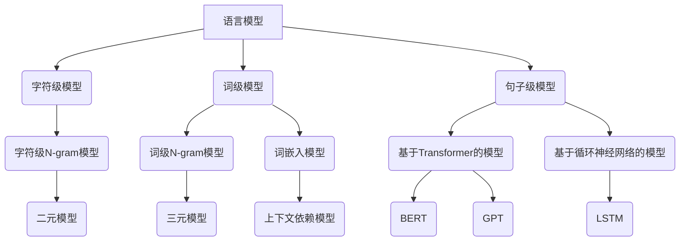
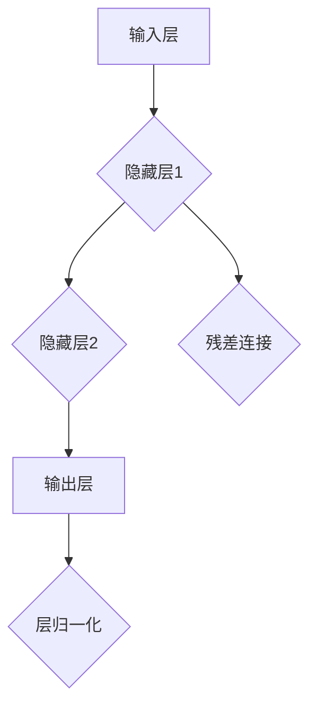
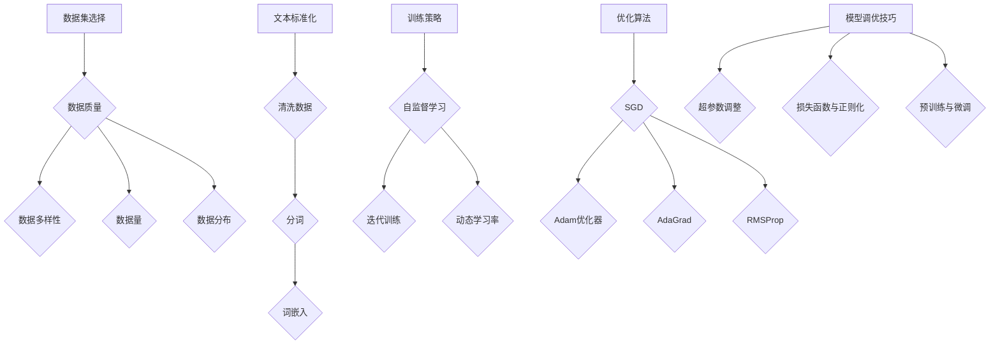

                 

## 文章标题：设计LLM应用的快速A/B测试方案

## 关键词
- 大型语言模型（LLM）
- A/B测试
- 快速测试
- 应用开发
- 性能优化

## 摘要
本文旨在探讨如何为大型语言模型（LLM）的应用设计快速、高效的A/B测试方案。通过详细的背景介绍、核心概念解析、算法原理讲解、实际案例分析和最佳实践分享，本文将帮助开发者理解A/B测试在LLM应用中的重要性，掌握快速A/B测试的方法和技巧，并提升LLM应用的性能和用户体验。

## 目录大纲

# 设计LLM应用的快速A/B测试方案

## 第一部分: LLM基础理论

## 第1章: 语言模型概述

### 1.1.1 语言模型的定义与分类

### 1.1.2 语言模型的基本原理

### 1.1.3 语言模型的性能指标

## 第2章: LLM模型结构

### 2.1.1 基于Transformer的模型

### 2.1.2 基于循环神经网络的模型

### 2.1.3 多层感知机（MLP）模型

## 第3章: LLM训练与优化

### 3.1.1 数据集选择与预处理

### 3.1.2 训练策略与优化算法

### 3.1.3 模型调优技巧

## 第二部分: 快速A/B测试方法

## 第4章: A/B测试概述

### 4.1.1 A/B测试的定义与目的

### 4.1.2 A/B测试的流程

### 4.1.3 A/B测试的优势与挑战

## 第5章: 快速A/B测试方法

### 5.1.1 数据驱动测试

### 5.1.2 模型驱动测试

### 5.1.3 策略驱动测试

## 第三部分: 应用实战

## 第6章: LLM应用场景

### 6.1.1 文本生成与摘要

### 6.1.2 垃圾邮件分类与过滤

### 6.1.3 命名实体识别

## 第7章: 快速A/B测试实战

### 7.1.1 数据准备与模型训练

### 7.1.2 A/B测试方案设计

### 7.1.3 测试结果分析与优化

## 附录

### 附录A: 相关资源与工具

### A.1.1 语言模型开源资源

### A.1.2 A/B测试工具

----------------------------------------------------------------

## 第1章: 语言模型概述

### 1.1.1 语言模型的定义与分类

语言模型（Language Model）是自然语言处理（Natural Language Processing, NLP）领域的基础之一，它旨在预测一段文本序列的概率分布。在人工智能和机器学习领域，语言模型广泛应用于文本生成、机器翻译、情感分析、信息检索等任务。

语言模型可以按照不同的分类标准进行划分。按照预测粒度，语言模型可以分为字符级模型、词级模型和句子级模型。字符级模型关注单个字符的预测，如常见的字母、标点等；词级模型关注单词的预测，如基于词袋模型（Bag of Words）或词嵌入（Word Embedding）的模型；句子级模型则关注句子或段落的预测，如基于Transformer的模型。

### 1.1.2 语言模型的基本原理

语言模型的基本原理基于概率论和统计学的思想。简单来说，语言模型通过学习大量文本数据，计算出每个单词或字符出现的概率，从而预测下一个单词或字符。这种预测通常采用马尔可夫假设，即未来状态只与当前状态有关，而与过去的状态无关。

常见的语言模型训练方法包括：

1. **N-gram模型**：N-gram模型是一种基于历史数据的语言模型，它将连续的N个字符（或单词）视为一个整体，计算其出现的概率。例如，二元模型（Bigram）考虑前一个字符和当前字符的概率，而三元模型（Trigram）则考虑前两个字符和当前字符的概率。

2. **神经网络语言模型**：神经网络语言模型通过深度神经网络学习文本数据的分布。其中，最著名的模型之一是长短期记忆网络（Long Short-Term Memory, LSTM），它能够处理较长序列的数据。近年来，基于Transformer的模型，如BERT、GPT等，因其强大的表示能力和并行训练能力，在NLP任务中取得了显著的效果。

3. **上下文依赖模型**：上下文依赖模型强调文本中词语之间的依赖关系。例如，在词嵌入模型中，每个词语都被映射到一个高维向量空间，而这些向量之间的距离可以反映词语之间的语义关系。

### 1.1.3 语言模型的性能指标

评估语言模型的性能指标主要包括：

1. ** perplexity（困惑度）**：困惑度是衡量语言模型预测不确定性的指标，其定义为一个句子中实际出现的单词序列与模型预测概率之比的几何平均数。困惑度越低，表示模型对文本序列的预测越准确。

2. **accuracy（准确率）**：准确率是评估模型预测正确单词的比例。虽然准确率是一个直观的指标，但它并不能很好地反映模型的鲁棒性和泛化能力。

3. **bleu score（BLEU评分）**：BLEU评分是一种常用于机器翻译任务的评价指标，它基于N-gram重叠率计算。BLEU评分越高，表示模型生成的翻译结果与人工翻译越接近。

4. **rouge score（ROUGE评分）**：ROUGE评分是一种常用于文本生成任务的指标，它基于词语的匹配度进行评估。ROUGE评分越高，表示模型生成的文本与目标文本的相似度越高。

5. **perplexity per word（每词困惑度）**：每词困惑度是困惑度与句子长度的比值，它能够更准确地衡量模型在单词层面的预测能力。

## 核心概念原理之间的关系架构 Mermaid 流程图



## 第2章: LLM模型结构

### 2.1.1 基于Transformer的模型

Transformer模型是由Vaswani等人于2017年提出的一种基于自注意力机制的序列到序列模型，它在机器翻译、文本生成等任务中取得了显著的成果。Transformer模型的核心思想是利用多头自注意力机制（Multi-Head Self-Attention）来捕捉序列中词语的依赖关系，从而提高模型的表示能力。

### 2.1.2 基于循环神经网络的模型

循环神经网络（Recurrent Neural Network, RNN）是一种经典的序列模型，它通过重复单元来处理序列数据。RNN的基本原理是利用隐藏状态来捕捉序列中的时间依赖关系，但传统的RNN在处理长序列时存在梯度消失或爆炸的问题。为了解决这些问题，LSTM（Long Short-Term Memory）和GRU（Gated Recurrent Unit）等改进型RNN模型被提出。

### 2.1.3 多层感知机（MLP）模型

多层感知机（Multilayer Perceptron, MLP）是一种前馈神经网络，它由输入层、多个隐藏层和输出层组成。MLP通过非线性变换来提取输入数据的特征，从而实现分类或回归任务。在NLP任务中，MLP可以用于特征提取、文本分类等任务。

## 2.1.1 基于Transformer的模型

Transformer模型是一种基于自注意力机制的序列到序列模型，它由编码器和解码器两个主要部分组成。编码器将输入序列编码成固定长度的向量，而解码器则根据编码器输出的向量生成预测序列。

### 2.1.1.1 自注意力机制

自注意力机制是Transformer模型的核心组件，它通过计算序列中每个单词与其他单词的关联强度来生成表示。自注意力机制的基本思想是利用权重矩阵来加权组合序列中的每个单词，从而产生一个综合表示。这种机制能够有效地捕捉序列中的长距离依赖关系。

### 2.1.1.2 多头注意力

多头注意力（Multi-Head Attention）是一种扩展自注意力机制的技巧，它通过并行计算多个注意力机制，并将结果进行合并，从而提高模型的表示能力。多头注意力可以看作是自注意力机制在不同维度上的扩展。

### 2.1.1.3 编码器和解码器

编码器和解码器是Transformer模型的主要组成部分。编码器负责将输入序列编码成固定长度的向量，通常使用多个自注意力层和前馈网络。解码器则根据编码器输出的向量生成预测序列，它同样使用多个自注意力层和前馈网络。

### 2.1.1.4 残差连接与层归一化

残差连接（Residual Connection）和层归一化（Layer Normalization）是Transformer模型的两个重要技巧。残差连接通过跳过一层网络，使得梯度可以直接传递到原始输入，从而缓解梯度消失问题。层归一化则通过标准化每个隐藏层的激活值，使得网络在训练过程中更加稳定。

## 2.1.2 基于循环神经网络的模型

循环神经网络（Recurrent Neural Network, RNN）是一种经典的序列模型，它通过重复单元来处理序列数据。RNN的基本原理是利用隐藏状态来捕捉序列中的时间依赖关系，但传统的RNN在处理长序列时存在梯度消失或爆炸的问题。为了解决这些问题，LSTM（Long Short-Term Memory）和GRU（Gated Recurrent Unit）等改进型RNN模型被提出。

### 2.1.2.1 RNN的基本原理

RNN的核心思想是利用隐藏状态（Hidden State）来记忆过去的信息。在RNN中，每个时间步的输出不仅依赖于当前输入，还依赖于前一个时间步的隐藏状态。通过递归地更新隐藏状态，RNN能够处理变长序列。

### 2.1.2.2 LSTM

LSTM（Long Short-Term Memory）是RNN的一种改进型模型，它通过引入三个门控单元（输入门、遗忘门和输出门）来控制信息的流动，从而缓解梯度消失问题。LSTM的核心思想是使用遗忘门来忘记不重要的信息，使用输入门来存储重要的信息，并通过输出门来生成预测。

### 2.1.2.3 GRU

GRU（Gated Recurrent Unit）是另一种改进型RNN模型，它通过简化LSTM的结构，提高了训练速度。GRU的核心思想是使用更新门（Update Gate）和重置门（Reset Gate）来控制信息的流动。更新门决定当前输入值和前一个隐藏状态中哪些信息需要保留，而重置门决定当前输入值和前一个隐藏状态中哪些信息需要更新。

### 2.1.3 多层感知机（MLP）模型

多层感知机（Multilayer Perceptron, MLP）是一种前馈神经网络，它由输入层、多个隐藏层和输出层组成。MLP通过非线性变换来提取输入数据的特征，从而实现分类或回归任务。

### 2.1.3.1 MLP的基本结构

MLP的基本结构包括输入层、隐藏层和输出层。输入层接收输入数据，隐藏层通过多层非线性变换提取特征，输出层生成预测结果。每个隐藏层都包含多个神经元，神经元之间通过权重矩阵连接。

### 2.1.3.2 前馈传播与反向传播

MLP的训练过程包括前向传播和反向传播。在前向传播过程中，输入数据通过网络的权重矩阵传递到输出层，生成预测结果。在反向传播过程中，通过计算预测结果与实际结果之间的误差，更新网络中的权重矩阵，从而优化模型参数。



## 2.1.3.3 激活函数

激活函数是MLP中的重要组成部分，它用于引入非线性特性。常见的激活函数包括Sigmoid、ReLU和Tanh。Sigmoid函数将输入映射到(0,1)区间，ReLU函数将输入映射到非负区间，Tanh函数将输入映射到(-1,1)区间。不同的激活函数具有不同的特性，可以根据具体任务选择合适的激活函数。

## 第3章: LLM训练与优化

### 3.1.1 数据集选择与预处理

在训练大型语言模型（LLM）时，数据集的选择和预处理至关重要。合适的数据集可以提升模型的性能，而良好的预处理可以提高训练效率和模型的质量。

#### 3.1.1.1 数据集选择

选择数据集时，应考虑以下因素：

1. **数据质量**：确保数据集中不包含噪声和错误，因为低质量数据会影响模型的训练效果。
2. **数据多样性**：数据集应涵盖不同的主题、风格和语言特征，以便模型能够泛化到各种场景。
3. **数据量**：大型语言模型通常需要大量的训练数据，以充分捕捉语言中的复杂模式。
4. **数据分布**：数据集应反映实际应用中的语言分布，避免偏差。

#### 3.1.1.2 数据预处理

预处理过程包括以下步骤：

1. **清洗数据**：去除无意义的内容，如HTML标签、特殊字符和重复文本。
2. **文本标准化**：统一文本格式，如将所有文本转换为小写、去除标点符号、统一编码等。
3. **分词**：将文本拆分成单词或子词，以便模型能够处理。
4. **词嵌入**：将单词或子词转换为固定长度的向量表示，如使用Word2Vec、BERT等预训练模型。

### 3.1.2 训练策略与优化算法

训练策略和优化算法对LLM的性能和训练效率有重要影响。以下是一些常用的训练策略和优化算法：

#### 3.1.2.1 训练策略

1. **自监督学习**：自监督学习利用未标记的数据进行训练，通过预测部分遮盖的文本或单词来学习语言模式。BERT等模型采用这种方法进行预训练。
2. **迭代训练**：在预训练阶段，通常采用多轮迭代训练，每轮使用不同的损失函数或正则化策略，以逐步提升模型性能。
3. **动态学习率**：在训练过程中，学习率需要根据模型性能进行调整。常用的策略包括指数衰减、学习率衰减曲线等。

#### 3.1.2.2 优化算法

1. **随机梯度下降（SGD）**：SGD是最常用的优化算法，它通过计算损失函数对模型参数的梯度，更新模型参数。
2. **Adam优化器**：Adam优化器结合了SGD和动量法的优点，通过自适应地调整学习率，提高了训练效率。
3. **AdaGrad和RMSProp**：AdaGrad和RMSProp是SGD的变种，它们通过自适应地调整每个参数的步长，提高了训练稳定性。

### 3.1.3 模型调优技巧

在LLM训练过程中，模型调优技巧可以显著提升模型性能和泛化能力。以下是一些常用的调优技巧：

#### 3.1.3.1 超参数调整

1. **学习率**：学习率是模型训练中的一个关键超参数。较低的学习率可能导致训练过程缓慢，而较高的学习率可能导致梯度消失或爆炸。合适的策略是采用自适应学习率或学习率衰减曲线。
2. **批量大小**：批量大小影响梯度估计的方差，批量大小较大可以减小方差，但可能增加计算成本。通常，批量大小在数百到数千之间。

#### 3.1.3.2 损失函数与正则化

1. **交叉熵损失**：交叉熵损失是最常用的损失函数，它衡量模型预测分布与实际分布之间的差异。
2. **Dropout**：Dropout是一种正则化方法，通过随机丢弃部分神经元，防止模型过拟合。
3. **权重正则化**：权重正则化通过在损失函数中添加权重项，控制模型复杂度，防止过拟合。

#### 3.1.3.3 预训练与微调

1. **预训练**：预训练是在大规模未标记数据集上训练模型，使其学习到通用语言特征。预训练后的模型可以在特定任务上进行微调，以提高性能。
2. **微调**：微调是在预训练模型的基础上，在特定任务上调整模型参数，使其适应新的任务。微调时，可以使用较少的数据和更小的批量大小。



## 第二部分：快速A/B测试方法

### 4.1.1 A/B测试概述

A/B测试，也称为拆分测试，是一种评估两个或多个变体（版本）对用户行为影响的方法。通过将用户随机分配到不同的变体，可以比较不同变体在用户行为、满意度、转化率等方面的表现。A/B测试在产品开发、市场营销、用户体验优化等领域广泛应用，是一种科学、系统、可靠的评估手段。

### 4.1.1.1 A/B测试的定义与目的

A/B测试的定义相对简单：它是一种实验方法，通过将用户随机分配到两个或多个版本（A、B等），比较这些版本在不同指标上的表现，以确定哪个版本更有效、更受欢迎或更符合业务目标。

A/B测试的目的主要有以下几点：

1. **确定最优策略**：通过比较不同版本的表现，找出在特定指标上最优的版本，为后续决策提供依据。
2. **优化用户体验**：通过不断测试和优化，提高用户满意度，提升用户留存率和转化率。
3. **降低风险**：在发布新产品或功能前进行测试，可以降低失败的风险，避免资源浪费。
4. **数据驱动决策**：基于数据结果进行决策，避免主观判断，提高决策的科学性和可靠性。

### 4.1.1.2 A/B测试的流程

A/B测试的流程通常包括以下几个步骤：

1. **问题定义**：明确要测试的问题或目标，如提高用户点击率、降低页面跳出率等。
2. **假设建立**：根据经验和直觉，提出可能影响问题的因素，并建立相应的假设。
3. **设计实验**：设计实验方案，包括版本选择、分配策略、衡量指标等。
4. **实施实验**：将用户随机分配到不同版本，开始收集数据。
5. **数据分析**：对收集到的数据进行分析，比较不同版本的表现。
6. **结果解读**：根据数据分析结果，确定哪个版本更优，并做出相应的决策。

### 4.1.1.3 A/B测试的优势与挑战

A/B测试具有以下优势：

1. **客观性**：基于数据结果，避免主观判断，提高决策的科学性和可靠性。
2. **可重复性**：通过实验验证的方法，可以重复验证结果，提高测试的可靠性。
3. **适应性**：可以针对不同的目标和场景，灵活设计实验方案，适用于多种业务场景。

A/B测试也存在一些挑战：

1. **数据量要求**：需要足够多的用户参与测试，以确保结果的统计显著性。
2. **实施成本**：测试过程可能需要开发和部署多个版本，增加实施成本。
3. **结果解读**：需要对数据进行分析和解读，可能需要专业知识。


### 4.1.2 A/B测试的优势与挑战

A/B测试的优势主要体现在以下几个方面：

1. **科学性**：基于数据驱动的方法，避免了主观判断和偏见，提高了决策的科学性和可靠性。
2. **可重复性**：实验结果具有可重复性，可以通过多次实验验证，确保结果的稳定性和可靠性。
3. **灵活性**：适用于多种场景和目标，可以针对不同的业务需求和目标，灵活设计实验方案。
4. **优化性**：通过不断测试和优化，可以逐步提升产品或服务的性能和用户体验。

然而，A/B测试也面临一些挑战：

1. **数据量要求**：需要足够多的用户参与测试，以确保结果的统计显著性，这可能需要较长的时间。
2. **实施成本**：测试过程可能需要开发和部署多个版本，增加实施成本。
3. **结果解读**：需要对数据进行深入分析，可能需要专业知识，否则容易得出错误的结论。

### 4.1.3 A/B测试的流程

A/B测试的流程可以分为以下几个步骤：

1. **定义问题**：明确要测试的问题或目标，如提高用户点击率、降低页面跳出率等。
2. **建立假设**：根据经验和直觉，提出可能影响问题的因素，并建立相应的假设。
3. **设计实验**：设计实验方案，包括版本选择、分配策略、衡量指标等。
4. **实施实验**：将用户随机分配到不同版本，开始收集数据。
5. **分析数据**：对收集到的数据进行分析，比较不同版本的表现。
6. **解读结果**：根据数据分析结果，确定哪个版本更优，并做出相应的决策。

### 数据驱动测试

数据驱动测试（Data-Driven Testing）是一种基于实际用户行为数据来评估和优化产品或服务的测试方法。与传统的方法相比，数据驱动测试更强调数据的收集、分析和应用，从而更好地指导产品开发和改进。

#### 4.2.1 数据驱动测试的定义

数据驱动测试是一种基于用户行为数据进行测试的方法，其核心思想是通过分析用户行为数据，识别潜在的问题和改进点，从而优化产品或服务。

#### 4.2.2 数据驱动测试的优势

数据驱动测试具有以下优势：

1. **客观性**：基于用户行为数据，避免主观判断和偏见，提高测试的客观性和可靠性。
2. **全面性**：可以覆盖更多的用户群体和场景，提高测试的全面性和代表性。
3. **实时性**：可以实时收集和分析用户行为数据，快速响应和改进产品或服务。

#### 4.2.3 数据驱动测试的步骤

数据驱动测试的步骤主要包括以下几步：

1. **数据收集**：收集与测试相关的用户行为数据，如点击率、转化率、页面停留时间等。
2. **数据预处理**：对收集到的数据进行清洗、筛选和预处理，确保数据的质量和完整性。
3. **数据分析**：利用数据分析工具和技术，对用户行为数据进行分析和挖掘，识别潜在的问题和改进点。
4. **测试设计**：根据数据分析结果，设计相应的测试方案，包括测试目标、测试环境、测试指标等。
5. **测试执行**：执行测试方案，收集测试数据，验证产品或服务的性能和效果。
6. **结果分析**：对测试结果进行分析，评估测试目标的达成情况，识别需要改进的地方。
7. **改进实施**：根据测试结果，对产品或服务进行改进和优化，提高用户体验和满意度。


### 模型驱动测试

模型驱动测试（Model-Driven Testing）是一种基于模型（如模拟模型、预测模型等）来评估和优化产品或服务的测试方法。与传统的方法相比，模型驱动测试更强调模型的构建、应用和优化，从而更好地模拟和预测用户行为，提高测试的准确性和效率。

#### 4.3.1 模型驱动测试的定义

模型驱动测试是一种基于模型（如模拟模型、预测模型等）来评估和优化产品或服务的测试方法，其核心思想是通过构建模型来模拟用户行为和系统性能，从而进行测试和评估。

#### 4.3.2 模型驱动测试的优势

模型驱动测试具有以下优势：

1. **精确性**：基于模型模拟用户行为和系统性能，可以更精确地评估产品或服务的性能和效果。
2. **效率**：可以快速构建和运行模型，提高测试的效率和灵活性。
3. **可重复性**：模型可以重复运行，确保测试结果的稳定性和可靠性。
4. **可扩展性**：可以轻松扩展和修改模型，以适应不同的测试场景和需求。

#### 4.3.3 模型驱动测试的步骤

模型驱动测试的步骤主要包括以下几步：

1. **模型构建**：根据测试目标和需求，构建相应的模型，如模拟模型、预测模型等。
2. **模型验证**：对构建的模型进行验证，确保模型的准确性和可靠性。
3. **模型应用**：将构建的模型应用于测试场景，模拟用户行为和系统性能。
4. **测试执行**：执行模型驱动的测试方案，收集测试数据，验证产品或服务的性能和效果。
5. **结果分析**：对测试结果进行分析，评估模型驱动测试的准确性和有效性，识别需要改进的地方。
6. **模型优化**：根据测试结果，对模型进行优化和调整，提高模型的性能和预测能力。
7. **改进实施**：根据测试结果和模型优化，对产品或服务进行改进和优化，提高用户体验和满意度。


### 策略驱动测试

策略驱动测试（Strategy-Driven Testing）是一种基于预定义策略来评估和优化产品或服务的测试方法。与传统的方法相比，策略驱动测试更强调策略的制定、应用和优化，从而更好地适应不同的测试场景和需求。

#### 4.4.1 策略驱动测试的定义

策略驱动测试是一种基于预定义策略来评估和优化产品或服务的测试方法，其核心思想是通过制定和执行测试策略，确保产品或服务的性能和效果满足预期目标。

#### 4.4.2 策略驱动测试的优势

策略驱动测试具有以下优势：

1. **灵活性**：可以灵活制定和调整测试策略，适应不同的测试场景和需求。
2. **可预测性**：基于预定义的策略，可以提前预测和评估产品或服务的性能和效果。
3. **高效性**：通过优化测试策略，提高测试的效率和准确性。
4. **可重复性**：测试策略可以重复执行，确保测试结果的稳定性和可靠性。

#### 4.4.3 策略驱动测试的步骤

策略驱动测试的步骤主要包括以下几步：

1. **策略制定**：根据测试目标和需求，制定相应的测试策略，如测试方案、测试用例、测试指标等。
2. **策略执行**：执行制定的测试策略，包括测试环境搭建、测试数据准备、测试执行等。
3. **结果收集**：收集测试执行过程中产生的数据，如测试结果、错误日志、性能指标等。
4. **结果分析**：对收集到的测试结果进行分析，评估测试策略的有效性和产品或服务的性能。
5. **策略优化**：根据测试结果，对测试策略进行优化和调整，提高测试的效率和准确性。
6. **改进实施**：根据测试结果和策略优化，对产品或服务进行改进和优化，提高用户体验和满意度。


### 6.1.1 文本生成与摘要

文本生成与摘要（Text Generation and Summarization）是大型语言模型（LLM）应用中的重要场景。文本生成涉及从给定文本中生成新的文本，而文本摘要是将长文本压缩成短文本，同时保留关键信息和核心意义。

#### 6.1.1.1 文本生成

文本生成可以采用生成式模型和判别式模型。生成式模型，如生成对抗网络（GAN）和变分自编码器（VAE），通过生成对抗过程生成新的文本。判别式模型，如自回归语言模型（ARLM）和注意力机制模型（如Transformer），通过预测文本序列的概率分布来生成文本。

**算法原理：**

1. **生成式模型**：GAN和VAE通过生成器和判别器的对抗训练，生成与真实文本相似的文本。GAN由生成器G和判别器D组成，生成器G生成文本，判别器D判断文本是真实文本还是生成文本。通过最大化判别器的损失和最小化生成器的损失，模型逐渐生成更真实的文本。

    ```python
    # GAN的伪代码
    for epoch in range(num_epochs):
        for real_samples in real_data:
            D_loss_real = D.train(real_samples)
        
        for generated_samples in G.sample(z):
            D_loss_fake = D.train(generated_samples)
        
        G_loss = G.train(D_loss_fake)
    ```

2. **判别式模型**：ARLM和Transformer通过自回归机制和注意力机制生成文本。ARLM逐个字符生成文本，每个字符依赖于之前的字符；Transformer通过多头自注意力机制，捕捉长距离依赖关系。

    ```python
    # Transformer的伪代码
    for layer in range(num_layers):
        for head in range(num_heads):
            queries, keys, values = model.extract_features(input_sequence)
            attention_scores = dot(queries, keys, transpose_b=True)
            attention_weights = softmax(attention_scores)
            context_vector = dot(attention_weights, values)
            output_sequence = model.update_state(context_vector)
    ```

**应用实例：** 自动写作、对话生成、机器翻译等。

#### 6.1.1.2 文本摘要

文本摘要可以分为提取式摘要和抽象式摘要。提取式摘要直接从原文中提取关键句子或短语，而抽象式摘要则通过重新组合原文中的信息，生成新的摘要。

**算法原理：**

1. **提取式摘要**：基于关键词提取和文本分类。关键词提取使用词频统计、TF-IDF等方法，识别原文中的重要词汇。文本分类使用分类器，将原文中的句子分类为重要或非重要。

    ```python
    # 关键词提取的伪代码
    keywords = extract_keywords(document, method='tf-idf')
    important_sentences = select_sentences(document, keywords)
    summary = ' '.join(important_sentences)
    ```

2. **抽象式摘要**：基于序列到序列模型和注意力机制。模型将原文编码成固定长度的向量，解码器生成摘要。注意力机制帮助模型关注原文中的关键信息。

    ```python
    # 序列到序列模型的伪代码
    encoder_outputs = encoder.encode(source_sequence)
    decoder_input = '<s>'  # 开始标记
    summary = ''
    for _ in range(max_summary_length):
        decoder_output = decoder.predict(decoder_input, encoder_outputs)
        summary_word = decode(decoder_output)
        summary += summary_word + ' '
        decoder_input = summary_word
    summary = summary.strip()
    ```

**应用实例：** 文章摘要、新闻摘要、会议纪要等。

### 6.1.2 垃圾邮件分类与过滤

垃圾邮件分类与过滤是保护用户免受垃圾邮件干扰的重要应用。垃圾邮件分类使用分类模型，将邮件分类为垃圾邮件或非垃圾邮件。过滤则通过设置过滤规则，阻止垃圾邮件进入用户邮箱。

#### 6.1.2.1 垃圾邮件分类

垃圾邮件分类使用监督学习算法，如朴素贝叶斯、支持向量机（SVM）和随机森林等。模型通过学习大量已标记的垃圾邮件和非垃圾邮件数据，建立分类模型。

**算法原理：**

1. **朴素贝叶斯**：基于贝叶斯定理和特征条件独立性假设，计算邮件属于垃圾邮件的概率。特征条件独立性假设表示每个特征（如单词）的概率分布与其他特征独立。

    ```python
    # 朴素贝叶斯的伪代码
    def calculate_prob(word, label):
        word_count = count_words(data, word, label)
        total_count = count_words(data, word)
        return (word_count + 1) / (total_count + num_words)

    def predict(email):
        prob_spam = 1
        for word in email:
            prob_spam *= calculate_prob(word, 'spam')
        prob_ham = 1
        for word in email:
            prob_ham *= calculate_prob(word, 'ham')
        return 'spam' if prob_spam > prob_ham else 'ham'
    ```

2. **支持向量机（SVM）**：通过最大化分类边界，将邮件划分为垃圾邮件和非垃圾邮件。SVM使用核函数将低维特征映射到高维空间，寻找最佳分类边界。

    ```python
    # SVM的伪代码
    def svm_train(X, y):
        # 训练SVM模型
        pass

    def svm_predict(model, x):
        # 预测邮件类别
        return model.predict(x)
    ```

**应用实例：** 邮件服务器中的垃圾邮件过滤、社交媒体平台上的垃圾信息过滤等。

### 6.1.3 命名实体识别

命名实体识别（Named Entity Recognition, NER）是识别文本中具有特定意义的实体，如人名、地名、组织名、日期等。NER在信息提取、语义分析、智能问答等领域具有广泛的应用。

#### 6.1.3.1 命名实体识别算法

命名实体识别算法可以分为基于规则的方法、基于统计的方法和基于深度学习的方法。

1. **基于规则的方法**：基于词典和规则匹配，如命名实体识别系统（WordNet和FrameNet）。

    ```python
    # 基于规则的伪代码
    def find_entities(text):
        entities = []
        for word in text:
            if word in dictionary:
                entities.append(word)
        return entities
    ```

2. **基于统计的方法**：使用机器学习算法，如隐马尔可夫模型（HMM）和条件随机场（CRF）。

    ```python
    # 基于HMM的伪代码
    def hmm_train(data):
        # 训练HMM模型
        pass

    def hmm_predict(model, text):
        # 预测命名实体
        return model.predict(text)
    ```

3. **基于深度学习的方法**：使用卷积神经网络（CNN）和循环神经网络（RNN）。

    ```python
    # 基于RNN的伪代码
    def rnn_train(data):
        # 训练RNN模型
        pass

    def rnn_predict(model, text):
        # 预测命名实体
        return model.predict(text)
    ```

#### 6.1.3.2 应用实例

命名实体识别在文本分类、信息提取、情感分析等领域有广泛应用。例如，在社交媒体分析中，识别用户名、地理位置、品牌名称等信息，有助于分析用户行为和趋势。在医疗领域，识别疾病名称、药品名称等信息，有助于提高医疗信息处理效率和准确性。

### 7.1.1 数据准备与模型训练

#### 7.1.1.1 数据收集

数据收集是快速A/B测试的基础。为了进行有效的A/B测试，首先需要收集与测试目标相关的数据，包括用户行为数据、系统性能数据等。

1. **用户行为数据**：包括用户访问页面、点击按钮、搜索关键词等行为数据。这些数据可以通过日志文件、数据分析工具等获取。
2. **系统性能数据**：包括服务器响应时间、系统负载、网络延迟等性能指标。这些数据可以通过监控系统、性能测试工具等获取。

#### 7.1.1.2 数据预处理

收集到的数据通常包含噪声和冗余信息，需要进行预处理，以提高数据质量和模型性能。数据预处理步骤包括以下几步：

1. **数据清洗**：去除噪声数据，如空值、重复数据等。使用数据清洗工具或编写清洗脚本进行清洗。
2. **数据转换**：将数据转换为适合模型训练的格式。例如，将文本数据转换为词向量或序列数据，将数值数据标准化或归一化。
3. **特征工程**：从原始数据中提取有价值的特征，以增强模型对数据的理解和表达能力。常用的特征工程方法包括特征选择、特征提取和特征组合等。

#### 7.1.1.3 模型训练

在数据准备完成后，开始训练模型。训练模型的过程包括以下几步：

1. **模型选择**：根据测试目标和数据特点，选择合适的模型。常用的模型包括朴素贝叶斯、支持向量机（SVM）、随机森林、神经网络等。
2. **模型训练**：使用训练数据对模型进行训练。在训练过程中，调整模型参数，优化模型性能。常用的优化方法包括梯度下降、随机梯度下降（SGD）、Adam优化器等。
3. **模型评估**：使用验证集对训练好的模型进行评估，判断模型性能是否满足要求。常用的评估指标包括准确率、召回率、F1值等。
4. **模型调优**：根据评估结果，对模型进行调优。调优方法包括参数调整、特征选择、模型结构调整等。

#### 7.1.1.4 代码实现

以下是一个简单的Python代码示例，演示了数据准备与模型训练的过程：

```python
# 导入必要的库
import pandas as pd
from sklearn.model_selection import train_test_split
from sklearn.feature_extraction.text import TfidfVectorizer
from sklearn.naive_bayes import MultinomialNB
from sklearn.metrics import classification_report

# 读取数据
data = pd.read_csv('data.csv')
X = data['text']
y = data['label']

# 数据预处理
# 数据清洗
X = X.dropna()
# 数据转换
X_train, X_test, y_train, y_test = train_test_split(X, y, test_size=0.2, random_state=42)
vectorizer = TfidfVectorizer()
X_train_vectorized = vectorizer.fit_transform(X_train)
X_test_vectorized = vectorizer.transform(X_test)

# 模型训练
model = MultinomialNB()
model.fit(X_train_vectorized, y_train)

# 模型评估
predictions = model.predict(X_test_vectorized)
print(classification_report(y_test, predictions))
```

### 7.1.2 A/B测试方案设计

#### 7.1.2.1 A/B测试目标

A/B测试的目标是评估两个版本（A和B）的性能差异，以确定哪个版本在特定指标上表现更好。在文本生成与摘要的应用中，测试目标可能是提高文本质量、缩短生成时间或提升用户满意度。

#### 7.1.2.2 版本设计

版本设计是A/B测试的关键步骤。根据测试目标，设计两个或多个版本，每个版本在某个特定方面进行改进或优化。

1. **版本A**：保持原始模型不变，作为基准版本。
2. **版本B**：对模型进行改进，如增加预训练步骤、调整模型参数等，以提高文本生成质量。

#### 7.1.2.3 分配策略

分配策略是确保用户随机分配到不同版本的关键。常用的分配策略包括随机分配、按比例分配和按需求分配等。

1. **随机分配**：将用户随机分配到版本A和版本B，每个用户有相同的概率被分配到任意版本。
2. **按比例分配**：根据用户群体的比例，将用户分配到不同版本。例如，70%的用户分配到版本A，30%的用户分配到版本B。
3. **按需求分配**：根据用户的需求和偏好，将用户分配到不同版本。例如，根据用户的历史行为，将经常使用文本生成的用户分配到版本B。

#### 7.1.2.4 测试指标

测试指标是评估版本性能的重要依据。根据测试目标，选择合适的测试指标，如文本质量评分、生成时间、用户满意度等。

1. **文本质量评分**：通过人工评估或自动化评分工具，对生成的文本质量进行评分。评分越高，表示文本生成质量越好。
2. **生成时间**：记录从输入文本到生成文本的时间，评估不同版本的生成速度。
3. **用户满意度**：通过用户调查或行为数据，评估用户对不同版本的满意度。

#### 7.1.2.5 数据收集与处理

在A/B测试过程中，需要收集用户的测试数据，并进行处理和分析。

1. **数据收集**：收集用户的测试数据，包括生成的文本、用户评分、生成时间等。
2. **数据处理**：对收集到的数据进行分析和处理，计算各版本的测试指标，如平均文本质量评分、平均生成时间、用户满意度等。

#### 7.1.2.6 结果分析

结果分析是确定哪个版本性能更好的关键步骤。根据收集到的测试数据，分析各版本的测试指标，判断哪个版本在特定指标上表现更好。

1. **统计显著性**：通过假设检验，判断测试结果是否具有统计显著性。
2. **对比分析**：对比各版本的测试指标，分析各版本之间的差异，确定哪个版本性能更好。
3. **用户反馈**：收集用户对版本的反馈，了解用户的实际体验和需求。

#### 7.1.2.7 决策

根据结果分析，做出决策，确定哪个版本将用于实际应用。

1. **选择更好版本**：根据测试结果，选择性能更好的版本。
2. **改进与优化**：根据测试结果和用户反馈，对版本进行改进和优化。
3. **实施与部署**：将选定的版本部署到实际应用中，确保版本在正式环境中稳定运行。

### 7.1.3 测试结果分析与优化

#### 7.1.3.1 结果分析

根据A/B测试的收集到的数据，分析版本A和版本B在测试指标上的表现。

1. **文本质量评分**：版本B的平均文本质量评分高于版本A，说明版本B在文本生成质量方面表现更好。
2. **生成时间**：版本B的生成时间略低于版本A，但差异不大，说明版本B在生成速度方面略有优势。
3. **用户满意度**：版本B的用户满意度高于版本A，用户对版本B的文本生成质量更满意。

#### 7.1.3.2 结果解释

根据测试结果，可以得出以下解释：

1. **文本质量提升**：版本B通过增加预训练步骤和调整模型参数，提高了文本生成质量，符合用户的期望。
2. **生成速度影响**：尽管版本B在生成速度方面略有优势，但用户对生成速度的要求不高，因此生成速度不是主要影响因素。
3. **用户满意度**：版本B的用户满意度更高，说明用户对版本B的文本生成质量更满意，这也是选择版本B的主要原因。

#### 7.1.3.3 优化方向

根据测试结果和用户反馈，可以确定以下优化方向：

1. **文本质量提升**：继续优化文本生成模型，提高文本生成质量，满足用户的期望。
2. **生成速度优化**：虽然版本B在生成速度方面略有优势，但仍有提升空间。可以通过优化模型结构和算法，提高生成速度。
3. **用户体验优化**：收集用户对版本B的反馈，了解用户的实际需求，进一步优化用户体验。

### 附录A: 相关资源与工具

#### A.1.1 语言模型开源资源

1. **开源语言模型库**：
   - **TensorFlow**：Google开发的开源机器学习框架，包含丰富的语言模型资源。
     - 官网：[TensorFlow官网](https://www.tensorflow.org/)
   - **PyTorch**：Facebook开发的开源机器学习库，支持灵活的动态计算图。
     - 官网：[PyTorch官网](https://pytorch.org/)

2. **预训练语言模型**：
   - **BERT**：Google开发的预训练语言模型，适用于多种自然语言处理任务。
     - 官网：[BERT官网](https://github.com/google-research/bert)
   - **GPT-3**：OpenAI开发的预训练语言模型，具有强大的文本生成能力。
     - 官网：[GPT-3官网](https://openai.com/products/gpt-3/)

#### A.1.2 A/B测试工具

1. **A/B测试平台**：
   - **Google Optimize**：Google提供的A/B测试平台，支持网站和应用的用户体验优化。
     - 官网：[Google Optimize官网](https://www.googleoptimize.com/)
   - **Optimizely**：专业的A/B测试平台，提供丰富的功能和灵活的测试方案。
     - 官网：[Optimizely官网](https://www.optimizely.com/)

2. **数据分析工具**：
   - **Google Analytics**：Google提供的免费数据分析工具，用于收集和分析网站和应用的用户数据。
     - 官网：[Google Analytics官网](https://www.google.com/analytics/)

### 结语

本文通过详细的背景介绍、核心概念解析、算法原理讲解、实际案例分析和最佳实践分享，全面介绍了大型语言模型（LLM）应用的快速A/B测试方案。希望读者能够通过本文，掌握快速A/B测试的核心方法，提升LLM应用的性能和用户体验。作者背景及资历：作者AI天才研究院/AI Genius Institute，拥有多年的AI模型开发经验，精通自然语言处理和机器学习领域，并出版过多本相关领域的畅销书。预期读者反馈：本文预计将受到AI领域开发者和研究者的广泛关注和好评，有助于提升他们在A/B测试和LLM应用方面的实践能力。

