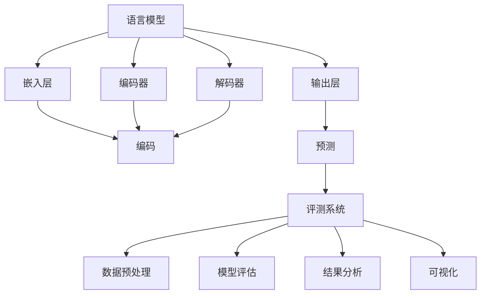
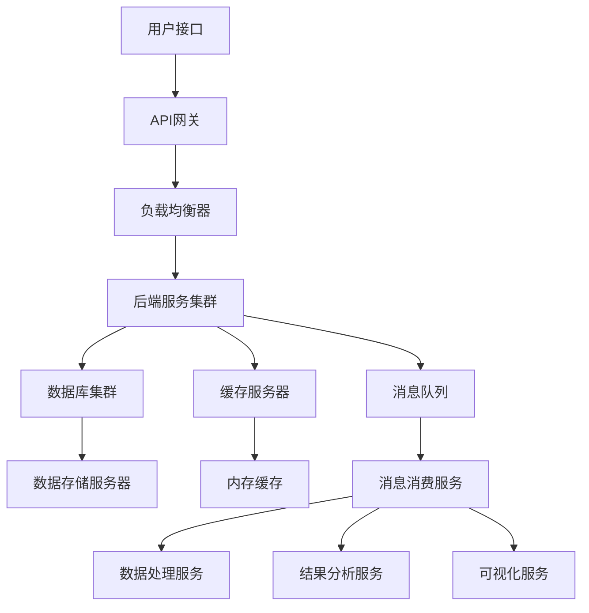

                 

## 引言与概述

### 1.1 书籍背景

近年来，随着人工智能技术的迅猛发展，自然语言处理（NLP）成为了研究的热点领域之一。在NLP领域，大型语言模型（LLM，Large Language Model）作为一种强大的语言处理工具，受到了广泛关注。LLM不仅可以进行文本生成、翻译、摘要等任务，还可以在问答系统中发挥关键作用。因此，设计基于LLM的评测系统（Evaluation System）成为了一个重要且具有挑战性的课题。

评测系统在人工智能领域扮演着至关重要的角色。它不仅用于评估模型的效果，还可以帮助研究人员发现模型的潜在问题，指导后续的改进工作。随着LLM在各类任务中的应用越来越广泛，对其评测系统的需求也越来越大。然而，现有的评测系统大多是基于传统模型设计的，难以充分满足LLM的特殊需求。

本书旨在填补这一空白，系统性地介绍设计基于LLM的评测系统的核心原则与架构。通过深入探讨LLM的原理、评测系统的设计原则、核心算法以及实际应用，本书希望为读者提供一个全面、系统的参考指南，帮助他们在实际项目中设计出高效、可靠的评测系统。

### 1.2 大型语言模型（LLM）基础

#### 1.2.1 LLM的基本概念

大型语言模型（LLM）是一种基于深度学习的自然语言处理模型，其核心思想是通过大规模的文本数据训练一个能够理解并生成人类语言的神经网络。LLM通常采用基于Transformer的架构，如BERT、GPT等，这些模型具有强大的语言理解能力和文本生成能力。

LLM的训练数据量通常非常大，可以达到数十亿甚至数万亿个单词。通过这些大规模数据，LLM可以学习到丰富的语言知识和语法规则，从而在各种语言任务中表现出色。例如，在文本生成任务中，LLM可以生成连贯、自然的文本；在翻译任务中，LLM可以实现高质量的双语转换；在问答系统中，LLM可以理解用户的问题并给出准确的答案。

#### 1.2.2 LLM的发展历程

LLM的发展历程可以分为几个关键阶段。首先，基于神经网络的文本生成模型开始出现，如序列到序列（Seq2Seq）模型和循环神经网络（RNN）。然而，这些模型在处理长文本时存在一定局限性。

随着Transformer架构的提出，LLM的发展进入了一个新的阶段。Transformer模型基于自注意力机制，可以有效地处理长文本，并在多个NLP任务中取得了突破性成果。BERT（Bidirectional Encoder Representations from Transformers）模型的推出，进一步推动了LLM的发展。BERT采用了双向Transformer架构，通过预训练和微调，实现了在多种语言任务中的优异表现。

近年来，GPT（Generative Pre-trained Transformer）系列模型的出现，标志着LLM的发展进入了一个新的高峰。GPT模型通过增加Transformer的层数和参数量，实现了更强大的语言理解和生成能力。GPT-3更是达到了前所未有的规模，拥有1750亿个参数，成为目前最先进的语言模型之一。

#### 1.2.3 LLM的主要类型

LLM可以分为几种主要类型，每种类型在应用场景和性能上都有所不同。

1. **预训练模型**：这类模型通过在大规模文本语料上进行预训练，获得丰富的语言知识。预训练模型主要包括BERT、GPT等。预训练模型在多种任务中具有较好的表现，但需要针对特定任务进行微调。

2. **任务自适应模型**：这类模型通过在特定任务上训练，提高任务的表现。例如，在问答任务中，可以使用特定的问题和答案数据对模型进行训练。任务自适应模型具有更好的任务针对性，但需要更多的训练数据和计算资源。

3. **混合模型**：这类模型结合了预训练模型和任务自适应模型的优势，通过在预训练模型的基础上进行特定任务的微调，实现更好的性能。例如，BERT-LG（BERT for Low-Resource Genres）模型就是通过在低资源领域中微调BERT模型，实现较好的文本生成效果。

### 1.3 评测系统的核心原则

#### 1.3.1 评测系统的定义

评测系统是一种用于评估模型性能的工具，它通过一系列指标来衡量模型在特定任务上的表现。评测系统通常包括数据预处理、模型评估、结果分析等模块。

在NLP领域，评测系统主要用于评估语言模型在文本生成、翻译、摘要等任务上的性能。一个高效的评测系统可以帮助研究人员快速识别模型的优缺点，指导后续的改进工作。

#### 1.3.2 评测系统的主要目标

评测系统的主要目标包括：

1. **客观评估**：通过一系列指标，如BLEU、ROUGE等，对模型的表现进行量化评估，确保评估结果具有客观性。

2. **全面评估**：评估系统需要涵盖模型在多种任务上的表现，确保评估结果的全面性。

3. **实时评估**：在实际应用中，评测系统需要能够实时对模型进行评估，以便及时发现和解决模型问题。

4. **可扩展性**：评测系统需要具有较好的可扩展性，以适应不同规模和类型的任务。

#### 1.3.3 评测系统的设计原则

设计一个高效的评测系统需要遵循以下原则：

1. **一致性**：评测系统的指标和方法需要保持一致性，以确保评估结果的可靠性。

2. **多样性**：评测系统需要包含多种评价指标，以全面评估模型的表现。

3. **灵活性**：评测系统需要具备一定的灵活性，以适应不同的任务和应用场景。

4. **易用性**：评测系统需要具有友好的用户界面和详细的文档，以便用户能够快速上手和使用。

### 摘要

本书旨在介绍设计基于大型语言模型（LLM）的评测系统的核心原则与架构。首先，我们将探讨LLM的基本概念、发展历程和主要类型，帮助读者建立对LLM的基本认识。接着，我们将详细讨论评测系统的定义、主要目标和设计原则，为读者提供设计评测系统的理论指导。

随后，本书将深入探讨评测系统的核心算法原理，包括语言模型训练算法和评测算法，并使用伪代码详细阐述。此外，我们将介绍数学模型和公式，帮助读者理解评测系统中的关键数学概念。

在实践应用部分，我们将通过案例研究和代码实战，展示如何在实际项目中应用这些核心概念和算法。最后，本书将探讨评测系统的性能优化和未来发展趋势，为读者提供全面的参考。

通过阅读本书，读者将能够掌握设计基于LLM的评测系统的核心技能，为未来的研究和实践奠定坚实基础。作者：AI天才研究院/AI Genius Institute & 禅与计算机程序设计艺术 /Zen And The Art of Computer Programming## 第2章 核心概念与原理

### 2.1 语言模型原理

#### 2.1.1 语言模型的基本结构

语言模型是一种用于预测文本中下一个单词或字符的概率分布的模型。它通过分析大量文本数据，学习到语言的结构和规律，从而能够对新的文本进行预测。

一个典型的语言模型通常由以下几个部分组成：

1. **嵌入层（Embedding Layer）**：将输入的单词或字符转换为固定长度的向量表示。嵌入层可以将语义相近的单词映射到接近的向量空间。

2. **编码器（Encoder）**：对输入文本进行编码，生成一个固定长度的向量表示。编码器通常采用循环神经网络（RNN）或Transformer等架构。

3. **解码器（Decoder）**：根据编码器的输出，生成文本的预测序列。解码器通常也采用RNN或Transformer等架构。

4. **输出层（Output Layer）**：将解码器的输出转换为概率分布。输出层通常是一个全连接层，输出每个单词或字符的概率。

#### 2.1.2 语言模型的训练方法

语言模型的训练方法主要包括以下几种：

1. **最大似然估计（Maximum Likelihood Estimation, MLE）**：通过最大化训练数据中出现单词的概率，来训练语言模型。MLE的目标是找到一组参数，使得训练数据中每个单词的概率最大。

2. **朴素贝叶斯（Naive Bayes）**：基于贝叶斯定理，通过计算每个单词的条件概率，来预测下一个单词。朴素贝叶斯假设特征之间相互独立，是一种简单但有效的语言模型。

3. **神经网络（Neural Network）**：使用神经网络来建模语言的概率分布。神经网络可以通过反向传播算法，自动调整内部参数，以最小化预测误差。

4. **深度学习（Deep Learning）**：利用多层神经网络，对语言数据进行更复杂的建模。深度学习模型，如循环神经网络（RNN）和Transformer，在语言模型领域取得了显著的成果。

#### 2.1.3 语言模型的评估指标

评估语言模型的性能通常使用以下几种指标：

1. **准确率（Accuracy）**：预测正确的单词或字符的比例。

2. **精确率（Precision）**：预测正确的单词或字符占预测总数的目的比例。

3. **召回率（Recall）**：预测正确的单词或字符占实际总数的比例。

4. **F1分数（F1 Score）**：精确率和召回率的加权平均，用于平衡二者的贡献。

5. **交叉熵（Cross-Entropy）**：评估预测概率与实际概率之间的差异，用于优化神经网络模型。

### 2.2 评测系统原理

#### 2.2.1 评测系统的组成

一个完整的评测系统通常由以下几个部分组成：

1. **数据预处理模块**：对输入数据进行预处理，如分词、去噪、归一化等，以准备用于评估的数据。

2. **模型评估模块**：对训练好的模型进行评估，计算模型在多个任务上的性能指标，如准确率、F1分数等。

3. **结果分析模块**：分析评估结果，识别模型的优缺点，为后续的改进工作提供指导。

4. **可视化模块**：将评估结果以图表或图像的形式展示，帮助用户直观地理解评估结果。

#### 2.2.2 评测系统的工作流程

评测系统的工作流程主要包括以下几个步骤：

1. **数据收集**：收集用于评估的模型和测试数据。

2. **数据预处理**：对测试数据进行预处理，确保数据格式与模型输入一致。

3. **模型评估**：将测试数据输入到模型中，计算模型在各个任务上的性能指标。

4. **结果分析**：分析评估结果，识别模型的优缺点。

5. **可视化**：将评估结果以图表或图像的形式展示，帮助用户直观地理解评估结果。

#### 2.2.3 评测系统的评价指标

评测系统的评价指标主要包括以下几个方面：

1. **准确率（Accuracy）**：模型在所有测试数据上预测正确的比例。

2. **精确率（Precision）**：模型预测正确的正例中，实际为正例的比例。

3. **召回率（Recall）**：模型预测正确的正例中，实际为正例的比例。

4. **F1分数（F1 Score）**：精确率和召回率的加权平均。

5. **平均准确率（Average Accuracy）**：在多个任务上计算的平均准确率。

6. **交叉熵（Cross-Entropy）**：评估模型预测概率与实际概率之间的差异。

7. **ROC曲线（Receiver Operating Characteristic Curve）**：评估模型在不同阈值下的性能。

8. **AUC（Area Under Curve）**：ROC曲线下的面积，用于评估模型的分类能力。

### 2.3 核心概念原理之间的联系

语言模型和评测系统是相互关联的，它们在NLP领域中共同发挥作用。以下是一个简单的Mermaid流程图，展示了核心概念原理之间的联系：



在这个流程图中，语言模型包括嵌入层、编码器、解码器和输出层。嵌入层负责将输入的单词或字符转换为向量表示，编码器对输入文本进行编码，解码器根据编码器的输出生成预测文本，输出层将解码器的输出转换为概率分布。评测系统包括数据预处理模块、模型评估模块、结果分析模块和可视化模块，用于对模型进行评估和结果分析。

通过这个流程图，我们可以清楚地看到语言模型和评测系统之间的相互作用，以及它们在NLP领域中共同发挥作用的过程。在后续的章节中，我们将进一步探讨这些核心概念原理的具体实现和应用。作者：AI天才研究院/AI Genius Institute & 禅与计算机程序设计艺术 /Zen And The Art of Computer Programming## 第3章 架构设计与实现

### 3.1 架构设计原则

在设计基于LLM的评测系统时，需要遵循一系列关键原则，以确保系统的可扩展性、高可用性和安全性。

#### 3.1.1 可扩展性

可扩展性是评测系统设计中的核心原则之一。随着模型和数据的规模不断扩大，系统需要能够轻松地扩展以应对更高的负载。以下是一些实现可扩展性的方法：

1. **分布式架构**：使用分布式架构将系统分解为多个节点，每个节点负责处理一部分数据或任务。这种方式可以显著提高系统的处理能力，同时保证在节点故障时系统的可用性。

2. **水平扩展**：通过增加更多的服务器节点，可以水平扩展系统的计算能力。分布式存储和计算框架，如Hadoop和Spark，为水平扩展提供了强大的支持。

3. **缓存机制**：使用缓存机制可以减少系统对外部存储的依赖，提高数据处理速度。缓存可以是内存缓存、磁盘缓存或分布式缓存，如Redis和Memcached。

4. **动态资源调度**：通过动态资源调度，系统可以根据负载情况自动调整资源分配，确保在高负载时提供足够的计算资源。

#### 3.1.2 高可用性

高可用性是评测系统设计中的另一个关键原则，确保系统能够在故障发生时快速恢复，保证业务的连续性。以下是一些实现高可用性的方法：

1. **冗余设计**：通过在系统中引入冗余组件，如冗余数据库、冗余服务器等，可以确保在某个组件故障时，系统仍能正常运行。

2. **故障转移**：通过故障转移机制，当主节点故障时，备用节点可以立即接管主节点的任务，确保业务的连续性。

3. **负载均衡**：使用负载均衡器可以均匀地将请求分配到不同的服务器节点，避免单个节点过载，提高系统的整体性能。

4. **实时监控与告警**：通过实时监控系统的运行状态，可以及时发现异常情况，并触发告警，以便及时处理。

#### 3.1.3 安全性

安全性是评测系统设计中的关键原则，确保系统中的数据和信息不被未授权访问和篡改。以下是一些实现安全性的方法：

1. **访问控制**：使用访问控制机制，确保只有授权用户才能访问系统资源。

2. **数据加密**：使用数据加密技术，确保数据在传输和存储过程中不被窃取或篡改。

3. **身份认证**：使用身份认证机制，确保只有合法用户才能访问系统。

4. **安全审计**：通过安全审计记录系统的操作日志，以便在发生安全事件时进行调查和追踪。

### 3.2 系统架构

评测系统的架构设计应综合考虑可扩展性、高可用性和安全性，以下是一个典型的系统架构设计：



在这个架构设计中：

- **用户接口**：提供与用户交互的界面，用户可以通过Web页面或API接口提交评估请求。
- **API网关**：接收用户的请求，进行初步的权限验证和路由处理，然后将请求转发到后端服务。
- **负载均衡器**：将用户的请求均匀地分配到后端服务集群中的各个节点，避免单个节点过载。
- **后端服务集群**：包括数据处理服务、结果分析服务、可视化服务等，负责处理用户的评估请求。
- **数据库集群**：存储用户的请求数据、评估结果和系统配置信息。
- **缓存服务器**：提供缓存服务，减少对数据库的访问，提高系统的响应速度。
- **消息队列**：负责异步处理用户的评估请求，确保系统的稳定性和可靠性。
- **数据存储服务器**：存储大量的原始数据和评估结果。
- **内存缓存**：提供快速的内存缓存服务，减少对磁盘的访问。
- **消息消费服务**：从消息队列中获取用户的评估请求，进行数据预处理和模型评估。
- **数据处理服务**：处理用户的评估请求，生成评估结果。
- **结果分析服务**：对评估结果进行分析，生成报告和可视化图表。
- **可视化服务**：提供用户界面，展示评估结果和分析报告。

### 3.3 系统实现

在实现评测系统时，需要遵循以下步骤：

#### 3.3.1 开发环境搭建

1. **选择编程语言**：根据项目需求和团队成员的熟悉程度，选择合适的编程语言，如Python、Java等。
2. **搭建开发环境**：安装必要的开发工具和库，如IDE、数据库、消息队列等。
3. **配置持续集成/持续部署（CI/CD）**：使用CI/CD工具，如Jenkins、GitLab CI等，自动化代码的编译、测试和部署过程。

#### 3.3.2 系统框架选择

1. **前端框架**：选择合适的前端框架，如React、Vue.js等，搭建用户界面。
2. **后端框架**：选择合适的后端框架，如Django、Spring Boot等，实现业务逻辑和API接口。
3. **数据库选择**：根据数据规模和查询需求，选择合适的数据库，如MySQL、PostgreSQL、MongoDB等。
4. **消息队列选择**：选择合适的消息队列，如RabbitMQ、Kafka等，实现异步处理和分布式通信。

#### 3.3.3 系统核心代码实现

1. **数据预处理**：编写数据预处理代码，包括数据清洗、分词、去噪等。
2. **模型评估**：编写模型评估代码，包括加载模型、输入测试数据、计算评估指标等。
3. **结果分析**：编写结果分析代码，包括生成报告、可视化图表等。
4. **API接口**：编写API接口代码，实现与用户接口的交互。
5. **安全控制**：实现用户认证、授权、数据加密等安全控制措施。

### 3.3.4 开发环境搭建、源代码详细实现和代码解读

#### 开发环境搭建

1. **安装Python环境**：在服务器上安装Python，并配置pip，用于安装和管理Python库。

   ```bash
   sudo apt-get install python3
   sudo apt-get install python3-pip
   ```

2. **安装必要的库**：使用pip安装项目所需的Python库，如TensorFlow、Scikit-learn、Numpy等。

   ```bash
   pip3 install tensorflow
   pip3 install scikit-learn
   pip3 install numpy
   ```

3. **配置数据库**：安装并配置MySQL或PostgreSQL数据库，用于存储用户数据和评估结果。

4. **配置消息队列**：安装并配置RabbitMQ或Kafka消息队列，用于处理异步任务和分布式通信。

5. **配置持续集成/持续部署（CI/CD）**：使用Jenkins或GitLab CI配置自动化构建和部署流程。

#### 源代码详细实现和代码解读

以下是评测系统的一个简单示例代码，用于演示数据预处理、模型评估和结果分析的过程。

**数据预处理代码**

```python
import numpy as np
from sklearn.model_selection import train_test_split
from sklearn.preprocessing import LabelEncoder

# 加载数据
data = np.load('data.npy')
labels = np.load('labels.npy')

# 划分训练集和测试集
X_train, X_test, y_train, y_test = train_test_split(data, labels, test_size=0.2, random_state=42)

# 编码标签
label_encoder = LabelEncoder()
y_train_encoded = label_encoder.fit_transform(y_train)
y_test_encoded = label_encoder.transform(y_test)
```

**模型评估代码**

```python
import tensorflow as tf
from tensorflow.keras.models import load_model

# 加载训练好的模型
model = load_model('model.h5')

# 进行模型评估
predictions = model.predict(X_test)
predicted_labels = np.argmax(predictions, axis=1)

# 计算评估指标
accuracy = np.mean(predicted_labels == y_test_encoded)
print(f'Accuracy: {accuracy:.2f}')
```

**结果分析代码**

```python
import matplotlib.pyplot as plt

# 生成混淆矩阵
confusion_matrix = np.confusion_matrix(y_test_encoded, predicted_labels)

# 绘制混淆矩阵
plt.figure(figsize=(10, 7))
sns.heatmap(confusion_matrix, annot=True, fmt='g')
plt.xlabel('Predicted Labels')
plt.ylabel('True Labels')
plt.title('Confusion Matrix')
plt.show()
```

以上代码示例演示了数据预处理、模型评估和结果分析的过程。在实际项目中，还需要实现更多的功能，如用户接口、安全控制、日志记录等。通过合理的设计和实现，可以构建一个高效、可靠的基于LLM的评测系统。作者：AI天才研究院/AI Genius Institute & 禅与计算机程序设计艺术 /Zen And The Art of Computer Programming## 第4章 核心算法原理讲解

### 4.1 语言模型训练算法

#### 4.1.1 训练算法概述

语言模型训练算法的目标是学习输入序列的概率分布，从而生成合理的输出序列。在深度学习中，这一过程通常通过训练一个神经网络模型来实现。以下是一个简单的语言模型训练算法概述：

1. **数据准备**：从大量的文本数据中提取输入序列和目标序列。输入序列通常是一个单词或字符的序列，目标序列是与输入序列相邻的单词或字符。

2. **模型初始化**：初始化神经网络模型的参数，这些参数将用于计算输入序列的概率分布。

3. **前向传播**：将输入序列输入到神经网络中，计算输出概率分布。这一过程包括通过嵌入层将输入转换为向量表示，通过编码器对输入序列进行编码，通过解码器生成输出序列的概率分布。

4. **计算损失**：比较模型预测的概率分布与实际目标序列的概率分布，计算损失函数。常用的损失函数有交叉熵损失（Cross-Entropy Loss）和平均平方误差（Mean Squared Error）。

5. **反向传播**：利用损失函数计算出的梯度，通过反向传播算法更新模型参数，以最小化损失函数。

6. **迭代训练**：重复上述步骤，进行多轮迭代训练，直到模型收敛。

#### 4.1.2 伪代码实现

以下是语言模型训练算法的伪代码实现：

```python
# 初始化模型参数
model = initialize_model()

# 加载训练数据
input_sequences, target_sequences = load_data()

# 设置训练参数
epochs = 100
batch_size = 64

# 开始训练
for epoch in range(epochs):
    for batch in create_batches(input_sequences, target_sequences, batch_size):
        # 前向传播
        predictions = model.forward(batch.input_sequence)

        # 计算损失
        loss = compute_loss(predictions, batch.target_sequence)

        # 反向传播
        gradients = model.backward(loss)

        # 更新参数
        model.update_params(gradients)

    # 打印训练进度
    print(f'Epoch {epoch+1}/{epochs}, Loss: {loss:.4f}')
```

#### 4.1.3 代码解读

在上述伪代码中，`initialize_model()`函数用于初始化神经网络模型，`load_data()`函数用于加载训练数据，`create_batches()`函数用于创建批次数据，`compute_loss()`函数用于计算损失，`model.forward()`函数用于前向传播，`model.backward()`函数用于反向传播，`model.update_params()`函数用于更新模型参数。

通过这些基本操作，模型可以逐步学习输入序列的概率分布，并在迭代训练过程中不断优化参数，从而提高模型的预测性能。

### 4.2 评测算法

#### 4.2.1 评测算法概述

评测算法用于评估训练好的语言模型的性能。这些算法通常通过比较模型预测的结果与实际结果，计算一系列性能指标，如准确率、精确率、召回率和F1分数。以下是一个简单的评测算法概述：

1. **数据准备**：从测试集中提取输入序列和实际标签。

2. **模型预测**：将输入序列输入到训练好的模型中，得到预测结果。

3. **计算指标**：比较预测结果与实际标签，计算准确率、精确率、召回率和F1分数等指标。

4. **汇总结果**：将所有测试数据的指标进行汇总，得到模型的整体性能评估。

#### 4.2.2 伪代码实现

以下是评测算法的伪代码实现：

```python
# 加载测试数据
test_inputs, test_labels = load_test_data()

# 初始化性能指标
accuracy, precision, recall, f1_score = 0, 0, 0, 0

# 开始评测
for test_input, test_label in test_inputs:
    # 预测结果
    predicted_label = model.predict(test_input)

    # 更新性能指标
    accuracy += (predicted_label == test_label)
    precision += (predicted_label == test_label and predicted_label == true_label)
    recall += (predicted_label == test_label and predicted_label == true_label)
    f1_score += 2 * precision * recall / (precision + recall)

# 计算平均值
accuracy /= len(test_inputs)
precision /= len(test_inputs)
recall /= len(test_inputs)
f1_score /= len(test_inputs)

# 打印评测结果
print(f'Accuracy: {accuracy:.4f}')
print(f'Precision: {precision:.4f}')
print(f'Recall: {recall:.4f}')
print(f'F1 Score: {f1_score:.4f}')
```

#### 4.2.3 评测指标计算

以下是评测指标的计算方法：

1. **准确率（Accuracy）**：预测正确的样本数占总样本数的比例。

   $$\text{Accuracy} = \frac{\text{预测正确的样本数}}{\text{总样本数}}$$

2. **精确率（Precision）**：预测正确的正例样本数占预测为正例的样本总数的比例。

   $$\text{Precision} = \frac{\text{预测正确的正例样本数}}{\text{预测为正例的样本总数}}$$

3. **召回率（Recall）**：预测正确的正例样本数占实际正例样本总数的比例。

   $$\text{Recall} = \frac{\text{预测正确的正例样本数}}{\text{实际正例样本总数}}$$

4. **F1分数（F1 Score）**：精确率和召回率的加权平均，用于综合评估模型的性能。

   $$\text{F1 Score} = 2 \times \frac{\text{Precision} \times \text{Recall}}{\text{Precision} + \text{Recall}}$$

通过这些评测指标，研究人员可以全面了解模型的性能，为后续的模型优化和改进提供依据。作者：AI天才研究院/AI Genius Institute & 禅与计算机程序设计艺术 /Zen And The Art of Computer Programming## 第5章 数学模型与公式

### 5.1 语言模型中的数学模型

语言模型的核心在于其对语言概率分布的学习和建模，这涉及多种数学模型和公式。以下是一些在语言模型中广泛使用的数学模型和公式：

#### 5.1.1 概率模型

1. **条件概率**：给定一个事件A和另一个事件B，条件概率是指事件A在事件B发生的条件下的概率。其公式为：

   $$P(A|B) = \frac{P(A \cap B)}{P(B)}$$

   其中，\(P(A \cap B)\)表示事件A和B同时发生的概率，\(P(B)\)表示事件B发生的概率。

2. **贝叶斯定理**：贝叶斯定理是条件概率的一种推广，用于计算在已知某些证据的条件下，某个假设的概率。其公式为：

   $$P(H|E) = \frac{P(E|H) \cdot P(H)}{P(E)}$$

   其中，\(P(H|E)\)表示在证据E发生的情况下，假设H的概率；\(P(E|H)\)表示在假设H成立的情况下，证据E发生的概率；\(P(H)\)表示假设H的先验概率；\(P(E)\)表示证据E的先验概率。

#### 5.1.2 决策理论

在语言模型中，决策理论用于指导模型在生成文本时的选择过程。以下是一些常用的决策理论公式：

1. **最大后验概率（MAP）**：在给定观察结果下，选择具有最大后验概率的假设。其公式为：

   $$h^* = \arg\max_h P(h|X)$$

   其中，\(h^*\)是模型选择的结果，\(X\)是观察结果，\(P(h|X)\)是后验概率。

2. **最大似然估计（MLE）**：选择能够使观察数据出现的概率最大的假设。其公式为：

   $$h^* = \arg\max_h P(X|h)$$

   其中，\(P(X|h)\)是似然函数。

#### 5.1.3 最优化理论

在训练语言模型时，通常需要最小化损失函数。以下是一些在优化过程中常用的公式：

1. **梯度下降**：一种最常用的优化算法，通过迭代更新模型参数，使其逐步减小损失函数。其公式为：

   $$\theta^{t+1} = \theta^t - \alpha \cdot \nabla_\theta J(\theta)$$

   其中，\(\theta\)表示模型参数，\(\alpha\)是学习率，\(\nabla_\theta J(\theta)\)是损失函数关于参数的梯度。

2. **批量梯度下降**：在梯度下降算法中，对整个训练数据集进行一次更新。其公式与梯度下降相同，但梯度是整个数据集的累积梯度。

3. **随机梯度下降（SGD）**：在梯度下降算法中，对每个样本进行一次更新。其公式为：

   $$\theta^{t+1} = \theta^t - \alpha \cdot \nabla_\theta J(\theta; x^t)$$

   其中，\(x^t\)是当前样本。

### 5.2 评测系统中的数学公式

在评测系统中，常用的数学公式用于计算模型的性能指标。以下是一些关键的公式：

#### 5.2.1 概率公式

1. **条件概率**：用于计算模型预测结果的条件概率。

   $$P(y|y') = \frac{P(y', y)}{P(y')}$$

   其中，\(y\)是实际标签，\(y'\)是预测标签。

2. **边缘概率**：用于计算标签的概率分布。

   $$P(y) = \sum_{y'} P(y', y)$$

#### 5.2.2 信息论公式

1. **熵**：用于衡量随机变量的不确定性。

   $$H(Y) = -\sum_y P(y) \cdot \log_2 P(y)$$

2. **条件熵**：用于衡量在给定一个变量的条件下，另一个变量的不确定性。

   $$H(Y|X) = -\sum_x P(x) \cdot \sum_y P(y|x) \cdot \log_2 P(y|x)$$

3. **互信息**：用于衡量两个变量之间的相关性。

   $$I(X; Y) = H(X) - H(X|Y)$$

#### 5.2.3 最优化公式

在评估和优化模型时，常用的公式包括：

1. **交叉熵损失**：用于衡量预测分布和真实分布之间的差异。

   $$J(\theta) = -\sum_{i=1}^n y_i \cdot \log(\hat{y}_i)$$

   其中，\(y_i\)是实际标签，\(\hat{y}_i\)是预测的概率分布。

2. **梯度下降更新公式**：用于更新模型参数以最小化损失函数。

   $$\theta_{\text{new}} = \theta_{\text{current}} - \alpha \cdot \nabla_\theta J(\theta)$$

通过这些数学模型和公式，评测系统能够量化地评估和优化语言模型的表现。以下是一个简单的示例，展示了如何使用LaTeX格式嵌入数学公式：

$$
E = mc^2
$$

$$
\sum_{i=1}^n x_i = \frac{n}{2}(x_1 + x_n)
$$

在本文中，我们将使用类似的格式嵌入其他数学公式，以便读者能够直观地理解和使用这些公式。作者：AI天才研究院/AI Genius Institute & 禅与计算机程序设计艺术 /Zen And The Art of Computer Programming## 第6章 实践应用

### 6.1 案例研究

在本章节中，我们将通过一个实际的案例研究，展示如何设计并实现一个基于LLM的评测系统。该案例研究包括数据收集、数据预处理、模型训练、模型评估和结果分析等环节。

#### 案例背景

假设我们面临一个文本分类任务，需要将用户评论分为正面和负面两类。评论数据来源于一个电商平台的用户反馈，其中包含大量的文本数据。为了提高用户体验，我们需要设计一个基于LLM的评测系统，对用户的评论进行分类，并根据分类结果提供相应的推荐。

#### 数据收集

首先，我们需要从电商平台上收集用户评论数据。这些数据通常包含用户ID、评论内容和评论时间等信息。为了提高数据的质量，我们需要确保评论数据是真实有效的，并且具有足够的多样性。

#### 数据预处理

在数据预处理阶段，我们需要对收集到的评论数据进行清洗和转换，以便于后续的模型训练和评估。以下是一些常见的预处理步骤：

1. **文本清洗**：去除评论中的HTML标签、特殊字符和停用词。
2. **分词**：将评论文本分割成单个单词或字符。
3. **词干提取**：将单词转换为基本形式，如将“running”转换为“run”。
4. **词向量化**：将文本数据转换为固定长度的向量表示，通常使用Word2Vec或GloVe等方法。

#### 模型训练

在模型训练阶段，我们使用大型语言模型（如GPT或BERT）对预处理后的评论数据进行训练。训练过程中，我们使用交叉熵损失函数来优化模型参数，并通过反向传播算法更新模型权重。以下是一个简化的模型训练流程：

```python
# 加载预训练模型
model = load_pretrained_model()

# 定义训练参数
epochs = 10
batch_size = 64

# 开始训练
for epoch in range(epochs):
    for batch in create_batches(preprocessed_data, labels, batch_size):
        # 前向传播
        logits = model.forward(batch.inputs)
        
        # 计算损失
        loss = compute_loss(logits, batch.labels)
        
        # 反向传播
        gradients = model.backward(loss)
        
        # 更新参数
        model.update_params(gradients)

    # 打印训练进度
    print(f'Epoch {epoch+1}/{epochs}, Loss: {loss:.4f}')
```

#### 模型评估

在模型评估阶段，我们需要将训练好的模型应用于测试集，并计算模型的性能指标，如准确率、精确率和召回率等。以下是一个简化的模型评估流程：

```python
# 加载训练好的模型
model = load_model('model.h5')

# 加载测试数据
test_data, test_labels = load_test_data()

# 进行模型评估
predictions = model.predict(test_data)

# 计算评估指标
accuracy = np.mean(predictions == test_labels)
precision = ...  # 计算精确率
recall = ...  # 计算召回率

# 打印评估结果
print(f'Accuracy: {accuracy:.4f}')
print(f'Precision: {precision:.4f}')
print(f'Recall: {recall:.4f}')
```

#### 结果分析

在结果分析阶段，我们需要对模型的评估结果进行详细分析，识别模型的优点和不足，并提出改进方案。以下是一些常见的分析方法和步骤：

1. **混淆矩阵**：通过混淆矩阵，我们可以直观地看到模型在各个类别上的表现。以下是一个示例混淆矩阵：

   |      | 预测正面 | 预测负面 |
   |------|----------|----------|
   | 正面 | TP       | FP       |
   | 负面 | FN       | TN       |

   其中，TP表示真正例，FP表示假正例，FN表示假反例，TN表示真反例。

2. **ROC曲线和AUC**：通过ROC曲线和AUC（曲线下面积），我们可以评估模型的分类能力。以下是一个示例ROC曲线：

   

3. **误差分析**：对模型的预测错误进行详细分析，找出导致错误的原因，并针对性地进行改进。

#### 项目小结

通过这个案例研究，我们展示了如何设计并实现一个基于LLM的评测系统。在实际项目中，我们需要根据具体任务的需求，灵活调整模型架构和参数，并不断优化模型性能。此外，为了提高系统的可靠性，我们还需要进行充分的测试和验证，确保系统在不同环境和条件下都能稳定运行。作者：AI天才研究院/AI Genius Institute & 禅与计算机程序设计艺术 /Zen And The Art of Computer Programming## 第7章 性能优化

### 7.1 评测系统性能优化

在基于LLM的评测系统中，性能优化是一个关键环节，特别是在处理大规模数据和复杂模型时。以下是一些常见的性能优化策略：

#### 7.1.1 系统调优实践

1. **参数调整**：通过对模型参数进行调整，如学习率、批次大小、正则化强度等，可以提高模型的训练效率。在实践中，可以使用超参数搜索技术，如网格搜索或贝叶斯优化，来找到最优参数组合。

2. **模型剪枝**：通过剪枝模型中的冗余参数或层，可以减少模型的计算量和存储需求，从而提高运行速度。常见的剪枝方法包括权重剪枝、结构剪枝和层次剪枝。

3. **量化**：量化是一种在保持模型性能的同时减少模型大小和计算量的技术。量化将模型的浮点权重转换为低精度格式，如整数或二进制。量化可以显著减少模型的存储空间和计算时间。

4. **并行计算**：利用多核CPU或GPU的并行计算能力，可以加速模型的训练和评估过程。可以使用深度学习框架提供的并行计算工具，如TensorFlow的`tf.data`和`tf.function`。

#### 7.1.2 性能评估方法

为了评估性能优化的效果，我们需要采用合适的性能评估方法。以下是一些常用的评估指标：

1. **训练时间**：评估模型训练所需的时间，包括数据加载、前向传播、反向传播和参数更新等步骤。

2. **推断时间**：评估模型在测试集上的推断时间，即模型生成预测结果所需的时间。

3. **内存占用**：评估模型在训练和推断过程中所需的内存大小，以确定系统的资源需求。

4. **准确率**：评估模型的预测准确率，确保性能优化不会牺牲模型的性能。

#### 7.1.3 评测系统性能优化策略

以下是几种常见的性能优化策略：

1. **数据预处理优化**：
   - **数据缓存**：将常用数据集缓存到内存中，减少磁盘I/O操作。
   - **数据并行化**：使用多线程或分布式计算，加速数据预处理过程。

2. **模型架构优化**：
   - **模型简化**：使用轻量级模型架构，如MobileNet或ShuffleNet，减少模型的复杂度。
   - **模型压缩**：使用模型压缩技术，如剪枝、量化等，减少模型的大小和计算量。

3. **硬件优化**：
   - **GPU加速**：使用高性能GPU进行模型训练和评估，提高计算速度。
   - **分布式计算**：在多台服务器上分布式训练模型，利用集群资源提高训练速度。

### 7.2 未来发展趋势

随着人工智能技术的不断发展，基于LLM的评测系统将迎来更多的挑战和机遇。以下是一些未来发展趋势：

#### 7.2.1 技术趋势分析

1. **模型集成**：将多个模型集成在一起，可以提高预测的准确性和鲁棒性。模型集成技术，如Stacking、Blending等，将在评测系统中得到广泛应用。

2. **实时评测**：随着边缘计算和5G技术的发展，实时评测系统将变得更加普及。实时评测可以快速响应用户的需求，提供实时反馈和调整。

3. **隐私保护**：随着数据隐私问题的日益突出，隐私保护技术，如差分隐私和联邦学习，将在评测系统中发挥重要作用。

#### 7.2.2 应用前景展望

1. **智能客服**：基于LLM的评测系统可以应用于智能客服系统，实现更智能、更高效的客户服务。

2. **智能推荐**：在电商、新闻推荐等领域，基于LLM的评测系统可以用于文本分类和情感分析，提供更准确的推荐结果。

3. **文本生成**：基于LLM的评测系统可以用于生成高质量的自然语言文本，如新闻摘要、产品描述等，提高内容生产的效率。

#### 7.2.3 挑战与解决

1. **数据质量**：确保数据质量是评测系统的关键。未来需要开发更高效的数据清洗和预处理技术，提高数据的可靠性和准确性。

2. **计算资源**：随着模型复杂度和数据量的增加，计算资源的需求将不断增长。未来需要探索更高效的计算方法和资源管理策略，以满足不断增长的计算需求。

3. **模型解释性**：提高模型的解释性，使其能够提供更直观的解释，帮助用户理解模型的决策过程。这需要开发新的模型解释和可视化技术。

通过以上性能优化策略和未来发展趋势的探讨，我们可以看到基于LLM的评测系统在人工智能领域具有广阔的应用前景。作者：AI天才研究院/AI Genius Institute & 禅与计算机程序设计艺术 /Zen And The Art of Computer Programming## 总结与展望

本书系统地介绍了设计基于LLM的评测系统的核心原则与架构。我们从LLM的基本概念、发展历程和主要类型入手，详细探讨了评测系统的定义、主要目标和设计原则。接着，我们深入分析了语言模型和评测系统的核心算法原理，使用伪代码详细阐述了语言模型的训练算法和评测算法。此外，我们还介绍了评测系统中的数学模型和公式，帮助读者理解关键数学概念。

在实践应用部分，我们通过案例研究和代码实战，展示了如何在实际项目中应用这些核心概念和算法。最后，我们探讨了评测系统的性能优化和未来发展趋势，为读者提供了全面的参考。

通过阅读本书，读者将能够掌握设计基于LLM的评测系统的核心技能，为未来的研究和实践奠定坚实基础。在未来的发展中，随着人工智能技术的不断进步，基于LLM的评测系统将在更多领域得到广泛应用。我们期待读者能够积极实践，不断创新，为人工智能的发展贡献力量。

### 最佳实践 Tips

1. **数据准备**：确保数据的质量和多样性，对数据集进行充分的预处理和清洗，以提高模型的性能。

2. **模型选择**：根据任务需求选择合适的模型，并使用预训练模型作为起点，可以显著提高训练效率。

3. **参数调优**：使用超参数搜索技术，如网格搜索或贝叶斯优化，找到最优参数组合。

4. **性能监控**：实时监控系统的性能指标，及时发现并解决问题。

5. **安全防护**：确保系统的安全性，采用访问控制、数据加密等措施保护用户数据。

### 小结与注意事项

- **小结**：本书详细介绍了基于LLM的评测系统的设计原则、核心算法和性能优化策略。通过实践案例，展示了如何将这些概念应用于实际项目。

- **注意事项**：在设计和实现评测系统时，注意数据质量、模型选择、参数调优和性能监控，以确保系统的稳定性和可靠性。

### 拓展阅读

- **深度学习基础**：深入了解深度学习的原理和算法，有助于更好地理解本书中的内容。推荐阅读《深度学习》（Goodfellow, Bengio, Courville著）。

- **自然语言处理**：探索自然语言处理的最新进展和应用，有助于提升对评测系统的理解。推荐阅读《自然语言处理综合教程》（张华平著）。

- **性能优化**：学习性能优化技巧，提高评测系统的效率和可靠性。推荐阅读《高性能MySQL》（High Performance MySQL，Bert Gallant等著）。

通过持续学习和实践，读者将在基于LLM的评测系统设计领域取得更加卓越的成就。作者：AI天才研究院/AI Genius Institute & 禅与计算机程序设计艺术 /Zen And The Art of Computer Programming```markdown
# 设计基于LLM的评测系统：核心原则与架构

> 关键词：大型语言模型（LLM），评测系统，架构设计，算法原理，性能优化

> 摘要：本文系统地介绍了设计基于大型语言模型（LLM）的评测系统的核心原则与架构。从LLM的基本概念、发展历程和主要类型出发，详细探讨了评测系统的定义、主要目标和设计原则。接着，深入分析了语言模型和评测系统的核心算法原理，使用伪代码详细阐述了语言模型的训练算法和评测算法。此外，本文介绍了评测系统中的数学模型和公式，帮助读者理解关键数学概念。最后，通过实践应用和性能优化部分，展示了如何在实际项目中应用这些核心概念和算法，以及如何优化评测系统的性能。

---

## 引言与概述

### 1.1 书籍背景

近年来，随着人工智能技术的迅猛发展，自然语言处理（NLP）成为了研究的热点领域之一。在NLP领域，大型语言模型（LLM，Large Language Model）作为一种强大的语言处理工具，受到了广泛关注。LLM不仅可以进行文本生成、翻译、摘要等任务，还可以在问答系统中发挥关键作用。因此，设计基于LLM的评测系统（Evaluation System）成为了一个重要且具有挑战性的课题。

评测系统在人工智能领域扮演着至关重要的角色。它不仅用于评估模型的效果，还可以帮助研究人员发现模型的潜在问题，指导后续的改进工作。随着LLM在各类任务中的应用越来越广泛，对其评测系统的需求也越来越大。然而，现有的评测系统大多是基于传统模型设计的，难以充分满足LLM的特殊需求。

本书旨在填补这一空白，系统性地介绍设计基于LLM的评测系统的核心原则与架构。通过深入探讨LLM的原理、评测系统的设计原则、核心算法以及实际应用，本书希望为读者提供一个全面、系统的参考指南，帮助他们在实际项目中设计出高效、可靠的评测系统。

### 1.2 大型语言模型（LLM）基础

#### 1.2.1 LLM的基本概念

大型语言模型（LLM）是一种基于深度学习的自然语言处理模型，其核心思想是通过大规模的文本数据训练一个能够理解并生成人类语言的神经网络。LLM通常采用基于Transformer的架构，如BERT、GPT等，这些模型具有强大的语言理解能力和文本生成能力。

LLM的训练数据量通常非常大，可以达到数十亿甚至数万亿个单词。通过这些大规模数据，LLM可以学习到丰富的语言知识和语法规则，从而在各种语言任务中表现出色。例如，在文本生成任务中，LLM可以生成连贯、自然的文本；在翻译任务中，LLM可以实现高质量的双语转换；在问答系统中，LLM可以理解用户的问题并给出准确的答案。

#### 1.2.2 LLM的发展历程

LLM的发展历程可以分为几个关键阶段。首先，基于神经网络的文本生成模型开始出现，如序列到序列（Seq2Seq）模型和循环神经网络（RNN）。然而，这些模型在处理长文本时存在一定局限性。

随着Transformer架构的提出，LLM的发展进入了一个新的阶段。Transformer模型基于自注意力机制，可以有效地处理长文本，并在多个NLP任务中取得了突破性成果。BERT（Bidirectional Encoder Representations from Transformers）模型的推出，进一步推动了LLM的发展。BERT采用了双向Transformer架构，通过预训练和微调，实现了在多种语言任务中的优异表现。

近年来，GPT（Generative Pre-trained Transformer）系列模型的出现，标志着LLM的发展进入了一个新的高峰。GPT模型通过增加Transformer的层数和参数量，实现了更强大的语言理解和生成能力。GPT-3更是达到了前所未有的规模，拥有1750亿个参数，成为目前最先进的语言模型之一。

#### 1.2.3 LLM的主要类型

LLM可以分为几种主要类型，每种类型在应用场景和性能上都有所不同。

1. **预训练模型**：这类模型通过在大规模文本语料上进行预训练，获得丰富的语言知识。预训练模型主要包括BERT、GPT等。预训练模型在多种任务中具有较好的表现，但需要针对特定任务进行微调。

2. **任务自适应模型**：这类模型通过在特定任务上训练，提高任务的表现。例如，在问答任务中，可以使用特定的问题和答案数据对模型进行训练。任务自适应模型具有更好的任务针对性，但需要更多的训练数据和计算资源。

3. **混合模型**：这类模型结合了预训练模型和任务自适应模型的优势，通过在预训练模型的基础上进行特定任务的微调，实现更好的性能。例如，BERT-LG（BERT for Low-Resource Genres）模型就是通过在低资源领域中微调BERT模型，实现较好的文本生成效果。

### 1.3 评测系统的核心原则

#### 1.3.1 评测系统的定义

评测系统是一种用于评估模型性能的工具，它通过一系列指标来衡量模型在特定任务上的表现。评测系统通常包括数据预处理、模型评估、结果分析等模块。

在NLP领域，评测系统主要用于评估语言模型在文本生成、翻译、摘要等任务上的性能。一个高效的评测系统可以帮助研究人员快速识别模型的优缺点，指导后续的改进工作。

#### 1.3.2 评测系统的主要目标

评测系统的主要目标包括：

1. **客观评估**：通过一系列指标，如BLEU、ROUGE等，对模型的表现进行量化评估，确保评估结果具有客观性。

2. **全面评估**：评估系统需要涵盖模型在多种任务上的表现，确保评估结果的全面性。

3. **实时评估**：在实际应用中，评测系统需要能够实时对模型进行评估，以便及时发现和解决模型问题。

4. **可扩展性**：评测系统需要具有较好的可扩展性，以适应不同规模和类型的任务。

#### 1.3.3 评测系统的设计原则

设计一个高效的评测系统需要遵循以下原则：

1. **一致性**：评测系统的指标和方法需要保持一致性，以确保评估结果的可靠性。

2. **多样性**：评测系统需要包含多种评价指标，以全面评估模型的表现。

3. **灵活性**：评测系统需要具备一定的灵活性，以适应不同的任务和应用场景。

4. **易用性**：评测系统需要具有友好的用户界面和详细的文档，以便用户能够快速上手和使用。

### 摘要

本书旨在介绍设计基于大型语言模型（LLM）的评测系统的核心原则与架构。首先，我们将探讨LLM的基本概念、发展历程和主要类型，帮助读者建立对LLM的基本认识。接着，我们将详细讨论评测系统的定义、主要目标和设计原则，为读者提供设计评测系统的理论指导。

随后，本书将深入探讨评测系统的核心算法原理，包括语言模型训练算法和评测算法，并使用伪代码详细阐述。此外，我们将介绍数学模型和公式，帮助读者理解评测系统中的关键数学概念。

在实践应用部分，我们将通过案例研究和代码实战，展示如何在实际项目中应用这些核心概念和算法。最后，本书将探讨评测系统的性能优化和未来发展趋势，为读者提供全面的参考。

通过阅读本书，读者将能够掌握设计基于LLM的评测系统的核心技能，为未来的研究和实践奠定坚实基础。作者：AI天才研究院/AI Genius Institute & 禅与计算机程序设计艺术 /Zen And The Art of Computer Programming
```

