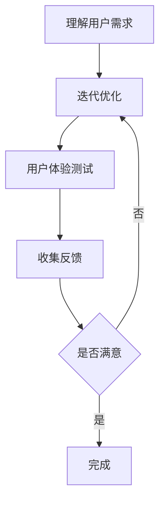
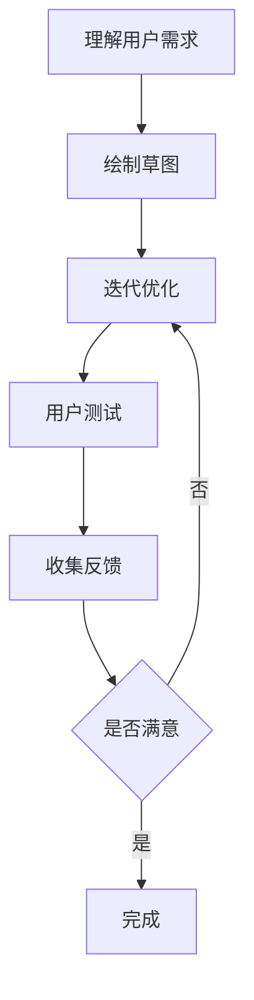
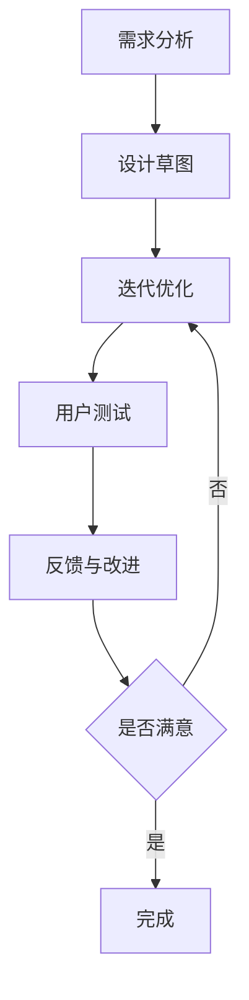
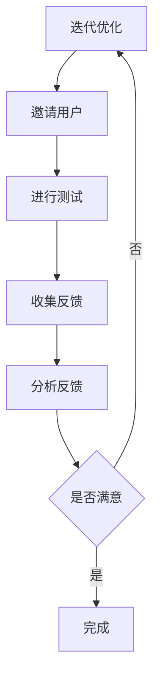
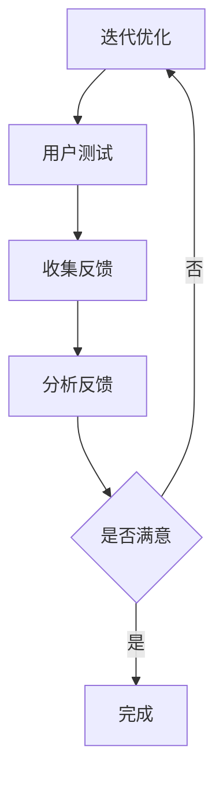
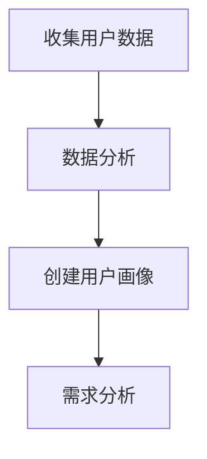
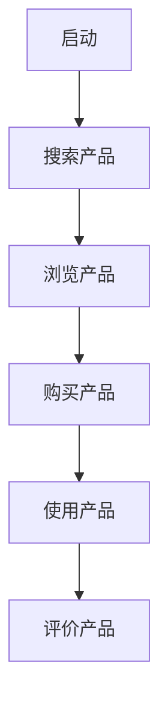
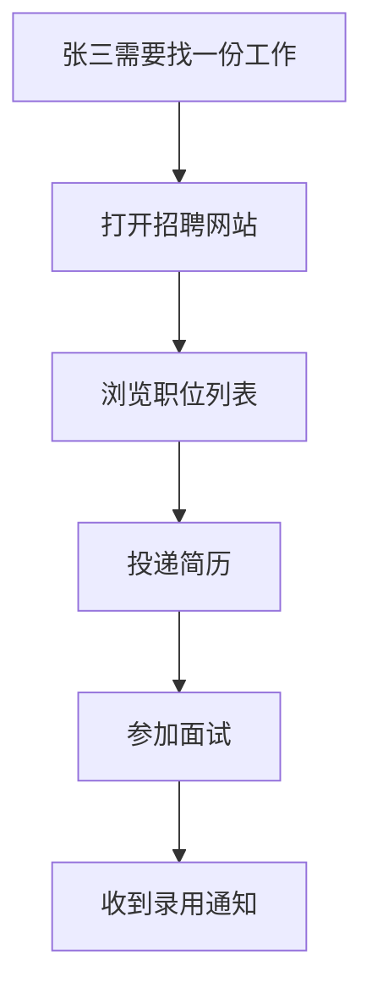
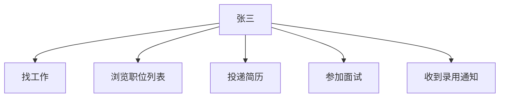

                 

### 文章标题：设计思维：以用户为中心的AI产品开发方法

#### 关键词：
- 设计思维
- AI产品开发
- 用户中心
- 快速原型
- 用户研究
- 用户体验
- 算法
- 机器学习

#### 摘要：
本文深入探讨了设计思维在AI产品开发中的应用，以用户为中心，通过快速原型、用户研究和算法原理的讲解，展示了如何通过设计思维实现高效的AI产品开发。文章涵盖了设计思维概述、核心概念、实践方法、AI基础知识、AI在产品开发中的应用、产品开发流程、用户体验设计以及产品运营与优化等方面的内容。

## 第一部分：设计思维概述

### 第1章：设计思维简介

设计思维是一种以人为本的创新方法，其核心在于通过深入了解用户需求，快速迭代产品原型并进行用户体验测试，从而不断优化产品。设计思维强调的是创意与实用性的结合，不仅关注技术的可行性，更注重用户的实际体验。

#### 历史与演变

设计思维的概念最早由美国设计师Donald Norman在1988年提出，它基于人机交互和用户中心设计的理念，逐步演变成一种全面的创新方法论。20世纪90年代，IDEO设计公司进一步将设计思维应用于商业创新，成为了一种流行的创新方法。近年来，随着AI技术的发展，设计思维在AI产品开发中的应用越来越受到关注。

#### 核心原则

设计思维的核心原则可以概括为以下几点：

1. **用户中心**：始终关注用户需求，将用户置于产品开发的中心。
2. **快速迭代**：通过快速原型和迭代，不断优化产品。
3. **团队合作**：设计思维强调跨学科团队合作，充分利用团队成员的不同技能和经验。
4. **实验与试错**：鼓励实验和试错，从失败中学习。
5. **可持续性**：关注产品的长期可持续性和环境影响。

#### 设计思维与传统开发方法的对比

传统开发方法通常侧重于技术实现和项目进度，而设计思维则更注重用户体验和产品创新。以下是一个简单的对比：

| 特征 | 设计思维 | 传统开发方法 |
| --- | --- | --- |
| **用户中心** | 强调用户需求，用户体验 | 通常从技术角度出发，用户需求往往被忽视 |
| **快速迭代** | 通过快速原型和测试不断优化产品 | 项目周期长，迭代次数少 |
| **团队合作** | 跨学科团队合作，充分利用不同技能和经验 | 侧重于单一领域的专业知识 |
| **实验与试错** | 鼓励实验和试错，从失败中学习 | 通常避免失败，追求完美 |
| **可持续性** | 关注产品的长期可持续性和环境影响 | 更多关注项目交付和时间成本 |

### 第2章：设计思维的核心概念

设计思维的核心概念包括设计流程、用户研究、原型设计和迭代。以下是一个设计思维的流程图，使用Mermaid语言描述：



#### 设计流程

设计思维通常分为以下几个阶段：

1. **理解用户需求**：通过用户研究，深入了解用户的需求和痛点。
2. **创建原型**：快速构建可交互的原型，验证设计概念。
3. **用户体验测试**：测试用户对原型的反应，收集反馈。
4. **收集反馈**：分析反馈，识别问题和改进点。
5. **迭代优化**：根据反馈不断迭代和优化原型。

#### 用户研究

用户研究是设计思维的基础，通过用户访谈、问卷调查、观察等方法，深入了解用户的需求、行为和偏好。以下是一个用户访谈的示例伪代码：

```pseudo
function 用户访谈(用户):
    问题列表 = ["您通常如何使用这个产品？", "您觉得这个产品有哪些不足？"]
    答案列表 = []
    
    for 问题 in 问题列表:
        答案 = 用户回答问题(问题)
        答案列表.append(答案)
    
    返回 答案列表
```

#### 原型设计与迭代

原型设计是设计思维的核心环节，通过快速构建低 fidelity的原型，验证设计概念。以下是一个简单的原型设计流程：



### 第3章：设计思维的实践方法

#### 快速原型开发

快速原型开发是设计思维中至关重要的一环，它允许开发团队在早期阶段快速构建和测试产品原型。以下是一个简单的快速原型开发流程：



#### 用户体验测试

用户体验测试是评估原型设计是否符合用户需求和期望的重要手段。以下是一个简单的用户体验测试流程：



#### 设计迭代与优化

设计迭代与优化是设计思维的核心原则之一，通过不断迭代和优化，开发团队可以逐步完善产品。以下是一个简单的迭代与优化流程：



### 第4章：以用户为中心的设计方法

#### 用户画像与需求分析

用户画像是一种通过收集和分析用户数据，创建用户概览的方法。以下是一个简单的用户画像构建流程：



#### 用户旅程地图

用户旅程地图是一种通过可视化用户在使用产品过程中的行为和情感，帮助团队更好地理解用户需求的方法。以下是一个简单的用户旅程地图：



#### 故事板与角色模型

故事板和角色模型是设计思维中常用的工具，用于描述用户在使用产品过程中的场景和角色。以下是一个简单的例子：

**故事板：**


**角色模型：**


## 第二部分：AI产品开发

### 第5章：AI基础知识

AI（人工智能）是一门研究、开发用于模拟、延伸和扩展人类智能的理论、方法、技术及应用系统的技术科学。以下是对AI的一些基础知识介绍。

#### AI的发展历程

- **20世纪50年代**：人工智能概念诞生，早期研究主要集中在逻辑推理和问题求解上。
- **20世纪60年代**：符号主义AI兴起，强调基于逻辑和知识的表示与推理。
- **20世纪70年代**：专家系统成为AI研究的主流，通过模拟人类专家的决策过程来解决复杂问题。
- **20世纪80年代**：神经网络和机器学习开始受到关注，AI研究从符号主义转向数据驱动的方法。
- **20世纪90年代**：大数据和计算能力的提升，AI在语音识别、图像处理等领域取得了重要突破。
- **21世纪**：深度学习和强化学习等新算法的提出，AI技术取得了飞速发展，并开始应用于各种实际场景。

#### AI的核心算法

- **监督学习**：通过已有数据集的训练，使模型能够对未知数据进行预测。常见的算法包括线性回归、逻辑回归、支持向量机等。
- **无监督学习**：不依赖已有标签数据，通过数据内在结构发现模式和规律。常见的算法包括聚类、降维、关联规则挖掘等。
- **强化学习**：通过奖励机制，使模型能够自主学习和优化策略，以达到最优行为。常见的算法包括Q学习、SARSA、深度确定性策略梯度（DDPG）等。
- **深度学习**：基于多层神经网络的机器学习技术，通过神经网络逐层提取数据特征。常见的算法包括卷积神经网络（CNN）、循环神经网络（RNN）、生成对抗网络（GAN）等。

#### AI的应用领域

- **自然语言处理（NLP）**：包括文本分类、情感分析、机器翻译、语音识别等。
- **计算机视觉**：包括图像分类、目标检测、人脸识别、图像生成等。
- **语音识别**：将语音信号转换为文本或命令。
- **推荐系统**：通过用户行为数据推荐相关商品、新闻等。
- **自动驾驶**：通过感知环境、决策和执行，实现车辆的自主驾驶。
- **医疗健康**：包括疾病预测、诊断辅助、个性化治疗等。
- **金融科技**：包括风险控制、量化交易、信用评估等。

### 第6章：AI在产品开发中的应用

AI在产品开发中的应用越来越广泛，以下是一些常见应用场景：

#### AI驱动的设计

AI驱动的设计是指利用AI技术辅助设计过程，提高设计效率和质量。例如，通过AI算法自动生成设计草图、优化设计参数等。

#### 人工智能助手开发

人工智能助手（如聊天机器人、语音助手等）是AI在产品开发中的一个重要应用。它们通过自然语言处理技术理解和响应用户指令，提供便捷的服务和交互体验。

#### 数据分析与用户行为预测

通过AI技术分析用户行为数据，可以预测用户的需求和行为，从而为产品优化提供数据支持。例如，推荐系统通过分析用户的浏览和购买历史，预测用户的兴趣和偏好，推荐相关商品。

### 第7章：AI产品开发流程

AI产品开发流程与传统软件开发流程有所不同，更加注重用户研究和快速迭代。以下是一个典型的AI产品开发流程：

#### 产品规划与需求分析

- **市场调研**：了解市场需求和用户需求。
- **需求分析**：明确产品的功能和性能要求。

#### 技术选型与架构设计

- **技术选型**：选择合适的算法和工具。
- **架构设计**：设计系统的总体架构，包括数据处理、模型训练、服务部署等。

#### 产品开发与测试

- **数据准备**：收集和预处理训练数据。
- **模型训练**：使用训练数据训练模型。
- **系统集成**：将模型集成到产品中，进行初步测试。

#### 测试与优化

- **用户测试**：测试产品的用户体验和功能。
- **性能优化**：对产品进行性能优化，提高系统效率。

### 第8章：AI产品的用户体验设计

用户体验设计是AI产品开发中至关重要的一环，以下是一些关键点：

#### 用户界面设计

- **简洁性**：界面设计要简洁直观，减少用户操作步骤。
- **响应速度**：确保系统快速响应用户操作。

#### 交互设计

- **自然语言交互**：通过自然语言处理技术，使交互更加自然流畅。
- **多模态交互**：结合语音、图像、手势等多种交互方式，提供更丰富的交互体验。

#### 可用性测试

- **用户测试**：邀请真实用户参与测试，收集反馈。
- **A/B测试**：通过对比不同设计版本的用户体验，选择最优方案。

### 第9章：AI产品的运营与优化

AI产品的运营与优化是保证产品长期成功的关键。以下是一些关键点：

#### 数据监控

- **实时监控**：实时监控产品的性能和用户体验，及时发现问题和优化。

#### 用户反馈

- **收集反馈**：通过问卷调查、用户访谈等方式收集用户反馈。
- **分析反馈**：分析用户反馈，识别产品和服务的改进点。

#### 产品迭代

- **定期迭代**：根据用户反馈和市场变化，定期更新和优化产品。

#### 优化策略

- **A/B测试**：通过对比不同优化策略的效果，选择最优方案。

## 附录

### 附录A：设计思维工具介绍

- **用户画像工具**：如UserZoom、Qualaroo等。
- **原型设计工具**：如Sketch、Figma、Adobe XD等。
- **数据分析与可视化工具**：如Tableau、Power BI、Google Data Studio等。

### 附录B：AI开发工具与资源

- **AI开发框架**：如TensorFlow、PyTorch、Keras等。
- **机器学习库**：如scikit-learn、scipy、numpy等。
- **深度学习框架**：如TensorFlow、PyTorch、Theano等。

## 作者信息

作者：AI天才研究院/AI Genius Institute & 禅与计算机程序设计艺术 /Zen And The Art of Computer Programming

## 结语

设计思维是一种以用户为中心的创新方法，它在AI产品开发中发挥着重要作用。通过深入理解用户需求，快速迭代原型，并不断优化产品，开发团队可以创造出更符合用户期望的AI产品。随着AI技术的不断进步，设计思维在产品开发中的应用将越来越广泛，为用户提供更好的体验。希望本文能帮助读者更好地理解设计思维和AI产品开发，为实际工作提供指导。

### 最佳实践 Tips

- **用户研究要深入**：只有深入了解用户需求，才能设计出真正符合用户期望的产品。
- **快速迭代是关键**：通过快速迭代，可以及时发现问题并进行优化。
- **团队合作不可忽视**：跨学科团队合作可以充分利用团队成员的不同技能和经验。
- **持续学习是动力**：AI技术不断进步，持续学习可以跟上技术发展的步伐。

### 小结

设计思维是一种以人为本的创新方法，它在AI产品开发中具有重要作用。通过用户研究、快速原型、用户体验测试和迭代优化，开发团队可以不断改进产品，提高用户体验。AI技术的应用为设计思维提供了强大的工具支持，使产品开发更加高效和智能化。希望本文能帮助读者更好地理解设计思维和AI产品开发，为实际工作提供指导。

### 注意事项

- **数据隐私**：在进行用户研究时，要注意保护用户的隐私和数据安全。
- **技术选型**：根据产品需求和团队技术能力，合理选择技术栈和开发工具。
- **用户反馈**：要重视用户反馈，及时进行产品和服务的优化。

### 拓展阅读

- 《设计思维：创新方法与实践》
- 《人工智能：一种现代方法》
- 《深度学习：自适应学习系统的原理与方法》

通过阅读这些资料，读者可以进一步深入了解设计思维和AI产品开发的原理和实践方法。希望本文能对读者在AI产品开发中有所启发和帮助。

