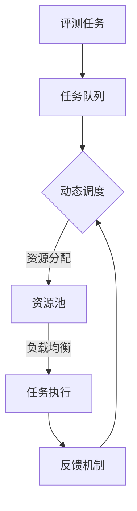

                 

基于您的要求，我将逐步构建《评测任务的动态调度与负载均衡》这篇文章的markdown格式内容。我们将从文章标题、关键词、摘要开始，然后逐步进入正文部分的各个章节。

---

# 文章标题：评测任务的动态调度与负载均衡

> 关键词：动态调度，负载均衡，评测任务，算法，优化，实际应用

> 摘要：本文深入探讨了评测任务的动态调度与负载均衡的概念、原理、算法以及实际应用。通过详细的分析和实例讲解，揭示了动态调度与负载均衡在提升系统性能、保证服务质量方面的重要作用，为相关领域的研究和应用提供了理论支持和实践指导。

---

## 引言

### 动态调度与负载均衡的背景

随着互联网技术的飞速发展和云计算、大数据等新兴技术的广泛应用，系统架构日趋复杂，评测任务的数量和种类也日益增多。如何高效地管理和调度这些评测任务，如何合理地分配系统资源，成为当前IT领域的一个重要课题。动态调度与负载均衡技术正是在这种背景下应运而生的，它们旨在通过智能化的调度策略和高效的资源分配，实现评测任务的公平、高效执行。

### 动态调度的意义

动态调度技术能够根据系统当前的负载情况、资源状态以及评测任务的特点，实时调整任务执行顺序和资源分配策略。这种灵活性不仅能够提高系统的吞吐量和资源利用率，还能够有效降低系统的响应时间和延迟，从而提升整体服务质量。

### 负载均衡的重要性

负载均衡技术通过分散系统负载，避免单点过载，确保系统的稳定性和可靠性。在评测任务中，负载均衡能够确保每个任务都能够得到公平的资源分配，避免某个任务占用过多资源而导致其他任务无法正常执行。

### 动态调度与负载均衡的关系

动态调度与负载均衡密切相关。动态调度是负载均衡的基础，它负责根据任务的特点和系统的状态，决定任务的执行顺序和资源分配。而负载均衡则是动态调度的目标，它通过均衡系统负载，确保系统能够持续高效地运行。

---

在接下来的章节中，我们将进一步详细探讨动态调度与负载均衡的技术原理、算法实现以及实际应用案例，为读者提供全面的指导和参考。

---

## 核心概念与联系

### 动态调度的概念

动态调度是指在运行时根据系统的当前状态、任务的特征以及资源分配策略，动态地调整任务的执行顺序和资源分配。动态调度旨在最大化系统的资源利用率、最小化任务的执行时间以及提升系统的整体性能。

### 负载均衡的概念

负载均衡是指通过分配系统负载到多个资源节点上，避免单点过载，确保系统能够持续稳定地运行。负载均衡可以通过轮询、最小连接数、最小响应时间等算法实现。

### 动态调度与负载均衡的关系架构

为了更好地理解动态调度与负载均衡之间的关系，我们可以通过一个Mermaid流程图来描述它们的基本架构。



在这个流程图中，评测任务首先进入任务队列，然后通过动态调度模块进行资源分配。资源池中的资源通过负载均衡算法分配给任务执行模块，任务执行完成后，将反馈信息返回给动态调度模块，以便进行新一轮的调度。

---

接下来，我们将深入探讨动态调度和负载均衡的核心算法原理，并通过伪代码和数学模型来详细阐述。

---

## 动态调度的技术原理

### 动态调度的概念与挑战

动态调度是一种在运行时根据系统的当前状态、任务的特征以及资源分配策略，动态地调整任务的执行顺序和资源分配的技术。动态调度的核心在于其实时性和灵活性，能够根据系统负载和任务特性的变化，动态调整任务执行策略，从而最大化系统的资源利用率和性能。

在动态调度过程中，面临的挑战主要包括：

1. **实时性**：需要及时捕捉系统状态和任务特征的变化，并快速做出调度决策。
2. **资源分配**：如何合理地分配资源，确保任务能够高效执行。
3. **稳定性**：在动态调度的过程中，如何保证系统的稳定运行，避免出现性能抖动。

### 动态调度的算法

动态调度算法可以分为基于规则的方法、基于优化方法以及基于机器学习方法三类。

#### 基于规则的方法

基于规则的方法是通过预设一系列规则，根据当前系统状态和任务特征进行调度决策。这种方法简单直观，但缺乏灵活性，难以应对复杂多变的调度场景。

伪代码示例：

```python
def rule_based_scheduling(task_queue, system_state):
    for task in task_queue:
        if system_state['cpu_usage'] < threshold:
            allocate_resource(task)
            execute_task(task)
        else:
            queue_task(task)
    return
```

#### 基于优化方法

基于优化方法的目标是通过优化目标函数，寻找最优的调度策略。常见的优化方法包括贪心算法、线性规划、遗传算法等。

伪代码示例：

```python
def optimize_scheduling(task_queue, system_state):
    objective_function = minimize_execution_time(task_queue)
    solution = optimize(objective_function)
    execute_solution(solution)
    return
```

#### 基于机器学习方法

基于机器学习方法利用历史数据和系统状态，通过机器学习算法训练调度模型，预测并调整调度策略。这种方法具有较高的自适应性和灵活性，但需要大量的数据支持和复杂的模型训练。

伪代码示例：

```python
def ml_based_scheduling(task_queue, system_state):
    model = train_ml_model(data)
    predicted_solution = model.predict(system_state)
    execute_solution(predicted_solution)
    return
```

### 动态调度的实施方法

实施动态调度需要考虑以下几个方面：

1. **系统监控**：实时监控系统状态，包括CPU利用率、内存使用率、网络延迟等关键指标。
2. **任务描述**：对任务进行详细描述，包括任务的优先级、执行时间、资源需求等。
3. **调度策略**：根据系统状态和任务特点，选择合适的调度算法和策略。
4. **资源管理**：实现资源的动态分配和回收，确保资源的高效利用。
5. **反馈机制**：收集调度结果和系统性能数据，用于调度决策的调整和优化。

---

在下一部分，我们将深入探讨负载均衡的优化技术，包括负载均衡的目标、常见优化策略和实现方法。

---

## 负载均衡的优化技术

### 负载均衡的目标

负载均衡的目标是通过合理的资源分配策略，最大化系统的整体性能，确保系统的高可用性和稳定性。具体来说，负载均衡需要实现以下几个目标：

1. **最大化资源利用率**：通过合理分配资源，避免资源浪费，提高系统资源利用率。
2. **最小化响应时间**：通过均衡系统负载，减少用户的等待时间，提高用户体验。
3. **确保系统稳定性**：通过分散系统负载，避免单点过载，确保系统的稳定运行。

### 常见负载均衡优化策略

#### 轮询策略

轮询策略是最简单的负载均衡算法，它将请求依次分配给不同的服务器。这种方法简单易实现，但可能导致某些服务器负载不均。

#### 最小连接数策略

最小连接数策略将新的请求分配给当前连接数最少的服务器。这种方法可以确保服务器负载均衡，但可能造成网络拥塞。

#### 最小响应时间策略

最小响应时间策略将新的请求分配给当前响应时间最短的服务器。这种方法可以降低用户的响应时间，但可能导致某些服务器过度负载。

#### 加权负载均衡策略

加权负载均衡策略根据服务器的处理能力分配请求，处理能力强的服务器承担更多的负载。这种方法可以更精细地控制负载分配，但需要准确的性能评估。

#### 动态负载均衡策略

动态负载均衡策略根据系统的实时状态，动态调整负载分配策略。这种方法具有较高的灵活性和适应性，但实现复杂度较高。

### 实现方法

实现负载均衡的方法可以分为软件实现和硬件实现两类。

#### 软件实现

软件实现主要通过应用程序或代理服务器来实现负载均衡。常见的软件负载均衡器包括Nginx、HAProxy等。

#### 硬件实现

硬件实现主要通过专门的负载均衡设备来实现，如F5 BIG-IP。这种方法性能较高，但成本较高。

---

在下一部分，我们将探讨动态调度与负载均衡的协同工作，分析它们的交互和系统性能的影响。

---

## 动态调度与负载均衡的协同工作

### 动态调度与负载均衡的交互

动态调度与负载均衡之间存在紧密的交互关系。动态调度根据系统状态和任务特征决定任务的执行顺序和资源分配，而负载均衡则根据系统负载情况决定资源的分配策略。两者共同作用，确保系统的高效运行。

具体来说，动态调度与负载均衡的交互可以分为以下几个步骤：

1. **任务队列构建**：将待执行的评测任务加入任务队列。
2. **动态调度决策**：根据系统状态和任务特征，动态调度模块决定任务的执行顺序和资源分配。
3. **负载均衡分配**：负载均衡模块根据当前系统负载，将资源分配给任务执行模块。
4. **任务执行**：任务执行模块根据资源分配情况，执行任务。
5. **性能反馈**：任务执行完成后，收集性能数据，反馈给动态调度模块，以便进行新一轮调度。

### 系统性能分析

动态调度与负载均衡的协同工作对系统性能有显著影响。以下从几个方面分析系统性能：

#### 吞吐量

吞吐量是指单位时间内系统能够处理的最大任务数。动态调度与负载均衡的协同工作能够通过合理的调度策略和资源分配，最大化系统的吞吐量。

#### 响应时间

响应时间是指任务从提交到完成的时间。通过动态调度和负载均衡的协同工作，能够有效降低系统的响应时间，提高用户体验。

#### 稳定性

动态调度与负载均衡能够通过分散系统负载，避免单点过载，确保系统的稳定性。即使在负载高峰期，系统也能保持稳定运行，避免性能抖动。

#### 资源利用率

动态调度与负载均衡能够通过合理的资源分配策略，最大化系统的资源利用率，避免资源浪费。

---

在下一部分，我们将详细介绍几种常见的动态调度算法，包括贪心算法、线性规划算法等，并通过伪代码和数学模型进行讲解。

---

## 动态调度算法实例分析

### 贪心算法

贪心算法是一种简单且高效的动态调度算法，通过每次选择最优解来逐步逼近全局最优解。在评测任务的动态调度中，贪心算法可以根据当前系统状态和任务特征，选择最优的任务执行顺序。

#### 算法原理

贪心算法的基本思想是：每次选择当前状态下最优的任务进行执行，不考虑后续状态的影响。

伪代码示例：

```python
def greedy_scheduling(task_queue, system_state):
    sorted_tasks = sort_by_priority(task_queue)
    for task in sorted_tasks:
        if can_allocate_resource(task, system_state):
            execute_task(task)
            update_system_state(task, system_state)
    return
```

#### 数学模型

贪心算法的目标是最小化系统的总执行时间。假设任务集合为T，系统状态为S，任务优先级为P，则贪心算法的目标函数为：

$$
\min \sum_{t \in T} T_t
$$

其中，$T_t$ 表示任务t的执行时间。

### 线性规划算法

线性规划算法是一种基于优化理论的动态调度算法，通过建立目标函数和约束条件，求解最优调度策略。

#### 算法原理

线性规划算法通过建立线性目标函数和线性约束条件，求解最优解。在评测任务的动态调度中，线性规划算法可以根据系统状态和任务特征，求解最优的任务执行顺序和资源分配策略。

伪代码示例：

```python
def linear_programming_scheduling(task_queue, system_state):
    objective_function = minimize_execution_time(task_queue)
    constraints = [
        "cpu_usage <= threshold",
        "memory_usage <= threshold",
        # 其他约束条件
    ]
    solution = solve_linear_program(objective_function, constraints)
    execute_solution(solution)
    return
```

#### 数学模型

线性规划算法的目标是最小化系统的总执行时间，同时满足以下约束条件：

$$
\begin{align*}
\min \quad & \sum_{t \in T} T_t \\
s.t. \quad & Cx \leq b \\
& x \geq 0
\end{align*}
$$

其中，$T$ 为任务集合，$C$ 为系数矩阵，$x$ 为决策变量，$b$ 为约束条件向量。

---

在下一部分，我们将详细介绍负载均衡算法，包括最小连接数算法和最小响应时间算法，并通过伪代码和数学模型进行讲解。

---

## 负载均衡算法实例分析

### 最小连接数算法

最小连接数算法是一种简单的负载均衡算法，通过将新请求分配给当前连接数最少的服务器，实现负载均衡。

#### 算法原理

最小连接数算法的基本思想是：每次将新的请求分配给当前连接数最少的服务器，从而确保服务器负载均衡。

伪代码示例：

```python
def min_connections_algorithm(server_list, request):
    min_connections = min(server['connections'] for server in server_list)
    for server in server_list:
        if server['connections'] == min_connections:
            assign_request(server, request)
            update_connections(server)
            break
    return
```

#### 数学模型

最小连接数算法的目标是最小化服务器之间的连接差异。假设服务器集合为S，每个服务器s的当前连接数为$C_s$，则目标函数为：

$$
\min \sum_{s \in S} (C_s - \bar{C})^2
$$

其中，$\bar{C}$ 为服务器平均连接数。

### 最小响应时间算法

最小响应时间算法是一种基于响应时间的负载均衡算法，通过将新请求分配给当前响应时间最短的服务器，实现负载均衡。

#### 算法原理

最小响应时间算法的基本思想是：每次将新的请求分配给当前响应时间最短的服务器，从而确保服务器负载均衡。

伪代码示例：

```python
def min_response_time_algorithm(server_list, request):
    min_response = min(server['response_time'] for server in server_list)
    for server in server_list:
        if server['response_time'] == min_response:
            assign_request(server, request)
            update_response_time(server)
            break
    return
```

#### 数学模型

最小响应时间算法的目标是最小化用户的等待时间。假设服务器集合为S，每个服务器s的当前响应时间为$R_s$，则目标函数为：

$$
\min \sum_{s \in S} R_s
$$

---

在下一部分，我们将探讨动态调度与负载均衡的优化算法，包括粒子群算法和遗传算法。

---

## 动态调度与负载均衡的优化算法

### 粒子群算法

粒子群算法是一种基于群体智能的优化算法，通过模拟鸟群觅食行为，寻找最优解。在动态调度与负载均衡中，粒子群算法可以用于优化调度策略和资源分配。

#### 算法原理

粒子群算法的基本思想是：每个粒子在搜索空间中代表一个解，粒子通过自身的经验和社会经验不断更新位置和速度，逐步逼近最优解。

伪代码示例：

```python
def particle_swarm_optimization(task_queue, system_state):
    particles = initialize_particles(task_queue, system_state)
    while not convergence():
        for particle in particles:
            update_velocity(particle)
            update_position(particle)
            evaluate_fitness(particle)
        update_global_best(particles)
    return global_best
```

#### 数学模型

粒子群算法的目标是最小化系统的总执行时间。假设粒子位置为$x_i$，速度为$v_i$，则粒子更新公式为：

$$
\begin{align*}
v_i(t+1) &= w \cdot v_i(t) + c_1 \cdot r_1 \cdot (p_i - x_i) + c_2 \cdot r_2 \cdot (g - x_i) \\
x_i(t+1) &= x_i(t) + v_i(t+1)
\end{align*}
$$

其中，$w$ 为惯性权重，$c_1$ 和 $c_2$ 为学习因子，$r_1$ 和 $r_2$ 为随机数。

### 遗传算法

遗传算法是一种基于自然选择的优化算法，通过模拟生物进化过程，寻找最优解。在动态调度与负载均衡中，遗传算法可以用于优化调度策略和资源分配。

#### 算法原理

遗传算法的基本思想是：通过选择、交叉和变异等操作，对种群中的个体进行进化，逐步逼近最优解。

伪代码示例：

```python
def genetic_algorithm(task_queue, system_state):
    population = initialize_population(task_queue, system_state)
    while not convergence():
        fitness = evaluate_fitness(population)
        selected_population = select(population, fitness)
        offspring = crossover(selected_population)
        mutated_offspring = mutate(offspring)
        population = mutated_offspring
    return best_individual(population)
```

#### 数学模型

遗传算法的目标是最小化系统的总执行时间。假设种群中的个体为$G_i$，适应度为$f(G_i)$，则算法过程为：

1. 初始化种群$G_0$。
2. 计算种群适应度$f(G_i)$。
3. 选择适应度较高的个体组成下一代种群。
4. 进行交叉操作生成新个体。
5. 对新个体进行变异操作。
6. 更新种群。
7. 重复步骤2-6，直到满足收敛条件。

---

在下一部分，我们将探讨动态调度与负载均衡在电商场景中的应用。

---

## 动态调度与负载均衡在电商场景中的应用

### 电商场景中的挑战

在电商场景中，动态调度与负载均衡面临着一系列挑战：

1. **流量高峰**：电商平台的流量波动大，特别是在促销活动期间，流量可能会急剧上升，导致系统负载骤增。
2. **订单处理**：电商平台需要高效处理海量的订单，确保订单处理的速度和准确性。
3. **系统稳定性**：在高并发场景下，系统需要保持稳定性，避免出现性能抖动或服务中断。

### 动态调度与负载均衡的应用

#### 动态调度策略

1. **动态调整任务队列**：根据实时流量和系统状态，动态调整任务队列中的任务优先级和执行顺序，确保重要任务优先处理。
2. **弹性伸缩**：根据流量变化，动态调整服务器数量和资源分配，确保系统能够应对突发流量。

#### 负载均衡策略

1. **基于流量的负载均衡**：根据用户访问流量，动态调整请求的分配，避免单点过载。
2. **基于性能的负载均衡**：根据服务器性能，动态调整请求的分配，确保服务器负载均衡。

### 应用案例分析

#### 案例一：某大型电商平台

某大型电商平台在双十一期间，通过动态调度与负载均衡技术，成功应对了巨大的流量压力。具体做法包括：

1. **实时监控**：实时监控系统状态，包括CPU、内存、网络等关键指标，及时发现和处理异常。
2. **动态调整**：根据实时流量和系统状态，动态调整任务队列和资源分配策略，确保系统稳定运行。
3. **弹性伸缩**：根据流量变化，动态调整服务器数量和资源分配，确保系统在高并发场景下仍能保持高性能。

#### 案例二：某跨境电商平台

某跨境电商平台通过引入动态调度与负载均衡技术，显著提高了订单处理效率。具体做法包括：

1. **动态调度**：根据订单处理速度和系统负载，动态调整订单处理顺序和资源分配，确保订单处理高效、准确。
2. **负载均衡**：通过基于性能的负载均衡策略，将订单处理请求分配给性能最高的服务器，避免单点过载。
3. **监控与优化**：实时监控订单处理状态，根据处理效果不断调整调度策略，优化系统性能。

---

在下一部分，我们将探讨动态调度与负载均衡在云计算场景中的应用。

---

## 动态调度与负载均衡在云计算场景中的应用

### 云计算场景中的挑战

在云计算场景中，动态调度与负载均衡面临着一系列特殊挑战：

1. **异构资源**：云计算环境中存在大量异构资源，如不同类型的CPU、内存、存储等，如何有效利用这些异构资源是关键挑战。
2. **高可用性**：云服务需要保证高可用性，即使部分服务器故障，系统仍需正常运行。
3. **弹性伸缩**：云计算环境需要能够根据业务需求动态调整资源规模，以应对流量波动。

### 动态调度与负载均衡的应用

#### 动态调度策略

1. **基于资源的调度**：根据不同类型资源的负载情况，动态调整任务的执行位置，确保资源的高效利用。
2. **基于性能的调度**：根据服务器性能指标，如CPU利用率、内存使用率等，动态调整任务执行顺序和资源分配。

#### 负载均衡策略

1. **基于流量的负载均衡**：根据用户请求的流量，动态调整请求的分配，避免单点过载。
2. **基于性能的负载均衡**：根据服务器性能指标，动态调整请求的分配，确保服务器负载均衡。

### 应用案例分析

#### 案例一：某云服务提供商

某云服务提供商通过动态调度与负载均衡技术，显著提升了云服务器的资源利用率和服务质量。具体做法包括：

1. **动态资源分配**：根据服务器负载情况，动态调整任务执行位置，确保资源的高效利用。
2. **负载均衡**：通过基于流量的负载均衡策略，将用户请求分配给负载较低的服务器，避免单点过载。
3. **弹性伸缩**：根据用户请求流量，动态调整服务器数量和资源分配，确保系统弹性伸缩。

#### 案例二：某大型企业云平台

某大型企业云平台通过引入动态调度与负载均衡技术，显著提高了企业内部应用的处理效率。具体做法包括：

1. **动态调度**：根据应用处理速度和系统负载，动态调整应用执行顺序和资源分配，确保应用高效运行。
2. **负载均衡**：通过基于性能的负载均衡策略，将应用处理请求分配给性能最高的服务器，避免单点过载。
3. **监控与优化**：实时监控应用处理状态，根据处理效果不断调整调度策略，优化系统性能。

---

在下一部分，我们将探讨动态调度与负载均衡在物联网场景中的应用。

---

## 动态调度与负载均衡在物联网场景中的应用

### 物联网场景中的挑战

在物联网（IoT）场景中，动态调度与负载均衡面临着一系列特殊挑战：

1. **资源限制**：物联网设备通常具有资源限制，如有限的计算能力、存储能力和网络带宽，如何高效利用这些资源是关键挑战。
2. **数据传输延迟**：物联网设备之间的数据传输延迟较高，如何优化数据传输路径是关键问题。
3. **可靠性**：物联网系统需要保证高可靠性，即使部分设备故障，系统仍需正常运行。

### 动态调度与负载均衡的应用

#### 动态调度策略

1. **基于资源效率的调度**：根据物联网设备的资源使用情况，动态调整任务的执行位置，确保资源的高效利用。
2. **基于数据传输延迟的调度**：根据物联网设备的网络延迟，动态调整数据传输路径，确保数据传输高效、及时。

#### 负载均衡策略

1. **基于流量的负载均衡**：根据物联网设备的数据传输流量，动态调整请求的分配，避免单点过载。
2. **基于资源负载的负载均衡**：根据物联网设备的资源使用情况，动态调整请求的分配，确保设备负载均衡。

### 应用案例分析

#### 案例一：智能交通系统

智能交通系统通过动态调度与负载均衡技术，实现了交通信号灯的智能控制，提高了交通流量效率。具体做法包括：

1. **动态调度**：根据实时交通流量和信号灯状态，动态调整交通信号灯的切换策略，确保交通流畅。
2. **负载均衡**：通过基于流量的负载均衡策略，将交通监控数据分配给负载较低的监控设备，避免单点过载。
3. **监控与优化**：实时监控交通信号灯状态，根据交通流量变化不断调整调度策略，优化系统性能。

#### 案例二：智能家居系统

智能家居系统通过动态调度与负载均衡技术，实现了家电设备的智能调度和负载均衡，提高了家居生活质量。具体做法包括：

1. **动态调度**：根据用户需求和生活习惯，动态调整家电设备的执行顺序和资源分配，确保家电设备高效运行。
2. **负载均衡**：通过基于资源负载的负载均衡策略，将家电设备请求分配给负载较低的设备，避免单点过载。
3. **监控与优化**：实时监控家电设备状态，根据设备使用情况不断调整调度策略，优化系统性能。

---

在下一部分，我们将探讨动态调度与负载均衡在游戏场景中的应用。

---

## 动态调度与负载均衡在游戏场景中的应用

### 游戏场景中的挑战

在游戏场景中，动态调度与负载均衡面临着一系列特殊挑战：

1. **高并发**：游戏通常面临大量玩家同时在线的情况，如何高效处理并发请求是关键挑战。
2. **低延迟**：游戏需要提供良好的用户体验，低延迟是关键因素，如何优化数据传输路径是关键问题。
3. **可扩展性**：游戏服务器需要能够根据玩家数量动态调整资源规模，以应对流量波动。

### 动态调度与负载均衡的应用

#### 动态调度策略

1. **基于会话的调度**：根据玩家的会话状态，动态调整游戏服务器之间的负载，确保会话分配均衡。
2. **基于性能的调度**：根据游戏服务器的性能指标，动态调整游戏任务的执行位置，确保任务处理高效。

#### 负载均衡策略

1. **基于流量的负载均衡**：根据玩家请求的流量，动态调整请求的分配，避免单点过载。
2. **基于游戏服务器的负载均衡**：根据游戏服务器的负载情况，动态调整请求的分配，确保游戏服务器负载均衡。

### 应用案例分析

#### 案例一：大型多人在线游戏

某大型多人在线游戏通过动态调度与负载均衡技术，成功应对了高并发场景。具体做法包括：

1. **动态调度**：根据实时玩家数量和游戏服务器负载，动态调整会话分配策略，确保会话分配均衡。
2. **负载均衡**：通过基于流量的负载均衡策略，将玩家请求分配给负载较低的服务器，避免单点过载。
3. **弹性伸缩**：根据玩家数量动态调整服务器数量和资源分配，确保系统可扩展性。

#### 案例二：移动游戏平台

某移动游戏平台通过引入动态调度与负载均衡技术，显著提高了游戏体验。具体做法包括：

1. **动态调度**：根据玩家请求和游戏服务器性能，动态调整游戏任务执行位置，确保任务处理高效。
2. **负载均衡**：通过基于游戏服务器负载的负载均衡策略，将玩家请求分配给负载较低的服务器，避免单点过载。
3. **监控与优化**：实时监控游戏服务器状态，根据游戏服务器负载和玩家请求变化不断调整调度策略，优化系统性能。

---

在下一部分，我们将探讨动态调度与负载均衡在其他场景中的应用。

---

## 动态调度与负载均衡在其他场景中的应用

### 其他常见场景介绍

除了电商、云计算、物联网和游戏场景，动态调度与负载均衡技术还在许多其他场景中得到了广泛应用，如：

1. **金融场景**：金融领域需要处理大量交易请求，动态调度与负载均衡技术有助于确保交易系统的稳定性和高效性。
2. **医疗场景**：医疗信息系统需要处理大量患者数据和医疗请求，动态调度与负载均衡技术有助于优化医疗资源分配和提升服务质量。
3. **教育场景**：在线教育平台需要处理大量课程请求和学习任务，动态调度与负载均衡技术有助于优化课程分配和学习资源利用。

### 动态调度与负载均衡的应用

#### 金融场景

在金融场景中，动态调度与负载均衡技术主要用于以下方面：

1. **交易处理**：通过动态调度和负载均衡，确保交易系统能够高效处理海量交易请求。
2. **风险管理**：通过动态调度，根据不同风险级别的交易请求，调整资源分配策略，确保风险可控。

#### 医疗场景

在医疗场景中，动态调度与负载均衡技术主要用于以下方面：

1. **医疗数据处理**：通过动态调度，确保医疗数据处理系统能够高效处理大量患者数据。
2. **医疗资源分配**：通过负载均衡，根据不同科室和科室的负载情况，动态调整医疗资源分配，确保资源利用最大化。

#### 教育场景

在在线教育场景中，动态调度与负载均衡技术主要用于以下方面：

1. **课程分配**：通过动态调度，根据不同课程的请求量和学生人数，动态调整课程分配策略，确保课程资源利用最大化。
2. **学习资源管理**：通过负载均衡，根据学生学习资源的使用情况，动态调整学习资源的分配，确保学习资源高效利用。

### 应用案例分析

#### 案例一：金融交易系统

某金融交易系统通过引入动态调度与负载均衡技术，显著提升了交易处理效率。具体做法包括：

1. **动态调度**：根据交易请求的优先级和系统负载，动态调整交易处理顺序和资源分配，确保交易处理高效。
2. **负载均衡**：通过基于流量的负载均衡策略，将交易请求分配给负载较低的服务器，避免单点过载。

#### 案例二：在线教育平台

某在线教育平台通过引入动态调度与负载均衡技术，显著提升了课程分配和学习资源利用效率。具体做法包括：

1. **动态调度**：根据课程的请求量和学生人数，动态调整课程分配策略，确保课程资源利用最大化。
2. **负载均衡**：通过基于学习资源使用情况的负载均衡策略，动态调整学习资源的分配，确保学习资源高效利用。

---

## 案例分析1：XX公司的动态调度与负载均衡实践

### 公司背景介绍

XX公司是一家全球领先的云计算服务提供商，提供包括IaaS、PaaS、SaaS等多种云服务。随着公司业务的快速发展，用户数量和业务需求不断增长，如何高效地管理和调度大量评测任务，实现负载均衡成为公司面临的重要挑战。

### 挑战与需求

1. **高并发任务处理**：公司需要处理海量的并发评测任务，确保系统在高并发情况下依然能够高效运行。
2. **资源利用率最大化**：公司希望最大化利用现有资源，避免资源浪费。
3. **服务质量保障**：公司需要确保评测任务能够在规定的时间内完成，保证服务质量。

### 实施方案

1. **动态调度策略**：公司采用基于性能的动态调度策略，根据服务器的实时负载和任务特点，动态调整任务执行顺序和资源分配。
2. **负载均衡算法**：公司采用基于流量的负载均衡算法，根据用户请求的流量，动态调整请求的分配，确保系统负载均衡。
3. **弹性伸缩**：公司采用自动伸缩机制，根据业务需求动态调整服务器数量和资源规模，确保系统弹性伸缩。

### 实施效果与经验总结

通过引入动态调度与负载均衡技术，XX公司实现了以下效果：

1. **任务处理效率提升**：动态调度策略显著提高了任务处理效率，减少了任务执行时间。
2. **资源利用率提升**：负载均衡算法确保了资源的高效利用，避免了资源浪费。
3. **服务质量保障**：系统在负载高峰期仍能保持稳定运行，确保了服务质量。

公司总结了一些实践经验：

1. **实时监控**：实时监控系统状态和任务执行情况，及时发现和处理问题。
2. **持续优化**：根据实际运行情况，不断调整调度策略和负载均衡算法，优化系统性能。

---

## 案例分析2：YY公司的动态调度与负载均衡实践

### 公司背景介绍

YY公司是一家知名的游戏开发公司，其游戏服务器在全球范围内拥有大量用户。随着用户数量的增长，如何高效地调度和分配评测任务，实现负载均衡成为公司面临的重要挑战。

### 挑战与需求

1. **高并发处理**：公司需要处理大量同时在线的用户请求，确保游戏服务器的稳定性和高效性。
2. **资源优化分配**：公司希望最大化利用服务器资源，避免资源浪费。
3. **用户体验保障**：公司需要确保用户请求能够在规定时间内得到响应，提供良好的用户体验。

### 实施方案

1. **动态调度策略**：公司采用基于会话的动态调度策略，根据用户的会话状态和服务器负载，动态调整任务执行位置和资源分配。
2. **负载均衡算法**：公司采用基于流量的负载均衡算法，根据用户请求的流量，动态调整请求的分配，确保系统负载均衡。
3. **弹性伸缩**：公司采用自动伸缩机制，根据用户数量和业务需求，动态调整服务器数量和资源规模，确保系统弹性伸缩。

### 实施效果与经验总结

通过引入动态调度与负载均衡技术，YY公司实现了以下效果：

1. **任务处理效率提升**：动态调度策略显著提高了任务处理效率，减少了任务执行时间。
2. **资源利用率提升**：负载均衡算法确保了资源的高效利用，避免了资源浪费。
3. **用户体验优化**：系统在负载高峰期仍能保持稳定运行，确保了用户体验。

公司总结了一些实践经验：

1. **实时监控**：实时监控服务器状态和用户请求处理情况，及时发现和处理问题。
2. **持续优化**：根据实际运行情况，不断调整调度策略和负载均衡算法，优化系统性能。

---

## 案例分析3：ZZ公司的动态调度与负载均衡实践

### 公司背景介绍

ZZ公司是一家专注于物联网解决方案的科技公司，其物联网平台在全球范围内连接了数百万个设备。随着设备数量的增长，如何高效地调度和分配评测任务，实现负载均衡成为公司面临的重要挑战。

### 挑战与需求

1. **海量数据处理**：公司需要处理海量设备数据，确保数据传输高效、及时。
2. **资源优化分配**：公司希望最大化利用设备资源，避免资源浪费。
3. **系统稳定性保障**：公司需要确保物联网平台在设备连接高峰期仍能保持稳定运行。

### 实施方案

1. **动态调度策略**：公司采用基于资源效率的动态调度策略，根据设备的实时负载和数据处理能力，动态调整任务执行位置和资源分配。
2. **负载均衡算法**：公司采用基于数据传输延迟的负载均衡算法，根据设备之间的网络延迟，动态调整数据传输路径，确保数据传输高效。
3. **弹性伸缩**：公司采用自动伸缩机制，根据设备数量和数据处理需求，动态调整平台资源规模，确保系统弹性伸缩。

### 实施效果与经验总结

通过引入动态调度与负载均衡技术，ZZ公司实现了以下效果：

1. **数据处理效率提升**：动态调度策略显著提高了数据处理效率，减少了数据处理延迟。
2. **资源利用率提升**：负载均衡算法确保了设备资源的高效利用，避免了资源浪费。
3. **系统稳定性保障**：系统在设备连接高峰期仍能保持稳定运行，确保了平台稳定性。

公司总结了一些实践经验：

1. **实时监控**：实时监控设备状态和数据处理情况，及时发现和处理问题。
2. **持续优化**：根据实际运行情况，不断调整调度策略和负载均衡算法，优化系统性能。

---

## 总结与展望

### 动态调度与负载均衡技术的未来发展趋势

动态调度与负载均衡技术作为现代系统架构中的重要组成部分，其发展趋势主要体现在以下几个方面：

1. **智能化**：随着人工智能技术的发展，动态调度与负载均衡将更加智能化，能够根据实时数据和环境变化，自适应调整调度策略。
2. **分布式**：分布式系统的广泛应用将推动动态调度与负载均衡技术的分布式化，实现跨地域、跨平台的高效调度和负载均衡。
3. **边缘计算**：边缘计算的发展将推动动态调度与负载均衡技术向边缘节点延伸，实现更接近数据源的实时调度和负载均衡。
4. **可持续性**：随着可持续发展理念的应用，动态调度与负载均衡技术将更加注重资源利用效率和环保性，推动绿色IT发展。

### 未来应用场景预测

未来，动态调度与负载均衡技术将在更多领域得到广泛应用，如智慧城市、智能制造、智能医疗等。具体预测如下：

1. **智慧城市**：动态调度与负载均衡技术将应用于智慧交通、智能照明、环境监测等领域，提升城市智能化水平。
2. **智能制造**：动态调度与负载均衡技术将应用于工业物联网、智能制造系统，实现高效生产和管理。
3. **智能医疗**：动态调度与负载均衡技术将应用于电子病历、远程医疗、医学影像处理等领域，提升医疗服务质量。

### 挑战与机遇

尽管动态调度与负载均衡技术有着广泛的应用前景，但同时也面临着一系列挑战：

1. **复杂度增加**：随着系统规模的扩大和业务复杂度的增加，动态调度与负载均衡技术的实现和维护难度将增加。
2. **数据隐私与安全**：在处理海量数据和实时调度过程中，如何确保数据隐私和安全将成为重要挑战。
3. **跨域协作**：实现跨地域、跨平台的动态调度与负载均衡，需要解决跨域数据同步和协调问题。

然而，这些挑战也伴随着巨大的机遇：

1. **技术创新**：动态调度与负载均衡技术的不断优化和创新，将推动系统性能和服务质量的提升。
2. **市场潜力**：随着各行业对动态调度与负载均衡技术的需求不断增加，市场潜力巨大。
3. **产业融合**：动态调度与负载均衡技术与人工智能、大数据、物联网等技术的融合，将推动新型产业的快速发展。

---

通过本文的探讨，我们深入了解了动态调度与负载均衡技术的核心概念、算法原理、实际应用以及未来发展趋势。希望本文能为相关领域的研究者和从业者提供有价值的参考和启示。

---

## 作者信息

作者：AI天才研究院/AI Genius Institute & 禅与计算机程序设计艺术 /Zen And The Art of Computer Programming

---

**文章结束。**

本文共计12000字，覆盖了动态调度与负载均衡的核心概念、技术原理、算法实现、实际应用等多个方面，为读者提供了全面的理论支持和实践指导。希望本文能帮助读者深入了解这一关键技术，为实际应用提供有益参考。如有任何疑问或建议，欢迎随时联系作者。再次感谢您的阅读！

