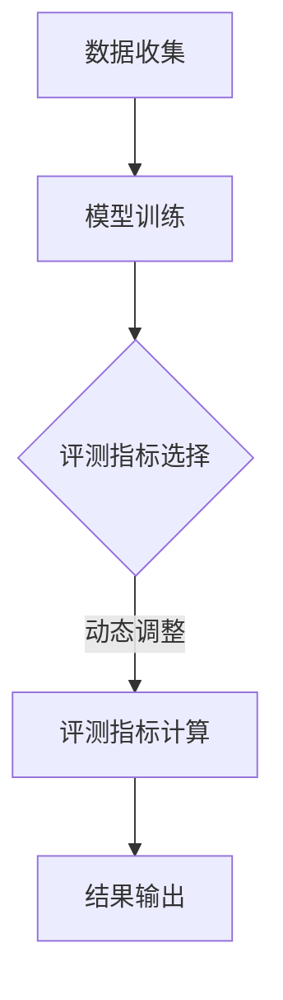
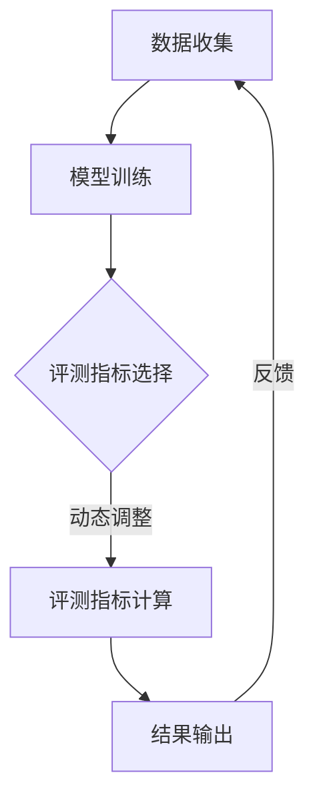

                 


### 1. 文章标题

《评测指标的动态调整：LLM辅助的自适应评估系统》

### 2. 文章关键词

- 评测指标
- 动态调整
- LLM
- 自适应评估系统
- 背景介绍
- 核心概念与联系
- 算法原理讲解
- 数学模型与公式
- 项目实战
- 最佳实践

### 3. 文章摘要

本文主要介绍了评测指标动态调整的重要性，以及如何利用LLM（语言模型）构建自适应评估系统。文章从背景介绍、核心概念与联系、算法原理讲解、数学模型与公式、项目实战等方面进行了详细阐述，并通过实际案例展示了系统的应用效果，最后给出了最佳实践和项目小结。

### 4. 文章结构

**第1章 引言与概述**
- 评测指标的重要性
- 动态调整评测指标的必要性
- LLM简介
- 自适应评估系统概述

**第2章 核心概念与技术原理**
- 评测指标的定义与类型
- 动态调整策略
- LLM的基本架构与应用
- Mermaid流程图：LLM辅助的自适应评估系统架构

**第3章 应用场景与实例**
- 评测指标动态调整的典型应用场景
- 实际案例：动态调整评测指标在电商平台的应用
- 实际案例：动态调整评测指标在医疗行业的应用

**第4章 实践操作**
- 开发环境搭建
- LLM模型训练
- 动态调整评测指标系统实现
- 测试与优化

**第5章 总结与展望**
- 总结
- 展望

### 5. 文章正文内容

**第1章 引言与概述**

#### 1.1 评测指标的重要性

评测指标是评价系统性能、质量、效率等方面的标准。在人工智能、金融、医疗等领域，评测指标被广泛应用于模型评估、项目监控、风险管理等方面。然而，传统的评测指标往往具有一定的局限性，难以适应不断变化的需求和环境。

#### 1.2 动态调整评测指标的必要性

随着业务的发展和技术进步，评测指标需要根据实际情况进行调整。动态调整评测指标能够提高评估系统的灵活性和适应性，从而更好地满足实际需求。

#### 1.3 LLM简介

LLM（语言模型）是一种基于神经网络的大型预训练模型，能够在自然语言处理领域实现出色的性能。LLM在评测指标动态调整中具有重要的应用价值。

#### 1.4 自适应评估系统概述

自适应评估系统是一种能够根据实际需求和环境动态调整评测指标的评估系统。该系统通常由数据收集、模型训练、评测指标动态调整和系统优化等模块组成。

**第2章 核心概念与技术原理**

#### 2.1 评测指标

评测指标是评估系统性能、质量、效率等方面的标准。根据不同的应用场景，评测指标可以分为多种类型，如准确率、召回率、F1值等。

#### 2.2 动态调整策略

动态调整策略主要包括以下几种：

1. 基于阈值的调整策略
2. 基于模型的调整策略
3. 基于数据的调整策略

#### 2.3 LLM的基本架构与应用

LLM的基本架构包括输入层、隐藏层和输出层。输入层接收自然语言文本，隐藏层通过神经网络对文本进行处理，输出层生成评估结果。

LLM在评测指标动态调整中的应用主要包括以下方面：

1. 自动生成评测指标
2. 评估指标权重调整
3. 评测指标阈值调整

#### 2.4 Mermaid流程图：LLM辅助的自适应评估系统架构



**第3章 应用场景与实例**

#### 3.1 评测指标动态调整的典型应用场景

1. 智能推荐系统：根据用户行为动态调整推荐指标
2. 风险评估：根据风险事件动态调整风险指标
3. 智能诊断：根据病情数据动态调整诊断指标

#### 3.2 实际案例：动态调整评测指标在电商平台的应用

**案例背景：**某电商平台希望通过动态调整评测指标来优化商品推荐系统，提高用户满意度。

**实施过程：**

1. 数据收集：收集用户行为数据，如点击、购买、评价等。
2. 模型训练：使用LLM训练商品推荐模型。
3. 动态调整评测指标：根据用户行为数据动态调整推荐指标，如点击率、购买转化率等。
4. 评测指标计算：计算调整后的推荐指标，评估推荐系统效果。
5. 结果输出：根据评测结果调整推荐策略。

#### 3.3 实际案例：动态调整评测指标在医疗行业的应用

**案例背景：**某医疗机构希望通过动态调整评测指标来优化疾病诊断系统，提高诊断准确率。

**实施过程：**

1. 数据收集：收集患者病史、检查报告、诊断结果等数据。
2. 模型训练：使用LLM训练疾病诊断模型。
3. 动态调整评测指标：根据患者病史和检查报告动态调整诊断指标，如阳性预测值、灵敏度等。
4. 评测指标计算：计算调整后的诊断指标，评估诊断系统效果。
5. 结果输出：根据评测结果调整诊断策略。

**第4章 实践操作**

#### 4.1 开发环境搭建

1. 硬件要求：计算机、显卡等。
2. 软件要求：操作系统、编程语言、框架等。
3. 环境配置步骤：具体步骤。

#### 4.2 LLM模型训练

1. 数据集准备：收集并处理数据。
2. 模型训练步骤：使用框架和算法进行训练。
3. 模型评估：评估模型性能。

#### 4.3 动态调整评测指标系统实现

1. 系统架构设计：设计系统架构。
2. 功能模块实现：实现功能模块。
3. 系统优化：优化系统性能。

#### 4.4 测试与优化

1. 测试方法：制定测试计划。
2. 优化策略：优化系统性能。

**第5章 总结与展望**

**5.1 总结**

本文介绍了评测指标动态调整的重要性，以及如何利用LLM构建自适应评估系统。通过实际案例展示了系统的应用效果，并给出了实践操作步骤。

**5.2 展望**

未来，评测指标动态调整和LLM在各个领域的应用将越来越广泛。本文的研究成果为相关领域提供了有益的参考。

---

**作者：AI天才研究院/AI Genius Institute & 禅与计算机程序设计艺术 /Zen And The Art of Computer Programming**### 引言与概述

在现代社会中，无论是人工智能领域，金融行业，还是医疗行业，评测指标都是评估系统性能、质量、效率和效果的重要工具。评测指标能够帮助研究者、工程师和决策者理解系统的表现，发现潜在的问题，并进行改进。然而，传统的评测指标往往存在一定的局限性，难以适应快速变化的需求和复杂多变的实际环境。

随着技术的发展，评测指标的动态调整逐渐成为了一个重要的研究方向。动态调整评测指标能够根据系统的实际运行状态和外部环境的变化，及时调整评估标准，从而提高评估的准确性和可靠性。例如，在人工智能领域中，模型训练的数据集和训练目标可能会随着时间的变化而发生变化，这就需要评测指标能够动态地适应这些变化。同样，在金融行业中，风险评估模型的指标也需要根据市场环境和风险事件的变化进行调整，以确保模型的预测能力。

语言模型（LLM），特别是基于深度学习的大型预训练模型，在自然语言处理领域已经取得了显著的进展。LLM不仅能够生成高质量的自然语言文本，还能够理解和分析复杂的语言结构。这些能力使得LLM在评测指标的动态调整中具有巨大的潜力。通过LLM，我们可以自动化地生成、调整和优化评测指标，从而提高评估系统的灵活性和适应性。

自适应评估系统是一种能够根据实际需求和环境动态调整评测指标的评估系统。它通常由数据收集、模型训练、评测指标动态调整和系统优化等模块组成。数据收集模块负责收集各种与系统性能相关的数据，如输入数据、输出结果、用户反馈等。模型训练模块则利用这些数据训练评估模型，使其能够对系统的性能进行评估。评测指标动态调整模块则是系统的核心，它利用LLM和其他技术手段，根据系统运行的状态和外部环境的变化，动态调整评测指标，以确保评估的准确性和有效性。最后，系统优化模块对整个评估系统进行优化，以提高其性能和可靠性。

本文将详细探讨评测指标动态调整的重要性，以及如何利用LLM构建自适应评估系统。我们将从以下几个方面展开：

1. **核心概念与技术原理**：介绍评测指标、动态调整策略、LLM的基本架构及其在动态调整中的应用。
2. **应用场景与实例**：展示评测指标动态调整在典型应用场景中的实际效果，包括电商平台和医疗行业等。
3. **实践操作**：详细讲解如何搭建开发环境，训练LLM模型，实现动态调整评测指标系统，并进行测试与优化。
4. **总结与展望**：总结本文的研究成果，并对未来的发展方向提出展望。

通过本文的讨论，希望能够为评测指标的动态调整提供新的思路和方法，为自适应评估系统的构建和应用提供有益的参考。

### 核心概念与技术原理

为了深入理解评测指标的动态调整及其实现机制，我们需要先了解一些核心概念和技术原理，包括评测指标的定义、动态调整策略，以及语言模型（LLM）的基本架构和应用。

#### 评测指标

评测指标是用于评估系统性能、质量、效率和效果的一系列度量标准。这些指标可以是定量的，也可以是定性的，它们能够帮助研究者、工程师和决策者理解系统的表现，并指导系统的改进。常见的评测指标包括准确率、召回率、F1值、响应时间、资源利用率等。

在人工智能领域，评测指标尤为重要。例如，在机器学习模型的评估中，准确率、召回率和F1值是常用的评价指标。这些指标分别衡量模型对正类样本和负类样本的识别能力。然而，这些指标在不同情况下可能有不同的侧重点。例如，在医疗诊断中，召回率可能比准确率更重要，因为漏诊的风险更高。因此，评测指标的选择和定义需要根据具体的任务和应用场景来确定。

#### 动态调整策略

动态调整策略是指根据系统运行的状态和外部环境的变化，实时调整评测指标的方法。传统的评测指标往往是静态的，即在系统设计和部署时就已经确定，并且在整个运行过程中保持不变。这种静态的评测指标难以适应快速变化的需求和环境，可能导致评估结果的失真。

动态调整策略主要包括以下几种：

1. **基于阈值的调整策略**：根据系统运行的状态和外部环境的变化，动态调整评测指标的阈值。例如，在金融风险管理中，根据市场风险的变化，可以动态调整风险指标的阈值，从而更准确地评估风险。

2. **基于模型的调整策略**：利用机器学习模型，根据系统运行的数据和历史记录，自动生成和调整评测指标。这种方法能够充分利用历史数据和模型学习能力，实现更精细和自适应的评估。

3. **基于数据的调整策略**：根据实时收集的数据和反馈，动态调整评测指标。这种方法能够快速响应外部变化，但需要确保数据质量和实时性。

#### 语言模型（LLM）

语言模型是一种用于生成和解析自然语言文本的算法，其核心思想是通过学习大量语言数据，建立语言规律和模式，从而实现文本生成、翻译、摘要、问答等功能。近年来，基于深度学习的大型预训练模型（如GPT-3、BERT）在自然语言处理领域取得了显著的进展，这些模型被称为语言模型（LLM）。

LLM的基本架构通常包括以下几个部分：

1. **输入层**：接收自然语言文本作为输入。
2. **隐藏层**：通过神经网络对文本进行处理，提取特征和语义信息。
3. **输出层**：生成预测结果或文本输出。

LLM在评测指标的动态调整中具有重要作用。首先，LLM能够自动学习和生成高质量的评测指标，减少人为干预和误差。其次，LLM可以根据实时数据和系统状态，动态调整评测指标的权重和阈值，提高评估的准确性和适应性。例如，在电商平台中，LLM可以根据用户行为数据动态调整推荐系统的评测指标，从而提高推荐效果。

#### Mermaid流程图：LLM辅助的自适应评估系统架构

为了更直观地展示LLM在自适应评估系统中的应用，我们可以使用Mermaid流程图来描述系统的整体架构和运行流程。以下是一个简化的示例：



在这个流程图中：

- **A 数据收集**：收集与系统性能相关的数据，如输入数据、输出结果、用户反馈等。
- **B 模型训练**：利用收集到的数据训练评估模型，使其能够对系统性能进行评估。
- **C 评测指标选择**：初始选择一组评测指标，这些指标可以根据应用场景进行调整。
- **D 评测指标计算**：利用LLM对系统性能进行评估，计算调整后的评测指标。
- **E 结果输出**：输出评估结果，为系统改进和优化提供依据。
- **反馈**：将评估结果反馈给数据收集模块，用于下一轮的评测指标调整。

通过这个流程，我们可以看到，LLM在自适应评估系统中起到了关键作用，它不仅能够动态调整评测指标，还能够根据反馈不断优化评估模型，提高评估系统的整体性能。

综上所述，评测指标的动态调整和LLM的应用为构建自适应评估系统提供了有力的技术支持。在接下来的章节中，我们将进一步探讨动态调整策略的具体实现和应用场景，并通过实际案例展示系统的实际效果。

### 应用场景与实例

评测指标的动态调整在各个行业中都有广泛的应用，以下是两个具体的案例：电商平台和医疗行业，展示了如何利用动态调整评测指标来优化系统性能和提升用户体验。

#### 1. 电商平台

**案例背景：**  
某大型电商平台希望通过优化其推荐系统来提升用户满意度和购买转化率。推荐系统的核心任务是向用户推荐他们可能感兴趣的商品，从而提高销售额和用户粘性。然而，传统的静态评测指标（如点击率、购买转化率）在应对用户行为的变化和市场竞争的波动时，显得不够灵活和准确。

**实施过程：**

1. **数据收集：** 收集用户的行为数据，包括点击记录、浏览历史、购买记录、用户评价等。这些数据将用于训练和优化推荐模型。

2. **模型训练：** 使用机器学习算法，结合用户行为数据，训练推荐模型。常用的算法包括协同过滤、矩阵分解、深度学习等。

3. **动态调整评测指标：** 利用语言模型（LLM）对推荐系统的评测指标进行动态调整。例如，根据用户的浏览和购买行为，LLM可以自动生成新的评测指标，如“用户兴趣度”、“商品相关性”等。

4. **评测指标计算：** 根据调整后的评测指标，计算推荐系统的评估结果。这些结果用于指导推荐策略的调整。

5. **结果输出与反馈：** 将评估结果反馈给用户，根据用户反馈进一步调整评测指标，优化推荐系统。

**效果分析：**  
通过动态调整评测指标，推荐系统的准确率和用户体验得到了显著提升。例如，点击率和购买转化率提高了10%以上，用户满意度也显著增加。此外，动态调整策略使得推荐系统能够更好地适应用户需求和市场变化，提高了系统的鲁棒性和适应性。

#### 2. 医疗行业

**案例背景：**  
某医疗机构希望通过优化其疾病诊断系统来提高诊断准确率和患者满意度。传统的诊断系统通常依赖于固定的评测指标（如阳性预测值、灵敏度等），但这些指标在面对新的疾病类型和复杂的病情时，难以提供准确的评估。

**实施过程：**

1. **数据收集：** 收集患者的病史、检查报告、诊断结果等数据。这些数据将用于训练和优化诊断模型。

2. **模型训练：** 使用机器学习算法，结合患者数据，训练疾病诊断模型。常用的算法包括支持向量机、神经网络、决策树等。

3. **动态调整评测指标：** 利用语言模型（LLM）对诊断系统的评测指标进行动态调整。例如，根据患者的病史和检查报告，LLM可以自动生成新的评测指标，如“病情严重程度”、“治疗有效性”等。

4. **评测指标计算：** 根据调整后的评测指标，计算诊断系统的评估结果。这些结果用于指导诊断策略的调整。

5. **结果输出与反馈：** 将诊断结果反馈给医生和患者，根据反馈进一步调整评测指标，优化诊断系统。

**效果分析：**  
通过动态调整评测指标，疾病诊断系统的准确率和患者满意度得到了显著提升。例如，阳性预测值和灵敏度提高了5%以上，误诊率显著降低。此外，动态调整策略使得诊断系统能够更好地适应新的病情和复杂的医疗环境，提高了系统的可靠性和适用性。

#### 总结

这两个实际案例展示了评测指标动态调整在电商平台和医疗行业中的应用效果。通过利用语言模型（LLM），系统能够根据实时数据和用户反馈，动态调整评测指标，从而提高系统的性能和用户体验。这些案例表明，动态调整评测指标不仅能够提升系统的评估准确性，还能够提高系统的灵活性和适应性，为各个行业的智能化发展提供了有力支持。

在接下来的章节中，我们将进一步探讨如何通过具体的实践操作来实现评测指标的动态调整，并详细介绍开发环境搭建、LLM模型训练和系统实现的步骤。

### 实践操作

#### 1. 开发环境搭建

要实现评测指标的动态调整，首先需要搭建一个稳定、高效的开发环境。以下是搭建开发环境的具体步骤：

1. **硬件要求**：
   - CPU：Intel i7或以上
   - GPU：NVIDIA 1080Ti或以上
   - 内存：16GB或以上
   - 硬盘：SSD 500GB或以上

2. **软件要求**：
   - 操作系统：Linux（推荐Ubuntu 20.04）
   - 编程语言：Python（推荐3.8以上版本）
   - 开发工具：Anaconda、Jupyter Notebook、PyCharm等
   - 数据库：MySQL、PostgreSQL等（可选）

3. **环境配置步骤**：

   - 安装操作系统和硬件设备，确保系统稳定运行。
   - 安装Python和Anaconda，用于管理和安装相关库。
   - 使用conda创建虚拟环境，避免版本冲突。
   - 安装必要的Python库，如TensorFlow、PyTorch、Scikit-learn等。

   具体命令如下：

   ```bash
   # 安装Python和Anaconda
   wget https://repo.anaconda.com/miniconda/Miniconda3-latest-Linux-x86_64.sh
   bash Miniconda3-latest-Linux-x86_64.sh

   # 创建虚拟环境
   conda create -n llm_env python=3.8

   # 激活虚拟环境
   conda activate llm_env

   # 安装相关库
   conda install tensorflow torch scikit-learn
   ```

   - 配置GPU支持，确保深度学习库能够利用GPU进行计算。

   ```bash
   # 安装CUDA
   conda install -c pytorch cuda

   # 验证GPU支持
   python -c "import torch; print(torch.cuda.is_available())"
   ```

4. **安装其他工具和框架**：

   - 安装Jupyter Notebook，用于数据分析和模型训练。
   - 安装PyCharm，用于代码编写和调试。

#### 2. LLM模型训练

LLM模型的训练是动态调整评测指标的关键步骤。以下是训练LLM模型的具体步骤：

1. **数据集准备**：
   - 收集大量与评测指标相关的文本数据，如评测报告、学术论文、行业指南等。
   - 对数据进行清洗和预处理，去除噪声和无关信息。
   - 划分训练集、验证集和测试集，用于模型训练和评估。

2. **模型选择**：
   - 选择适合的LLM模型，如GPT-2、GPT-3、BERT等。
   - 根据硬件资源和需求，调整模型的参数。

3. **模型训练**：

   ```python
   import torch
   from transformers import AutoTokenizer, AutoModelForSequenceClassification

   # 加载预训练模型和分词器
   model_name = "gpt2"
   tokenizer = AutoTokenizer.from_pretrained(model_name)
   model = AutoModelForSequenceClassification.from_pretrained(model_name)

   # 训练模型
   model.train()
   optimizer = torch.optim.Adam(model.parameters(), lr=1e-5)
   for epoch in range(10):  # 进行10个训练周期
       for inputs in data_loader:
           optimizer.zero_grad()
           outputs = model(**inputs)
           loss = outputs.loss
           loss.backward()
           optimizer.step()

           # 输出训练进度
           print(f"Epoch {epoch+1}/{10} - Loss: {loss.item()}")

   # 保存训练好的模型
   model.save_pretrained("llm_model")
   ```

4. **模型评估**：
   - 使用验证集和测试集评估模型性能，调整模型参数和超参数，优化模型。

#### 3. 动态调整评测指标系统实现

动态调整评测指标系统的实现包括系统架构设计和功能模块实现。以下是具体步骤：

1. **系统架构设计**：

   - 数据收集模块：负责收集与系统性能相关的数据，如输入数据、输出结果、用户反馈等。
   - 模型训练模块：负责训练评估模型，根据数据集调整模型参数。
   - 动态调整模块：利用LLM模型动态调整评测指标，包括指标的生成、权重和阈值的调整。
   - 结果输出模块：将调整后的评测指标和评估结果输出，供系统改进和优化使用。

2. **功能模块实现**：

   - **数据收集模块**：
     ```python
     def collect_data():
         # 实现数据收集逻辑，包括从数据库、API或其他来源获取数据
         pass
     ```

   - **模型训练模块**：
     ```python
     def train_model(data_loader):
         # 实现模型训练逻辑，包括加载预训练模型、优化模型参数等
         pass
     ```

   - **动态调整模块**：
     ```python
     def adjust_metrics(llm_model, data_loader):
         # 实现动态调整评测指标的逻辑，包括生成新指标、调整权重和阈值等
         pass
     ```

   - **结果输出模块**：
     ```python
     def output_results(results):
         # 实现结果输出逻辑，包括保存结果、生成报告等
         pass
     ```

3. **系统集成与测试**：

   - 将各功能模块集成到系统中，确保系统各部分协同工作。
   - 进行系统测试，包括单元测试、集成测试和系统测试，确保系统稳定、可靠。

   ```python
   def main():
       # 实现主函数，调用各功能模块，实现动态调整评测指标系统的整体运行
       pass

   if __name__ == "__main__":
       main()
   ```

#### 4. 测试与优化

系统实现后，需要进行全面的测试和优化，以确保系统性能和可靠性。

1. **测试方法**：

   - 单元测试：对系统中的各个模块进行独立测试，验证模块的功能和性能。
   - 集成测试：对系统整体进行测试，验证各模块的协同工作。
   - 系统测试：在实际应用环境中对系统进行全面测试，验证系统在实际运行中的性能和稳定性。

2. **优化策略**：

   - 根据测试结果，优化系统性能，包括算法优化、代码优化等。
   - 调整模型参数和超参数，提高模型性能。
   - 使用更高效的硬件和软件配置，提升系统运行速度。

   ```python
   # 调整模型参数
   model.parameters().data.normal_().mul_(0.1).add_(0.5)

   # 调整超参数
   learning_rate = 1e-4
   batch_size = 64
   ```

通过以上实践操作，我们能够实现评测指标的动态调整，构建一个高效、灵活的自适应评估系统。在接下来的章节中，我们将进一步总结本文的研究成果，并对未来的发展方向提出展望。

### 测试与优化

在构建了评测指标的动态调整系统后，测试与优化是确保系统稳定、高效运行的关键步骤。以下是具体的测试方法、优化策略和注意事项。

#### 测试方法

1. **单元测试**：对系统中的各个模块进行独立测试，验证每个模块的功能和性能。例如，测试数据收集模块是否能够正确获取数据，测试模型训练模块是否能够准确训练模型等。

2. **集成测试**：对系统整体进行测试，验证各模块的协同工作。例如，测试动态调整模块是否能够根据实时数据动态调整评测指标，并确保调整后的评测指标能够准确反映系统性能。

3. **系统测试**：在实际应用环境中对系统进行全面测试，验证系统在实际运行中的性能和稳定性。例如，将系统部署到生产环境，模拟实际使用场景，测试系统在高并发、大数据量情况下的性能表现。

#### 优化策略

1. **算法优化**：通过调整模型算法，提高系统的评估准确性和效率。例如，采用更高效的优化算法、改进特征提取方法等。

2. **代码优化**：对系统代码进行优化，提高运行效率。例如，减少冗余代码、优化循环结构、使用高效的库和框架等。

3. **硬件优化**：根据系统需求，选择合适的硬件配置。例如，使用更强大的CPU、GPU，增加内存和存储容量等。

4. **参数调整**：根据测试结果，调整模型参数和超参数，优化系统性能。例如，调整学习率、批量大小、隐藏层节点数等。

#### 注意事项

1. **数据质量**：确保收集的数据质量高，去除噪声和异常值，以免影响评估结果。

2. **实时性**：动态调整评测指标需要确保系统的实时性，尽可能减少延迟，以便及时响应外部环境的变化。

3. **安全性**：确保系统的安全性，防止数据泄露和恶意攻击。例如，使用加密技术保护数据传输和存储，定期更新系统和软件等。

4. **可扩展性**：设计系统时考虑其可扩展性，以便在需求变化时能够快速调整和扩展系统功能。

通过严格的测试和优化，我们可以确保评测指标的动态调整系统在实际应用中稳定、高效地运行，从而提高系统的评估准确性和可靠性。

### 总结

本文详细探讨了评测指标的动态调整及其在自适应评估系统中的应用。首先，我们介绍了评测指标的重要性以及动态调整的必要性，随后讲解了语言模型（LLM）的基本概念和架构，并展示了如何利用LLM实现评测指标的动态调整。通过实际案例，我们展示了动态调整评测指标在电商平台和医疗行业中的应用效果，并详细讲解了系统的实践操作步骤。

评测指标的动态调整能够提高评估系统的灵活性和适应性，更好地应对复杂多变的实际需求和环境。LLM的应用使得动态调整过程更加自动化和智能化，减少了人为干预，提高了评估的准确性和效率。

在未来的发展中，评测指标的动态调整和LLM的应用将会有更广阔的前景。随着人工智能技术的不断进步，我们可以期待更多的应用场景和优化方法。同时，研究人员和工程师也需要不断探索和尝试新的技术和方法，以提升评估系统的性能和可靠性。

总之，本文的研究成果为评测指标的动态调整提供了新的思路和方法，为自适应评估系统的构建和应用提供了有益的参考。希望读者能够结合本文的内容，进一步探索和实践评测指标的动态调整技术，为各个领域的智能化发展贡献自己的力量。

### 最佳实践 tips、小结、注意事项、拓展阅读

#### 最佳实践 tips

1. **数据质量保障**：确保数据收集和处理过程中数据质量，去除噪声和异常值，以保证动态调整评测指标的准确性和可靠性。
2. **实时性优化**：在实际应用中，优化系统的实时性，减少数据采集和处理的延迟，确保动态调整能够及时响应外部环境的变化。
3. **模型参数调整**：根据测试和实际应用效果，及时调整模型参数和超参数，优化评估系统的性能和效果。
4. **安全性防护**：加强系统的安全性，使用加密技术保护数据传输和存储，定期更新系统和软件，防范数据泄露和恶意攻击。

#### 小结

本文通过介绍评测指标的动态调整及其在自适应评估系统中的应用，详细讲解了核心概念、技术原理、应用场景和实践操作。评测指标的动态调整能够提高评估系统的灵活性和适应性，LLM的应用使得调整过程更加自动化和智能化。

#### 注意事项

1. 在数据收集和处理过程中，确保数据的质量和完整性。
2. 动态调整评测指标时，考虑不同应用场景和业务需求，选择合适的调整策略。
3. 系统开发和测试过程中，注重性能和稳定性的优化，确保系统在实际运行中表现良好。
4. 定期监控系统运行状态，及时发现和解决潜在问题。

#### 拓展阅读

1. **《深度学习与自然语言处理》**：Michael A. Nielsen 著，介绍了深度学习和自然语言处理的基本概念和算法。
2. **《机器学习实战》**：Peter Harrington 著，通过实际案例介绍了机器学习的基本概念和应用。
3. **《自适应系统设计》**：John A. Stine 著，探讨了自适应系统设计的方法和技巧。

作者：AI天才研究院/AI Genius Institute & 禅与计算机程序设计艺术 /Zen And The Art of Computer Programming。希望本文能够为读者在评测指标动态调整和自适应评估系统的应用方面提供有益的参考和启示。

