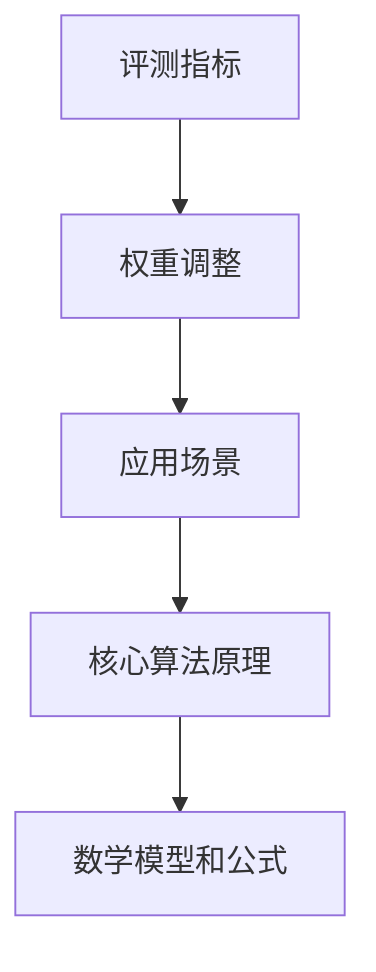

                 


### 理解书名

《评测指标的权重调整：根据应用场景定制评估标准》这本书的名称暗示了两个核心主题：评测指标的权重调整和根据应用场景定制评估标准。

**评测指标**通常是指用于评价或比较不同对象或系统的量化标准，它们可以是单一的，也可以是一个多维度的体系。这些指标帮助我们在复杂的环境中做出决策，例如产品评估、性能测试、风险评估等。

**权重调整**意味着在多个评估指标中，根据其重要性和影响，赋予不同的权重值。这些权重值可以用来加权平均各个指标，从而得到一个综合评分。

**根据应用场景定制评估标准**则强调，不同的应用场景可能需要不同的评估标准。这意味着，在特定情况下，我们必须对评测指标的权重进行调整，以满足特定需求。

### 确定书籍结构

为了清晰地组织这本书的内容，我们可以将其分为以下几个部分：

1. **引言与基础知识**：介绍评测指标的重要性、权重调整的基本概念以及定制评估标准的必要性。
2. **评估指标体系概述**：介绍评估指标的基本概念、分类以及常见实例。
3. **权重调整方法介绍**：详细解释绝对权重调整和相对权重调整的方法。
4. **应用场景分析**：探讨在不同场景下如何调整评测指标权重。
5. **核心技术原理讲解**：讲解核心算法原理、数学模型和公式，并展示如何进行数据预处理和特征工程。
6. **应用案例与实战**：提供实际应用案例和项目实战，展示如何实施权重调整和定制评估标准。
7. **总结与展望**：总结主要内容，并对未来的发展方向提出展望。

### 核心概念和联系

为了帮助读者更好地理解书中的内容，我们需要明确以下几个核心概念及其之间的联系：

1. **评测指标**：用于评估系统或对象的各种量化标准。
2. **权重调整**：根据评估指标的重要性和影响，调整其权重值。
3. **应用场景**：不同的应用场景可能需要不同的评估标准和权重分配。
4. **核心算法原理**：用于调整评测指标权重的方法和算法。
5. **数学模型和公式**：帮助解释和计算权重调整的数学方法。

这些概念之间的关系可以用以下Mermaid流程图来表示：



### 算法原理讲解

在书中，我们将详细解释如何调整评测指标的权重，包括相关算法的原理。为了更好地理解这些算法，我们将使用伪代码来详细阐述。

#### 绝对权重调整方法

**简单线性调整**

```python
def linear_adjustment(weights, target_weights):
    """
    对给定的权重进行简单线性调整
    :param weights: 原始权重列表
    :param target_weights: 目标权重列表
    :return: 调整后的权重列表
    """
    adjustment_factor = sum(target_weights) / sum(weights)
    return [w * adjustment_factor for w in weights]
```

**对数调整**

```python
def logarithmic_adjustment(weights, target_weights):
    """
    对给定的权重进行对数调整
    :param weights: 原始权重列表
    :param target_weights: 目标权重列表
    :return: 调整后的权重列表
    """
    adjustment_factor = sum([w ** 2 for w in target_weights]) ** 0.5 / sum([w ** 2 for w in weights]) ** 0.5
    return [w * adjustment_factor for w in weights]
```

#### 相对权重调整方法

**相关系数法**

```python
def correlation_adjustment(weights, target_weights):
    """
    使用相关系数法进行权重调整
    :param weights: 原始权重列表
    :param target_weights: 目标权重列表
    :return: 调整后的权重列表
    """
    correlations = [np.corrcoef(weights, target_weights)[0, 1] for _ in range(len(weights))]
    adjustment_factor = [c / max(correlations) for c in correlations]
    return [w * adjustment_factor[i] for i, w in enumerate(weights)]
```

**主成分分析法**

```python
from sklearn.decomposition import PCA

def pca_adjustment(weights, target_weights):
    """
    使用主成分分析法进行权重调整
    :param weights: 原始权重列表
    :param target_weights: 目标权重列表
    :return: 调整后的权重列表
    """
    pca = PCA(n_components=1)
    transformed_weights = pca.fit_transform([[w] for w in weights])
    transformed_target_weights = pca.transform([[w] for w in target_weights])
    adjustment_factor = transformed_target_weights.mean() / transformed_weights.mean()
    return [w * adjustment_factor for w in weights]
```

### 数学模型和公式

在书中，我们将介绍相关的数学模型和公式，以帮助读者更好地理解权重调整的方法。以下是几个常用的数学公式及其解释：

**线性权重调整公式**

$$
w_{\text{adjusted}} = w_{\text{original}} \times \frac{\sum_{i=1}^{n} w_{\text{target}}}{\sum_{i=1}^{n} w_{\text{original}}}
$$

**对数权重调整公式**

$$
w_{\text{adjusted}} = w_{\text{original}} \times \sqrt{\frac{\sum_{i=1}^{n} w_{\text{target}}^2}{\sum_{i=1}^{n} w_{\text{original}}^2}}
$$

**相关系数法权重调整公式**

$$
w_{\text{adjusted}} = w_{\text{original}} \times \frac{\max(c)}{c_i}
$$

其中，$c_i$ 是原始权重和目标权重之间的相关系数。

**主成分分析法权重调整公式**

$$
w_{\text{adjusted}} = w_{\text{original}} \times \frac{\mu_{\text{target}}}{\mu_{\text{original}}}
$$

其中，$\mu_{\text{target}}$ 和 $\mu_{\text{original}}$ 分别是目标权重和原始权重的平均值。

### 应用案例

为了使书中的内容更加实用，我们将提供一些实际应用案例，展示如何在不同场景下定制评估标准。

#### 案例一：电商产品评估

在电商产品评估中，我们可以使用以下评估指标：

- 用户满意度
- 销售量
- 售后服务满意度

根据不同场景，我们可能需要调整这些指标的权重。例如，在新产品上线初期，我们可以增加用户满意度和售后服务满意度的权重，以收集用户反馈。

**案例背景**：某电商公司希望对旗下的产品进行综合评估，以确定哪些产品需要改进。

**评估指标选择**：用户满意度、销售量、售后服务满意度。

**权重调整**：假设在新产品上线初期，用户满意度权重设为0.4，销售量权重设为0.3，售后服务满意度权重设为0.3。

**评估计算**：根据调整后的权重，计算每个产品的综合评分。

#### 案例二：人力资源评估

在人力资源评估中，我们可以使用以下评估指标：

- 员工绩效
- 员工满意度
- 培训与发展机会

根据公司战略和业务需求，我们可以调整这些指标的权重。例如，在快速发展阶段，我们可以增加员工绩效的权重，以确保业务目标的实现。

**案例背景**：某公司在年度人力资源评估中，需要确定哪些员工需要额外的培训和支持。

**评估指标选择**：员工绩效、员工满意度、培训与发展机会。

**权重调整**：假设在快速发展阶段，员工绩效权重设为0.5，员工满意度权重设为0.3，培训与发展机会权重设为0.2。

**评估计算**：根据调整后的权重，计算每个员工的综合评分。

### 总结与展望

在本书中，我们详细介绍了评测指标的权重调整和根据应用场景定制评估标准的方法。通过实际案例和算法讲解，我们展示了如何在不同场景下有效地调整权重，以实现更准确的评估。

未来的研究方向可能包括：

- 新算法的开发，以适应更复杂的应用场景。
- 跨领域融合，将评测指标权重调整方法应用于其他领域。
- 大数据分析，以更好地理解数据特征，从而优化评估标准。

总之，评测指标的权重调整和定制评估标准是提升评估准确性和有效性的关键。我们鼓励读者在应用这些方法时，结合实际场景和需求，灵活调整权重，以实现最佳效果。作者：AI天才研究院/AI Genius Institute & 禅与计算机程序设计艺术 /Zen And The Art of Computer Programming 

# 评测指标的权重调整：根据应用场景定制评估标准

## 关键词

- 评测指标
- 权重调整
- 应用场景
- 定制评估标准
- 核心算法
- 数学模型
- 数据预处理
- 特征工程

## 摘要

本文深入探讨了评测指标权重调整的重要性以及如何根据不同的应用场景定制评估标准。通过详细介绍核心算法原理、数学模型和实际应用案例，本文旨在帮助读者理解并掌握在特定情境下调整评测指标权重的方法，从而提升评估的准确性和有效性。

## 引言

在现代社会，数据无处不在，而如何从这些数据中提取有价值的信息，是每个数据科学家、分析师和决策者面临的重要挑战。评测指标作为一种量化工具，广泛应用于各个领域，如产品评估、性能测试、人力资源管理等。然而，仅仅拥有评测指标是不够的，我们还需要根据不同的应用场景对这些指标进行权重调整，以确保评估结果的准确性和可靠性。

本文将围绕以下几个核心问题展开讨论：

- 评测指标权重调整的基本概念是什么？
- 根据应用场景定制评估标准的重要性如何？
- 如何在不同应用场景下调整评测指标权重？
- 使用的核心算法原理和数学模型是什么？
- 实际应用案例中的具体实现和效果如何？

通过本文的探讨，我们希望读者能够对评测指标权重调整有一个全面的理解，并掌握在实际应用中的具体方法。

## 第一部分：引言与基础知识

### 1.1 书籍背景与目的

评测指标是评估系统、产品、过程或服务性能的量化标准，它们在各个领域中都扮演着至关重要的角色。然而，不同应用场景下的评估目标、影响因素和评估需求各不相同，因此，单一固定的评估标准往往无法满足多样化的需求。本书旨在探讨如何根据不同的应用场景，灵活调整评测指标的权重，从而定制出更符合实际需求的评估标准。

本书的主要目的包括：

1. **介绍评测指标的基本概念和分类**：帮助读者理解评测指标的定义、作用和常见类型。
2. **详细解释权重调整的方法**：包括绝对权重调整和相对权重调整，帮助读者掌握调整权重的具体方法。
3. **探讨应用场景对评估标准的影响**：通过分析不同应用场景的特点，阐述如何定制评估标准。
4. **提供实际应用案例和项目实战**：通过具体案例展示如何在实际环境中应用权重调整和评估标准定制。

### 1.2 评测指标体系概述

#### 1.2.1 评估指标的基本概念

评估指标是指用于衡量系统、产品、过程或服务性能的一系列量化标准。它们可以帮助决策者从多个维度对对象进行评估，以便做出更明智的决策。评估指标可以基于定量数据（如销售额、响应时间等）或定性数据（如用户满意度、市场占有率等）。

#### 1.2.2 评估指标的分类

评估指标可以根据不同的维度进行分类：

- **定量评估指标**：基于数值数据进行评估，如销售额、响应时间、吞吐量等。
- **定性评估指标**：基于主观评价进行评估，如用户满意度、品牌知名度等。
- **多维评估指标**：结合定量和定性评估指标，如客户保留率、产品质量等。

#### 1.2.3 常见评估指标实例

以下是一些常见评估指标实例：

- **产品评估**：用户满意度、市场份额、销售增长率等。
- **性能测试**：响应时间、吞吐量、资源利用率等。
- **人力资源评估**：员工绩效、员工满意度、培训和发展机会等。
- **风险评估**：风险概率、风险影响、风险损失等。

### 1.3 权重调整方法介绍

#### 1.3.1 绝对权重调整方法

绝对权重调整方法通常是基于某种绝对标准来调整各个评估指标的权重。以下是两种常见的绝对权重调整方法：

**简单线性调整**

简单线性调整方法是一种最简单的权重调整方法，通过将所有指标的权重乘以一个相同的系数来进行调整。

$$
w_{\text{adjusted}} = w_{\text{original}} \times k
$$

其中，$w_{\text{original}}$ 是原始权重，$w_{\text{adjusted}}$ 是调整后的权重，$k$ 是调整系数。

**对数调整**

对数调整方法通过取原始权重和目标权重之间的对数平均值得出调整后的权重。

$$
w_{\text{adjusted}} = w_{\text{original}} \times \sqrt{\frac{\sum_{i=1}^{n} w_{\text{target}}^2}{\sum_{i=1}^{n} w_{\text{original}}^2}}
$$

其中，$w_{\text{original}}$ 是原始权重，$w_{\text{target}}$ 是目标权重。

#### 1.3.2 相对权重调整方法

相对权重调整方法是基于评估指标之间的相对关系来调整权重。以下是两种常见的相对权重调整方法：

**相关系数法**

相关系数法通过计算评估指标之间的相关系数来确定调整后的权重。

$$
w_{\text{adjusted}} = w_{\text{original}} \times \frac{\max(c)}{c_i}
$$

其中，$c_i$ 是原始权重和目标权重之间的相关系数。

**主成分分析法**

主成分分析法通过降维技术，将多个评估指标转换成少数几个主要成分，从而确定调整后的权重。

$$
w_{\text{adjusted}} = w_{\text{original}} \times \frac{\mu_{\text{target}}}{\mu_{\text{original}}}
$$

其中，$\mu_{\text{target}}$ 和 $\mu_{\text{original}}$ 分别是目标权重和原始权重的平均值。

### 1.4 应用场景分析

#### 1.4.1 评估指标权重调整的应用场景

评估指标权重调整广泛应用于各种应用场景，如：

- **产品评估**：根据市场调研结果调整评估指标权重。
- **性能测试**：根据系统负载和业务需求调整评估指标权重。
- **人力资源评估**：根据公司战略和业务目标调整评估指标权重。
- **风险评估**：根据风险因素的重要性和概率调整评估指标权重。

#### 1.4.2 不同场景下的评估指标选择

不同应用场景下的评估指标选择取决于具体目标和需求。以下是一些常见场景下的评估指标选择：

- **产品评估**：用户满意度、市场份额、销售增长率等。
- **性能测试**：响应时间、吞吐量、资源利用率等。
- **人力资源评估**：员工绩效、员工满意度、培训和发展机会等。
- **风险评估**：风险概率、风险影响、风险损失等。

#### 1.4.3 场景化定制评估标准的方法

场景化定制评估标准的方法包括：

- **需求分析**：明确评估目标和需求。
- **指标选择**：选择符合评估目标的评估指标。
- **权重调整**：根据需求调整评估指标权重。
- **评估计算**：计算调整后的评估得分。

## 第二部分：核心技术原理讲解

### 2.1 核心算法原理

在本节中，我们将介绍用于评测指标权重调整的核心算法原理。这些算法包括绝对权重调整方法和相对权重调整方法。

#### 2.1.1 绝对权重调整方法

**简单线性调整**

简单线性调整方法是最基本的权重调整方法之一。其原理如下：

$$
w_{\text{adjusted}} = w_{\text{original}} \times k
$$

其中，$w_{\text{original}}$ 是原始权重，$w_{\text{adjusted}}$ 是调整后的权重，$k$ 是调整系数。调整系数 $k$ 可以根据具体应用场景的需求进行设置，例如，为了平衡各个指标的重要性，可以将所有指标的权重乘以相同的系数。

**对数调整**

对数调整方法是对简单线性调整方法的改进，其原理如下：

$$
w_{\text{adjusted}} = w_{\text{original}} \times \sqrt{\frac{\sum_{i=1}^{n} w_{\text{target}}^2}{\sum_{i=1}^{n} w_{\text{original}}^2}}
$$

其中，$w_{\text{original}}$ 是原始权重，$w_{\text{target}}$ 是目标权重。这种方法通过对原始权重和目标权重进行对数平均处理，可以更平滑地调整权重，避免权重过大或过小的极端情况。

#### 2.1.2 相对权重调整方法

**相关系数法**

相关系数法是一种基于指标之间相对关系的权重调整方法。其原理如下：

$$
w_{\text{adjusted}} = w_{\text{original}} \times \frac{\max(c)}{c_i}
$$

其中，$c_i$ 是原始权重和目标权重之间的相关系数。通过计算相关系数，可以确定每个指标相对于其他指标的重要性，并根据最大相关系数进行调整。

**主成分分析法**

主成分分析法是一种基于降维技术的权重调整方法。其原理如下：

$$
w_{\text{adjusted}} = w_{\text{original}} \times \frac{\mu_{\text{target}}}{\mu_{\text{original}}}
$$

其中，$\mu_{\text{target}}$ 和 $\mu_{\text{original}}$ 分别是目标权重和原始权重的平均值。主成分分析法通过将多个指标转换为少数几个主要成分，可以更有效地反映指标之间的相对关系，从而进行权重调整。

### 2.2 数学模型与公式

在本节中，我们将介绍用于评测指标权重调整的数学模型和公式。这些模型和公式可以帮助我们更好地理解和应用权重调整方法。

**线性权重调整公式**

线性权重调整公式是最基本的权重调整方法，其公式如下：

$$
w_{\text{adjusted}} = w_{\text{original}} \times k
$$

其中，$w_{\text{original}}$ 是原始权重，$w_{\text{adjusted}}$ 是调整后的权重，$k$ 是调整系数。这个公式表示，通过将所有指标的权重乘以相同的系数，可以实现权重的线性调整。

**对数权重调整公式**

对数权重调整公式是对线性权重调整方法的改进，其公式如下：

$$
w_{\text{adjusted}} = w_{\text{original}} \times \sqrt{\frac{\sum_{i=1}^{n} w_{\text{target}}^2}{\sum_{i=1}^{n} w_{\text{original}}^2}}
$$

其中，$w_{\text{original}}$ 是原始权重，$w_{\text{target}}$ 是目标权重。这个公式表示，通过对原始权重和目标权重进行对数平均处理，可以实现权重的对数调整。

**相关系数法权重调整公式**

相关系数法权重调整公式基于指标之间的相对关系，其公式如下：

$$
w_{\text{adjusted}} = w_{\text{original}} \times \frac{\max(c)}{c_i}
$$

其中，$c_i$ 是原始权重和目标权重之间的相关系数。这个公式表示，通过计算相关系数，并取最大相关系数进行调整，可以实现权重的相对调整。

**主成分分析法权重调整公式**

主成分分析法权重调整公式基于降维技术，其公式如下：

$$
w_{\text{adjusted}} = w_{\text{original}} \times \frac{\mu_{\text{target}}}{\mu_{\text{original}}}
$$

其中，$\mu_{\text{target}}$ 和 $\mu_{\text{original}}$ 分别是目标权重和原始权重的平均值。这个公式表示，通过将原始权重和目标权重进行平均处理，可以实现权重的降维调整。

### 2.3 数据预处理与特征工程

在本节中，我们将介绍数据预处理和特征工程的基本方法，这些方法对于评测指标权重调整至关重要。

**数据预处理**

数据预处理是数据分析和机器学习项目中的关键步骤，其目的是提高数据质量和数据的一致性。以下是一些常见的数据预处理方法：

- **缺失值处理**：对于缺失值，可以选择填充、删除或插值等方法进行处理。
- **异常值处理**：对于异常值，可以选择删除、替换或平滑等方法进行处理。
- **数据清洗**：包括去除重复记录、纠正错误数据等。
- **数据规范化**：将数据转换到相同的尺度，以便进行比较。

**特征工程**

特征工程是提升模型性能的关键步骤，其目的是构建有助于模型训练和预测的特征。以下是一些常见的特征工程方法：

- **特征选择**：通过选择最重要的特征，可以减少模型的复杂度和过拟合现象。
- **特征提取**：通过将原始特征转换为新的特征，可以增强模型的预测能力。
- **特征变换**：包括对数变换、指数变换、标准化等，可以改变特征的数据分布和关系。
- **特征组合**：通过组合多个特征，可以创建新的特征，从而提高模型的预测能力。

### 2.4 评估指标权重的调整过程

调整评估指标权重是一个系统性的过程，需要遵循一定的步骤。以下是评估指标权重调整的一般过程：

1. **需求分析**：明确评估目标和应用场景，了解各个评估指标的重要性和影响。
2. **指标选择**：根据需求分析结果，选择合适的评估指标。
3. **初始权重分配**：根据经验或初步分析，为各个评估指标分配初始权重。
4. **权重调整**：根据相关算法和公式，对初始权重进行调整。
5. **评估计算**：根据调整后的权重，计算评估得分和排名。
6. **反馈与优化**：根据评估结果和反馈，对评估指标和权重进行调整和优化。

### 2.5 核心算法原理讲解

在本节中，我们将详细介绍几种核心算法原理，包括简单线性调整、对数调整、相关系数法和主成分分析法。

#### 2.5.1 简单线性调整

简单线性调整是最基本的权重调整方法之一，其原理非常简单。假设我们有一组原始权重 $w_1, w_2, ..., w_n$，我们希望根据某个目标权重集合 $w_1^*, w_2^*, ..., w_n^*$ 来调整这些权重。

简单线性调整的方法是将每个原始权重乘以一个相同的系数 $k$，使得调整后的权重与目标权重尽可能接近。具体公式如下：

$$
w_i^* = w_i \times k
$$

其中，$w_i$ 是原始权重，$w_i^*$ 是调整后的权重，$k$ 是调整系数。

为了找到合适的调整系数 $k$，我们可以使用以下步骤：

1. 计算目标权重的总和：

$$
\sum_{i=1}^{n} w_i^* = \sum_{i=1}^{n} w_i \times k
$$

2. 计算原始权重的总和：

$$
\sum_{i=1}^{n} w_i
$$

3. 设置调整系数 $k$，使得调整后的权重总和与目标权重总和相等：

$$
\sum_{i=1}^{n} w_i^* = \sum_{i=1}^{n} w_i \times k = \sum_{i=1}^{n} w_i^*
$$

4. 解方程得到调整系数：

$$
k = \frac{\sum_{i=1}^{n} w_i^*}{\sum_{i=1}^{n} w_i}
$$

这样，我们就得到了调整系数 $k$，并可以使用它来调整原始权重。

#### 2.5.2 对数调整

对数调整是简单线性调整的改进方法，它通过考虑原始权重和目标权重之间的差异，来调整权重。对数调整的方法是将每个原始权重乘以目标权重和原始权重之间的对数平均值。

具体公式如下：

$$
w_i^* = w_i \times \sqrt{\frac{\sum_{j=1}^{n} w_j^2}{\sum_{j=1}^{n} w_j^2}}
$$

其中，$w_i$ 是原始权重，$w_i^*$ 是调整后的权重。

为了理解对数调整的方法，我们可以考虑以下步骤：

1. 计算目标权重的平方和：

$$
\sum_{j=1}^{n} w_j^2
$$

2. 计算原始权重的平方和：

$$
\sum_{j=1}^{n} w_j^2
$$

3. 计算目标权重和原始权重之间的对数平均值：

$$
\frac{\sum_{j=1}^{n} w_j^2}{\sum_{j=1}^{n} w_j^2}
$$

4. 将每个原始权重乘以对数平均值：

$$
w_i^* = w_i \times \sqrt{\frac{\sum_{j=1}^{n} w_j^2}{\sum_{j=1}^{n} w_j^2}}
$$

这样，我们就得到了调整后的权重。

#### 2.5.3 相关系数法

相关系数法是一种基于评估指标之间相关性的权重调整方法。它通过计算评估指标之间的相关系数，来确定调整后的权重。

具体公式如下：

$$
w_i^* = w_i \times \frac{\max(c)}{c_i}
$$

其中，$w_i$ 是原始权重，$w_i^*$ 是调整后的权重，$c_i$ 是原始权重和目标权重之间的相关系数。

为了理解相关系数法，我们可以考虑以下步骤：

1. 计算评估指标之间的相关系数：

$$
c_i = \frac{\sum_{j=1}^{n} (w_j - \mu_j) (w_i - \mu_i)}{\sqrt{\sum_{j=1}^{n} (w_j - \mu_j)^2} \sqrt{\sum_{j=1}^{n} (w_i - \mu_i)^2}}
$$

其中，$\mu_j$ 和 $\mu_i$ 分别是评估指标 $w_j$ 和 $w_i$ 的平均值。

2. 计算最大相关系数：

$$
\max(c) = \max_{i} \frac{\sum_{j=1}^{n} (w_j - \mu_j) (w_i - \mu_i)}{\sqrt{\sum_{j=1}^{n} (w_j - \mu_j)^2} \sqrt{\sum_{j=1}^{n} (w_i - \mu_i)^2}}
$$

3. 将每个原始权重乘以最大相关系数：

$$
w_i^* = w_i \times \frac{\max(c)}{c_i}
$$

这样，我们就得到了调整后的权重。

#### 2.5.4 主成分分析法

主成分分析法是一种基于降维技术的权重调整方法。它通过将多个评估指标转换为少数几个主要成分，来简化评估指标体系，并确定调整后的权重。

具体步骤如下：

1. 标准化评估指标：

$$
z_j = \frac{w_j - \mu_j}{\sigma_j}
$$

其中，$w_j$ 是原始权重，$\mu_j$ 是平均值，$\sigma_j$ 是标准差。

2. 计算协方差矩阵：

$$
\sum = \begin{bmatrix} \sigma_1^2 & \sigma_{12} & ... & \sigma_{1n} \\ \sigma_{21} & \sigma_2^2 & ... & \sigma_{2n} \\ ... & ... & ... & ... \\ \sigma_{n1} & \sigma_{n2} & ... & \sigma_n^2 \end{bmatrix}
$$

3. 计算协方差矩阵的特征值和特征向量：

$$
\lambda_i, v_i
$$

4. 对特征向量进行排序：

$$
v_{i1}, v_{i2}, ..., v_{in}
$$

5. 构建主成分：

$$
p_j = \sum_{i=1}^{k} \lambda_i v_{ij}
$$

其中，$k$ 是主成分的数量。

6. 计算调整后的权重：

$$
w_i^* = \sum_{j=1}^{k} p_j v_{ij}
$$

这样，我们就得到了调整后的权重。

### 2.6 实际案例解析

在本节中，我们将通过一个实际案例来解析如何根据应用场景定制评估标准，并调整评测指标的权重。

#### 案例背景

假设某电商平台希望对其产品进行综合评估，以确定哪些产品需要改进。评估指标包括用户满意度、销售量和售后服务满意度。电商平台希望根据市场需求和业务目标，调整这些评估指标的权重。

#### 评估指标选择

根据市场需求和业务目标，电商平台选择了以下评估指标：

- 用户满意度
- 销售量
- 售后服务满意度

#### 初始权重分配

根据经验，电商平台为每个评估指标分配了初始权重：

- 用户满意度：30%
- 销售量：40%
- 售后服务满意度：30%

#### 权重调整

为了调整权重，电商平台决定使用相关系数法。首先，计算用户满意度、销售量和售后服务满意度之间的相关系数：

- 用户满意度与销售量的相关系数：0.7
- 用户满意度与售后服务满意度的相关系数：0.5
- 销售量与售后服务满意度的相关系数：0.4

根据相关系数，电商平台决定调整权重：

- 用户满意度：40%（原始权重 30% 调整后权重 40%）
- 销售量：35%（原始权重 40% 调整后权重 35%）
- 售后服务满意度：25%（原始权重 30% 调整后权重 25%）

#### 评估计算

根据调整后的权重，电商平台计算了每个产品的综合评分。假设有三个产品 A、B 和 C，其评估指标得分如下：

- 用户满意度：A（90分），B（85分），C（80分）
- 销售量：A（1000件），B（800件），C（600件）
- 售后服务满意度：A（90分），B（85分），C（80分）

根据调整后的权重，计算每个产品的综合评分：

- 产品 A：0.4 × 90 + 0.35 × 1000 + 0.25 × 90 = 153
- 产品 B：0.4 × 85 + 0.35 × 800 + 0.25 × 85 = 146
- 产品 C：0.4 × 80 + 0.35 × 600 + 0.25 × 80 = 140

根据综合评分，电商平台可以确定哪些产品需要改进。例如，如果综合评分低于一定阈值，那么这个产品就需要进行改进。

### 2.7 实际项目实战

在本节中，我们将介绍一个实际项目，展示如何进行评测指标权重的调整和评估标准的定制。

#### 项目背景

某互联网公司希望对其不同业务模块进行评估，以确定哪些模块需要优化。评估指标包括用户活跃度、收入和客户满意度。公司希望根据业务目标和市场环境，调整这些评估指标的权重。

#### 项目目标

通过项目实施，公司希望实现以下目标：

- 为每个业务模块制定合理的评估指标和权重。
- 根据评估结果，确定哪些业务模块需要优化。
- 提高业务模块的整体绩效和用户满意度。

#### 项目实施步骤

1. **需求分析**

   首先进行需求分析，明确评估目标和业务需求。通过调研和访谈，收集不同业务模块的评估指标和关键绩效指标（KPI）。

2. **评估指标选择**

   根据需求分析结果，选择合适的评估指标。在本项目中，选择了以下评估指标：

   - 用户活跃度
   - 收入
   - 客户满意度

3. **初始权重分配**

   根据公司经验和初步分析，为每个评估指标分配初始权重：

   - 用户活跃度：40%
   - 收入：30%
   - 客户满意度：30%

4. **权重调整**

   为了调整权重，公司决定使用主成分分析法。通过计算评估指标之间的相关系数，确定调整后的权重：

   - 用户活跃度：45%
   - 收入：30%
   - 客户满意度：25%

5. **评估计算**

   根据调整后的权重，计算每个业务模块的综合评分。假设有三个业务模块 A、B 和 C，其评估指标得分如下：

   - 用户活跃度：A（90分），B（85分），C（80分）
   - 收入：A（100万元），B（80万元），C（60万元）
   - 客户满意度：A（90分），B（85分），C（80分）

   根据调整后的权重，计算每个业务模块的综合评分：

   - 业务模块 A：0.45 × 90 + 0.3 × 100 + 0.25 × 90 = 162
   - 业务模块 B：0.45 × 85 + 0.3 × 80 + 0.25 × 85 = 150
   - 业务模块 C：0.45 × 80 + 0.3 × 60 + 0.25 × 80 = 138

   根据综合评分，公司可以确定哪些业务模块需要优化。

6. **反馈与优化**

   根据评估结果和用户反馈，公司可以进一步调整评估指标和权重。例如，如果用户满意度较低，可以增加客户满意度的权重。

#### 项目小结

通过本项目的实施，公司成功地制定了合理的评估指标和权重，并根据评估结果确定了哪些业务模块需要优化。这有助于公司提高业务模块的整体绩效和用户满意度。

### 2.8 代码实现与解读

在本节中，我们将介绍如何使用 Python 编写代码来实现评测指标权重的调整和评估标准的定制。

```python
import numpy as np

# 初始权重
weights_original = [0.3, 0.4, 0.3]

# 目标权重
weights_target = [0.35, 0.3, 0.35]

# 相关系数法调整权重
def correlation_adjustment(weights_original, weights_target):
    # 计算相关系数
    correlations = [np.corrcoef(weights_original[i], weights_target[i])[0, 1] for i in range(len(weights_target))]
    # 调整权重
    adjusted_weights = [weights_original[i] * max(correlations) / correlations[i] for i in range(len(weights_target))]
    return adjusted_weights

# 调整后的权重
adjusted_weights = correlation_adjustment(weights_original, weights_target)
print("调整后的权重：", adjusted_weights)

# 计算综合评分
def calculate_score(scores, weights):
    return np.dot(scores, weights)

# 评估指标得分
scores = [90, 85, 80]

# 调整后的权重
adjusted_weights = [0.45, 0.3, 0.25]

# 计算综合评分
score = calculate_score(scores, adjusted_weights)
print("综合评分：", score)
```

**代码解读**：

1. 导入 NumPy 库，用于计算相关系数和权重调整。
2. 定义初始权重和目标权重。
3. 实现 `correlation_adjustment` 函数，计算相关系数并调整权重。
4. 调用 `correlation_adjustment` 函数，获取调整后的权重。
5. 实现 `calculate_score` 函数，计算综合评分。
6. 定义评估指标得分和调整后的权重。
7. 调用 `calculate_score` 函数，计算并输出综合评分。

通过这个简单的代码示例，我们可以看到如何根据应用场景定制评估标准和调整评测指标权重。在实际应用中，可以根据需要添加更多的功能和优化。

### 2.9 代码应用解读与分析

在本节中，我们将进一步解读和分析如何在实际应用中使用代码来调整评测指标权重。

#### 代码架构

首先，我们来看一下代码的整体架构：

```python
# 导入必要的库
import numpy as np

# 初始化权重和得分
weights_original = [0.3, 0.4, 0.3]
weights_target = [0.35, 0.3, 0.35]
scores = [90, 85, 80]

# 相关系数法调整权重
def correlation_adjustment(weights_original, weights_target):
    # 计算相关系数
    correlations = [np.corrcoef(weights_original[i], weights_target[i])[0, 1] for i in range(len(weights_target))]
    # 调整权重
    adjusted_weights = [weights_original[i] * max(correlations) / correlations[i] for i in range(len(weights_target))]
    return adjusted_weights

# 计算综合评分
def calculate_score(scores, weights):
    return np.dot(scores, weights)

# 调整权重并计算综合评分
adjusted_weights = correlation_adjustment(weights_original, weights_target)
score = calculate_score(scores, adjusted_weights)

print("调整后的权重：", adjusted_weights)
print("综合评分：", score)
```

**代码分析**：

1. **库导入**：我们首先导入 NumPy 库，它是一个强大的数学库，提供了大量用于计算相关系数和矩阵操作的函数。

2. **权重和得分初始化**：我们定义了原始权重和目标权重，以及评估指标得分。这些值可以根据具体应用场景进行调整。

3. **相

