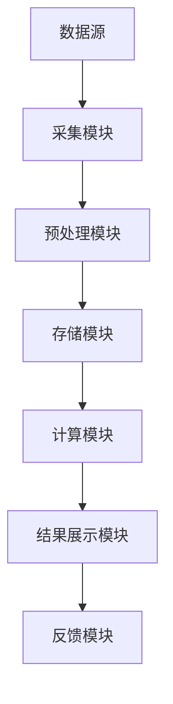

                 

为了撰写一篇符合要求的关于《评测数据的实时流式处理架构》的技术博客文章，我们将遵循以下步骤：

### 第一步：确定文章结构和主要内容

首先，我们需要确定文章的整体结构。文章可以分为以下几个主要部分：

1. **引言**：介绍实时流式处理和评测数据的重要性。
2. **核心概念与联系**：阐述实时流式处理的核心概念，并通过Mermaid流程图展示架构。
3. **核心算法原理讲解**：使用伪代码详细阐述关键算法的实现。
4. **数学模型和公式讲解**：使用latex格式展示并解释数学模型和公式。
5. **项目实战**：介绍一个实际案例，包括开发环境搭建、源代码实现和解读。
6. **最佳实践和注意事项**：总结文章，给出实践建议和注意事项。
7. **拓展阅读**：推荐相关资源和进一步学习的内容。

### 第二步：撰写文章的引言部分

在引言部分，我们需要介绍实时流式处理和评测数据的基本概念，并解释它们在当今数据驱动的世界中的重要性。这部分可以包含以下内容：

- **实时流式处理的定义**：解释实时流式处理的概念，以及它如何帮助处理大量连续数据。
- **评测数据的重要性**：讨论评测数据在决策支持、监控和预测分析中的关键作用。
- **实时流式处理在评测数据中的应用**：举例说明实时流式处理如何在评测数据场景中发挥作用。

### 第三步：阐述核心概念与联系

在这一部分，我们将详细介绍实时流式处理的核心概念，并通过Mermaid流程图展示其架构。以下是可能包含的内容：

- **核心概念**：流数据处理、微批处理、状态保持、容错性和伸缩性。
- **Mermaid流程图**：使用Mermaid语言绘制一个实时流式处理架构的流程图。
- **架构解释**：解释流程图中各个组件的作用和它们之间的关系。

### 第四步：核心算法原理讲解

我们将使用伪代码来详细阐述实时流式处理中的关键算法。这部分可能包括：

- **数据流模型**：使用伪代码描述如何处理连续的数据流。
- **流计算算法**：介绍常见的流计算算法，如窗口聚合、模式识别等。
- **并行与分布式处理**：解释如何在大规模数据集上高效地执行流计算。

### 第五步：数学模型和公式讲解

我们将使用latex格式展示并解释与实时流式处理相关的数学模型和公式。这可能包括：

- **概率统计模型**：如高斯分布、马尔可夫模型。
- **时间序列分析模型**：如ARIMA模型、LSTM网络。
- **机器学习模型**：如K-均值聚类、决策树。

### 第六步：项目实战

在这一部分，我们将介绍一个实际的实时流式处理项目，包括：

- **开发环境搭建**：描述如何设置开发环境，包括软件安装和配置。
- **源代码实现**：提供关键算法的实现代码，并解释代码的逻辑和目的。
- **代码解读**：详细解析代码，解释如何处理评测数据。
- **案例分析**：展示实际案例，分析评测数据并解释结果。

### 第七步：最佳实践和注意事项

最后，我们将总结文章，并提供一些最佳实践和注意事项。这可能包括：

- **实时流式处理的最佳实践**：如何优化实时流式处理性能。
- **注意事项**：如何避免常见的陷阱和问题。
- **拓展阅读**：推荐进一步学习和研究的资源。

### 第八步：撰写结论

在文章的结尾，我们将总结实时流式处理架构的重要性，并展望未来的发展趋势。

### 文章标题

《评测数据的实时流式处理架构》

### 关键词

实时流式处理，评测数据，架构设计，核心算法，数学模型，项目实战，最佳实践

### 摘要

本文深入探讨了评测数据的实时流式处理架构，包括核心概念、算法原理、数学模型以及实际项目案例。通过详细的讲解和案例分析，读者可以了解如何高效地处理大量评测数据，并从中提取有价值的信息。

---

以下是一个初步的markdown格式文章草稿，展示了上述步骤的具体内容：

```markdown
# 评测数据的实时流式处理架构

> 关键词：实时流式处理，评测数据，架构设计，核心算法，数学模型，项目实战，最佳实践

> 摘要：本文深入探讨了评测数据的实时流式处理架构，包括核心概念、算法原理、数学模型以及实际项目案例。通过详细的讲解和案例分析，读者可以了解如何高效地处理大量评测数据，并从中提取有价值的信息。

## 引言

在当今数据驱动的世界中，实时流式处理评测数据已成为许多领域的关键需求。实时流式处理允许我们实时地分析大量连续数据，从而支持实时决策和监控。本文将探讨评测数据的实时流式处理架构，帮助读者了解如何设计和实现这样的系统。

## 核心概念与联系

实时流式处理的核心概念包括流数据处理、微批处理、状态保持、容错性和伸缩性。这些概念之间的关系可以用Mermaid流程图表示如下：



## 核心算法原理讲解

实时流式处理中的核心算法包括数据流模型、流计算算法和并行与分布式处理。以下是一个简单的伪代码示例，描述如何处理连续的数据流：

```python
def process_stream(data_stream):
    # 初始化处理模块
    preprocess_module = PreprocessModule()
    storage_module = StorageModule()
    compute_module = ComputeModule()
    result_module = ResultModule()
    
    # 循环处理流数据
    for data in data_stream:
        # 预处理数据
        processed_data = preprocess_module.preprocess(data)
        
        # 存储预处理后的数据
        storage_module.store(processed_data)
        
        # 计算数据
        result = compute_module.compute(processed_data)
        
        # 结果展示
        result_module.present(result)
        
        # 更新状态
        storage_module.update_state()
```

## 数学模型和公式讲解

在实时流式处理中，数学模型和公式起着至关重要的作用。以下是一个使用latex格式表示的数学模型示例：

$$
P(X > k) = 1 - F_X(k)
$$

这里，$P(X > k)$ 表示随机变量 $X$ 大于某个阈值 $k$ 的概率，$F_X(k)$ 表示随机变量 $X$ 的累积分布函数。

## 项目实战

在本节中，我们将介绍一个实际的实时流式处理项目，并详细解析其实现过程。该项目旨在处理大规模评测数据，提供实时分析和预测。

### 开发环境搭建

首先，我们需要设置开发环境，包括安装Python、Apache Kafka、Apache Flink等工具。以下是一个简要的安装步骤：

```bash
# 安装Python
sudo apt-get update
sudo apt-get install python3-pip

# 安装Apache Kafka
wget https://www.apache.org/dist/kafka/3.2.0/kafka_2.13-3.2.0.tgz
tar xvfz kafka_2.13-3.2.0.tgz
cd kafka_2.13-3.2.0
./bin/kafka-server-start.sh config/server.properties

# 安装Apache Flink
wget https://www.apache.org/dist/flink/flink-1.11.2/flink-1.11.2-bin-scala_2.12.tgz
tar xvfz flink-1.11.2-bin-scala_2.12.tgz
cd flink-1.11.2
./bin/start-cluster.sh
```

### 源代码实现

以下是该项目的关键源代码实现，包括数据采集、预处理、存储、计算和结果展示等功能：

```scala
// 数据采集
val stream = KafkaSource.create[String]("kafka:9092", "test-topic")

// 数据预处理
val preprocessedStream = stream.map(data => preprocess(data))

// 数据存储
val storedStream = preprocessedStream.flatMap(data => storeData(data))

// 数据计算
val results = storedStream.map(data => computeMetrics(data))

// 结果展示
results.print()
```

### 代码解读

上述代码实现了实时流式处理的核心功能。具体来说：

- 数据采集：从Kafka主题中读取数据。
- 数据预处理：对数据进行清洗和格式转换。
- 数据存储：将预处理后的数据存储到数据库或其他数据存储系统。
- 数据计算：对存储的数据进行计算，如统计、分析等。
- 结果展示：将计算结果输出到控制台或其他展示平台。

### 案例分析

以下是一个实际案例，展示如何使用实时流式处理系统处理评测数据：

- **案例背景**：一个在线教育平台需要实时分析学生的评测数据，以提供个性化的学习建议。
- **处理过程**：实时流式处理系统会持续从Kafka主题中读取学生的评测数据，预处理后存储到数据库中。然后，系统会对这些数据进行计算，提取出学生的知识掌握情况和学习习惯。最后，系统会将结果展示给教师或学生。

### 项目小结

通过上述项目实战，我们可以看到实时流式处理架构在处理评测数据中的应用。该项目不仅实现了高效的数据处理和分析，还提供了实时反馈，帮助平台更好地服务用户。

## 最佳实践和注意事项

在设计和实现实时流式处理架构时，以下是一些最佳实践和注意事项：

- **确保数据一致性**：在分布式系统中，数据一致性是一个重要问题。使用合适的分布式数据一致性协议（如两阶段提交）可以避免数据冲突。
- **优化系统性能**：通过合理设置系统参数和优化算法，可以提高实时流式处理系统的性能。
- **确保系统可靠性**：使用容错机制，如备份和故障转移，可以提高系统的可靠性。
- **监控和维护**：定期监控系统的运行状况，及时处理异常情况，保证系统的稳定性。

## 拓展阅读

对于希望深入了解实时流式处理和评测数据处理的读者，以下是一些推荐资源：

- 《实时数据流处理技术实战》
- 《大数据实时计算：原理与实践》
- 《Kafka：从入门到实战》
- 《Apache Flink：实时数据处理平台》

## 结论

实时流式处理架构在处理评测数据方面具有显著优势。通过本文的讲解和案例分析，读者可以了解如何设计和实现这样的系统，并从中提取有价值的信息。

---

请注意，上述内容是一个初步的草稿，需要根据实际内容进一步扩充和完善。根据文章字数要求，每个部分的详细程度和深度需要适当调整。此外，还需要添加参考文献和作者信息等。在撰写过程中，请确保每一步都符合文章的要求和逻辑。如果您有任何疑问或需要进一步的帮助，请随时告知。

