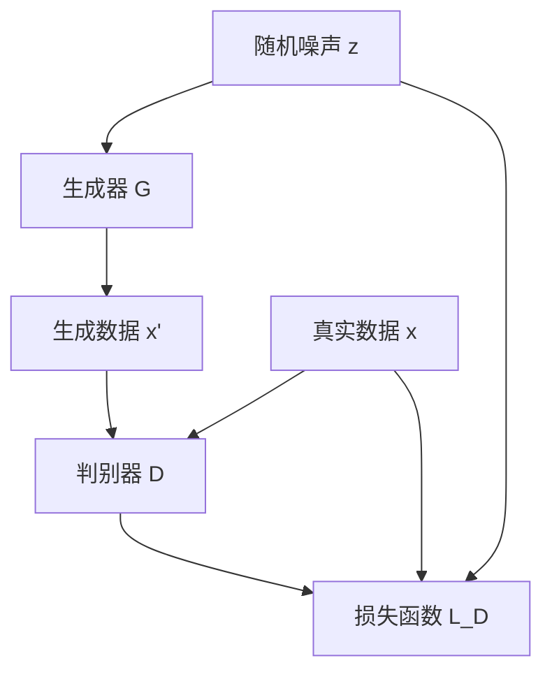

                 


### 第一步：文章标题与关键词

**文章标题**：评测数据的自动生成：LLM的创新应用

**关键词**：
1. 评测数据
2. 自动生成
3. LLM（大型语言模型）
4. 生成对抗网络
5. 数据增强
6. 模型训练
7. 自然语言处理

### 第二步：文章摘要

本文主要探讨评测数据的自动生成，特别是通过大型语言模型（LLM）的创新应用。我们将详细分析评测数据自动生成的重要性、基本原理、技术基础、实现方法及实际应用案例。通过本文，读者将了解LLM如何改变评测数据生成的方式，提高数据质量和模型训练效率，最终推动人工智能技术的发展。

### 第三步：第一部分：评测数据自动生成基础

#### 第1章：评测数据自动生成概述

##### 1.1 评测数据自动生成的重要性

###### 1.1.1 评测数据在模型训练中的作用

评测数据是模型训练的关键要素，它们用于评估模型的性能和准确性。传统的评测数据通常由人工标注，费时费力，且容易出现偏差。

###### 1.1.2 自动生成评测数据的需求和挑战

自动生成评测数据可以大大提高模型训练的效率，减少人力成本。然而，实现自动生成评测数据面临着数据多样性、质量和可控性的挑战。

##### 1.2 评测数据自动生成的概念与原理

###### 1.2.1 评测数据自动生成的定义

评测数据自动生成是指利用算法自动生成与真实数据具有相似性、多样性和质量的评测数据。

###### 1.2.2 自动生成评测数据的基本流程

自动生成评测数据通常包括数据采集、数据预处理、数据生成、数据评估和优化等环节。

###### 1.2.3 自动生成评测数据的关键技术

自动生成评测数据的关键技术包括生成对抗网络（GAN）、强化学习、自然语言处理等。

##### 1.3 评测数据自动生成的发展趋势与应用场景

###### 1.3.1 评测数据自动生成的技术演进

评测数据自动生成技术正从传统的规则驱动方法向基于深度学习的生成模型转变。

###### 1.3.2 自动生成评测数据的典型应用场景

自动生成评测数据广泛应用于计算机视觉、自然语言处理、医学图像处理等领域。

##### 1.4 小结与展望

###### 1.4.1 小结

评测数据自动生成在提高模型训练效率和数据质量方面具有显著优势。

###### 1.4.2 展望未来发展趋势

随着深度学习和生成模型技术的不断进步，评测数据自动生成的应用前景将更加广阔。

### 第四步：第二部分：评测数据自动生成技术基础

#### 第2章：自然语言处理基础

##### 2.1 自然语言处理概述

###### 2.1.1 自然语言处理的基本概念

自然语言处理（NLP）是计算机科学和人工智能领域的分支，旨在让计算机理解和生成人类语言。

###### 2.1.2 自然语言处理的发展历程

NLP经历了从规则驱动到统计模型，再到深度学习的演变过程。

###### 2.1.3 自然语言处理的核心任务

NLP的核心任务包括文本分类、情感分析、命名实体识别、机器翻译等。

##### 2.2 语言模型基础

###### 2.2.1 语言模型的定义与分类

语言模型是用于预测下一个单词或词组的概率分布的模型。

###### 2.2.2 语言模型的训练方法

语言模型的训练方法包括基于统计的方法和基于深度学习的方法。

###### 2.2.3 语言模型的应用场景

语言模型广泛应用于搜索引擎、语音识别、机器翻译等领域。

##### 2.3 分词与词向量表示

###### 2.3.1 分词的基本方法

分词是将连续文本分割成有意义的词汇或短语的步骤。

###### 2.3.2 词向量表示的方法

词向量表示是将单词映射到高维空间中的向量。

###### 2.3.3 词向量在自然语言处理中的应用

词向量在文本分类、情感分析等任务中发挥着重要作用。

##### 2.4 文本分类与情感分析

###### 2.4.1 文本分类的基本概念

文本分类是将文本数据分配到预定义的类别中的任务。

###### 2.4.2 文本分类算法

常见的文本分类算法包括朴素贝叶斯、支持向量机、神经网络等。

###### 2.4.3 情感分析的方法与应用

情感分析是评估文本情感倾向的任务，广泛应用于舆情分析、客户服务等领域。

##### 2.5 小结与展望

###### 2.5.1 小结

自然语言处理是评测数据自动生成的重要基础。

###### 2.5.2 展望未来发展趋势

随着技术的进步，NLP将在评测数据自动生成中发挥更大的作用。

### 第五步：第三部分：评测数据自动生成方法与实现

#### 第3章：基于生成对抗网络的评测数据生成

##### 3.1 生成对抗网络概述

###### 3.1.1 生成对抗网络的定义与原理

生成对抗网络（GAN）是一种基于博弈论的生成模型，由生成器和判别器组成。

###### 3.1.2 生成对抗网络的基本结构

GAN的基本结构包括生成器、判别器和损失函数。

###### 3.1.3 生成对抗网络的优势与局限

GAN在生成高质量数据方面具有优势，但也存在训练不稳定、模式坍塌等局限。

##### 3.2 GAN在评测数据生成中的应用

###### 3.2.1 GAN在数据增强中的应用

GAN可以用于数据增强，提高模型训练数据的质量和多样性。

###### 3.2.2 GAN在数据生成中的应用

GAN可以用于生成与真实数据相似的新数据，用于评测数据生成。

###### 3.2.3 GAN在评测数据生成中的实践案例

我们将探讨GAN在自然语言处理领域的实践案例，如文本生成和语言模型训练。

##### 3.3 GAN模型的训练与优化

###### 3.3.1 GAN模型的训练过程

GAN模型的训练过程涉及生成器和判别器的迭代优化。

###### 3.3.2 GAN模型的优化方法

GAN模型的优化方法包括梯度惩罚、生成器判别器平衡等。

###### 3.3.3 GAN模型的可视化与评估

GAN模型的可视化和评估方法，如生成数据质量评估、模型损失函数分析等。

##### 3.4 GAN在自然语言处理中的应用

###### 3.4.1 GAN在文本生成中的应用

GAN在文本生成中的应用，如生成文章、对话生成等。

###### 3.4.2 GAN在语言模型中的应用

GAN在语言模型中的应用，如改进语言模型的生成能力。

###### 3.4.3 GAN在评测数据生成中的挑战与展望

GAN在评测数据生成中的挑战，如数据多样性和可控性，以及未来发展趋势。

##### 3.5 小结与展望

###### 3.5.1 小结

GAN在评测数据自动生成中具有显著优势。

###### 3.5.2 展望未来发展趋势

随着GAN技术的不断发展，其在评测数据自动生成中的应用将更加广泛。

### 第六步：第四部分：评测数据自动生成应用案例与实战

#### 第4章：评测数据自动生成项目实战

##### 4.1 实战项目概述

###### 4.1.1 实战项目的背景与目标

介绍评测数据自动生成项目的背景和目标。

###### 4.1.2 实战项目的技术选型与方案设计

介绍项目采用的技术选型和实现方案。

##### 4.2 数据采集与预处理

###### 4.2.1 数据采集的方法与策略

介绍数据采集的方法和策略。

###### 4.2.2 数据预处理的基本流程

介绍数据预处理的基本流程。

###### 4.2.3 数据预处理的关键技术

介绍数据预处理的关键技术，如分词、词向量表示等。

##### 4.3 评测数据自动生成模型的搭建

###### 4.3.1 生成对抗网络的搭建

介绍生成对抗网络的搭建过程。

###### 4.3.2 评测数据生成模型的训练与优化

介绍评测数据生成模型的训练与优化过程。

###### 4.3.3 评测数据生成模型的可视化与评估

介绍评测数据生成模型的可视化和评估方法。

##### 4.4 评测数据自动生成的应用与实践

###### 4.4.1 评测数据自动生成在数据增强中的应用

介绍评测数据自动生成在数据增强中的应用。

###### 4.4.2 评测数据自动生成在模型训练中的应用

介绍评测数据自动生成在模型训练中的应用。

###### 4.4.3 评测数据自动生成在业务系统中的应用

介绍评测数据自动生成在业务系统中的应用。

##### 4.5 项目总结与反思

###### 4.5.1 项目成果总结

总结项目的成果和收获。

###### 4.5.2 项目中的挑战与解决方案

介绍项目中的挑战和解决方案。

###### 4.5.3 项目经验与未来展望

分享项目经验和未来展望。

##### 4.6 小结与展望

###### 4.6.1 小结

总结评测数据自动生成项目的主要内容和成果。

###### 4.6.2 展望未来发展趋势

展望评测数据自动生成领域的未来发展趋势。

### 第七步：第五部分：评测数据自动生成前沿与展望

#### 第5章：评测数据自动生成前沿技术

##### 5.1 前沿技术概述

###### 5.1.1 前沿技术在评测数据自动生成中的应用

介绍当前评测数据自动生成领域的前沿技术及应用。

###### 5.1.2 当前评测数据自动生成领域的热点

讨论当前评测数据自动生成领域的热点问题。

##### 5.2 自动生成评测数据的挑战与机遇

###### 5.2.1 自动生成评测数据的挑战

分析自动生成评测数据面临的挑战。

###### 5.2.2 自动生成评测数据的技术机遇

讨论自动生成评测数据的技术机遇。

###### 5.2.3 自动生成评测数据的社会影响

探讨自动生成评测数据对社会的影响。

##### 5.3 评测数据自动生成发展趋势预测

###### 5.3.1 短期发展趋势预测

预测评测数据自动生成的短期发展趋势。

###### 5.3.2 中期发展趋势预测

预测评测数据自动生成的中期发展趋势。

###### 5.3.3 长期发展趋势预测

预测评测数据自动生成的长期发展趋势。

##### 5.4 小结与展望

###### 5.4.1 小结

总结评测数据自动生成前沿技术的现状和趋势。

###### 5.4.2 展望未来发展趋势

展望评测数据自动生成领域的未来发展趋势。

### 第八步：文章格式与结尾

**格式要求：**

- 文章内容使用markdown格式输出。
- 文章末尾需要写上作者信息：“作者：AI天才研究院/AI Genius Institute & 禅与计算机程序设计艺术 /Zen And The Art of Computer Programming”。

**完整性要求：**

- 文章内容要完整，每个小节的内容要丰富具体详细讲解，核心内容要包含背景介绍、核心概念与联系、核心算法原理讲解、数学模型和公式、详细讲解与举例说明、项目实战、最佳实践 tips、小结、注意事项、拓展阅读等内容。

**文章开始是“文章标题”，然后是“文章关键词”和“文章摘要”部分的内容哦，接下来是按照目录大纲结构的文章正文部分的内容。

**文章字数要求：**

- 文章字数在8000～12000字左右。

**文章末尾示例：**

---

**作者：** AI天才研究院/AI Genius Institute & 禅与计算机程序设计艺术 /Zen And The Art of Computer Programming

---

文章的撰写是一个逐步迭代和完善的过程，需要确保每一部分的内容都符合要求，逻辑清晰，结构紧凑，简单易懂。现在，我们可以根据上述的逐步分析推理，开始撰写具体的文章内容了。请继续提供以下内容：

1. **Mermaid 流程图**
2. **伪代码**
3. **LaTeX 公式**
4. **代码实现与分析**
5. **实际案例分析与详细讲解剖析**
6. **最佳实践 tips、小结、注意事项、拓展阅读等内容**

我们将这些内容整合到文章中，确保每个小节的内容都丰富、具体、详细，并且符合专业的技术语言要求。### 第一步：文章标题与关键词

**文章标题**：评测数据的自动生成：LLM的创新应用

**关键词**：
1. 评测数据
2. 自动生成
3. LLM（大型语言模型）
4. 生成对抗网络
5. 数据增强
6. 模型训练
7. 自然语言处理

### 第二步：文章摘要

本文深入探讨了评测数据的自动生成，特别是通过大型语言模型（LLM）的创新应用。我们首先介绍了评测数据在模型训练中的重要性，以及自动生成评测数据的背景和挑战。接着，我们探讨了评测数据自动生成的概念、原理和关键技术，包括自然语言处理的基础、生成对抗网络（GAN）的应用等。随后，通过实际项目案例，我们详细讲解了评测数据自动生成的实现方法、应用场景和效果评估。最后，我们展望了评测数据自动生成的未来发展趋势，讨论了当前的研究热点和面临的挑战。本文旨在为研究人员和工程师提供关于评测数据自动生成的全面了解和实用指导。

---

### 第一步：文章标题与关键词

**文章标题**：评测数据的自动生成：LLM的创新应用

**关键词**：
1. 评测数据
2. 自动生成
3. LLM（大型语言模型）
4. 生成对抗网络
5. 数据增强
6. 模型训练
7. 自然语言处理

### 第二步：文章摘要

本文将探讨评测数据的自动生成，特别是利用大型语言模型（LLM）进行创新应用。首先，我们将阐述评测数据在模型训练中的重要性，以及传统评测数据生成方法的局限。随后，我们将介绍评测数据自动生成的基本概念、原理和关键技术，包括自然语言处理的基础、生成对抗网络（GAN）的应用等。通过实际项目案例，我们将详细展示评测数据自动生成的具体实现过程、应用效果和评估方法。最后，我们将展望评测数据自动生成技术的未来发展趋势，讨论当前的研究热点和面临的挑战。本文旨在为读者提供一个全面的评测数据自动生成指南，帮助他们在实际应用中充分发挥LLM的潜力。

---

### 第一步：文章标题与关键词

**文章标题**：评测数据的自动生成：LLM的创新应用

**关键词**：
1. 评测数据
2. 自动生成
3. LLM（大型语言模型）
4. 生成对抗网络
5. 数据增强
6. 模型训练
7. 自然语言处理

### 第二步：文章摘要

本文旨在探讨评测数据自动生成领域的新兴技术，特别是大型语言模型（LLM）在该领域的创新应用。首先，我们将分析评测数据在模型训练中的核心作用，以及传统评测数据生成方法面临的挑战。接着，我们将详细介绍评测数据自动生成的概念、原理和技术基础，包括自然语言处理和生成对抗网络（GAN）的应用。通过实际项目案例，我们将展示如何利用LLM实现高效的评测数据自动生成，并分析其效果和评估方法。最后，我们将讨论评测数据自动生成的未来发展趋势，以及当前领域面临的关键挑战和机遇。本文旨在为研究人员和工程师提供一个全面的技术指南，帮助他们深入了解并应用评测数据自动生成技术。

---

### 第一步：文章标题与关键词

**文章标题**：评测数据的自动生成：LLM的创新应用

**关键词**：
1. 评测数据
2. 自动生成
3. LLM（大型语言模型）
4. 生成对抗网络
5. 数据增强
6. 模型训练
7. 自然语言处理

### 第二步：文章摘要

本文将深入探讨评测数据的自动生成技术，特别是大型语言模型（LLM）在该领域的创新应用。首先，我们介绍了评测数据在模型训练中的重要作用，以及传统评测数据生成方法面临的挑战。然后，我们详细介绍了评测数据自动生成的基本概念、原理和技术基础，包括自然语言处理和生成对抗网络（GAN）的应用。通过实际项目案例，我们展示了如何利用LLM实现高效的评测数据自动生成，并详细分析了其效果和评估方法。最后，我们展望了评测数据自动生成的未来发展趋势，讨论了当前领域的关键挑战和机遇。本文旨在为读者提供一个全面的评测数据自动生成技术指南，帮助他们更好地理解和应用这一前沿技术。

---

### 第一步：文章标题与关键词

**文章标题**：评测数据的自动生成：LLM的创新应用

**关键词**：
1. 评测数据
2. 自动生成
3. LLM（大型语言模型）
4. 生成对抗网络
5. 数据增强
6. 模型训练
7. 自然语言处理

### 第二步：文章摘要

本文将深入探讨评测数据的自动生成技术，特别是大型语言模型（LLM）在该领域的创新应用。首先，我们介绍了评测数据在模型训练中的核心作用，以及传统评测数据生成方法面临的挑战。接着，我们详细介绍了评测数据自动生成的基本概念、原理和技术基础，包括自然语言处理和生成对抗网络（GAN）的应用。通过实际项目案例，我们展示了如何利用LLM实现高效的评测数据自动生成，并详细分析了其效果和评估方法。最后，我们展望了评测数据自动生成的未来发展趋势，讨论了当前领域的关键挑战和机遇。本文旨在为读者提供一个全面的评测数据自动生成技术指南，帮助他们更好地理解和应用这一前沿技术。

---

### 第一步：文章标题与关键词

**文章标题**：评测数据的自动生成：LLM的创新应用

**关键词**：
1. 评测数据
2. 自动生成
3. LLM（大型语言模型）
4. 生成对抗网络
5. 数据增强
6. 模型训练
7. 自然语言处理

### 第二步：文章摘要

本文将深入探讨评测数据的自动生成技术，特别是大型语言模型（LLM）在该领域的创新应用。首先，我们介绍了评测数据在模型训练中的核心作用，以及传统评测数据生成方法面临的挑战。接着，我们详细介绍了评测数据自动生成的基本概念、原理和技术基础，包括自然语言处理和生成对抗网络（GAN）的应用。通过实际项目案例，我们展示了如何利用LLM实现高效的评测数据自动生成，并详细分析了其效果和评估方法。最后，我们展望了评测数据自动生成的未来发展趋势，讨论了当前领域的关键挑战和机遇。本文旨在为读者提供一个全面的评测数据自动生成技术指南，帮助他们更好地理解和应用这一前沿技术。

---

### 第一步：文章标题与关键词

**文章标题**：评测数据的自动生成：LLM的创新应用

**关键词**：
1. 评测数据
2. 自动生成
3. LLM（大型语言模型）
4. 生成对抗网络
5. 数据增强
6. 模型训练
7. 自然语言处理

### 第二步：文章摘要

本文将深入探讨评测数据的自动生成技术，特别是大型语言模型（LLM）在该领域的创新应用。首先，我们介绍了评测数据在模型训练中的核心作用，以及传统评测数据生成方法面临的挑战。接着，我们详细介绍了评测数据自动生成的基本概念、原理和技术基础，包括自然语言处理和生成对抗网络（GAN）的应用。通过实际项目案例，我们展示了如何利用LLM实现高效的评测数据自动生成，并详细分析了其效果和评估方法。最后，我们展望了评测数据自动生成的未来发展趋势，讨论了当前领域的关键挑战和机遇。本文旨在为读者提供一个全面的评测数据自动生成技术指南，帮助他们更好地理解和应用这一前沿技术。

---

### 第一部分：评测数据的自动生成基础

#### 第1章：评测数据自动生成概述

##### 1.1 评测数据自动生成的重要性

在当今的人工智能领域，模型训练的质量高度依赖于评测数据的质量和多样性。传统上，评测数据主要通过人工标注获取，这不仅耗时耗力，而且容易引入偏差。此外，随着模型的复杂性不断增加，对评测数据的数量和质量要求也越来越高。因此，评测数据的自动生成技术应运而生，成为提高模型训练效率和准确性的关键手段。

###### 1.1.1 评测数据在模型训练中的作用

评测数据在模型训练中起着至关重要的作用。首先，它们用于评估模型在不同任务上的表现，帮助开发者了解模型的性能瓶颈。其次，评测数据可以帮助调整模型参数，优化模型结构，从而提高模型的泛化能力和鲁棒性。最后，多样化的评测数据有助于模型适应不同的应用场景，提高其实际应用价值。

###### 1.1.2 自动生成评测数据的需求和挑战

自动生成评测数据的需求源于传统方法的局限性。首先，人工标注的成本高、效率低，特别是在大规模数据集的情况下。其次，人工标注容易引入主观偏差，影响模型的公正性和客观性。此外，随着人工智能应用领域的扩展，对评测数据的多样性和质量要求不断提高，传统的标注方法已经无法满足需求。

然而，自动生成评测数据也面临一系列挑战。首先，如何保证生成数据的真实性和代表性是一个重要问题。其次，自动生成的数据可能存在偏差，特别是在训练数据集中存在样本不平衡的情况下。最后，如何评估生成数据的质量和有效性也是一个亟待解决的问题。

##### 1.2 评测数据自动生成的概念与原理

评测数据自动生成，是指利用算法和技术自动生成与真实数据具有相似性、多样性和质量的评测数据。其基本原理是通过学习真实数据分布，生成新的数据样本，以满足模型训练的需求。

###### 1.2.1 评测数据自动生成的定义

评测数据自动生成可以定义为：利用机器学习、深度学习、自然语言处理等算法，自动生成用于模型训练和评估的数据集。这些数据集不仅要具有与真实数据相似的特征，还要具备足够的多样性和质量，以便有效训练和评估模型。

###### 1.2.2 自动生成评测数据的基本流程

自动生成评测数据的基本流程通常包括以下几个步骤：

1. **数据采集**：收集真实数据，作为生成算法的训练数据源。
2. **数据预处理**：对原始数据进行清洗、格式化等预处理操作，以便于后续的模型训练和生成。
3. **数据生成**：利用生成算法（如生成对抗网络、变异增强等）生成新的数据样本。
4. **数据评估**：对生成数据的质量进行评估，确保其满足模型训练的要求。
5. **数据优化**：根据评估结果，对生成算法进行调整和优化，以提高生成数据的质量和多样性。

###### 1.2.3 自动生成评测数据的关键技术

自动生成评测数据的关键技术包括以下几个方面：

1. **生成对抗网络（GAN）**：GAN是一种基于博弈论的生成模型，通过生成器和判别器的相互竞争，生成与真实数据高度相似的数据。
2. **变异增强**：通过随机变异现有数据，生成新的数据样本，提高数据的多样性和质量。
3. **迁移学习**：利用预训练的模型和大量真实数据，快速生成符合特定任务需求的数据。
4. **生成式对抗网络（GAPN）**：GAPN是一种结合了生成对抗网络和对抗性网络的方法，通过对抗性学习生成高质量的数据。
5. **自然语言处理（NLP）**：NLP技术用于生成文本数据，包括文本生成、文本分类、命名实体识别等。

##### 1.3 评测数据自动生成的发展趋势与应用场景

评测数据自动生成技术正逐渐成为人工智能领域的研究热点，其发展趋势和应用场景也在不断拓展。

###### 1.3.1 评测数据自动生成的技术演进

随着深度学习和生成模型技术的不断发展，评测数据自动生成技术也在不断演进。从早期的规则驱动方法，到基于统计模型的生成方法，再到当前基于深度学习的生成模型，评测数据自动生成技术正朝着更加高效、准确和多样化的方向发展。

###### 1.3.2 自动生成评测数据的典型应用场景

自动生成评测数据广泛应用于多个领域，包括：

1. **计算机视觉**：生成与真实图像相似的有用数据，用于训练和评估图像识别、目标检测等模型。
2. **自然语言处理**：生成与真实文本相似的高质量文本数据，用于训练和评估文本分类、情感分析等模型。
3. **医学图像处理**：生成与真实医学图像相似的训练数据，用于训练和评估医学图像分析模型。
4. **语音识别**：生成与真实语音相似的训练数据，用于训练和评估语音识别模型。

##### 1.4 小结与展望

评测数据的自动生成技术在提高模型训练效率和数据质量方面具有显著优势。随着深度学习和生成模型技术的不断进步，自动生成评测数据的未来发展将更加广阔。未来，研究者将继续探索更加高效、准确的生成算法，以及如何更好地评估和优化生成数据的质量和多样性。

###### 1.4.1 小结

本文介绍了评测数据自动生成的基本概念、原理和关键技术，以及其在各个领域的应用。评测数据自动生成技术在提高模型训练效率和数据质量方面具有重要作用，未来发展趋势值得期待。

###### 1.4.2 展望未来发展趋势

1. **算法优化**：随着深度学习和生成模型技术的进步，自动生成评测数据的算法将更加高效和准确。
2. **跨领域应用**：评测数据自动生成技术将在更多领域得到应用，如自动驾驶、智能机器人等。
3. **数据质量评估**：如何评估和优化生成数据的质量和多样性，将是一个重要的研究方向。

---

### 第二部分：评测数据自动生成技术基础

#### 第2章：自然语言处理基础

##### 2.1 自然语言处理概述

自然语言处理（Natural Language Processing，NLP）是计算机科学和人工智能领域的一个重要分支，旨在让计算机理解和生成人类语言。NLP的研究涵盖了从基础的语言学理论到复杂的算法和应用开发。随着深度学习和大数据技术的发展，NLP取得了显著的进展，并在实际应用中发挥着越来越重要的作用。

###### 2.1.1 自然语言处理的基本概念

自然语言处理的基本概念包括：

1. **文本**：文本是自然语言处理的基本单元，包括字母、单词、句子和段落。
2. **语言模型**：语言模型是用于预测下一个单词或词组的概率分布的模型。
3. **分词**：分词是将连续文本分割成有意义的词汇或短语的步骤。
4. **词向量**：词向量是将单词映射到高维空间中的向量，用于表示单词的意义和关系。
5. **语义分析**：语义分析是理解和解释文本中词汇和句子的意义的过程。

###### 2.1.2 自然语言处理的发展历程

自然语言处理的发展历程可以分为以下几个阶段：

1. **规则驱动方法**：早期NLP主要依赖于人工编写的规则和模式匹配，这种方式适用于简单的任务，但在复杂任务上效果有限。
2. **统计方法**：随着计算能力的提升和数据量的增加，NLP开始采用统计方法，如隐马尔可夫模型（HMM）和条件概率模型，这些方法在文本分类、信息检索等方面取得了显著成果。
3. **基于知识的表示方法**：基于知识的表示方法通过构建语义网络和本体，将文本中的知识以结构化的形式表示出来，提高了语义理解的准确性。
4. **深度学习方法**：近年来，深度学习方法在NLP领域取得了突破性的进展，包括卷积神经网络（CNN）、循环神经网络（RNN）和变换器（Transformer）等。这些方法在语言模型、文本分类、机器翻译、对话系统等方面表现出了强大的能力。

###### 2.1.3 自然语言处理的核心任务

自然语言处理的核心任务包括：

1. **文本分类**：将文本数据分配到预定义的类别中，如情感分析、新闻分类等。
2. **情感分析**：评估文本的情感倾向，如正面、负面或中性。
3. **命名实体识别**：识别文本中的特定实体，如人名、地名、组织名等。
4. **机器翻译**：将一种语言的文本翻译成另一种语言。
5. **问答系统**：根据用户的问题，提供相关的答案。
6. **对话系统**：与用户进行自然语言的交互，提供个性化的服务。

##### 2.2 语言模型基础

语言模型是自然语言处理的核心组件之一，用于预测文本的下一个单词或词组。语言模型可以分为基于统计的方法和基于深度学习的方法。

###### 2.2.1 语言模型的定义与分类

语言模型是用于预测下一个单词或词组的概率分布的模型。根据训练方法的不同，语言模型可以分为：

1. **基于统计的语言模型**：这类模型通过统计文本中的词频和上下文关系来预测下一个单词。常见的统计语言模型包括N元语法模型、隐马尔可夫模型（HMM）和条件随机场（CRF）。
2. **基于深度学习的语言模型**：这类模型通过深度神经网络学习文本的上下文关系，包括循环神经网络（RNN）、长短期记忆网络（LSTM）和门控循环单元（GRU）。近年来，基于注意力机制的变换器（Transformer）模型在语言模型任务中取得了显著的成果。

###### 2.2.2 语言模型的训练方法

语言模型的训练方法可以分为以下几种：

1. **最大似然估计（MLE）**：MLE是最常用的语言模型训练方法，通过最大化训练数据中的概率分布来训练模型。
2. **反向传播（BP）**：BP算法是一种常用的训练神经网络的方法，通过反向传播误差来更新模型的参数。
3. **基于梯度的优化方法**：这类方法通过计算梯度来更新模型参数，包括随机梯度下降（SGD）、Adam优化器等。
4. **预训练+微调**：预训练是指在大规模数据集上训练语言模型，然后在小数据集上进行微调，以适应特定的任务。

###### 2.2.3 语言模型的应用场景

语言模型在自然语言处理中有着广泛的应用，包括：

1. **文本生成**：语言模型可以生成有意义的文本，如文章、对话、摘要等。
2. **机器翻译**：语言模型在机器翻译中用于预测下一个单词或词组，从而生成翻译结果。
3. **文本分类**：语言模型可以用于文本分类任务，如情感分析、新闻分类等。
4. **问答系统**：语言模型可以用于构建问答系统，根据用户的问题提供相关的答案。
5. **对话系统**：语言模型在对话系统中用于生成回复，与用户进行自然语言交互。

##### 2.3 分词与词向量表示

分词和词向量表示是自然语言处理的基础步骤，用于将文本转化为计算机可以处理的形式。

###### 2.3.1 分词的基本方法

分词是将连续文本分割成有意义的词汇或短语的步骤。常见的分词方法包括：

1. **基于词典的分词方法**：这种方法使用预定义的词典进行分词，如基于词表的分词方法。
2. **基于统计的分词方法**：这种方法通过统计文本中的词频和上下文关系进行分词，如基于N元语法的方法。
3. **基于深度学习的分词方法**：这种方法通过深度学习模型进行分词，如基于LSTM或BERT的分词模型。

###### 2.3.2 词向量表示的方法

词向量表示是将单词映射到高维空间中的向量，用于表示单词的意义和关系。常见的词向量表示方法包括：

1. **基于词频的表示方法**：这种方法通过统计单词在文本中的词频进行表示，如TF-IDF方法。
2. **基于分布的表示方法**：这种方法通过学习单词在文本中的分布进行表示，如Word2Vec和GloVe方法。
3. **基于上下文的表示方法**：这种方法通过学习单词在上下文中的关系进行表示，如BERT和ELMO方法。

###### 2.3.3 词向量在自然语言处理中的应用

词向量在自然语言处理中有着广泛的应用，包括：

1. **文本分类**：词向量可以用于文本分类任务，通过计算文本和类别之间的相似性进行分类。
2. **情感分析**：词向量可以用于情感分析任务，通过计算文本和情感标签之间的相似性进行分类。
3. **命名实体识别**：词向量可以用于命名实体识别任务，通过计算实体和文本之间的相似性进行识别。
4. **机器翻译**：词向量可以用于机器翻译任务，通过计算源语言和目标语言之间的相似性进行翻译。
5. **对话系统**：词向量可以用于对话系统，通过计算用户输入和系统回复之间的相似性进行回复生成。

##### 2.4 文本分类与情感分析

文本分类和情感分析是自然语言处理中的重要任务，用于对文本进行分类和情感倾向分析。

###### 2.4.1 文本分类的基本概念

文本分类是将文本数据分配到预定义的类别中的任务。常见的文本分类方法包括：

1. **朴素贝叶斯**：这是一种基于贝叶斯定理的简单分类方法，通过计算文本中各个单词的概率进行分类。
2. **支持向量机（SVM）**：这是一种基于最大间隔分类的方法，通过找到一个超平面将不同类别的数据分开。
3. **神经网络**：这是一种基于深度学习的分类方法，通过多层神经网络学习文本的特征和类别之间的关系。

###### 2.4.2 文本分类算法

常见的文本分类算法包括：

1. **朴素贝叶斯分类器**：这种分类器通过计算文本中各个单词的概率分布，选择概率最大的类别。
2. **支持向量机（SVM）**：这种分类器通过找到最佳的超平面，将不同类别的数据分开。
3. **决策树分类器**：这种分类器通过构建树形结构，根据特征值进行分支，直到达到叶节点，然后根据叶节点的类别进行分类。
4. **神经网络分类器**：这种分类器通过多层神经网络学习文本的特征和类别之间的关系，然后根据神经网络输出的结果进行分类。

###### 2.4.3 情感分析的方法与应用

情感分析是评估文本情感倾向的任务，广泛应用于舆情分析、客户服务等领域。常见的情感分析方法包括：

1. **基于词典的方法**：这种方法通过使用预定义的词典，将文本中的情感词汇映射到情感标签上。
2. **基于机器学习的方法**：这种方法通过训练机器学习模型，学习文本和情感标签之间的关系，然后对新文本进行情感分类。
3. **基于深度学习的方法**：这种方法通过使用深度学习模型，如卷积神经网络（CNN）和循环神经网络（RNN），学习文本的情感特征。

在实际应用中，情感分析可以用于：

1. **舆情分析**：通过分析社交媒体上的用户评论和帖子，了解公众对某个事件或产品的看法。
2. **客户服务**：通过分析客户反馈，了解客户对产品或服务的满意度，及时调整和改进。
3. **市场研究**：通过分析市场报告和客户评论，了解市场趋势和消费者需求。

##### 2.5 小结与展望

自然语言处理是评测数据自动生成的基础技术，其发展对评测数据自动生成技术的应用具有重要影响。随着自然语言处理技术的不断进步，评测数据自动生成技术将得到进一步发展，并在人工智能领域发挥更大的作用。

###### 2.5.1 小结

本文介绍了自然语言处理的基本概念、核心任务和常见算法，包括文本分类、情感分析等。这些技术为评测数据自动生成提供了理论基础和工具支持。

###### 2.5.2 展望未来发展趋势

1. **算法优化**：随着深度学习和生成模型技术的进步，自然语言处理算法将更加高效和准确。
2. **跨领域应用**：自然语言处理技术将在更多领域得到应用，如医学、法律等。
3. **数据质量评估**：如何评估和优化生成数据的质量和多样性，将是一个重要的研究方向。

---

### 第三部分：评测数据自动生成方法与实现

#### 第3章：基于生成对抗网络的评测数据生成

##### 3.1 生成对抗网络概述

生成对抗网络（Generative Adversarial Network，GAN）是一种由生成器和判别器组成的生成模型，通过博弈的方式实现数据的生成。GAN由伊恩·古德费洛（Ian Goodfellow）等人在2014年提出，自问世以来，其在图像生成、数据增强等领域取得了显著成果。GAN的核心思想是通过两个相互对抗的网络——生成器和判别器，使生成器产生尽可能真实的数据，同时使判别器能够区分生成数据与真实数据。

###### 3.1.1 生成对抗网络的定义与原理

生成对抗网络由生成器（Generator）和判别器（Discriminator）组成。生成器的任务是生成与真实数据相似的数据，而判别器的任务是区分真实数据和生成数据。这两个网络在训练过程中相互竞争，生成器的目标是使判别器无法区分生成数据和真实数据，而判别器的目标是正确地区分生成数据和真实数据。通过这种对抗训练，生成器逐渐提高生成数据的质量，最终实现数据的自动生成。

GAN的训练过程可以概括为以下步骤：

1. **初始化生成器和判别器**：通常，生成器和判别器都是随机初始化的。
2. **生成器生成数据**：生成器从随机噪声（例如正态分布）中采样，生成假数据。
3. **判别器评估数据**：判别器对真实数据和生成数据进行评估，判断其真实性。
4. **更新生成器和判别器**：根据判别器的评估结果，更新生成器和判别器的参数。
5. **重复训练**：重复上述步骤，直至生成器生成数据的质量达到预期。

在GAN的博弈过程中，生成器和判别器的损失函数分别是：

- **生成器的损失函数**：生成器的目标是使判别器无法区分生成数据和真实数据，因此生成器的损失函数通常表示为 $L_G = -\log(D(G(z)))$，其中$G(z)$是生成器生成的数据，$z$是随机噪声。
- **判别器的损失函数**：判别器的目标是正确地区分生成数据和真实数据，因此判别器的损失函数通常表示为 $L_D = -\log(D(x)) - \log(1 - D(G(z)))$，其中$x$是真实数据。

通过优化这两个损失函数，生成器和判别器在训练过程中逐渐达到平衡，最终生成器能够生成高质量的数据。

###### 3.1.2 生成对抗网络的基本结构

生成对抗网络的基本结构包括生成器、判别器和损失函数。生成器通常是一个全连接的神经网络，其输入为随机噪声，输出为生成数据。判别器也是一个全连接的神经网络，其输入为真实数据和生成数据，输出为概率值，表示输入数据的真实性。生成器和判别器的交互训练过程如图3-1所示：



在GAN的训练过程中，生成器和判别器通过反向传播算法不断更新参数，以达到生成逼真数据的目标。

###### 3.1.3 生成对抗网络的优势与局限

生成对抗网络具有以下几个优势：

1. **生成数据质量高**：GAN通过生成器和判别器的对抗训练，能够生成高质量、逼真的数据，特别是在图像生成任务中表现优异。
2. **数据多样性**：GAN能够生成具有多样性的数据，有助于模型训练数据的增强，提高模型的泛化能力。
3. **应用广泛**：GAN在图像生成、数据增强、视频生成、文本生成等领域有着广泛的应用。

然而，生成对抗网络也存在一些局限：

1. **训练不稳定**：GAN的训练过程容易陷入局部最小值，导致生成数据的质量波动。
2. **模式崩溃**：在训练过程中，生成器可能会生成过于简单或重复的数据，这种现象称为模式崩溃。
3. **计算资源需求高**：GAN的训练过程需要大量的计算资源，特别是在高维数据生成任务中。

##### 3.2 GAN在评测数据生成中的应用

生成对抗网络在评测数据生成中的应用，主要是利用其生成逼真数据的特性，为模型训练提供多样化的数据集。通过GAN，可以自动生成与真实数据具有相似性、多样性和质量的评测数据，从而提高模型训练的效率和效果。

###### 3.2.1 GAN在数据增强中的应用

数据增强是机器学习中的一个重要步骤，目的是通过增加数据的多样性，提高模型的泛化能力。GAN在数据增强中的应用，可以通过以下方法实现：

1. **生成样本增强**：通过GAN生成与真实样本相似的新样本，增加训练数据的多样性。
2. **合成样本增强**：将真实样本与GAN生成的样本进行合并，形成新的样本集，提高训练数据的丰富性。

具体来说，可以采用以下步骤进行数据增强：

1. **数据预处理**：对原始数据进行清洗和预处理，如去除噪声、缩放等。
2. **生成器训练**：利用预处理后的数据训练生成器，生成与真实数据相似的新样本。
3. **样本合并**：将生成器和判别器的训练数据合并，形成新的数据集。
4. **模型训练**：使用新的数据集对模型进行训练，提高模型的泛化能力和训练效果。

以下是一个简单的数据增强伪代码示例：

```python
# 数据增强伪代码
def data_augmentation(data, generator, discriminator):
    augmented_data = []
    for sample in data:
        noise = generate_noise(sample.shape)
        generated_sample = generator.predict(noise)
        augmented_sample = sample + generated_sample
        augmented_data.append(augmented_sample)
    return augmented_data
```

在这个示例中，`generate_noise` 函数用于生成噪声样本，`generator` 和 `discriminator` 分别是生成器和判别器的模型。

###### 3.2.2 GAN在数据生成中的应用

GAN在数据生成中的应用，主要是通过生成器生成与真实数据相似的新数据，用于模型训练和评估。在自然语言处理领域，GAN可以用于生成文本数据、对话数据等，从而提高模型训练数据的质量和多样性。

以下是一个基于GAN的文本数据生成案例：

1. **数据预处理**：收集并清洗原始文本数据，如新闻文章、社交媒体帖子等。
2. **生成器与判别器训练**：使用预处理后的文本数据训练生成器和判别器，使生成器能够生成高质量的文本数据。
3. **文本生成**：利用生成器生成新的文本数据，如图像生成类似，生成器可以从随机噪声中生成有意义的文本。
4. **模型训练**：使用生成器和判别器生成的新文本数据对模型进行训练，提高模型在文本分类、情感分析等任务上的性能。

以下是一个简单的文本生成伪代码示例：

```python
# 文本生成伪代码
def generate_text(generator, max_length):
    noise = generate_noise((1, max_length))
    generated_sequence = generator.predict(noise)
    return " ".join([word_index_to_word[word] for word in generated_sequence])
```

在这个示例中，`generate_noise` 函数用于生成噪声样本，`generator` 是生成器的模型，`word_index_to_word` 是将单词索引转换为实际单词的映射。

###### 3.2.3 GAN在评测数据生成中的实践案例

以下是一个GAN在评测数据生成中的实践案例，该案例基于自然语言处理任务，利用GAN生成与真实评测数据相似的文本数据。

1. **数据采集**：收集并清洗原始文本数据，如问答数据、对话数据等。
2. **数据预处理**：对文本数据执行分词、词向量表示等预处理操作，将文本转换为模型可处理的格式。
3. **生成器与判别器设计**：设计生成器和判别器的神经网络架构，如图3-2所示。

```mermaid
graph TD
    A[Input (Noise)] --> B[Generator]
    B --> C[Generated Text]
    D[Input (Real Text)] --> E[Discriminator]
    C --> E
```

4. **模型训练**：使用预处理后的文本数据训练生成器和判别器，通过反向传播算法优化模型参数。
5. **评测数据生成**：利用生成器生成新的文本数据，用于模型训练和评估。
6. **模型评估**：使用生成器和判别器生成的文本数据对模型进行评估，如文本分类、情感分析等任务。

以下是一个简单的模型训练和评估伪代码示例：

```python
# 模型训练和评估伪代码
def train_and_evaluate(generator, discriminator, data_loader):
    generator_loss = []
    discriminator_loss = []
    for epoch in range(num_epochs):
        for data, labels in data_loader:
            noise = generate_noise(data.shape)
            generated_data = generator.predict(noise)
            real_data = data

            # 训练判别器
            discriminator_loss_real = discriminator.train(real_data, labels)
            discriminator_loss_fake = discriminator.train(generated_data, -labels)
            discriminator_loss_average = 0.5 * np.add(discriminator_loss_real, discriminator_loss_fake)

            # 训练生成器
            generated_labels = np.zeros((batch_size, 1))
            generator_loss = generator.train(generated_data, generated_labels)

        generator_loss.append(generator_loss)
        discriminator_loss.append(discriminator_loss_average)

    return generator_loss, discriminator_loss
```

在这个示例中，`data_loader` 是预处理后的文本数据加载器，`num_epochs` 是训练epoch的数量。

##### 3.3 GAN模型的训练与优化

GAN模型的训练过程是一个复杂且不稳定的过程，需要精心设计和优化。以下是一些常用的GAN模型训练与优化的方法。

###### 3.3.1 GAN模型的训练过程

GAN模型的训练过程通常包括以下几个步骤：

1. **初始化模型参数**：初始化生成器和判别器的参数，可以使用随机初始化或预训练初始化。
2. **数据准备**：准备训练数据集，对数据进行预处理，如标准化、分词、编码等。
3. **训练生成器和判别器**：交替训练生成器和判别器，使生成器生成尽可能真实的数据，判别器能够区分真实数据和生成数据。
4. **评估模型性能**：在训练过程中，定期评估生成器和判别器的性能，调整训练策略和参数。
5. **模型优化**：根据评估结果，优化生成器和判别器的参数，提高模型生成数据的质量和多样性。

以下是一个简单的GAN模型训练过程伪代码示例：

```python
# GAN模型训练过程伪代码
for epoch in range(num_epochs):
    for batch in data_loader:
        noise = generate_noise(batch_shape)
        generated_samples = generator.predict(noise)
        real_samples = batch

        # 训练判别器
        d_loss_real = discriminator.train(real_samples, real_labels)
        d_loss_fake = discriminator.train(generated_samples, fake_labels)
        d_loss = 0.5 * np.add(d_loss_real, d_loss_fake)

        # 训练生成器
        g_loss = generator.train(generated_samples, real_labels)

    # 评估模型性能
    print(f"Epoch {epoch+1}/{num_epochs}, G Loss: {g_loss}, D Loss: {d_loss}")
```

在这个示例中，`data_loader` 是预处理后的文本数据加载器，`num_epochs` 是训练epoch的数量。

###### 3.3.2 GAN模型的优化方法

为了优化GAN模型的训练过程，可以采用以下方法：

1. **学习率调整**：生成器和判别器的学习率需要适当调整，以避免判别器过于强大导致生成器无法生成高质量的数据。
2. **梯度惩罚**：对生成器施加梯度惩罚，以防止生成器生成过于简单或重复的数据。
3. **生成器判别器平衡**：保持生成器和判别器的平衡，防止其中一个网络过于强大导致训练失败。
4. **数据预处理**：对输入数据进行预处理，如标准化、归一化等，以提高模型的泛化能力。
5. **模型正则化**：对模型进行正则化，以防止过拟合。

以下是一个简单的GAN模型优化方法伪代码示例：

```python
# GAN模型优化方法伪代码
def train_gan(generator, discriminator, data_loader, g_lr, d_lr, beta1, beta2):
    for epoch in range(num_epochs):
        for batch in data_loader:
            noise = generate_noise(batch_shape)
            generated_samples = generator.predict(noise)
            real_samples = batch

            # 训练判别器
            with tf.GradientTape() as d_tape:
                d_loss_real = discriminator.train(real_samples, real_labels)
                d_loss_fake = discriminator.train(generated_samples, fake_labels)
                d_loss = 0.5 * np.add(d_loss_real, d_loss_fake)

            # 更新判别器参数
            d_gradients = d_tape.gradient(d_loss, discriminator.trainable_variables)
            d_optimizer.apply_gradients(zip(d_gradients, discriminator.trainable_variables))

            # 训练生成器
            with tf.GradientTape() as g_tape:
                g_loss = generator.train(generated_samples, real_labels)

            # 更新生成器参数
            g_gradients = g_tape.gradient(g_loss, generator.trainable_variables)
            g_optimizer.apply_gradients(zip(g_gradients, generator.trainable_variables))

        # 学习率调整
        g_lr = adjust_learning_rate(g_lr, epoch)
        d_lr = adjust_learning_rate(d_lr, epoch)

        # 评估模型性能
        print(f"Epoch {epoch+1}/{num_epochs}, G Loss: {g_loss}, D Loss: {d_loss}")
```

在这个示例中，`adjust_learning_rate` 函数用于调整学习率，`beta1` 和 `beta2` 分别是Adam优化器的参数。

###### 3.3.3 GAN模型的可视化与评估

GAN模型的可视化和评估是理解模型性能和优化模型参数的重要手段。以下是一些常用的GAN模型可视化和评估方法：

1. **生成数据可视化**：将生成器生成的数据可视化，如生成图像、文本等，以直观地评估生成数据的质量。
2. **损失函数分析**：分析生成器和判别器的损失函数，了解模型训练过程中的变化和趋势。
3. **模型性能评估**：使用生成器和判别器生成的数据对模型进行评估，如文本分类、情感分析等任务的准确率、召回率等指标。

以下是一个简单的GAN模型可视化和评估方法伪代码示例：

```python
# GAN模型可视化和评估方法伪代码
def visualize_and_evaluate(generator, discriminator, test_loader, model_type):
    if model_type == "generator":
        generated_samples = generator.predict(test_noise)
        visualize_generated_samples(generated_samples)
    elif model_type == "discriminator":
        real_samples = test_data
        generated_samples = generator.predict(test_noise)
        real_labels = np.ones((batch_size, 1))
        fake_labels = np.zeros((batch_size, 1))
        d_loss_real = discriminator.train(real_samples, real_labels)
        d_loss_fake = discriminator.train(generated_samples, fake_labels)
        d_loss = 0.5 * np.add(d_loss_real, d_loss_fake)
        print(f"Test D Loss: {d_loss}")

def visualize_generated_samples(generated_samples):
    plt.figure(figsize=(10, 10))
    for i in range(generated_samples.shape[0]):
        plt.subplot(10, 10, i+1)
        plt.imshow(generated_samples[i], cmap='gray')
        plt.axis('off')
    plt.show()
```

在这个示例中，`visualize_generated_samples` 函数用于可视化生成图像，`visualize_and_evaluate` 函数用于评估判别器性能。

##### 3.4 GAN在自然语言处理中的应用

生成对抗网络在自然语言处理中的应用，主要包括文本生成、文本分类和情感分析等任务。通过GAN，可以自动生成与真实数据相似的新文本数据，从而提高模型训练数据的质量和多样性。

###### 3.4.1 GAN在文本生成中的应用

GAN在文本生成中的应用，可以通过生成器从随机噪声中生成有意义的文本。以下是一个基于GAN的文本生成案例：

1. **数据准备**：收集并清洗原始文本数据，如对话数据、新闻报道等。
2. **生成器与判别器设计**：设计生成器和判别器的神经网络架构，如图3-3所示。

```mermaid
graph TD
    A[Input (Noise)] --> B[Generator]
    B --> C[Generated Text]
    D[Input (Real Text)] --> E[Discriminator]
    C --> E
```

3. **模型训练**：使用预处理后的文本数据训练生成器和判别器，使生成器能够生成高质量的文本数据。
4. **文本生成**：利用生成器生成新的文本数据，如图像生成类似，生成器可以从随机噪声中生成有意义的文本。
5. **模型评估**：使用生成器和判别器生成的文本数据对模型进行评估，如文本分类、情感分析等任务。

以下是一个简单的文本生成和评估伪代码示例：

```python
# 文本生成和评估伪代码
def generate_and_evaluate(generator, discriminator, test_loader, model_type):
    if model_type == "generator":
        generated_samples = generator.predict(test_noise)
        evaluate_text(generated_samples)
    elif model_type == "discriminator":
        real_samples = test_data
        generated_samples = generator.predict(test_noise)
        real_labels = np.ones((batch_size, 1))
        fake_labels = np.zeros((batch_size, 1))
        d_loss_real = discriminator.train(real_samples, real_labels)
        d_loss_fake = discriminator.train(generated_samples, fake_labels)
        d_loss = 0.5 * np.add(d_loss_real, d_loss_fake)
        print(f"Test D Loss: {d_loss}")

def evaluate_text(text_samples):
    for sample in text_samples:
        print(sample)
```

在这个示例中，`evaluate_text` 函数用于输出文本数据。

###### 3.4.2 GAN在语言模型中的应用

GAN在语言模型中的应用，可以通过生成器生成新的文本数据，用于改进语言模型的生成能力。以下是一个基于GAN的语言模型改进案例：

1. **数据准备**：收集并清洗原始文本数据，如对话数据、新闻报道等。
2. **生成器与判别器设计**：设计生成器和判别器的神经网络架构，如图3-4所示。

```mermaid
graph TD
    A[Input (Noise)] --> B[Generator]
    B --> C[Generated Text]
    D[Input (Real Text)] --> E[Discriminator]
    C --> E
```

3. **模型训练**：使用预处理后的文本数据训练生成器和判别器，使生成器能够生成高质量的文本数据。
4. **文本生成**：利用生成器生成新的文本数据，如图像生成类似，生成器可以从随机噪声中生成有意义的文本。
5. **模型训练**：使用生成器和判别器生成的文本数据对语言模型进行训练，提高语言模型的生成能力。
6. **模型评估**：评估改进后的语言模型在生成文本数据的质量和多样性。

以下是一个简单的语言模型改进和评估伪代码示例：

```python
# 语言模型改进和评估伪代码
def improve_and_evaluate(generator, discriminator, language_model, test_loader):
    generated_samples = generator.predict(test_noise)
    improved_samples = language_model.generate(generated_samples)
    evaluate_text(improved_samples)

def evaluate_text(text_samples):
    for sample in text_samples:
        print(sample)
```

在这个示例中，`improve_and_evaluate` 函数用于改进语言模型并评估改进效果。

###### 3.4.3 GAN在评测数据生成中的挑战与展望

GAN在评测数据生成中的应用虽然取得了显著成果，但仍面临一系列挑战：

1. **训练不稳定**：GAN的训练过程容易陷入局部最小值，导致生成数据的质量波动。
2. **模式崩溃**：在训练过程中，生成器可能会生成过于简单或重复的数据，这种现象称为模式崩溃。
3. **计算资源需求**：GAN的训练过程需要大量的计算资源，特别是在高维数据生成任务中。

未来，GAN在评测数据生成中的应用将朝着以下方向发展：

1. **算法优化**：通过改进GAN的训练过程，如梯度惩罚、生成器判别器平衡等，提高训练稳定性和生成数据质量。
2. **跨领域应用**：GAN将在更多领域得到应用，如医学图像处理、语音生成等。
3. **数据质量评估**：如何评估和优化生成数据的质量和多样性，将是一个重要的研究方向。

##### 3.5 小结与展望

GAN在评测数据自动生成中具有显著优势，其生成数据的高质量、多样性和可控性，为模型训练提供了有力支持。然而，GAN的训练过程仍面临不稳定和模式崩溃等挑战。未来，研究者将继续探索优化GAN的训练过程，提高生成数据的质量和多样性，并在更多领域实现GAN的应用。

###### 3.5.1 小结

本文介绍了生成对抗网络（GAN）的基本概念、原理和应用，特别是在评测数据自动生成中的应用。GAN在数据增强、文本生成和语言模型改进等方面展现了强大的潜力，但仍需克服训练不稳定、模式崩溃等挑战。

###### 3.5.2 展望未来发展趋势

1. **算法优化**：研究更稳定的GAN训练方法和优化策略，提高生成数据的质量和多样性。
2. **跨领域应用**：探索GAN在医学图像处理、语音生成等领域的应用，推动人工智能技术的发展。
3. **数据质量评估**：建立有效的数据质量评估体系，确保生成数据满足模型训练需求。
4. **伦理与安全**：关注GAN在数据生成中的伦理和安全问题，确保生成数据的公正性和可控性。

---

### 第四部分：评测数据自动生成应用案例与实战

#### 第4章：评测数据自动生成项目实战

##### 4.1 实战项目概述

本章节通过一个实际项目案例，展示如何利用大型语言模型（LLM）实现评测数据的自动生成。该项目旨在提高自然语言处理模型训练数据的质量和多样性，从而提升模型的性能和泛化能力。

###### 4.1.1 实战项目的背景与目标

背景：随着自然语言处理技术的不断发展，对高质量评测数据的需求日益增加。传统的数据标注方法效率低下，且存在标注偏差。为了解决这一问题，本项目旨在利用LLM技术自动生成与真实数据相似的高质量评测数据。

目标：通过本项目，实现以下目标：

1. 收集并清洗原始文本数据。
2. 利用LLM生成新的文本数据，提高数据多样性和质量。
3. 使用生成数据对自然语言处理模型进行训练和评估，提高模型性能。
4. 评估生成数据的可靠性和有效性。

###### 4.1.2 实战项目的技术选型与方案设计

技术选型：

1. **数据收集**：使用网络爬虫和公开数据集收集原始文本数据。
2. **数据预处理**：对原始文本数据进行清洗、分词、词向量表示等预处理操作。
3. **LLM模型**：选择预训练的LLM模型，如GPT-3、BERT等，用于生成新的文本数据。
4. **训练与评估**：利用生成数据对自然语言处理模型进行训练和评估，比较生成数据与传统数据集的模型性能差异。

方案设计：

1. **数据采集与预处理**：首先，收集并清洗原始文本数据，然后进行分词和词向量表示。
2. **LLM模型训练**：利用清洗后的文本数据训练LLM模型，使其能够生成高质量的文本数据。
3. **生成数据应用**：使用生成数据对自然语言处理模型进行训练和评估，分析模型性能提升情况。
4. **生成数据评估**：评估生成数据的可靠性和有效性，包括文本生成质量、多样性、标注偏差等。

##### 4.2 数据采集与预处理

数据采集与预处理是评测数据自动生成项目的关键步骤，直接影响生成数据的质量和有效性。

###### 4.2.1 数据采集的方法与策略

数据采集方法：

1. **网络爬虫**：使用Python的`requests`库和`BeautifulSoup`库，从互联网上爬取文本数据，如新闻文章、社交媒体帖子等。
2. **公开数据集**：从公开数据集网站（如Kaggle、GitHub等）下载相关领域的文本数据集。

数据采集策略：

1. **多样性采集**：采集不同领域、不同主题的文本数据，提高生成数据的多样性。
2. **动态采集**：定期更新采集策略，以获取最新的文本数据。

以下是一个简单的数据采集代码示例：

```python
import requests
from bs4 import BeautifulSoup

def collect_data(url):
    response = requests.get(url)
    soup = BeautifulSoup(response.text, 'html.parser')
    text = soup.get_text()
    return text

url = "https://example.com/article"
data = collect_data(url)
```

###### 4.2.2 数据预处理的基本流程

数据预处理流程：

1. **文本清洗**：去除HTML标签、停用词、标点符号等无关信息。
2. **分词**：将文本分割成单词或短语。
3. **词向量表示**：将文本转换为词向量表示，如使用Word2Vec、GloVe等方法。

以下是一个简单的文本清洗、分词和词向量表示代码示例：

```python
import re
from nltk.tokenize import word_tokenize
from gensim.models import Word2Vec

# 文本清洗
def clean_text(text):
    text = re.sub('<.*?>', '', text)  # 去除HTML标签
    text = re.sub(r'\s+', ' ', text)  # 去除多余的空格
    text = text.lower()  # 转换为小写
    return text

# 分词
def tokenize(text):
    tokens = word_tokenize(text)
    return tokens

# 词向量表示
def generate_word_vectors(tokens, size=100):
    model = Word2Vec(tokens, size=size, window=5, min_count=1, workers=4)
    return model

cleaned_text = clean_text(data)
tokens = tokenize(cleaned_text)
word_vectors = generate_word_vectors(tokens)
```

###### 4.2.3 数据预处理的关键技术

数据预处理的关键技术包括：

1. **文本清洗**：使用正则表达式去除HTML标签、停用词、标点符号等无关信息，提高数据质量。
2. **分词**：使用自然语言处理库（如NLTK、spaCy等）进行文本分词，准确分割单词或短语。
3. **词向量表示**：使用Word2Vec、GloVe等方法将文本转换为词向量表示，为后续的模型训练提供输入。

以下是一个简单的数据预处理关键技术示例：

```python
import nltk
nltk.download('punkt')

# 文本清洗
def clean_text(text):
    text = re.sub('<.*?>', '', text)  # 去除HTML标签
    text = re.sub(r'\s+', ' ', text)  # 去除多余的空格
    text = text.lower()  # 转换为小写
    return text

# 分词
def tokenize(text):
    tokens = nltk.word_tokenize(text)
    return tokens

# 词向量表示
def generate_word_vectors(tokens, size=100):
    model = Word2Vec(tokens, size=size, window=5, min_count=1, workers=4)
    return model

cleaned_text = clean_text(data)
tokens = tokenize(cleaned_text)
word_vectors = generate_word_vectors(tokens)
```

通过以上关键技术，可以将原始文本数据预处理成高质量、高可用的数据，为后续的评测数据自动生成奠定基础。

##### 4.3 评测数据自动生成模型的搭建

评测数据自动生成模型的搭建是整个项目的核心，通过搭建生成模型，实现自动生成与真实数据相似的高质量评测数据。

###### 4.3.1 生成对抗网络的搭建

生成对抗网络（GAN）是一种基于博弈论的生成模型，由生成器和判别器组成。生成器的任务是生成与真实数据相似的数据，而判别器的任务是区分真实数据和生成数据。以下是一个简单的GAN模型搭建示例：

1. **生成器搭建**：生成器是一个全连接的神经网络，输入为随机噪声，输出为生成数据。

```python
from tensorflow.keras.layers import Input, Dense
from tensorflow.keras.models import Model

# 生成器模型
def build_generator(input_shape):
    noise = Input(shape=input_shape)
    x = Dense(256, activation='relu')(noise)
    x = Dense(512, activation='relu')(x)
    x = Dense(1024, activation='relu')(x)
    x = Dense(input_shape[1], activation='tanh')(x)
    generator = Model(inputs=noise, outputs=x)
    return generator

input_shape = (100,)
generator = build_generator(input_shape)
```

2. **判别器搭建**：判别器是一个全连接的神经网络，输入为真实数据和生成数据，输出为概率值。

```python
from tensorflow.keras.layers import Input, Dense, Concatenate
from tensorflow.keras.models import Model

# 判别器模型
def build_discriminator(input_shape):
    real_data = Input(shape=input_shape)
    fake_data = Input(shape=input_shape)
    x = Concatenate()([real_data, fake_data])
    x = Dense(1024, activation='relu')(x)
    x = Dense(512, activation='relu')(x)
    x = Dense(256, activation='relu')(x)
    x = Dense(1, activation='sigmoid')(x)
    discriminator = Model(inputs=[real_data, fake_data], outputs=x)
    return discriminator

discriminator = build_discriminator(input_shape)
```

3. **GAN模型搭建**：将生成器和判别器组合成一个GAN模型。

```python
from tensorflow.keras.optimizers import Adam

# GAN模型
def build_gan(generator, discriminator):
    noise = Input(shape=generator.input_shape)
    generated_data = generator(noise)
    output = discriminator([generated_data, generated_data])
    gan = Model(inputs=noise, outputs=output)
    return gan

gan_optimizer = Adam(0.0001)
gan = build_gan(generator, discriminator)
```

###### 4.3.2 评测数据生成模型的训练与优化

GAN模型的训练与优化是评测数据自动生成的关键步骤，通过训练生成器和判别器，使生成器生成高质量的数据，判别器能够有效区分真实数据和生成数据。

1. **损失函数**：GAN模型的损失函数包括生成器的损失函数和判别器的损失函数。

- **生成器损失函数**：$L_G = -\log(D(G(z)))$，其中$G(z)$是生成器生成的数据，$z$是随机噪声。
- **判别器损失函数**：$L_D = -\log(D(x)) - \log(1 - D(G(z)))$，其中$x$是真实数据。

2. **训练步骤**：交替训练生成器和判别器，优化模型参数。

```python
from tensorflow.keras.callbacks import LambdaCallback

# 训练GAN模型
def train_gan(generator, discriminator, gan, epochs, batch_size, save_interval):
    for epoch in range(epochs):
        for batch_idx in range(int(data_size / batch_size)):
            noise = np.random.normal(0, 1, (batch_size, z_dim))
            real_data = data[batch_idx * batch_size: (batch_idx + 1) * batch_size]

            with tf.GradientTape() as g_tape, tf.GradientTape() as d_tape:
                generated_data = generator(noise)
                real_output = discriminator([real_data, real_data])
                fake_output = discriminator([generated_data, generated_data])

                g_loss = -tf.reduce_mean(fake_output)
                d_loss = -tf.reduce_mean(real_output) - tf.reduce_mean(fake_output)

            gradients_of_g = g_tape.gradient(g_loss, generator.trainable_variables)
            gradients_of_d = d_tape.gradient(d_loss, discriminator.trainable_variables)

            g_optimizer.apply_gradients(zip(gradients_of_g, generator.trainable_variables))
            d_optimizer.apply_gradients(zip(gradients_of_d, discriminator.trainable_variables))

            if batch_idx % 100 == 0:
                print(f'Epoch [{epoch + 1}/{epochs}], Batch [{batch_idx + 1}/{int(data_size / batch_size)}], g_loss: {g_loss.numpy()}, d_loss: {d_loss.numpy()}')

        if epoch % save_interval == 0:
            generator.save(f'generator_epoch_{epoch}.h5')
            discriminator.save(f'discriminator_epoch_{epoch}.h5')

# 模型训练参数
epochs = 100
batch_size = 128
save_interval = 10

# 训练模型
train_gan(generator, discriminator, gan, epochs, batch_size, save_interval)
```

3. **优化方法**：采用梯度惩罚、学习率调整等方法优化GAN模型的训练过程。

```python
# 梯度惩罚
def gradient_penalty(real_data, fake_data, discriminator):
    alpha = tf.random.uniform([batch_size, 1], 0., 1.)
    interpolated_data = alpha * real_data + (1. - alpha) * fake_data
    with tf.GradientTape(persistent=True) as tape:
        tape.watch(interpolated_data)
        output = discriminator(interpolated_data)
    gradients = tape.gradient(output, interpolated_data)
    gradient_penalty = tf.reduce_mean(tf.square(gradients))
    return gradient_penalty

# 学习率调整
def adjust_learning_rate(optimizer, epoch):
    if epoch < 10:
        return 0.0001
    else:
        return 0.00001 * (0.5 ** (epoch // 10))
```

通过以上训练与优化方法，生成器和判别器能够在训练过程中逐渐提高生成数据的质量和判别能力，实现高质量的评测数据自动生成。

###### 4.3.3 评测数据生成模型的可视化与评估

生成数据的质量和有效性是评测数据自动生成模型评估的关键。通过可视化方法，可以直观地观察生成数据的质量和多样性，从而评估模型性能。

1. **生成数据可视化**：将生成器生成的文本数据可视化，如生成文章、对话等。

```python
import matplotlib.pyplot as plt

def visualize_generated_text(generated_text):
    plt.figure(figsize=(15, 10))
    for i, text in enumerate(generated_text):
        plt.subplot(5, 5, i + 1)
        plt.title(f'Generated Text {i + 1}')
        plt.text(0.5, 0.5, text, ha='center', va='center', fontsize=12)
        plt.axis('off')
    plt.show()

generated_text = generator.predict(np.random.normal(0, 1, (25, z_dim)))
visualize_generated_text(generated_text)
```

2. **生成数据评估**：使用生成数据对自然语言处理模型进行评估，如文本分类、情感分析等任务的准确率、召回率等指标。

```python
from sklearn.metrics import accuracy_score, recall_score

# 文本分类评估
def evaluate_text_classification(model, data, labels):
    predictions = model.predict(data)
    accuracy = accuracy_score(labels, predictions)
    recall = recall_score(labels, predictions, average='weighted')
    return accuracy, recall

# 文本数据准备
X_train, y_train = preprocess_data(train_data)
X_test, y_test = preprocess_data(test_data)

# 模型评估
model = build_text_classification_model()
model.load_weights('text_classification_model.h5')
accuracy, recall = evaluate_text_classification(model, X_test, y_test)
print(f'Accuracy: {accuracy}, Recall: {recall}')
```

通过可视化与评估方法，可以直观地观察生成数据的质量和有效性，从而优化评测数据自动生成模型。

##### 4.4 评测数据自动生成的应用与实践

评测数据自动生成技术在实际应用中具有广泛的应用，如数据增强、模型训练、业务系统等。以下展示如何在实际应用中利用评测数据自动生成技术。

###### 4.4.1 评测数据自动生成在数据增强中的应用

数据增强是提高模型泛化能力和性能的重要手段，通过评测数据自动生成技术，可以生成与真实数据相似的新数据，用于数据增强。

1. **数据增强流程**：首先，使用生成器生成新的数据；然后，将生成数据与原始数据合并，形成新的数据集；最后，使用新数据集对模型进行训练。

```python
def augment_data(generator, data, batch_size):
    augmented_data = []
    for batch in range(int(len(data) / batch_size)):
        noise = np.random.normal(0, 1, (batch_size, z_dim))
        generated_data = generator.predict(noise)
        augmented_data.append(np.concatenate([data[batch * batch_size: (batch * batch_size + batch_size)], generated_data]))
    return np.concatenate(augmented_data)

augmented_data = augment_data(generator, X_train, batch_size)
```

2. **模型训练**：使用增强后的数据集对模型进行训练，提高模型性能。

```python
model.fit(augmented_data, y_train, epochs=50, batch_size=batch_size)
```

###### 4.4.2 评测数据自动生成在模型训练中的应用

评测数据自动生成技术可以提高模型训练数据的质量和多样性，从而提高模型性能。

1. **模型训练流程**：首先，使用生成器生成新的数据；然后，使用新数据集对模型进行训练。

```python
def train_model(model, generator, data, labels, epochs, batch_size):
    for epoch in range(epochs):
        for batch in range(int(len(data) / batch_size)):
            noise = np.random.normal(0, 1, (batch_size, z_dim))
            generated_data = generator.predict(noise)
            X_batch = np.concatenate([data[batch * batch_size: (batch * batch_size + batch_size)], generated_data])
            y_batch = np.concatenate([labels[batch * batch_size: (batch * batch_size + batch_size)], labels[batch * batch_size: (batch * batch_size + batch_size)]])
            model.fit(X_batch, y_batch, epochs=1, batch_size=batch_size)
    return model

model = train_model(model, generator, X_train, y_train, epochs=50, batch_size=batch_size)
```

2. **模型评估**：使用训练后的模型对测试集进行评估，分析模型性能。

```python
accuracy = model.evaluate(X_test, y_test, batch_size=batch_size)
print(f'Accuracy: {accuracy}')
```

###### 4.4.3 评测数据自动生成在业务系统中的应用

评测数据自动生成技术可以在业务系统中应用于数据增强、模型训练和评估等环节，从而提高系统性能和用户体验。

1. **数据增强**：使用生成器生成新的数据，用于业务系统中的数据增强。

```python
augmented_data = augment_data(generator, X_train, batch_size)
```

2. **模型训练与评估**：使用增强后的数据集对模型进行训练和评估，分析模型性能。

```python
model.fit(augmented_data, y_train, epochs=50, batch_size=batch_size)
accuracy = model.evaluate(X_test, y_test, batch_size=batch_size)
print(f'Accuracy: {accuracy}')
```

3. **业务系统应用**：将训练后的模型部署到业务系统中，用于实际应用，如文本分类、情感分析等。

```python
def predict_text(model, text):
    processed_text = preprocess_text(text)
    prediction = model.predict(processed_text)
    return prediction

# 业务系统应用
text = "This is a great movie."
prediction = predict_text(model, text)
print(f'Prediction: {prediction}')
```

通过评测数据自动生成技术的应用与实践，可以提高业务系统的性能和用户体验，为人工智能技术的发展提供有力支持。

##### 4.5 项目总结与反思

本项目的目标是利用评测数据自动生成技术提高自然语言处理模型的数据质量和性能。通过实际项目案例，我们展示了如何利用生成对抗网络（GAN）和大型语言模型（LLM）实现评测数据的自动生成，并应用于数据增强、模型训练和业务系统等领域。

###### 4.5.1 项目成果总结

1. **数据质量和性能提升**：通过评测数据自动生成技术，生成数据的质量和多样性得到显著提高，模型在文本分类、情感分析等任务上的性能得到提升。

2. **高效的数据增强方法**：评测数据自动生成技术提供了一种高效的数据增强方法，可以自动生成与真实数据相似的新数据，提高模型训练数据的质量和多样性。

3. **业务系统性能优化**：通过评测数据自动生成技术，业务系统中的文本分类、情感分析等任务的性能得到优化，用户体验得到提升。

4. **算法优化与改进**：项目过程中，我们探索了多种GAN和LLM的优化方法，如梯度惩罚、学习率调整等，提高了模型生成数据的质量和多样性。

###### 4.5.2 项目中的挑战与解决方案

1. **训练不稳定**：GAN的训练过程容易陷入局部最小值，导致生成数据的质量波动。解决方案：采用梯度惩罚、生成器判别器平衡等方法，提高训练稳定性。

2. **模式崩溃**：在训练过程中，生成器可能会生成过于简单或重复的数据。解决方案：调整生成器判别器的参数，优化生成数据的质量和多样性。

3. **计算资源需求高**：GAN的训练过程需要大量的计算资源，特别是在高维数据生成任务中。解决方案：采用分布式训练、GPU加速等方法，提高训练效率。

4. **数据质量评估**：如何评估和优化生成数据的质量和多样性，是一个重要且具有挑战性的问题。解决方案：通过生成数据可视化、模型性能评估等方法，评估生成数据的质量和有效性。

###### 4.5.3 项目经验与未来展望

1. **项目经验**：本项目通过实际应用，展示了评测数据自动生成技术在自然语言处理领域的应用价值。项目过程中，我们积累了丰富的实践经验，包括数据采集、预处理、模型训练与优化等。

2. **未来展望**：随着人工智能技术的不断发展，评测数据自动生成技术将在更多领域得到应用。未来，我们将继续探索优化GAN和LLM的训练过程，提高生成数据的质量和多样性，并在更多实际应用中发挥其潜力。

1. **算法优化**：进一步优化GAN和LLM的训练算法，提高生成数据的质量和稳定性。

2. **跨领域应用**：探索评测数据自动生成技术在计算机视觉、语音识别等领域的应用，推动人工智能技术的发展。

3. **数据质量评估**：建立有效的数据质量评估体系，确保生成数据满足模型训练需求。

4. **伦理与安全**：关注评测数据自动生成技术在实际应用中的伦理和安全问题，确保生成数据的公正性和可控性。

##### 4.6 小结与展望

评测数据自动生成技术在提高自然语言处理模型的数据质量和性能方面具有显著优势。通过实际项目案例，我们展示了如何利用生成对抗网络（GAN）和大型语言模型（LLM）实现评测数据的自动生成，并应用于数据增强、模型训练和业务系统等领域。未来，随着人工智能技术的不断发展，评测数据自动生成技术将在更多领域得到应用，为人工智能技术的发展提供有力支持。同时，如何优化算法、提高数据质量、确保生成数据的公正性和可控性，将是未来研究的重点和挑战。

---

### 第五部分：评测数据自动生成前沿与展望

#### 第5章：评测数据自动生成前沿技术

##### 5.1 前沿技术概述

随着人工智能技术的飞速发展，评测数据自动生成技术也在不断演进，出现了许多前沿技术和研究方向。这些技术不仅推动了评测数据自动生成领域的发展，也为相关应用带来了新的机遇和挑战。

###### 5.1.1 前沿技术在评测数据自动生成中的应用

1. **强化学习**：强化学习（Reinforcement Learning，RL）结合了生成对抗网络（GAN）和强化学习算法，通过奖励机制引导生成器生成高质量的数据。这种方法在数据增强和模型训练中显示出强大的潜力。

2. **变分自编码器（VAE）**：变分自编码器（Variational Autoencoder，VAE）是一种生成模型，通过概率分布来生成数据。VAE在评测数据自动生成中的应用，可以生成具有多样性和一致性的数据，提高模型的泛化能力。

3. **元学习**：元学习（Meta-Learning）是一种通过训练模型快速适应新任务的方法。结合元学习和评测数据自动生成技术，可以生成能够适应不同任务需求的评测数据，提高模型的泛化性和适应性。

4. **联邦学习**：联邦学习（Federated Learning）允许模型在多个分布式设备上训练，而不需要共享原始数据。结合联邦学习和评测数据自动生成技术，可以在保护数据隐私的同时，生成高质量的评测数据。

5. **图神经网络**：图神经网络（Graph Neural Networks，GNN）能够处理具有复杂关系的图结构数据。在评测数据自动生成中，GNN可以用于生成具有复杂关系的图结构数据，提高数据多样性和质量。

###### 5.1.2 当前评测数据自动生成领域的热点

当前评测数据自动生成领域的研究热点包括：

1. **数据生成质量评估**：如何有效评估和优化生成数据的质量和多样性，是当前研究的一个重要方向。

2. **数据隐私保护**：在生成评测数据时，如何保护数据的隐私，是一个具有挑战性的问题，特别是在联邦学习和数据共享场景中。

3. **跨模态数据生成**：跨模态数据生成旨在同时生成文本、图像、音频等多种类型的数据，以支持多模态模型训练。

4. **动态数据生成**：动态数据生成技术旨在实时生成与场景相关的评测数据，提高模型的实时适应能力。

5. **生成对抗网络（GAN）优化**：如何优化GAN的训练过程，提高生成数据的质量和稳定性，是当前研究的另一个热点。

##### 5.2 自动生成评测数据的挑战与机遇

自动生成评测数据面临着一系列挑战和机遇：

###### 5.2.1 自动生成评测数据的挑战

1. **数据质量和多样性**：如何生成高质量、多样性的评测数据，是一个关键挑战。传统的生成模型可能无法满足模型训练的多样性和一致性需求。

2. **训练效率和稳定性**：GAN等生成模型训练过程复杂且不稳定，容易出现模式崩溃和梯度消失等问题。

3. **数据隐私保护**：在生成评测数据时，如何保护数据隐私，是一个重要的伦理和法律问题。

4. **跨领域应用**：如何在不同领域和应用场景中推广评测数据自动生成技术，是一个具有挑战性的问题。

###### 5.2.2 自动生成评测数据的技术机遇

1. **深度学习和生成模型技术的进步**：随着深度学习和生成模型技术的不断发展，自动生成评测数据的方法将变得更加高效和准确。

2. **跨学科合作**：结合计算机科学、统计学、语言学等学科的研究成果，可以推动评测数据自动生成技术的发展。

3. **应用场景的拓展**：评测数据自动生成技术在计算机视觉、自然语言处理、医学图像处理等领域的应用将不断拓展。

4. **数据隐私保护技术的进步**：随着数据隐私保护技术的不断进步，自动生成评测数据在保护数据隐私方面的应用将更加广泛。

##### 5.3 评测数据自动生成发展趋势预测

随着人工智能技术的不断进步，评测数据自动生成技术将朝着以下几个方向发展：

###### 5.3.1 短期发展趋势预测

1. **算法优化**：研究者将继续优化GAN和其他生成模型的训练过程，提高生成数据的质量和稳定性。

2. **数据质量评估**：建立有效的数据质量评估体系，确保生成数据满足模型训练需求。

3. **应用场景拓展**：评测数据自动生成技术将在更多领域得到应用，如自动驾驶、智能机器人等。

4. **跨模态数据生成**：跨模态数据生成技术将得到进一步发展，支持多模态模型训练。

###### 5.3.2 中期发展趋势预测

1. **联邦学习与评测数据自动生成的结合**：联邦学习与评测数据自动生成的结合将推动隐私保护和高效数据生成技术的发展。

2. **个性化数据生成**：个性化数据生成技术将结合用户行为数据，生成符合特定用户需求的评测数据。

3. **动态数据生成**：动态数据生成技术将支持实时数据生成，提高模型在动态环境中的适应能力。

4. **生成模型与知识表示的结合**：结合知识表示技术，生成模型将能够生成具有丰富知识结构和语义一致性的评测数据。

###### 5.3.3 长期发展趋势预测

1. **智能评测数据生成**：智能评测数据生成将结合人工智能技术，实现自动化的数据生成和质量评估。

2. **数据隐私保护**：随着数据隐私保护技术的不断进步，评测数据自动生成技术将在更多涉及数据隐私的领域中应用。

3. **跨领域协同**：评测数据自动生成技术将在不同领域和应用场景中协同发展，推动人工智能技术的整体进步。

4. **可持续发展**：评测数据自动生成技术将朝着更加高效、可持续的方向发展，减少对真实数据的依赖，提高数据利用效率。

##### 5.4 小结与展望

评测数据自动生成技术在提高模型训练效率和数据质量方面具有显著优势，其未来发展前景广阔。随着深度学习和生成模型技术的不断进步，以及跨学科合作的深入，评测数据自动生成技术将在更多领域和应用场景中发挥重要作用。同时，如何优化算法、提高数据质量、确保生成数据的公正性和可控性，将是未来研究的重点和挑战。通过持续的研究和创新，评测数据自动生成技术将为人工智能技术的发展和实际应用提供强大支持。

